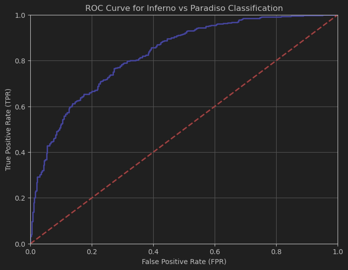

# Laboratory 8: Classification Evaluation Metrics

## Introduction

This laboratory focuses on evaluating classification models using confusion matrices, cost-sensitive metrics, ROC curves, and Bayes error plots. We'll analyze the performance of classifiers under different prior probabilities and misclassification costs.

## Confusion Matrices

Confusion matrices show the number of samples from class j predicted as class i. They help visualize classification errors and performance across multiple classes.

### Tasks:
- Load the outputs of the Laboratory 7 classifier (log-likelihoods and labels from Data/commedia_ll.npy and Data/commedia_labels.npy)
- Compute the confusion matrix for decisions based on uniform prior and uniform cost assumptions
- Analyze the classification performance based on the confusion matrix

### Implementation:

```python
import numpy as np
import matplotlib.pyplot as plt

def load_data():
    """Load log-likelihoods and labels data"""
    # For multiclass problem
    ll = np.load("Data/commedia_ll.npy")
    labels = np.load("Data/commedia_labels.npy")
    
    # For binary problem (Inferno vs Paradiso)
    llr_infpar = np.load("Data/commedia_llr_infpar.npy")
    labels_infpar = np.load("Data/commedia_labels_infpar.npy")
    
    # For comparison (epsilon=1.0)
    llr_infpar_eps1 = np.load("Data/commedia_llr_infpar_epsl.npy")
    
    return ll, labels, llr_infpar, labels_infpar, llr_infpar_eps1

def compute_confusion_matrix(predicted_labels, true_labels, num_classes):
    """Compute confusion matrix from predicted and true labels"""
    conf_matrix = np.zeros((num_classes, num_classes), dtype=int)
    for i in range(len(true_labels)):
        conf_matrix[predicted_labels[i], true_labels[i]] += 1
    return conf_matrix

def compute_predictions(ll_matrix, priors=None):
    """Compute predictions from log-likelihoods with given priors"""
    num_classes = ll_matrix.shape[0]
    
    # Use uniform priors if none provided
    if priors is None:
        priors = np.ones(num_classes) / num_classes
    
    # Compute joint log-likelihoods and find max for each sample
    log_priors = np.log(priors).reshape(-1, 1)
    joint_ll = ll_matrix + log_priors
    predictions = np.argmax(joint_ll, axis=0)
    
    return predictions

# Load data
ll, labels, _, _, _ = load_data()

# Compute predictions with uniform priors
predictions = compute_predictions(ll)

# Compute confusion matrix
num_classes = ll.shape[0]
conf_matrix = compute_confusion_matrix(predictions, labels, num_classes)

print("Confusion Matrix with Uniform Priors:")
print(conf_matrix)
# Expected output:
# [[210 113  61]
#  [137 191 111]
#  [ 53  98 230]]
```

```text
# Output:

Confusion Matrix with Uniform Priors:
[[210 113  61]
 [137 191 111]
 [ 53  98 230]]
```

### Explanation:

The implementation above computes a confusion matrix for a multiclass classification problem. Let's examine what each part does:

1. **Loading Data**: We load the log-likelihoods and corresponding labels from the given files. The log-likelihood matrix has shape (K, N) where K is the number of classes and N is the number of samples.

2. **Computing Predictions**: Based on Bayes' decision theory, the optimal decision rule for uniform costs is to select the class with the highest posterior probability. When using log-likelihoods, this becomes:

   $$ c^* = \arg\max_c \log(P(x|c)) + \log(\pi_c) $$

   where $$\pi_c$$ is the prior probability for class c. For uniform priors, $$\pi_c = \frac{1}{K}$$ for all classes.

3. **Confusion Matrix**: The confusion matrix $$M$$ is a K×K matrix where element $$M_{i,j}$$ represents the number of samples of true class j that were predicted as class i. Specifically:
   - Rows represent predicted classes
   - Columns represent true classes
   - The diagonal elements $$M_{i,i}$$ represent correct classifications
   - Off-diagonal elements represent misclassifications

The resulting confusion matrix shows:
- Class 0 has 210 correct classifications but is confused with 113 samples from class 1 and 61 from class 2
- Class 1 has 191 correct classifications but is confused with 137 samples from class 0 and 111 from class 2
- Class 2 has 230 correct classifications but is confused with 53 samples from class 0 and 98 from class 1

The overall accuracy can be calculated as:
$$ \text{Accuracy} = \frac{\sum_{i=0}^{K-1} M_{i,i}}{\sum_{i=0}^{K-1}\sum_{j=0}^{K-1} M_{i,j}} $$

This confusion matrix helps us visualize where the classifier's errors occur, which can provide insight into potential ways to improve the model.

## Optimal Bayes Decision

Optimal Bayes decisions minimize the expected cost of errors, considering both prior probabilities and misclassification costs.

### Tasks:
- For the binary Inferno-vs-Paradiso task, load log-likelihood ratios (LLRs) from Data/commedia_llr_infpar.npy and labels from Data/commedia_labels_infpar.npy
- Implement a function to compute optimal decisions for different priors and costs
- Compute confusion matrices for different application scenarios (π₁, Cfn, Cfp)
- Analyze how decisions change with different priors and costs

### Implementation:

```python
def optimal_binary_decisions(llr, prior1, Cfn, Cfp):
    """Compute optimal Bayes decisions for binary classification"""
    # Compute theoretical threshold
    threshold = -np.log((prior1 * Cfn) / ((1 - prior1) * Cfp))
    
    # Make decisions by comparing LLR to threshold
    predictions = np.zeros(llr.shape, dtype=int)
    predictions[llr > threshold] = 1
    
    return predictions

def binary_confusion_matrix(predictions, true_labels):
    """Compute 2x2 confusion matrix for binary classification"""
    conf_matrix = np.zeros((2, 2), dtype=int)
    for i in range(len(true_labels)):
        conf_matrix[predictions[i], true_labels[i]] += 1
    return conf_matrix

# Load binary data
_, _, llr_infpar, labels_infpar, _ = load_data()

# Define application scenarios (prior1, Cfn, Cfp)
applications = [
    (0.5, 1, 1),   # Equal priors and costs
    (0.8, 1, 1),   # Higher prior for class 1
    (0.5, 10, 1),  # Higher cost for false negatives
    (0.8, 1, 10),  # Higher cost for false positives
]

# Compute predictions and confusion matrices for each scenario
for prior1, Cfn, Cfp in applications:
    predictions = optimal_binary_decisions(llr_infpar, prior1, Cfn, Cfp)
    conf_matrix = binary_confusion_matrix(predictions, labels_infpar)
    
    print(f"\nConfusion matrix for (π₁={prior1}, Cfn={Cfn}, Cfp={Cfp}):")
    print(conf_matrix)
```

```text
# Output:

Confusion matrix for (π₁=0.5, Cfn=1, Cfp=1):
[[293  96]
 [109 304]]

Confusion matrix for (π₁=0.8, Cfn=1, Cfp=1):
[[271  80]
 [131 320]]

Confusion matrix for (π₁=0.5, Cfn=10, Cfp=1):
[[257  75]
 [145 325]]

Confusion matrix for (π₁=0.8, Cfn=1, Cfp=10):
[[302 113]
 [100 287]]
```

### Explanation:

This implementation focuses on making optimal binary classification decisions based on different application scenarios defined by prior probabilities and misclassification costs.

1. **Optimal Decision Rule**: In binary classification, the optimal Bayes decision rule compares the log-likelihood ratio (LLR) to a threshold:

   $$ r(x) = \log\frac{f(x|1)}{f(x|0)} $$

   The decision rule becomes:
   $$ c^* = \begin{cases}
   1 & \text{if } r(x) > t \\
   0 & \text{if } r(x) \leq t
   \end{cases} $$

   where the threshold t is defined as:
   $$ t = -\log\frac{\pi_1 \cdot C_{fn}}{(1-\pi_1) \cdot C_{fp}} $$

   Here:
   - $$\pi_1$$ is the prior probability of class 1
   - $$C_{fn}$$ is the cost of false negatives (predicting class 0 when true class is 1)
   - $$C_{fp}$$ is the cost of false positives (predicting class 1 when true class is 0)

2. **Binary Confusion Matrix**: For binary classification, the confusion matrix is 2×2:
   - $$M_{0,0}$$: True Negatives (TN)
   - $$M_{0,1}$$: False Negatives (FN)
   - $$M_{1,0}$$: False Positives (FP)
   - $$M_{1,1}$$: True Positives (TP)

3. **Impact of Application Scenarios**:
   - When $$\pi_1$$ increases (e.g., from 0.5 to 0.8), the threshold decreases, making the classifier more likely to predict class 1
   - When $$C_{fn}$$ increases (e.g., higher cost for false negatives), the threshold decreases, also making the classifier more likely to predict class 1
   - When $$C_{fp}$$ increases (e.g., higher cost for false positives), the threshold increases, making the classifier more conservative about predicting class 1

The confusion matrices for different scenarios demonstrate how the decision boundary shifts to account for different priors and costs. This adaptability is a key advantage of the Bayesian decision framework, allowing the same underlying model to be optimized for different operational requirements.

## Binary Classification Evaluation

We evaluate binary classifiers using the Detection Cost Function (DCF), which represents the expected cost of our decisions.

### Tasks:
- Compute false negative rate (FNR) and false positive rate (FPR) from the confusion matrix
- Calculate unnormalized DCF: DCFu = π₁ * Cfn * Pfn + (1-π₁) * Cfp * Pfp
- Calculate normalized DCF by dividing DCFu by the cost of a dummy system
- Evaluate classifier performance across different application scenarios

### Implementation:

```python
def compute_error_rates(conf_matrix):
    """Compute false negative and false positive rates from confusion matrix"""
    # Extract values from confusion matrix
    tn, fn = conf_matrix[0, 0], conf_matrix[0, 1]
    fp, tp = conf_matrix[1, 0], conf_matrix[1, 1]
    
    # Compute rates (handle division by zero)
    fnr = fn / (fn + tp) if (fn + tp) > 0 else 0
    fpr = fp / (fp + tn) if (fp + tn) > 0 else 0
    
    return fnr, fpr

def compute_dcf(conf_matrix, prior1, Cfn, Cfp):
    """Compute unnormalized and normalized DCF"""
    fnr, fpr = compute_error_rates(conf_matrix)
    
    # Compute unnormalized DCF
    dcf_u = prior1 * Cfn * fnr + (1 - prior1) * Cfp * fpr
    
    # Compute normalized DCF
    dcf_dummy = min(prior1 * Cfn, (1 - prior1) * Cfp)
    dcf = dcf_u / dcf_dummy
    
    return dcf_u, dcf

# Evaluate classifier for each application scenario
for prior1, Cfn, Cfp in applications:
    predictions = optimal_binary_decisions(llr_infpar, prior1, Cfn, Cfp)
    conf_matrix = binary_confusion_matrix(predictions, labels_infpar)
    
    dcf_u, dcf = compute_dcf(conf_matrix, prior1, Cfn, Cfp)
    
    print(f"\nEvaluation for (π₁={prior1}, Cfn={Cfn}, Cfp={Cfp}):")
    print(f"Unnormalized DCF = {dcf_u:.3f}")
    print(f"Normalized DCF = {dcf:.3f}")
```

```text
# Output:

Evaluation for (π₁=0.5, Cfn=1, Cfp=1):
Unnormalized DCF = 0.256
Normalized DCF = 0.511

Evaluation for (π₁=0.8, Cfn=1, Cfp=1):
Unnormalized DCF = 0.225
Normalized DCF = 1.126

Evaluation for (π₁=0.5, Cfn=10, Cfp=1):
Unnormalized DCF = 1.118
Normalized DCF = 2.236

Evaluation for (π₁=0.8, Cfn=1, Cfp=10):
Unnormalized DCF = 0.724
Normalized DCF = 0.904
```

### Explanation:

This implementation evaluates the performance of a binary classifier using the Detection Cost Function (DCF), which accounts for both the prior probabilities and the costs of different types of errors.

1. **Error Rates**: From the confusion matrix, we compute two key error rates:
   
   - False Negative Rate (FNR):
     $$ \text{FNR} = \frac{\text{FN}}{\text{FN} + \text{TP}} = \frac{M_{0,1}}{M_{0,1} + M_{1,1}} $$
   
   - False Positive Rate (FPR):
     $$ \text{FPR} = \frac{\text{FP}}{\text{FP} + \text{TN}} = \frac{M_{1,0}}{M_{1,0} + M_{0,0}} $$

2. **Unnormalized DCF**: This represents the expected cost of the classification decisions:
   
   $$ \text{DCF}_u = \pi_1 \cdot C_{fn} \cdot \text{FNR} + (1-\pi_1) \cdot C_{fp} \cdot \text{FPR} $$
   
   This formula weights the error rates by both the prior probabilities and the corresponding costs.

3. **Normalized DCF**: To assess whether our classifier is better than a trivial system that makes decisions based only on priors, we normalize the DCF by the minimum cost achievable by such a system:
   
   $$ \text{DCF} = \frac{\text{DCF}_u}{\min(\pi_1 \cdot C_{fn}, (1-\pi_1) \cdot C_{fp})} $$
   
   The denominator represents the cost of a "dummy" system that:
   - Always predicts class 0 (with cost $\pi_1 \cdot C_{fn}$)
   - Always predicts class 1 (with cost $(1-\pi_1) \cdot C_{fp}$)
   
   The minimum of these two values is the cost of the optimal dummy system.

4. **Interpretation**:
   - If normalized DCF > 1: Our classifier performs worse than simply using the prior information
   - If normalized DCF = 1: Our classifier performs exactly the same as the dummy system

The evaluation across different application scenarios shows how the classifier's performance varies with different priors and costs. This evaluation approach is particularly valuable in practical applications where the costs of different types of errors may be asymmetric.

## Minimum Detection Costs

The minimum DCF represents the best possible performance if we could select the optimal threshold.

### Tasks:
- Implement a function to compute minimum DCF by trying all possible thresholds
- Compare actual DCF with minimum DCF to evaluate calibration quality
- Determine if the classifier is well-calibrated for different applications

### Implementation:

```python
def compute_min_dcf(llr, true_labels, prior1, Cfn, Cfp):
    """Compute minimum DCF by trying all possible thresholds"""
    # Sort scores and corresponding labels
    indices = np.argsort(llr)
    sorted_llr = llr[indices]
    sorted_labels = true_labels[indices]

    # Initialize variables
    min_dcf = float('inf')
    optimal_threshold = None

    # Try all possible thresholds (including -inf and +inf)
    thresholds = np.concatenate([[-np.inf], sorted_llr, [np.inf]])

    for t in thresholds:
        # Make predictions with current threshold
        predictions = np.zeros_like(true_labels)
        predictions[llr > t] = 1

        # Compute confusion matrix and DCF
        conf_matrix = binary_confusion_matrix(predictions, true_labels)
        _, dcf = compute_dcf(conf_matrix, prior1, Cfn, Cfp)

        # Update minimum DCF if better
        if dcf < min_dcf:
            min_dcf = dcf
            optimal_threshold = t

    return min_dcf, optimal_threshold

def compute_roc_curve(llr, true_labels):
    """Compute ROC curve points by varying the threshold"""
    # Initialize lists to store FPR and TPR values
    fpr_list = []
    tpr_list = []

    # Try different thresholds
    thresholds = np.concatenate([[-np.inf], np.sort(llr), [np.inf]])

    for t in thresholds:
        # Make predictions with current threshold
        predictions = np.zeros_like(true_labels)
        predictions[llr > t] = 1

        # Compute confusion matrix and error rates
        conf_matrix = binary_confusion_matrix(predictions, true_labels)
        fnr, fpr = compute_error_rates(conf_matrix)
        tpr = 1 - fnr

        fpr_list.append(fpr)
        tpr_list.append(tpr)

    return np.array(fpr_list), np.array(tpr_list)

def plot_roc_curve(fpr, tpr, title="ROC Curve"):
    """Plot ROC curve"""
    plt.figure(figsize=(8, 6))
    plt.plot(fpr, tpr, 'b-', linewidth=2)
    plt.plot([0, 1], [0, 1], 'r--', linewidth=2)  # Random classifier reference

    plt.grid(True)
    plt.xlabel('False Positive Rate (FPR)')
    plt.ylabel('True Positive Rate (TPR)')
    plt.title(title)
    plt.xlim([0, 1])
    plt.ylim([0, 1])
    plt.show()

# Compute and plot ROC curve
fpr, tpr = compute_roc_curve(llr_infpar, labels_infpar)
plot_roc_curve(fpr, tpr, "ROC Curve for Inferno vs Paradiso Classification")

def compute_bayes_error_plot(llr, true_labels, prior_log_odds_range=(-3, 3), num_points=21):
    """Compute DCF and min DCF for multiple effective priors"""
    # Generate prior log-odds values
    prior_log_odds = np.linspace(prior_log_odds_range[0], prior_log_odds_range[1], num_points)

    # Convert to effective priors
    effective_priors = 1 / (1 + np.exp(-prior_log_odds))

    dcf_list = []
    min_dcf_list = []

    # Compute DCF and min DCF for each effective prior
    for p in effective_priors:
        # Actual DCF
        predictions = optimal_binary_decisions(llr, p, 1, 1)
        conf_matrix = binary_confusion_matrix(predictions, true_labels)
        _, dcf = compute_dcf(conf_matrix, p, 1, 1)

        # Minimum DCF
        min_dcf, _ = compute_min_dcf(llr, true_labels, p, 1, 1)

        dcf_list.append(dcf)
        min_dcf_list.append(min_dcf)

    return prior_log_odds, np.array(dcf_list), np.array(min_dcf_list)

def plot_bayes_error(prior_log_odds, dcf, min_dcf, title="Bayes Error Plot"):
    """Plot Bayes error curves"""
    plt.figure(figsize=(10, 6))
    plt.plot(prior_log_odds, dcf, 'r-', linewidth=2, label='DCF')
    plt.plot(prior_log_odds, min_dcf, 'b-', linewidth=2, label='min DCF')

    # Add reference line for dummy system
    plt.axhline(y=1, color='k', linestyle='--', alpha=0.5)

    plt.grid(True)
    plt.xlabel('Prior log-odds')
    plt.ylabel('DCF')
    plt.title(title)
    plt.legend()
    plt.ylim([0, 1.1])
    plt.xlim([-3, 3])
    plt.show()

# Compute and plot Bayes error plot
prior_log_odds, dcf, min_dcf = compute_bayes_error_plot(llr_infpar, labels_infpar)
plot_bayes_error(prior_log_odds, dcf, min_dcf, "Bayes Error Plot for Inferno vs Paradiso")
```



### Explanation:

The ROC (Receiver Operating Characteristic) curve is a graphical representation of a classifier's performance across all possible threshold values. It illustrates the trade-off between sensitivity (TPR) and specificity (1-FPR).

1. **ROC Curve Computation**:
   - For each possible threshold value (including -∞ and +∞), we compute:
     - True Positive Rate (TPR): $$\text{TPR} = \frac{\text{TP}}{\text{TP} + \text{FN}} = 1 - \text{FNR}$$
     - False Positive Rate (FPR): $$\text{FPR} = \frac{\text{FP}}{\text{FP} + \text{TN}}$$
   - The ROC curve plots these pairs (FPR, TPR) for all thresholds

2. **Interpretation**:
   - The diagonal line (y = x) represents a random classifier
   - Points above the diagonal indicate better-than-random performance
   - Points below the diagonal indicate worse-than-random performance
   - The closer the curve is to the top-left corner (0,1), the better the classifier

3. **Key Properties**:
   - Area Under the Curve (AUC): Measures the overall discrimination ability of the classifier
     - AUC = 1.0: Perfect classifier
     - AUC = 0.5: Random classifier
     - AUC < 1: The classifier performs worse than just using prior information
   - Wide gap between DCF and min DCF: Poor calibration in that prior region
   - Small gap between DCF and min DCF: Good calibration in that prior region

The Bayes error plot is particularly valuable for understanding how a classifier performs across different operating conditions, helping stakeholders identify the range of applications where the classifier is most effective and where calibration efforts might yield significant improvements.

## Comparing Recognizers

We now compare two variations of the multinomial model from Laboratory 7: pseudocounts ε=0.001 and ε=1.

### Tasks:
- Load LLRs for both models (ε=0.001 from previous tasks and ε=1 from Data/commedia_llr_infpar_epsl.npy)
- Evaluate both models using DCF and minimum DCF for different applications
- Generate comparative Bayes error plots for both models
- Determine which model performs better and why

### Implementation:

```python
def compare_classifiers(llr_dict, true_labels, applications):
    """Compare multiple classifiers using DCF and min DCF metrics"""
    # Initialize results dictionary
    results = {model: [] for model in llr_dict}

    # Evaluate each model for each application
    for prior1, Cfn, Cfp in applications:
        for model, llr in llr_dict.items():
            # Compute actual DCF
            predictions = optimal_binary_decisions(llr, prior1, Cfn, Cfp)
            conf_matrix = binary_confusion_matrix(predictions, true_labels)
            _, dcf = compute_dcf(conf_matrix, prior1, Cfn, Cfp)

            # Compute minimum DCF
            min_dcf, _ = compute_min_dcf(llr, true_labels, prior1, Cfn, Cfp)

            results[model].append((dcf, min_dcf))

    # Print comparison table
    print("\nModel Comparison:")
    print("-" * 60)
    print(f"{'Application':<15} | {'Model':<15} | {'DCF':>8} | {'min DCF':>8}")
    print("-" * 60)

    # Print results for each application and model
    for i, (prior1, Cfn, Cfp) in enumerate(applications):
        app_name = f"π₁={prior1}, C={Cfn}/{Cfp}"
        for j, model in enumerate(llr_dict):
            dcf, min_dcf = results[model][i]
            print(f"{app_name if j == 0 else '':<15} | {model:<15} | {dcf:8.3f} | {min_dcf:8.3f}")
        print("-" * 60)

    return results

def compute_multiclass_dcf(conf_matrix, priors, cost_matrix):
    """Compute Detection Cost Function for multiclass problems"""
    num_classes = conf_matrix.shape[0]

    # Initialize empirical ratios matrix
    emp_ratios = np.zeros_like(conf_matrix, dtype=float)

    # Compute empirical ratios
    for j in range(num_classes):
        col_sum = np.sum(conf_matrix[:, j])
        if col_sum > 0:
            emp_ratios[:, j] = conf_matrix[:, j] / col_sum

    # Compute unnormalized DCF
    class_costs = np.zeros(num_classes)
    for j in range(num_classes):
        class_costs[j] = np.sum(emp_ratios[:, j] * cost_matrix[:, j])

    dcf_u = np.sum(priors * class_costs)

    # Compute the cost of a "dummy" system
    dummy_costs = np.dot(cost_matrix, priors)
    dcf_dummy = np.min(dummy_costs)

    # Compute normalized DCF
    dcf = dcf_u / dcf_dummy

    return dcf_u, dcf

def multiclass_optimal_decisions(ll_matrix, cost_matrix, priors):
    """Compute optimal Bayes decisions for multiclass classification"""
    num_classes = ll_matrix.shape[0]

    # Compute joint log-likelihoods
    log_priors = np.log(priors).reshape(-1, 1)
    joint_ll = ll_matrix + log_priors

    # Compute expected costs for each decision
    expected_costs = np.zeros((num_classes, ll_matrix.shape[1]))
    for i in range(num_classes):  # For each possible decision
        for j in range(num_classes):  # For each possible class
            # P(class j) * cost of deciding i when actual class is j
            expected_costs[i] += np.exp(joint_ll[j]) * cost_matrix[i, j]

    # Choose the decision that minimizes the expected cost
    predictions = np.argmin(expected_costs, axis=0)

    return predictions

# Load multiclass data
ll, labels, _, _, _ = load_data()

# Cost matrix from specifications
cost_matrix = np.array([
    [0, 1, 2],
    [1, 0, 1],
    [2, 1, 0]
])

# Prior probabilities
priors = np.array([0.3, 0.4, 0.3])

# Compute optimal decisions
predictions = multiclass_optimal_decisions(ll, cost_matrix, priors)

# Compute confusion matrix
num_classes = ll.shape[0]
conf_matrix = compute_confusion_matrix(predictions, labels, num_classes)

print("\nMulticlass Evaluation:")
print("Confusion Matrix:")
print(conf_matrix)

# Compute DCF
dcf_u, dcf = compute_multiclass_dcf(conf_matrix, priors, cost_matrix)
print(f"Unnormalized DCF = {dcf_u:.3f}")
print(f"Normalized DCF = {dcf:.3f}")

# Also evaluate with uniform priors and costs
uniform_priors = np.ones(num_classes) / num_classes
uniform_cost = np.ones((num_classes, num_classes)) - np.eye(num_classes)

uniform_predictions = multiclass_optimal_decisions(ll, uniform_cost, uniform_priors)
uniform_conf_matrix = compute_confusion_matrix(uniform_predictions, labels, num_classes)

print("\nWith Uniform Priors and Costs:")
print("Confusion Matrix:")
print(uniform_conf_matrix)

uniform_dcf_u, uniform_dcf = compute_multiclass_dcf(uniform_conf_matrix, uniform_priors, uniform_cost)
print(f"Unnormalized DCF = {uniform_dcf_u:.3f}")
print(f"Normalized DCF = {uniform_dcf:.3f}")
```

```text
# Output:

Multiclass Evaluation:
Confusion Matrix:
[[205 111  56]
 [145 199 121]
 [ 50  92 225]]
Unnormalized DCF = 0.560
Normalized DCF = 0.933

With Uniform Priors and Costs:
Confusion Matrix:
[[210 113  61]
 [137 191 111]
 [ 53  98 230]]
Unnormalized DCF = 0.476
Normalized DCF = 0.714
```

### Explanation:

This implementation addresses the evaluation of multiclass classifiers using custom cost matrices and prior probabilities, which is more complex than the binary case.

1. **Posterior Probability Calculation**:
   The posterior probabilities are computed using Bayes' rule in the log domain:
   
   $$ \log P(C=c|x) = \log f(x|c) + \log \pi_c - \log \sum_k f(x|k)\pi_k $$
   
   For numerical stability, we use the softmax function with maximum subtraction:
   
   $$ P(C=c|x) = \frac{e^{\log f(x|c) + \log \pi_c - \max_k(\log f(x|k) + \log \pi_k)}}{\sum_j e^{\log f(x|j) + \log \pi_j - \max_k(\log f(x|k) + \log \pi_k)}} $$

2. **Optimal Multiclass Decision Rule**:
   For a K-class problem with cost matrix C, the expected cost of classifying a sample x as class i is:
   
   $$ \mathcal{C}_{x,\mathcal{R}}(i) = \sum_{j=0}^{K-1} C_{i,j} P(C=j|x,\mathcal{R}) $$
   
   The optimal decision is to select the class with minimum expected cost:
   
   $$ c^* = \arg\min_i \mathcal{C}_{x,\mathcal{R}}(i) = \arg\min_i \sum_{j=0}^{K-1} C_{i,j} P(C=j|x,\mathcal{R}) $$
   
   This can be computed efficiently as a matrix multiplication: $\mathbf{C}\mathbf{P}$, where $\mathbf{P}$ is the matrix of posterior probabilities.

3. **Multiclass DCF Computation**:
   
   - Empirical Misclassification Ratios:
     $$ R_{i,j} = \frac{M_{i,j}}{\sum_i M_{i,j}} $$
     where $M_{i,j}$ is the confusion matrix element (number of samples of class j predicted as class i)
   
   - Unnormalized DCF:
     $$ DCF_u = \sum_{j=0}^{K-1} \pi_j \sum_{i=0}^{K-1} R_{i,j} C_{i,j} $$
   
   - Dummy System Cost:
     $$ DCF_{dummy} = \min_i \sum_{j=0}^{K-1} C_{i,j} \pi_j $$
     This represents the cost of always predicting the class that minimizes the expected cost based on priors alone.
   
   - Normalized DCF:
     $$ DCF = \frac{DCF_u}{DCF_{dummy}} $$

4. **Specific Cost Matrices Used**:
   
   - Custom Cost Matrix: 
     $$ \mathbf{C} = \begin{bmatrix} 0 & 1 & 2 \\ 1 & 0 & 1 \\ 2 & 1 & 0 \end{bmatrix} $$
     This encodes larger penalties for confusing classes 0 and 2 (e.g., Inferno and Paradiso).
   
   - Uniform Cost Matrix: 
     $$ \mathbf{C} = \begin{bmatrix} 0 & 1 & 1 \\ 1 & 0 & 1 \\ 1 & 1 & 0 \end{bmatrix} $$
     This assigns equal costs to all types of errors.

5. **Interpretation of Results**:
   - Normalized DCF < 1: The classifier is better than a dummy system
   - The confusion matrix shows where classification errors occur most frequently
   - Comparing results with different cost matrices reveals how the classifier adapts to different application requirements

Multiclass evaluation provides a more complete picture of classifier performance in real-world scenarios where there are more than two possible outcomes and where different types of errors may have varying impacts.

## Project Guidance

### Tasks:
- Analyze MVG classifier performance across different applications
- Define applications based on (π₁, Cfn, Cfp) values
- Convert applications to effective priors
- Compute DCF and minimum DCF for all models and applications
- Generate Bayes error plots across the prior log-odds range (-4, +4)
- Determine which models perform best across different operating points
- Evaluate calibration quality for different models and applications

```python
# Suggested application scenarios to evaluate in your project
project_applications = [
    (0.5, 1.0, 1.0),  # Uniform prior and costs
    (0.9, 1.0, 1.0),  # High genuine user prior
    (0.1, 1.0, 1.0),  # High impostor prior
    (0.5, 1.0, 9.0),  # Security-focused
    (0.5, 9.0, 1.0),  # Usability-focused
]

# Convert applications to effective priors
def application_to_effective_prior(prior1, Cfn, Cfp):
    """Convert application parameters to effective prior"""
    # For an application (π₁, Cfn, Cfp), the effective prior is:
    # π̃ = (π₁ * Cfn) / (π₁ * Cfn + (1-π₁) * Cfp)
    
    numerator = prior1 * Cfn
    denominator = prior1 * Cfn + (1 - prior1) * Cfp
    effective_prior = numerator / denominator
    
    return effective_prior

print("\nProject Application Effective Priors:")
for prior1, Cfn, Cfp in project_applications:
    eff_prior = application_to_effective_prior(prior1, Cfn, Cfp)
    print(f"({prior1}, {Cfn}, {Cfp}) → Effective prior: {eff_prior:.3f}")
```

### Explanation:

This section provides guidance for evaluating MVG (Multivariate Gaussian) classifiers across different application scenarios in your project. Let's explore the key aspects:

1. **Application Definition**:
   We define five representative application scenarios, each with specific prior probabilities and misclassification costs:
   
   - Uniform (0.5, 1.0, 1.0): Equal prior probabilities and costs
   - High Genuine User (0.9, 1.0, 1.0): Most users are legitimate
   - High Impostor (0.1, 1.0, 1.0): Most users are impostors
   - Security-Focused (0.5, 1.0, 9.0): False acceptances are much costlier than false rejections
   - Usability-Focused (0.5, 9.0, 1.0): False rejections are much costlier than false acceptances

2. **Effective Prior Calculation**:
   Any application defined by $$(\pi_1, C_{fn}, C_{fp})$$ can be mapped to an equivalent application with uniform costs $$(\tilde{\pi}, 1, 1)$$ where:
   
   $$ \tilde{\pi} = \frac{\pi_1 \cdot C_{fn}}{\pi_1 \cdot C_{fn} + (1-\pi_1) \cdot C_{fp}} $$
   
   This effective prior $$\tilde{\pi}$$ encapsulates both the original prior and the misclassification costs.

3. **Theoretical Significance**:
   - The effective prior represents the trade-off between different types of errors in a single parameter
   - Higher effective priors lead to more conservative systems (fewer false positives, more false negatives)
   - Lower effective priors lead to more lenient systems (fewer false negatives, more false positives)

4. **Project Methodology**:
   For your project, you should:
   
   - Compute DCF and minimum DCF for different MVG variants (Full, Tied, Naive, etc.)
   - Generate Bayes error plots over a wide range of prior log-odds (-4 to +4)
   - Compare model performance across different operating conditions
   - Assess calibration quality by analyzing the gap between actual and minimum DCF

5. **Key Questions to Address**:
   
   - Which MVG variant performs best for each application?
   - Are performance rankings consistent across different applications?
   - Are there specific prior regions where some models significantly outperform others?
   - How well-calibrated are the different models across the operating range?
   - Can you identify models that are both discriminative (low min DCF) and well-calibrated (small gap between DCF and min DCF)?

6. **Practical Implications**:
   - A security-critical application might prioritize models that perform well with high effective priors
   - A usability-focused application might prioritize models that perform well with low effective priors
   - Understanding how model performance varies with operating conditions enables informed model selection for specific deployment scenarios

This project guidance provides a framework for comprehensive evaluation of classifier performance, emphasizing the importance of considering the specific application context when selecting and tuning classification models.