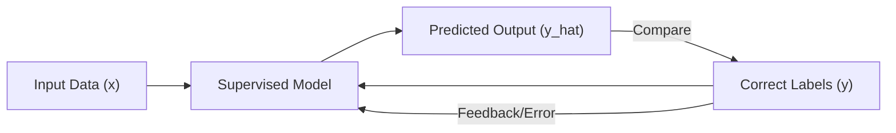
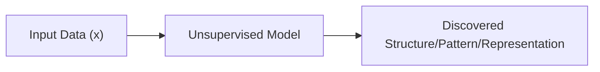
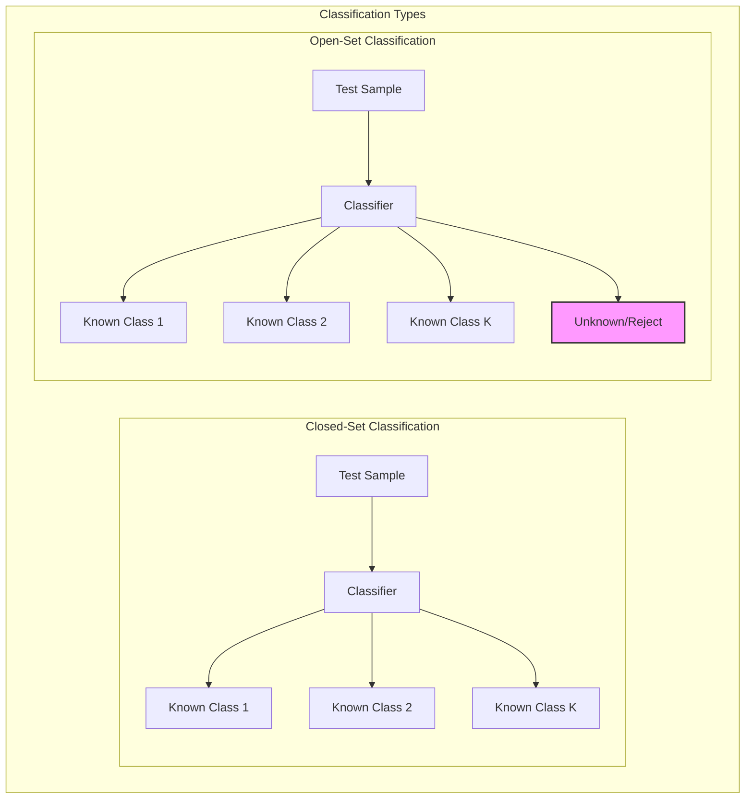
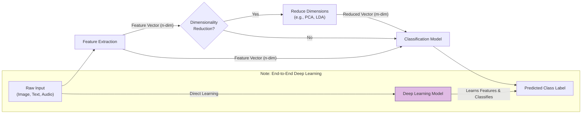
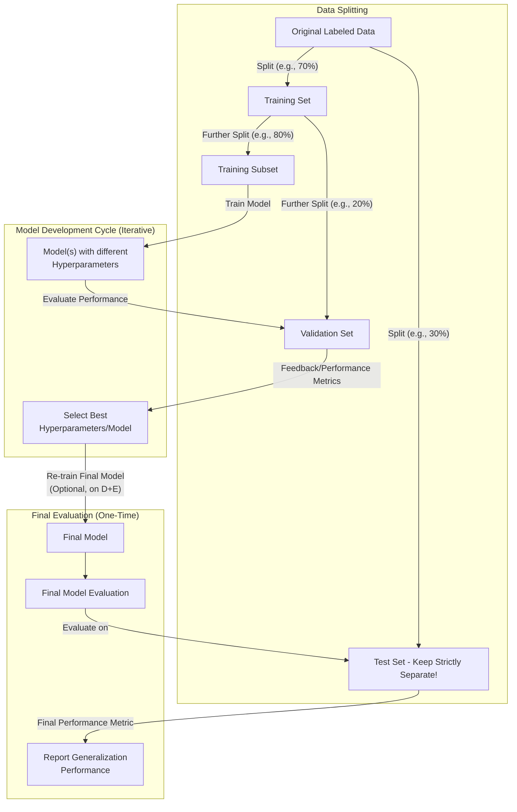
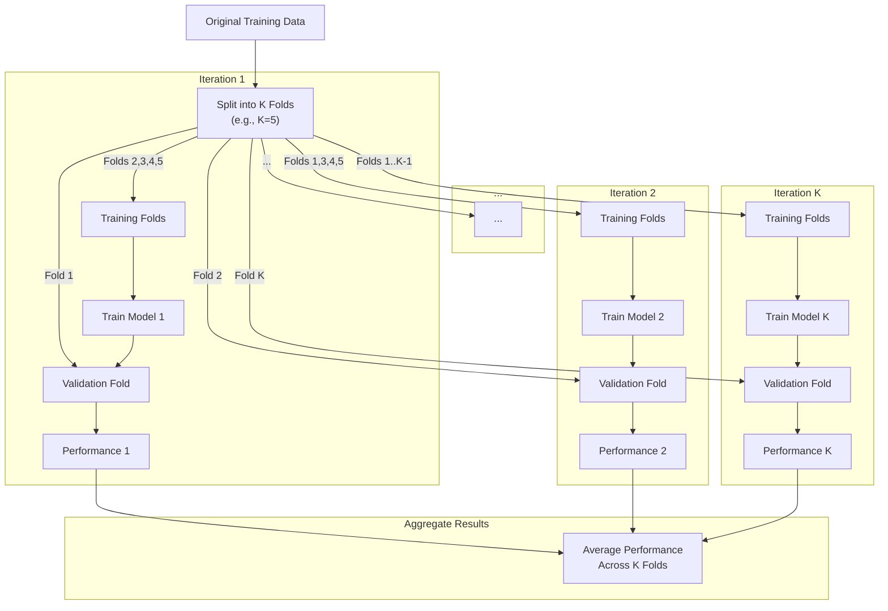

# Machine Learning and Pattern Recognition

> **Author**
Marc'Antonio Lopez
AI & Data Analytics student at Polytechnic University of Turin

## Introduction to Machine Learning and Pattern Recognition

This document provides a comprehensive overview of the fundamental concepts, typical tasks, and different learning paradigms within the fields of Machine Learning (ML) and Pattern Recognition (PR).

### Pattern Recognition (PR)

**Pattern Recognition (PR)** is the automated process of identifying meaningful patterns and structures within data using various algorithms. Its core objective is to leverage these identified patterns to make informed decisions or initiate specific actions. PR is most commonly applied to tasks such as data classification.

### Machine Learning (ML)

**Machine Learning (ML)** is a field dedicated to equipping computer systems with the ability to learn from data. A widely cited definition by T. M. Mitchell provides a clear understanding of what it means for a computer program to "learn":

> A computer program is said to **learn** from **experience** ($E$) with respect to some class of **tasks** ($T$) and **performance measure** ($P$), if its performance at tasks in $T$, as measured by $P$, **improves** with experience $E$.

### Relationship between PR and ML:

The relationship between Pattern Recognition and Machine Learning is foundational: **Pattern Recognition is a primary application area of Machine Learning.** Machine Learning provides the powerful algorithms and techniques that enable the identification of patterns and the execution of PR tasks such as classification and prediction. In essence, ML is the engine that drives PR.

## Defining Models for Learning

To uncover complex patterns and structures hidden within data, the models we use must be **adaptive**. Unlike systems based on rigid, predefined rules, Machine Learning models are designed to:

*   **Adjust Internal Settings:** They modify their internal parameters or structure.
*   **Use Observed Data (Experience $E$):** This adjustment is driven by the data they observe and process.
*   **Improve Performance ($P$):** The ultimate goal is to enhance their effectiveness.
*   **On Specific Tasks ($T$):** This improvement is measured against clearly defined tasks.

This adaptability allows ML models to learn from examples rather than being explicitly programmed for every possible scenario.

## Common Machine Learning Tasks

Machine Learning encompasses several fundamental tasks, each designed to solve different types of problems:

### Classification

**Definition:** Classification is the task of assigning a given data sample to one of several predefined, **discrete categories or classes**.

*   **Input:** The model receives an **input vector** (also known as a **feature vector**), typically denoted as $x$. This vector contains numerical representations of the attributes or characteristics of the data sample.
*   **Output:** The model produces a **discrete class label**, denoted as $y$. This label is chosen from a finite set of possible categories, for example, $\{C_1, C_2, \dots, C_K\}$.
*   **Goal:** The objective is to learn a mapping function, $f$, that transforms the input vector $x$ into an accurate predicted class label. This function can be represented as: $f: \text{Input Space} \rightarrow \{C_1, \dots, C_K\}$. The function should generalize well to correctly classify unseen inputs.
*   **Applications:**
    *   **Image recognition:** Classifying an image as containing a "cat" or a "dog."
    *   **Face identification:** Determining if a face belongs to a known individual.
    *   **Spam detection:** Labeling an email as "spam" or "not spam."
    *   **Medical diagnosis:** Classifying a patient's condition based on symptoms and test results.
*   **Example of Classification:** A classic example is classifying different species of Iris flowers (e.g., Setosa, Versicolor, Virginica) based on their petal and sepal measurements.

### Regression

**Definition:** Regression is the task of predicting a **continuous numerical value**. Unlike classification, the output is not a discrete category but a quantity that can take any value within a range.

*   **Input:** Similar to classification, the model takes an input vector $x$.
*   **Output:** The model produces a **real-valued scalar or vector**, denoted as $y$. This means the output could be a single number (e.g., a price) or multiple numbers (e.g., coordinates).
*   **Goal:** The objective is to learn a mapping function, $f$, that transforms the input vector $x$ into an accurate continuous output. This function can be represented as: $f: \text{Input Space} \rightarrow \mathbb{R}^d$ (where $\mathbb{R}^d$ means a d-dimensional real number space). The function should accurately predict continuous outputs for new, unseen inputs.
*   **Applications:**
    *   **Predicting house prices:** Estimating the monetary value of a house based on its features (size, location, number of rooms, etc.).
    *   **Forecasting stock values:** Predicting future stock prices based on historical data and market indicators.
    *   **Modeling temperature:** Predicting the temperature based on sensor readings.
*   **Example of Regression:** Fitting a line or a curve to a set of data points to predict continuous values for new input points (e.g., predicting the weight of a person based on their height).

### Density Estimation

**Definition:** Density estimation is the task of modeling the input data's underlying **probability distribution**, typically represented as $P(x)$. This means estimating the function that describes how likely different input values are.

*   **Goal:** The primary goal is to understand the inherent structure of the data, including where data points are concentrated, how they cluster, and what their overall statistical properties are.
*   **Applications:**
    *   **Anomaly detection:** Points with very low estimated probability are considered unusual or anomalous.
    *   **Data exploration:** Provides insights into the distribution and relationships within the data.
    *   **Generative modeling:** Once the underlying distribution is learned, it can be used to sample and create new data points that resemble the original training data.
    *   **Building block for other ML models:** Density estimation is a core component in many other machine learning models, such as generative classifiers (where $P(x|C_k)$ is modeled).
*   **Example of Density Estimation:** Estimating the Probability Density Function (PDF) that best describes a dataset's distribution. This is often visually represented by drawing smooth curves (for 1D data) or contours (for 2D data) that encapsulate the data points.

## Supervised vs. Unsupervised Learning: Learning Paradigms

Machine Learning algorithms are broadly categorized into different **learning paradigms** based on the nature of the training data they receive, or more precisely, the "experience" ($E$) they learn from.

### Supervised Learning

*   **Definition:** Supervised learning algorithms are trained on datasets that consist of **input-output pairs**. For each input data sample $x_i$, there is a corresponding known, desired output $y_i$, which acts as a "label" or "target."
*   **Goal:** The primary goal is to learn a function $f$ that can accurately map new, unseen inputs $x$ to their correct outputs $y$. The emphasis is on the model's ability to **generalize** from the training examples to make correct predictions on new data.
*   **Common Tasks:** The most common tasks addressed by supervised learning are **Classification** (where the output is discrete) and **Regression** (where the output is continuous).
*   **Analogy:** This paradigm is often compared to a student learning with a "teacher" who provides correct answers or feedback for every practice problem.



**Explanation of Supervised Learning Diagram:**
1.  **Input Data (x):** The raw features are fed into the Supervised Model.
2.  **Supervised Model:** The model processes the input and generates a **Predicted Output (y_hat)**.
3.  **Correct Labels (y):** The predicted output is then compared against the actual, known correct labels.
4.  **Feedback/Error:** Any discrepancy or error between the predicted and correct output generates feedback.
5.  **Adjust Model:** This feedback is used by the model to adjust its internal parameters (e.g., weights, biases) to reduce future errors, thereby improving its performance on the task.

### Unsupervised Learning

*   **Definition:** Unsupervised learning algorithms are provided only with **input data $x_i$**, without any corresponding output labels or "correct answers." The model must find patterns on its own.
*   **Goal:** The primary goal is to discover intrinsic structures, hidden patterns, underlying relationships, or meaningful representations directly within the input data. The model tries to make sense of the data without explicit guidance.
*   **Common Tasks:**
    *   **Clustering:** Grouping similar data points together.
    *   **Density Estimation:** Modeling the probability distribution of the data.
    *   **Dimensionality Reduction:** Reducing the number of features while retaining important information (e.g., Principal Component Analysis - PCA).
    *   **Feature Learning:** Automatically discovering useful transformations of the raw data.
*   **Analogy:** This paradigm is like learning by pure observation, where a student tries to categorize or understand concepts without any explicit teaching or labels.



**Explanation of Unsupervised Learning Diagram:**
1.  **Input Data (x):** Raw input data, without any associated labels, is fed into the Unsupervised Model.
2.  **Unsupervised Model:** The model analyzes the input data.
3.  **Discovered Structure / Pattern / Representation:** The model identifies and outputs intrinsic structures, patterns, or new, more meaningful representations of the data on its own.

### Relationship Between Learning Paradigms

*   **Preprocessing Role:** Unsupervised learning methods (such as dimensionality reduction or feature extraction) are frequently used to preprocess data. This prepared data is then fed into supervised learning algorithms, which can enhance the performance of classifiers or regressors by reducing noise, handling high dimensionality, or extracting more relevant features.
*   **Bridging Paradigms:** Some techniques, like **density estimation**, inherently bridge both paradigms. For example, in **supervised generative classifiers**, we often model the class-conditional density $P(x|C_k)$ (which is a form of density estimation, an unsupervised task performed *within* each class) to enable supervised classification.
*   **Focus of This Course:** For the scope of this course, the primary focus will be on **Classification** (a supervised task) and **Density Estimation** (a task that is fundamental to both supervised and unsupervised methods).

## Assigning Patterns to Classes: The Classification Problem

In the context of classification, 'classes' are distinct categories or properties to which data points are assigned.

**Practical Examples of Classification Problems:**

*   **Image Analysis:** Given an image, what object is depicted within it? (e.g., classifying an image as a "cat", "dog", "car", etc.)
*   **Text Processing:** Given a document or a piece of text, what language is it written in? (e.g., "English", "Italian", "Spanish")
*   **Weather Prediction:** Given current meteorological data, what will tomorrow's weather be? (e.g., "Sunny", "Cloudy", "Rainy", "Snowy")

### Types of Classification Problems

Classification problems can be categorized by the number of distinct classes involved:

*   **Binary Classification:** This type of problem involves assigning patterns to one of precisely **two** predefined classes.
    *   *Examples:*
        *   **Spam detection:** Classifying an email as either "spam" or "not spam."
        *   **Medical test results:** Determining if a test result is "positive" or "negative" for a disease.
        *   **Identity verification:** Verifying if a person is "genuine" or an "impostor."
*   **Multiclass Classification:** This type of problem involves assigning patterns to one of **three or more** predefined classes.
    *   *Examples:*
        *   **Handwritten digit recognition:** Classifying a handwritten digit image as one of the numbers from 0 to 9 (10 classes).
        *   **Object categorization:** Identifying an object in an image as a "cat," "dog," "car," "tree," etc.
        *   **Speech recognition:** Identifying spoken words from a vocabulary of many words.

### Closed-Set vs. Open-Set Classification

Another important distinction in classification is whether the set of possible classes is exhaustive or not:

*   **Closed-Set Classification:**
    *   **Assumption:** In closed-set classification, it is explicitly assumed that all incoming test samples *must* belong to one of the classes the model was trained on $\{C_1, \dots, C_K\}$. There is no option for an "unknown" or novel class.
    *   **Application:** Suitable for problems where all possible categories are known and exhaustively covered in the training data (e.g., recognizing specific people from a known group of employees).

*   **Open-Set Classification:**
    *   **Assumption:** Conversely, open-set classification acknowledges that test samples might originate from classes *not observed* during training. Therefore, the classifier must be capable of outputting an "unknown" or "none of the above" category.
    *   **Application:** This is crucial for real-world scenarios requiring **novelty detection** (identifying something new or unexpected) or **out-of-distribution detection** (identifying data that does not fit any of the known patterns).



**Explanation of Closed-Set vs. Open-Set Classification Diagram:**
The diagram illustrates two classifier scenarios. In **Closed-Set Classification**, a "Test Sample" is expected to be assigned to one of the "Known Classes" (Class 1, Class 2, ..., Class K) the classifier was trained on, with no other options. Conversely, in **Open-Set Classification**, a "Test Sample" can still be assigned to a "Known Class," but an additional "Unknown / Reject" output option exists for samples that do not sufficiently match any of the trained classes.

## Stages of a Typical Classification System

Most classification systems, regardless of their complexity, follow a pipeline that transforms raw input data into a final class prediction through a series of sequential stages.

1.  **Feature Extraction:**
    *   **Purpose:** This initial stage converts raw, unstructured input data (such as image pixels, raw text, or audio waveforms) into a structured numerical representation called a **feature vector** $x \in \mathbb{R}^n$. This vector consists of `n` numerical attributes suitable for processing by machine learning algorithms.
    *   **Importance:** This stage often requires significant **domain knowledge** to identify and select the most relevant attributes that capture essential information from the raw data.
    *   **Examples:**
        *   For images: Histograms of pixel intensities, statistical summaries of textures, or specialized features like SIFT or HOG.
        *   For text: Term Frequency-Inverse Document Frequency (TF-IDF) vectors.
        *   For audio: Mel-Frequency Cepstral Coefficients (MFCCs).

2.  **Dimensionality Reduction (Optional but Recommended):**
    *   **Purpose:** This stage, if applied, aims to reduce the number of features in the vector from `n` to `m` ($m \le n$), striving to preserve as much crucial information as possible.
    *   **Benefits:** It is used to:
        *   Mitigate the **"curse of dimensionality"** (explained below).
        *   Reduce computational cost and memory requirements for subsequent stages.
        *   Remove noise and redundancy from the feature vector.
        *   Potentially improve the generalization ability of the model.
    *   **Common Methods:** Principal Component Analysis (PCA), Linear Discriminant Analysis (LDA), and various feature selection techniques.
    *   **Output:** The result of this stage is a reduced feature vector $x' \in \mathbb{R}^m$.

3.  **Classification:**
    *   **Purpose:** This is the core stage where the processed feature vector ($x$ or $x'$) is used to assign a final class label $\hat{y} \in \{C_1, \dots, C_K\}$.
    *   **Process:** A previously trained **decision function** or **classification model** (e.g., a Support Vector Machine (SVM), Logistic Regression, a Neural Network, or k-Nearest Neighbors (k-NN)) takes the feature vector as input and applies its learned logic to make the class prediction.



**Explanation of Classification Stages Diagram:**
The diagram illustrates the typical flow. "Raw Input" first undergoes "Feature Extraction" to produce an "n-dimensional Feature Vector." This vector may optionally pass through "Dimensionality Reduction" to become an "m-dimensional Reduced Vector." Both the original or reduced vector then feed into a "Classification Model," which outputs the "Predicted Class Label." A special note highlights that "Deep Learning Models" can often perform "Feature Extraction" and "Classification" in a single, integrated "End-to-End" process.

### Feature Extraction Examples

1.  **Image Data:**
    *   **Basic Method:** The simplest form involves "flattening" a 2D pixel intensity matrix into a single, long 1D vector. For example, a 10x10 grayscale image becomes a 100-element vector.
    *   **Advanced Methods:** More sophisticated techniques extract higher-level attributes like texture patterns, distinct geometric shapes, or features automatically learned by deep convolutional neural networks (CNNs).

    **Example of Image Flattening:**

    ```
    Original Image (conceptual pixel matrix, e.g., 2x3 for simplicity):
    [116 133 149]
    [186 107 126]

    Resulting Feature Vector (1D array):
    [116, 133, 149, 186, 107, 126]
    ```

2.  **Text Data:**
    *   **Common Methods:** Often uses techniques like **Bag-of-Words** or **TF-IDF (Term Frequency-Inverse Document Frequency)**.
    *   **Process:** These methods convert raw text documents into numerical vectors. Each dimension in the vector typically corresponds to a unique word in the predefined vocabulary, and the value in that dimension represents the word's frequency or its importance within the document relative to the entire corpus.

    **Example of Bag-of-Words (Term Frequency):**

    ```
    Document Example: "the cat sat on the mat"
    Assumed Vocabulary: ["cat", "dog", "mat", "on", "sat", "the"]

    Corresponding Term Frequency (TF) Vector: [1.0, 0.0, 1.0, 1.0, 1.0, 2.0]
    (Interpretation: The word "cat" appears 1 time, "dog" 0 times, "mat" 1 time, "on" 1 time, "sat" 1 time, and "the" 2 times in the document.)
    ```

### Dimensionality Reduction Revisited

*   **Purpose Summary:** To reiterate, dimensionality reduction serves multiple crucial purposes in machine learning:
    *   Compressing data to save storage and computational resources.
    *   Removing noise and redundant information from features.
    *   Simplifying complex models, making them easier to train and interpret.
    *   Combating overfitting, a common problem in high-dimensional spaces.
    *   Aiding visualization of high-dimensional data by projecting it into 2D or 3D.

*   **Key Challenges Addressed by Dimensionality Reduction:**

    *   **Curse of Dimensionality:** This phenomenon refers to the various problems that arise when dealing with data in very high-dimensional spaces. Specifically, as the number of features (dimensions) increases:
        *   Data points become extremely sparse, making it difficult to find meaningful patterns or neighbors.
        *   Distances between data points (which many ML algorithms rely on) tend to become less meaningful or distinguishable.
        *   The amount of data required to effectively generalize (i.e., fill the space sufficiently) grows exponentially with the number of dimensions.
    *   **Overfitting:** This occurs when a machine learning model becomes excessively complex and learns the training data (including its noise and specific quirks) too precisely. While this leads to excellent performance on the training data, the model fails to generalize to new, unseen data, resulting in poor performance in real-world deployment.

**Visualizing the Model Complexity Trade-off:**

<p align="center">

| Model Complexity | Training Error | Test (Generalization) Error | Typical Behavior                                              |
| :--------------- | :------------- | :-------------------------- | :------------------------------------------------------------ |
| **Low (Too Simple)** | High           | High                        | **Underfitting:** The model is too simple to capture the underlying patterns in the data, performing poorly on both training and test sets. |
| **Optimal**      | Low            | Low                         | **Good Fit:** The model finds the right balance, effectively learning patterns from training data and generalizing well to unseen data. |
| **High (Too Complex)** | Very Low       | High                        | **Overfitting:** The model learns noise along with patterns in the training data, leading to excellent training performance but poor performance on unseen data. |

</p>

### Dimensionality Reduction Techniques

<p align="center">

| Technique                            | Type            | Goal / Focus                                                                                               | Example Application                                     |
| :----------------------------------- | :-------------- | :--------------------------------------------------------------------------------------------------------- | :------------------------------------------------------ |
| **Principal Component Analysis (PCA)** | Unsupervised    | Aims to find new dimensions (principal components) that maximize the variance retained in the reduced space. It ignores class labels. | Image compression, noise reduction, data visualization. |
| **Linear Discriminant Analysis (LDA)** | Supervised      | Aims to find new dimensions that maximize the separation between different classes. It explicitly uses class labels. | Face recognition, biomedical signal processing, customer churn prediction. |
| **Other Techniques**                 | Various         | Include Feature Selection (selecting a subset of original features), Manifold Learning (e.g., t-SNE, Isomap), and various autoencoder architectures. | Wide range of applications, including data exploration and complex pattern discovery. |

</p>

---

## Decision Functions and Model Types

At the heart of the classification stage is the **decision function** (or the classification model itself). This component takes the processed feature vector ($x$ or $x'$) as input and outputs a predicted class label $\hat{y}$.

Machine learning models used for classification can be broadly categorized by how they arrive at this prediction:

1.  **Discriminant Model (Direct Mapping):**
    *   **Mechanism:** These models directly learn a function $f(x)$ that maps the input feature vector $x$ to the predicted class label $\hat{y}$.
    *   **Output:** $\hat{y} = f(x)$.
    *   **Examples:** Simplistic models like the Perceptron or elementary Decision Trees. They provide a direct class assignment without explicit scores or probabilities.

2.  **Discriminative Non-Probabilistic Model (Scores):**
    *   **Mechanism:** These models learn a function $f(x)$ that outputs internal "scores" for each class, or a score indicating the distance to a decision boundary. The final class decision is then made by comparing these scores or applying a threshold. They do not typically output explicit probabilities.
    *   **Examples:** Support Vector Machines (SVMs) which output a signed distance to the hyperplane, or simple threshold-based classifiers.

3.  **Discriminative Probabilistic Model:**
    *   **Mechanism:** These models directly estimate the **posterior probability** $P(C_k | x)$, which is the probability of class $C_k$ given the input features $x$.
    *   **Decision Rule:** The final classification decision is typically made using the **Maximum A Posteriori (MAP) rule**, meaning selecting the class $C_k$ that has the highest posterior probability.
    *   **Examples:** Logistic Regression, Softmax-based Neural Networks (common for multiclass classification).

4.  **Generative Probabilistic Model:**
    *   **Mechanism:** These models take an indirect approach. Instead of directly modeling the posterior $P(C_k | x)$, they first learn two components:
        *   The **class-conditional density** $P(x | C_k)$: This describes the probability distribution of the input features *within* each class $C_k$.
        *   The **class prior probability** $P(C_k)$: This describes the overall likelihood of each class occurring in the population.
    *   **Decision Rule:** They then use **Bayes' Theorem** to compute the posterior probability $P(C_k | x)$ for each class. The final decision is again made via the **MAP rule**.
    $$ P(C_k | x) = \frac{P(x | C_k) P(C_k)}{P(x)} = \frac{P(x | C_k) P(C_k)}{\sum_j P(x | C_j) P(C_j)} $$
    *   **Examples:** Naive Bayes, Gaussian Mixture Models (GMMs), Hidden Markov Models (HMMs).

### Generalization Error

A fundamental objective in machine learning is to achieve good **generalization**. This means designing models that can make accurate predictions not only on the data they were trained on but, more importantly, on *new, previously unseen data*.

*   **Underfitting:** Occurs when a model is too simplistic or has not been trained sufficiently. It fails to capture the underlying patterns in the training data, leading to high errors on both the training and unseen data.
*   **Overfitting:** Occurs when a model is excessively complex and learns the training data, including its noise and idiosyncrasies, too precisely. While it performs very well on the training data, it fails to generalize to new data, resulting in poor real-world performance.

Achieving good generalization requires finding the appropriate **model complexity**. This is often controlled through techniques like hyperparameter tuning or regularization methods.

---

## Training and Inference Phases

Machine Learning models typically operate through two distinct and crucial phases:

### Training (Learning) Phase

*   **Goal:** The primary goal of this phase is for the model to **learn its parameters or internal structure** from a labeled dataset. This dataset is called the **training set**, typically represented as $D = \{(x_1, y_1), \dots, (x_N, y_N)\}$, where $x_i$ is an input and $y_i$ is its corresponding known label.
*   **Parametric Models:** These models assume a fixed, predefined structure (e.g., a linear equation or a neural network architecture) entirely defined by a set of adjustable **parameters** ($\theta$). Training involves finding the optimal values for these parameters (e.g., the best weights in logistic regression or neural networks) that best fit the training data.
*   **Non-Parametric Models:** In contrast, the complexity of non-parametric models (e.g., k-Nearest Neighbors or kernel density estimators) grows with the size of the data. They don't have a fixed set of parameters but instead directly use the training samples themselves, or relationships between them, to make predictions.
*   **Output:** The output of the training phase is a **fully trained model**, often represented by its optimal parameters $\theta^*$.

### Inference (Prediction / Testing) Phase

*   **Goal:** The objective of this phase is to **use the trained model to make predictions** on new, previously unseen input samples, typically denoted as $x_t$. The model applies the knowledge it gained during the training phase.
*   **Process:**
    *   **Generative Models:** For a new sample $x_t$, generative models first compute the **likelihoods** $P(x_t | C_k, \theta^*)$ for each class using their learned distributions. These likelihoods are then combined with the **class prior probabilities** $P(C_k)$. Finally, **Bayes' Theorem** is applied to calculate the **posterior probability** $P(C_k | x_t, \theta^*)$ for each class, and the class with the highest posterior (MAP rule) is chosen as the prediction.
    *   **Discriminative Models:** For a new sample $x_t$, discriminative models directly compute the **posterior probability** $P(C_k | x_t, \theta^*)$ or simply output class "scores" $f(x_t, \theta^*)$. A decision rule (e.g., picking the class with the highest probability/score) is then applied to make the prediction.

---

## The Bayesian Approach (Brief Overview)

The **Bayesian approach** to machine learning offers a distinct perspective by treating model parameters $\theta$ not as fixed, unknown constants, but as **random variables** that themselves have probability distributions. This framework naturally allows for quantifying uncertainty.

1.  **Prior Distribution $P(\theta | M)$:** This distribution represents your initial beliefs or knowledge about the possible values of the model parameters $\theta$ *before* observing any training data. It reflects your assumptions or existing expertise about the model $M$.
2.  **Likelihood $P(D | \theta, M)$:** This term quantifies the probability of observing the specific training data $D$ *given* a particular set of parameter values $\theta$ for the model $M$. It measures how well the chosen parameters explain the observed data.
3.  **Posterior Distribution $P(\theta | D, M)$:** This is the core of Bayesian inference. It represents the **updated beliefs** about the model parameters $\theta$ *after* incorporating the evidence from the training data $D$. It is calculated using **Bayes' Theorem**:
    $$ P(\theta | D, M) = \frac{P(D | \theta, M) P(\theta | M)}{P(D | M)} \propto \text{Likelihood} \times \text{Prior} $$
    The denominator, $P(D | M)$, is a normalizing constant (often called "evidence" or "marginal likelihood") that sums/integrates over all possible parameter values and ensures the posterior is a valid probability distribution.
4.  **Inference (Prediction):** When making predictions for a new sample $x_t$, the Bayesian approach does not rely on a single "best" set of parameters. Instead, it **averages predictions over the entire posterior distribution of parameters**. This means it considers all possible parameter values weighted by their posterior probabilities, thereby inherently accounting for the uncertainty in the parameter estimates.
    $$ P(y_t | x_t, D, M) = \int P(y_t | x_t, \theta, M) P(\theta | D, M) d\theta $$

*   **Pros of Bayesian Approach:**
    *   Naturally quantifies uncertainty in predictions and parameters.
    *   Can often perform better than frequentist methods, especially with smaller datasets, by leveraging prior knowledge.
    *   Provides full predictive distributions, not just point estimates.
*   **Cons of Bayesian Approach:**
    *   Can be **computationally intensive**, as the integral required for calculating the posterior and predictions often does not have a closed-form solution and requires complex approximation methods (e.g., Markov Chain Monte Carlo (MCMC) or Variational Inference).
*   **Scope:** Due to its computational complexity, a detailed treatment of the Bayesian approach is **not included** in this course.

---

## Model Evaluation: Assessing Performance

After a machine learning model is trained, it's crucial to rigorously assess its performance, particularly its ability to generalize to new, unseen data. This requires dedicated datasets and appropriate evaluation metrics.

### Test Set

*   **Purpose:** The **test set** is used solely to evaluate the **final trained model** on data it has **never seen before** during any part of the training or tuning process. This simulates real-world deployment scenarios.
*   **Requirement:** It **must be kept strictly separate** and untouched from all training and validation procedures until the very end of the model development cycle.
*   **Benefit:** Provides an **unbiased and realistic estimate** of the model's true **generalization performance** on new data. If the test set is "leaked" into earlier stages, the performance estimate will be artificially optimistic.
*   **Characteristics:** The test set should ideally mirror the distribution of data that the model is expected to encounter in actual use.

### Validation Set

*   **Purpose:** The **validation set** serves a distinct purpose. It is used **during** the model development phase for critical tasks:
    *   **Hyperparameter Tuning:** Selecting the optimal values for hyperparameters—parameters that are not learned directly from the data but are set *before* training (e.g., the learning rate in neural networks, the number of neighbors `k` in k-NN, or the regularization strength).
    *   **Model Selection:** Choosing between different types of models (e.g., deciding whether an SVM or a Logistic Regression model is better for a specific problem) or between different feature sets.
    *   **Early Stopping:** Monitoring the model's performance on the validation set during training and stopping the training process early if performance starts to degrade (indicating overfitting) to prevent further overfitting.
*   **Creation:** The validation set is created by splitting a portion from the **original training dataset**. It is not part of the data used for parameter learning itself.
*   **Importance:** Using a separate validation set prevents "information leak" from the test set into the development process. This ensures that the final evaluation on the test set remains unbiased and truly indicative of the model's generalization capabilities.



**Explanation of Data Splitting and Evaluation Diagram:**
1.  **Data Splitting:** The "Original Labeled Data" is initially split into a "Training Set" and a "Test Set." The "Test Set" is explicitly marked to be kept "Strictly Separate." The "Training Set" is then further split into a "Training Subset" (for learning model parameters) and a "Validation Set" (for hyperparameter tuning and model selection).
2.  **Model Development Cycle:** This is an iterative process. Models are "Train[ed]" on the "Training Subset." Different models or models with varying "Hyperparameters" are created. Their performance is then "Evaluate[d]" on the "Validation Set." Based on these "Performance Metrics," the "Best Hyperparameters/Model" are "Select[ed]."
3.  **Final Evaluation:** Once the best model/hyperparameters are selected, a "Final Model" is "Re-train[ed]" (often on the combined "Training Subset" and "Validation Set" for maximum data utilization). This "Final Model" is then "Evaluate[d]" *only once* on the "Test Set" to produce the "Final Performance Metric," which is then "Report[ed]" as the true generalization performance.

### Cross-Validation (When Data is Limited)

When the amount of labeled data is limited, performing a single, separate validation split might leave too little data for effective training or make the validation performance estimate unstable. In such cases, **cross-validation** is a more efficient and robust technique for using data for both training and validation.

### K-Fold Cross-Validation:

1.  **Divide Data:** The entire training dataset is randomly divided into $K$ equally sized partitions, often called "folds."
2.  **Iterate (K times):** The process is repeated $K$ times. In each iteration:
    *   One distinct fold is designated as the **validation set**.
    *   The remaining $K-1$ folds are combined to form the **training set**.
    *   The model is trained on this combined training set and then evaluated on the current validation fold.
3.  **Average Performance:** After all $K$ iterations are complete, the performance metrics (e.g., accuracy, error rate) from each of the $K$ evaluation steps are averaged. This average provides a more stable and less biased estimate of the model's performance on unseen data.
*   **Common K Values:** Typically, $K$ is set to 5 or 10.

### Leave-One-Out Cross-Validation (LOOCV):

*   **Special Case:** LOOCV is a special case of K-Fold Cross-Validation where $K$ is set equal to $N$, the total number of samples in the training dataset.
*   **Process:** In each iteration, the model is trained on $N-1$ samples, and then validated on the single left-out sample. This process is repeated $N$ times, once for each sample being the validation set.
*   **Cost vs. Bias:** While LOOCV provides a nearly unbiased estimate of generalization performance, it is **computationally very expensive**, making it impractical for large datasets ($N$).



**Explanation of K-Fold Cross-Validation Diagram:**
The "Original Training Data" is first split into "K Folds." The diagram shows this process for "Iteration 1" (Fold 1 as Validation, others as Training), "Iteration 2" (Fold 2 as Validation, others as Training), and eventually "Iteration K." In each iteration, a model is "Train[ed]" on the designated training folds, then "Evaluate[d]" on its corresponding validation fold, producing a "Performance" score. Finally, all these individual "Performance" scores are "Average[d]" to get a robust overall estimate of performance.

### Hyperparameter Tuning Methods

<p align="center">

| Method                 | Description                                                                                              | Pros / Cons                                                                                                                                                                                                                                                                                                                                                                                                                                                                                                                                                                |
| :--------------------- | :------------------------------------------------------------------------------------------------------- | :------------------------------------------------------------------------------------------------------------------------------------------------------------------------------------------------------------------------------------------------------------------------------------------------------------------------------------------------------------------------------------------------------------------------------------------------------------------------------------------------------------------------------------------------------------------------- |
| **Grid Search**        | This method exhaustively tries **every possible combination** of hyperparameter values from a predefined, discrete set or grid. For example, if one parameter has values {A, B} and another has {X, Y}, Grid Search would try (A,X), (A,Y), (B,X), (B,Y). | **Pros:** Guarantees finding the best combination within the defined search space. It is simple to implement and understand. <br>**Cons:** Can be **extremely computationally expensive** and time-consuming, especially when dealing with many hyperparameters or large search ranges, as the number of combinations grows exponentially. It is also inefficient if some parameters have little impact on performance, as it spends equal effort on all combinations.                                                                                                        |
| **Random Search**      | Instead of an exhaustive grid, Random Search samples hyperparameter combinations **randomly** from specified ranges or probability distributions for a fixed number of trials. | **Pros:** Often discovers good hyperparameter combinations **faster** than Grid Search by exploring a wider, more diverse portion of the search space. It is particularly effective when only a few hyperparameters significantly impact performance, as it's more likely to hit optimal values for those crucial parameters. <br>**Cons:** It does not guarantee finding the absolute optimal combination within the search space, as it relies on random sampling.                                                                                                                   |
| **Bayesian Optimization** | This is a more advanced and intelligent method. It constructs a probabilistic **"surrogate model"** (e.g., a Gaussian Process) of the objective function (typically the model's cross-validation performance) that maps hyperparameters to performance. This surrogate model is then used to intelligently select the *next* set of hyperparameters to evaluate, prioritizing regions likely to yield better performance or reduce uncertainty. | **Pros:** Significantly more **sample-efficient** than Grid or Random Search, meaning it requires far fewer evaluations of the actual (often computationally expensive) objective function. This makes it ideal for tuning models where each evaluation takes a long time. <br>**Cons:** It is conceptually more complex to implement and understand due to its reliance on probabilistic models and acquisition functions. The setup can be more involved. |

</p>

---

## Conclusion on Model Evaluation

*   **Validation Set / Cross-Validation:** These techniques, derived from the initial training data, are absolutely crucial for **hyperparameter tuning** and **model selection** *during the development phase* of a machine learning project. They provide essential feedback for iteratively improving the model.
*   **Test Set Isolation:** The **test set** must remain **completely isolated** throughout the entire development process. It should be used *only once*, at the very end, to provide a single, unbiased, and accurate estimate of the final model's generalization performance on truly unseen data.
*   **Avoiding Overly Optimistic Estimates:** It is **crucial** to understand that using test set results for any part of model development, hyperparameter choices, or iterative improvements will lead to **overly optimistic performance estimates**. Such models will likely perform poorly when deployed in real-world scenarios with genuinely new data. This practice is known as "data leakage" and must be strictly avoided to ensure the integrity of the evaluation.