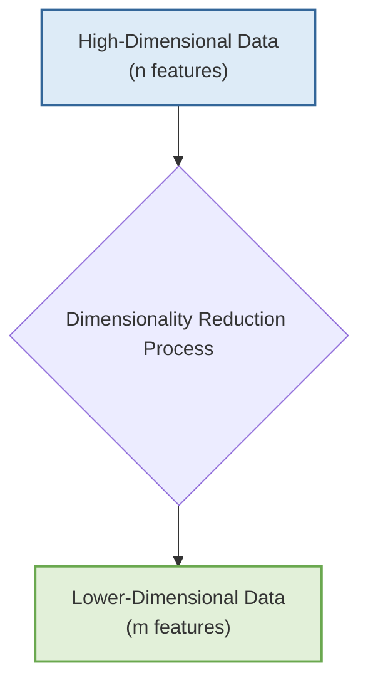
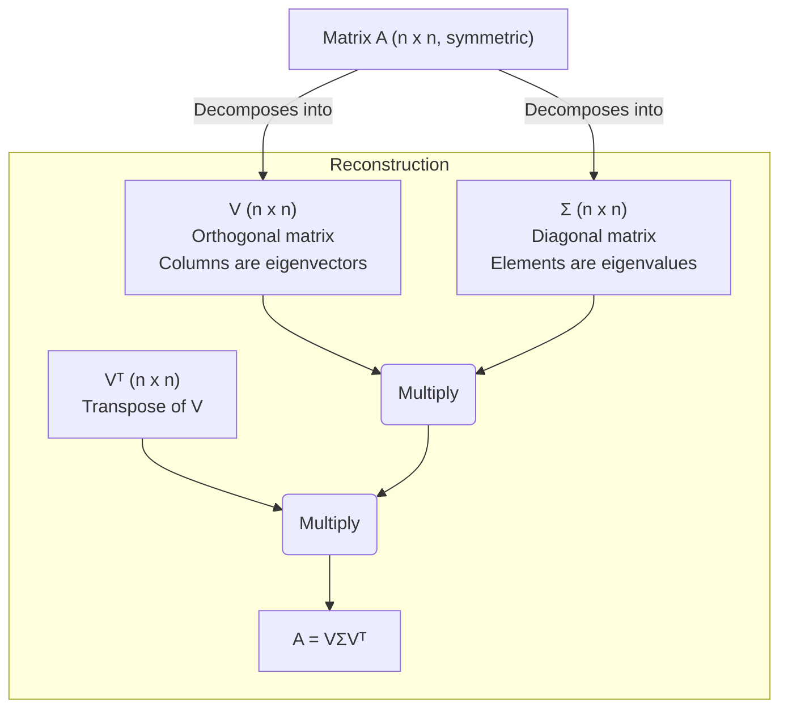
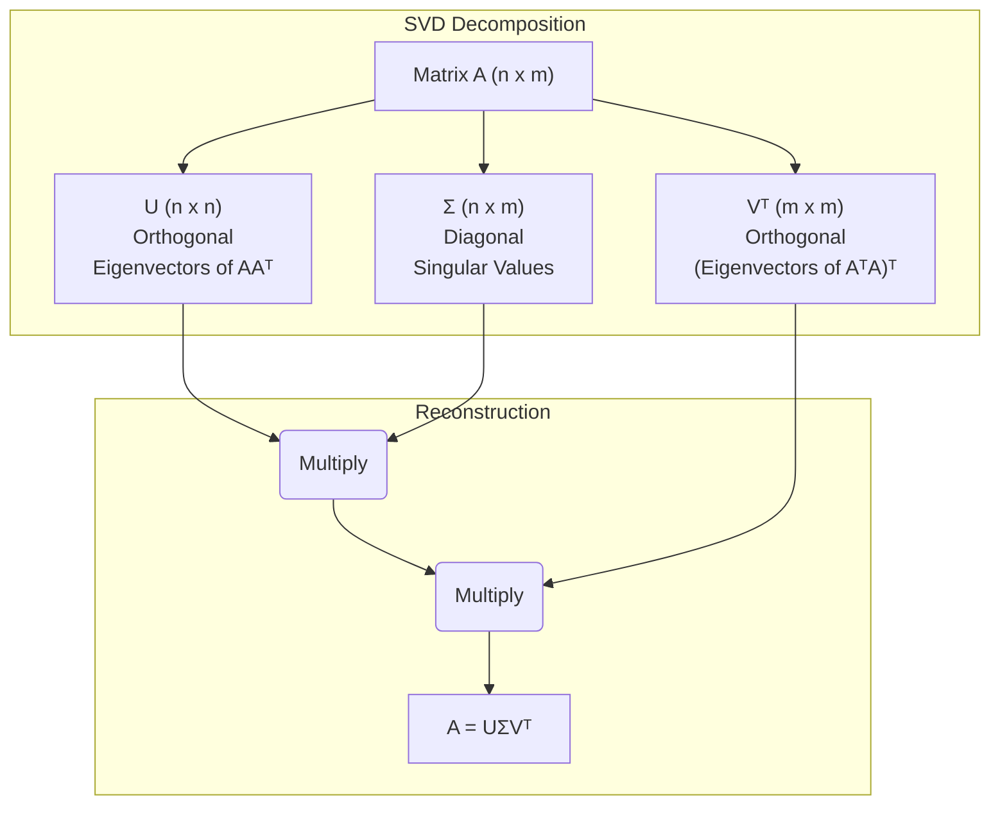
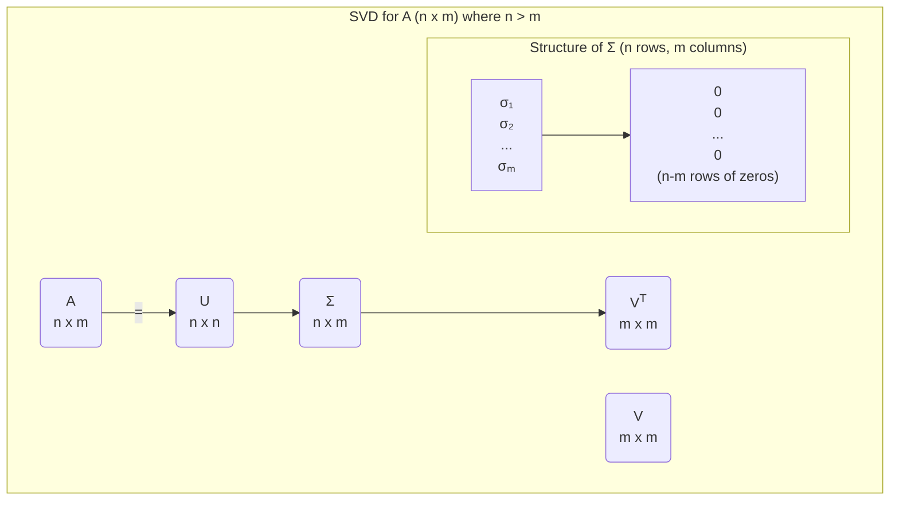
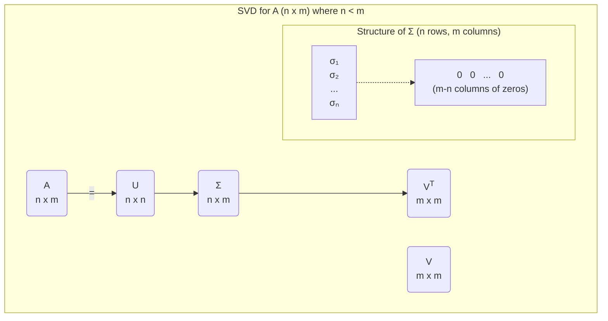
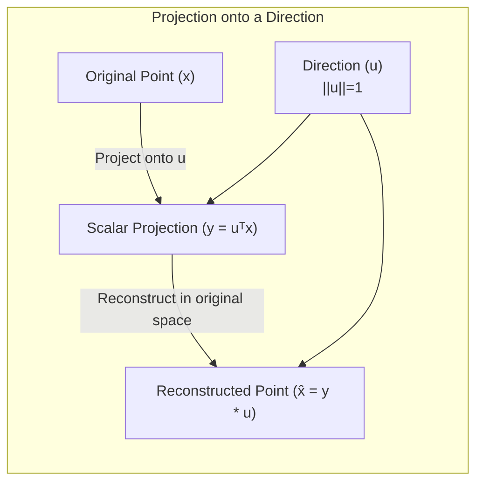

# Dimensionality Reduction

> **Author**
Marc'Antonio Lopez
AI & Data Analytics student at Polytechnic University of Turin

## What is Dimensionality Reduction?

Dimensionality reduction transforms data from a **high-dimensional feature space** (`n` dimensions) into a **new, lower-dimensional space** (`m` dimensions), where `m` is significantly smaller than `n` (`m << n`). Essentially, it reduces the number of variables or features representing the data.

Here's a conceptual overview of this transformation:

This process serves several important purposes:

*   **Compress Information**: It significantly reduces data storage and processing time, leading to more efficient algorithms and better memory usage.
*   **Remove Unwanted Variability (Noise)**: By focusing on significant data patterns, it helps filter out irrelevant details and noise, thus cleaning the data.
*   **Simplify Classification**: It mitigates the "curse of high dimensionality" (sparse data, model overfitting), resulting in simpler, more robust classification models.
*   **Data Visualization**: It allows complex, high-dimensional data to be projected into understandable 2D or 3D spaces, enabling visual inspection of inherent data structure and relationships.

---

## Goals of Different Approaches

| Goal                       | Objective                                                                                                   | Method                                                                                                                                                                                                                           |
| :------------------------- | :---------------------------------------------------------------------------------------------------------- | :------------------------------------------------------------------------------------------------------------------------------------------------------------------------------------------------------------------------------- |
| **Compress Information**   | To retain the maximum amount of essential information while significantly reducing the output data size.    | **Principal Component Analysis (PCA)**: This method identifies and preserves the directions in the data that show the greatest variance (spread).                                                                                 |
| **Improve Classification** | To retain the information that best discriminates (separates) between different classes or categories.       | Supervised techniques like **Linear Discriminant Analysis (LDA)**: These methods aim to maximize the separation between distinct classes in the data.                                                                             |
| **Data Visualization**     | To create clear 2D or 3D representations that accurately preserve the relationships between data samples.    | **PCA** or **t-distributed Stochastic Neighbor Embedding (t-SNE)**: These methods are designed to maintain the proximity of original data samples when projected into lower dimensions, making their relationships visually apparent. |

---

## Focus: Linear Methods

This guide will focus on two fundamental linear dimensionality reduction methods:

*   **Unsupervised Method: Principal Component Analysis (PCA)**: This method analyzes data variance (spread) to find directions representing overall variability, without considering class labels.
*   **Supervised Method: Linear Discriminant Analysis (LDA)**: This method uses class labels to find a lower-dimensional subspace that best separates different classes.

---

## Notes on Linear Algebra

Understanding these linear algebra concepts is crucial for comprehending PCA and LDA.

### Eigen-decomposition

For a square, symmetric `n x n` matrix `A` (`A = Aᵀ`), **eigen-decomposition** expresses `A` as: $A = V \Sigma V^{-1} = V \Sigma V^{T}$.

This decomposition's components are:

1.  **V**: An `n x n` **orthogonal matrix** whose columns are `A`'s **eigenvectors**. (An orthogonal matrix's transpose equals its inverse: $V^{T}V = VV^{T} = I$, where `I` is the identity matrix).
2.  **Σ** (Sigma): A diagonal `n x n` matrix containing `A`'s **eigenvalues** on its main diagonal. Each eigenvalue corresponds to a specific eigenvector in `V`.

The core concept: when matrix `A` acts on an eigenvector `v`, `Av` is a scaled version of `v` (`Av = λv`), meaning `v`'s direction remains unchanged.

Here's a diagram illustrating the eigen-decomposition process:

### Singular Value Decomposition (SVD)

**Singular Value Decomposition (SVD)** is a more general matrix decomposition applicable to *any* rectangular `n x m` matrix `A`, taking the form: $A = U \Sigma V^{T}$.

SVD's components are:

*   **U**: An `n x n` orthogonal matrix whose columns are the eigenvectors of **AA**ᵀ.
*   **V**: An `m x m` orthogonal matrix whose columns are the eigenvectors of **A**ᵀ**A**.
*   **Σ** (Sigma): An `n x m` rectangular diagonal matrix containing `A`'s non-negative **singular values**, conventionally listed in decreasing order.

Here's a diagram illustrating the SVD process:

#### SVD Diagrammatic Representation

The structure of the `Σ` matrix in SVD adapts based on the dimensions of the input matrix `A`:

*   **Case 1: `n > m` (Tall Matrix)**: When the number of rows (`n`) is greater than the number of columns (`m`), the `Σ` matrix will be padded with additional rows of zeros.

*   **Case 2: `n < m` (Wide Matrix)**: When the number of rows (`n`) is less than the number of columns (`m`), the `Σ` matrix will be padded with additional columns of zeros.

### Projecting a Point onto a Direction

To project a data point `x` onto a direction defined by a unit vector `u` ($||u||=1$):

1.  **Projection (Scalar Value)**: `y = uᵀx` is the scalar coordinate of `x` along `u`, indicating `x`'s extent in that direction.
2.  **Reconstruction (Point on Line)**: `x̂ = y ⋅ u = (uᵀx) u` is the point on `u`'s line closest to original `x`, representing `x` projected onto that direction.

Here's a diagram illustrating the projection process:

### Projecting a Point onto a Subspace

To project a data point `x` onto an `m`-dimensional subspace defined by orthonormal basis vectors $U = [u₁, ..., uₘ]$:

1.  **Projection (Vector of Coordinates)**: `y = Uᵀx` provides `x`'s coordinates in the new `m`-dimensional basis `U`. Each element of `y` is `x`'s projection onto a `uᵢ`.
2.  **Reconstruction (Point in Subspace)**: `x̂ = U y = U Uᵀ x` is the best linear combination of `u₁, ..., uₘ` approximating `x`, representing the point in the `m`-dimensional subspace closest to original `x`.
    *   If `m=n` (subspace spans original space) and `U` is full rank, `x̂` is identical to `x`.

---

## Principal Component Analysis (PCA)

Given a **centered** dataset $X = \{x₁, ..., xₖ\}$ (where $x̄ = 0$), **Principal Component Analysis (PCA)** finds a lower-dimensional subspace that preserves most original data information. It essentially identifies directions of maximal data variance.

### PCA Formalism

PCA's lower-dimensional subspace is represented by an `n x m` matrix `P`, whose columns are `m` orthonormal basis vectors for the new subspace.

*   **Projection**: Projecting `x` into the new `m`-dimensional space yields $y = Pᵀx$, where `y` represents `x` in the new basis.
*   **Reconstruction**: Reconstructing an approximation of `x` from its projected version `y` yields $x̂ = Py$, which lies within the `m`-dimensional subspace.

### PCA Criterion: Minimizing Reconstruction Error

**PCA** fundamentally minimizes average **reconstruction error**: the average squared distance between each original data point `xᵢ` and its reconstructed version `x̂ᵢ` (i.e., $(1/K) \Sigma ||xᵢ - x̂ᵢ||²$).

Minimizing this error is mathematically equivalent to **maximizing projected data variance**. The directions (basis vectors) achieving this capture maximal data spread.

The optimal matrix `P` (subspace basis vectors) is formed by selecting the `m` eigenvectors of the data's **covariance matrix** corresponding to the `m` largest eigenvalues. These eigenvectors are the principal components.

### Summary of the PCA Algorithm:

Here are the step-by-step instructions for performing PCA:

1.  **Center the Data**: Subtract the overall dataset mean `x̄` from each data point `xᵢ` to create zero-mean data points: $zᵢ = xᵢ - x̄$.
2.  **Compute Sample Covariance Matrix**: Calculate `C` from centered data, describing how dimensions vary together: $C = (1/K) \Sigma zᵢ zᵢ^{T}$ (where `K` is total data points).
3.  **Compute Eigen-decomposition of `C`**: Perform eigen-decomposition of `C` to get $C = U \Sigma Uᵀ$. `U`'s columns are `C`'s eigenvectors; `Σ` is a diagonal matrix with corresponding eigenvalues. **Ensure eigenvalues (and `U`'s eigenvectors) are sorted descending.**
4.  **Form Projection Matrix `P`**: Select the first `m` columns from the sorted eigenvector matrix `U` to form `P`, representing your `m` principal components.
5.  **Project the Data**: Transform each centered data point `zᵢ` into the new `m`-dimensional space via $yᵢ = Pᵀ zᵢ = Pᵀ (xᵢ - x̄)$. The resulting `yᵢ` is `xᵢ`'s `m`-dimensional representation.
6.  **(Optional) Reconstruct the Data**: To assess how well `m` components capture original data, reconstruct an approximation: $x̂ᵢ = P yᵢ + x̄$. (Add back the mean, as `yᵢ` was from centered data).

### Practical Considerations for PCA

*   **Non-Zero-Mean Data**:
    *   **Importance of Centering**: PCA axes always pass through the origin. Applying PCA to non-centered data may cause the first principal component to capture overall data location rather than internal spread.
    *   **Always center data by subtracting the mean before PCA.** This ensures principal components truly represent directions of maximum variance within the data's inherent structure.

*   **Interpreting PCA as Preserving Variance**:
    *   **Directions of Highest Variance**: PCA identifies and preserves directions of maximal data variability (spread).
    *   **Covariance Ellipse**: In a data cloud, the axes of its descriptive ellipse align with principal directions (eigenvectors). Their lengths are proportional to standard deviation (square root of eigenvalues) in those directions.
    *   **Decorrelation**: Projecting data onto `Uᵀ` (eigenvector transpose) rotates it, aligning principal directions with coordinate axes. This beneficially makes new features (principal components) **uncorrelated**.

*   **How to Select `m` (Number of Components)**:
    Two primary methods exist for selecting `m` (number of components):

    1.  **Cross-Validation (for Supervised Tasks)**: When PCA preprocesses supervised learning (e.g., classification), determine optimal `m` via cross-validation by testing values and selecting `m` yielding best classifier performance on a separate validation set.
    2.  **Retaining a Percentage of Variance**: A common heuristic selects the smallest `m` retaining a target percentage (`t`, e.g., 0.95) of total data variance. This is calculated as: $(\Sigmaᵢ^{m} \sigmaᵢ) / (\Sigmaᵢ^{n} \sigmaᵢ) \ge t$, where `σᵢ` are descending-sorted eigenvalues.

*   **PCA for Large Feature Spaces**:
    Computing the full covariance matrix `C` is computationally expensive and memory-intensive for datasets with many features. To address this, alternative methods include:
    *   **Truncated Singular Value Decomposition (SVD)**: This method efficiently computes only the top `m` singular values and corresponding vectors (directly related to principal components), rather than all.
    *   **Probabilistic PCA**: A PCA variant formulated within a probabilistic framework, offering more robustness and missing data handling in certain scenarios.

### PCA Example: MNIST Dataset

The MNIST dataset is a classic machine learning benchmark, with these properties:

| Property           | Description                                    |
| :----------------- | :--------------------------------------------- |
| **Task**           | Classification of handwritten digits           |
| **Classes**        | Digits 0, 1, ..., 9 (a total of 10 classes)    |
| **Image Shape**    | 28x28 pixels (images are normalized and centered) |
| **Image Type**     | Gray-scale                                     |
| **Training Samples** | 60,000 images (approximately 6,000 for each digit) |
| **Test Samples**   | 10,000 images                                  |

*   **MNIST Reconstruction with PCA**: When PCA is applied to 28x28 (784-dimensional) MNIST images:
    *   **50-dimensional PCA** (784 to 50 features) yields very clear digit reconstructions, showing essential information retention despite significant reduction.
    *   **10-dimensional PCA** (to 10 features) produces blurrier but recognizable digits, highlighting PCA's ability for significant information compression while preserving key visual characteristics.

*   **PCA as Pre-processing for a Simple Classifier (Euclidean Distance)**: A simple Euclidean distance classifier was tested on MNIST, with and without PCA preprocessing. Error rates are shown below:

| Dimensions (`m`) | PCA Error Rate | PCA+LDA Error Rate |
| :--------------- | :------------- | :----------------- |
| Full (w/o PCA)   | 18.0%          | -                  |
| 100              | 18.1%          | -                  |
| 50               | 18.2%          | -                  |
| 9                | 25.5%          | **12.2%**          |
| 5                | 35.9%          | 17.9%              |

From this table, we observe:
*   Reducing dimensionality to 50 or 100 with **PCA alone** does not significantly impact this simple classifier's accuracy; error rates remain similar to full 784 dimensions.
*   However, drastic reduction (e.g., to 9 or 5 dimensions) with **PCA alone** significantly drops accuracy. This suggests that while PCA compresses data and reduces noise, it may not remove "unwanted variability" directly hindering certain classifiers' performance.
*   The **PCA+LDA** column shows significant improvement. For instance, at 9 dimensions, **PCA alone** had a 25.5% error rate, but combining it with **LDA** (which targets class separation) dramatically reduced the error to **12.2%**. This highlights the distinct goals of PCA (variance preservation) and LDA (class separability).

---

## Linear Discriminant Analysis (LDA)

### The Limitation of PCA for Classification

While PCA excels at preserving overall data variance and compressing information, it is an **unsupervised method**. Thus, it doesn't consider class labels when determining optimal projection directions. Consequently, PCA's maximum variance directions are **not guaranteed to be useful for discriminating between classes**, potentially causing significant class overlap in lower dimensions.

### The Goal of LDA

In contrast, **Linear Discriminant Analysis (LDA)** is a **supervised method** specifically designed for classification. Its primary goal is to find projection directions that:

1.  **Maximize separation between different class means.**
2.  **Minimize variance (spread) within each class.**

Conceptually, for two distinct data clusters, PCA finds the direction of maximal overall data spread, potentially causing overlap upon projection. LDA, conversely, finds the direction that maximally separates these clusters, making them distinct and easier to classify.

### Fisher's LDA Criterion

Fisher's LDA aims to find a projection vector `w` maximizing a ratio that compares *between-class* variability to *within-class* variability for projected data.

The criterion to maximize is: $(w^{T}S_Bw) / (w^{T}S_Ww)$

*   **Between-Class Variability ($w^{T}S_Bw$)**: Quantifies class mean separation after projection onto `w`. $S_B$ is the **between-class scatter matrix**, essentially the covariance of class means.
*   **Within-Class Variability ($w^{T}S_Ww$)**: Quantifies data spread within each class after projection onto `w`. $S_W$ is the **within-class scatter matrix**, a weighted average of individual class covariance matrices.

Maximizing this ratio ensures well-separated classes that remain internally compact in the projected space.

### Solving for the LDA Direction

Maximizing Fisher's criterion leads to a **generalized eigenvalue problem**:

$S_B w = \lambda S_W w$

The optimal projection vector `w` (or vectors, for multiclass) is the eigenvector of $S_W^{-1} S_B$ corresponding to the largest eigenvalue $\lambda$. This defines the best class-separation direction.

*   **Binary Case (two classes)**: The optimal direction `w` is directly proportional to $S_W^{-1} (\mu₂ - \mu₁)$, where $\mu₁$ and $\mu₂$ are the class mean vectors.

### Classification with LDA

Once the optimal projection `w` is found, a new test sample `x_t` can be classified by:

1.  **Project the Test Sample**: Project `x_t` onto discriminant `w` by computing scalar score: $w^{T}x_t$.
2.  **Compare to a Threshold**: Compare this score to a threshold `t`, typically the midpoint of projected class means.
3.  **Classification Rule**:
    *   If $w^{T}x_t < t$, `x_t` is classified into Class 1 (`C₁`).
    *   Otherwise (`w^{T}x_t \ge t`), it is classified into Class 2 (`C₂`).

### LDA for Multiclass Dimensionality Reduction

For problems with more than two classes, LDA extends its approach to find multiple discriminant directions.

*   **Multiple Discriminant Directions**: LDA finds `m` discriminant directions, which are the eigenvectors of $S_W^{-1} S_B$ corresponding to the `m` largest eigenvalues. These form the columns of transformation matrix `W`.
*   **Maximum Number of Directions**: LDA can find at most `C - 1` meaningful discriminant directions, where `C` is the total number of classes (e.g., 9 for MNIST's 10 classes).
*   **Transformed Points**: Original data points `x` are transformed into the new lower-dimensional space by multiplying with the transpose of `W`: $x̂ = W^{T}x$.

### Practical Considerations for LDA

*   **Assumptions**: If violated, LDA's performance might degrade.
    *   Assumes data within each class is approximately **Gaussian-distributed** (bell-curve shape).
    *   Assumes all classes share **similar covariance structures** (i.e., roughly equal scatter matrices).

*   **Singular `S_W` (Within-Class Scatter Matrix)**:
    *   A common challenge occurs if the within-class scatter matrix $S_W$ is **singular** (non-invertible). This can happen if:
        *   Features greatly outnumber samples in some classes.
        *   Features are perfectly correlated.
        *   Class data lies on a lower-dimensional subspace than total feature space.
    *   If $S_W$ is singular, its inverse ($S_W^{-1}$) cannot be computed, which is required for the generalized eigenvalue problem.

*   **PCA+LDA (A Common Solution)**:
    *   To overcome singular $S_W$ or improve robustness, a common strategy is to first apply **PCA** as a preprocessing step.
    *   **Process**:
        1.  Apply **PCA** to original data to reduce dimensionality to `k` (where `k` < samples/features) and decorrelate features. This ensures a non-singular covariance matrix.
        2.  Then, apply **LDA** to the PCA-transformed data to find discriminant directions.
    *   **Example (MNIST)**: The MNIST table shows **PCA+LDA** with `m=9` (9 discriminant dimensions) resulted in a 12.2% error rate, a substantial improvement over PCA alone (25.5%) at the same dimensionality. This demonstrates how combining both methods' strengths improves classification.

---

## Non-linear Dimensionality Reduction

Linear transformations like PCA and LDA are highly effective for linearly separable or linear-structured data. However, they are **insufficient for handling non-linearly separable data**.

Consider **concentric circles** in 2D. A straight line (linear transformation) cannot separate them; any projection onto a single line will cause inner and outer circles to overlap.

### Feature Transformation

One powerful approach for non-linear data is a **feature transformation**, mapping original features into a new, higher-dimensional space where data becomes linearly separable.

*   **Example (Concentric Circles)**: For concentric circles in 2D Cartesian coordinates ($x₁, x₂$), conversion to **polar coordinates** ($\rho$, $\theta$) can enable linear separability. In polar coordinates, inner circles have small $\rho$ values, outer circles larger $\rho$ values, allowing a simple $\rho$ threshold for separation.

Beyond direct transformations, other non-linear dimensionality reduction methods include:

*   **Kernel PCA**: Uses the "kernel trick" to implicitly map data into a higher-dimensional feature space, enabling PCA to find non-linear principal components.
*   **Manifold Learning Techniques**: Techniques like **t-SNE** and Isomap aim to discover the underlying low-dimensional "manifold" where high-dimensional data resides. They are particularly useful for visualizing complex, non-linear data structures.
