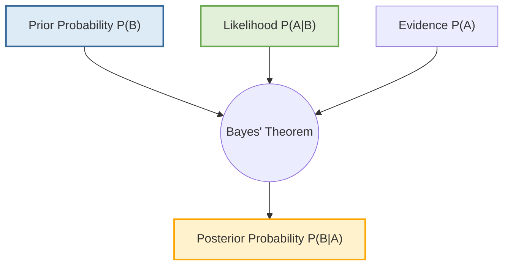
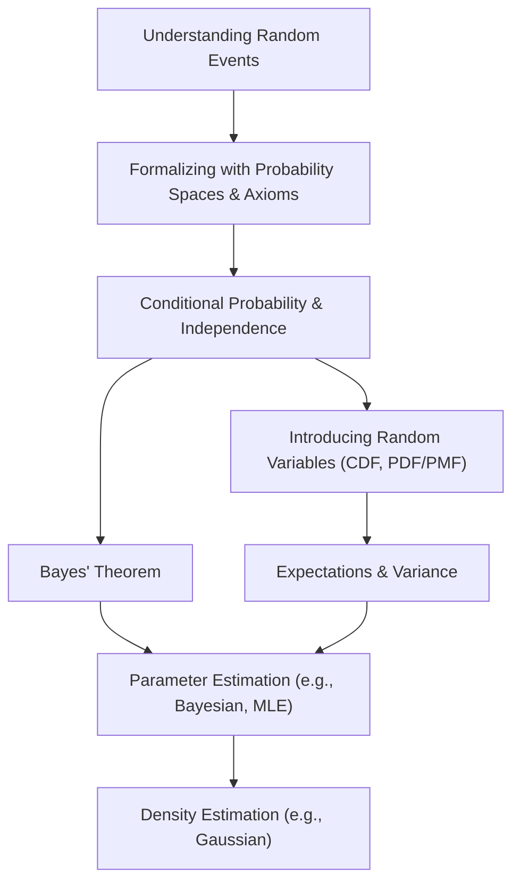

# Probability in Machine Learning

> **Author**
Marc'Antonio Lopez
AI & Data Analytics student at Polytechnic University of Turin

Probability theory forms the bedrock of machine learning, providing the essential mathematical framework for understanding and managing **uncertainty**. This enables well-informed decisions even with incomplete or unpredictable information. Moreover, it allows machine learning models to quantify belief, predict outcomes, and learn from inherently noisy or variable data.

## Introduction to Probability and Random Events in Machine Learning

### Why Study Probability?

Studying probability is crucial as it equips us with powerful methods for making predictions and decisions amidst **uncertainty**. Real-world phenomena are incredibly complex, influenced by countless often unknown or imprecisely measurable factors. This complexity renders purely **deterministic models** (where outcomes are always precisely predictable) impractical or impossible to build. Therefore, we utilize the concept of **random events** to quantify and systematically navigate this inherent complexity.

### Types of Events

Understanding the nature of an event is fundamental:

*   **Deterministic Event:** An event whose outcome is entirely predictable if all initial conditions and influencing factors are fully known. For example, the outcome of a simple mathematical calculation is deterministic.
*   **Random Event:** An event whose specific outcome is uncertain and cannot be predicted with absolute certainty, even if some initial conditions are known. For example, the result of a coin flip or a die roll is a random event.

### Different Ways to Interpret Probability

Probability can be understood and applied from several perspectives:

1.  **Classical Interpretation:** This interpretation defines probability as the ratio of "favorable outcomes" to the "total number of equally likely possible outcomes."
    *   **Example:** When rolling a fair six-sided die, the probability of rolling a 4 is $1/6$, because there is one favorable outcome (rolling a 4) out of six equally likely total outcomes.
2.  **Frequentist Interpretation:** This view defines probability as the long-run relative frequency of an event. It's based on observing the outcome over a large number of trials.
    *   **Example:** If you flip a fair coin many, many times, the proportion of times it lands on heads will eventually approach 0.5. The probability of heads is thus interpreted as 0.5.
3.  **Bayesian Interpretation:** This is a more subjective interpretation, where probability represents a "degree of belief" in an event. This belief is updated as new evidence or data becomes available.
    *   **Example:** Your initial belief about whether a new drug is effective might change (be updated) after seeing results from clinical trials.
4.  **Axiomatic Treatment:** This is the formal mathematical approach to probability. It defines probability through a set of fundamental axioms (rules) that must be satisfied, allowing for a rigorous and consistent theory, regardless of the interpretation.

### Example: Rolling a Standard Six-Sided Die

Let's use the example of rolling a fair, standard six-sided die to illustrate basic probability concepts:

1.  **Sample Space ($\Omega$):** This is the set of all possible outcomes of the experiment.
    *   For a six-sided die, $\Omega = \{1, 2, 3, 4, 5, 6\}$.
2.  **Individual Probabilities:** For a fair die, each individual outcome is equally likely.
    *   The probability of rolling any specific number `x` is $P(\{x\}) = \frac{1}{6}$ for $x \in \{1, \dots, 6\}$.
3.  **Compound Events:** To find the probability of an event that consists of multiple outcomes (a "compound event"), you sum the probabilities of its individual outcomes.
    *   **Example:** Let's find the probability of rolling an "even number." The outcomes for this event are $\{2, 4, 6\}$.
    $$
    P(\text{"even number"}) = P(\{2\}) + P(\{4\}) + P(\{6\}) = \frac{1}{6} + \frac{1}{6} + \frac{1}{6} = \frac{3}{6} = \frac{1}{2}
    $$

---

## Probability Spaces and Axioms: The Formal Framework

To provide a rigorous mathematical foundation for probability, we define a **probability space**, which is composed of three essential parts:

1.  **Sample Space ($\Omega$)**: The complete set of all possible individual outcomes of a random experiment.
    *   **Example:** For a single die roll, $\Omega = \{1, 2, 3, 4, 5, 6\}$.
2.  **Event Space ($A$ or $\mathcal{F}$)**: A collection of specific subsets of the sample space ($\Omega$). Each subset is an "event" for which we can calculate a probability. This collection must satisfy certain mathematical properties to form a $\sigma$-field (or $\sigma$-algebra), ensuring consistency.
3.  **Probability Function ($P$)**: A function assigning a numerical probability value (between 0 and 1, inclusive) to each event within the event space ($A$).

### Fundamental Properties (Axioms) of Probability

A valid probability function $P$ must strictly adhere to **Kolmogorov's Axioms**, which are the cornerstone of probability theory:

1.  **Non-negativity:** The probability of any event $A_i$ must be non-negative (greater than or equal to zero).
    *   $P(A_i) \geq 0$
2.  **Normalization:** The probability of the entire sample space $\Omega$ (meaning something definitely happens) must be exactly 1.
    *   $P(\Omega) = 1$
3.  **Countable Additivity:** If you have a sequence of events $A_1, A_2, \dots$ that are **mutually exclusive** (meaning no two events can occur at the same time), then the probability that *any* of these events occur (their union) is equal to the sum of their individual probabilities.
    *   $P\left(\bigcup_{n=1}^\infty A_n\right) = \sum_{n=1}^\infty P(A_n)$

### Derived Properties of Probability

From Kolmogorov's Axioms, several other important properties of probability can be logically derived:

*   **Probability of the Impossible Event:** The probability of an event that cannot occur (represented by the empty set $\emptyset$) is 0.
    *   $P(\emptyset) = 0$
*   **Probability of a Complement:** The probability of an event *not* occurring ($A^C$, the complement of event A) is 1 minus the probability of the event occurring.
    *   $P(A^C) = 1 - P(A)$
*   **Probability Range:** The probability of any event $A$ must always fall within the range of 0 to 1, inclusive.
    *   $0 \leq P(A) \leq 1$

### Example: Rolling a Die (Revisited with Axioms)

Let's re-examine the die roll example through the lens of these axioms:

*   **Axiom 1 (Non-negativity):** For a fair die, the probability of rolling any specific number `x` is $P(\{x\}) = 1/6$, which is indeed $\ge 0$. This axiom is satisfied.
*   **Axiom 2 (Normalization):** The sum of the probabilities of all individual outcomes in the sample space is:
    $P(\Omega) = P(\{1\}) + P(\{2\}) + P(\{3\}) + P(\{4\}) + P(\{5\}) + P(\{6\}) = 1/6 + 1/6 + 1/6 + 1/6 + 1/6 + 1/6 = 6/6 = 1$. This axiom is satisfied.
*   **Axiom 3 (Countable Additivity):** Consider the event "even number," which comprises the outcomes $\{2, 4, 6\}$. Since the events $\{2\}$, $\{4\}$, and $\{6\}$ are mutually exclusive (you can't roll a 2 and a 4 simultaneously), we can use this axiom:
    $P(\text{"even number"}) = P(\{2\} \cup \{4\} \cup \{6\}) = P(\{2\}) + P(\{4\}) + P(\{6\}) = 1/6 + 1/6 + 1/6 = 3/6 = 1/2$. This axiom is satisfied.

---

## Conditional Probability and Independence

### Conditional Probability: Probability Given New Information

**Conditional probability**, denoted as $P(A|B)$, is the probability of event $A$ occurring *given that event $B$ has already occurred*. This concept allows us to update our belief about an event's likelihood based on new information, and is defined only if $P(B) > 0$. The formula for conditional probability is given by:

$$
P(A|B) = \frac{P(A \cap B)}{P(B)}
$$

Here, $P(A \cap B)$ represents the probability that *both* event A and event B occur.

*   **Example (Die Roll):**
    *   Let **Event A** be rolling a 2 or a 3. So, $A = \{2, 3\}$. The probability of A is $P(A) = 2/6 = 1/3$.
    *   Let **Event B** be rolling a number greater than 1. So, $B = \{2, 3, 4, 5, 6\}$. The probability of B is $P(B) = 5/6$.
    *   The **intersection** of A and B ($A \cap B$) is the set of outcomes where both A and B occur: $A \cap B = \{2, 3\}$. The probability of this intersection is $P(A \cap B) = 2/6$.

    Now, let's calculate the probability of Event A given Event B has occurred, $P(A|B)$:
    $$
    P(A|B) = \frac{P(A \cap B)}{P(B)} = \frac{2/6}{5/6} = \frac{2}{5}
    $$
    **Interpretation:** This result means that *if we already know* the die roll was greater than 1, the probability of that roll being a 2 or a 3 is now 2/5 (or 40%). This is higher than the original probability of A (1/3 or ~33.3%), indicating that knowing B occurred changes our assessment of A.

### Bayes' Formula: Reversing the Condition

**Bayes' Formula** (also known as Bayes' Theorem) is one of the most fundamental and powerful results in probability theory, especially in machine learning. It allows us to "reverse" the conditionality; that is, to calculate $P(B|A)$ if we know $P(A|B)$, along with the individual probabilities $P(A)$ and $P(B)$.

The formula is:

$$
P(B|A) = \frac{P(A|B)P(B)}{P(A)}
$$

This theorem is central to Bayesian inference, where $P(B|A)$ is the "posterior probability" (updated belief), $P(A|B)$ is the "likelihood," $P(B)$ is the "prior probability," and $P(A)$ is the "evidence."

Here's a conceptual flow of how Bayes' Theorem works:

### Independence: Events Not Influencing Each Other

Two events, $A$ and $B$, are considered **statistically independent** if the occurrence of one event does not affect the probability of the other event occurring.

This relationship can be defined in several equivalent ways:

*   **Primary Definition:** Events $A$ and $B$ are independent if the probability of both events occurring is equal to the product of their individual probabilities:
    $P(A \cap B) = P(A)P(B)$.
*   **Equivalent Conditions (if $P(A)>0$ and $P(B)>0$):**
    *   The probability of $A$ given $B$ is simply the probability of $A$: $P(A|B) = P(A)$.
    *   The probability of $B$ given $A$ is simply the probability of $B$: $P(B|A) = P(B)$.

### Verification using Bayes' Formula (Die Example)

Let's use the previous die roll example values to check for independence using Bayes' Formula. We had:
*   $P(A|B) = 2/5$
*   $P(A) = 1/3$
*   $P(B) = 5/6$

Now, let's calculate $P(B|A)$ using Bayes' Formula:
$$
P(B|A) = \frac{P(A|B)P(B)}{P(A)} = \frac{(2/5) \cdot (5/6)}{1/3} = \frac{10/30}{1/3} = \frac{1/3}{1/3} = 1
$$

**Interpretation of the Result:** The result $P(B|A)=1$ means that if we know the roll was a 2 or a 3 (Event A), it is *certain* (probability of 1) that the roll was also greater than 1 (Event B).

**Conclusion on Independence:** Since $P(B|A) = 1$ which is **not equal** to $P(B) = 5/6$, events A and B are **not independent**. This makes sense intuitively: knowing the roll was a 2 or 3 definitely tells us something about whether it was greater than 1.

---

## Random Variables

A **random variable (RV)** is a powerful probability concept, serving as a bridge between abstract random experiment outcomes and numerical values. It maps each possible outcome to a real number, enabling mathematical analysis of uncertain situations.

### Definition of a Random Variable

Formally, a random variable $X$ is a **function** $X: \Omega \to \mathbb{R}$. This function assigns a unique real number, $X(\omega)$, to every individual outcome $\omega$ in the sample space $\Omega$.

A crucial condition for a function to be considered a random variable is that for any real number $x$, the set of all outcomes $\omega$ for which $X(\omega) \leq x$ must constitute an event (i.e., $\{\omega : X(\omega) \leq x\}$ must be a member of the event space $\mathcal{F}$). This condition ensures the variable is "measurable," meaning we can meaningfully assign probabilities to its values.

### Cumulative Distribution Function (CDF)

The **Cumulative Distribution Function (CDF)**, denoted as $F_X(x)$, is a fundamental function that completely describes the probability distribution of a random variable $X$. It gives the probability that the random variable $X$ will take on a value less than or equal to a given number `x`.

The definition is: $F_X(x) = P(X \leq x)$.

*   **Key Properties of a CDF:**
    1.  **Bounded:** The probability value must always be between 0 and 1, inclusive.
        *   $0 \leq F_X(x) \leq 1$
    2.  **Non-decreasing:** As `x` increases, the CDF value must either stay the same or increase. It can never decrease.
        *   If $a < b$, then $F_X(a) \leq F_X(b)$.
    3.  **Limits at Extremes:**
        *   As `x` approaches negative infinity, the CDF approaches 0 (no chance of being less than an infinitely small number).
            *   $\lim_{x \to -\infty} F_X(x) = 0$
        *   As `x` approaches positive infinity, the CDF approaches 1 (certainty of being less than an infinitely large number).
            *   $\lim_{x \to \infty} F_X(x) = 1$
    4.  **Right-continuous:** The CDF must be continuous from the right. This means that as you approach a point `x` from values slightly larger than `x`, the function value approaches $F_X(x)$.
        *   $\lim_{h \to 0^+} F_X(x+h) = F_X(x)$

### Types of Random Variables

Random variables are primarily categorized into two types based on the nature of the values they can take:

#### 1. Discrete Random Variables

*   **Definition:** These are random variables that can take on a **finite** number of distinct values, or a **countably infinite** number of distinct values (like integers: 0, 1, 2, ...). They typically represent counts or categories.
*   **Description:** They are described by a **Probability Mass Function (PMF)**, denoted as $f_X(x)$. The PMF gives the probability that the random variable $X$ is exactly equal to a specific value `x`.
    *   $f_X(x) = P(X = x)$
*   **Properties of a PMF:**
    *   Each probability must be non-negative: $f_X(x) \ge 0$.
    *   The sum of all probabilities for all possible values of `x` must equal 1: $\sum_{\text{all } x} f_X(x) = 1$.
*   **Example:** The outcome of a fair die roll is a discrete random variable $X \in \{1, \dots, 6\}$. Its PMF is $f_X(x) = 1/6$ for each possible value `x`.

#### 2. Continuous Random Variables

*   **Definition:** These are random variables that can take on **any value within a continuous range** of real numbers. They typically represent measurements.
*   **Description:** They are described by a **Probability Density Function (PDF)**, denoted as $f_X(x)$.
*   **Key Concept:** For a continuous random variable, the probability of it taking on any *exact* single value is 0 ($P(X=x) = 0$). Instead, probability is calculated as the **area under the PDF curve** over a given interval.
    *   $P(a \leq X \leq b) = \int_{a}^{b} f_X(x) dx$
*   **Properties of a PDF:**
    *   The function value must be non-negative: $f_X(x) \geq 0$. (Note: Unlike PMF, $f_X(x)$ itself can be greater than 1, as long as the integral over the entire range is 1).
    *   The total area under the entire PDF curve must equal 1: $\int_{-\infty}^{\infty} f_X(x) dx = 1$.
*   **Relationship to CDF:**
    *   The CDF is the integral of the PDF: $F_X(x) = \int_{-\infty}^{x} f_X(t) dt$.
    *   Conversely, the PDF is the derivative of the CDF: $f_X(x) = \frac{d}{dx} F_X(x)$.
*   **Example:** The Gaussian (Normal) Distribution is a common example of a continuous probability distribution, often used to model natural phenomena like height or measurement errors.

---

## Random Vectors (Multidimensional Random Variables)

A **random vector** is a collection of multiple random variables, typically denoted as $X = (X_1, X_2, \dots, X_m)$. Each $X_i$ is a random variable, and collectively they describe the outcomes of a multi-dimensional random experiment.

### Joint Cumulative Distribution Function (Joint CDF)

The **Joint CDF** for a random vector $X = (X_1, \dots, X_m)$ describes the probability that *each component* $X_i$ simultaneously takes on a value less than or equal to a corresponding specified value $x_i$.

The definition is:
$$
F_X(x_1, \dots, x_m) = P(X_1 \leq x_1, \dots, X_m \leq x_m)
$$

### Marginal Distributions

**Marginal distributions** are derived from a joint distribution when you are interested in the probability distribution of a subset of the random variables, ignoring the values of the others. This is achieved by "integrating out" (for continuous variables) or "summing out" (for discrete variables) the unwanted variables.

*   **For Marginal CDF $F_{X_i}(x_i)$:** You obtain the marginal CDF of a single variable $X_i$ by taking the limit of the joint CDF as the values of all other variables $x_j$ (where $j \neq i$) approach positive infinity. This effectively accounts for all possible values of the other variables.
    *   $F_{X_i}(x_i) = \lim_{x_j \to \infty \text{ for all } j \neq i} F_X(x_1, \dots, x_m)$
*   **Marginal PMFs/PDFs:** Similarly, marginal probability mass functions (PMFs) for discrete variables and marginal probability density functions (PDFs) for continuous variables are obtained by summing (for discrete) or integrating (for continuous) the joint PMFs/PDFs over all possible values of the variables you want to "ignore."

### Statistical Independence of Random Variables

Two random variables, $X$ and $Y$, are considered **statistically independent** if knowing the value of one variable provides absolutely no information about the value of the other variable.

This can be formally defined using their distributions:

*   **Definition using CDFs:** $X$ and $Y$ are independent if their joint CDF is equal to the product of their individual (marginal) CDFs for all possible values of `x` and `y`.
    *   $F_{X,Y}(x, y) = F_X(x) F_Y(y)$ for all $x, y$.
*   **Definition using PDFs/PMFs:**
    *   **For continuous variables:** Their joint PDF is equal to the product of their individual (marginal) PDFs.
        *   $f_{X,Y}(x, y) = f_X(x) f_Y(y)$
    *   **For discrete variables:** The probability of them taking on specific values `x` and `y` simultaneously is equal to the product of their individual (marginal) probabilities.
        *   $P(X=x, Y=y) = P(X=x) P(Y=y)$

### Conditional Probability Density Function (Conditional PDF)

The **Conditional PDF**, denoted as $f_{X|Y}(x|y)$, describes the probability distribution of random variable $X$ *given that* random variable $Y$ has taken on a specific value `y`. It is analogous to conditional probability for events but applied to continuous random variables.

The formula is:
$$
f_{X|Y}(x|y) = \frac{f_{X,Y}(x, y)}{f_Y(y)} \quad (\text{where } f_Y(y) > 0)
$$
Here, $f_{X,Y}(x, y)$ is the joint PDF of $X$ and $Y$, and $f_Y(y)$ is the marginal PDF of $Y$. This formula essentially normalizes the joint probability by the likelihood of the condition, giving us the probability density of $X$ *within* that specific condition.

---

## Expectations (Expected Values): Measures of Central Tendency and Spread

The **expectation** (or **expected value**) of a random variable, denoted as $\mathbb{E}[X]$ or $\mu_X$, represents its long-run average value if the random experiment were repeated many times. Thus, it serves as a fundamental measure of **central tendency** for a probability distribution.

### Definition of Expectation ($\mathbb{E}[X]$)

The calculation of expectation differs slightly for discrete and continuous random variables:

*   **For a Discrete Random Variable (RV):** The expectation is the sum of each possible value multiplied by its probability mass function (PMF).
    *   $\mathbb{E}[X] = \mu_X = \sum_{x \in S} x f_X(x)$
    *   Where $S$ is the set of all possible values for $X$.
*   **For a Continuous Random Variable (RV):** The expectation is the integral of each possible value multiplied by its probability density function (PDF).
    *   $\mathbb{E}[X] = \mu_X = \int_{-\infty}^{\infty} x f_X(x) dx$

### Variance and Covariance: Measures of Spread and Relationship

While expectation tells us the central tendency, other measures help describe the spread or the relationship between variables.

#### 1. Variance ($\text{Var}(X)$ or $\sigma^2_X$)

*   **Purpose:** Variance is a measure of how widely dispersed the values of a random variable are around its mean. A high variance indicates that values tend to be spread out far from the mean, while a low variance indicates values are clustered closely around the mean.
*   **Definition:** Variance is the expected value of the squared difference between the random variable and its mean.
    *   $\text{Var}(X) = \sigma^2_X = \mathbb{E}[(X - \mu_X)^2]$
*   **Computational Formula:** A more convenient formula for calculation is:
    *   $\text{Var}(X) = \mathbb{E}[X^2] - (\mathbb{E}[X])^2$
*   **Standard Deviation:** The standard deviation ($\sigma_X$) is simply the square root of the variance. It is often preferred because it has the same units as the random variable itself, making it easier to interpret.
    *   $\sigma_X = \sqrt{\text{Var}(X)}$

#### 2. Covariance ($\text{Cov}(X, Y)$)

*   **Purpose:** Covariance measures the extent to which two random variables, $X$ and $Y$, change together.
    *   **Positive covariance:** Indicates that $X$ and $Y$ tend to move in the same direction (e.g., as $X$ increases, $Y$ tends to increase).
    *   **Negative covariance:** Indicates they tend to move in opposite directions (e.g., as $X$ increases, $Y$ tends to decrease).
    *   **Near zero covariance:** Suggests little to no **linear** relationship between $X$ and $Y$.
*   **Definition:** Covariance is the expected value of the product of the deviations of $X$ and $Y$ from their respective means.
    *   $\text{Cov}(X, Y) = \mathbb{E}[(X - \mu_X)(Y - \mu_Y)]$
*   **Computational Formula:** A more convenient formula for calculation is:
    *   $\text{Cov}(X, Y) = \mathbb{E}[XY] - \mathbb{E}[X]\mathbb{E}[Y]$
*   **Important Note:** If two random variables $X$ and $Y$ are statistically independent, then their covariance will be 0. However, the reverse is not always true: a covariance of 0 only implies no *linear* relationship; it does not necessarily mean the variables are independent (they could have a non-linear relationship).

#### 3. Correlation Coefficient ($\rho(X, Y)$)

*   **Purpose:** The correlation coefficient is a normalized measure of the strength and direction of the **linear** relationship between two random variables $X$ and $Y$. It scales the covariance to a standard range, making it easier to interpret.
*   **Definition:**
    *   $\rho(X, Y) = \frac{\text{Cov}(X, Y)}{\sigma_X \sigma_Y}$
*   **Interpretation:** The correlation coefficient always ranges from -1 to +1:
    *   **+1:** Signifies a perfect positive linear relationship (as one variable increases, the other increases proportionally).
    *   **-1:** Indicates a perfect negative linear relationship (as one variable increases, the other decreases proportionally).
    *   **0:** Implies no linear correlation between the variables.

---

## Bayesian Estimation: Inferring Parameters with Prior Beliefs

**Estimation** is the process of using observed data to infer the unknown parameters of an underlying probability distribution or process. **Bayesian estimation** is a specific approach that uniquely incorporates prior beliefs or knowledge about these parameters into the inference process.

### Maximum Likelihood Estimation (MLE) - A Frequentist Perspective

Before delving into Bayesian estimation, it's helpful to understand **Maximum Likelihood Estimation (MLE)**, which is a common frequentist approach.

*   **Principle:** MLE identifies the values for the unknown parameters that make the observed data *most probable* (i.e., maximize the likelihood of the data given the parameters). It focuses solely on the likelihood of the observed data.
*   **Example (Bernoulli Distribution):** Imagine you flip a coin $n$ times and observe $x_i$ (where $x_i=1$ for heads, $x_i=0$ for tails). You want to estimate the probability of success ($\pi$) for this coin.
    *   The MLE estimate for $\pi$ ($\pi^{\text{ML}}$) is simply the sample proportion of successes:
        $$
        \pi^{\text{ML}} = \frac{\text{number of successes}}{\text{number of trials}} = \frac{1}{n} \sum_{i=1}^n x_i
        $$
    *   For instance, if you flip a coin 10 times and get 7 heads, the MLE for $\pi$ would be 7/10 = 0.7.

### The Bayesian Approach: Incorporating Prior Beliefs

In contrast to MLE, the Bayesian approach treats the unknown parameter itself (e.g., $\pi$ for the coin) as a **random variable**. This means we assign a probability distribution to the parameter to reflect our uncertainty about its true value.

The Bayesian estimation process involves combining three key components:

1.  **Prior Distribution ($f_\Pi(\pi)$):** This distribution represents your initial beliefs or knowledge about the parameter $\pi$ *before* you observe any data. It's your "best guess" or assumption about the parameter's possible values and their likelihoods.
2.  **Likelihood ($P(X=x | \pi)$):** This is the probability of observing your specific dataset `x` given a hypothetical (or assumed) value for the parameter $\pi$. This is the same likelihood function used in MLE.
3.  **Posterior Distribution ($f_{\Pi|X}(\pi|x)$):** This is the central outcome of Bayesian estimation. It represents your **updated beliefs** about the parameter $\pi$ *after* observing the data. It combines your initial prior beliefs with the evidence provided by the observed data through **Bayes' Theorem**:
    $$
    f_{\Pi|X}(\pi|x) = \frac{P(X=x|\pi) f_\Pi(\pi)}{\int P(X=x|\pi')f_\Pi(\pi')d\pi'}
    $$
    The denominator, $\int P(X=x|\pi')f_\Pi(\pi')d\pi'$, is a normalizing constant (often called "evidence" or "marginal likelihood") that ensures the posterior distribution integrates to 1. The posterior distribution provides a complete probabilistic summary of what you now believe about the parameter, given both your prior knowledge and the new data.

---

## Density Estimation: Uncovering Data's Underlying Structure

**Density estimation** is the process of building a model to estimate the underlying probability density function (PDF) or probability mass function (PMF) from a given set of observed data. Essentially, it tries to understand the true distribution from which the data was sampled.

### The Gaussian (Normal) Distribution: A Ubiquitous Example

The **Gaussian distribution** (also known as the **Normal distribution**) is a continuous probability distribution that is exceptionally important and frequently encountered in statistics and machine learning. Its prominence stems from its useful mathematical properties and its natural occurrence in many real-world phenomena.

*   **Probability Density Function (PDF):** The mathematical formula that defines the shape of the Gaussian distribution is:
    $$
    f_X(x; \mu, \sigma^2) = \frac{1}{\sqrt{2\pi\sigma^2}} e^{-\frac{(x-\mu)^2}{2\sigma^2}}
    $$
    Here:
    *   $\mu$ (mu) is the **mean** of the distribution, which represents its center.
    *   $\sigma^2$ (sigma squared) is the **variance** of the distribution, which represents its spread.
    *   $\pi$ is the mathematical constant (approximately 3.14159).
    *   $e$ is Euler's number (the base of the natural logarithm, approximately 2.71828).

*   **Central Limit Theorem (CLT):** One of the most significant properties explaining the Gaussian distribution's ubiquity is the **Central Limit Theorem**. This theorem states that the sum or average of a large number of independent and identically distributed random variables will tend to follow a Gaussian distribution, *regardless of the original distribution of the individual variables*. This is why Gaussian distributions often appear in aggregate measurements.

### Maximum Likelihood Estimation (MLE) for Gaussian Parameters

When you have observed data points ($x_1, \dots, x_n$) that are assumed to be independent and identically distributed (i.i.d.) samples from an underlying Gaussian distribution $N(\mu, \sigma^2)$, you can use Maximum Likelihood Estimation (MLE) to estimate its parameters ($\mu$ and $\sigma^2$).

The MLE estimates for the mean ($\mu$) and the precision ($\lambda = 1/\sigma^2$) are:

*   **Mean ($\mu^{\text{ML}}$):** The MLE estimate for the mean is simply the **sample mean** of your observed data:
    $$
    \mu^{\text{ML}} = \bar{x} = \frac{1}{n} \sum_{i=1}^n x_i
    $$
*   **Precision ($\lambda^{\text{ML}}$):** The MLE estimate for the precision (the reciprocal of variance) is:
    $$
    \lambda^{\text{ML}} = \frac{n}{\sum_{i=1}^n (x_i - \mu^{\text{ML}})^2}
    $$
*   **Variance ($\sigma^{2^{\text{ML}}}$):** From the precision, the MLE estimate for the variance is:
    $$
    \sigma^{2^{\text{ML}}} = \frac{1}{\lambda^{\text{ML}}} = \frac{1}{n} \sum_{i=1}^n (x_i - \mu^{\text{ML}})^2
    $$
    *(**Note:** This MLE estimate for the variance is known to be **slightly biased** for small sample sizes. A common unbiased estimator for variance uses `n-1` in the denominator instead of `n`.)*

---

## Visual Enhancements for Conceptual Understanding

The following diagrams and tables are designed to help visualize and summarize the key probability concepts discussed.

### Conceptual Flow Diagram of Probability Concepts

This Mermaid diagram illustrates the logical progression and interconnectedness of the various probability concepts covered:

### Table: Common Probability Distributions

This table summarizes key characteristics of some common probability distributions, useful in machine learning:

| Distribution | Parameter(s)                       | Type       | PMF / PDF Expression                                              | Typical Use Case                                                                                                    |
| :----------- | :--------------------------------- | :--------- | :---------------------------------------------------------------- | :------------------------------------------------------------------------------------------------------------------ |
| **Bernoulli** | $p$ (probability of success)       | Discrete   | $P(X=x) = p^x(1-p)^{1-x}$ for $x \in \{0, 1\}$                    | Modeling a single trial with exactly two possible outcomes (e.g., a coin flip, success/failure).                    |
| **Binomial**  | $n$ (number of trials), $p$ (success probability) | Discrete   | $P(X=x) = \binom{n}{x}p^x(1-p)^{n-x}$ for $x \in \{0, \dots, n\}$ | Modeling the number of successes in a fixed number ($n$) of independent Bernoulli trials.                            |
| **Gaussian**  | $\mu$ (mean), $\sigma^2$ (variance) | Continuous | $f_X(x) = \frac{1}{\sqrt{2\pi\sigma^2}} e^{-\frac{(x-\mu)^2}{2\sigma^2}}$ | Widely used for modeling many natural phenomena (e.g., height, errors), and the sum/average of many random variables (due to the Central Limit Theorem). |

