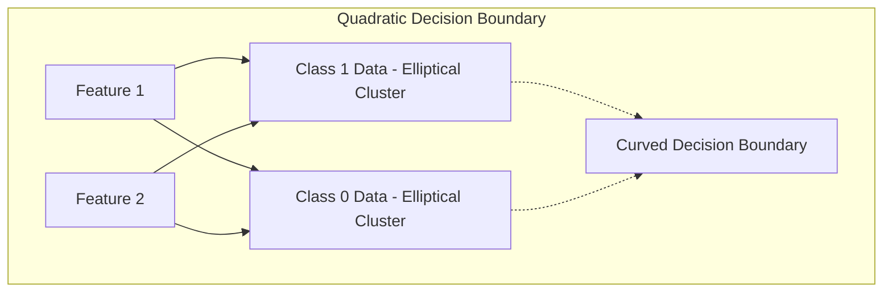
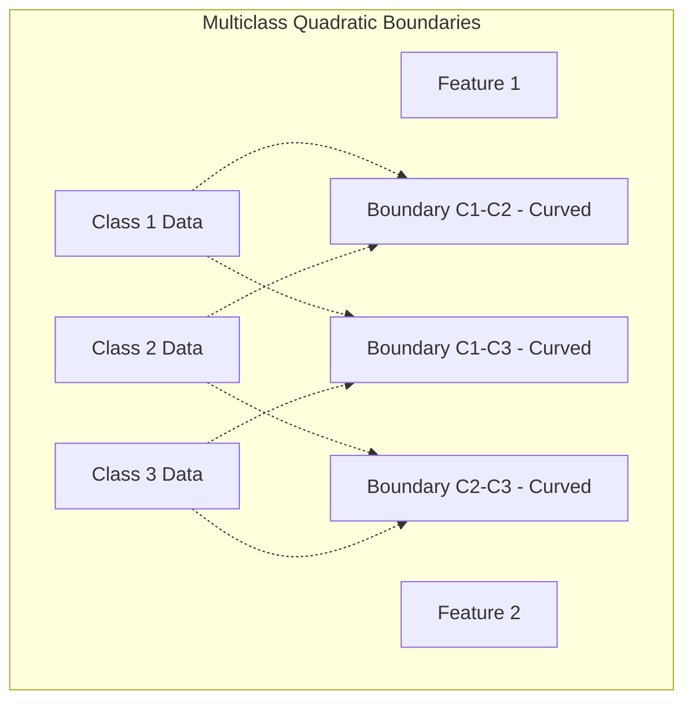
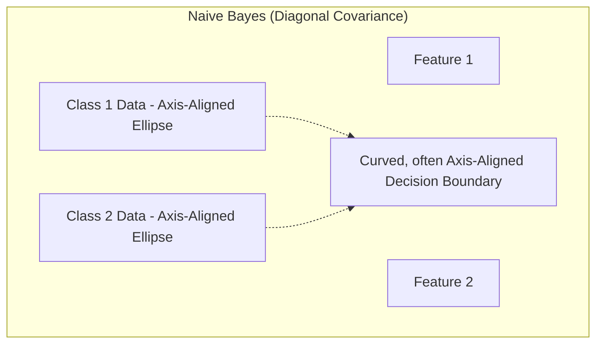
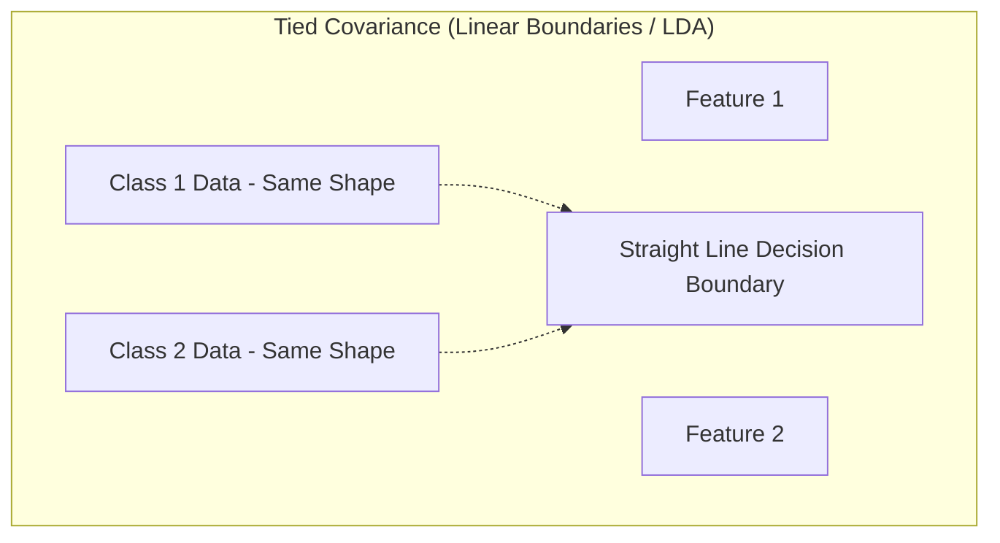

# Generative Gaussian Models for Classification

> **Author**
Marc'Antonio Lopez
AI & Data Analytics student at Polytechnic University of Turin

## Understanding Generative Classifiers

**Classification** in machine learning involves assigning an input data point to one of several predefined categories or classes. **Generative models** address this by learning the underlying process that *generates* the data for each class, effectively building distinct probabilistic models for each category rather than directly drawing boundaries between them.

**Problem Setup in Classification:**

1.  **Input Data (Pattern):** Typically a **feature vector** `x_t`, this vector is a specific observation, or *realization*, of an underlying random variable `X_t`.
2.  **True Class (Label):** An unknown factor, represented by a random variable `C_t`. It can take one of `k` possible values, e.g., $C_t \in \{1, \dots, k\}$. These class labels are arbitrary identifiers (like "cat" or "dog"), implying no inherent order or numerical magnitude.

---

## The Optimal Bayes Decision Rule

The ultimate goal in classification is to assign a new input `x_t` to its **most probable class** given `x_t`. This is achieved by maximizing the **posterior probability** $P(C_t = c \mid X_t = x_t)$, which represents the probability of class `c` given the observed features `x_t`.

**The Decision Rule:**
The optimal decision rule, known as the Bayes Decision Rule, dictates choosing the class $c^*$ that yields the highest posterior probability:

$$
c^*_t = \arg\max_c \, P(C_t = c \mid X_t = x_t)
$$

*   **`arg max` Explanation:** `arg max` means "the argument (or value) that maximizes the expression." Here, it signifies seeking the specific class label `c` that results in the largest value for $P(C_t = c \mid X_t = x_t)$.

**Example: Object Classification**
Consider classifying an image `x_t` by the animal it contains. A generative classifier would:

1.  Calculate $P(\text{Class = cat} \mid \text{Image features } x_t)$.
2.  Calculate $P(\text{Class = dog} \mid \text{Image features } x_t)$.
3.  Calculate $P(\text{Class = rabbit} \mid \text{Image features } x_t)$.
4.  Continue this for each predefined animal class.

The final classification would assign the image to the animal class with the highest calculated probability.

---

## A Binary Example: Inferring Gender from Height

Let's consider a simple example: inferring a person's gender (**Male** or **Female**) based on their height. Histograms of male and female heights typically show two significantly overlapping bell-shaped distributions.

### Using Bayes' Theorem for Classification

The **posterior probability** $P(C = c \mid X = x)$ is often difficult to estimate directly. Therefore, **Bayes' Theorem** becomes invaluable, providing a way to express this posterior probability in terms of quantities typically easier to estimate or learn from data:

$$
P(C = c \mid X = x) = \frac{f_{X|C}(x \mid c) \cdot P(C = c)}{f_X(x)}
$$

Let's break down each component:

*   **$f_{X|C}(x \mid c)$ (Class-Conditional Density / Likelihood):** This term describes the probability density (for continuous features) or probability (for discrete features) of observing feature vector `x` *given* that the data belongs to class `c`. Generative models learn or estimate this core component for *each individual class*, building a model of the data's appearance *within* that class.
*   **$P(C = c)$ (Class Prior Probability):** This represents your **initial belief** about how likely any given data point is to belong to class `c`, *before* observing specific features `x`. It reflects the overall prevalence of that class in the general population or dataset.
*   **$f_X(x)$ (Marginal Probability Density of $x$ / Evidence):** This term represents the overall probability density of observing feature vector `x`, irrespective of its class. It acts as a **normalizing constant** in Bayes' Theorem, ensuring posterior probabilities for all classes sum to 1. It can be expanded using the law of total probability: $f_X(x) = \sum_{c'} f_{X|C}(x \mid c') \cdot P(C = c')$.

**Simplification for Decision Making**

When making a classification decision for a given input `x`, the denominator $f_X(x)$ is constant across *all* classes. Therefore, to maximize $P(C = c \mid X = x)$, one only needs to maximize the numerator:

$$
P(C = c \mid X = x) \propto f_{X|C}(x \mid c) \cdot P(C = c)
$$

The symbol $\propto$ means "is proportional to."

**Generative Approach Steps for Classification:**

Based on this simplification, the steps for a generative classification model are:

1.  **Learn Class-Conditional Densities:** For each class `c`, model or estimate $f_{X|C}(x \mid c)$ by fitting a probability distribution to data specific to that class.
2.  **Determine Class Prior Probabilities:** Estimate $P(C = c)$ for each class, typically by counting the proportion of samples for each class in the training data.
3.  **Calculate Product for Each Class:** For a new input `x` and every possible class `c`, compute the product $f_{X|C}(x \mid c) \cdot P(C = c)$.
4.  **Make Final Decision:** Assign input `x` to the class `c` that has the highest calculated product.

---

## Understanding Class Prior Probability ($P(C = c)$) in Detail

The **class prior probability** $P(C = c)$ reflects your initial expectation of a class's commonness. Its value highly depends on the specific context or application.

*   **Frequentist Perspective:** From a frequentist viewpoint, $P(C = c)$ is estimated as the observed proportion of class `c` samples within a representative dataset.
    *   **Example:** If a dataset has 1000 images, 700 of which are cats, then $P(\text{Class = cat})$ would be estimated as $0.7$.

### Prior Mismatch: Implications and Compensation

A significant issue arises if the class distribution in your training dataset (the **training prior**) substantially differs from the actual distribution in the real-world application (the **application prior**).

*   **Consequence of Mismatch:** For instance, if training data overrepresents rare classes, the model might become biased, overestimating their likelihood in real-world scenarios where they are truly infrequent. This can lead to suboptimal performance.
*   **Compensation:** If the true application prior is known, it's possible to compensate for such mismatches by adjusting the model's output probabilities. This often involves reweighting them based on the difference between training and application priors, ensuring predictions align better with real-world class frequencies.

---

## The Gaussian Classifier: A Specific Generative Model

A particularly powerful and widely used generative classifier is the **Gaussian Classifier**. This model assumes that the feature data `x` for each class `c` follows a **multivariate Gaussian distribution**:

$$
x \mid C=c \sim \mathcal{N}(\mu_c, \Sigma_c)
$$

Here:
*   $\mathcal{N}$ denotes the Gaussian (Normal) distribution.
*   $\mu_c$ (mu-c) is the **mean vector** for class `c`.
*   $\Sigma_c$ (Sigma-c) is the **covariance matrix** for class `c`.

### Parameters Estimated for Each Class `c`:

To define the Gaussian distribution for each class, two main parameters must be estimated from the training data:

1.  **Mean Vector ($\mu_c$):**
    *   **Purpose:** This vector represents the average feature values for all data points belonging to class `c`, indicating the central location or "centroid" of that class's data cloud in the feature space.
    *   **Estimation:** It is estimated by computing the sample mean of all feature vectors $x_i$ that belong to class `c`.
        $$
        \mu_c = \frac{1}{N_c} \sum_{i \in C=c} x_i
        $$
        Where $N_c$ is the total number of training samples belonging to class `c`.
2.  **Covariance Matrix ($\Sigma_c$):**
    *   **Purpose:** This matrix describes the **shape, spread, and orientation** of the data cloud for class `c` in the feature space. Its diagonal elements represent the variance of individual features within class `c`, while off-diagonal elements indicate the covariance between pairs of different features.
    *   **Estimation:** It is estimated by computing the sample covariance matrix of the feature vectors for class `c`.
        $$
        \Sigma_c = \frac{1}{N_c} \sum_{i \in C=c} (x_i - \mu_c)(x_i - \mu_c)^T
        $$

### Univariate Example: Gender Inference with Gaussians

Returning to the gender inference example using height:
*   We would assume that male heights ($X \mid C=M$) are drawn from a univariate Gaussian distribution: $\mathcal{N}(\mu_M, \sigma_M^2)$.
*   Similarly, female heights ($X \mid C=F$) are drawn from another univariate Gaussian distribution: $\mathcal{N}(\mu_F, \sigma_F^2)$.

Visually, this assumption translates to having two distinct, overlapping bell curves—one for males and one for females—representing their respective height distributions.

---

## Calculating Likelihoods and Making Classification Decisions

Let's walk through an example of classifying a person's height, say $x = 174 \, \text{cm}$, assuming we have already estimated the Gaussian parameters ($\mu, \sigma^2$) for Male and Female height distributions.

**Step 1: Compute Class-Conditional Likelihoods**
For each class, we calculate the value of its Gaussian Probability Density Function (PDF) at the observed height $x = 174 \, \text{cm}$.
*   **For Male Class (M):** $f_{X|C}(174 \mid M) \approx 0.05395$. This value indicates the density of male heights at 174cm.
*   **For Female Class (F):** $f_{X|C}(174 \mid F) \approx 0.01198$. This value indicates the density of female heights at 174cm.

**Step 2: Compare Likelihoods (Likelihood Ratio)**
We can compare how much more likely the observed height is under one class's distribution versus another.
*   The ratio $\frac{f_{X|C}(174 \mid M)}{f_{X|C}(174 \mid F)} \approx \frac{0.05395}{0.01198} \approx 4.5$.
*   **Interpretation:** A height of 174cm is approximately 4.5 times more likely to be observed if the person is Male than if they are Female.

**Step 3: Incorporate Prior Probabilities**
To make the final classification decision, we combine this likelihood ratio with our prior beliefs about the prevalence of males and females in the population. We calculate the posterior probability ratio:

$$
\frac{P(C=M \mid X=174)}{P(C=F \mid X=174)} = \left( \frac{f_{X|C}(174 \mid M)}{f_{X|C}(174 \mid F)} \right) \cdot \left( \frac{P(M)}{P(F)} \right)
$$

Let's consider two scenarios for prior probabilities:

*   **Scenario 1: Equal Priors** ($P(M) = P(F) = 0.5$)
    *   In this case, the ratio of priors is $P(M)/P(F) = 0.5/0.5 = 1$.
    *   The posterior ratio becomes approximately $4.5 \times 1 = 4.5$.
    *   **Decision:** Since the posterior probability of Male is 4.5 times higher than Female, the **Decision is Male**. The likelihood dominates the decision.

*   **Scenario 2: Unequal Priors** ($P(F) = 0.9, P(M) = 0.1$)
    *   Here, the prior ratio is $P(M)/P(F) = 0.1/0.9 \approx 0.111$.
    *   The posterior ratio becomes approximately $4.5 \times 0.111 \approx 0.5$.
    *   **Decision:** In this scenario, the posterior probability of Male is about half the posterior probability of Female. The strong prior belief that the person is likely Female significantly influences the decision, leading to a **Decision of Female**, despite the height being more likely from a male distribution. This demonstrates how prior beliefs can heavily impact the final classification.

---

## Estimating Parameters using Maximum Likelihood Estimation (MLE)

For Gaussian Classifiers, estimating the optimal mean vectors ($\mu_c$) and covariance matrices ($\Sigma_c$) for all classes typically uses **Maximum Likelihood Estimation (MLE)**. MLE seeks parameter values that maximize the overall probability of observing the entire labeled training dataset.

The total log-likelihood $\ell(\theta)$ to be maximized is given by:
$$
\ell(\theta) = \sum_{i=1}^n \log [f_{X|C}(x_i \mid c_i, \mu_{c_i}, \Sigma_{c_i}) \cdot P(C=c_i)]
$$
This can be further decomposed into two sums:
$$
\ell(\theta) = \sum_{i=1}^n \log \mathcal{N}(x_i \mid \mu_{c_i}, \Sigma_{c_i}) + \sum_{i=1}^n \log P(C=c_i)
$$
Here, $\theta$ represents all parameters to be estimated, including the mean vectors and covariance matrices for each class: $\theta = \{(\mu_1, \Sigma_1), \dots, (\mu_k, \Sigma_k)\}$.

### Sufficient Statistics for Gaussian Parameters:

A key advantage for Gaussian distributions is that their parameters can be efficiently estimated from just a few **sufficient statistics** for each class `c`. These are simple aggregate values calculated from the training samples belonging to that class:

1.  **Count ($N_c$):**
    *   **Definition:** The total number of training samples belonging to class `c`.
    *   **Use:** This count directly estimates the class prior probability $P(C=c)$ (as $N_c / N_{\text{total}}$) and serves as the denominator in mean and covariance estimation.
2.  **Sum of Features ($F_c = \sum_{i \in C=c} x_i$):**
    *   **Definition:** The sum of all feature vectors for training samples in class `c`.
    *   **Use:** This sum directly computes the sample mean for class `c` ($\mu_c = F_c / N_c$).
3.  **Sum of Outer Products ($S_c = \sum_{i \in C=c} x_i x_i^T$):**
    *   **Definition:** The sum of outer products (matrix multiplication of a column vector by its transpose) of all feature vectors for class `c`.
    *   **Use:** This sum is essential for accurately estimating the sample covariance matrix for class `c`.

---

## Understanding Decision Boundaries

The **decision boundary** is a crucial concept in classification: a theoretical surface (line, plane, or hyperplane) in feature space where a classifier's prediction switches classes. For Bayes classifiers, this boundary occurs where the posterior probabilities of the two most likely classes are exactly equal.

### Binary Classification Case (Class 0 and Class 1):

For a two-class problem, the decision boundary is where posterior probabilities are equal: $P(C=1 \mid x) = P(C=0 \mid x)$. This is equivalent to the posterior probability ratio being 1: $\frac{P(C=1 \mid x)}{P(C=0 \mid x)} = 1$.

Using Bayes' Theorem and taking logarithms, this simplifies to the point where the **Log-Likelihood Ratio (LLR)** equals the log of the prior probability ratio:

$$
\log \frac{f(x \mid C=1)}{f(x \mid C=0)} = \log \frac{P(C=0)}{P(C=1)}
$$

For **Gaussian classifiers (each with its own full covariance matrix $\Sigma_c$)**, this Log-Likelihood Ratio simplifies to a **quadratic function** of the input feature vector `x`:

$$
\text{LLR}(x) \propto x^T A x + b^T x + c
$$

Setting this quadratic function to a constant defines a **quadratic decision boundary**. In a 2D feature space, these boundaries can take the shape of various curves like parabolas, ellipses, or hyperbolas.

**Visual Representation:**

### Multiclass Classification Case:

For more than two classes, the decision rule is to choose class $i$ if its posterior probability is greater than all other classes $j$: $P(C = h_i \mid x) > P(C = h_j \mid x)$ for all $j \neq i$.

The boundaries between *any pair* of classes generally remain quadratic. Thus, the overall decision regions will be partitioned by a network of intersecting curved lines (in 2D) or complex curved surfaces (in higher dimensions), resulting in intricate, curved overall decision regions within the feature space.

**Visual Representation:**

---

## Simplifying Assumption: Naive Bayes (Diagonal Covariance)

**Core Assumption:** The **Naive Bayes** classifier assumes that all features are **conditionally independent** given the class. This implies that within any specific class, one feature's value does not depend on another's.

**Consequence of Assumption:** Due to this conditional independence, the **covariance matrix** for each class ($\Sigma_c$) is forced to be **diagonal**. A diagonal matrix has non-zero values only on its main diagonal, meaning all off-diagonal (covariance) terms are zero, indicating uncorrelated features.

**Simplification of PDF:** With a diagonal covariance matrix, the complex multivariate Gaussian PDF simplifies dramatically into a simple product of univariate (single-feature) Gaussian PDFs:

$$
\mathcal{N}(x \mid \mu_c, \Sigma_c) \approx \prod_{j=1}^D \mathcal{N}(x_j \mid \mu_{c,j}, \sigma_{c,j}^2)
$$

Here, $D$ is the total number of features. This product form is much simpler to compute and estimate.

**Decision Boundary Shape:** While the underlying mathematical form of the Log-Likelihood Ratio (LLR) remains quadratic, the diagonal covariance matrix's specific properties lead to particular decision boundary shapes. These often appear as **axis-aligned ellipses, hyperbolas, or parabolas**, reflecting the lack of correlation between features.

**Visual Representation:**

---

## Simplifying Assumption: Tied Covariance

**Assumption:** The **Tied Covariance** model assumes that *all classes share the exact same covariance matrix*; thus, $\Sigma_c = \Sigma$ for all classes `c`. Crucially, their mean vectors ($\mu_c$) can still differ, meaning classes can be centered in different locations but maintain the same "shape" and "orientation" of their data distribution.

**Consequence:** When this assumption holds, a remarkable simplification occurs in the Log-Likelihood Ratio (LLR): the quadratic terms ($x^T A x$) **cancel out** because the shared covariance matrix makes them identical for all classes.

**Simplification to Linear Function:** Consequently, the LLR simplifies to a purely **linear function** of the input feature vector `x`:

$$
\text{LLR}(x) \propto b^T x + c
$$

**Decision Boundary Shape:** Setting this linear function to a constant defines **linear decision boundaries**. In a 2D feature space, these are straight lines; in higher dimensions, they are hyperplanes. This model is mathematically equivalent to **Linear Discriminant Analysis (LDA)** when applied in a generative context.

**Visual Representation:**

---

## Practical Implementation Notes for Gaussian Classifiers

1.  **Principal Component Analysis (PCA) as Preprocessing:**
    *   **Purpose:** PCA is frequently applied *before* using Gaussian classifiers, primarily for **dimensionality reduction**.
    *   **Benefits:** It helps reduce computational costs, especially for high-dimensional data, and can enhance model generalization by removing noise and redundant features (e.g., reducing a 100-feature dataset to 9 or 50 more informative principal components).
2.  **Naive Bayes Use Cases:**
    *   **Strengths:** Naive Bayes models are particularly effective for **extremely high-dimensional and sparse datasets** (where most feature values are zero), such as in **text document classification** (e.g., word counts). In such cases, estimating a full covariance matrix would be computationally infeasible.
    *   **Caveat:** The strong assumption of conditional independence can be a significant limitation. If features are, in reality, strongly correlated within classes (common in image or sensor data), Naive Bayes can suffer from reduced accuracy by ignoring these crucial dependencies.
3.  **Tied Covariance Use Cases:**
    *   **Applicability:** This approach is especially useful when different classes exhibit broadly **similar shapes or spreads** in the feature space.
    *   **Example:** In MNIST handwritten digit classification, the spread of pixel values for a '1' might be similar to a '7', even if their average pixel values (means) differ significantly. It's also a good choice for limited training data per class, as pooling covariance estimates provides more robust results.

---

## MNIST Handwritten Digit Classification Results: An Example

Let's look at the error rates (as percentages) on the well-known MNIST dataset for various Gaussian models, comparing their performance with raw features and with PCA-reduced features.

| Model                     | Raw (No PCA) | PCA (Features: 50) | PCA (Features: 9) |
| :------------------------ | :----------- | :----------------- | :---------------- |
| **Naive Tied Gaussian**   | 13.7%        | 14.4%              | 25.0%             |
| **Tied Gaussian (LDA)**   | 12.3%        | 12.6%              | 23.7%             |
| **Naive Gaussian**        | 12.2%        | 12.3%              | 23.4%             |
| **Gaussian (Full Cov.)**  | **4.3%**     | **3.6%**           | 12.2%             |

**Key Observations from the Results Table:**

*   **Full Covariance Model Performance:** The **Gaussian (Full Cov.)** model consistently achieves the best performance. Note its error rate of **4.3%** with raw features, which even slightly improves to **3.6%** when PCA reduces features to 50 dimensions.
    *   **Interpretation:** This superior performance indicates that the **distinct "shapes" or orientations** (captured by unique covariance matrices) of the data distributions for each handwritten digit class are highly discriminative. Accounting for specific correlations between pixels within each digit is crucial for optimal accuracy.
*   **Impact of PCA Dimensionality Reduction:**
    *   Applying a moderate amount of PCA (e.g., reducing to 50 features) can actually **improve** performance (as seen with the Full Gaussian model, from 4.3% to 3.6%). This suggests PCA effectively removes noise or redundant dimensions without losing critical information.
    *   However, **aggressive dimensionality reduction** (e.g., down to just 9 features) significantly **increases the error rate** across all models. This clearly demonstrates that reducing features too much can lead to the loss of vital discriminative information needed to distinguish digits.
*   **Naive Bayes Model Performance:** The **Naive Gaussian** and **Naive Tied Gaussian** models generally perform poorly compared to the full covariance and tied covariance models.
    *   **Interpretation:** This poor performance likely stems from the significant **violation of the conditional independence assumption** in image data. Pixels in handwritten digits are highly correlated (e.g., neighboring pixels often have similar values), and the Naive Bayes assumption ignores these crucial dependencies, leading to suboptimal classification.
*   **Tied Covariance (LDA) Model Performance:** While better than the Naive Bayes models, the **Tied Gaussian (LDA)** model still performs worse than the Full Covariance model.
    *   **Interpretation:** This suggests that forcing all digit classes to share identical covariance "shapes" is too restrictive for this dataset. The nuances in how different digits are written (e.g., the spread of a '0' versus a '1') are lost when a single, common covariance matrix is assumed.

---

## Summary of Generative Gaussian Models for Classification

Here's a concise summary of key takeaways regarding generative Gaussian models for classification:

*   **Model Complexity Choice Guidelines:**
    *   **Full-covariance Gaussian Model:** This is generally the **preferred choice** when classes are expected to have distinct and complex "shapes" or orientations in feature space, and sufficient training data is available per class to reliably estimate individual covariance matrices.
    *   **Tied Covariance Model (Equivalent to LDA):** A good option when classes are believed to have broadly similar shapes or spreads in feature space, or when training data per class is limited (pooling data for a single covariance matrix can lead to more robust estimates). It inherently results in **linear decision boundaries**, which are computationally simpler and more interpretable.
    *   **Naive Bayes Model (Diagonal Covariance):** Best applied with **very high-dimensional and sparse data** (e.g., text data) or when features are reasonably believed to be **uncorrelated** within classes. **Risk:** Be aware of significant accuracy loss if strong correlations genuinely exist between features, as the model explicitly ignores them.
*   **Role of Dimensionality Reduction (e.g., PCA):** Techniques like PCA are valuable preprocessing steps. They can reduce computational costs and memory requirements, and potentially enhance generalization by removing noise or redundant information. **Crucial Consideration:** Avoid excessive dimensionality reduction, as this can lead to the loss of critical discriminative information.
*   **Core of the Generative Approach:** The fundamental principle of Gaussian classifiers, and generative models in general, is to **learn the data distribution *for each class*** ($P(X|C)$). These learned class-conditional distributions are then combined with **class prior probabilities** ($P(C)$) using **Bayes' Theorem** to calculate the **posterior probabilities** ($P(C|X)$). These posterior probabilities are subsequently used to make robust and probabilistically informed classification decisions.