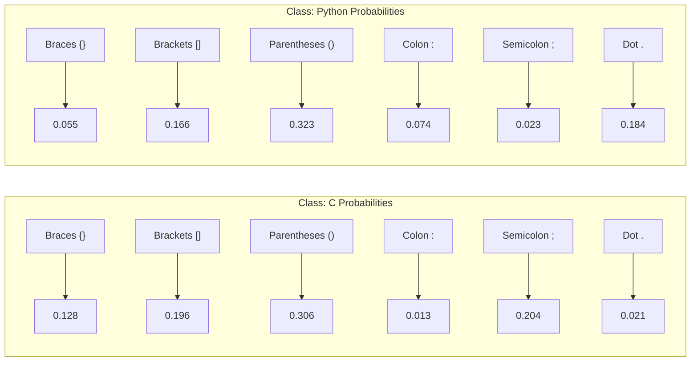

# Generative Multinomial Models: A Detailed Introduction

> **Author**
Marc'Antonio Lopez
AI & Data Analytics student at Polytechnic University of Turin

## Introduction to Generative Multinomial Models

This overview delves into **generative models**, specifically focusing on those designed for **multinomial distributions**. Generative models function by learning the intrinsic process that generates the data. In the context of classification, this typically involves modeling the probability of observing certain features *given* a specific class ($P(\text{features} \mid \text{class})$).

The **multinomial distribution** is central to these models, generalizing Bernoulli and binomial distributions to outcomes falling into multiple discrete categories. Consequently, generative multinomial models are foundational for handling **discrete features**—variables that can take values from a finite set of categories (e.g., 'red', 'green', 'blue') or represent counts (e.g., the number of times a specific word appears in a document).

---

## Discrete Features and Categorical Variables

### Working with Single Categorical Features

Generative multinomial models are particularly well-suited for classification tasks where the input consists of a **single categorical feature**. If this feature `x` can take `m` distinct values (i.e., $x \in \{1, 2, \dots, m\}$), these models provide a direct way to estimate the probabilities of each feature value given a class.

### Example: Predicting Cat Gender Based on Fur Color

Let's illustrate with an example: predicting a cat's gender (our class) based on its fur color (our single categorical feature). Possible fur color categories might include: $\{\text{white, black, orange, gray, bi-color, calico, ...}\}$.

To train such a model, we would assemble a dataset, $D = \{(x_1, c_1), \dots, (x_n, c_n)\}$. Each entry in this dataset would consist of an observed cat's fur color ($x_i$) and its corresponding known gender ($c_i$). The model would then learn the patterns of fur colors within each gender.

---

## Independent and Identically Distributed (i.i.d.) Samples

### The i.i.d. Assumption in Machine Learning

A foundational assumption underlying many machine learning models, including generative multinomial models, is that the training samples are **independent and identically distributed (i.i.d.)**. This assumption has two key parts:

*   **Independent:** The observation or measurement of one sample (e.g., one cat's fur color and gender) has absolutely no influence on, nor is it influenced by, the observation of any other sample. Each sample is a separate, unrelated event.
*   **Identically Distributed:** All samples are assumed to be drawn from the exact same underlying probability distribution. This means statistical properties (like the probability of a certain fur color for a given gender) are consistent across all samples.

### Goal: Estimating Conditional Probabilities

Given the i.i.d. assumption, our primary objective is therefore to estimate the **conditional probability** of observing a specific feature value `x_t` for a new test sample, *given* that it belongs to a particular class `c`. This is formally expressed as $P(X_t = x_t \mid C_t = c)$. For simplicity, we often denote this conditional probability as $\pi_{c, x_t}$.

*   **Example:** $P(\text{white} \mid \text{female})$ (or $\pi_{\text{female, white}}$) represents the probability that a randomly selected female cat will have white fur.
*   **Parameter Constraint:** Crucially, for each class `c`, the sum of probabilities for all possible feature values must equal one. That is, for a parameter vector $\pi_c = (\pi_{c,1}, \dots, \pi_{c,m})$, we must have $\sum_{j=1}^m \pi_{c,j} = 1$. This ensures that the probabilities for a given class are properly normalized.

---

## Maximum Likelihood Estimation (MLE)

### Estimating Parameters using MLE

**Maximum Likelihood Estimation (MLE)** is a widely used statistical method within the frequentist paradigm. Its core principle is to find the set of parameter values that make the observed training data appear *most probable*, focusing exclusively on maximizing the likelihood of observing that data given a particular set of parameters. In our context, the full set of parameters to be estimated across all classes is denoted as $\Pi = (\pi_1, \dots, \pi_k)$, where $\pi_c$ is the parameter vector for class `c`.

### Likelihood of the Training Set

Assuming all training samples are independent and identically distributed (i.i.d.), the total likelihood of the entire training dataset $D$ given the parameters $\Pi$ can be calculated as the product of the probabilities of observing each individual sample:

$$
L(\Pi) = P(D \mid \Pi) = \prod_{i=1}^n P(X_i = x_i, C_i = c_i \mid \Pi)
$$

Using the chain rule of probability, we can rewrite the term inside the product:
$$
P(X_i = x_i, C_i = c_i \mid \Pi) = P(X_i = x_i \mid C_i = c_i, \Pi) P(C_i = c_i \mid \Pi)
$$

For the specific purpose of estimating the class-conditional probabilities $\pi_{c,j}$ (i.e., $P(X_i = x_i \mid C_i = c_i, \Pi)$), we can ignore the prior probability $P(C_i = c_i \mid \Pi)$ because it does not depend on $\pi_{c,j}$. Therefore, we primarily focus on the proportional part of the likelihood related to the features given the classes:

$$
L(\Pi) \propto \prod_{i=1}^n P(X_i = x_i \mid C_i = c_i) = \prod_{i=1}^n \pi_{c_i, x_i}
$$

---

## Example Dataset: Cat Gender Classification

### Cat Gender Dataset for Illustration

Let's use a small dataset of 10 cat samples to illustrate the calculations involved in generative multinomial models. This dataset contains observations of fur color ($x_i$) and corresponding gender ($c_i$):

| Fur Color ($x_i$) | Gender ($c_i$) |
| :---------------- | :------------- |
| black             | male           |
| orange            | male           |
| black             | female         |
| orange            | male           |
| white             | male           |
| white             | female         |
| white             | male           |
| white             | female         |
| black             | female         |
| calico            | female         |

### Likelihood Calculation Example

Based on this dataset, the overall likelihood $L(\Pi)$ would be computed as the product of the individual conditional probabilities $P(\text{fur color} \mid \text{gender})$ for each of the 10 samples. For example, for the first sample (black fur, male gender), the term included in the product would be $P(\text{black} \mid \text{male})$. This process would be repeated for all 10 samples, and their product would form the total likelihood.

---

## Log-Likelihood Function

### Simplifying Optimization with Log-Likelihood

Maximizing the likelihood function $L(\Pi)$ can be computationally challenging due to the product of many small probabilities. To simplify the optimization process, it is standard practice to maximize the **log-likelihood** $\ell(\Pi) = \log L(\Pi)$ instead. This is mathematically equivalent, as the logarithm is a monotonically increasing function. The key benefit is that it transforms products into sums, which are much easier to work with in optimization problems:

$$
\ell(\Pi) = \sum_{i=1}^n \log \pi_{c_i, x_i}
$$

This sum can be further rearranged by grouping terms that belong to the same class:

$$
\ell(\Pi) = \sum_{c=1}^k \left( \sum_{i \text{ such that } c_i = c} \log \pi_{c, x_i} \right)
$$

This crucial **factorization** (breaking the sum into independent components for each class) means we can optimize the parameters for each class $\pi_c$ independently of the parameters for other classes, greatly simplifying the estimation process.

### Rewriting the Class-Specific Log-Likelihood

Specifically, for a single class `c`, the log-likelihood contribution can be rewritten based on counts of feature occurrences within that class:

$$
\ell_c(\pi_c) = \sum_{j=1}^m N_{c,j} \log \pi_{c,j}
$$

Here, $N_{c,j}$ denotes the **count** of training samples that belong to class `c` *and* exhibit feature value `j`.

### Example Counts from Cat Dataset

To demonstrate, let's derive the counts $N_{c,j}$ from our example Cat Gender Dataset:

| Feature (Fur Color) | Count in Female ($N_{\text{female},j}$) | Count in Male ($N_{\text{male},j}$) |
| :------------------ | :------------------------------------- | :------------------------------- |
| black               | 2                                      | 1                                |
| orange              | 0                                      | 2                                |
| white               | 2                                      | 2                                |
| calico              | 1                                      | 0                                |
| **Total ($N_c$)**   | **5**                                  | **5**                            |

*(Note: $N_c$ here represents the total number of samples for that class, not necessarily total word tokens in text classification yet, which will be discussed later).*

---

## Maximum Likelihood Solution for Multinomial Parameters

### The MLE Formula for Multinomial Probabilities

By applying standard optimization techniques, typically involving **Lagrange multipliers** to handle the constraint that probabilities for a class must sum to one ($\sum \pi_{c,j}=1$), the Maximum Likelihood Estimate (MLE) for $\pi_{c,j}$ is derived as a simple **relative frequency**:

$$
\pi_{c,j}^{\text{ML}} = \frac{N_{c,j}}{N_c} = \frac{\text{Number of times feature } j \text{ appears in class } c}{\text{Total number of samples in class } c}
$$

*   **Clarification for Word Counts:** When dealing with features representing word counts (as in text classification), $N_c$ here refers to the total number of *word tokens* (individual word occurrences) observed across all documents belonging to class `c`.

### Predictive Distribution Using MLE Estimates

Once these MLE parameters ($\pi_{c,j}^{\text{ML}}$) are estimated from the training data, they can be used for prediction. For a new test sample with an observed feature value $x_t$, the conditional probability $P(X_t = x_t \mid C_t = c)$ is simply approximated by the estimated parameter: $\pi_{c, x_t}^{\text{ML}}$.

### Example MLE Results from Cat Dataset

Using the counts from our Cat Gender Dataset, here are the Maximum Likelihood Estimates for the probability of each fur color given the cat's gender:

**For Female Cats (Total Female Samples $N_{\text{female}}=5$):**

| Feature (j) | MLE ($\pi_{\text{female},j}^{\text{ML}}$) | Calculation              |
| :---------- | :--------------------------------------- | :----------------------- |
| black       | 0.4                                      | $2/5$                    |
| orange      | 0.0                                      | $0/5$                    |
| white       | 0.4                                      | $2/5$                    |
| calico      | 0.2                                      | $1/5$                    |

**For Male Cats (Total Male Samples $N_{\text{male}}=5$):**

| Feature (j) | MLE ($\pi_{\text{male},j}^{\text{ML}}$) | Calculation              |
| :---------- | :------------------------------------- | :----------------------- |
| black       | 0.2                                    | $1/5$                    |
| orange      | 0.4                                    | $2/5$                    |
| white       | 0.4                                    | $2/5$                    |
| calico      | 0.0                                    | $0/5$                    |

---

## Handling Multiple Attributes (The Naive Bayes Approximation)

### The Challenge of Multiple Features (Curse of Dimensionality)

When we move from a single categorical feature to multiple categorical features (e.g., trying to model the joint probability of fur color *and* eye color given gender, $P(\text{fur color, eye color} \mid \text{gender})$), we quickly encounter a significant problem known as the **curse of dimensionality**.

This "curse" arises because the number of possible unique combinations of feature values grows **exponentially** with the number of features. For example, if fur color has 6 values and eye color has 4 values, there are $6 \times 4 = 24$ possible combinations. If we add another feature with 5 values, it jumps to $24 \times 5 = 120$ combinations, and so on. This rapid increase leads to:

*   **Severe Data Sparsity:** In a finite training dataset, most of these combinations will never be observed, or will appear very rarely.
*   **Unreliable Probability Estimates:** With insufficient observations for each combination, the probability estimates become highly unreliable and prone to sampling errors.

### The Naive Bayes Approximation as a Solution

To circumvent the curse of dimensionality, the **Naive Bayes approximation** is widely adopted. Its **core assumption** is a strong simplification: it assumes that features are **conditionally independent given the class**. This means that if you know the class of an item (e.g., "female cat"), then knowing its fur color provides no additional information about its eye color (beyond what you already know from its class).

**Mathematical Simplification:** This powerful (and often unrealistic, but effective) assumption allows the joint conditional probability of observing multiple features to be dramatically simplified into a simple product of individual conditional probabilities for each feature `j`:

$$
P(X_t = x_t \mid C_t = c) \approx \prod_{j=1}^D P(X_{t,j} = x_{t,[j]} \mid C_t = c) = \prod_{j=1}^D \pi_{c, j, x_{t,[j]}}
$$

Here:
*   $D$ represents the total number of features (e.g., fur color, eye color, tail length).
*   $x_{t,[j]}$ is the observed value of the `j`-th feature for the test sample `t`.
*   $\pi_{c, j, v}$ is the probability of the `j`-th feature having value `v` *within* class `c`. This parameter is estimated using MLE, as described earlier, for each feature independently.

---

## Extended Problem: Event Occurrences (e.g., Word Counts in Text)

### Shifting Focus: From Categories to Counts of Events

Beyond dealing with simple categorical values (like 'black' or 'orange'), features can also represent **counts of events**. This scenario is extremely common in areas like text classification, where the "features" are how many times specific words appear.

### The Bag-of-Words (BoW) Approximation

**Text classification** frequently relies on the **Bag-of-Words (BoW) model**. This is a powerful approximation that simplifies documents significantly:

*   **Process:** It treats a document as an unordered collection (a "bag") of words, completely **ignoring word order** and grammar.
*   **Focus:** Instead, it focuses solely on the **frequency (count)** of each word, typically derived from a predefined vocabulary.
*   **Representation:** Under the BoW model, a document is represented as a vector $x = (x[1], \dots, x[m])$. In this vector, $x[j]$ denotes the count of the $j$-th word from the vocabulary within that document, and $m$ is the size of the vocabulary.

---

## Multinomial Distribution for Word Counts

### Modeling Document Word Counts

For modeling document word count vectors $x$ (obtained via the Bag-of-Words model) within a given class `c`, a **Multinomial distribution** is the appropriate choice. This distribution models the probabilities of obtaining specific counts for multiple categories (words) in a fixed number of trials (total words in a document).

*   **Parameters $\pi_c = (\pi_{c,1}, \dots, \pi_{c,m})$:**
    *   Here, $\pi_{c,j}$ represents the probability that a **single word randomly drawn** from *all* documents belonging to class `c` will be word `j`. This is essentially the relative frequency of word `j` within all text of class `c`.
    *   As with any probability distribution, these parameters must sum to one: $\sum_{j=1}^m \pi_{c,j} = 1$.
*   **Probability of a Document (Multinomial PMF):**
    The probability mass function (PMF) for observing a specific document `X=x` (represented by its word count vector) given that it belongs to class `C=c` is:
    $$
    P(X = x \mid C = c) = \frac{(\sum_{j=1}^m x[j])!}{\prod_{j=1}^m x[j]!} \prod_{j=1}^m \pi_{c,j}^{x[j]}
    $$
    *   **Simplification for Optimization:** The term $\frac{(\sum_{j=1}^m x[j])!}{\prod_{j=1}^m x[j]!}$ is a **multinomial coefficient**. It is constant with respect to the parameters $\pi_{c,j}$ because it only depends on the counts observed in the document (and the total number of words). Therefore, for parameter optimization (finding the $\pi_{c,j}$ that maximize the likelihood), this coefficient can be ignored, and the likelihood is proportional to:
        $$
        P(X = x \mid C = c) \propto \prod_{j=1}^m \pi_{c,j}^{x[j]}
        $$

---

## Log-Likelihood Function (for Word Counts)

### Deriving the Log-Likelihood for Multinomial Counts

Similar to the single categorical feature case, when dealing with multinomial word counts, we optimize the log-likelihood function for the entire dataset $\ell(\Pi)$. Considering only the proportional part relevant for parameter optimization (ignoring constant multinomial coefficient terms):

$$
\ell(\Pi) = \sum_{i=1}^n \sum_{j=1}^m x_i[j] \log \pi_{c_i, j}
$$

This can again be factored and optimized independently for each class `c`:

$$
\ell(\Pi) = \sum_{c=1}^k \ell_c(\pi_c)
$$

where the class-specific log-likelihood $\ell_c(\pi_c)$ is:

$$
\ell_c(\pi_c) = \sum_{i \text{ s.t. } c_i = c} \sum_{j=1}^m x_i[j] \log \pi_{c,j}
$$

This means we sum the counts of each word `j` across all documents belonging to class `c`, and then multiply by the log probability of that word.

---

## ML Solution for Word Probabilities

### Deriving the MLE for Word Counts

Upon close examination, the log-likelihood for a single class `c` in the context of word counts, $\ell_c(\pi_c) = \sum_{j=1}^m N_{c,j} \log \pi_{c,j}$, is mathematically **identical** to the form of the log-likelihood for the single categorical feature case. Here, $N_{c,j}$ represents the **total count of word `j`** summed across all training documents belonging to class `c`.

### The Maximum Likelihood Estimate (MLE) Formula for Word Probabilities

Consequently, the Maximum Likelihood Estimate (MLE) for the probability of a specific word `j` within class `c` ($\pi_{c,j}^{\text{ML}}$) is precisely:

$$
\pi_{c,j}^{\text{ML}} = \frac{N_{c,j}}{N_c}
$$

Where $N_c = \sum_{j=1}^m N_{c,j}$ signifies the **total count of *all* words** (i.e., the sum of all word tokens) observed across all training documents that belong to class `c`. This is sometimes called the "total word count" or "vocabulary size for class c" in the context of text.

---

## Binary Classification Example: C vs. Python Files

### Problem Setup

Let's apply these concepts to a practical binary classification problem: distinguishing between C programming files ($h_1$) and Python programming files ($h_0$) based on the counts of various punctuation symbols found within the files. These punctuation symbol counts will serve as our discrete features.

### Log-Likelihood Ratio (LLR) for Classification

For a new, unseen file with observed symbol counts represented by the vector `x`, we can make a classification decision by comparing the likelihood of `x` belonging to each class. This is commonly done using the **Log-Likelihood Ratio (LLR)**:

$$
\text{llr}(x) = \log \frac{P(X = x \mid C = h_1)}{P(X = x \mid C = h_0)}
$$

Substituting the Multinomial PMF (and ignoring the constant multinomial coefficient part that cancels out in the ratio), the LLR simplifies to:

$$
\text{llr}(x) = \sum_{j=1}^m x[j] \log \frac{\pi_{h_1, j}^{\text{ML}}}{\pi_{h_0, j}^{\text{ML}}}
$$

Here, $x[j]$ is the count of symbol `j` in the new file, and $\pi_{h_1, j}^{\text{ML}}$ and $\pi_{h_0, j}^{\text{ML}}$ are the MLEs for the probability of symbol `j` occurring in C and Python files, respectively.

**Decision Rule:**

*   If $\text{llr}(x) > 0$: The numerator (likelihood for class C) is greater than the denominator (likelihood for class Python). Therefore, classify the file as **C**.
*   If $\text{llr}(x) < 0$: The likelihood for class Python is greater. Therefore, classify the file as **Python**.
*   If $\text{llr}(x) = 0$: The likelihoods are equal. A tie-breaking rule would be needed (e.g., classifying as the more common language a priori).

### Example LLR Results

Let's assume we've calculated the $\pi^{\text{ML}}$ values from a training dataset.
*   For a test file $x_1$: If its calculated LLR is $\text{llr}(x_1) \approx 2.7$. Since $2.7 > 0$, it is classified as a **C file**.
*   For a test file $x_2$: If its calculated LLR is $\text{llr}(x_2) \approx -3.9$. Since $-3.9 < 0$, it is classified as a **Python file**.

---

## ML Estimates for Model Parameters (Illustration)

### Estimated Probabilities ($\pi_{c,j}^{\text{ML}}$)

This conceptual diagram illustrates typical estimated $\pi_{c,j}$ values for various punctuation symbols, showing their probabilities of occurrence within C and Python codebases based on a hypothetical training set:

*(These values sum to 1 within each class to represent valid probability distributions of symbols for C and Python code.)*

---

## Discriminant Symbols: Identifying Key Indicators

By comparing the estimated $\pi_{c,j}^{\text{ML}}$ values across classes, we can identify which symbols are particularly **discriminant** (i.e., strongly indicative) of one class over another:

*   **Symbols Indicating C Files:** The **semicolon (`;`)** is a clear indicator of a C file. Its estimated probability ($\pi$ in C is $0.204$) is significantly higher compared to its probability in Python ($0.023$). This makes intuitive sense, as semicolons are widely used for statement termination in C but are optional or less common in Python.
*   **Symbols Indicating Python Files:** Conversely, the **colon (`:`)** and the **dot (`.`)** symbols are stronger indicators of Python files. For example, the probability of a colon in Python ($\pi_{Py, :} = 0.074$) is considerably higher than in C ($\pi_{C, :} = 0.013$). Similarly, the dot has a much higher probability in Python ($0.184$) than in C ($0.021$). This reflects their extensive use in Python for defining blocks (colons) and accessing attributes/methods (dots).
*   **Less Useful Symbols:** Round brackets (`()`) are comparatively less discriminative. They exhibit similar probabilities ($\approx 0.3$) in both C and Python files, suggesting they don't strongly distinguish between the two languages based on their frequency alone.

---

## Test Scripts: Evaluating New Files

To illustrate the classification process with actual counts, here are the punctuation symbol counts for two hypothetical test scripts. $x_1$ is designed to resemble a C file, and $x_2$ is designed to resemble a Python file:

| Symbol | Test Script $x_1$ Counts (C-like) | Test Script $x_2$ Counts (Python-like) |
| :----- | :-------------------------------- | :------------------------------------- |
| {}     | 2                                 | 2                                      |
| []     | 10                                | 18                                     |
| ()     | 12                                | 16                                     |
| :      | 0                                 | 3                                      |
| ;      | 1                                 | 0                                      |
| .      | 1                                 | 1                                      |
| **Total** | **26**                            | **40**                                 |

*(You would use these counts, along with the estimated $\pi_{c,j}^{\text{ML}}$ values from the previous section, to calculate the LLR for each test script and make a classification decision.)*

---

## Practical Considerations: Handling Zero Counts

### The Zero Probability Problem

A critical practical challenge arises in multinomial models (especially Naive Bayes) if a particular test feature value (e.g., a specific word or symbol) **never appeared in the training data for a specific class**. In such a scenario:

*   Its Maximum Likelihood Estimate (MLE) probability ($\pi_{c,j}^{\text{ML}}$) would be calculated as 0.
*   When calculating the overall likelihood for that class using the product formula ($\prod \pi_{c,j}^{x[j]}$), even if only one $x[j]$ is non-zero and its corresponding $\pi_{c,j}^{\text{ML}}$ is 0, the entire product will become 0.
*   This would cause the overall likelihood for that class to become 0 and its log-likelihood to become $-\infty$.
*   **Consequence:** This effectively makes classification for that class impossible, as the model cannot properly evaluate its probability.

### Solution: Pseudo-counts (Smoothing)

To mitigate this problem, a common and highly effective solution is to apply **smoothing** techniques. The most popular method involves adding a small **pseudo-count** $\alpha$ (alpha) to all observed counts, even those initially zero.

The smoothed MLE formula for $\pi_{c,j}$ becomes:

$$
\pi_{c,j}^{\text{smoothed}} = \frac{N_{c,j} + \alpha}{N_c + m \alpha}
$$

Here:
*   $N_{c,j}$ is the observed count of feature `j` in class `c`.
*   $N_c$ is the total count of all features in class `c`.
*   $m$ is the total number of unique features in the vocabulary/feature space.
*   $\alpha$ is the pseudo-count. A common choice is $\alpha=1$, known as **Laplace smoothing** or "add-one smoothing."

**Benefits of Smoothing:**
*   Ensures all feature probabilities are non-zero, preventing the zero probability problem.
*   Provides a more robust and less sensitive estimate, especially for rare features.
*   **Mathematical Equivalence:** Importantly, applying pseudo-counts is mathematically equivalent to performing **Maximum A Posteriori (MAP) estimation** with a **Dirichlet prior distribution** over the parameters. This means we implicitly incorporate a prior belief that all feature values have a small, non-zero probability.

---

## Advanced Techniques Beyond Basic Multinomial Models

While basic multinomial models are powerful, several advanced techniques exist to address their limitations and further enhance performance:

1.  **Full Bayesian Methods:**
    *   **Approach:** Instead of relying on single point estimates (like MLE), full Bayesian methods compute the entire **posterior distribution** of the model parameters.
    *   **Benefits:** This approach inherently accounts for parameter uncertainty, leading to more robust and reliable predictions, especially with smaller datasets where point estimates might be unstable. It also provides a full probabilistic output, not just a single class prediction.

2.  **Modeling Feature Dependencies:**
    *   **Addressing Naive Bayes Limitation:** The strong conditional independence assumption of Naive Bayes is often unrealistic in real-world data (e.g., in text, "New" is often followed by "York").
    *   **Solutions:** More sophisticated models can explicitly capture and leverage these feature correlations:
        *   **N-grams:** For sequential data like text, using n-grams (sequences of n words) as features instead of single words can capture local word dependencies.
        *   **Graphical Models:** These models (e.g., Bayesian Networks, Markov Random Fields) allow for explicit representation and modeling of conditional dependencies between features.

3.  **Hybrid Models:**
    *   **Scenario:** For datasets containing a mix of different feature types (e.g., categorical features like 'fur color' and continuous features like 'weight'), it's possible to combine different generative models.
    *   **Approach:** For instance, multinomial models can handle count-based or categorical features, while Gaussian models can handle continuous ones. These different feature-specific models are often combined under a broader **Naive Bayes assumption across feature *groups*** (i.e., assuming the fur color model is independent of the weight model, given the class).

---

## Equivalence: Categorical vs. Count-Based Models

### Two Equivalent Views of Discrete Data

It is crucial to understand that discrete features, particularly in the context of text or event counts, can be conceptually modeled in two fundamentally equivalent ways:

1.  **Categorical Model (Token-based):**
    *   **Viewpoint:** In this perspective, each individual discrete observation (or "token," such as a single word in a document) is considered an independent draw from a Categorical (or Multinomial with N=1) distribution. This distribution is parameterized by $\pi_c$, which represents the probability of drawing each category within class `c`.
    *   **Log-Likelihood:** The log-likelihood for this model, considering all individual tokens across all documents in a class, is given by: $\ell_X(\pi) = \sum_{j=1}^m N_j \log \pi_j$, where $N_j$ is the total count of category `j` across all tokens.

2.  **Multinomial Model (Document-based):**
    *   **Viewpoint:** Alternatively, the entire count vector representing an entity (e.g., a document's word counts, where each document has a fixed total number of words $N$) is considered a single draw from a Multinomial distribution. This distribution is also defined by the same $\pi_c$ parameters and the total count $N$.
    *   **Log-Likelihood:** The log-likelihood for this perspective, ignoring the constant multinomial coefficient, is: $\ell_Y(\pi) = \text{Constant} + \sum_{j=1}^m N_j \log \pi_j$.

**Key Observation on Equivalence:**

A critical insight is that the two log-likelihood functions, $\ell_X(\pi)$ and $\ell_Y(\pi)$, are **proportional** to each other. They differ only by a constant term independent of the parameters $\pi$. Consequently, their raw likelihoods are also proportional: $L_X(\pi) \propto L_Y(\pi)$.

**Significant Implications of this Equivalence:**

This mathematical equivalence has profound practical implications for generative multinomial models:

1.  **Identical MLE:** Both modeling views (categorical/token-based and multinomial/document-based) will yield precisely the **same Maximum Likelihood Estimates** for the probabilities $\pi_j^{\text{ML}} = N_j / N$. This means you can count words per document or words per class and arrive at the same parameter estimates.
2.  **Identical Bayesian Posteriors:** Similarly, if you were to employ Bayesian methods for parameter estimation, both views would result in **identical posterior distributions** for the parameters $\pi$.
3.  **Identical Classification Inference:** Most importantly, the classification decisions made by models built on either view will be **identical**. This is because any constant factors (like the multinomial coefficient in the document-based PMF) will cancel out when forming Log-Likelihood Ratios (LLRs) or comparing posterior probabilities for classification, thus not affecting the final decision.

---

## Conclusion: Recap and Key Takeaways

### Lecture Recap

This lecture provided a detailed introduction to **generative multinomial models**, outlining their core principles and practical applications:

*   We began by exploring how to model **single categorical features** using Maximum Likelihood Estimation (MLE), where parameters (probabilities) are simply calculated as relative frequencies.
*   To tackle the challenge of **multiple discrete features**, we introduced the powerful **Naive Bayes approximation**, which assumes conditional independence between features given the class.
*   The concepts were then extended to scenarios involving **event occurrences and word counts**, demonstrating how the **Multinomial distribution** is the appropriate choice for modeling these feature types, along with its corresponding MLE derivation.
*   Crucially, we addressed the vital practical issue of **zero probabilities** (when a feature is unseen in a class's training data) by introducing the effective technique of **smoothing (using pseudo-counts)**.
*   Finally, we formally established the **equivalence** between token-based (categorical) and count-based (multinomial) models for discrete data, showing that they lead to the same parameter estimates and classification decisions.
*   **Overall:** These models are highly effective for discrete data classification, finding particular utility in applications such as Natural Language Processing (NLP).

### Final Summary: Key Takeaways

To summarize the essential points from this discussion:

*   **Generative models based on categorical and multinomial distributions** are fundamental and versatile tools for classifying data that consists of discrete features.
*   These models are well-suited for modeling a diverse range of discrete data types, including straightforward categorical variables like fur colors, count-based features like the occurrences of programming symbols in code, or word frequencies in text documents.
*   The primary method for **parameter estimation** in these models is **Maximum Likelihood Estimation (MLE)**, which translates to calculating simple relative frequencies (counts divided by totals). For robustness, especially to handle previously unseen feature values, **smoothing (or pseudo-counts)** is a critical enhancement.
*   The **Naive Bayes assumption**, despite its simplicity, provides an efficient and practical solution for handling multiple discrete features, particularly in very high-dimensional feature spaces where more complex models might be intractable.
*   The established **equivalence** between models that view data as individual tokens versus those that view them as multinomial count vectors provides valuable conceptual flexibility and, more importantly, guarantees consistent classification inference regardless of the exact data representation chosen.