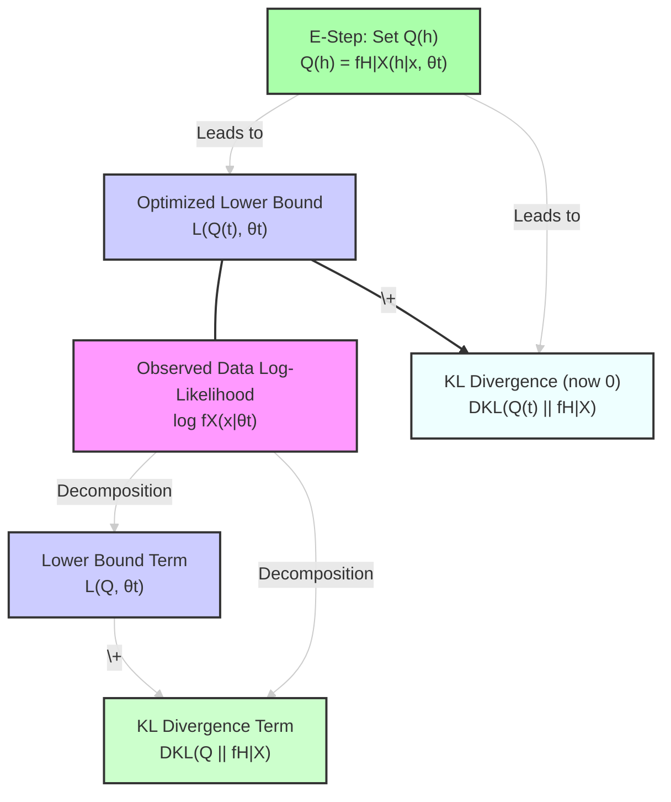
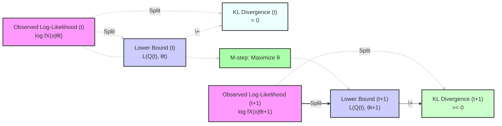
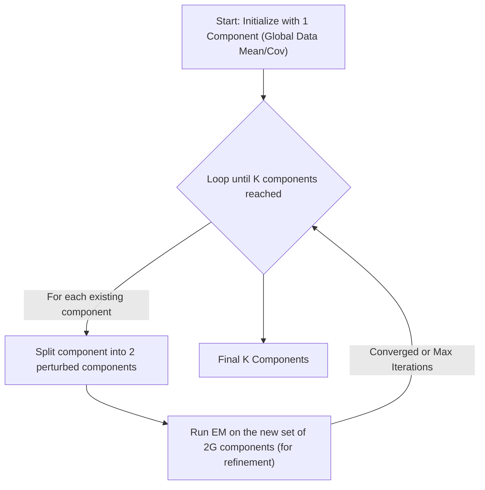

# Gaussian Mixture Models (GMM)

> **Author**
Marc'Antonio Lopez
AI & Data Analytics student at Polytechnic University of Turin

## Introduction to Gaussian Mixture Models (GMMs)

**Generative models** in machine learning learn and represent the underlying probability distributions from which data is generated. While a basic **Gaussian classifier** typically assumes that data for each class originates from a **single Gaussian (Normal) distribution**, real-world data often exhibits **multi-modality**. This means the data has multiple distinct peaks or clusters, suggesting it's better described by several underlying distributions rather than just one.

Consequently, attempting to model such complex data with a single Gaussian distribution frequently leads to an inaccurate representation, as it fails to capture these distinct peaks or sub-clusters. This limitation is conceptually illustrated when comparing fitting a single Gaussian to a multi-modal dataset versus using multiple Gaussians: a single Gaussian poorly represents individual clusters, resulting in a broad, inaccurate fit. In contrast, using multiple Gaussians allows each component to adapt to a different mode or cluster, forming a composite curve that closely approximates the data's multi-peaked nature.

---

## Density Estimation using GMMs

Given that single Gaussian distributions are often insufficient for modeling complex data, **Gaussian Mixture Models (GMMs)** offer a highly flexible and powerful alternative for estimating and representing multi-modal probability distributions. GMMs are widely regarded as **universal approximators** of probability distributions; theoretically, they can approximate any sufficiently regular density function with increasing accuracy as more Gaussian components are added.

However, it is crucial to note that for reliable parameter estimation and effective modeling with GMMs, especially with a larger number of components, **sufficient data** must be available. Insufficient data can lead to unstable or degenerate parameter estimates.

---

## Applications of GMMs Beyond Classification

Beyond their role in classification, GMMs are exceptionally versatile models that find extensive applications across various domains:

*   **General Population Density Estimation:** GMMs are widely used to understand complex dataset structures. By fitting a GMM, one can identify natural clusters and infer probability density at any point, providing insights into data concentration.
*   **Probabilistic Clustering (Soft Clustering):** Unlike "hard" clustering algorithms (e.g., K-means, which definitively assign points to a single cluster), GMMs provide **"soft" or probabilistic assignments**. For each data point, a GMM outputs a probability that it belongs to each constituent Gaussian component, offering a more nuanced and informative output that reflects uncertainty in cluster membership.
*   **Anomaly Detection:** Data points exhibiting very low probability density under the learned GMM can be flagged as anomalies or outliers.
*   **Generative Modeling:** Once trained, a GMM can be used to generate new data samples that resemble the original training data.

---

## GMMs in the Context of Gaussian Classification

In a traditional Gaussian classifier, where each of $K$ classes is modeled by a single Gaussian distribution, the class-conditional density for class $c$ is $f_{X|C}(\mathbf{x}|c) = \mathcal{N}(\mathbf{x}|\boldsymbol{\mu}_c, \boldsymbol{\Sigma}_c)$. Additionally, $P(C=c)=\pi_c$ represents the prior probability of class $c$.

In this framework, the **overall marginal density** $f_X(\mathbf{x})$ of the entire dataset (across all classes) is given by the sum of these class-conditional densities, weighted by their respective prior probabilities:

$$
f_X(\mathbf{x}) = \sum_{c=1}^K \pi_c\mathcal{N}(\mathbf{x}|\boldsymbol{\mu}_c, \boldsymbol{\Sigma}_c) \quad (1)
$$

**Remarkably, this formula (Equation 1) is precisely the mathematical definition of a Gaussian Mixture Model (GMM)!** This implies that in a standard Gaussian classifier (where each class is a single Gaussian), the overall data distribution can be viewed as a GMM where each component directly corresponds to an individual class. When GMMs are explicitly used for classification, this concept is extended further: an entire class can be modeled by *its own* GMM (i.e., a mixture of Gaussians), rather than just a single Gaussian.

---

## Gaussian Mixture Models (GMMs) Defined

Formally, a **Gaussian Mixture Model (GMM)** is defined as a probability density model constructed as a **weighted linear combination of $K$ individual Gaussian component densities**:

$$
f_X(\mathbf{x}) = \sum_{c=1}^K w_c\mathcal{N}(\mathbf{x}; \boldsymbol{\mu}_c, \boldsymbol{\Sigma}_c)
$$

Let's break down the components of this definition:

*   **$w_c$**: This is the **weight** (or mixing coefficient) assigned to the $c$-th Gaussian component. It represents the prior probability of a data point being generated by this specific component within the mixture.
*   **$\mathcal{N}(\mathbf{x}; \boldsymbol{\mu}_c, \boldsymbol{\Sigma}_c)$**: This term represents the Probability Density Function (PDF) of the $c$-th multivariate Gaussian component. Each component is fully characterized by its:
    *   **Mean vector $\boldsymbol{\mu}_c$**: This defines the center or location of the $c$-th Gaussian component in the feature space.
    *   **Covariance matrix $\boldsymbol{\Sigma}_c$**: This describes the shape, spread, and orientation of the $c$-th Gaussian component.

---

## Parameters of a GMM

A GMM with $K$ components is completely defined by its full set of parameters, which collectively describe all its constituent Gaussians and their contributions:

*   **Component Means ($\mathbf{M}$):** A collection of $K$ mean vectors, one for each Gaussian component: $[\boldsymbol{\mu}_1, \boldsymbol{\mu}_2, \dots, \boldsymbol{\mu}_K]$.
*   **Component Covariances ($\boldsymbol{S}$):** A collection of $K$ covariance matrices, one for each Gaussian component: $[\boldsymbol{\Sigma}_1, \boldsymbol{\Sigma}_2, \dots, \boldsymbol{\Sigma}_K]$.
*   **Component Weights ($\mathbf{w}$):** A vector of $K$ mixing coefficients, one for each component: $[w_1, w_2, \dots, w_K]$.

**Constraints on Weights:** For $f_X(\mathbf{x})$ to be a valid probability density function, the component weights must satisfy two crucial constraints:
*   They must sum to one: $\sum_{c=1}^K w_c = 1$.
*   They must all be non-negative: $w_c \ge 0$ for all $c$.

---

## GMMs and Datasets (Unlabeled Data)

In the primary context of **density estimation** (or unsupervised clustering), GMMs are typically applied to **unlabeled datasets**. For such a dataset $\mathcal{D} = \{\mathbf{x}_1, \dots, \mathbf{x}_n\}$ consisting of $n$ **independent and identically distributed (i.i.d.) unlabeled samples**, the fundamental assumption is that each data point $\mathbf{x}_i$ is drawn from an underlying GMM (i.e., $\mathbf{X}_i \sim GMM(\mathbf{M}, \boldsymbol{S}, \mathbf{w})$). The goal is then to infer the parameters ($\mathbf{M}, \boldsymbol{S}, \mathbf{w}$) that best describe the observed data.

---

## Parameter Estimation for GMMs: The Challenge of Intractability

Estimating the parameters of a GMM, denoted collectively as $\boldsymbol{\theta} = \{\mathbf{M}, \boldsymbol{S}, \mathbf{w}\}$, using the traditional **Maximum Likelihood (ML) principle** presents a significant challenge. For mixtures with more than one component ($K > 1$), this becomes an **ill-posed problem** in its raw form.

The log-likelihood function for a GMM is **unbounded**, meaning it can tend to infinity. This leads to pathological or **degenerate solutions**. A common example of degeneracy occurs when the mean of one Gaussian component "collapses" exactly onto a single data point, making its covariance matrix singular (non-invertible) and causing the likelihood value to shoot to infinity. This prevents standard optimization methods from finding a well-behaved maximum.

Consequently, a direct analytical solution for maximizing the likelihood is not feasible. Instead, the **Expectation-Maximization (EM) algorithm** is the widely adopted approach. EM iteratively finds a **local maximum** of the log-likelihood function. To prevent degenerate solutions and navigate the complex likelihood landscape, EM is often used with specific heuristics (e.g., regularization for covariances) and robust initialization strategies. While a GMM model is theoretically **not identifiable** (meaning multiple different sets of parameters might produce the same probability distribution), EM successfully finds valid and practical solutions in most cases.

---

## Likelihood and Log-Likelihood for GMMs

Given a dataset $\mathcal{D} = \{\mathbf{x}_1, \dots, \mathbf{x}_n\}$ of independent and identically distributed (i.i.d.) samples, the **likelihood function** $L(\boldsymbol{\theta})$ for a GMM is defined as the product of the probabilities of each individual data point given the model parameters $\boldsymbol{\theta}$:

$$
L(\boldsymbol{\theta}) = \prod_{i=1}^n f_X(\mathbf{x}_i|\boldsymbol{\theta}) = \prod_{i=1}^n \left( \sum_{c=1}^K w_c\mathcal{N}(\mathbf{x}_i|\boldsymbol{\mu}_c, \boldsymbol{\Sigma}_c) \right)
$$

To simplify optimization, we typically work with the **log-likelihood** $\ell(\boldsymbol{\theta}) = \log L(\boldsymbol{\theta})$:

$$
\ell(\boldsymbol{\theta}) = \sum_{i=1}^n \log \left( \sum_{c=1}^K w_c\mathcal{N}(\mathbf{x}_i|\boldsymbol{\mu}_c, \boldsymbol{\Sigma}_c) \right)
$$

The presence of the **summation inside the logarithm** is the critical factor that makes direct analytical maximization (finding a closed-form solution for $\boldsymbol{\theta}$) impossible, thus necessitating iterative algorithms like Expectation-Maximization.

---

## GMM Interpretation: Marginal of Joint Distribution with Latent Variables

A GMM density $f_X(\mathbf{x}_i|\boldsymbol{\theta})$ can be conceptualized as the **marginal distribution** of a **joint probability distribution**. This joint distribution involves two variables for each data point $\mathbf{x}_i$:

1.  The observed data point itself: $\mathbf{x}_i$.
2.  An **unobserved (latent) variable** $C_i$: This hidden variable indicates which of the $K$ Gaussian components actually generated the data point $\mathbf{x}_i$. We do not directly observe $C_i$.

The joint density of a data point $\mathbf{x}_i$ and its hidden component assignment `c` is given by:
$$
f_{X_i,C_i}(\mathbf{x}_i, c|\boldsymbol{\theta}) = w_c\mathcal{N}(\mathbf{x}_i|\boldsymbol{\mu}_c, \boldsymbol{\Sigma}_c)
$$
If we sum this joint density over all possible latent components `c`, we effectively "marginalize out" the hidden variable, which directly yields the definition of the GMM. Therefore, the core challenge of GMM parameter estimation lies in the fact that we do not know which component generated each data point. If these component assignments *were* known (i.e., if $C_i$ were observed), the parameters of each Gaussian component could be estimated easily by simple maximum likelihood methods for each component independently.

---

## The EM Algorithm

The **Expectation-Maximization (EM) algorithm** is a powerful iterative method specifically designed to find maximum likelihood (or maximum a posteriori) estimates for parameters in statistical models where the data contains **latent (hidden) variables**. This is precisely the case with GMMs, where component assignments for each data point are latent.

### Latent Variables and The Expectation-Maximization (EM) Principle

As highlighted, the presence of **latent variables** ($C_i$) in the GMM makes direct maximization of the observed data log-likelihood intractable. The **Expectation-Maximization (EM) algorithm** offers an elegant solution by iteratively finding a **local maximum** of this log-likelihood.

EM's core principle involves maximizing the **expected value of the complete data log-likelihood**. The "complete data" refers to the observed data combined with the hypothetical (but unobserved) latent variables. The expectation is taken over the estimated posterior distribution of the latent variables, given the current parameter estimates. While the GMM model is theoretically **not identifiable** (meaning different sets of parameters might produce the same probability distribution), EM successfully finds valid practical solutions for fitting the observed data.

---

## EM: Derivation - Rewriting the Log-Likelihood as a Lower Bound

The core idea behind the EM algorithm's derivation is to iteratively optimize a **lower bound** on the true log-likelihood of the observed data.

For a single data point $\mathbf{x}$, the observed data log-likelihood is $\log f_X(\mathbf{x}|\boldsymbol{\theta})$. By introducing an arbitrary probability distribution $Q(h)$ over the latent variable $H$ (representing the component assignment) and applying **Jensen's inequality**, we can derive the following lower bound:

$$
\log f_X(\mathbf{x}|\boldsymbol{\theta}) \ge \sum_h Q(h) \log \frac{f_{X,H}(\mathbf{x}, h|\boldsymbol{\theta})}{Q(h)} = \mathcal{L}(Q, \boldsymbol{\theta})
$$

This derived term, $\mathcal{L}(Q, \boldsymbol{\theta})$, serves as a **lower bound** on the true log-likelihood. The EM algorithm works by iteratively increasing this lower bound.

---

## EM: Derivation - Identifying KL Divergence and the Lower Bound Function

The log-likelihood of a data point can be elegantly decomposed into two terms:

$$
\log f_X(\mathbf{x}|\boldsymbol{\theta}) = \mathcal{L}(Q, \boldsymbol{\theta}) + D_{KL}(Q(h) \| f_{H|X}(h|\mathbf{x}, \boldsymbol{\theta}))
$$

In this decomposition:
*   $D_{KL}$ represents the non-negative **Kullback-Leibler (KL) divergence** between the arbitrary distribution $Q(h)$ and the true posterior distribution of the latent variable $f_{H|X}(h|\mathbf{x}, \boldsymbol{\theta})$. The KL divergence measures the "distance" or difference between two probability distributions.
*   As established previously, $\mathcal{L}(Q, \boldsymbol{\theta})$ is the **lower bound** on the log-likelihood.

This decomposition shows that the observed data log-likelihood is equal to the lower bound plus the KL divergence.

---

### E-Step (Expectation)

The E-step (Expectation Step) is the first phase of each EM iteration. In this step, the algorithm computes the posterior probabilities of each component for each data point, effectively providing "soft" assignments.

### EM E-step: Maximizing the Lower Bound with Respect to $Q$

In the **E-step**, the model parameters are fixed to their current estimates from the previous iteration, denoted as $\boldsymbol{\theta}^{(t)}$. The goal is to **maximize the lower bound** $\mathcal{L}(Q(h), \boldsymbol{\theta}^{(t)})$ with respect to the distribution $Q(h)$.

This maximization is achieved by strategically setting $Q(h)$ to be equal to the **posterior distribution of the latent variable** given the observed data and the current parameters:

$$
Q^{(t)}(h) = f_{H|X}(h|\mathbf{x}, \boldsymbol{\theta}^{(t)})
$$

**Why this choice is optimal:** When $Q(h)$ is set to this posterior distribution, the Kullback-Leibler (KL) divergence term $D_{KL}(Q^{(t)} \| f_{H|X})$ becomes exactly **zero**. Consequently, the lower bound $\mathcal{L}(Q^{(t)}, \boldsymbol{\theta}^{(t)})$ precisely equals the observed data log-likelihood $\log f_X(\mathbf{x}|\boldsymbol{\theta}^{(t)})$. In essence, the E-step makes the lower bound "tight" to the true log-likelihood at the current parameter values.

---

## EM M-step: Maximizing with Respect to Model Parameters $\boldsymbol{\theta}$

In the **M-step (Maximization Step)**, the estimated distribution $Q^{(t)}(h)$ (the posterior distribution of the latent variable from the E-step) is fixed. The goal of the M-step is to **maximize the lower bound** $\mathcal{L}(Q^{(t)}(h), \boldsymbol{\theta})$ with respect to the model parameters $\boldsymbol{\theta}$. This maximization yields the updated parameters $\boldsymbol{\theta}^{(t+1)}$.

This process is equivalent to maximizing the **expectation of the complete data log-likelihood** (i.e., the log-likelihood as if we *knew* the component assignments):

$$
\boldsymbol{\theta}^{(t+1)} = \arg \max_{\boldsymbol{\theta}} \mathbf{E}_{Q^{(t)}(h)}[\log f_{X,H}(\mathbf{x}, h|\boldsymbol{\theta})]
$$

By maximizing this expected value, we find the parameters that best explain the data, considering the "soft" assignments calculated in the E-step.

---

## EM: The Non-Decreasing Log-Likelihood Property

A fundamental and highly desirable guarantee of the EM algorithm is that the observed data log-likelihood, $\log f_X(\mathbf{x}|\boldsymbol{\theta})$, is **non-decreasing** with each successive iteration. This means that at every step, the updated parameters $\boldsymbol{\theta}^{(t+1)}$ will result in a log-likelihood greater than or equal to the log-likelihood from the previous step $\boldsymbol{\theta}^{(t)}$:

$$
\log f_X(\mathbf{x}|\boldsymbol{\theta}^{(t+1)}) \ge \log f_X(\mathbf{x}|\boldsymbol{\theta}^{(t)})
$$

This crucial property is ensured by the synergistic design of the two steps:

1.  **E-step:** Makes the lower bound $\mathcal{L}(Q, \boldsymbol{\theta})$ tight to the current log-likelihood $\log f_X(\mathbf{x}|\boldsymbol{\theta}^{(t)})$.
2.  **M-step:** Maximizes this tightened lower bound, which by definition means $\mathcal{L}(Q^{(t)}, \boldsymbol{\theta}^{(t+1)}) \ge \mathcal{L}(Q^{(t)}, \boldsymbol{\theta}^{(t)})$. Since $\mathcal{L}$ is a lower bound, this increase in the lower bound must also lead to an increase (or at least no decrease) in the true log-likelihood.

This iterative improvement ensures that the algorithm always moves towards a local maximum of the log-likelihood function.

---

## EM Algorithm Summary: A Two-Step Iterative Process

In summary, the Expectation-Maximization (EM) algorithm operates through a fundamental two-step iterative process. Its purpose is to find a **local maximum** of the log-likelihood function in statistical models that involve latent (hidden) variables.

*   **Expectation (E) step:**
    *   **Goal:** To compute the "responsibilities" ($\gamma_{c,i}^{(t)}$), which are the posterior probabilities of each component `c` having generated a specific data point $\mathbf{x}_i$. This is a "soft" assignment.
    *   **Calculation:** This calculation uses the current estimates of the model parameters $\boldsymbol{\theta}^{(t)}$ from the previous iteration:
        $$
        \gamma_{c,i}^{(t)} = P(H_i = c|\mathbf{x}_i, \boldsymbol{\theta}^{(t)}) = \frac{w_c^{(t)}\mathcal{N}(\mathbf{x}_i|\boldsymbol{\mu}_c^{(t)}, \boldsymbol{\Sigma}_c^{(t)})}{\sum_{c'=1}^K w_{c'}^{(t)}\mathcal{N}(\mathbf{x}_i|\boldsymbol{\mu}_{c'}^{(t)}, \boldsymbol{\Sigma}_{c'}^{(t)})}
        $$
        (Where $H_i=c$ denotes that data point $i$ was generated by component $c$).
*   **Maximization (M) step:**
    *   **Goal:** To update the model parameters $\boldsymbol{\theta}^{(t+1)}$ (including the means, covariances, and weights of all Gaussian components) to maximize the expected complete data log-likelihood.
    *   **Calculation:** This optimization process utilizes the fixed responsibilities $\gamma_{c,i}^{(t)}$ computed in the E-step, effectively yielding weighted maximum likelihood estimates for the parameters. Each data point contributes to a component's parameter update proportional to its responsibility for that component.

The EM algorithm repeatedly alternates between these two steps until a predefined set of **stopping criteria** are met. Common criteria include:
*   The change in the log-likelihood between iterations falls below a small threshold.
*   The changes in the model parameters become negligible.
*   A maximum number of iterations is reached.

---

## EM Algorithm Convergence Properties: Important Considerations

It is critical to understand the convergence properties of the EM algorithm:

*   **Local Maximum Guarantee:** EM is guaranteed to converge to a saddle point, which in practice for GMMs, is almost always a **local maximum** of the log-likelihood function.
*   **No Global Maximum Guarantee:** However, EM is **NOT guaranteed to find the global maximum** of the log-likelihood. The likelihood surface for GMMs is often non-convex and can have many local maxima.
*   **Dependence on Initialization:** Consequently, the convergence point (the specific local maximum found) heavily depends on the choice of **initial parameters $\boldsymbol{\theta}^{(0)}$** used to start the algorithm. A poor initialization can lead EM to converge to a suboptimal local maximum.
*   **Practical Strategy:** To increase the chance of finding a good solution (a higher local maximum), it is common practice to **run the EM algorithm multiple times with different random initializations**. After multiple runs, the model that achieves the highest final log-likelihood value is then selected as the best model.

---

## Applying EM to the GMM: Specifics for Parameter Updates

When applying the EM algorithm specifically to a Gaussian Mixture Model (GMM) for **density estimation** on an unlabeled dataset $\mathcal{D} = \{\mathbf{x}_1, \dots, \mathbf{x}_n\}$, the details of the E and M steps are specialized for Gaussian components.

*   **Hidden Variables:** For each data point $\mathbf{x}_i$, the hidden variable is its component assignment $h_i=c$, which tells us which of the $K$ Gaussian components generated that specific data point.
*   **Parameters:** The parameters to be estimated are the full set $\boldsymbol{\theta} = \{\mathbf{M}, \boldsymbol{S}, \mathbf{w}\}$, encompassing all component means, covariances, and weights.
*   **Joint Probability:** The joint probability of a data point $\mathbf{x}_i$ and its hidden component assignment $c$ is given by $f_{X_i,H_i}(\mathbf{x}_i, c|\boldsymbol{\theta}) = w_c\mathcal{N}(\mathbf{x}_i|\boldsymbol{\mu}_c, \boldsymbol{\Sigma}_c)$.

---

## GMM EM E-step (Expectation Step)

In the E-step for GMMs, for each data point $\mathbf{x}_i$ and for each Gaussian component $c$, we calculate its **responsibility** $\gamma_{c,i}^{(t)}$. This responsibility is the posterior probability that component $c$ generated data point $\mathbf{x}_i$, given the current parameter estimates $\boldsymbol{\theta}^{(t)}$:

$$
\gamma_{c,i}^{(t)} = \frac{w_c^{(t)}\mathcal{N}(\mathbf{x}_i|\boldsymbol{\mu}_c^{(t)}, \boldsymbol{\Sigma}_c^{(t)})}{\sum_{c'=1}^K w_{c'}^{(t)}\mathcal{N}(\mathbf{x}_i|\boldsymbol{\mu}_{c'}^{(t)}, \boldsymbol{\Sigma}_{c'}^{(t)})}
$$

Let's break down this formula:
*   The **numerator** calculates the likelihood of data point $\mathbf{x}_i$ being generated by component $c$, weighted by component $c$'s current mixing coefficient $w_c^{(t)}$.
*   The **denominator** is a normalization term that sums these weighted likelihoods over all $K$ components. This ensures that the responsibilities for a given data point $\mathbf{x}_i$ sum to 1 across all components ($\sum_{c=1}^K \gamma_{c,i}^{(t)} = 1$).

These responsibilities represent "soft" assignments: instead of assigning $\mathbf{x}_i$ to just one cluster, it's assigned to *all* clusters with a certain probability. These responsibilities are then fixed and used as weights in the subsequent M-step.

---

## GMM EM M-step (Maximization Step): Parameter Update Formulas

In the M-step for GMMs, the parameters ($\boldsymbol{\mu}_c, \boldsymbol{\Sigma}_c, w_c$) are updated by maximizing the expected complete data log-likelihood, using the responsibilities $\gamma_{c,i}^{(t)}$ calculated in the E-step as weights.

The update formulas for the parameters of each component `c` are as follows:

*   **Component Means ($\boldsymbol{\mu}_c^{(t+1)}$):**
    The new mean for component `c` is a **weighted average of all data points**, where each data point $\mathbf{x}_i$ is weighted by its responsibility $\gamma_{c,i}^{(t)}$ for component `c`.
    $$
    \boldsymbol{\mu}_c^{(t+1)} = \frac{\sum_{i=1}^N \gamma_{c,i}^{(t)}\mathbf{x}_i}{\sum_{i=1}^N \gamma_{c,i}^{(t)}}
    $$
*   **Component Covariances ($\boldsymbol{\Sigma}_c^{(t+1)}$):**
    The new covariance matrix for component `c` is a **weighted sample covariance** of the data points around their *newly updated mean* $\boldsymbol{\mu}_c^{(t+1)}$. Each term in the sum is weighted by the responsibility.
    $$
    \boldsymbol{\Sigma}_c^{(t+1)} = \frac{\sum_{i=1}^N \gamma_{c,i}^{(t)}(\mathbf{x}_i - \boldsymbol{\mu}_c^{(t+1)})(\mathbf{x}_i - \boldsymbol{\mu}_c^{(t+1)})^T}{\sum_{i=1}^N \gamma_{c,i}^{(t)}}
    $$
*   **Component Weights ($w_c^{(t+1)}$):**
    The new weight (mixing coefficient) for component `c` is simply the **sum of the responsibilities** for that component across all data points, divided by the total number of data points $N$. This reflects the proportion of data points that are "assigned" to (or generated by) component `c`.
    $$
    w_c^{(t+1)} = \frac{\sum_{i=1}^N \gamma_{c,i}^{(t)}}{N}
    $$

---

## GMMs for Classification: A Generative Framework

Gaussian Mixture Models (GMMs) can be powerfully used within a **generative classification framework** to classify new, unseen samples $\mathbf{x}_{\text{test}}$. This approach leverages the GMM's ability to model complex class-conditional densities.

The steps are as follows:

1.  **Train Class-Specific GMMs:**
    *   For each class $c$ (e.g., "digit 0", "digit 1", ...), a **separate GMM** is trained.
    *   Crucially, each class's GMM is trained **only using the training data that belongs to that specific class**.
    *   This process involves determining the optimal number of components $K_c$ for each class's GMM and then running the EM algorithm to estimate its parameters.
    *   The output is a learned class-conditional density $f_{X|C}(\mathbf{x}|c) = \sum_{k=1}^{K_c} w_{c,k}\mathcal{N}(\mathbf{x}|\boldsymbol{\mu}_{c,k}, \boldsymbol{\Sigma}_{c,k})$.

2.  **Compute Likelihoods for Test Sample:**
    *   For a given new test sample $\mathbf{x}_{\text{test}}$, its likelihood (how well it fits) is evaluated under the GMM trained for *every* known class. This means you calculate $f_{X|C}(\mathbf{x}_{\text{test}}|c)$ for $c = 1, \dots, \text{TotalClasses}$.

3.  **Compute Posteriors and Classify:**
    *   Finally, **Bayes' theorem** is applied to compute the **posterior probability** $P(C=c|\mathbf{x}_{\text{test}})$ for each class $c$. This step also incorporates the class prior probabilities $P(C=c)$ (the overall prevalence of each class).
    *   The test sample $\mathbf{x}_{\text{test}}$ is then classified into the class `c` that has the highest posterior probability.

---

## Classification: Multivariate Gaussian (MVG) vs. Gaussian Mixture Model (GMM)

The table below provides a clear contrast between using a single Multivariate Gaussian (MVG) distribution and a Gaussian Mixture Model (GMM) to model the data for a given class $c$ in a classification context:

| Feature                   | MVG Classification (for a given class $c$)                                | GMM Classification (for a given class $c$)                                                                |
| :------------------------ | :------------------------------------------------------------------------ | :-------------------------------------------------------------------------------------------------------- |
| **Model per class $c$**     | A single Multivariate Gaussian distribution: $\mathcal{N}(\mathbf{x}|\boldsymbol{\mu}_c, \boldsymbol{\Sigma}_c)$ | A Gaussian Mixture Model (which is a sum of $K_c$ Gaussians): $\sum_{k=1}^{K_c} w_{c,k}\mathcal{N}(\mathbf{x}|\boldsymbol{\mu}_{c,k}, \boldsymbol{\Sigma}_{c,k})$ |
| **Complexity of Model**   | Assumes only 1 Gaussian component per class.                               | Assumes $K_c$ Gaussian components per class, where $K_c \ge 1$. This allows for more complex modeling.   |
| **Parameters to Estimate per class $c$** | Only the mean vector $\boldsymbol{\mu}_c$ and the covariance matrix $\boldsymbol{\Sigma}_c$.       | A full set of parameters for each of its $K_c$ components: $\{\boldsymbol{\mu}_{c,k}, \boldsymbol{\Sigma}_{c,k}, w_{c,k}\}_{k=1}^{K_c}$.             |
| **Ability to Capture Multi-modality** | No. A single Gaussian can only capture a single "peak" or mode.   | Yes (if $K_c > 1$). GMMs are specifically designed to model data with multiple peaks or sub-clusters.  |

**Overall:** GMMs offer significantly greater flexibility for modeling the class-conditional density $f_{X|C}(\mathbf{x}|c)$ compared to single MVGs. They achieve this by explicitly allowing the modeling of multiple distinct sub-clusters or modes within a single class, providing a richer and more accurate representation of complex data distributions.

---

## GMMs for Open-Set Classification: Handling the Unknown

GMMs are particularly valuable and robust for **open-set classification**. This is a challenging scenario where test samples might originate not only from the known classes on which the model was trained but also from completely **unobserved or 'unknown' classes**. The classifier needs a mechanism to identify and reject such novel inputs.

The process for using GMMs in open-set classification typically involves:

1.  **Train Generative Models for Known Classes:** First, train generative models (which can be GMMs themselves or other suitable models) for all the **known classes** (e.g., 'cat', 'dog', 'bird').
2.  **Collect "Unknown" Data:** Crucially, collect a dataset of samples explicitly known to be "unknown" (i.e., they do not belong to any defined known classes). This data represents the general distribution of novelty.
3.  **Train a GMM for the "Unknown" Class:** Train a **single GMM** on this unlabeled "unknown" data. This GMM effectively models the distribution of all possible inputs that are *not* part of any known class.
4.  **Classify New Incoming Samples:** For a new incoming test sample, its likelihood is calculated under:
    *   Each of the known class models.
    *   The "unknown" GMM.
    The sample is then classified into the known class with the highest posterior probability, *unless* its likelihood under the "unknown" GMM is significantly higher, in which case it is flagged as "unknown" or rejected.

---

## GMMs with Diagonal Covariance Matrices: A Simplification

One common and important simplification used in GMMs is to restrict each component's covariance matrix $\boldsymbol{\Sigma}_c$ to be **diagonal**.

*   **Impact:** This restriction implies that features are assumed to be **independent *within each individual Gaussian component***. That is, if a data point is generated by a specific component, its features are uncorrelated according to that component.
*   **Benefits:**
    *   **Reduced Parameters:** A diagonal covariance matrix has only $D$ parameters (variances along the diagonal, where $D$ is the number of features) compared to $D(D+1)/2$ for a full covariance matrix. This significantly reduces the total number of parameters to estimate.
    *   **Lower Computational Cost:** Training and evaluation become much faster due to simpler matrix operations.
    *   **Mitigation of Overfitting:** With fewer parameters, the model is less prone to overfitting, especially in high-dimensional spaces or with limited data.

*   **Important Distinction:** It is crucial to note that this simplification (diagonal covariance *within* each GMM component) is **NOT** equivalent to applying a global Naive Bayes assumption for the overall GMM. A GMM with diagonal covariances still allows for complex, non-linear boundaries and correlations *between* the components, unlike a global Naive Bayes classifier where all features are assumed independent across the entire data space for a given class.

---

## GMMs with Tied Covariance Matrices: Another Simplification

Another simplification involves assuming that all $K$ individual Gaussian components **within a single GMM** share the **exact same covariance matrix** ($\boldsymbol{\Sigma}_{\text{tied}}$). This means $\boldsymbol{\Sigma}_1 = \boldsymbol{\Sigma}_2 = \dots = \boldsymbol{\Sigma}_K = \boldsymbol{\Sigma}_{\text{tied}}$.

*   **Impact:** All components have the same shape and orientation, though they can still have different mean vectors and different mixing weights.
*   **Benefits:**
    *   **Reduced Parameters:** Only one covariance matrix needs to be estimated for the entire mixture, dramatically reducing the parameter count.
    *   **Increased Robustness/Regularization:** This acts as a strong form of regularization, making the GMM more robust, especially when individual components have sparse data. It prevents individual components from collapsing or becoming ill-conditioned.
    *   **Suitability:** It is particularly suitable when the underlying sub-clusters are expected to have broadly similar shapes and spreads.

*   **Important Distinction:** This specific form of tying covariances *within a GMM* is distinct from tying covariances *across different classes* in a Multivariate Gaussian (MVG) model (which is characteristic of **Linear Discriminant Analysis (LDA)**). In LDA, all classes share one global covariance matrix. Here, all components *within one class's GMM* share a covariance matrix.

---

## Example Results: MNIST Digit Classification with GMM (PCA 50 Features)

Let's examine the error rates (as percentages) for GMMs when applied to the MNIST handwritten digit classification dataset. The data has been preprocessed using 50 PCA features. This table shows how performance changes with the number of components ($K$) and the type of covariance matrix.

| Components ($K$) | 1     | 2     | 4     | 8     | 16    | 32    | 64    | 128   | 256   |
| :----------------- | :---- | :---- | :---- | :---- | :---- | :---- | :---- | :---- | :---- |
| Full Covariance    | 3.6%  | 3.4%  | 2.8%  | 2.3%  | 2.2%  | 2.3%  | N/A   | N/A   | N/A   |
| Diagonal Covariance | 12.3% | 10.1% | 8.9%  | 7.6%  | 6.2%  | 5.1% | 4.3%  | 4.3%  | 4.3%  |

**Observations from the MNIST Results:**

*   **Full Covariance Superiority:** Models using **Full Covariance** matrices for their components generally yield significantly lower error rates compared to those with Diagonal Covariance matrices. This indicates that capturing feature correlations *within* the sub-clusters of handwritten digits is highly important for accurate classification on this dataset.
*   **Impact of Increasing Components ($K$):** For both covariance types, increasing the number of **components ($K$)** typically reduces the classification error. This suggests that the MNIST digit data is indeed multi-modal (i.e., different ways of writing the same digit can form distinct sub-clusters), and using multiple Gaussians per class helps model this variability more accurately.
*   **Comparison at $K=1$:** A single Full Covariance component (equivalent to a standard Multivariate Gaussian Classifier) achieves a 3.6% error. This is substantially better than a single Diagonal Covariance component (12.3% error), highlighting the importance of capturing feature correlations even with a single component.
*   **Diagonal GMMs and Component Count:** Diagonal GMMs require far more components to approach the performance of their Full Covariance counterparts. Even with 256 components, the Diagonal GMM's best error rate (4.3%) is still higher than the Full Covariance GMM with just 1 component (3.6%). This reinforces the value of modeling correlations.
*   **Potential for Overfitting:** It's important to note the `N/A` entries for Full Covariance models with high $K$. For Full Covariance GMMs, increasing $K$ beyond a certain point (e.g., 16 components in this example) can lead to **overfitting**. This manifests as performance degradation (error increasing from 2.2% at $K=16$ to 2.3% at $K=32$) or numerical instability, as the model becomes too complex relative to the available data per component, resulting in singular covariance matrices.

---

## GMM Initialization (for EM): The Critical First Step

As previously discussed, the EM algorithm's convergence to a local maximum (rather than a global one) depends heavily on the choice of **initial parameters ($\boldsymbol{\theta}^{(0)}$)**. Therefore, providing a good initialization is absolutely crucial for two reasons:

1.  **Faster Convergence:** A good starting point can significantly reduce the number of iterations required for EM to converge.
2.  **Discovery of Better Models:** It increases the likelihood of EM converging to a higher, more optimal local maximum of the log-likelihood function, leading to a better-fitting model.

A common and highly effective method for GMM initialization is **K-means based initialization**:

*   **Process:**
    1.  First, run the **K-means clustering algorithm** on the entire unlabeled dataset to form $K$ clusters (where $K$ is the desired number of Gaussian components in the GMM).
    2.  Use the **centroids** of these $K$ clusters as the initial **means** ($\boldsymbol{\mu}_c^{(0)}$) for the Gaussian components.
    3.  Calculate the **proportions** of data points falling into each K-means cluster, and use these as the initial **weights** ($w_c^{(0)}$) for the components.
    4.  Compute the **covariance matrix** of the data points within each K-means cluster, and use these as the initial **covariance matrices** ($\boldsymbol{\Sigma}_c^{(0)}$) for the components.

The **LBG algorithm** provides another well-established and robust method for GMM initialization, described next.

---

## The LBG Algorithm (Initialization Method): Progressive Splitting

The **LBG algorithm** (Linde-Buzo-Gray algorithm) is an iterative initialization method for GMMs that operates by progressively splitting components and refining them using the EM algorithm. It is particularly useful when creating a GMM with a large number of components in a structured way.

The steps of the LBG algorithm are:

1.  **Start:** The process begins by initializing with a single Gaussian component, typically representing the global mean and covariance of the entire dataset. This is effectively a GMM with $K=1$.
2.  **Split:** In each iteration, every existing Gaussian component is "split" into two new components. This is usually done by slightly perturbing the component's mean (e.g., adding a small positive offset to one component and a small negative offset to another along the largest principal component direction), effectively doubling the number of components from $G$ to $2G$.
3.  **Run EM:** After splitting, the standard EM algorithm is run on this new set of $2G$ components. EM is allowed to run until it converges (or for a limited number of iterations) to refine the parameters (means, covariances, weights) of these new components.
4.  **Repeat:** Steps 2 and 3 are repeated. The splitting and EM refinement continue until the desired total number of $K$ components for the GMM is reached.

---

## Choosing the Number of Gaussians ($K$): A Model Selection Problem

Selecting the optimal number of Gaussian components ($K$) for a GMM is a significant and challenging problem known as **model selection**. This is because simply maximizing the **training log-likelihood** is an invalid approach for choosing $K$. The training log-likelihood will *always* increase (or at least never decrease) as you add more components to the GMM, even if those components are just fitting noise. This leads to severe **overfitting** and a model that generalizes poorly.

Instead, more robust and principled methods are required for selecting $K$:

*   **Information Criteria:** These are statistical measures providing a trade-off between model fit and model complexity. They add a penalty term for increasing the number of parameters (and thus $K$). The optimal $K$ is chosen by minimizing the respective criterion.
    *   **Akaike Information Criterion (AIC):** $AIC = 2 \cdot (\text{number of parameters}) - 2 \cdot \ell(\boldsymbol{\theta})$.
    *   **Bayesian Information Criterion (BIC):** $BIC = \log(N) \cdot (\text{number of parameters}) - 2 \cdot \ell(\boldsymbol{\theta})$. (BIC penalizes complexity more heavily than AIC, especially for large datasets $N$).
*   **Cross-Validation:** This is a robust empirical approach.
    *   **Process:** The training data is divided into multiple folds (e.g., in K-fold cross-validation). GMMs with different values of $K$ are trained on the training folds and then evaluated on the corresponding validation folds.
    *   **Evaluation Metric:** The evaluation metric on the validation set is typically the log-likelihood, or for classification tasks, the classification error.
    *   **Selection:** The value of $K$ that yields the best average generalization performance (e.g., highest log-likelihood or lowest classification error) on the validation folds is then selected as the optimal $K$.

---

## Degenerate Models: Avoiding Pathological Solutions

A critical issue in GMMs is that their log-likelihood function is **unbounded** for $K \ge 2$ components. This mathematical property can lead to **degenerate solutions**, which are pathological and undesirable fits of the model to the data.

In these degenerate cases, one or more Gaussian components may "collapse" onto a single data point (or a very small subset of data points). When this happens, the component's **covariance matrix becomes singular** (non-invertible) or near-singular, and its likelihood value tends towards infinity, preventing meaningful learning and causing numerical instability.

To prevent such issues and encourage more stable and generalizable solutions, several heuristics and regularization techniques are commonly employed:

*   **Covariance Regularization:** A common technique is to add a small positive constant (often called a "prior" or "regularizer") to the diagonal elements of the covariance matrices during the M-step updates. This ensures covariance matrices remain positive definite and non-singular, preventing collapse.
*   **Tying Covariances:** As discussed earlier, restricting all components within a GMM to share a single, common covariance matrix ($\boldsymbol{\Sigma}_{\text{tied}}$) acts as a strong form of regularization. This helps prevent individual components from collapsing or becoming ill-conditioned, especially when data per component is sparse.
*   **Robust Initialization:** Utilizing robust initialization methods like **K-means based initialization** or the **LBG algorithm** provides reasonable starting points for the EM algorithm. These better initializations steer EM away from converging to poor local maxima potentially associated with degenerate solutions.
*   **Multiple Random Starts:** A common practical strategy is to run the EM algorithm from **multiple different random initializations**. After several runs, the model that achieves the highest final log-likelihood function (among the well-behaved, non-degenerate solutions) is selected. This increases the chance of finding a robust and effective local maximum.