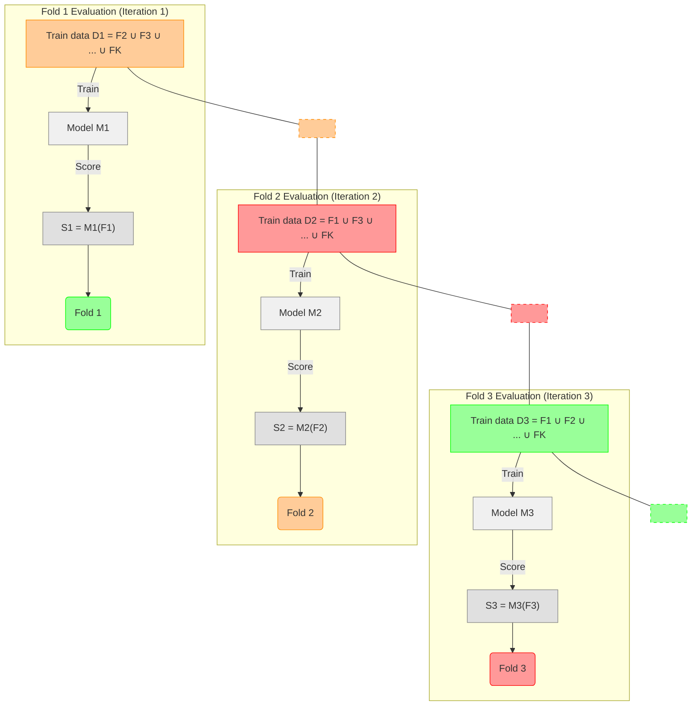
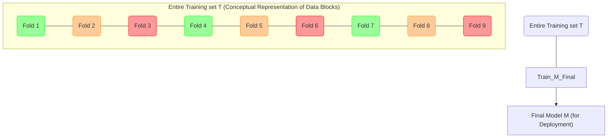

# Score Calibration and Fusion: Optimizing Classifier Performance

> **Author**
Marc'Antonio Lopez
AI & Data Analytics student at Polytechnic University of Turin

## Score Calibration: An Introduction

When classifiers produce scores as part of their prediction process, these raw scores often **lack a direct probabilistic interpretation**, a phenomenon known as **miscalibration**. This implies that a score of, for example, 0.8 does not necessarily correspond to an 80% probability of a specific class.

Miscalibration can arise from various factors, including:
*   **Inherent model nature:** Some classification algorithms (e.g., Support Vector Machines - SVMs) are not designed to output probabilities directly; their scores may represent distances or arbitrary confidence levels.
*   **Model complexity or regularization choices:** Overly complex models or specific regularization strategies can distort the relationship between scores and true probabilities.
*   **Mismatch with underlying data distribution:** If the model's assumptions about data distribution do not perfectly align with the real data, its scores might be miscalibrated.

Therefore, score calibration is the process of transforming these raw scores into values that accurately reflect true probabilities or likelihood ratios, making them more interpretable and useful for decision-making.

---

## Score Calibration for Binary Tasks: Two Primary Strategies

For binary classification problems, two main strategic approaches exist to improve decision quality by handling raw scores:

1.  **Optimal Threshold for Specific Application (Empirical Tuning):** This strategy involves finding a specific, empirically determined threshold optimally tuned for a single, predefined target application scenario. Tuning is typically done by evaluating classifier performance across various thresholds on a validation set, selecting the one that minimizes the desired cost function for that application. However, its primary drawback is that this optimal threshold is specific to one application, requiring **re-tuning for each new application context** with different class prior probabilities or error costs. It is not a generally applicable solution.

2.  **Score Transformation for General Applicability (Calibration):** This strategy focuses on learning a **monotonic function** (a function that preserves score rank order) that converts raw scores into well-calibrated **Log-Likelihood Ratios (LLRs)** or posterior probabilities. The significant advantage of this approach is its **general applicability**: once scores are properly calibrated, optimal decision-making can be performed across a wide range of applications using standard decision theory (i.e., using the Bayes Threshold formula with new priors and costs), without needing to re-tune an empirical threshold for each new scenario.

---

## Score Calibration for Binary Tasks: The Transformation Approach

This second, more versatile strategy aims to find a **monotonic transformation function `f`** that maps a classifier's raw scores (`s`) to new, **calibrated scores (`s_cal = f(s)`)**. The function `f` is monotonic to ensure the original ranking of scores is preserved (i.e., higher raw scores still correspond to higher calibrated scores).

Common methods for learning this transformation `f` include:

*   **Isotonic Regression:** A flexible, non-parametric approach.
*   **Prior-Weighted Logistic Regression (Platt Scaling):** A parametric approach assuming an affine transformation.
*   **Generative Score Models:** Methods that explicitly model raw score distributions within each class.

---

## Score Calibration for Binary Tasks: Isotonic Regression in Detail

**Isotonic Regression** is a specific and popular method for score calibration.

*   **Characteristics:**
    *   It is a **non-parametric** method, meaning it does not assume a predefined functional form (e.g., linear, exponential) for the transformation.
    *   It is **non-linear** and inherently **monotonic** (it finds the best non-decreasing function that fits the data).
    *   It is **optimally calibrated** for the specific training data provided.
*   **Process:** It works by finding a piecewise constant (or piecewise linear) function that best fits observed raw scores and their corresponding true class labels, while ensuring the function is non-decreasing.
*   **Limitations:**
    *   **Interpolation only:** It requires interpolation for any new scores falling *between* its training scores.
    *   **No Extrapolation:** Crucially, it does **not allow extrapolation** beyond the minimum and maximum raw scores seen in its calibration training data. Any new raw score outside this range will be mapped to the minimum or maximum calibrated value, which can be problematic if scores vary widely.
    *   **Data Requirements:** As a non-parametric method, it generally requires a relatively large amount of calibration data to learn a stable transformation.

---

## Score Calibration for Binary Tasks: Score Models as an Alternative

**Score Models** offer an alternative to Isotonic Regression for score calibration, particularly advantageous for handling extrapolation.

*   **Concept:** Instead of learning a direct transformation function, score models explicitly estimate the **class-conditional probability distributions of the raw scores**. For example, they might model $f_{S|C}(s \mid H_T)$ (the distribution of scores for positive samples) and $f_{S|C}(s \mid H_F)$ (the distribution of scores for negative samples).
*   **Advantages:**
    *   They often allow for **extrapolation** beyond the range of scores seen in the calibration training data, provided assumed distributional forms are reasonable.
    *   Once parameters are learned, they offer **fast evaluation** (calibration of new scores).
*   **Common Example:** A prominent example of a score model approach is **Prior-Weighted Logistic Regression**, discussed next.

---

## Score Calibration for Binary Tasks: Prior-Weighted Logistic Regression

**Prior-Weighted Logistic Regression** is a **parametric method** for score calibration, often called **Platt Scaling** when used specifically for SVMs.

*   **Approach:** This method treats the raw classifier scores (`s`) as the *input feature* for a new, simple logistic regression model. It assumes that the relationship between the raw score `s` and the Log-Likelihood Ratio (LLR) can be approximated by an **affine (linear) transformation**:
    $$
    \log \frac{f_{S|C}(s|H_T)}{f_{S|C}(s|H_F)} = \alpha s + \gamma
    $$
    Here, $f_{S|C}(s|H_T)$ and $f_{S|C}(s|H_F)$ represent the (unknown) class-conditional distributions of the raw scores.
*   **Parameter Estimation:** The parameters $\alpha$ (slope) and $\gamma$ (intercept) of this affine transformation are estimated on a **dedicated, independent calibration training set**. This estimation uses a non-regularized (or very lightly regularized) prior-weighted logistic regression objective, allowing it to naturally adjust for class imbalances in the calibration set.
*   **Output:** The calibrated score is then obtained by passing $\alpha s + \gamma$ into a sigmoid function, effectively mapping it to a probability: $P(H_T \mid s) = \sigma(\alpha s + \gamma)$.
*   **Benefits:** It is simple, efficient, and produces smooth, interpretable probability estimates. Its effectiveness depends on how well the affine assumption holds for the raw scores.

---

## Score Calibration: General Scenarios and Data Splitting Protocols

For any score calibration method, the availability and proper use of an **independent calibration set** is paramount. Using data that the base classifier was trained on for calibration would lead to over-optimistic (biased) calibration.

Calibration is typically applied in two main scenarios, influencing how the calibration set is acquired:

1.  **Similar Populations (Classifier Mis-calibration):** This scenario occurs when miscalibration primarily arises from the base classifier's inherent design, complexity, or training issues (e.g., regularization choices, optimization). The underlying distribution of the application data is assumed to be similar to the training data distribution. In this case, the calibration set can often be a **hold-out portion from the main training data** used for the primary classifier.
2.  **Population Mismatch (Domain Shift / Covariate Shift):** This refers to more challenging situations where the training population for the primary classifier significantly differs from the target application population (e.g., data from different sensors, demographic groups). This is a form of "domain shift." For population mismatch, the calibration set **must mimic the target application environment**, ideally derived directly from the application domain, to represent the new data distribution the system will encounter.

**The Golden Rule of Evaluation:** Regardless of the scenario, the **final evaluation set** (the test set) must **never** be used for either the base classifier's parameter estimation *or* the calibration model's parameter estimation. Violating this rule leads to "information leakage" and results in overly optimistic performance estimates that will not hold in real-world deployment.

For a **robust general model development process** that includes calibration, the available labeled data should ideally be divided into three independent subsets:

*   **Model Training Set:** Used **exclusively for training the primary classifier**.
*   **Calibration Training Set:** Used **exclusively for training the score calibration model**, utilizing raw scores generated by the *already trained* primary classifier on these data points.
*   **(Calibration) Validation Set:** Used for **evaluating the overall system performance** (combined base classifier + calibration model) and for tuning any calibration-specific hyperparameters.

---

## Data Split Diagrams: Visualizing Data Partitioning Strategies

Here are conceptual diagrams illustrating different data partitioning strategies in the context of calibration:

### Current Set-up Diagram (Simple Train-Validation Split for Primary Model)

This diagram shows a basic split used when a separate calibration set is not explicitly planned initially.

```mermaid
graph TD
    A[Original Training set] --> B[Model train]
    A --> C[Validation]

    subgraph Original Training set Data Blocks
        TD1(Block 1) --- TD2(Block 2) --- TD3(Block 3) --- TD4(Block 4) --- TD5(Block 5) --- TD6(Block 6) --- TD7(Block 7) --- TD8(Block 8) --- TD9(Block 9) --- TD10(Block 10)
        style TD1 fill:#ADD8E6,stroke:#333
        style TD2 fill:#ADD8E6,stroke:#333
        style TD3 fill:#ADD8E6,stroke:#333
        style TD4 fill:#ADD8E6,stroke:#333
        style TD5 fill:#ADD8E6,stroke:#333
        style TD6 fill:#ADD8E6,stroke:#333
        style TD7 fill:#ADD8E6,stroke:#333
        style TD8 fill:#ADD8E6,stroke:#333
        style TD9 fill:#ADD8E6,stroke:#333
        style TD10 fill:#ADD8E6,stroke:#333
    end

    subgraph Model Train Data Blocks
        MT1(Block 1) --- MT2(Block 2) --- MT3(Block 3) --- MT4(Block 4) --- MT5(Block 5)
        style MT1 fill:#FF9999,stroke:#F00
        style MT2 fill:#FF9999,stroke:#F00
        style MT3 fill:#FF9999,stroke:#F00
        style MT4 fill:#FF9999,stroke:#F00
        style MT5 fill:#FF9999,stroke:#F00
    end

    subgraph Validation Data Blocks
        V1(Block 6) --- V2(Block 7) --- V3(Block 8) --- V4(Block 9) --- V5(Block 10)
        style V1 fill:#99FF99,stroke:#0F0
        style V2 fill:#99FF99,stroke:#0F0
        style V3 fill:#99FF99,stroke:#0F0
        style V4 fill:#99FF99,stroke:#0F0
        style V5 fill:#99FF99,stroke:#0F0
    end
```

**Explanation:** In this basic setup, the "Original Training set" (representing all labeled data available *before* the final test set is touched) is conceptually divided. A portion forms the "Model train" set, used for training the primary classifier. The remaining portion becomes the "Validation" set, used for evaluating the primary model's performance and tuning its hyperparameters.

---

### Train - Calibration - Validation Diagram (Three-Way Split for Robustness)

This diagram illustrates the recommended three-way split for robust model development when calibration is a key objective.

```mermaid
graph TD
    A[Original Training set] --> B[Model train]
    A --> C[Calibration train]
    A --> D[Validation]

    subgraph Original Training set Data Blocks
        TD1(Block 1) --- TD2(Block 2) --- TD3(Block 3) --- TD4(Block 4) --- TD5(Block 5) --- TD6(Block 6) --- TD7(Block 7) --- TD8(Block 8) --- TD9(Block 9) --- TD10(Block 10) --- TD11(Block 11) --- TD12(Block 12)
        style TD1 fill:#ADD8E6,stroke:#333
        style TD2 fill:#ADD8E6,stroke:#333
        style TD3 fill:#ADD8E6,stroke:#333
        style TD4 fill:#ADD8E6,stroke:#333
        style TD5 fill:#ADD8E6,stroke:#333
        style TD6 fill:#ADD8E6,stroke:#333
        style TD7 fill:#ADD8E6,stroke:#333
        style TD8 fill:#ADD8E6,stroke:#333
        style TD9 fill:#ADD8E6,stroke:#333
        style TD10 fill:#ADD8E6,stroke:#333
        style TD11 fill:#ADD8E6,stroke:#333
        style TD12 fill:#ADD8E6,stroke:#333
    end

    subgraph Model Train Data Blocks
        MT1(Block 1) --- MT2(Block 2) --- MT3(Block 3) --- MT4(Block 4) --- MT5(Block 5)
        style MT1 fill:#FF9999,stroke:#F00
        style MT2 fill:#FF9999,stroke:#F00
        style MT3 fill:#FF9999,stroke:#F00
        style MT4 fill:#FF9999,stroke:#F00
        style MT5 fill:#FF9999,stroke:#F00
    end

    subgraph Calibration Train Data Blocks
        CT1(Block 6) --- CT2(Block 7) --- CT3(Block 8) --- CT4(Block 9)
        style CT1 fill:#FFCC99,stroke:#FF8C00
        style CT2 fill:#FFCC99,stroke:#FF8C00
        style CT3 fill:#FFCC99,stroke:#FF8C00
        style CT4 fill:#FFCC99,stroke:#FF8C00
    end

    subgraph Validation Data Blocks
        V1(Block 10) --- V2(Block 11) --- V3(Block 12)
        style V1 fill:#99FF99,stroke:#0F0
        style V2 fill:#99FF99,stroke:#0F0
        style V3 fill:#99FF99,stroke:#0F0
    end
```

**Explanation:** In this more robust approach, the "Original Training set" is divided into three distinct and independent partitions:
1.  **"Model train"**: Used for training the primary classification model.
2.  **"Calibration train"**: Used specifically for training the score calibration model (using scores generated by the already trained primary classifier on these data points).
3.  **"Validation"**: Used for evaluating the performance of the *entire system* (primary classifier + calibration model) and for tuning any hyperparameters associated with the calibration process.

---

### Splits and Re-use Diagram (Leveraging Existing Validation Set for Calibration)

This diagram illustrates a common and practical compromise, especially when data is limited, by re-using an existing validation set for calibration purposes.

```mermaid
graph TD
    A[Original Training set] --> B[Model train]
    A --> FV[Former validation]

    subgraph Original Training set Data Blocks
        TD1(Block 1) --- TD2(Block 2) --- TD3(Block 3) --- TD4(Block 4) --- TD5(Block 5) --- TD6(Block 6) --- TD7(Block 7) --- TD8(Block 8) --- TD9(Block 9) --- TD10(Block 10)
        style TD1 fill:#ADD8E6,stroke:#333
        style TD2 fill:#ADD8E6,stroke:#333
        style TD3 fill:#ADD8E6,stroke:#333
        style TD4 fill:#ADD8E6,stroke:#333
        style TD5 fill:#ADD8E6,stroke:#333
        style TD6 fill:#ADD8E6,stroke:#333
        style TD7 fill:#ADD8E6,stroke:#333
        style TD8 fill:#ADD8E6,stroke:#333
        style TD9 fill:#ADD8E6,stroke:#333
        style TD10 fill:#ADD8E6,stroke:#333
    end

    subgraph Model Train Data Blocks
        MT1(Block 1) --- MT2(Block 2) --- MT3(Block 3) --- MT4(Block 4) --- MT5(Block 5)
        style MT1 fill:#FF9999,stroke:#F00
        style MT2 fill:#FF9999,stroke:#F00
        style MT3 fill:#FF9999,stroke:#F00
        style MT4 fill:#FF9999,stroke:#F00
        style MT5 fill:#FF9999,stroke:#F00
    end

    subgraph Former Validation Data Blocks
        FV1(Block 6) --- FV2(Block 7) --- FV3(Block 8) --- FV4(Block 9) --- FV5(Block 10)
        style FV1 fill:#99FF99,stroke:#0F0
        style FV2 fill:#99FF99,stroke:#0F0
        style FV3 fill:#99FF99,stroke:#0F0
        style FV4 fill:#99FF99,stroke:#0F0
        style FV5 fill:#99FF99,stroke:#0F0
    end

    FV --> CT[Calibration train]
    FV --> CV["Validation (Calibration validation)"]

    subgraph Calibration Train Data Blocks
        CT1(Block 6) --- CT2(Block 7) --- CT3(Block 8)
        style CT1 fill:#FFCC99,stroke:#FF8C00
        style CT2 fill:#FFCC99,stroke:#FF8C00
        style CT3 fill:#FFCC99,stroke:#FF8C00
    end

    subgraph Calibration Validation Data Blocks
        CV1(Block 9) --- CV2(Block 10)
        style CV1 fill:#C0FFC0,stroke:#00AA00
        style CV2 fill:#C0FFC0,stroke:#00AA00
    end
```

**Explanation:** In this approach, the "Original Training set" is first split into a "Model train" set (for the primary classifier) and a "Former validation" set. Subsequently, this "Former validation" set is *further subdivided* into a "Calibration train" set (used for training the calibration model) and a "Validation (Calibration validation)" set (used for evaluating the calibrated system's performance and tuning calibration-specific hyperparameters). This method allows efficient data reuse.

---

## K-fold Cross-Validation: A Robust Evaluation Technique

**K-fold cross-validation** is a powerful and robust technique addressing the challenge of limited training data. It efficiently uses all available data for both training and evaluation across multiple iterations, thereby providing more stable and reliable performance estimates.

### K-fold (Initial Dataset Split Diagram)

This diagram shows how the initial training dataset is partitioned into K folds.

```mermaid
graph TD
    A["Training set (T)"] --> B["Fold 1 (F1)"]
    A --> C["Fold 2 (F2)"]
    A --> D["Fold 3 (F3)"]
    A --> E["..."]
    A --> F["Fold K (FK)"]

    subgraph Training set T Data Blocks
        TD1(Block 1) --- TD2(Block 2) --- TD3(Block 3) --- TD4(Block 4) --- TD5(Block 5) --- TD6(Block 6) --- TD7(Block 7) --- TD8(Block 8) --- TD9(Block 9) --- TD10(Block 10) --- TD11(Block 11) --- TD12(Block 12)
        style TD1 fill:#ADD8E6,stroke:#333
        style TD2 fill:#ADD8E6,stroke:#333
        style TD3 fill:#ADD8E6,stroke:#333
        style TD4 fill:#ADD8E6,stroke:#333
        style TD5 fill:#ADD8E6,stroke:#333
        style TD6 fill:#ADD8E6,stroke:#333
        style TD7 fill:#ADD8E6,stroke:#333
        style TD8 fill:#ADD8E6,stroke:#333
        style TD9 fill:#ADD8E6,stroke:#333
        style TD10 fill:#ADD8E6,stroke:#333
        style TD11 fill:#ADD8E6,stroke:#333
        style TD12 fill:#ADD8E6,stroke:#333
    end

    subgraph Fold 1 F1 Data Blocks
        F1_1(Block 1) --- F1_2(Block 2) --- F1_3(Block 3) --- F1_4(Block 4)
        style F1_1 fill:#99FF99,stroke:#0F0
        style F1_2 fill:#99FF99,stroke:#0F0
        style F1_3 fill:#99FF99,stroke:#0F0
        style F1_4 fill:#99FF99,stroke:#0F0
    end

    subgraph Fold 2 F2 Data Blocks
        F2_1(Block 5) --- F2_2(Block 6) --- F2_3(Block 7) --- F2_4(Block 8)
        style F2_1 fill:#FFCC99,stroke:#FF8C00
        style F2_2 fill:#FFCC99,stroke:#FF8C00
        style F2_3 fill:#FFCC99,stroke:#FF8C00
        style F2_4 fill:#FFCC99,stroke:#FF8C00
    end

    subgraph Fold 3 F3 Data Blocks
        F3_1(Block 9) --- F3_2(Block 10) --- F3_3(Block 11) --- F3_4(Block 12)
        style F3_1 fill:#FF9999,stroke:#F00
        style F3_2 fill:#FF9999,stroke:#F00
        style F3_3 fill:#FF9999,stroke:#F00
        style F3_4 fill:#FF9999,stroke:#F00
    end

    subgraph Fold K FK Data Blocks
        FK_1(Block ...) --- FK_2(Block ...)
        style FK_1 fill:#CCCCCC,stroke:#666
        style FK_2 fill:#CCCCCC,stroke:#666
    end
```

**Explanation:** The "Training set (T)" is first randomly divided into $K$ (e.g., 3, 5, or 10) equally sized, non-overlapping subsets called "folds." This partitioning is typically performed while maintaining the original class ratios within each fold (stratified K-fold) to ensure representativeness.

---

### K-fold (Iterative Training & Scoring Diagram)

This diagram shows the iterative process of K-fold cross-validation for training models and generating scores.

**Explanation:** For each of the $K$ iterations (or "folds"):
1.  One fold is designated as the **validation set** for that iteration.
2.  The remaining $K-1$ folds are combined to form the **training set**.
3.  A model (`M1`, `M2`, etc.) is trained on this combined training set.
4.  This trained model then generates scores (`S1`, `S2`, etc.) for the data points in the single left-out validation fold.
This iterative process ensures that the scores produced for evaluation (S1, S2, S3) are **unbiased**, as the model generating them has *not* been trained on those specific data points.

---

## K-fold (Score Pooling & Model Selection)

After the iterative training and scoring process of K-fold cross-validation is complete:

*   All scores generated from each of the $K$ folds (e.g., S1, S2, ..., SK) are then **pooled** together into a single, comprehensive dataset, typically named `S`. This pooled dataset `S` will contain scores for every data point in the original training set `T`, each generated by a model that did not see that particular data point during its training phase. The true labels for these data points are also carried along.
*   This pooled dataset `S`, along with its corresponding true labels, is subsequently used for critical steps like **model selection** (e.g., choosing the optimal algorithm or family of models) and **hyperparameter tuning** (e.g., selecting the best regularization strength $\lambda$).
*   **Consistency Requirement:** It is critical that all $K$ individual models (`M_i`) trained within the folds adhere to the **exact same setup** (e.g., same algorithm, same hyperparameters for feature extraction and primary model parameters) to ensure score consistency and a fair comparison.
*   **Metric Computation:** Consequently, performance metrics like `minDCF` (minimum Detection Cost Function) **must be computed over the entire pooled set `S`**, rather than being averaged from individual folds. Averaging metrics from individual folds might lead to biased estimates if the folds vary in their characteristics.

---

## K-fold (Choosing the Final Model for Deployment)

Once the optimal hyperparameters for the classifier (and potentially for feature extraction) have been determined through the K-fold cross-validation process:

*   **One additional model (`M`) is trained** over the **entire original training set (`T`)** using these optimal hyperparameters. This is done to leverage all available data for the final, most robust model.
*   This final model (`M`) is then ready for **deployment** in the real-world application, making predictions on new, unseen data.

**Explanation:** The diagram shows that after hyperparameter selection, all the data blocks (Fold 1 through Fold K) from the "Entire Training set T" are combined and used to "Train" the "Final Model M." This model is specifically built for "Deployment."

---

## K-fold (Model Similarity & Choosing the Value of K)

*   **Model Similarity:** It's important to understand that the $K$ individual models (`M_i`) trained during the K-fold process (each on $K-1$ folds) will differ slightly from the final model (`M`) trained on the entire dataset `T`. This is because `M_i` is trained on a slightly smaller subset of data than `M`.
    *   Generally, a **larger value of $K$** (meaning smaller folds) increases the similarity between the individual folds' models and the final model, as each `M_i` is trained on a larger proportion of the total dataset.
    *   The extreme case is **Leave-One-Out Cross-Validation (LOOCV)**, where $K=N$ (the total number of samples). In LOOCV, each `M_i` is trained on $N-1$ samples, making it highly similar to the final model trained on all $N$ samples. However, LOOCV is computationally very expensive, as it requires training $N$ models.

*   **Choosing the Value of K:** The choice of $K$ involves a crucial **trade-off between computational cost and evaluation robustness/bias**:
    *   **Larger $K$:** Provides more robust and less biased estimates of generalization performance, as each training set is larger and more representative of the full data. However, it incurs higher computational cost (more models to train).
    *   **Smaller $K$:** Is faster to compute but yields less robust evaluations, as each training set is smaller, and there's more variance in the folds.
Common values for $K$ are 5 or 10, typically offering a good balance.

---

## K-fold (Two-Step Approach for Three-Set Partitioning with Calibration)

For managing data partitioning for model training, calibration, and final validation robustly, particularly when calibration is involved, a **two-step K-fold cross-validation approach** is often employed:

1.  **Step 1: Classifier Training & Calibration Set Generation (Outer K-fold):** An **outer K-fold loop** is applied to the primary training data. In each outer fold, a primary classifier (`R_k`) is trained on $K-1$ folds, then generates raw scores for the single left-out fold. These scores are pooled into an **overall calibration set**, containing unbiased scores for every data point from the original training data. Finally, one full primary classifier `R_F` is trained on the *entire* primary training set for application deployment.
2.  **Step 2: Calibration Training & System Evaluation (Inner K-fold on Pooled Scores):** An **inner K-fold cross-validation** is performed on the **pooled calibration scores** from Step 1. Within each inner fold, a calibration model (`C_k`) is trained on $K-1$ folds of the pooled scores, then calibrates the scores of the respective inner left-out fold. These calibrated scores are pooled for overall **system performance evaluation** (e.g., calculating minDCF for the full system). Lastly, one final calibration model `C_F` is trained on *all* pooled calibration scores for application deployment (to be applied to scores from `R_F`).

---

## K-fold (Project Application Note: Simplified Calibration)

For typical course projects or less critical applications, a simpler and often acceptable approach for calibration is to apply K-fold cross-validation **only for the calibration part**, utilizing raw scores already obtained from the existing validation set of your primary classifier.

*   **Steps:**
    1.  First, obtain raw scores from the existing validation set (from your initial `train-validation-test` split).
    2.  Split this validation set into $K$ folds.
    3.  For each fold, a calibration model (e.g., Logistic Regression or Isotonic Regression) is trained on the remaining $K-1$ folds of this validation set.
    4.  This trained calibration model is then used to calibrate the raw scores of the left-out fold.
    5.  Finally, pool all the calibrated scores generated across the $K$ folds.
    6.  Evaluate the effectiveness of the calibration by analyzing this pooled set (e.g., comparing the `minDCF` before calibration against the `actDCF` after calibration, or by plotting Bayes Error Plots).

---

## Score-Level Fusion: Combining Multiple Classifiers

**Motivation:** Individual classifiers, even high-performing ones, often learn different aspects of the data and may extract **complementary information**. **Score-level fusion** is a technique that aims to combine the output scores from multiple individual classifiers. The goal is to leverage these complementary strengths to **boost overall classification performance** beyond what any single model can achieve alone.

---

## Score-Level Fusion (Simple Majority Voting)

**Simple majority voting** is one of the most basic fusion techniques.

*   **Process:** Each individual classifier makes a hard binary prediction (e.g., class 0 or class 1). The final label for a given input is then determined by taking the most frequent prediction among all individual classifiers.
*   **Limitations:**
    *   It requires explicit tie-breaking rules if there's an equal number of votes for multiple classes.
    *   Crucially, it **ignores the confidence** associated with individual predictions. A classifier that barely favors one class gets the same "vote" as one that is highly confident. This loss of information can lead to suboptimal performance.

---

## Score-Level Fusion: Averaging or Summing Scores

A more common and often more effective fusion technique than majority voting involves **averaging or summing the raw scores** from individual classifiers.

*   **Process:** For each input, the scores from $m$ individual classifiers ($s_1, s_2, \dots, s_m$) are either averaged or summed to produce a single fused score ($s_{\text{fused}} = \frac{1}{m} \sum_{i=1}^m s_i$ or $s_{\text{fused}} = \sum_{i=1}^m s_i$).
*   **Theoretical Correctness:** This approach is theoretically sound and optimal *if*:
    *   Individual models provide true Log-Likelihood Ratios (LLRs).
    *   The individual models operate **independently** (i.e., their errors are uncorrelated).
*   **Practical Challenges:** In practice, classifiers often use correlated features or are trained on similar data, which can lead to **redundancy** rather than true complementarity. This can result in the fused score being potentially **biased** or not as effective as expected.

---

## Score-Level Fusion: Weighted Fusion for Optimal Combination

**Weighted fusion** is a more sophisticated and flexible approach to combining scores, designed to overcome the limitations of simple averaging or summing.

*   **Process:** Instead of simply averaging, a specific **weight ($\alpha_i$)** is assigned to each individual classifier's score. The fused score is then a weighted sum of the individual scores, potentially with an additional bias term:
    $$
    s_{\text{fused}} = \alpha^T s + \gamma
    $$
    Where $s$ is the vector of individual classifier scores, $\alpha$ is the vector of learned weights, and $\gamma$ is a learned bias.
*   **Challenge:** The primary challenge lies in accurately estimating the optimal weights ($\alpha$) and the bias ($\gamma$) that best combine the individual scores.
*   **Estimation Process:** This estimation process is analogous to single-system score calibration, but it extends to handling $m$-dimensional score vectors (where $m$ is the number of individual classifiers being fused). As with single-system calibration, a dedicated, independent **calibration dataset** is essential for learning these optimal fusion parameters to prevent overfitting. The fusion problem can be framed as training a logistic regression model where individual classifier scores are its input features.

---

## Multiclass Calibration and Fusion: Extending to Multiple Categories

Extending calibration and fusion techniques to **multiclass problems** (i.e., classification with $K>2$ categories) is significantly more challenging than for binary tasks. This complexity arises from:

*   **Complexity of Optimal Decision-Making:** Optimal decision-making in multiclass settings involves a more intricate cost matrix and often requires simultaneously balancing multiple types of errors.
*   **Difficulty in Disentangling Issues:** It becomes harder to separate issues related to a classifier's raw discriminative power from issues related to its calibration across multiple classes.

**Primary Goal:** Despite these challenges, the primary goal remains consistent: to transform raw multiclass scores (whether from a single classifier or fused from multiple classifiers) into well-calibrated **class-conditional log-likelihoods** or accurate **posterior probabilities** for each class.

**Importance:** Achieving this accurate probabilistic interpretation is crucial for enabling **optimal, cost-sensitive decision-making** in complex multiclass settings, ensuring the model's predictions are reliable and reflect true uncertainties.

**Common Technique:** For this purpose, **multiclass logistic regression (softmax regression)** is a commonly employed technique for multiclass calibration and fusion. It can take raw scores (or features) as input and learn to output calibrated probabilities across all classes.