# Memory Management Fundamentals

## Objectives and Outline

This document clarifies fundamental memory management concepts, covering memory hardware organization and allocation/protection methods for running programs. Key topics include:

*   **Background:** Why memory management is necessary.
*   **Contiguous Memory Allocation:** Basic unbroken memory block allocation.
*   **Paging:** Advanced fixed-size block allocation to solve fragmentation.
*   **Page Table Structure:** How page-to-frame mappings are tracked.
*   **Swapping:** Extending memory using secondary storage.
*   **Examples:** Intel and ARMv8 architectures' memory management implementations.

---

## Background: Why Memory Management is Essential

Effective memory management is crucial for program efficiency and security:

*   **Execution Requirement:** For a program to execute as a *process*, its instructions and data must first load from *secondary storage* (disk) into *main memory* (RAM).
*   **CPU Access Limitations:** The CPU, however, directly accesses only *main memory* or *registers*. Disk I/O, being slow and complex, necessitates this loading.
*   **Memory Hierarchy and Speed Differences:**
    *   **Registers:** Fastest (CPU built-in, <1 CPU cycle).
    *   **Cache:** A fast layer positioned between the CPU and main memory, which stores frequently accessed data to reduce CPU stalls.
    *   **Main Memory (RAM):** Slower than registers/cache (many CPU cycles, can cause stalls).
*   **Protection Requirement:** In multitasking operating systems, where multiple processes reside in main memory, protection is paramount. It ensures system stability and security by:
    *   **Isolating Processes:** Each process's memory space is protected from unauthorized access.
    *   **Preventing Interference:** Processes cannot read, modify, or corrupt OS or other user process memory.

---

## Process Address Space and Protection

To ensure a process strictly accesses only its assigned memory, operating systems leverage specific hardware features:

*   **Goal:** The primary goal is to restrict a process to its designated *address space*.
*   **Mechanism: Hardware Support:** Basic memory protection is facilitated by two key CPU registers per process:
    *   **Base Register:** Holds the *starting physical memory address*.
    *   **Limit Register:** Stores the *size* of the process's *logical address space* (valid range).

*   **Address Validation Process:**
    Every logical address generated by the CPU while in *user mode* undergoes rigorous hardware checks:
    1.  The logical address must be $\ge$ 0 (this is an implicit requirement).
    2.  The logical address must be < *limit register*.
    3.  If valid, the *physical address* is computed as *base register* + *logical address*.
    4.  Conversely, if invalid (out of range), the hardware triggers an *exception* (trap) to the OS, which often results in process termination ("segmentation fault").

A conceptual representation of base and limit registers:

```text
+-------------------+ <--- Physical Address (Base Register + Limit Register)
|                   |
|                   |
|  Process X Memory |
|                   |
|                   |
+-------------------+ <--- Physical Address (Base Register)
|                   |
|  Other Processes  |
|      and OS       |
|                   |
+-------------------+ <--- Physical Address 0
```

Hardware address protection:

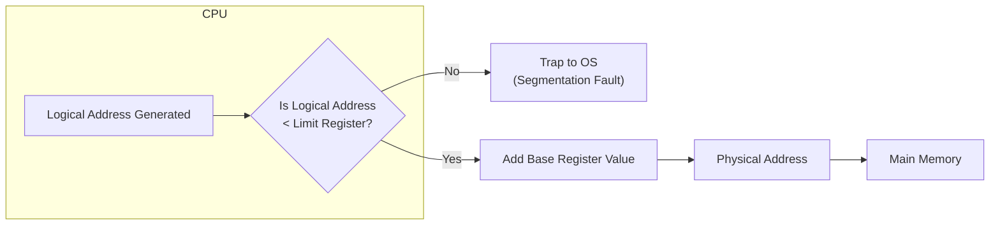

*   **Privileged Operation:** Crucially, only the *operating system* operating in *kernel mode* can modify base/limit registers to control memory protection.

## Address Binding: Connecting Logical and Physical Addresses

**Address Binding** maps addresses from one address space (e.g., symbolic, relocatable, logical) to another, specifically physical memory. Programs exist in various forms (source code, compiled, executable) before they can reside *in memory* as *physical addresses*.


### When Address Binding Can Occur:

1.  **Compile Time:** This occurs if the final physical memory location is known prior to compilation. The compiler then generates *absolute code*. However, this method is rarely used for general-purpose programs.
2.  **Load Time:** If the physical location is unknown at compile time, the compiler produces *relocatable code*. The loader then adjusts relative addresses to physical addresses. Once loaded, the process's starting address remains fixed.
3.  **Execution Time (Runtime):** This applies if a process needs to be *moved* during execution (e.g., for compaction or swapping). In this scenario, address binding is postponed until the CPU actually accesses the address. This method requires a *Memory Management Unit (MMU)* and is adopted by most modern OSs due to its inherent flexibility.

### Dynamic Loading

Routines or modules are loaded only *when actually called*. This process involves pausing execution, invoking a dynamic loader, loading the routine, updating necessary tables, and then resuming execution.
*   **Benefits:** Faster startup, reduced memory usage (unused routines not loaded), efficient for infrequent code.
*   **Implementation:** Managed by OS or libraries.

### Dynamic Linking

Dynamic linking connects library code to an executable program.

1.  **Static Linking:** Here, the *linker* copies all necessary library routines directly into the executable file.
    *   **Consequences:** This results in larger executables and leads to code duplication, meaning redundant memory usage.
2.  **Dynamic Linking:** In contrast, linking is *postponed until execution time*. The executable itself contains only small *stubs* to represent library calls.
    *   **Execution Flow:** Upon the first stub execution, the system checks for the *shared library* (e.g., `.DLL`, `.so`). If the library is not already in memory, the OS loads it into a shared segment. The program's internal tables are then updated to point to this newly loaded routine, ensuring that subsequent calls reuse the shared code efficiently.
    *   **Benefits:** This approach leads to smaller executables, a reduced memory footprint (as only one copy of a shared library resides in RAM), and easier updates (since only the library file needs replacement).

---

## Logical vs. Physical Address Space

A **Logical Address (Virtual Address)** is the CPU-generated address, representing a process's perceived view of memory (which is often continuous and starts from zero).
A **Physical Address**, conversely, is the actual address within the *physical RAM hardware*.

*   **Relationship:**
    *   For **Compile/Load-time binding**, logical and physical addresses are effectively the same.
    *   However, with **Execution-time binding**, logical and physical addresses differ, as the MMU performs the translation.

*   **Logical Address Space:** Represents all *logical* addresses a program can generate (e.g., $2^{32}$ bytes for a 32-bit CPU).
*   **Physical Address Space:** Represents all *physical* addresses of the installed RAM.

The *Memory Management Unit (MMU)* handles runtime logical-to-physical translation.

### Memory Management Unit (MMU)

*   **Role:** The MMU is a hardware device responsible for translating *virtual (logical) addresses* to *physical addresses* in real-time.
*   **Location:** It is situated between the CPU and main memory/cache.


### Simple MMU Scheme (Relocation Register)

A basic MMU scheme utilizes a *relocation register* (similar to a base register), which holds a starting physical address. The MMU then automatically *adds* this value to the logical address generated by the user process.
Physical Address = Logical Address + Relocation Register
Crucially, the *limit register* continues to provide protection in this scheme.

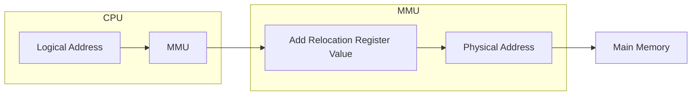

---

## Contiguous Memory Allocation

Contiguous memory allocation is a simple method where main memory is partitioned into an Operating System Area and a User Process Area. In this scheme, each user process receives a **single, unbroken (contiguous) block of physical memory**.

```text
+-------------------+ (Top of RAM)
|                   |
|     Process P2    |
|                   |
|-------------------|
|                   |
|     Process P8    |
|                   |
|-------------------|
|                   |
|     Process P5    |
|                   |
|-------------------|
|                   |
| Operating System  |
|                   |
+-------------------+ (Bottom of RAM)
```

*   **Protection:** Base and limit registers define a process's memory boundaries.

### Variable Partition Scheme (MVT)

Memory is managed as a collection of available free blocks, known as *holes*.
*   **Allocation:** When a process requests memory, the OS searches for a suitable hole, allocates a portion from it, and any remainder (if present) becomes a smaller hole.
*   **Deallocation:** When a process terminates, its occupied memory is returned to the hole list. Adjacent holes are then merged to form larger free blocks.

### Dynamic Storage-Allocation Problem

The dynamic storage-allocation problem involves choosing the most appropriate hole to allocate for a new process of size `n`:

1.  **First-Fit:** This strategy allocates the *first* hole encountered that is large enough to satisfy the request.
    *   **Pros:** Fastest.
    *   **Cons:** Can leave many small, unusable holes towards the beginning of memory.
2.  **Best-Fit:** This approach allocates the *smallest* hole that is still sufficiently large for the request.
    *   **Pros:** Leaves largest holes untouched for future large requests.
    *   **Cons:** Requires searching all holes, produces many tiny leftover holes (*internal fragmentation* within the hole). Slower.
3.  **Worst-Fit:** This strategy allocates the *largest* available hole.
    *   **Pros:** Leaves a relatively large leftover hole (theoretically useful).
    *   **Cons:** Requires searching all holes, can quickly exhaust largest blocks, potentially preventing future large allocations. Slower.

**Performance Summary:** Overall, First-fit and Best-fit generally outperform Worst-fit in terms of both speed and memory utilization. Among the two, First-fit is often faster than Best-fit.

#### Allocation Strategy Exercise Outcome

Considering initial holes: `[300K, 600K, 350K, 200K, 750K, 125K]` and a sequence of process requests: `[115K, 500K, 358K, 200K, 375K]`.

1.  **First-Fit:** All processes are successfully allocated. The remaining holes are: `[185K, 100K, 150K, 200K, 17K, 125K]`.
2.  **Best-Fit:** All processes are also allocated. The remaining holes are: `[300K, 100K, 350K, 17K, 10K]`.
3.  **Worst-Fit:** In this scenario, the last process (375K) cannot be allocated immediately, as no single contiguous hole remains large enough after the preceding allocations.

---

## Fragmentation: Wasted Memory

*   **External Fragmentation:** This occurs when enough *total* free memory is available but is scattered in small, non-contiguous *holes*, rendering it unusable for larger allocation requests.
    *   **Statistical Impact:** Up to one-third of memory can be lost to external fragmentation.
*   **Internal Fragmentation:** This type of fragmentation occurs when allocated memory blocks are larger than what is actually needed, resulting in wasted space *within* the allocated block (e.g., in fixed-size allocation units such as pages). On average, approximately half a page per process is typically wasted due to this phenomenon.

### Reducing External Fragmentation: Compaction

**Compaction** is a technique that shuffles memory contents to consolidate fragmented free blocks into one large, contiguous hole. This process necessarily involves moving allocated processes.
*   **Requirement:** It is only feasible with *execution-time address binding*, which relies on an MMU.
*   **Drawback:** Compaction is ***very expensive***. It consumes significant CPU time, often requires system stoppage, and introduces complexity with I/O operations (as I/O is typically restricted to OS buffers).

Consequently, due to the high cost of compaction and the inherent issue of external fragmentation, contiguous memory allocation is rarely employed in modern general-purpose operating systems, which instead favor paging.

---

## Paging: Non-Contiguous Allocation

Paging eliminates the requirement for contiguous physical memory, thereby fundamentally solving **external fragmentation**. This approach allows a process's physical address space to be non-contiguous, which significantly improves memory utilization. As a result, paging forms the cornerstone of modern OS memory management (e.g., in Windows, Linux, macOS).

### How Paging Works

1.  **Divide Physical Memory:** RAM is divided into fixed-size blocks known as ***frames*** (always powers of 2, such as 4 KB).
2.  **Divide Logical Memory:** Similarly, each process's logical address space is divided into blocks that are the **exact same size** as frames; these are called ***pages***.
3.  **Flexible Mapping:** Process pages can be loaded into *any available frames*, which critically do not need to be contiguous.
4.  **Address Translation:** The OS maintains a ***page table*** for each process to facilitate the mapping of logical addresses to physical addresses.

### Address Translation Scheme in Paging

The MMU interprets a logical address as:
*   ***Page Number (p):*** Higher-order bits, used as an index into the page table.
*   ***Page Offset (d):*** Lower-order bits, position *within* the page/frame.


If logical address space is $2^m$ bytes and page size is $2^n$ bytes, then $d$ needs $n$ bits, $p$ needs $m-n$ bits, and the page table has $2^{(m-n)}$ entries.

### Paging Hardware: The Page Table

*   **Purpose:** The page table stores one-to-one mappings from logical pages to physical frames. Each process maintains its own dedicated page table.
*   **Structure:** It is structured as an array where the index corresponds to the logical page number, and the value represents the physical frame number.
*   **Location:** Page tables themselves are stored in *main memory*.
*   **CPU Registers for Paging:**
    1.  ***Page Table Base Register (PTBR):*** Holds the starting physical address of the current process's page table.
    2.  ***Page Table Length Register (PTLR):*** Indicates the total number of entries in the current page table, primarily used for protection.

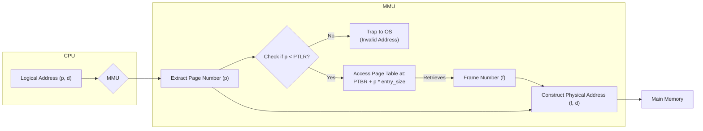

**Step-by-Step Translation:** When the CPU generates a logical address (p, d), the MMU extracts `p` and checks it against the PTLR. If `p` is valid, the MMU accesses `PTBR + p * entry_size` in main memory to retrieve the corresponding frame `f`. The MMU then constructs the physical address by concatenating `f` with `d` (or by calculating `f * page_size + d`). Conversely, if `p` is invalid, the MMU traps to the OS.

### Paging Example (Numerical)

*   **Logical Address Space:** $m=4$ bits (16 bytes).
*   **Page Size:** $2^n = 4$ bytes ($n=2$ bits for offset `d`).
*   **Page Number Bits:** $m-n = 2$ bits (4 logical pages: 0-3).
*   **Physical Memory:** 32 bytes (8 frames, 3 bits for frame number).
*   **Sample Page Table:**

| Logical Page (p) | Physical Frame (f) |
| :--------------- | :----------------- |
| 0                | 5                  |
| 1                | 6                  |
| 2                | 1                  |
| 3                | 2                  |

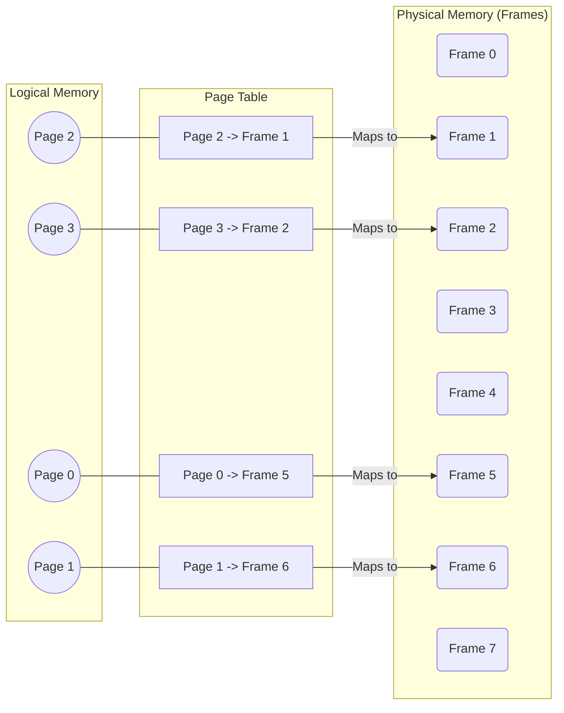

**Translation Examples:**
*   **Logical Address 0 (binary `0000`):** Page `p=00` (0), Offset `d=00` (0). Page 0 maps to Frame 5 (binary `101`). Physical Address: `10100` (binary) = 20.
*   **Logical Address 5 (binary `0101`):** Page `p=01` (1), Offset `d=01` (1). Page 1 maps to Frame 6 (binary `110`). Physical Address: `11001` (binary) = 25.

### Internal Fragmentation in Paging

While effectively addressing external fragmentation, paging can still suffer from *internal fragmentation*. This occurs because the last allocated page for a process might not be fully utilized.
*   **Example:** A 72,766-byte process with 2048-byte pages requires 36 pages (73,728 bytes). 962 bytes are wasted in the last page.
*   **Average Impact:** On average, this leads to about half a page of wasted memory per process, which is generally less detrimental than external fragmentation.

---

## Implementation of Page Tables

Storing large page tables entirely in main memory presents two primary problems:
1.  **Large Page Tables:** For instance, a 32-bit address space with 4 KB pages implies 1 million pages, necessitating 4 MB of memory per process solely for the page table, which is highly inefficient.
2.  **Performance Issue (Two Memory Accesses):** Every logical memory access effectively doubles the access time because it requires one memory access for the page table entry and a second for the actual data.

Solutions to these issues include Translation Look-aside Buffers (TLBs), and various page table structures like Hierarchical, Hashed, and Inverted Page Tables.

### Translation Look-aside Buffer (TLB)

*   **Concept:** The TLB is a small, very fast, fully associative hardware cache designed to store recently used page-to-frame mappings.
*   **Contents:** It typically contains `(Page Number, Frame Number)` pairs, potentially augmented with protection bits and an *Address Space Identifier (ASID)*.

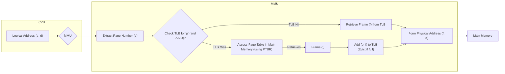

**TLB Operation:**
1.  **TLB Hit:** If a mapping is found in the TLB, the MMU rapidly retrieves the corresponding frame `f`. The total access time in this scenario is approximately equivalent to 1 Main Memory Access.
2.  **TLB Miss:** If a mapping is not found in the TLB, the MMU must access the page table located in main memory (incurring 1 memory access) to obtain `f`. Subsequently, the `(p,f)` mapping is loaded into the TLB. The total access time in this case is approximately 2 Main Memory Accesses.

*   **Address Space Identifiers (ASIDs):** These identifiers enable TLB entries from different processes to coexist, thereby avoiding expensive TLB flushes on every context switch.
*   **Characteristics:** TLBs are typically small (ranging from 64 to 1024 entries) and employ various replacement policies (such as LRU, FIFO, or random). Additionally, some critical entries can be "wired down" to prevent eviction.

### Effective Access Time (EAT) with TLB

The performance of a paging system heavily hinges on the TLB's **hit ratio** ($\alpha$).
$ EAT = \alpha \times (\text{TLB_Time} + \text{Mem_Time}) + (1 - \alpha) \times (\text{TLB_Time} + 2 \times \text{Mem_Time}) $
*Assuming TLB lookup time is negligible:*
$ EAT = \alpha \times \text{Mem_Time} + (1 - \alpha) \times (2 \times \text{Mem_Time}) $

*   **Example 1 (80% hit ratio, Mem_Time=10 ns):** $ EAT = 0.80 \times 10 \text{ ns} + 0.20 \times 20 \text{ ns} = 8 \text{ ns} + 4 \text{ ns} = 12 \text{ ns} $
*   **Example 2 (99% hit ratio, Mem_Time=10 ns):** $ EAT = 0.99 \times 10 \text{ ns} + 0.01 \times 20 \text{ ns} = 9.9 \text{ ns} + 0.2 \text{ ns} = 10.1 \text{ ns} $
**Conclusion:** Therefore, maintaining a high TLB hit ratio is absolutely critical for the overall efficiency of a paging system.

### Memory Protection in Paged Systems

In paged systems, each page table entry includes crucial *protection bits* (specifying Read, Write, or Execute permissions) and a *Valid/Invalid bit*.
1.  **Protection Bits:** The MMU verifies permissions upon memory access; any violation triggers a trap to the OS.
2.  **Valid/Invalid Bit:** A `V` (Valid) bit signifies that the page is legal and currently mapped to a physical frame. Conversely, an `I` (Invalid) bit indicates that the page is either not part of the process's logical address space or has been temporarily swapped out. Accessing an `I` page triggers a *page fault* exception to the OS.

| Logical Page | Valid/Invalid (V/I) | Frame Number (f) | Protection Bits (R/W/X) |
| :----------- | :------------------ | :--------------- | :---------------------- |
| 0            | V                   | 5                | R/W/X                   |
| 1            | V                   | 6                | R/W                     |
| 2            | V                   | 1                | R/X                     |
| 3            | V                   | 2                | R/W/X                   |
| 4            | I                   | -                | -                       |

### Shared Pages

Paging uniquely enables the efficient sharing of reentrant (pure, non-modifying) code, such as standard libraries. This is achieved by allowing multiple processes to point their respective page table entries to the *same physical frames* containing the shared code, thereby significantly saving RAM. Crucially, each process still maintains its own private data, stack, and heap pages.

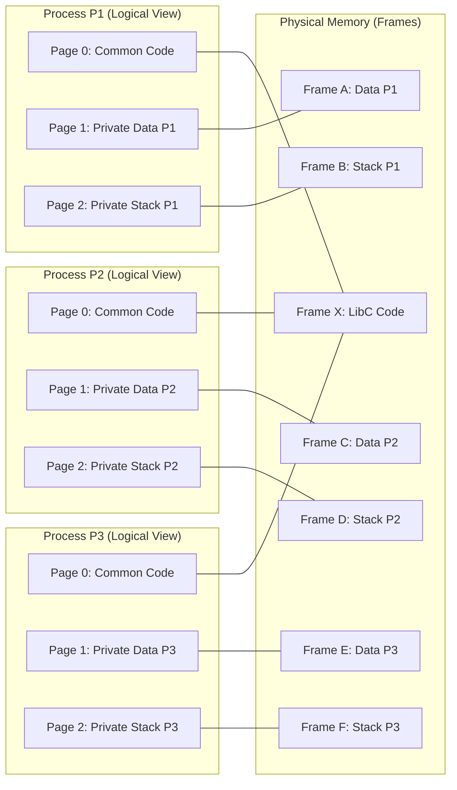

---

## Structure of the Page Table: Handling Large Address Spaces

To effectively manage the vast logical address spaces supported by modern systems, advanced page table structures are employed:

### 1. Hierarchical Paging (Multi-Level Page Tables)

*   **Concept:** This approach breaks down the single-level page table into a tree-like structure, effectively applying paging concepts to the page table itself.
*   **Two-Level Paging (Common):** A common implementation, two-level paging, splits the logical page number into an *Outer Page Index ($p_1$)* (which indexes an "outer page table" or page directory, containing pointers to inner tables) and an *Inner Page Index ($p_2$)* (which indexes an "inner page table" to obtain the frame number).
*   **Benefit:** This hierarchical structure saves memory by avoiding the allocation of inner page tables for unused or unmapped address ranges.

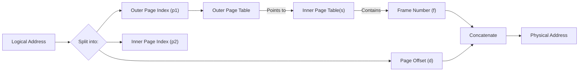

#### Two-Level Paging Example (32-bit Architecture)

For a 32-bit logical address space and 4 KB ($2^{12}$ bytes) page size:
*   Page offset ($d$) is 12 bits.
*   Remaining 20 bits for page number are split into two 10-bit parts: $p_1$ (Outer Index) and $p_2$ (Inner Index).
*   Logical Address: `[ Outer Index (10 bits) | Inner Index (10 bits) | Page Offset (12 bits) ]`

```text
31             22 21            12 11            0
+-----------------+----------------+----------------+
| Outer Page Index | Inner Page Index | Page Offset |
|      (p1)       |      (p2)        |     (d)      |
+-----------------+----------------+----------------+
```

**Translation Process:** The MMU first uses $p_1$ to index the outer page table (e.g., accessed via the `CR3` register), which provides the base address of the relevant inner page table. Subsequently, $p_2$ is used to index this inner page table, yielding the physical frame number $f$. Finally, $f$ and $d$ are combined to form the complete physical address.
**Performance Impact:** Without the benefit of a TLB, hierarchical paging significantly increases the number of memory accesses required per logical access (e.g., three accesses for a two-level scheme). This further emphasizes the *crucial role of TLB efficiency* in such systems.
**Multi-Level Paging:** For 64-bit systems, three, four, or even five levels of paging are commonly employed to efficiently manage their vast virtual address spaces. This design choice trades an increased number of translation steps for significant *memory savings*.

### 2. Hashed Page Tables

*   **Use:** Hashed page tables are particularly well-suited for very large and sparse logical address spaces, such as those found in 64-bit systems.
*   **Concept:** In this scheme, the *virtual page number ($p$)* is hashed to an index within a smaller *hash table*. Each entry in the hash table then points to a *linked list* of elements, which is used to handle potential collisions.
*   **Element Contents:** Each element in the linked list typically contains the *full virtual page number ($p$)*, its corresponding *physical frame number ($f$)*, and a pointer to the next element in the list.

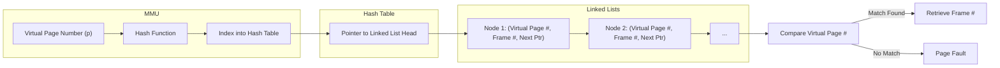

**Translation Process:** The MMU hashes the virtual page number ($p$) to derive an index. It then traverses the linked list at that index to locate the matching virtual page number and retrieve its corresponding physical frame number $f$.

### 3. Inverted Page Tables

*   **Concept:** An inverted page table maintains a single, *global page table* for the entire system. This table is indexed by *physical frame number* and has exactly one entry for each physical frame in memory.
*   **Entry Contents:** Each entry in the inverted page table stores the *Process ID (PID)* and the *Virtual Page Number ($p$)* of the page that is currently residing in that specific physical frame.

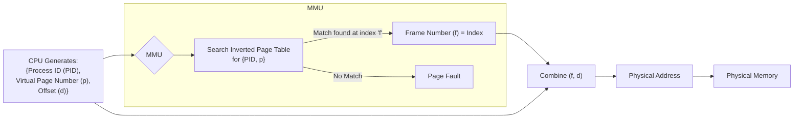

**Translation Process:** When a logical address for a specific process `{PID, p, d}` is generated, the MMU must search the entire inverted page table for an entry matching the incoming `{PID, p}` pair. If a match is found at index $f$, then $f$ represents the physical frame number. Conversely, if no match is found, a page fault occurs.
*   **Advantage:** The primary advantage is that the page table size is proportional to the amount of *physical memory* (rather than the virtual address space size), which greatly reduces memory overhead.
*   **Disadvantage:** However, this approach inherently requires a potentially slow search through the entire table.
*   **Solutions:** Consequently, a high-performance ***TLB is essential*** to mitigate this disadvantage. *Hash tables* are also frequently employed to accelerate the search process specifically during TLB misses.
*   **Shared Memory:** While more complex to implement, shared memory is possible by allowing multiple logical mappings to point to the same physical frame.

---

## Exercises on Page Table Sizes

### Exercise 1

System specifications:
*   **21-bit Virtual Address**
*   **16-bit Physical Address**
*   **2 KB Page Size** ($2^{11}$ bytes)

**Question:** How many entries are there in:
a) A single-level page table?
b) An inverted page table?

**Solution:**
*   Page Offset Bits ($n$): 11 bits (for 2 KB = $2^{11}$ bytes)

*   **a) Single-Level Page Table Entries:**
    *   Virtual Page Number (p) Bits: 21 - 11 = 10 bits.
    *   Number of Entries: $2^{10} = 1024$ entries.

*   **b) Inverted Page Table Entries:** (Equals total number of physical frames)
    *   Physical Frame Number (f) Bits: 16 - 11 = 5 bits.
    *   Number of Entries: $2^5 = 32$ entries.

---

### Exercise 2

System specifications:
*   **32-bit Logical Address**
*   **4 KB Page Size** ($2^{12}$ bytes)
*   **Maximum supported Physical Memory: 512 MB** ($2^{29}$ bytes)

**Question:** How many entries are there in:
a) A single-level page table?
b) An inverted page table?

**Solution:**
*   Page Offset Bits ($n$): 12 bits (for 4 KB = $2^{12}$ bytes)

*   **a) Single-Level Page Table Entries:**
    *   Logical Page Number (p) Bits: 32 - 12 = 20 bits.
    *   Number of Entries: $2^{20} = 1,048,576$ entries (1 Mega-entry).

*   **b) Inverted Page Table Entries:** (Equals total number of physical frames)
    *   Number of Physical Frames: Total Physical Memory / Page Size
        *   $2^{29} \text{ bytes} / 2^{12} \text{ bytes/frame} = 2^{17} = 131,072$ entries (128 Kilo-entries).

---

## Swapping: Extending Memory

Swapping is a memory management technique that allows the OS to temporarily move processes, or portions thereof, from main memory (RAM) to a *backing store* (typically swap space on disk or SSD). These swapped-out components can then be moved back into RAM when required. This mechanism enables more programs to run concurrently than the physical RAM alone would otherwise permit.

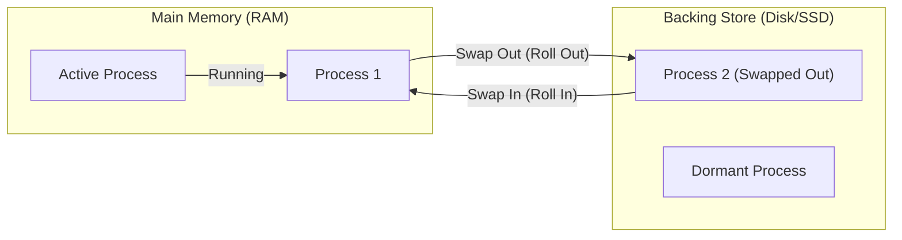

### Standard Swapping (Whole Process Swapping)

*   **Mechanism:** This method involves moving an *entire process's* memory image, including its code, data, and stack.
*   **Backing Store:** The backing store utilized must be sufficiently large and reasonably fast to support direct access.
*   **Operation Flow:** When RAM capacity is reached, the OS selects a victim process, writes its entire memory image to the backing store (a process known as *swapping out* or *rolling out*), thereby freeing up RAM. Subsequently, the incoming process is loaded into the newly available memory (*swapping in* or *rolling in*).
*   **Context Switch Impact:** This type of swapping significantly increases context switch time, primarily due to the slow disk I/O involved in transferring entire processes.

### Swapping with Paging (Paging Out / Demand Paging)

Modern operating systems that employ paging typically swap individual ***pages*** rather than entire processes. This capability is integrated with *demand paging*.
1.  **Demand Paging:** Pages are loaded into main memory only when they are actually accessed, which triggers a *page fault*.
2.  **Page Out:** To free up frames, the OS writes modified or less critical pages to the backing store.
3.  **Page In:** Conversely, when a paged-out page is accessed, the OS reads it back from the backing store into an available frame in main memory.

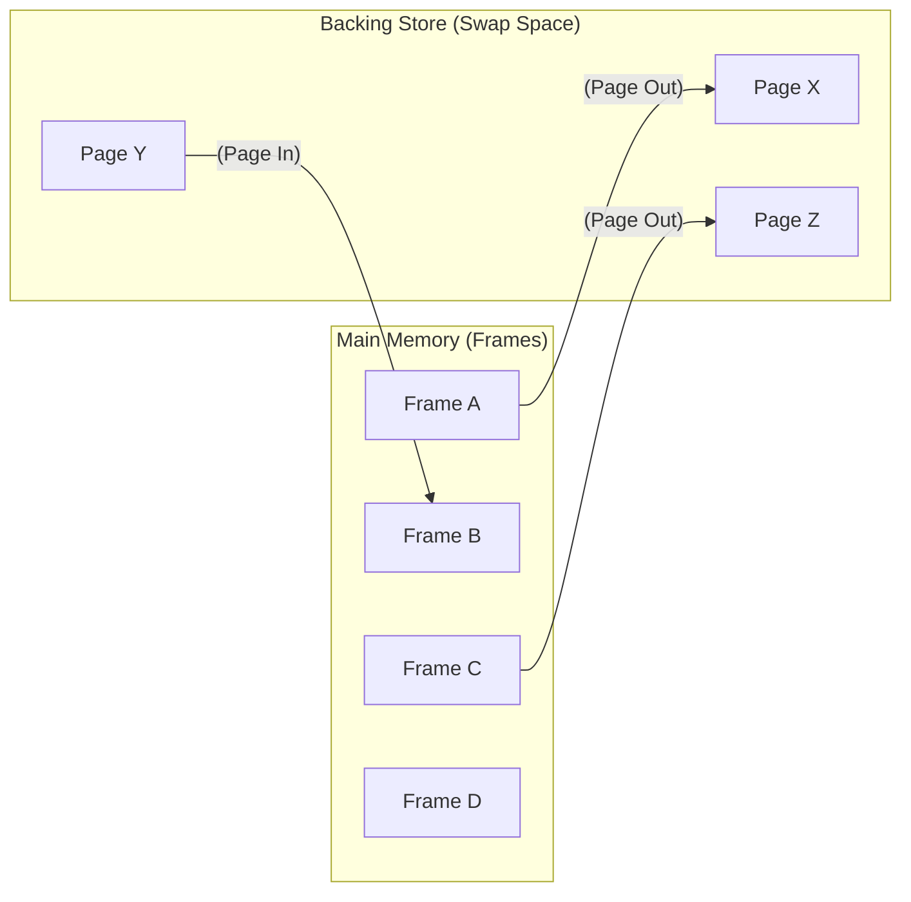

### Key Swapping Concepts

*   **Goal:** The fundamental goal of swapping is to allow the combined memory "in use" by all processes to exceed the physical RAM capacity.
*   **Backing Store:** This refers to fast secondary storage used for temporarily holding swapped-out data.
*   ***Roll Out / Roll In:*** These terms are often used interchangeably with swap out/in, and the process is frequently priority-driven.
*   ***Transfer Time:*** This is the dominant factor contributing to swap time, hence optimization efforts primarily focus on minimizing the amount of data transferred.

### Context Switching and Swapping Issues

*   **Address Binding:** A process can be swapped back to a *different* physical location *only if execution-time address binding (reliant on an MMU and paging) is employed*.
*   **Pending I/O Operations:** To prevent I/O corruption when a process's memory is moved, I/O operations are typically performed *only into operating system kernel buffers*. The OS then manages copying data between this fixed-location kernel buffer and the user process's memory space.
*   **Activation Thresholds:** Swapping generally activates only when free memory levels fall below a predefined low watermark and deactivates once they rise above a high watermark.

### Swapping in Mobile Systems

*   **Traditional Disk-Based Swapping:** This method is generally avoided in mobile operating systems (such as iOS and Android) primarily due to *Flash memory limitations*, including finite write cycles and potential wear-out.
*   **Alternative Strategies for Low Memory:**
    1.  **iOS:** The OS notifies background applications to release memory. If apps are non-compliant or consume excessive memory, iOS *terminates* them (a process sometimes called "jettisoning").
    2.  **Android:** This OS terminates lower-priority background processes but frequently *saves the application's state* to flash storage (a technique known as "tombstoning") to enable quick restoration upon relaunch.