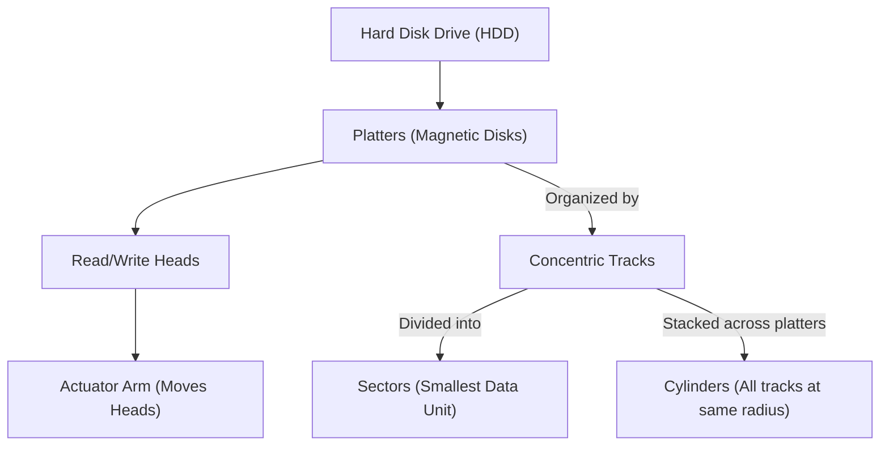
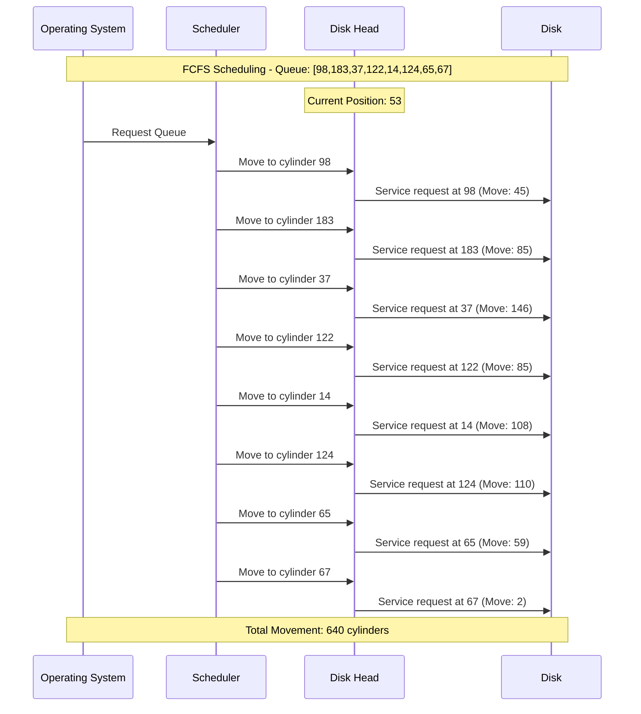
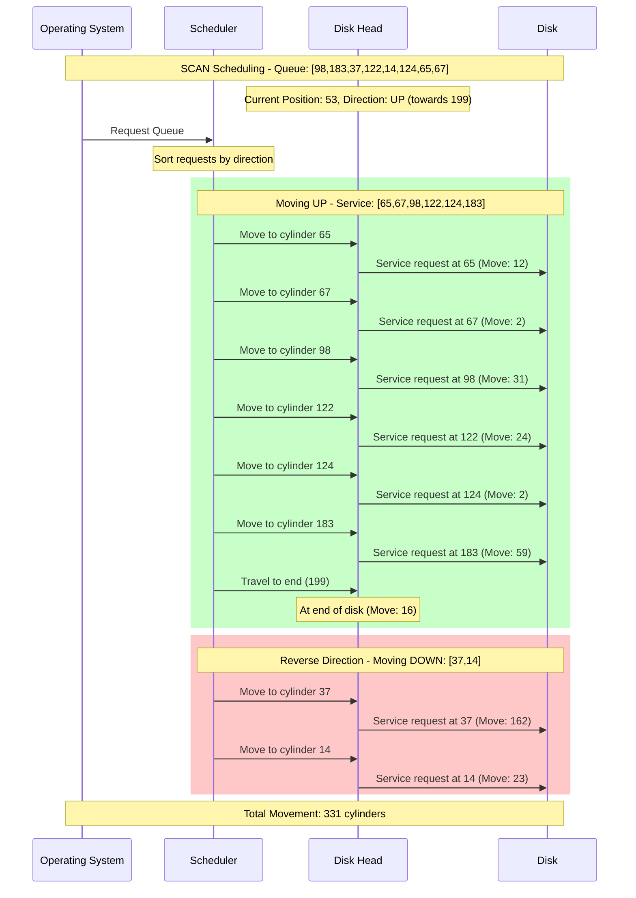
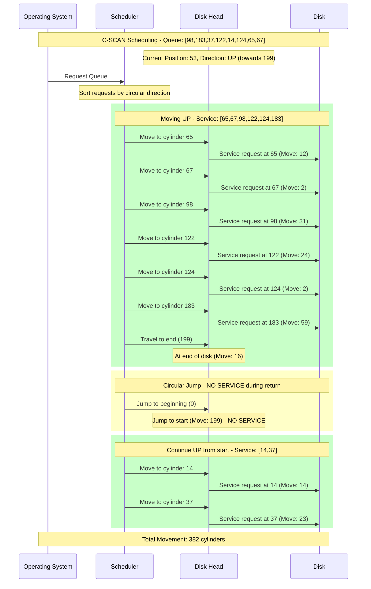
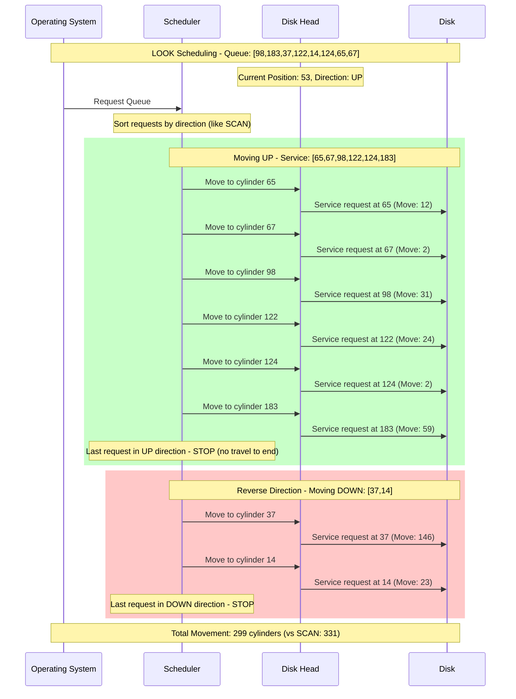
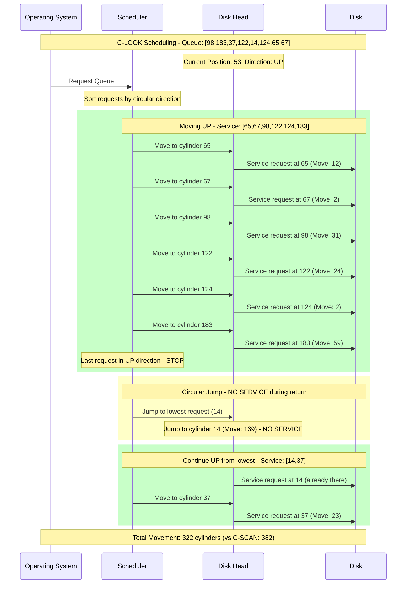

# Mass Storage Structure: Understanding Persistent Data

Computer systems utilize **mass storage** for **persistent data retention**, primarily via **secondary storage devices** like **Hard Disk Drives (HDDs)** and **Non-Volatile Memory (NVM) devices** (e.g., **Solid-State Drives - SSDs**).

## Hard Disk Drives (HDDs)

HDDs are mechanical devices that store data magnetically. Their core components include:
*   **Platters:** These are rigid, magnetic-coated circular disks that spin continuously.
*   **Read/Write Heads:** Electromagnets that float above the platters, responsible for reading and writing data.
*   **Actuator Arms:** Movable arms that hold the read/write heads, pivoting to access data across the platters.

**Characteristics:**
*   **Rotation Speed:** Typically ranges from 5,400 to 15,000 RPM.
*   **Data Organization:**
    *   **Tracks:** Concentric circles on each platter.
    *   **Sectors:** The smallest addressable data unit (typically 512 bytes or 4 KB) found within tracks.
    *   **Cylinders:** Stacks of tracks located at the same radial position across all platters.

**Key Performance Metrics:**
*   **Transfer Rate:** The speed at which data is read from or written to the disk *after* the heads are positioned (measured in MB/s or Gb/s).
*   **Positioning Time (Random Access Time):** The total time required to move the read/write heads to the desired data location.
    *   **Seek Time:** The time it takes for the actuator arm to move the heads to the correct track or cylinder (this is the most significant component of positioning time).
    *   **Rotational Latency:** The time spent waiting for the desired sector to rotate into position under the read/write head.
    *   Average Rotational Latency = $\frac{1}{2} \times \frac{60 \text{ seconds}}{\text{RPM}}$
    *   Average Access Time = Average Seek Time + Average Rotational Latency

**Head Crash:** A severe mechanical failure where the read/write heads physically contact the platter surface, resulting in permanent data loss. HDDs are inherently sensitive to physical shock.
**Removability:** This feature is less common in modern HDDs.

### Hard Disk Performance Details

*   **Platter Sizes:** Standard sizes include 3.5 inches (for desktops/servers) and 2.5 inches (for laptops/compact servers).
*   **Capacity:** Ranges from tens of GB to tens of TB.
*   **Typical Performance:**
    *   **Interface Transfer Rate (Theoretical):** For instance, SATA 3 offers up to 6 Gb/s.
    *   **Sustained Transfer Rate (Actual):** Typically between 100-200 MB/s.
    *   **Seek Time:** Ranges from 3 ms for high-performance drives to 12 ms for slower consumer drives, with 9 ms being a common value.
    *   **Rotational Latency (Avg):** 5400 RPM $\approx 5.56 \text{ ms}$; 7200 RPM $\approx 4.17 \text{ ms}$; 10000 RPM $= 3.00 \text{ ms}$; 15000 RPM $= 2.00 \text{ ms}$.
    *   **Avg Access Time Examples:**
        *   Fast Enterprise (15,000 RPM, 3ms seek): $3 \text{ ms} + 2 \text{ ms} = 5 \text{ ms}$.
        *   Common Desktop (7,200 RPM, 9ms seek): $9 \text{ ms} + 4.17 \text{ ms} = 13.17 \text{ ms}$.

### Calculating Average I/O Time for HDDs

$$ \text{Average I/O Time} = \text{Average Access Time} + \frac{\text{Amount of Data to Transfer}}{\text{Transfer Rate}} + \text{Controller Overhead} $$
**Numerical Example:** Transfer a 4KB block on a 7200 RPM drive with 5ms avg seek, 1 Gb/s transfer rate, 0.1ms controller overhead.
1.  Average Access Time = $5 \text{ ms (seek)} + 4.17 \text{ ms (latency)} = 9.17 \text{ ms}$.
2.  Transfer Time (4KB at 1 Gb/s) = $0.033 \text{ ms}$.
3.  Total Avg I/O Time = $9.17 \text{ ms} + 0.033 \text{ ms} + 0.1 \text{ ms} \approx 9.30 \text{ ms}$.
**Takeaway:** This example demonstrates that for small transfers on HDDs, **access time (comprising seek and rotational latency) largely dominates the total I/O time.**

## Non-Volatile Memory (NVM) Devices (e.g., SSDs)

Non-Volatile Memory (NVM) devices, most commonly **Solid-State Drives (SSDs)** utilizing **NAND flash** technology, store data electronically without any moving parts.

**Advantages of SSDs over HDDs include:**
*   **Significantly Faster:** They exhibit no seek time or rotational latency, resulting in dramatically lower random access times.
*   **More Reliable and Durable:** Less susceptible to physical shock or vibration.
*   **Lower Power Consumption.**
*   **Silent Operation.**

**Despite their advantages, SSDs present certain disadvantages and challenges:**
*   **Limited Lifespan (Endurance):** Flash cells degrade after a finite number of erase/write cycles.
*   **Asymmetrical Write Behavior:** Data is written in small *pages* (e.g., 4KB) but must be erased in much larger *blocks* (e.g., 128KB), making erasure a slower operation.
*   **No In-Place Overwrite:** Modifying data within a single page requires reading the entire block containing that page, modifying the data in an internal buffer, erasing the original block, and then writing the modified block to a *newly erased* block.
*   **Write Amplification (WA):** Logical writes can cause multiple physical writes due to internal operations, increasing wear.
*   **Cost:** Historically more expensive per GB than HDDs.
*   **Capacity:** Maximum capacities often lower than largest HDDs.

### NVM / SSD Challenges and Internal Management

These inherent challenges are managed by the SSD controller's sophisticated firmware.
*   **Wear Leveling:** This involves algorithms that distribute write operations evenly across all flash blocks to maximize and extend the device's lifespan.
*   **Drive Writes Per Day (DWPD):** A key metric for enterprise SSD endurance, indicating, for example, that a 1TB SSD with 5 DWPD can handle 5TB of writes per day throughout its warranty period.

### SSD Controller and Flash Translation Layer (FTL)

The SSD controller's crucial **Flash Translation Layer (FTL)** abstracts the intricate complexities of flash memory, thereby presenting a traditional block device interface to the operating system.
*   **Logical-to-Physical Mapping:** The FTL is responsible for mapping Logical Block Addresses (LBAs) requested by the OS to their corresponding physical flash addresses. This enables critical functions like wear leveling, hides the necessary erase-before-write operations, and facilitates the management of bad blocks.
*   **Garbage Collection:** This is a background process that copies valid pages from partially used ('mixed' or 'dirty') blocks to newly available blocks. Subsequently, it erases the original dirty blocks, thereby reclaiming usable space. This operation inherently contributes to write amplification.
*   **Over-Provisioning:** This refers to a hidden, reserved portion of physical NAND capacity. It is utilized by the FTL to ensure efficient wear leveling and garbage collection, ultimately helping to maintain consistent performance over time.

## Volatile Memory as Mass Storage

DRAM (main system memory) is volatile, losing data upon power loss. However, it can be utilized as fast temporary storage.
*   **RAM Drives (or RAM Disks):** These are created when software allocates a portion of DRAM to function as a block device, which is then formatted with a file system.
*   **Purpose:** This provides explicit control over data residence for extremely fast temporary storage (e.g., scratch space, temporary files) or rapid data sharing.
*   **Drawback:** All data is **lost** on a power cycle, shutdown, or crash unless it has been explicitly saved to persistent storage.

## Storage Attachment: Connecting Devices

Storage devices are connected to computer systems via various **buses** and **interfaces**.
*   **System Bus / I/O Bus:** This primary bus connects the CPU, main memory, and storage controllers.
*   **Common Interfaces include:**
    *   **SATA:** Prevalent for internal HDDs/SSDs.
    *   **SAS:** Higher-performance, robust for servers/workstations.
    *   **USB:** Ubiquitous for external storage.
    *   **Thunderbolt:** High-speed external, combining PCIe/DisplayPort.
    *   **Fibre Channel (FC):** High-speed, used for Storage Area Networks (SANs).
    *   **NVMe (Non-Volatile Memory Express):** A modern, high-performance interface designed for NVM (SSDs), connecting directly to the **PCIe bus** for lower latency and higher throughput.
*   **Controllers manage the flow of data:**
    *   **Host Controller (Host Bus Adapter - HBA):** Connects the computer's system bus to the storage bus.
    *   **Device Controller:** This controller is embedded within the storage device itself and manages its internal operations, such as head movement, flash management, and error correction.
*   **Communication Flow:** The CPU issues commands to the Host Controller (mediated by OS drivers). The Host Controller then communicates with the Device Controller over the storage bus. Notably, data transfers often utilize **Direct Memory Access (DMA)** directly between the storage device and DRAM, which effectively frees the CPU for other tasks.

# HDD Scheduling: Optimizing Disk Arm Movement

Given the inherently slow mechanical access times of HDDs, the operating system optimizes pending I/O requests to minimize seek time and maximize disk bandwidth. This optimization is particularly relevant only when a queue of requests for the same disk exists.
A request typically specifies the operation (read/write), the disk address (cylinder, track, sector), the memory address, and the data size.

**Example Scenario (used for algorithms below):**
*   **Queue of pending requests for cylinders:** `98, 183, 37, 122, 14, 124, 65, 67`
*   **Current head position:** `53`
*   **Disk cylinder range:** 0 to 199

### 1. FCFS (First Come, First Served) Scheduling

*   **Policy:** Services requests in their arrival order.
*   **Performance:** Poor, resulting in high total seek times due to frequent back-and-forth arm movements.
**FCFS Example Trace (Current head at 53):**
Movements: $|98 - 53| = 45$; $|183 - 98| = 85$; $|37 - 183| = 146$; $|122 - 37| = 85$; $|14 - 122| = 108$; $|124 - 14| = 110$; $|65 - 124| = 59$; $|67 - 65| = 2$.
**Total Head Movement (FCFS):** $45 + 85 + 146 + 85 + 108 + 110 + 59 + 2 = \mathbf{640 \text{ cylinders}}$.

### 2. SCAN (Elevator) Scheduling

*   **Policy:** The arm moves in one direction, servicing all requests encountered along the way. Upon reaching the end of the disk (or the last request in that direction), it reverses its direction and services requests on the way back.
*   **Performance:** Reduces back-and-forth motion, generally outperforming FCFS.
**SCAN Example Trace (Current head at 53, moving towards 199 first):**
Requests serviced: 65, 67, 98, 122, 124, 183 (going up); then 37, 14 (going down).
Movements: $(65-53) + (67-65) + (98-67) + (122-98) + (124-122) + (183-124) = 12+2+31+24+2+59 = 130$ (up).
Travel to end: $(199-183) = 16$.
Movements: $(199-37) + (37-14) = 162+23 = 185$ (down).
**Total Head Movement (SCAN):** $130 + 16 + 185 = \mathbf{331 \text{ cylinders}}$.

### 3. C-SCAN (Circular SCAN) Scheduling

*   **Policy:** The arm moves in one direction, servicing requests. Upon reaching the end of the disk, it jumps back to the beginning of the disk *without servicing* requests on the return trip, and then restarts its scan in the original direction.
*   **Performance:** Provides more uniform waiting times compared to standard SCAN.
**C-SCAN Example Trace (Current head at 53, moving towards 199 first):**
Requests serviced (up): 65, 67, 98, 122, 124, 183.
Movements: $(65-53) + (67-65) + (98-67) + (122-98) + (124-122) + (183-124) = 12+2+31+24+2+59 = 130$ (up).
Travel to end: $(199-183) = 16$.
Jump to beginning: $|0-199| = 199$ (no service).
Requests serviced (up from 0): 14, 37.
Movements: $(14-0) + (37-14) = 14+23 = 37$ (up from 0).
**Total Head Movement (C-SCAN):** $130 + 16 + 199 + 37 = \mathbf{382 \text{ cylinders}}$.

### 4. LOOK / C-LOOK Scheduling

*   **Policy:** These are variants of SCAN and C-SCAN that only travel as far as the *last request* in a given direction. They then reverse or jump back, effectively avoiding unnecessary travel to the physical ends of the disk.

### Selecting a Disk Scheduling Algorithm

*   **FCFS:** Simple, fair in terms of arrival order; however, it exhibits poor performance.
*   **SCAN/C-SCAN (and their LOOK/C-LOOK variants):** These algorithms offer significantly better performance under heavy load by minimizing seek distance, and they generally prevent starvation of requests.
*   **Modern Linux Schedulers:** These employ complex, adaptive algorithms that balance throughput with fairness, often differentiating between various I/O types. Examples include `Deadline` (prioritizing reads and meeting deadlines), `NOOP` (a minimalist scheduler suited for SSDs and hardware RAID), `CFQ` (aimed at fair resource sharing), `BFQ` (designed for low latency in interactive tasks), and `Kyber` (optimized for low-latency flash storage).

# NVM (SSD) Scheduling

SSD scheduling fundamentally differs from HDD scheduling, primarily due to the absence of mechanical limitations in SSDs.
*   **No Seek Time or Rotational Latency:** Access is electronic and uniform.
*   **Traditional Algorithms Irrelevant:** Algorithms like SCAN and C-SCAN are not applicable.
*   **FCFS or Near-FCFS is Common:** Simple schedulers, such as Linux's `NOOP`, are typically recommended. They focus on merging adjacent logical requests, leveraging the fact that SSDs possess highly optimized internal scheduling capabilities.
*   **Optimization Focus Shifts:** For SSDs, the optimization focus shifts to internal parallelism, deep queue management (as NVMe supports multiple, deep queues), and minimizing write amplification.
*   **Key Performance Metrics for SSDs include:**
    *   **IOPS (I/O Operations Per Second):** SSDs excel at random I/O (achieving hundreds of thousands vs. hundreds for HDDs).
    *   **Throughput (MB/s):** High, often limited by interface bandwidth (NVMe offers superior performance to SATA).
    *   **Latency:** Significantly lower (measured in microseconds vs. milliseconds).
*   **Write Amplification Impact:** Operations like background garbage collection can temporarily affect foreground performance.

# Error Detection and Correction

Storage systems employ various mechanisms to ensure data integrity.
*   **Error Detection:** Techniques that identify data corruption.
    *   **Parity Bit:** Adds a bit to make the total number of '1's even or odd. It detects single-bit errors but cannot detect multiple bit errors.
    *   **Checksum:** A numerical value derived from data; its recalculation verifies for corruption.
    *   **Cyclic Redundancy Check (CRC):** A robust checksum method using polynomial division; it is highly effective at detecting burst errors.
*   **Error Correction Codes (ECC):** These codes detect and automatically correct errors by utilizing redundant bits.
    *   **Usage:** They are employed in ECC Memory (common in servers) for single-bit "soft errors," and also within storage controllers and file systems (e.g., ZFS).
    *   **Limitations:** ECC can correct a specific number of errors, but may only detect more severe ones without being able to correct them.

# Storage Device Management

Before a storage device can be used, it typically undergoes the following processes:
1.  **Low-Level Formatting (Physical Formatting):** This is a manufacturer-level process that divides the physical disk into sectors (for HDDs) or pages (for NVM devices), marking them with unique IDs, ECC information, and flags. It is not typically performed by users.
2.  **Partitioning:** Involves dividing the device into one or more logical **partitions**. This allows for the installation of multiple operating systems or structured data organization. Partition information is stored in either the **Master Boot Record (MBR)** or the **GUID Partition Table (GPT)**.
3.  **Logical Formatting (Creating a File System):** In this step, the OS writes file system data structures (such as the superblock, inode tables, free space maps, and root directory) onto a designated partition. This process enables structured storage of files and directories.

**Bootstrapping (Booting the Computer):** This refers to the entire process of loading the operating system into memory.
*   **Bootstrap Loader (Firmware):** The initial code in BIOS/UEFI that performs essential hardware initialization.
*   **Second-Stage Bootloader:** The firmware loads a more complex program from storage (e.g., from the boot sector).
*   **OS Kernel Loading:** The second-stage bootloader finds, loads, and initiates the OS kernel.

# RAID Structure (Redundant Array of Independent Disks)

RAID (Redundant Array of Independent Disks) combines multiple physical disks into a single logical unit. This configuration aims to improve performance, data reliability, or both.
*   **The motivation behind RAID is twofold:**
    *   **Reliability:** Individual disks possess a finite Mean Time To Failure (MTTF). Consequently, an array of $N$ disks has an array MTTF approximately $1/N$ of a single disk's. RAID counteracts this by adding redundancy to prevent total data loss upon individual drive failure.
    *   **Performance:** By enabling parallel I/O across multiple disks, RAID significantly increases transfer rates.
*   **Solution: Redundancy:** The core solution involves storing extra information across disks, which permits data recovery in the event of a disk failure.

### Basic RAID Techniques

1.  **Mirroring (RAID 1):**
    *   **Concept:** Data is duplicated identically across two or more disks.
    *   **Pros:** Offers high read performance and high reliability (tolerates all but one disk failure).
    *   **Cons:** Expensive capacity-wise (only 50% usable for 2 disks), and slightly lower write performance.
    *   **Reliability (MTTDL):** $\text{MTTDL}_\text{mirror} \approx \frac{(\text{MTTF}_\text{single})^2}{2 \times \text{MTTR}}$. This dramatically increases reliability.

2.  **Striping (RAID 0):**
    *   **Concept:** Data is split into blocks (called "stripes") and written across multiple disks in a rotating fashion.
    *   **Pros:** Provides excellent performance (both read and write, especially sequential) and full capacity utilization.
    *   **Cons:** **Offers NO REDUNDANCY!** A single disk failure results in total data loss. It is inherently less reliable than a single disk.

### Common RAID Levels (Combining Striping and Redundancy)

| RAID Level | Description | Pros | Cons | Fault Tolerance | Usable Capacity |
| :--------- | :------------------------------------------------------- | :------------------------------------------------------------------------------------------------------ | :------------------------------------------------------------------------------------------------------------------------ | :-------------- | :-------------- |
| **RAID 0** | **Striping (No Redundancy)**. | Highest performance, full capacity. | **No fault tolerance; total data loss on single disk failure.** | 0 | 100% |
| **RAID 1** | **Mirroring**. Exact data duplicates on $\ge 2$ disks. | High read performance, high reliability. | Expensive capacity (50% usable for 2 disks). | Up to N-1 disks | 50% (for 2) |
| **RAID 4** | Block-level striping, **dedicated parity disk**. | Good read performance. Reconstructs data from one failed disk. | **Parity disk is a write bottleneck.** | 1 disk failure | (N-1) / N |
| **RAID 5** | Block-level striping, **distributed parity**. | Good read/write performance. Tolerates one disk failure. More efficient writes than RAID 4. | Requires parity recalculation/write. Cannot tolerate two simultaneous failures. | 1 disk failure | (N-1) / N |
| **RAID 6** | Block-level striping, **two independent distributed parity schemes**. | Very high reliability (tolerates **two simultaneous disk failures**). Good read performance. | Higher capacity overhead (2 disks for parity). Slightly lower write performance than RAID 5 (more parity calculations). | 2 disk failures | (N-2) / N |

*N* represents the total number of disks.

*   **Nested RAID Levels (Hybrid RAID):**
    *   **RAID 10 (1+0):** Striping across mirrored sets. Offers excellent performance and high reliability (tolerates multiple failures if they occur in different mirrored pairs).
    *   **RAID 01 (0+1):** Mirroring striped sets. This configuration is less fault tolerant than RAID 10.

### Other RAID/Storage Array Features

*   **Snapshots:** Point-in-time, read-only copies of volumes or file systems, often utilizing **copy-on-write (COW)** technology.
*   **Replication:** Involves automatically copying data to a secondary storage system. This can be **synchronous** (ensuring no data loss but impacting performance) or **asynchronous** (offering better performance but with potential for minor data loss).
*   **Hot Spare:** An unused, pre-installed disk within a RAID array that automatically takes over the role of a failed disk. This reduces Mean Time To Recovery (MTTR) and overall system vulnerability.
*   **Advanced File Systems (e.g., ZFS, Btrfs):** These file systems integrate features such as checksumming, snapshots, COW, and RAID-like functionality (e.g., RAID-Z) directly within their architecture.

# Swap-Space Management

**Purpose:** The operating system utilizes secondary storage (referred to as **backing store** or **swap space**) to temporarily hold memory pages or entire processes that do not fit within physical RAM. This mechanism enables higher degrees of multiprogramming and allows for the execution of programs larger than available physical memory.
*   **Location/Configuration of swap space can be:**
    *   **Raw Partition:** A dedicated, unformatted disk partition. This offers the best performance due to direct access.
    *   **Swap File:** A regular file created within an existing file system. While flexible (easy to resize or add), it incurs minor file system overhead.
*   **Management by the OS:** The operating system manages swap space allocation and deallocation (often using bitmaps or linked lists), typically aiming for speed and frequently allocating contiguous blocks.
*   **Multiple Swap Spaces:** Configuring multiple swap spaces allows for load-balancing I/O across different disks, resulting in better performance.

# Storage Attachment Methods (Revisited)

Storage device connection methods vary significantly based on scale, desired performance, and data sharing requirements.

1.  **Host-Attached Storage (Direct-Attached Storage - DAS):** Storage connected directly to a single host (e.g., internal SATA/SAS/PCIe/NVMe drives, or external USB/Thunderbolt devices). This is common for individual machines.
2.  **Network-Attached Storage (NAS):** This refers to a dedicated storage device connected directly to a standard network (e.g., Ethernet or Wi-Fi). It provides **file-level access** using protocols like NFS or SMB/CIFS, allowing clients to see shared folders. Benefits include easy data sharing and simple setup.
3.  **Storage Area Network (SAN):** A dedicated, high-speed **network** that connects multiple servers to shared **block-level storage arrays**. It utilizes protocols such as Fibre Channel (FC), iSCSI, or FCoE. Hosts perceive the storage as raw, local disks (Logical Unit Numbers - LUNs). Benefits include high performance, scalability, and centralized management.
4.  **Cloud Storage:** Storage services accessed over the internet (WAN) from remote data centers. These services are typically accessed via **APIs** (e.g., REST APIs for object storage like Amazon S3 or Google Cloud Storage). Benefits include immense scalability, global accessibility, high durability, and flexible pricing models.

### Storage Arrays

Storage Arrays are dedicated hardware systems comprising multiple disks (HDDs/SSDs), specialized controllers, cache memory (often NVRAM), and host ports. They present block-level storage (Logical Unit Numbers - LUNs) to connected servers and internally implement advanced features such as RAID, snapshots, replication, thin provisioning, and hot spares, thereby offering superior performance, reliability, and centralized management capabilities.

### Storage Area Networks (SANs) - Deeper Dive

**Architecture:** A SAN is a dedicated, high-speed network (typically utilizing Fibre Channel switches) that connects multiple servers to shared block-level storage arrays.
**Flexibility/Scalability:** Any host connected to the SAN can access storage volumes (LUNs) on any array, with access controlled by LUN masking and zoning. This architecture facilitates easy and independent scaling of compute and storage resources.
**Benefits:** High performance (low latency/high throughput), scalability, centralized management, and high availability.
**Convergence Trends:** Technologies like FCoE (Fibre Channel over Ethernet) and iSCSI are enabling the consolidation of storage traffic onto standard IP networks, which can potentially reduce infrastructure costs.