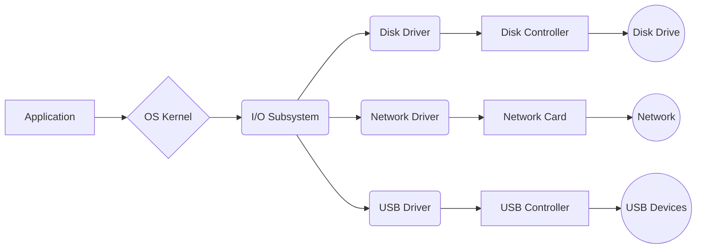
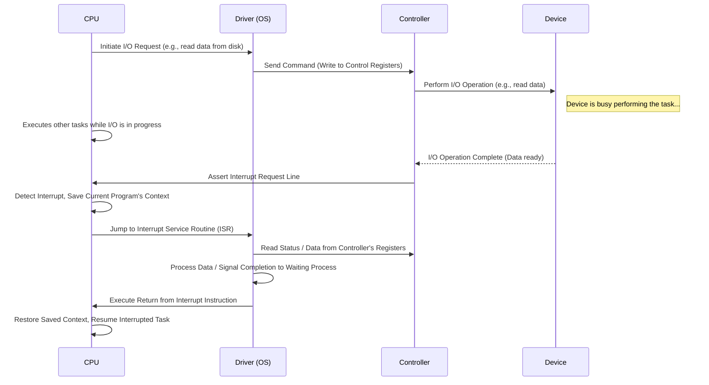
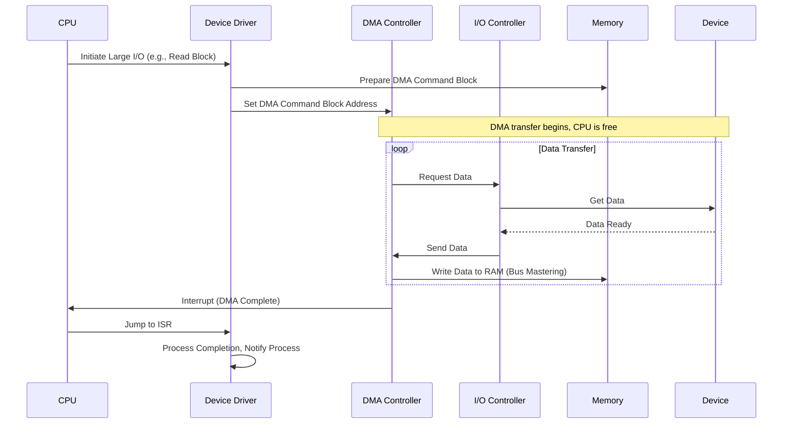
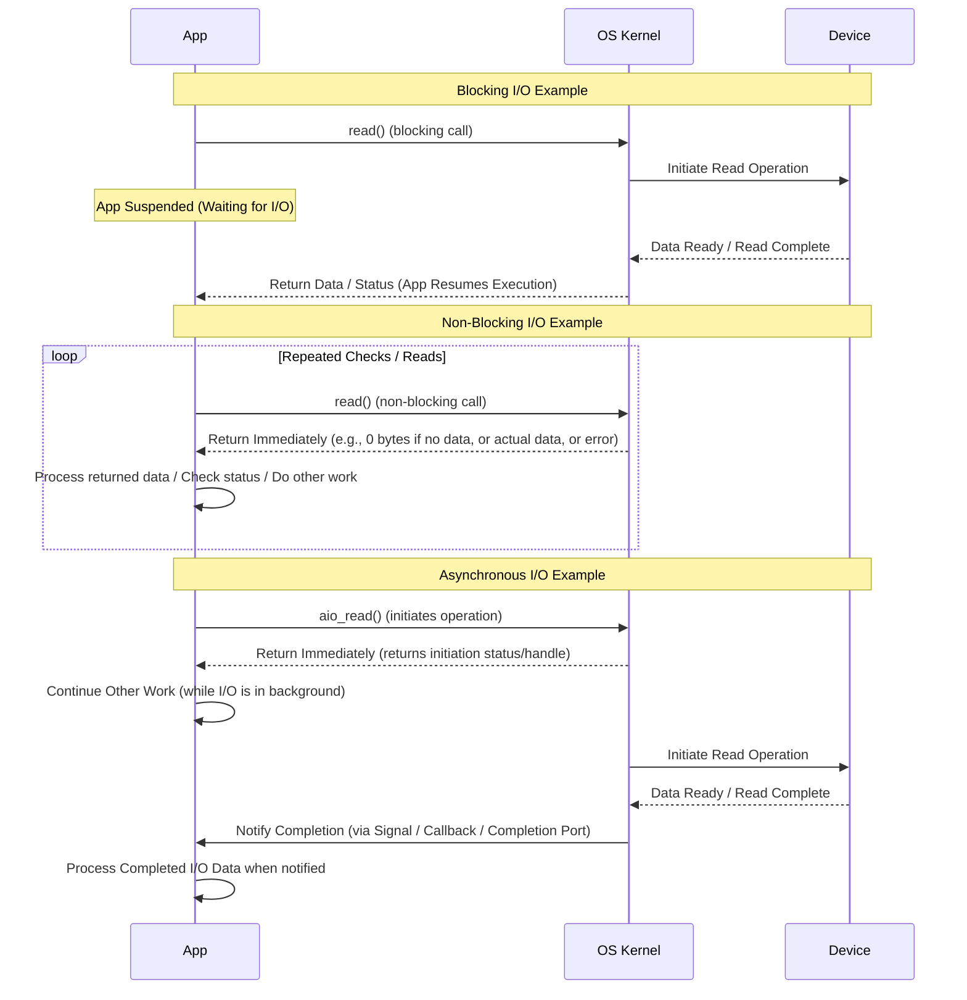
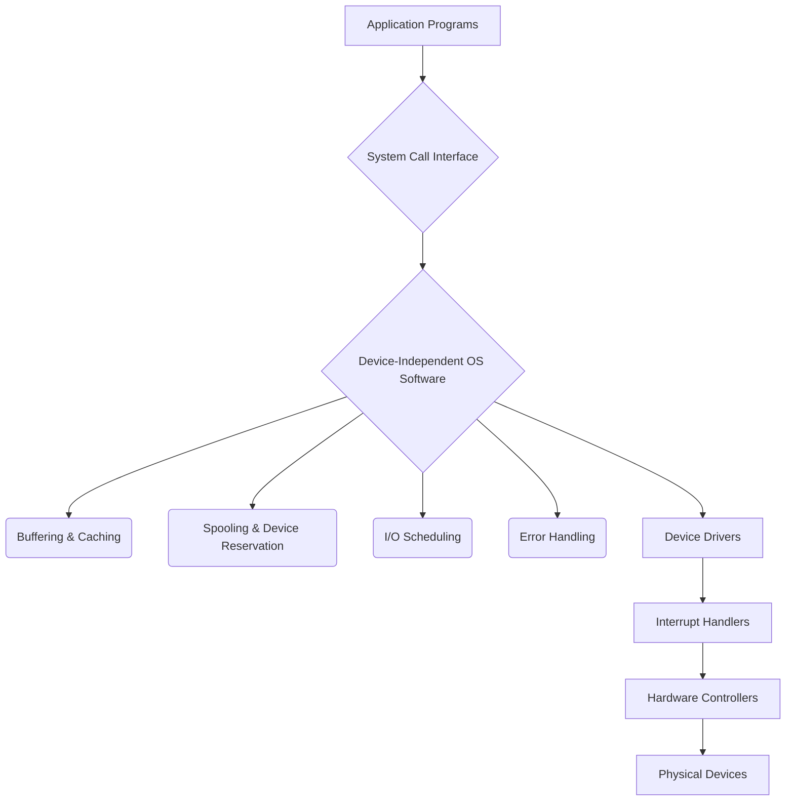
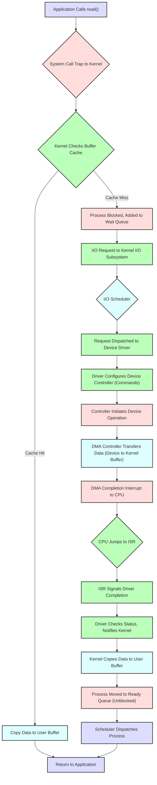

# I/O Systems

## Overview

**I/O management** is crucial for computer systems to effectively interact with the external world, encompassing humans and various devices. The operating system (OS) must proficiently handle a diverse array of I/O devices, each possessing unique characteristics and requiring specific control mechanisms. Given that I/O operations are orders of magnitude slower than CPU operations, efficient **I/O management** becomes critical for overall system performance. **Device drivers** serve to abstract hardware complexity, presenting a standardized interface to the OS kernel.

---

## I/O Hardware Concepts

I/O devices communicate through electrical signals transmitted over physical wires or wirelessly.
*   **Port:** Represents a physical connection point (e.g., a USB port).
*   **Bus:** A shared communication pathway that connects multiple devices or components (e.g., PCIe for fast peripherals, SATA for internal drives, USB for external peripherals, System Bus for CPU-memory communication, Expansion Bus for slower peripherals).
*   **Controller** (or **Adapter**): An electronic circuit or chip that operates a specific port, bus, or device. It translates system bus signals into a format understandable by I/O devices.
    *   **Host Controller (HBA):** Located on the computer side (motherboard or an expansion card), it connects the system bus to an I/O bus (e.g., a USB or SATA controller).
    *   **Device Controller:** This component is integrated directly within the peripheral device itself and manages its internal operations (e.g., an HDD controller, a NIC chip).

### CPU and Controller Interaction

The CPU interacts with device controllers via special **hardware registers**.
*   **Device Registers:** These are dedicated CPU-accessible registers:
    *   **Data-in/Data-out:** Used for transferring input or output data.
    *   **Status:** Reflects the device's current state (e.g., idle, busy, error, data ready).
    *   **Control:** Allows the CPU to issue commands to the device (e.g., start read/write, change mode).
*   **Addressing Device Registers:**
    1.  **I/O Port Instructions (Direct I/O):** Special CPU instructions (e.g., `in`, `out` in x86 architectures) are used to access a dedicated I/O port space, which is separate from the main memory address space.
    2.  **Memory-Mapped I/O (MMIO):** This more common method assigns I/O device registers addresses within the regular physical memory space. The CPU then uses standard memory access instructions (`load`, `store`) to interact with these registers.

**Example I/O Port Locations on PCs (Partial)**

| I/O Address Range (Hexadecimal) | Device                 |
| :------------------------------ | :--------------------- |
| `000-01F`                       | DMA Controller 1       |
| `020-021`                       | Interrupt Controller 1 |
| `040-043`                       | Timer                  |
| `200-20F`                       | Game Controller        |
| `2F8-2FF`                       | Serial Port (COM2)     |
| `3F8-3FF`                       | Serial Port (COM1)     |
| `3D0-3DF`                       | Graphics Controller    |
| `378-37F`                       | Parallel Port          |
| `...`                           | ...                    |

---

## Polling: Checking Device Status

In **polling**, the host (CPU or device driver) continuously checks device status registers (e.g., by examining a `busy` bit) in a **busy-waiting** loop. This is done to determine the device's readiness or the completion of an operation.
**Typical Write Sequence (1 byte):**
1.  The host busy-waits by repeatedly reading the status register until the device indicates it is ready.
2.  The host then writes the data byte to the data-out register.
3.  Next, the host writes the command to the control register and sets the `command-ready` bit.
4.  The controller detects the `command-ready` bit and sets its own `busy` bit.
5.  The controller proceeds to perform the I/O operation.
6.  Upon completion, the controller clears the `command-ready` and `busy` bits and reports its status.
**Problem:** The primary issue with **busy-waiting** is that it wastes valuable CPU cycles, especially when dealing with slow devices. This reduces system responsiveness and can even lead to missed events.

---

## Interrupts: Device-Initiated Notification

**Interrupts** offer a more efficient alternative to polling. A device controller notifies the CPU when it completes an operation or requires attention by issuing an **interrupt**.
*   **Hardware:** The device controller asserts an electrical signal on the CPU's dedicated **interrupt-request line**. The CPU checks this line after the execution of every instruction.
*   **Handling Steps:**
    1.  The CPU detects the interrupt and suspends its current task.
    2.  It then saves the current program's context (including the **Program Counter (PC)** and status flags).
    3.  The CPU determines the source of the interrupt.
    4.  It uses the interrupt number as an index into the **Interrupt Vector Table (IVT)**.
    5.  Control is then transferred to the specific **Interrupt Service Routine (ISR)**, which is a part of the kernel's device driver.
    6.  The ISR handles the interrupt (e.g., reads data, acknowledges the interrupt, or initiates the next I/O operation).
    7.  The ISR executes a "return from interrupt" instruction.
    8.  Finally, the CPU restores the previously saved context and resumes the interrupted program.
*   **Overhead:** The process involves CPU context saving and restoration.
*   **Priority:** Interrupts can be assigned different priorities.
*   **Maskable/Non-Maskable:** The CPU can temporarily ignore (mask) lower-priority interrupts; however, **Non-Maskable Interrupts (NMIs)** are reserved for severe, unrecoverable errors.
*   **Chaining:** If multiple devices share an interrupt line, the ISR queries each device to identify the specific source of the interrupt.

### Interrupt-Driven I/O Cycle

### Interrupts vs. Exceptions vs. Traps

All three mechanisms transfer control to the kernel, but they differ fundamentally in their cause:
*   **Interrupt (Hardware):** An **asynchronous** event, triggered by **external hardware** (e.g., I/O completion, timer expiration).
*   **Exception (Processor):** A **synchronous** event, triggered by a CPU **error** during instruction execution (e.g., division by zero, page fault).
*   **Trap (Software/System Call):** A **synchronous** event, triggered **intentionally** by a program instruction to request specific OS services (e.g., a `SYSCALL`).

---

## Direct Memory Access (DMA)

**Problem:** Even with interrupts, the CPU is still burdened with transferring data byte-by-byte between the device and memory within Interrupt Service Routines (ISRs) (a process known as **Programmed I/O - PIO**). This becomes a significant bottleneck for large data transfers.
**DMA Solution:** **Direct Memory Access (DMA)** is a hardware-assisted technique that enables I/O devices to transfer large blocks of data directly to or from main memory *without* continuous CPU involvement for each byte.
*   **DMA** requires a dedicated **DMA controller** (which can be integrated into a chip or be a separate component).
*   **Process:**
    1.  **CPU Setup:** The CPU (via the device driver) configures the DMA controller with a **DMA command block** located in main memory. This block specifies parameters such as source/destination addresses, read/write operation, and the number of bytes to transfer.
    2.  **Initiation:** The CPU writes the address of the command block to a DMA controller register, thereby initiating the transfer.
    3.  **CPU is Free:** Once initiated, the CPU delegates the transfer to the DMA controller and is free to perform other tasks.
    4.  **DMA Transfer (Bus Mastering):** The DMA controller takes control of the memory bus and directly transfers data between the I/O device controller and memory (often in bursts).
    5.  **Cycle Stealing:** During this transfer, DMA might momentarily "steal" bus cycles from the CPU. However, this is significantly more efficient than PIO.
    6.  **Completion Interrupt:** Upon transfer completion, the DMA controller interrupts the CPU.
    7.  **Interrupt Handling:** The CPU's ISR acknowledges the interrupt, checks for any errors, and notifies the relevant process or driver.
*   **DVMA (Direct Virtual Memory Access):** More advanced systems allow DMA transfers using virtual addresses, with the MMU performing the necessary translation.
**DMA** significantly reduces CPU overhead for large I/O operations, thereby considerably improving system performance.

---

# Application I/O Interface

The operating system provides applications with a standardized and abstracted I/O access, effectively hiding the complexities of the underlying hardware.
*   **Abstraction:** The OS categorizes devices into generic classes:
    *   **Block Devices:** Handle fixed-size block transfers (e.g., HDDs, SSDs).
    *   **Character Devices:** Process byte-at-a-time transfers (e.g., keyboards, serial ports).
    *   **Network Sockets:** Used specifically for network communication.
*   **Device Drivers:** These software components translate high-level OS requests into low-level hardware commands.
*   **Uniform Interface:** Applications utilize consistent APIs (e.g., `open()`, `read()`, `write()`, `close()` operations on file descriptors) regardless of the specific underlying device.

**Device Characteristics (Variations Handled by OS/Drivers):**
*   **Character Stream vs. Block:** Refers to byte-at-a-time transfers versus fixed-size contiguous blocks.
*   **Sequential vs. Random Access:** Describes access patterns: linear order access (e.g., tape drives) versus direct access to any location (e.g., disk drives).
*   **Synchronous vs. Asynchronous:** Pertains to predictability of response time (e.g., disk operations are typically synchronous) versus unpredictability (e.g., keyboard input, network communication).
*   **Sharable vs. Dedicated:** Indicates whether a device can be used concurrently by multiple processes (e.g., disk) or exclusively by one process (e.g., tape drive, older printers).
*   **Speed of Operation:** Varies vastly (e.g., keyboard: a few bytes/sec; NVMe SSD: GB/sec).
*   **Read/Write Capability:** Devices can be read-write, read-only, or write-only.

## Blocking, Non-Blocking, and Asynchronous I/O

Application behavior during I/O system calls can be categorized into three main types:

1.  **Blocking I/O:**
    *   **Behavior:** The process **suspends** its execution until the I/O operation fully completes.
    *   **Pros:** Offers the simplest programming model due to its sequential execution flow.
    *   **Cons:** Halts the entire process or thread, making it unsuitable for applications requiring high responsiveness or throughput (e.g., GUIs, servers).

2.  **Non-Blocking I/O:**
    *   **Behavior:** The system call returns **immediately**, even if the I/O operation has not completed. It returns any available data or an error indication.
    *   **Application's Role:** The application must repeatedly call the I/O function (effectively "**polling the OS**") to check for completion or data availability.
    *   **Use Cases:** It allows interleaving I/O with computation and is common in event-driven programming, often combined with multiplexing techniques (`select()`, `poll()`, `epoll()`).

3.  **Asynchronous I/O (AIO):**
    *   **Behavior:** The I/O operation is initiated in the background, and the system call returns immediately, allowing the application to **continue executing** other tasks.
    *   **Notification:** The OS notifies the application upon completion of the I/O operation (e.g., via a signal, a callback function, or by enqueuing an event in a completion queue).
    *   **Pros:** Provides maximum overlap of computation and I/O, making it highly efficient for high-performance servers.
    *   **Cons:** Involves a more complex programming model.

---

## Kernel I/O Subsystem Structure

The kernel's I/O subsystem is a complex component responsible for managing diverse I/O devices and their associated requests. It acts as an intermediary layer between applications and the underlying hardware.

### Key Services of the Kernel I/O Subsystem

1.  **I/O Scheduling:** This service orders pending I/O requests for shared devices (e.g., disk drives) to improve performance (including throughput and response time) and ensure fair access. It utilizes queues and various scheduling algorithms (e.g., SCAN for HDDs, FCFS for SSDs).
2.  **Buffering:** Buffering involves temporarily storing data in kernel memory during transfers. This helps bridge speed differences between devices, reconcile transfer size discrepancies, and provide copy semantics (e.g., writing data to a kernel buffer first before transferring to the device).
3.  **Caching:** Caching retains frequently accessed data blocks in faster memory (a buffer cache) to avoid slow device access. "**Cache hits**" are served directly from RAM, significantly speeding up data retrieval.
4.  **Spooling (Simultaneous Peripheral Operations On-Line):** Spooling allows the I/O of one job to overlap with the computation of others, particularly useful for slow, dedicated devices like printers. Output is first written to a faster disk buffer; a spooler daemon then sends it to the slow device.
5.  **Device Reservation:** This service provides exclusive access to non-sharable devices (e.g., a tape drive) through OS system calls, thereby preventing conflicts among processes.
6.  **Error Handling:** The subsystem detects and attempts to recover from I/O errors. Device drivers check status registers, retry operations, log errors, or report them to applications as appropriate.

---

## Life Cycle of a Blocking I/O Request

Here is a detailed sequence illustrating the life cycle of a typical blocking read request (e.g., reading from a disk):
1.  **Application Request:** A user process initiates an I/O operation by calling `read()` (passing parameters such as a file descriptor, a user buffer address, and the number of bytes to read).
2.  **System Call Entry:** The `read()` call triggers a **trap** to the kernel. The kernel then validates the provided parameters.
3.  **Buffer Cache Check:** The kernel first checks if the requested data is already present in its buffer cache.
    *   **Cache Hit:** If the data is found in the cache, it is copied directly from the cache to the user's buffer, and the `read()` call returns immediately without requiring any physical I/O to the device.
4.  **Cache Miss (Physical I/O Required):**
    *   If the data is not in the cache, the OS moves the requesting process from the run queue to the device's specific wait queue, setting the process's state to `waiting`.
    *   The I/O request is then submitted to the kernel I/O subsystem.
5.  **I/O Scheduling:** The request is added to the device's I/O queue. An **I/O scheduler** may reorder this request based on its algorithm (e.g., SCAN, FCFS) before dispatching it to the appropriate device driver.
6.  **Device Driver Action:** The driver allocates a kernel buffer (if DMA is to be used), translates the high-level request into low-level hardware commands, and writes these commands to the device controller's control registers.
7.  **Device Controller Action:** The device controller interprets the received commands and interacts directly with the physical device (e.g., initiating disk head movement, reading data).
8.  **Data Transfer (using DMA):** The device driver initiates a **DMA transfer**. The DMA controller then moves data directly from the I/O device to the kernel buffer, bypassing the CPU entirely.
9.  **DMA Completion Interrupt:** Once the data transfer is complete, the DMA controller generates an **interrupt** to the CPU.
10. **Interrupt Handling:** The CPU, upon receiving the interrupt, jumps to the **Interrupt Service Routine (ISR)**. The ISR identifies the interrupt source, acknowledges it to the controller, and signals the device driver that the transfer is complete.
11. **Driver Post-Processing:** The device driver checks the status of the operation and notifies the kernel that the request has been completed. The requested data is now residing in the kernel buffer.
12. **Data Transfer to User & Process Wakeup:**
    *   The kernel copies the data from the kernel buffer to the user's application buffer.
    *   The kernel then moves the previously blocked process from the wait queue back to the ready queue, changing its state to `ready`.
13. **Process Resumes:** The CPU scheduler dispatches the process, and its execution resumes in the kernel, immediately after the point where it initially blocked.
14. **System Call Return:** Finally, the kernel completes the `read()` system call and returns control to the application, providing the number of bytes read (or an error code if applicable).

This detailed sequence vividly illustrates the significant overhead and intricate coordination involved in I/O operations, thereby underscoring the critical necessity of **caching**, **DMA**, and effective **scheduling** for achieving optimal performance.

**Exam Focus:** Key areas for understanding include the overall I/O process, the specific roles of **interrupts** and **DMA**, the purpose and benefits of **buffering** and **caching**, and the fundamental differences among **polling**, **interrupt-driven**, and **DMA I/O mechanisms**.