# File System Interface

The file system is a crucial operating system component. It simplifies information storage by abstracting complex physical storage details. Fundamentally, it comprises two core elements: a collection of files (for data) and a directory structure (for file organization and metadata). This chapter will cover file concepts, directory organization, file sharing, and file protection.

## File Concept

The OS abstracts diverse storage media (NVM, HDD, magnetic tapes) into a uniform logical view. Within this view, a file is defined as a named, logical unit of storage, containing related information stored on secondary storage. Files can encompass programs (source, object, executable code) or data (numeric, alphabetic, binary). The creator primarily determines a file's internal structure and meaning, which is then interpreted by specific applications.

### File Attributes (Metadata)

Files possess descriptive properties, or metadata, which are distinct from their content. These attributes, stored as part of the directory structure on secondary storage, commonly include:

| Attribute | Description |
| :-------- | :------------------------------------------------------------------------------------------------------ |
| **Name** | Human-readable label. |
| **Identifier** | Unique internal tag assigned by the file system. |
| **Type** | Helps systems distinguish file categories (often via extensions). |
| **Location** | Pointers to physical storage on device. |
| **Size** | Current size in bytes or blocks. |
| **Protection** | Access control details (who can read, write, execute). |
| **Timestamps** | Creation, last modification, last access dates/times. |
| **Owner/Group** | User ID (UID) and Group ID (GID) for access permissions. |

### File Operations

A file, as an abstract data type (ADT), is defined by operations typically performed via OS system calls:

| Operation | Description | Common System Calls (Examples) |
| :---------------------- | :--------------------------------------------------------------------------------------------------------------------- | :------------------------------------------------------------ |
| **Create** | Allocates space; adds directory entry. | `open()` (with creation flag), `creat()` |
| **Write** | Transfers data from memory to file at current pointer, then updates pointer. | `write()` |
| **Read** | Transfers data from file to memory from current pointer, then updates pointer. | `read()` |
| **Reposition (Seek)** | Moves file pointer to specific location for non-sequential access. | `lseek()` (Unix/Linux), `SetFilePointer()` (Windows) |
| **Delete** | Removes directory entry; releases file's storage space. | `unlink()` (Unix/Linux), `remove()`, `rm` (command) |
| **Truncate** | Erases file contents (length zero); keeps attributes. | `ftruncate()`, `truncate()` |
| **Open** | Finds directory entry, loads metadata to memory; returns handle/descriptor. | `open()` |
| **Close** | Releases system resources; flushes cached data; removes entry from open file tables. | `close()` |

### Open Files

To enhance performance, the OS caches information about currently open files directly in memory, thereby avoiding repeated and time-consuming directory searches on disk.

*   The **System-Wide Open File Table** is maintained by the kernel. This central table holds general information for all open files, including their location, size, global access dates, a disk location cache, and an open count. In parallel, each process possesses its own **Per-Process Open File Table**. This table contains pointers to entries in the system-wide table, the process's current position within the file (its file pointer), and its granted access rights (which are checked upon file opening). Consequently, processes use an index (a file descriptor in Unix/Linux, or a handle in Windows) to their per-process table to quickly access the system-wide information.

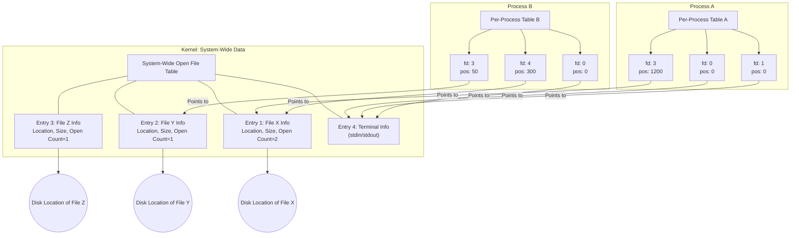

### Open-File Locking

File locking coordinates shared file access, ensuring data integrity by preventing concurrent modifications that could lead to corruption.

*   File locking mechanisms typically come in two **Types**: A **Shared Lock** permits multiple processes (readers) to acquire it simultaneously while blocking exclusive writers. Conversely, an **Exclusive Lock** allows only one process (a writer) to hold it, blocking all other readers and writers. For **Mechanisms** of enforcement: **Mandatory Locking** means the OS actively prevents conflicting access (e.g., Windows). In contrast, **Advisory Locking (Cooperative)** expects processes to voluntarily respect locks; the OS does not strictly enforce them (e.g., Unix/Linux).

---

## Access Methods

Operating systems provide various methods for accessing file information.

### 1. Sequential Access

Information is processed strictly in order. `read_next()` reads data and advances an internal file pointer; `write_next()` appends data and advances the pointer. The pointer can usually `reset` to the beginning. This method is common for applications like text editors, compilers, and log file processing.

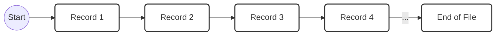

### 2. Direct Access (Relative Access)

This method allows arbitrary read/write access to any location within the file, aligning with the disk's random access capabilities. Files are viewed as numbered, fixed-length logical blocks. Operations like `read(n)` and `write(n)` specify a relative block number `n`, which the OS then translates to a physical address. A `seek(n)` operation can explicitly set the file pointer to a desired block. This method is commonly used by databases.

### Simulating Sequential Access on Direct Access Files

Sequential access can be emulated using direct access by tracking a "current position" (comprising a current block number `cp_block` and an offset `cp_offset` within that block) and updating it after each `read_next()` or `write_next()` operation.

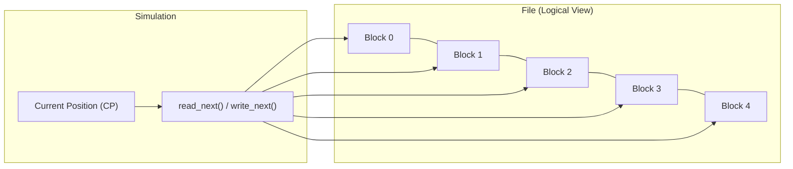

### 3. Other Access Methods (Indexed Access)

Built upon direct access, these methods employ an index (typically consisting of key-pointer pairs) to quickly locate specific records within large files. The index can reside in-memory (offering fast access) or on-disk (potentially requiring a multi-level structure for very large files). The Indexed Sequential Access Method (ISAM) serves as a classic example, which maintains sorted data along with primary and secondary indexes.

---

## Directory and Disk Structure

Files are stored on disks and are managed by directories (which act as symbol tables mapping names to file metadata and locations) as well as by specific disk allocation structures. Both components reside on secondary storage.

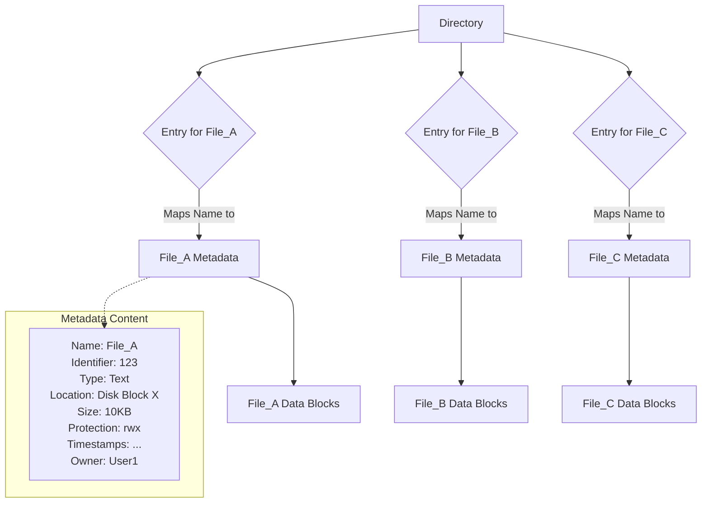

### Disk Structure Considerations

When considering disk structure, several key factors are involved:
*   **Partitions:** Physical disks can be logically divided into partitions (sometimes called minidisks or slices), which can be used for file systems or swap space.
*   **RAID:** Redundant Array of Independent Disks combines multiple disks or partitions to enhance performance or reliability.
*   **Raw vs. Formatted:** Partitions can be accessed directly as raw storage or can have a file system installed on them (formatted).
*   **Volume:** A volume is a logical entity containing a file system, typically corresponding to a partition.
*   **Volume Metadata:** Each volume possesses its own control structures, such as a device directory or Volume Table of Contents (VTOC), which are essential for managing its files and directories.
*   **Specialized File Systems:** Operating systems may also employ specialized file systems for specific functions, such as exposing kernel information (e.g., Linux's `/proc`, `/sys`).

### Typical File System Organization on Disk

A formatted volume generally follows this layout:

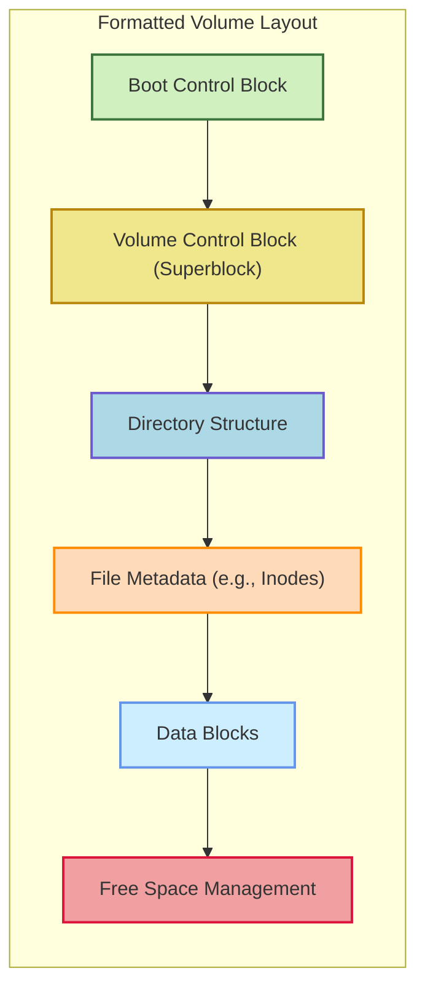

Specifically, a formatted volume typically includes the following components:
*   **Boot Control Block:** Contains information necessary for loading the OS if the volume is bootable.
*   **Volume Control Block (Superblock):** Stores file system-wide parameters, such as total blocks, block size, and counts/pointers for free blocks and inodes.
*   **Directory Structure:** Provides the hierarchical arrangement that links filenames to their corresponding metadata.
*   **File Metadata (e.g., Inodes):** These data structures hold file attributes and pointers to the actual data blocks.
*   **Data Blocks:** Store the actual file contents.
*   **Free Space Management:** Comprises structures that track unused blocks available for allocation.

### Directory Operations

OS system calls for directories include: Search, Create, Delete, List, Rename, and Traverse.

### Organizing Directories: Logical Structures

Effective directory organization aims for efficiency, convenience in naming (supporting unique names or multiple names for a single entity), and logical grouping of related files and subdirectories.

#### 1. Single-Level Directory

In a **Single-Level Directory** structure, all files reside in one central directory. While simple for single-user systems, this approach quickly suffers from naming collisions and manageability issues as the file count grows, leading to limited practical use.

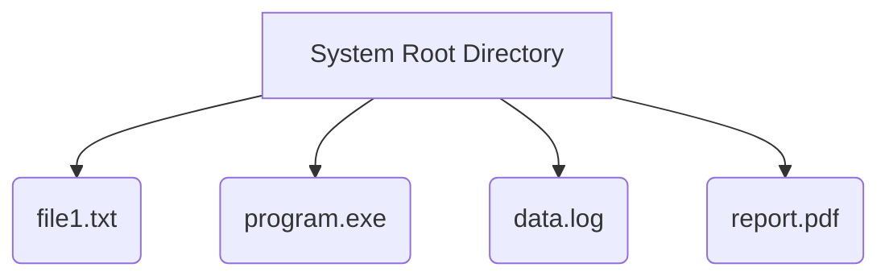

#### 2. Two-Level Directory

A **Two-Level Directory** structure assigns each user a dedicated User File Directory (UFD), which is mapped by a Master File Directory (MFD). This design allows different users to have same-named files without conflict and provides basic isolation between user files. However, it notably lacks intra-user grouping capabilities and makes inter-user file sharing cumbersome. This structure was common in early time-sharing systems.

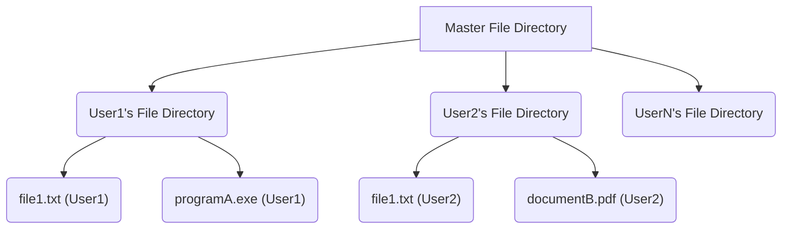

#### 3. Tree-Structured Directory

The **Tree-Structured Directory** represents a general hierarchical structure where directories can contain both files and other subdirectories, all originating from a single root. Every file or directory within this structure possesses a unique absolute path. Users typically operate within a current working directory (CWD), which permits the use of relative paths. This model is the dominant directory structure in modern operating systems, offering flexible, deep, and logical file organization. Nevertheless, sharing files or directories between unrelated branches of the tree can be cumbersome.

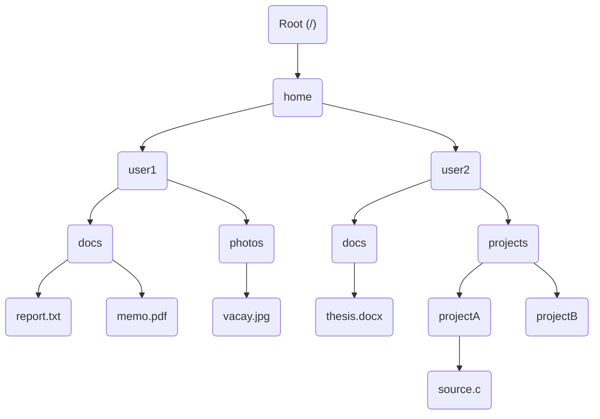

### Implementing Shared Files in Hierarchical Structures

Implementing shared files in hierarchical structures typically involves creating special directory entries called "links," which serve as pointers to existing files or subdirectories.

Specifically, **Hard Links** (common in Unix/Linux) are simply another directory entry pointing directly to the same underlying file metadata (inode). This means multiple names can refer to the exact same data, and the content and attributes persist as long as at least one link exists. Hard links are restricted to the same file system. In contrast, **Symbolic Links** (also known as Symlinks, Soft Links, or Shortcuts) are special files that contain the path to their target file or directory. They are more flexible, capable of crossing file systems, but come with the drawback of potentially becoming "dangling" if their target file or directory is moved or deleted.

### Acyclic Graph Directory Structure (DAG)

An **Acyclic Graph Directory Structure (DAG)** allows directories to share files or subdirectories through links, crucially preventing the formation of cycles. This structure offers more flexible sharing capabilities (e.g., for collaborative projects) compared to a strict tree, and is typically implemented using symbolic or hard links.

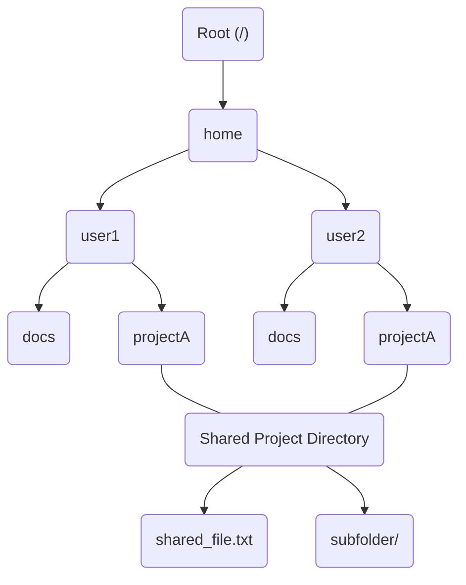

### General Graph Directory Structure (Potential for Cycles)

A **General Graph Directory Structure** allows unrestricted linking, especially to directories, which can inadvertently create cycles. Such cycles complicate file system traversal (e.g., leading to infinite loops during search or backup operations). Solutions to this problem include disallowing directory links (specifically for hard links), employing periodic garbage collection (to mark accessible nodes), or performing computationally expensive cycle detection at the time of link creation. Modern operating systems often manage symbolic link cycles by limiting traversal depth or by actively detecting loops.

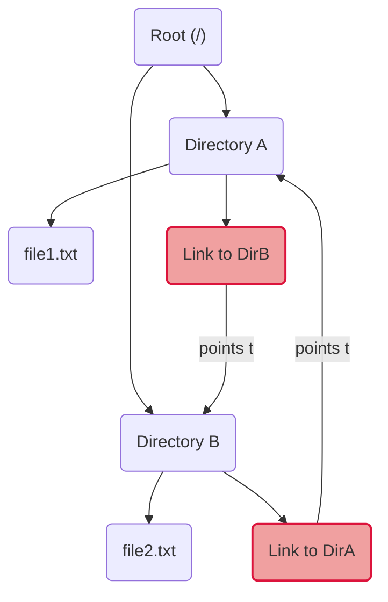

---

## Protection

Robust protection mechanisms are essential in multi-user systems. Their purpose is to precisely control who can access files and what operations they can perform, thereby ensuring both data privacy and integrity. This protection fundamentally relies on User ID (UID) and Group ID (GID); consequently, files are always associated with an owner and a group.

### Protection Mechanisms

Access control is typically managed for a range of operations, including: Read (to view contents or list a directory), Write (to modify contents, create, delete, or rename items within a directory), Execute (to run a program or traverse a directory), Append (to add data to the end of a file), Delete, List (to view names or attributes only), and Attribute Change (to modify metadata).

### Implementation of Protection

Two common user identity-based approaches are employed for file protection:
1.  **Access Control List (ACL):** With an ACL, each file or directory possesses an explicit list detailing users and groups along with their specific access rights. This offers fine-grained control but can be complex to manage and store efficiently.
2.  **Simplified Access Control (Owner/Group/Other - Unix Model):** This model categorizes users into three distinct groups: the Owner, the Group, and Other users (representing all other users on the system). It defines basic permissions (Read, Write, Execute) for each category, typically stored as a compact 9-bit mask within the file metadata. Many modern operating systems combine this simplified model with more extensive ACLs for greater flexibility.

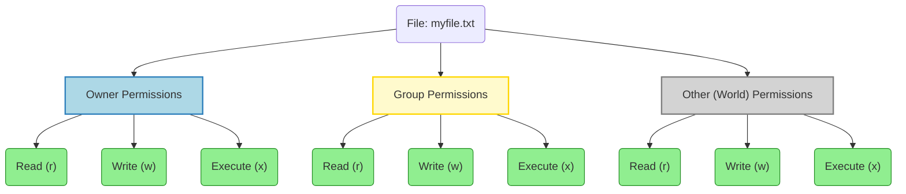

Illustrating a practical application, in the **Unix/Linux group permissions workflow**: An administrator first creates a group and assigns users to it. Subsequently, a file's group ownership is set to this newly created group. Permissions are then configured to grant appropriate access specifically to the `group` category, while simultaneously restricting `other` users. Members of the designated group can then access the file according to these defined permissions.