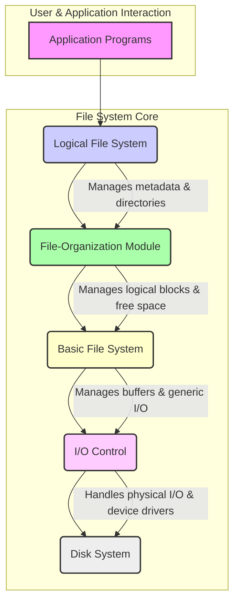
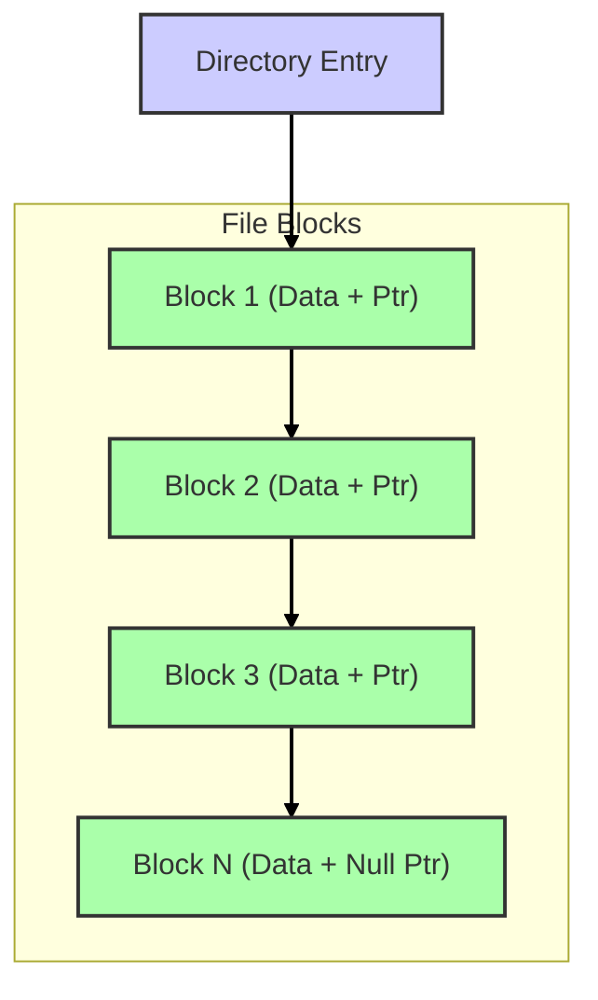
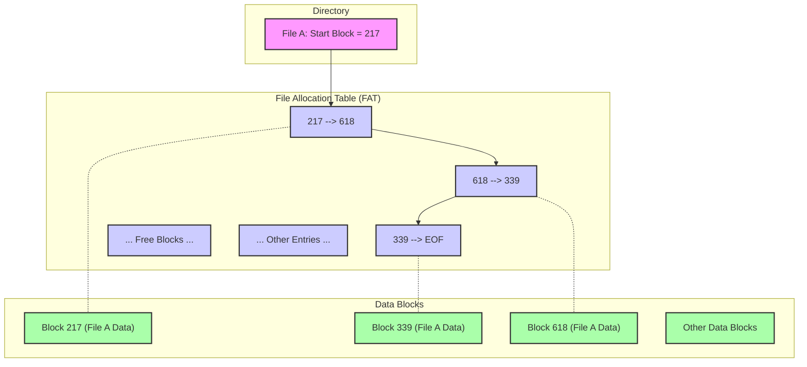
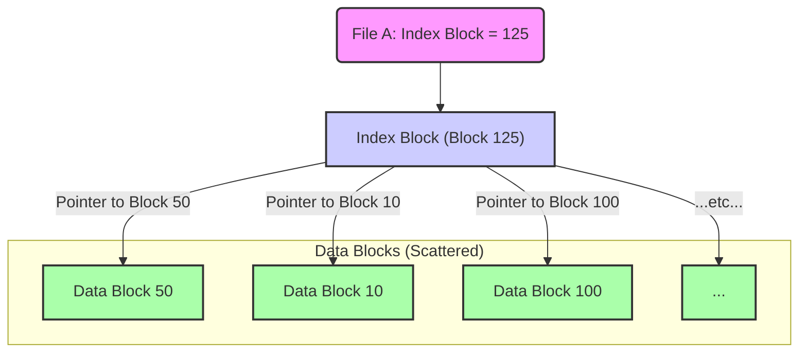
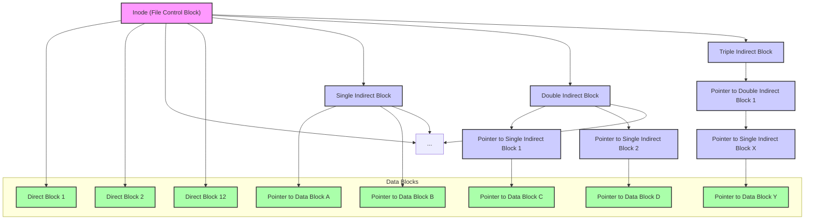

# File System Implementation

File systems are essential for storing and managing computer files, providing persistent storage and access mechanisms for both data and executable programs. They reside permanently on **secondary storage devices** like hard disk drives (HDDs) and solid-state drives (SSDs), which retain data without power. This chapter explores how files are stored and accessed on these devices, particularly focusing on HDDs and non-volatile memory (NVM) devices like SSDs.

## Objectives

This chapter aims to:

1.  Describe the structures of local file systems and directories.
2.  Analyze various disk block allocation algorithms, including methods for free space management, and their associated trade-offs.
3.  Investigate the operational efficiency and performance characteristics of file systems.
4.  Examine strategies for failure recovery, illustrating these concepts with the WAFL file system as an example.

## File System Structure

Disks serve as the primary secondary storage medium for file systems. They are characterized by **in-place rewriting** (the ability to modify and write data back to the same physical location) and **direct access** (allowing retrieval of any block without requiring sequential reads). File systems act as an intermediary layer, providing an efficient and user-friendly interface for storing, locating, and retrieving data.

The core design of a file system encompasses two key aspects:

*   **User Perspective (Logical View):** This involves defining how files appear (their definition, attributes, and available operations) and how they are organized (typically through a hierarchical directory structure).
*   **Implementation Details (Physical Mapping):** This involves developing the algorithms and data structures necessary to translate the logical view into physical locations on secondary storage.

### Layered File System

A file system is typically organized into distinct layers to manage complexity and enhance modularity.



*Figure: Diagram illustrating the layered architecture of a typical file system.*

The layered architecture of a typical file system can be broken down as follows, from the lowest level to the highest:

1.  **I/O Control:** This is the lowest level, comprising device drivers and interrupt handlers. It manages the physical transfer of block data between main memory and the disk.
2.  **Basic File System:** This layer sends generic read/write commands for physical blocks directly to device drivers and manages memory buffers and caches for temporary block storage.
3.  **File-Organization Module:** This module interprets files as logical blocks and includes the free-space manager, which tracks and provides available disk blocks.
4.  **Logical File System:** This layer manages file system metadata and directory structures, translating file names into their physical storage locations. It also maintains File Control Blocks (FCBs).
5.  **Application Programs:** As the highest level, user applications interact directly with the file system by performing operations such as opening, reading, and writing files.

Numerous file systems exist, each often employing unique formats (e.g., ISO 9660, UFS, FAT, NTFS, ext2/3). Furthermore, new systems like ZFS and GoogleFS are continuously developed, reflecting ongoing evolution in storage management.

#### Advantages and Disadvantages of a Layered File System

*   **Advantages**: This architecture leads to reduced code duplication (as lower layers can be shared across different file systems) and enhanced modularity (allowing specific file systems to implement unique logical and organization modules while sharing common lower layers).
*   **Disadvantages**: A potential overhead can arise from passing requests and data between multiple layers, impacting performance.

## File System Implementation

The **File Control Block (FCB)** is a critical data structure that stores all essential file details, including properties (like owner, size, and dates), access permissions, and the physical location(s) of the file data. It typically possesses a unique identifier (e.g., an *inode number*) that links it to a corresponding directory entry. In Windows NTFS, this information is integrated as part of the **Master File Table (MFT)**.

### In-Memory File System Structures

The creation of new files involves interactions between both in-memory and on-disk structures:

1.  An application requests file creation via a system call directed to the logical file system.
2.  The logical file system identifies the target directory and allocates a new, empty FCB.
3.  The system reads the relevant directory into memory and adds the new file entry (comprising the file name and its FCB reference) to this in-memory copy.
4.  Finally, the updated directory is written back to disk, ensuring persistence.

## Allocation Methods

An **allocation method** defines how disk blocks are assigned to files. The primary methods include:

1.  **Contiguous Allocation**
2.  **Linked Allocation**
3.  **Indexed Allocation**

*(Note: The disk block size may differ from the memory page size.)*

### Contiguous Allocation

In contiguous allocation, each file occupies a set of physically adjacent disk blocks.

#### Advantages

*   **High Performance:** Provides excellent performance for sequential reading due to minimal disk head movement.
*   **Simplicity:** Requires storing only a file's starting disk block address and its total length.

#### File Access

*   **Sequential Access:** Blocks are read consecutively from the last known address.
*   **Direct Access:** The *i*-th logical block of a file starting at physical block *b* is calculated as `b + i`.

#### Logical to Physical Mapping

A file's logical blocks map directly to consecutive physical blocks.

*Example: Contiguous Allocation Mapping*

```
Logical Blocks:  | L0 | L1 | L2 | L3 | L4 |
Physical Blocks: | Px | Px+1 | Px+2 | Px+3 | Px+4 |
```

Directory entries store the file name, its starting physical block address, and the total number of blocks. To find a byte at logical `offset` within a file, the calculation is: `Physical Block = (offset / block_size) + Starting Block Address`, with `(offset % block_size)` representing the displacement within that specific block.

#### Extent-Based Systems

While advantageous, contiguous allocation faces certain challenges:

*   **External Fragmentation:** Free space tends to fragment into small, unusable chunks, often necessitating time-consuming **disk compaction**.
*   **Difficult File Sizing:** Accurately predicting a file's exact size is challenging. Under-allocation can prevent the file from expanding contiguously, potentially requiring slow file relocation.

**Extents** mitigate these issues: an initial contiguous chunk of disk space is allocated. If the file subsequently grows, new contiguous chunks (extents) are allocated elsewhere on the disk. File locations are then recorded as a sequence of these extents, with each extent defined by a starting block address, a block count, and a pointer to the next extent.

### Linked Allocation

In linked allocation, each file is structured as a **linked list** of disk blocks, which can be scattered non-contiguously across the disk. Each block contains both data and a pointer (disk address) to the next block in the sequence; the last block in the chain is terminated by a null pointer.



*Figure: Linked Allocation, showing how a directory entry points to the first block, and subsequent blocks point to the next.*

#### Advantages

*   Eliminates external fragmentation, thus removing the need for disk compaction.

#### Disadvantages

*   **Reliability Concerns:** Corruption of a single pointer can lead to the loss of subsequent data in the file.
*   **Slow Random Access:** Retrieving a specific block requires sequential traversal of the linked list, which involves multiple I/O operations and is therefore slow. This method is best suited for sequential access patterns.

**Optimization**: **Clustering** groups multiple logical blocks into larger clusters, thereby reducing the number of pointers to manage and the total I/O operations required, though this can increase internal fragmentation.

#### Variant: File Allocation Table (FAT)

A notable variant of linked allocation is the **File Allocation Table (FAT)**, which utilizes a dedicated table positioned at the beginning of the volume to store all block pointers. The FAT contains an entry for every disk block or cluster. A file's directory entry stores only the number of its first block. Subsequent blocks are found by looking up entries in the FAT, which contain the next block number in the chain. An "end-of-file" marker terminates the chain, and unused blocks are also explicitly marked.



*Figure: File Allocation Table (FAT) structure. The directory entry points to the first block, and the FAT then provides the chain of subsequent blocks.*

### Indexed Allocation

Indexed allocation overcomes the limitations of contiguous allocation (namely fragmentation and inflexible sizing) and linked allocation (inefficient random access).

**How it Works:** All pointers to a file's data blocks are consolidated into a single **index block**, which is unique to each file. This index block functions as an array where the *i*-th entry points to the *i*-th logical data block. The file's directory entry, in turn, stores only the address of this index block. Consequently, to access the *i*-th logical block, the system first retrieves the index block and then uses its *i*-th pointer to directly access the desired data block.



*Figure: Indexed Allocation, showing a directory entry pointing to an index block, which in turn contains pointers to scattered data blocks.*

#### Index Block Sizing

Determining the optimal index block size for indexed allocation presents a significant challenge. Many file systems, such as UNIX File System (UFS), address this by employing a **combined scheme** that incorporates multi-level indexing to efficiently handle various file sizes:

##### Combined Scheme: UNIX UFS

The UFS index structure (known as an inode) contains various types of pointers:

*   **Direct Blocks:** A small number (e.g., 12) of pointers directly point to the file's first data blocks, ensuring fast access for small files.
*   **Indirect Blocks:** These are pointers to other blocks that, in turn, contain more pointers:
    *   **Single Indirect:** Points to a block that directly contains pointers to data blocks.
    *   **Double Indirect:** Points to a block that contains pointers to single indirect blocks.
    *   **Triple Indirect:** Points to a block that contains pointers to double indirect blocks.



*Figure: UNIX UFS Indexing Scheme (Inode Structure), showing direct, single, double, and triple indirect pointers.*

This multi-level structure efficiently handles files of vastly different sizes, allowing small files fast access while supporting very large files through layers of indirection (e.g., a triple indirect block can reference terabytes of data).

## Performance (Allocation Method Comparison)

The performance of an allocation method depends critically on both its **storage efficiency** (how much space is wasted) and the **time required to access data blocks**. Its suitability heavily relies on typical usage patterns, whether predominantly sequential or random access.

*   **Contiguous Allocation:** This method is best for sequential access. Once the first block is located, subsequent reads are rapid, requiring minimal disk head movement. Direct access is also efficient due to simple address calculation.
*   **Linked Allocation:** While good for sequential access (as the next block's address is often pre-read), it performs very poorly for direct or random access. This is because it necessitates sequential traversal of blocks, leading to numerous slow disk I/O operations.
*   **Indexed Allocation:** This method achieves efficient direct access. If the index block is cached in memory, only one additional disk access is needed per data block. However, if the index block is not cached, two disk accesses are required (one for the index block and another for the data block). Keeping all index blocks for open files in memory can demand a significant amount of RAM.

Some file systems concurrently support multiple allocation methods or dynamically combine them based on file characteristics (e.g., initially using contiguous allocation, then switching to indexed allocation for file growth).

It is crucial to understand that disk I/O operations are orders of magnitude slower than CPU operations; for instance, a CPU can execute millions of instructions during the time it takes for a single HDD I/O. This stark difference underscores the critical importance of efficient block allocation and minimizing disk I/O to achieve optimal overall system performance.

## Free Space Management

Space from deleted files must be made available for reuse. File systems maintain a **free-space list** of available disk blocks or clusters. Blocks are removed from this list when new files are created or existing files grow, and they are returned to the list upon file deletion.

### Free Space Management Methods

1.  **Bitmap (Bit Vector)**: This method uses a bit string where each bit represents a disk block (e.g., `1` for free, `0` for allocated). For example, `001111...` would indicate that blocks 2 through 5 are free. Finding the first free block involves scanning words for non-zeros, then individual bits within the word, and finally calculating the block number (`(bits_per_word * all_zero_words) + offset_of_first_1`).
    *   **Advantages**: Simple and efficient for finding the first free block or sequences of contiguous blocks.
    *   **Disadvantages**: Can be memory-inefficient if the entire bitmap cannot fit in RAM (e.g., a 1TB disk with 4KB blocks requires a 32MB bitmap), potentially leading to slow disk reads just to access the bitmap.

2.  **Linked Free-Space List**: In this approach, free blocks are chained together by pointers. A pointer to the very first free block is maintained in a known location (often cached in memory). Each free block then contains a pointer to the next free block in the chain.
    ```mermaid
    graph TD
        StartFree[Pointer to First Free Block] --> FreeBlock1["Free Block 1 (Contains Ptr)"];
        FreeBlock1 --> FreeBlock2["Free Block 2 (Contains Ptr)"];
        FreeBlock2 --> FreeBlock3["Free Block 3 (Contains Ptr)"];
        FreeBlock3 --> NullPtr["Null Pointer (End of List)"];

        subgraph Free Disk Blocks
            FreeBlock1
            FreeBlock2
            FreeBlock3
        end

        classDef freeBlock fill:#afa,stroke:#333,stroke-width:2px;
        class FreeBlock1,FreeBlock2,FreeBlock3 freeBlock;
        classDef ptrBlock fill:#f9f,stroke:#333,stroke-width:2px;
        class StartFree,NullPtr ptrBlock;
    ```
    *Figure: Linked Free-Space List, showing how free blocks are chained together using pointers stored within the blocks themselves.*
    *   **Disadvantage**: Traversing the entire list to find free blocks is highly inefficient on HDDs, as it requires numerous sequential reads and many slow I/O operations.

3.  **Grouping**: This method is a modification of the linked-list approach. The first free block in a group stores the addresses of the *next n-1* free blocks, with the *n*-th block then pointing to the next group of addresses.
    *   **Benefit**: This strategy allows for finding multiple free blocks with fewer initial disk reads.

4.  **Counting**: This method is particularly effective for contiguous allocations. The free-space list stores entries as pairs: (first free block address, count of consecutive free blocks).
    *   **Benefit**: It efficiently manages large contiguous free areas, significantly reducing the size and complexity of the free-space list.