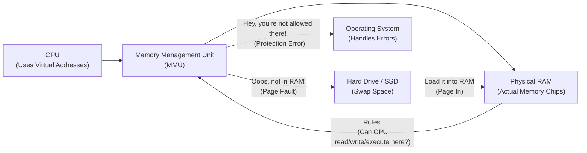
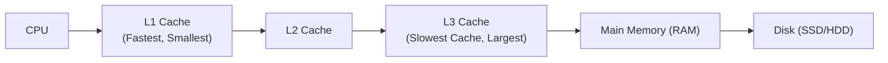
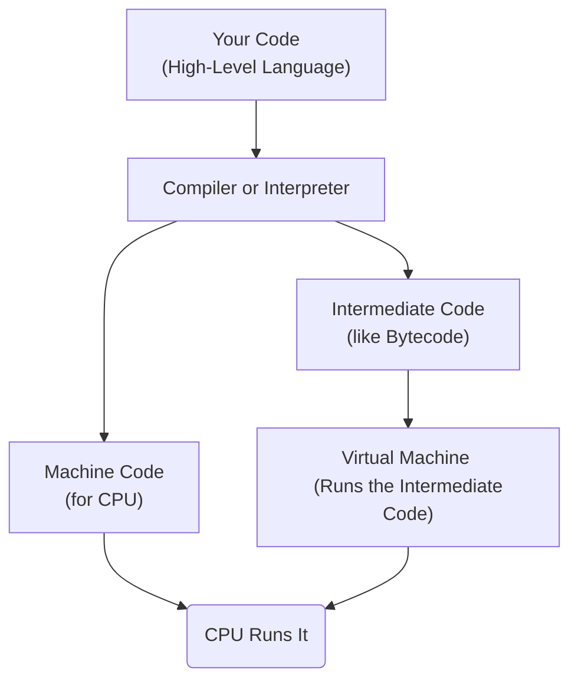

# How Programs Run: The Basics

Imagine a **program** is like a recipe written in a language the computer's chef (the **CPU** or processor) understands. This recipe contains steps (machine instructions), ingredients (data), and notes (configuration). It's all stored as binary numbers (0s and 1s).

Before the CPU can follow the recipe, it needs to be brought into the kitchen (the computer's fast, temporary workspace, the **main memory or RAM**).

*   In simple systems (like tiny embedded chips), the recipe is often put directly into a special kind of memory that keeps it even when the power is off (like Flash memory), staying there semi-permanently.
*   In larger computers (PCs, servers), a special program called the **OS loader** finds the recipe on long-term storage (like a hard drive or SSD) and copies it into the kitchen counter (RAM).

Once loaded into RAM, the CPU starts **running** the program. It's like the chef reading the recipe step-by-step:

1.  **Fetch:** Read the next instruction from the recipe in RAM.
2.  **Decode:** Figure out what the instruction means.
3.  **Execute:** Do what the instruction says (mix ingredients, turn up the heat, etc.).

Each instruction can have **side effects**: it might change values the CPU is holding (in its small, super-fast scratchpads called **registers**) or change values on the kitchen counter (RAM). It also tells the CPU which instruction to fetch *next*.

A crucial register is the **Program Counter (PC)**. Think of it as the chef's finger, pointing to the *next* step in the recipe to read. Other registers, like the **Stack Pointer (SP)**, help keep track of where temporary notes or ingredients are stored on the counter.

## The Program's View of Memory: The Address Space

While the program is running, it interacts with memory. But it doesn't directly use the physical addresses of the RAM chips. Instead, each running program gets its own **address space**.

Think of the address space as the program's *personal map* of the kitchen counter (memory). This map shows a huge range of possible locations where instructions and data *could* be stored.

*   Conceptually, it's just a list of numbered bytes (memory locations) from 0 up to a very large number (like $2^{64}-1$ for a 64-bit computer, although often less is actually used or even possible).
*   The CPU uses numbers from this map (called **virtual addresses**) when it wants to fetch an instruction or get data.

**Virtual vs. Physical Addresses:** The addresses the program uses (`virtual addresses`) are *not* the actual addresses in the physical RAM chips (`physical addresses`).

The translation between these two is handled by a special hardware unit called the **Memory Management Unit (MMU)**. Think of the MMU as a translator or a security guard stationed between the CPU and the physical RAM. When the CPU requests something at a virtual address, the MMU looks up that address on its list (called page tables) to figure out the corresponding physical address in RAM.

*Diagram: The MMU is like a translator. CPU speaks in virtual addresses, MMU translates to physical addresses in RAM. It also checks permissions and handles pages stored on disk.*

**Why use Virtual Memory and the MMU?**

1.  **Isolation:** Each program gets its own address space map. One program can't accidentally (or deliberately) mess with another program's memory because they are looking at their own private maps, which point to different physical locations.
2.  **Protection:** The OS tells the MMU which parts of the physical memory a program is allowed to *read*, *write*, or *execute*. If a program tries to do something it's not allowed to (like writing to a section that's supposed to be read-only), the MMU detects this, stops the CPU, and tells the OS, which usually shuts down the misbehaving program (this is often what causes a **Segmentation Fault** error).
3.  **Flexibility (Virtual Memory):** The MMU allows the OS to use storage on the hard drive (called **swap space**) as if it were extra RAM. If a program needs more memory than fits in physical RAM, the OS can temporarily move less-used parts of the program's memory from RAM to the hard drive ("paging/swapping out"). When the program needs that part again, the MMU signals the OS ("page fault"), and the OS brings it back into RAM ("paging/swapping in"). This allows programs to use more memory than the computer actually has physically, though accessing swapped memory is much slower.

## Memory Hierarchy: Getting Data Faster

Even RAM isn't fast enough for the CPU. To speed things up, computers use **cache memory**, which acts as a very fast, small buffer between the CPU and RAM.

*   **Purpose:** Store copies of the data and instructions the CPU is most likely to need soon.
*   **How it works:** The CPU first checks the cache.
    *   If the data/instruction is found (**Cache Hit**), it's retrieved extremely quickly.
    *   If it's not found (**Cache Miss**), the CPU has to wait while it's fetched from slower memory (like RAM) and a copy is placed in the cache for future use.
*   Caches work because programs tend to access data with **locality**:
    *   **Temporal Locality:** If a piece of data is used, it's likely to be used again soon.
    *   **Spatial Locality:** If a piece of data is used, nearby data is likely to be used soon.

Cache Levels (L1, L2, L3): There are usually multiple layers of cache, getting bigger and slower as they get further from the CPU core:
*   **L1 Cache:** Smallest, fastest, usually separate for instructions and data, dedicated to each CPU core.
*   **L2 Cache:** Larger, slower than L1, usually dedicated to each CPU core.
*   **L3 Cache:** Largest, slowest cache, often shared among multiple CPU cores.
*   Below L3 is **Main Memory (RAM)**, then potentially **Disk (SSD/HDD)**.

*Diagram: Data moves from slower, larger storage up to faster, smaller caches near the CPU.*

**Impact on Speed:** Caches make a huge difference. Getting data from L1 is almost instant for the CPU, but waiting for RAM takes hundreds of CPU cycles. If the CPU constantly misses the cache, the program runs much slower.

| Memory Location        | How Fast to Access (Relative Speed) | Notes                               |
| :--------------------- | :---------------------------------- | :---------------------------------- |
| Inside CPU Registers   | Immediate (1 unit of CPU time)      | Data CPU is actively working on     |
| Closest Cache (L1)     | A few units of CPU time             | Very fast buffer                    |
| Mid Cache (L2/L3)      | Tens of units of CPU time           | Slower, larger buffer               |
| Main Memory (RAM)      | Hundreds of units of CPU time       | Main workspace                      |
| Disk (SSD)             | Tens of thousands of units of CPU time | Long-term storage, slow for CPU     |
| Disk (HDD)             | Millions of units of CPU time       | Even slower long-term storage       |

*Table: Illustrates how much slower memory gets further from the CPU.*

## How High-Level Languages Fit In

Languages like Python, Java, or C++ are designed to be easier for humans than writing raw machine instructions. They provide **abstractions**, hiding the low-level details of the CPU and memory.

*   A **compiler** or **interpreter** translates your human-readable code into machine instructions or an intermediate form the computer can understand.
*   These languages also rely on a **runtime system** or **runtime library**. This is extra code that runs *with* your program. It provides support for features the language needs (like managing memory dynamically, handling errors, or interacting with the operating system in a standard way).

*Diagram: Your code is translated (compiled/interpreted) into something the CPU (directly or via a VM) can execute.*

**Runtime Libraries (The Support Crew):** This code helps your program interact with the real world and use complex features:
*   Managing memory that your program requests while it's running.
*   Talking to the operating system for things like opening files or sending data over a network.
*   Handling errors or exceptions defined by the language.
*   Setting up or cleaning up things when your program starts or ends.

## The C and C++ Execution Model

C and C++ often reflect the underlying hardware model more directly than some other languages.

*   **Assumption:** Programs act as if they have exclusive access to their entire address space.
*   **Reality:** The OS and MMU enforce limits and permissions. Accessing an address you don't own or don't have permission for causes a hardware signal that the OS catches, typically ending the program with an error like a **Segmentation Fault**.
*   **Default Flow:** Execution is usually a single sequence of instructions, one after another, controlled by loops, branches, and function calls.
*   **Concurrency:** Programs can create additional sequences of execution called **threads**. These threads share the same address space, making them efficient but adding complexity because they can interfere with each other when accessing shared memory.

### Execution Flow and Memory Structures

When your C or C++ program starts:
1.  Special **C Runtime startup code (crtstartup)** runs *before* your `main()` function. It sets up the environment: prepares the address space, initializes parts of memory, sets up crucial registers like the Stack Pointer (SP), initializes global variables, prepares for input/output, sets up the heap manager, and gets command-line arguments ready.
2.  `crtstartup` calls your `main()` function.
3.  Your `main()` function and any functions it calls execute.
4.  When your `main()` returns, `crtstartup` runs again for cleanup: flushes pending I/O, calls destructors for global C++ objects, and tells the OS the program is finished (with an exit code).

During execution, the runtime manages memory in two primary ways for variables:

1.  **The Stack:** A special area of memory used for managing **function calls**. Think of it like a stack of trays. When you call a function, a "tray" (a **stack frame**) is put on top. This tray holds:
    *   The address in the calling function to return to later.
    *   The values of arguments passed to the function.
    *   Memory space for the function's local variables.
    *   Space for temporary calculations.
    *   (In C++) Information for exception handling.
    When the function finishes, its tray (stack frame) is removed from the top. This **Last-In, First-Out (LIFO)** behavior is perfect for tracking nested function calls and supports **recursion**.
    *   **Limitations:** The stack has a fixed size (set by the OS or compiler). Calling too many functions nested deep (recursion) or having very large local variables can make the stack grow too big, causing a **Stack Overflow** error and terminating the program.
    *   **Efficiency:** Adding/removing items from the top of the stack (adjusting the Stack Pointer register) is very fast.
    *   **Lifetime:** Memory on the stack for a function's local variables only exists *while that function is running*. You cannot return a pointer to a local variable from a function, because the memory it pointed to will be instantly invalid (a **dangling pointer**).

2.  **The Heap (or Free Store):** An area of memory used for **dynamic memory allocation**. This is for data whose size you don't know until the program is running, or data that needs to live longer than a single function call. Think of it as a general storage area on the kitchen counter where you can request space and put things that might be needed by different parts of the recipe at different times.
    *   You explicitly ask the runtime for a block of memory of a specific size (`malloc` or `new`).
    *   The runtime finds a free spot on the heap, marks it as used, and gives you a **pointer** (an address) to where that block starts.
    *   You use this pointer to access the data in that memory block.
    *   **Crucially (in C/C++):** When you are finished with the memory you allocated on the heap, you are **solely responsible** for explicitly telling the runtime to free it up (`free` or `delete`).
    *   **Memory Leaks:** If you lose the pointer to an allocated block of heap memory before freeing it, you can no longer access or free that memory. It remains marked as used until the program ends, wasting memory resources. This is a **memory leak**.

### How the Address Space is Organized

A program's virtual address space is typically divided into several standard sections (segments), usually laid out from low memory addresses to high addresses:

*   **Code Segment (Text):** Contains the program's machine instructions. This area is typically marked as **read-only** and **executable**.
*   **Read-Only Data Segment (Constants):** Stores things like string literals ("Hello, world!") or global constants that the program should not change. This area is **read-only**.
*   **Data Segment (Global & Static Variables):**
    *   **Initialized Data:** Global or static variables that the programmer gave an initial value to (e.g., `int x = 10;`). Stored here with their initial values from the executable file. This area is **read-write**.
    *   **Uninitialized Data Segment (BSS - Block Started by Symbol):** Global or static variables that were *not* given an explicit initial value (e.g., `int y;`). This area contains placeholders; the OS guarantees that all variables in BSS will be initialized to **zero** before `main` runs. This area is also **read-write**.
*   **Heap Segment:** Where dynamic memory is allocated (`malloc`/`new`). This segment typically starts above the BSS segment and **grows upwards** in memory addresses as more memory is requested. It is **read-write** and shared among all threads in the process.
*   **Memory Mapped Region:** An area where files or shared libraries (like `.dll` or `.so` files the program uses) are mapped into the address space. Permissions vary.
*   **Stack Segment:** Where function call information and local variables are stored. This segment typically starts at a high memory address and **grows downwards** towards the heap. Each thread usually has its own stack. This area is **read-write**.

*Diagram: Typical layout of different memory segments in a program's address space.*

### Variable Lifetimes

Where a variable is stored determines how long it exists (its **lifetime**):

*   **Global and Static Variables:** Live for the entire duration of the program. They are created before `main` starts (initialized data gets its value, BSS is zeroed) and destroyed only when the program exits. They have a fixed location in the Data or BSS segments.
*   **Local (Automatic) Variables:** Live only while the function or code block they are defined in is executing. They are created when the function/block is entered (on the stack) and automatically destroyed when it exits (their stack frame is popped). Their initial value is typically garbage unless you explicitly initialize them.
*   **Dynamic (Heap-Allocated) Variables:** Live from the moment you explicitly allocate them on the heap (`malloc`/`new`) until the moment you explicitly deallocate them (`free`/`delete`). Their lifetime is controlled *manually* by the programmer using pointers, not by the program's structure or function calls (except for the risk of leaks if the pointer is lost).

### Memory Allocation Functions (C and C++)

These are the tools you use to manage memory on the **Heap**:

**In C (using `<stdlib.h>`):**

*   `void *malloc(size_t size)`: Request a block of memory of a specific `size` (in bytes). The memory is *not* cleared or initialized; it contains whatever was there before ("garbage"). Returns a pointer (`void*`) to the block, or `NULL` if it fails (no memory available).
*   `void *calloc(size_t num, size_t size)`: Request memory for an *array* of `num` items, each of `size` bytes. It allocates `num * size` bytes and **initializes all bytes to zero**. Returns a `void*` or `NULL`.
*   `void *realloc(void* ptr, size_t new_size)`: Change the size of a previously allocated block pointed to by `ptr` to `new_size`. It will copy the existing data to the new size. It might move the block to a completely new location in memory and free the old one. Returns the pointer to the *new* block (which could be the same as `ptr` or different), or `NULL` on failure (the original block is *not* freed on failure).
*   `void free(void* ptr)`: Release the memory block pointed to by `ptr` back to the heap manager so it can be reused. `ptr` must have been returned by `malloc`, `calloc`, or `realloc`, and must not have been freed already. Passing `NULL` is safe and does nothing. Passing an invalid pointer or freeing memory twice is **Undefined Behavior (UB)** and will likely crash or corrupt memory.

**In C++ (using `new` and `delete` operators):**

`new` and `delete` are more type-aware and interact with object constructors/destructors.

*   `new TypeName(args)`: Allocate memory on the heap large enough for one object of `TypeName`, then call `TypeName`'s **constructor** to initialize it (passing `args`). Returns a pointer of type `TypeName*`. By default, throws an exception (`std::bad_alloc`) if allocation fails.
*   `new (std::nothrow) TypeName(args)`: Allocate memory like `new`, but return `nullptr` on failure instead of throwing an exception.
*   `delete pointer`: Call the **destructor** for the object pointed to by `pointer`, then deallocate the memory (which must have been allocated by a matching `new`). Deleting `nullptr` is safe. Deleting an invalid pointer or deleting memory twice is **Undefined Behavior (UB)**.
*   `new ClassName[num]`: Allocate memory on the heap for an *array* of `num` objects of `ClassName`, and call the **default constructor** for each object in the array. Returns a pointer to the first object in the array.
*   `delete[] pointer`: Call the **destructor** for *each* object in the array pointed to by `pointer`, then deallocate the memory (which must have been allocated by a matching `new[]`). Deleting `nullptr` is safe. Deleting an invalid pointer or deleting memory twice is **Undefined Behavior (UB)**.

**Crucial Rule:** `new` must be paired with `delete`, and `new[]` must be paired with `delete[]`. Using the wrong deallocation function is **Undefined Behavior (UB)**.

### Memory Deallocation (Cleanup)

Properly freeing memory you've allocated is absolutely essential for writing correct and stable C/C++ programs.

*   **Matching Pairs:** You *must* use the correct function to free memory based on how it was allocated: `malloc` -> `free`, `calloc` -> `free`, `realloc` -> `free`, `new` -> `delete`, `new[]` -> `delete[]`.
*   **Memory Leaks:** Occur when you allocate memory on the heap but fail to free it before all pointers to it are gone (e.g., the pointer goes out of scope). The memory remains allocated and unavailable for reuse until the program ends, potentially exhausting system memory over time, especially in long-running programs.
*   **Double Free:** Occurs when you try to free the same block of memory more than once. This corrupts the heap manager's internal data structures, leading to unpredictable crashes, data corruption, or security vulnerabilities later in the program's execution.
*   **Wrong Deallocator:** Using `delete` on memory from `malloc`, or `free` on memory from `new`, or mismatching `new`/`delete` vs `new[]`/`delete[]` also corrupts the heap manager.

---

## Pointers: The Key to Dynamic Memory (and Danger)

Dynamic memory on the heap can *only* be accessed using **pointers**. Pointers are variables that store memory addresses. In C and C++, raw pointers are incredibly powerful because they give you direct control over memory, but they are also the source of many hard-to-find bugs and security vulnerabilities if misused.

*   **What they are:** Pointers store the number (address) of a memory location. You can get the address of a variable using the `&` operator (e.g., `int* p = &my_var;`). You access the value *at* the address stored in a pointer using the `*` operator (dereferencing) (e.g., `*p = 10;`).
*   **Using with Heap:** `malloc`/`new` give you pointers to the newly allocated heap memory. You *must* keep track of these pointers to use the memory and eventually free it.
*   **Invalid Pointers:** Pointers that don't point to valid, owned memory are dangerous. Common invalid pointers include:
    *   `0`, `NULL` (C), `nullptr` (C++11+): Explicitly null pointers. Dereferencing them usually causes a crash (**Segmentation Fault**).
    *   **Wild Pointers:** Pointers that haven't been initialized with a valid address (they contain arbitrary garbage values) or have been corrupted. Dereferencing them points to an unknown, potentially invalid or sensitive memory location, causing crashes or security issues.
    *   **Dangling Pointers:** Pointers that *used* to point to valid memory, but the memory has since been freed or is no longer valid (e.g., points to a local variable whose function has returned, or points to a heap block that was freed). Using a dangling pointer is **Undefined Behavior (UB)** – anything could happen, from a crash to silent data corruption.

**Why Raw Pointers are Tricky (Ambiguities):** When you just have a raw pointer variable, you don't automatically know:
*   Is it currently pointing to valid memory?
*   How big is the memory block it points to?
*   How long will the memory it points to remain valid?
*   Am I supposed to `free`/`delete` this memory, or is someone else? (This is **ownership**).
*   Can multiple pointers point to the same memory?
*   Is it okay if the memory it points to is optional (could the pointer be null)?

**Common Ways Pointers are Used (and Misused):**

*   **Pointing to Existing Variables:** Getting the address of a variable on the stack or in global/static memory (`int* p = &my_stack_var;`). Safe as long as the pointer is used *only* while the original variable is still alive. Cannot return a pointer to a local stack variable from a function.
*   **Heap Data Access:** Using the pointer returned by `malloc`/`new` to access dynamic memory. Requires careful management of the pointer's value and eventually deallocating the memory.
*   **Array Access:** In C, array names often behave like pointers to the first element. You can use pointer arithmetic to access elements (`*(array_ptr + i)` is same as `array[i]`). Dangerous because the pointer itself doesn't know the array's size, making out-of-bounds access easy and leading to **buffer overflows** (writing past the end of the allocated memory).
*   **Building Data Structures:** Using pointers to link pieces of data on the heap (like nodes in a linked list or tree). Managing the allocation and deallocation of all these interconnected pieces is complex and error-prone.

### Managing Pointers: The Problem of Ownership

The biggest challenge with manual memory management using raw pointers is clearly defining **ownership**. Who is responsible for calling `free` or `delete` on a particular block of heap memory?

*   When you call `malloc` or `new`, you (or the code that called it) become the initial **owner**. You have the responsibility to eventually free that memory.
*   If you copy a raw pointer (`int* p2 = p1;`), you now have two pointers pointing to the same memory. It's not clear from the language alone whether `p2` also shares ownership, transfers ownership, or is just a temporary "observer" that should *not* free the memory. If both `p1` and `p2` owners try to free the memory, you get a **double free**. If neither does, you get a **memory leak**.

**Solutions in C++:** C++ provides higher-level tools to help manage ownership and resource lifetimes, reducing the need for raw pointers in many cases:

*   **References:** Like constant pointers that cannot be null or rebound. Safer for non-owning access (passing arguments by reference).
*   **RAII (Resource Acquisition Is Initialization):** A key C++ pattern. It ties the lifetime of a resource (like heap memory, file handles, network connections) to the lifetime of an object. The resource is acquired in the object's **constructor** and automatically released in its **destructor** when the object goes out of scope.
*   **Smart Pointers:** Objects that wrap raw pointers and use RAII to automate memory management.
    *   `std::unique_ptr`: Guarantees exclusive ownership. When the `unique_ptr` goes out of scope or is reset, the pointed-to memory is automatically deleted. Cannot be copied, only moved (transferring ownership). Prevents double frees and memory leaks (as long as the `unique_ptr` itself isn't leaked).
    *   `std::shared_ptr`: Allows multiple smart pointers to share ownership of the same memory. Uses a reference count; the memory is deleted only when the last `shared_ptr` pointing to it is destroyed. Prevents leaks (if cycles are avoided) and double frees.
    *   `std::weak_ptr`: Works with `shared_ptr`. A non-owning observer pointer. Does not affect the reference count. Useful for breaking cycles to prevent leaks.
*   **Standard Library Containers:** Containers like `std::vector`, `std::string`, `std::map` use RAII internally to manage their memory. You just use the container, and it handles allocation/deallocation automatically when elements are added, removed, or the container itself goes out of scope.

Even with these tools, raw pointers still exist in C++, and misuse is possible, especially when interacting with older code or APIs.

**Programmer's Responsibility (with Raw Pointers):** When using raw pointers, you are responsible for ensuring:
*   **Spatial Safety:** Don't access memory before or after the allocated block (no buffer overflows).
*   **Temporal Safety:** Don't access memory after it's been freed or its lifetime has ended (no dangling pointers).
*   **Validity:** Don't dereference null, wild, or invalid pointers.
*   **Initialization:** Ensure pointers point somewhere valid before using them.
*   **Deallocation:** Free dynamically allocated memory exactly once using the correct function.

### Isn't Writing "Correct" C/C++ Code Enough?

In theory, yes, if every line of code by every programmer was perfectly correct and managed memory flawlessly, these issues wouldn't happen.

In practice, no:
*   **Collaboration:** Multiple people, teams, and libraries interact. Assumptions about ownership, validity, and lifetimes can be misunderstood or violated.
*   **Complexity:** Real-world programs are huge and complex. Manually tracking the lifetime and ownership of every piece of dynamically allocated memory becomes extremely difficult and prone to human error as the program grows.
*   **Real-World Impact:** Studies show that memory safety issues (like buffer overflows and use-after-free from dangling pointers) are a major source (often cited as ~70%) of serious software bugs and security vulnerabilities.

### Why Other High-Level Languages Are Different

Many other high-level languages (like Java, Python, C#, JavaScript, Go, Rust) handle memory management differently, often using **Automatic Memory Management**. The most common form is **Garbage Collection (GC)**.

*   **How GC Works:** The programmer still requests memory (often implicitly when creating objects). However, the programmer *never* explicitly frees the memory. Instead, the **Garbage Collector** (part of the language's runtime) automatically runs periodically. It scans memory, figures out which allocated blocks are *no longer reachable* by the running program (meaning there are no longer any active pointers pointing to them), and automatically reclaims (frees) that memory.
*   **GC Trade-offs:**
    *   **Pros:** Much simpler for the programmer (no manual free calls). Eliminates entire classes of bugs like memory leaks (of reachable memory), double frees, and dangling pointers (from freeing). Makes development faster and safer.
    *   **Cons:** The programmer loses control over exactly *when* memory is freed. GC activity requires CPU time, introducing performance overhead. GC can cause unpredictable pauses ("stop-the-world" pauses) as it reclaims memory, which can be an issue for real-time or performance-critical applications (though modern GCs minimize this). It can still suffer from "logical leaks" where memory is held onto because a reference exists, even if the program won't use that memory again. It doesn't handle other resources (file handles, network connections) automatically; those usually still need explicit cleanup (like `close()` or `dispose()` methods).

**Comparison:**

| Feature                  | Manual (C/C++)                                      | Automatic (GC Languages)                          |
| :----------------------- | :-------------------------------------------------- | :------------------------------------------------ |
| **Memory Deallocation**  | Explicit `free`/`delete` calls by programmer.       | Automatic by Garbage Collector.                     |
| **Timing of Deallocation** | Programmer decides, can be deterministic.           | GC decides, typically non-deterministic.          |
| **Other Resource Cleanup** | C++ RAII/Destructors handle this well. C requires manual calls. | Requires explicit methods (`close`, `dispose`).     |
| **Execution Pauses**     | No GC pauses (but `malloc`/`free` have overhead).   | Potential pauses during GC cycles.                  |
| **Memory Errors Avoided**| Few inherent errors avoided; programmer prone.        | Leaks (of unreachable memory), double frees, dangling pointers avoided. |
| **Programmer Burden**    | High: Manual tracking, prone to errors.             | Low: Memory deallocation is automated.            |
| **Performance Control**  | High degree of control.                             | Less control; GC activity adds overhead.            |

### Survival Techniques for Manual Management (C/C++)

Given the challenges, C/C++ programmers rely on tools and techniques to manage memory safety:

*   **Diagnostic Tools:** Using special tools during development (like Valgrind's Memcheck, AddressSanitizer (ASan), UndefinedBehaviorSanitizer (UBSan)) to detect memory errors (leaks, invalid accesses, double frees) at runtime.
*   **Abstraction Layers:** Encapsulating dangerous raw pointer management within safer, higher-level structures that use RAII or other techniques. This includes:
    *   C++ **Smart Pointers** (`unique_ptr`, `shared_ptr`, `weak_ptr`).
    *   C++ **Standard Library Containers** (`std::vector`, `std::string`, `std::map`, etc.).
    *   Writing custom classes using **RAII** for other resources.
*   **Memory-Safe Languages:** Using languages designed with memory safety guarantees, like **Rust**. Rust provides compile-time checks based on ownership and borrowing rules to prevent memory errors like data races and use-after-free, *without* needing a garbage collector, aiming for performance similar to C/C++.

In conclusion, understanding the execution architecture, the concept of virtual address space managed by the MMU, the memory hierarchy with caches, the roles of the stack and heap, variable lifetimes, and the mechanics and dangers of pointers is fundamental to writing correct, efficient, and safe code in languages like C and C++. It also provides valuable context for understanding how other languages abstract these concepts.