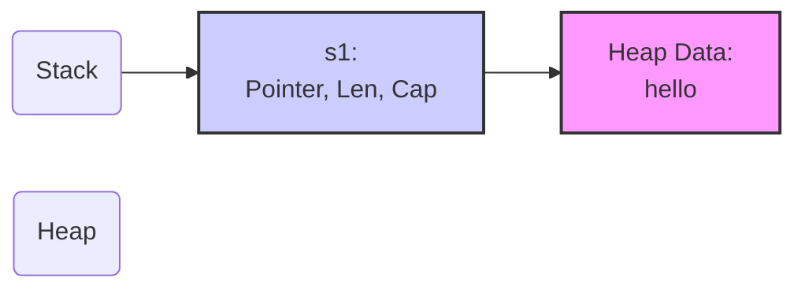
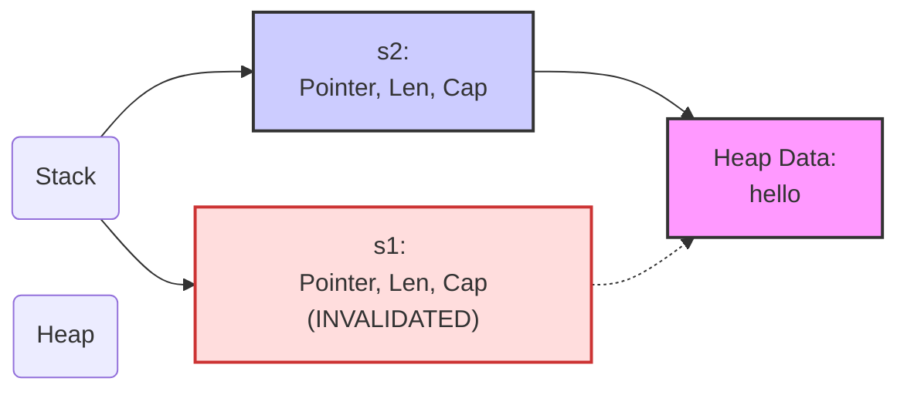
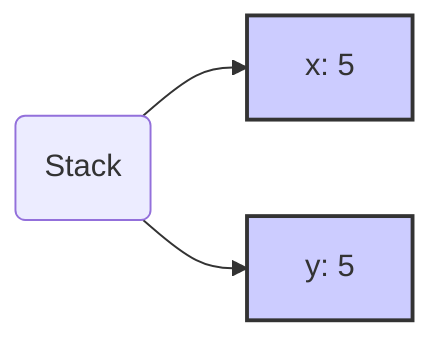
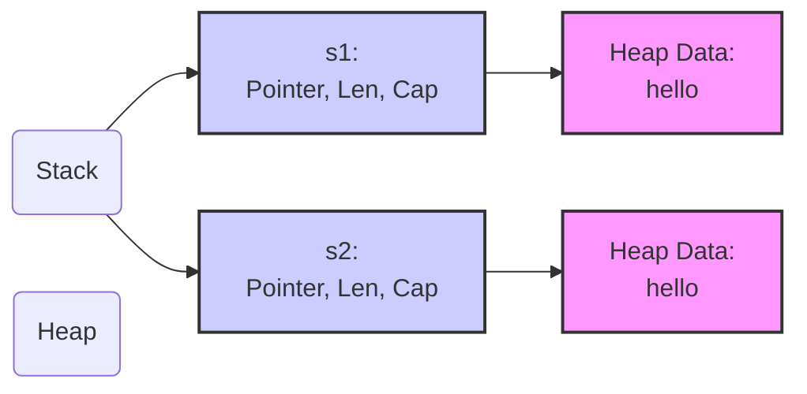
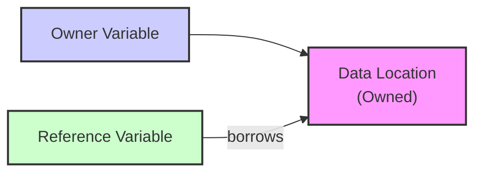
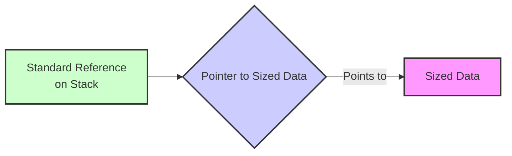
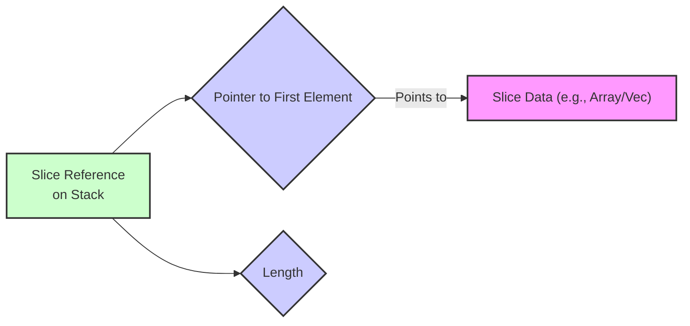
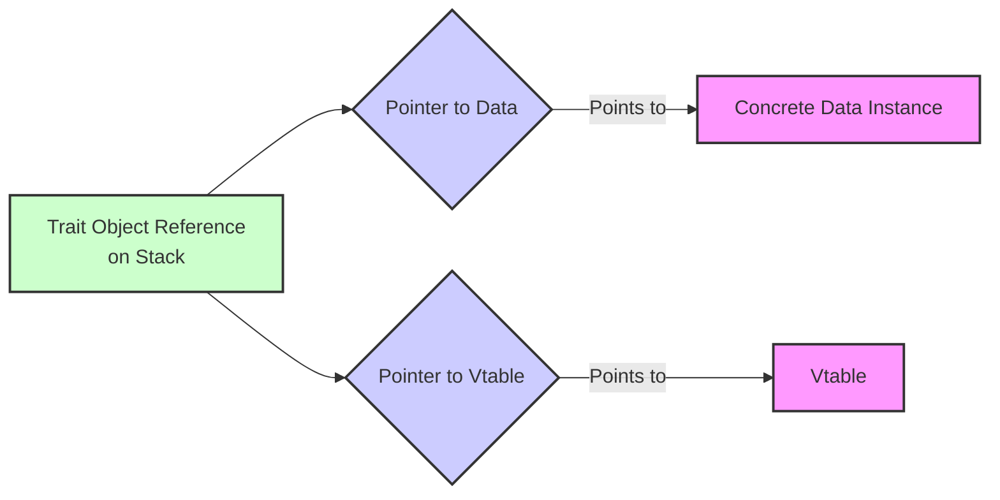
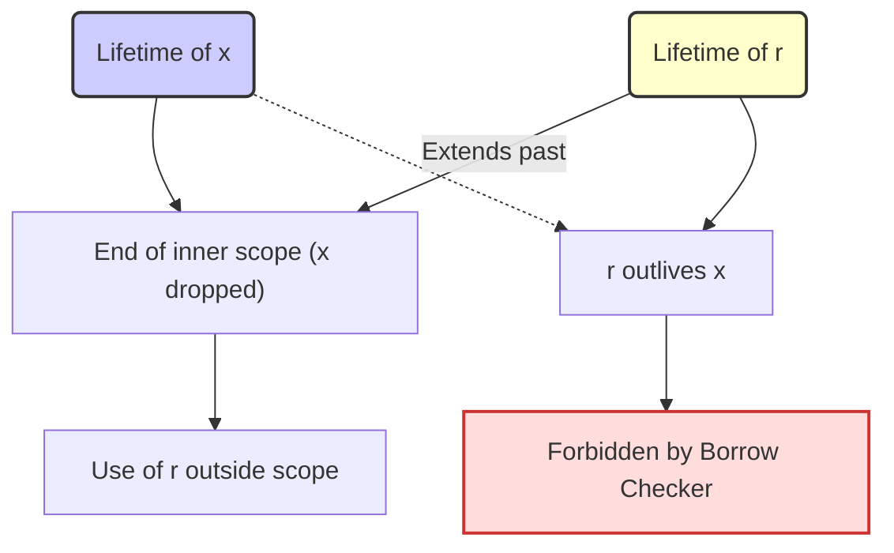

# Ownership and Borrowing in Rust: A Clear Explanation

Rust manages memory and resources without a garbage collector through its system of **ownership** and **borrowing**. This system provides memory safety guarantees at compile time, preventing common errors like double-free and use-after-free bugs.

## Understanding Single Ownership

Every value in Rust has a specific variable designated as its **owner**. This rule is checked by the **borrow checker** at compile time. The owner is solely responsible for **cleanup** (releasing resources and deallocating memory) when the value is no longer needed. This automatic cleanup, called **dropping**, happens when the owner variable goes out of scope or is assigned a new value. Custom cleanup logic can be defined using the `Drop` trait.

Ownership responsibility can be **transferred (moved)** to another variable.

## The Three Core Rules of Ownership

1.  Every value has one **owner**.
2.  There is only one **owner** at a time for any given value.
3.  When the **owner** goes out of scope, the value is automatically **dropped**.

### How Ownership Transfer (Move) Happens

Assigning one variable to another or passing a variable to a function by value performs an **ownership move**. The original variable's ownership is **transferred**, and it becomes **invalid** and unusable. Attempting to use it after a move results in a **compile-time error**.

```rust
let s1 = String::from("hello"); // s1 owns String
let s2 = s1; // Ownership MOVED from s1 to s2; s1 is invalid
// println!("{}", s1); // COMPILE ERROR! value borrowed here after move
```

A mutable variable can become valid again if a **completely new value** is assigned to it after its original value was moved.

```rust
let mut s1 = String::from("original"); // s1 owns "original"
let s2 = s1; // s1 moves ownership, becomes invalid
s1 = String::from("new value"); // s1 now owns "new value", is valid
println!("{}", s1); // OK
```

Under the hood, a **move** often involves a bitwise copy of the variable's **stack** data (like pointer, length, capacity for `String`), but the compiler invalidates the original variable's ownership.

### Ownership and Memory: The `String` Example (Heap Data)

Types like `String` store data on the **heap** and manage it via a **stack** variable holding pointer, length, and capacity. When a `String` is **moved**, the **stack** data (pointer, etc.) is copied, but the **heap** data is not. Ownership transfers, invalidating the source variable, ensuring only one variable is responsible for freeing the single **heap** allocation, preventing **double free** errors. **Dropping** the owner frees the **heap** memory.



**Move:**



**Move on Reassignment:** Assigning `s1 = s2` (where `s1` already owns something) first **drops** `s1`'s current value, then **moves ownership** from `s2` to `s1`, invalidating `s2`.

## Copying vs. Moving Explained

The default behavior for assignment and function calls is **move**. However, types implementing the `Copy` trait are **copied** bit-by-bit instead of moved upon assignment or passing by value. The original variable remains valid.

*   **`Copy` Types:** Entirely **stack**-based, no external resources. Includes **primitives** (`i32`, `bool`, `char`, etc.), tuples/arrays if elements are `Copy`, and immutable references (`&T`). Copying is cheap.
*   **`Move` Types:** Manage **heap** memory or resources (`String`, `Vec`, `Box`, mutable references `&mut T`). Copying their **stack** representation without transferring ownership would lead to resource errors (e.g., multiple variables pointing to the same **heap** data leading to **double free**).
*   **`Copy` and `Drop` are Mutually Exclusive:** A type cannot implement both. If a type needs custom cleanup (`Drop`), it cannot be implicitly copied.
*   **Compiler Implementation:** `Copy` is automatically implemented by the compiler for types meeting the criteria or can be derived if fields are `Copy`.

**Integer Example (`Copy`):**



**String Example (`Move`):** (See diagram above under "Ownership and Memory")

## Cloning: Making Explicit Deep Copies

For **`Move`** types needing a full duplicate, use the explicit **`Clone` trait** and `.clone()` method. This performs a **deep copy**, typically allocating new memory on the **heap** and copying the data. It's explicit because it can be an expensive operation. If a type implements `Copy`, it usually also implements `Clone` (where `.clone()` is equivalent to a bitwise copy).

**Example: Cloning a `String`:**



## References: Borrowing Without Taking Ownership

**References** (`&T` immutable, `&mut T` mutable) allow accessing data without taking ownership. This is called **borrowing**. Borrowing does not transfer ownership; the original owner is still responsible for dropping. References must not outlive the data they point to, enforced by the **borrow checker** via **lifetimes** at **compile time**. Rust often automatically dereferences references.

```rust
let s = String::from("text"); // s owns
let r = &s;                  // r borrows s (immutable reference)
let len = r.len();           // Automatic dereferencing
```



### Summary of References and Borrowing Rules

These rules are checked by the **borrow checker** at **compile time** and prevent **data races** and ensure guaranteed data validity:

1.  You can have **any number of immutable references** (`&T`) to a piece of data.
2.  OR you can have **only one mutable reference** (`&mut T`) to a piece of data.
3.  You cannot have both **mutable** and **immutable** references to the same data simultaneously within the same scope.
4.  While a value is **immutably borrowed**, it **cannot be mutated** via the owner or any reference.
5.  While a **mutable reference** exists, **no other references** (**mutable** or **immutable**) to that data are allowed.
6.  An owning value cannot be **moved** or **dropped** while actively **borrowed**.

```rust
let mut v = vec![1, 2];
let r1 = &v; // OK (immutable)
let r2 = &v; // OK (immutable)
// let r_mut = &mut v; // ERROR! Can't mut borrow while immutable borrows exist

println!("{:?} {:?}", r1, r2); // r1, r2 last used here, their borrows end

let r_mut = &mut v; // OK now because previous immutable borrows are no longer active
r_mut.push(3); // OK (exclusive mutable access)
// let r3 = &v; // ERROR! Can't immutably borrow while mutable borrow exists
```

### Mutable References (`&mut T`) in More Detail

**Mutable references** are created from `let mut` variables using `&mut`. Their key feature is **exclusivity**: only one `&mut` to a piece of data is allowed at a time, preventing **data races** by ensuring sole control during modification.

```rust
let mut value = 10;
let r_mut = &mut value;
*r_mut = 20; // Modify via mutable reference (dereference using *)
println!("The value is now: {}", value);
```

### Memory Layout of Different Reference Types

*   **Standard References (`&T`, `&mut T`):** For `Sized` types (size fixed at **compile time**, e.g., `i32`, `[i32; 5]`), a reference is a single **pointer** to the data location.



*   **Fat Pointers (`&[T]`, `&mut [T]`, `&dyn Trait`):** For **Dynamically Sized Types (DSTs)**, references are **fat pointers** (two `usize` values):
    *   **Slices:** Pointer to the first element + **length**.
    *   **Trait Objects:** Pointer to the data + pointer to the **vtable** (lookup table for trait method implementations).





### Reference Lifetimes

**Lifetimes** are a **compile-time** concept used by the **borrow checker** to ensure references are always **valid** and prevent **dangling pointers**. They track the duration for which a reference is valid, which must be less than or equal to the duration of the data it points to. The compiler usually infers lifetimes (**elision**). Explicit lifetime annotations (`'a`) are needed when inference is ambiguous (e.g., complex function signatures or struct definitions containing references). The `'static` lifetime indicates validity for the program's entire execution.

**Example of prevented dangling pointer:**

```rust
// This would cause a compile error because 'r' attempts to outlive 'x'
// fn main() {
//     let r;
//     {
//         let x = 5; // x is valid within this inner scope
//         r = &x;    // r borrows x
//     } // x is dropped here, r now points to invalid memory!
//     println!("r: {}", r); // Use of r after x is dropped -> Dangling pointer
// }
```



Lifetimes also apply to references to parts of structures, ensuring a reference to an element cannot outlive the containing structure.

### The `assert_eq!()` Macro

`assert_eq!()` is a **testing macro** that checks if two values are equal using the `==` operator. It **panics** if they are not equal, printing an informative message including the values.

```rust
let a = 10;
let b = 10;
assert_eq!(a, b); // OK
// assert_eq!(1, 2); // Panics! Output includes: `left: 1`, `right: 2`
```

## Slices: Views into Contiguous Data

A **slice** (`[T]`, typically accessed as `&[T]` or `&mut [T]`) provides a **borrowed view** into a contiguous sequence of elements within another data structure (like an array or `Vec`). Its length is known at **runtime**, not compile time. Slice references are **fat pointers** (pointer + length). Slices do not own the data they view. Common sources: arrays, `Vec`, `String`/`&str` (string slices), `Box<[T]>`.

```rust
let array = [1, 2, 3, 4, 5];
let s: &[i32] = &array[1..3]; // Slice viewing [2, 3]
println!("Slice: {:?}", s);
println!("Original: {:?}", array); // Original is still valid
```

You can convert between owned `Vec<T>` and owned `Box<[T]>` using `.into_boxed_slice()` and `.into_vec()`, which transfer ownership. You can borrow slices (`&[T]`, `&mut [T]`) from `Vec<T>` or `Box<[T]>` using indexing and `&` or `&mut`.

## Key Advantages of Rust's Ownership and Borrowing System

*   **Eliminates Null Pointer Errors:** Rust uses `Option<T>` for values that may be absent, requiring explicit handling instead of implicit nulls.
*   **Memory Safety Guaranteed by Borrow Checker:** Prevents entire classes of bugs like **segfaults**, **dangling pointers**, **buffer overflows**, and iterator invalidation *at compile time*, before your code even runs.
*   **Immutability as Default:** Encourages safer code by requiring explicit `mut` when mutation is intended.
*   **Consistent Resource Management:** The `Drop` trait provides a unified mechanism for reliable release of *all* resource types (memory, files, network sockets, locks, etc.) when the owner goes out of scope (**RAII** - **Resource Acquisition Is Initialization**).
*   **Deterministic Performance:** No runtime garbage collection overhead leads to predictable and often lower latency performance, crucial for systems programming.

This system is the cornerstone of Rust's promise of memory safety without a garbage collector. While it has a learning curve, mastering **ownership** and **borrowing** is key to writing robust and performant Rust code.