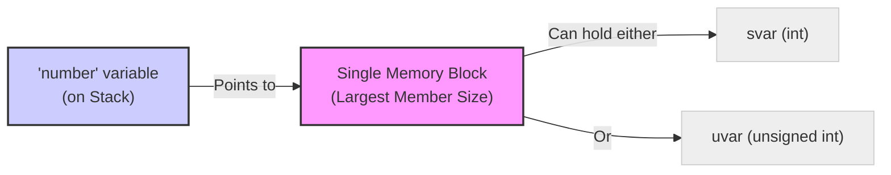
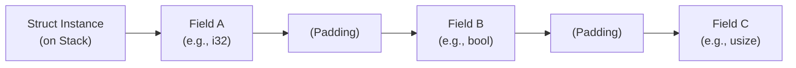
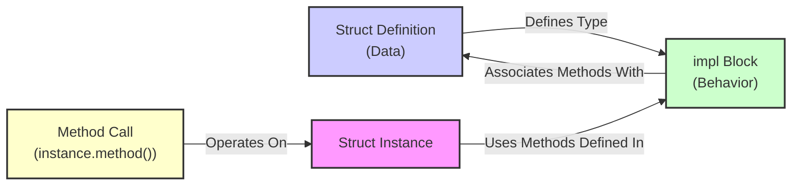
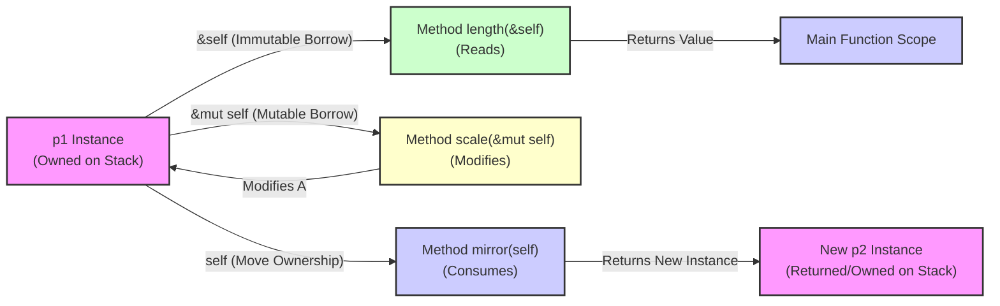
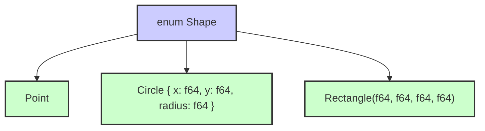
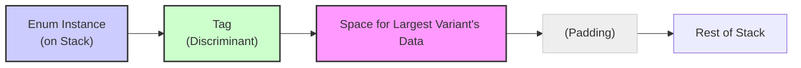
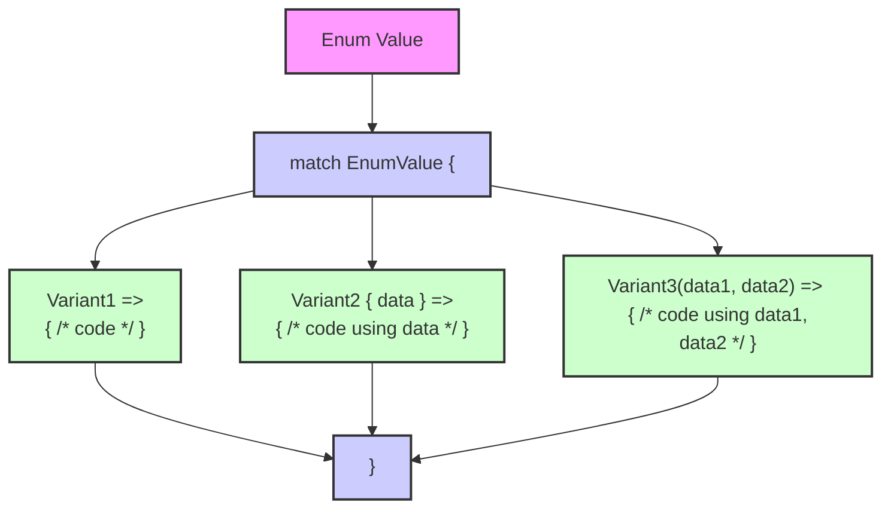

# Composite Data Types in Rust

Rust's approach to grouping data is fundamental to its type system. Understanding it is often clearer by contrasting it with composite types in C/C++.

*   **C/C++ `struct`:** A contiguous block of memory combining heterogeneous fields. Fields are public by default in C and typically public by default in C++. C++ `struct`s can also have methods and inheritance.
*   **C++ `class`:** Similar to `struct`, grouping data and methods, but fields/methods are private by default. Access is controlled by `private`, `protected`, `public` keywords in both C++ `struct`s and `class`es.
*   **C/C++ `enum`:** Defines a set of named integer constants, defaulting from 0. C++11+ allows specifying underlying integer types. They are less type-safe than Rust enums as arbitrary integers can often be assigned or cast.
*   **C/C++ `union`:** Defines a single memory block shared by different types. The size of the union is the size of its largest member. **The programmer must track the active type** in the union; accessing the memory as the wrong type is undefined behavior and unsafe.

### C/C++ Composite Type Examples

**Union Example (C/C++):**

```c
union Sign {
  int svar;
  unsigned int uvar;
};
union Sign number; // 'number' occupies size of largest member (int or unsigned int)
```

<p align="center">



</p>

**Enum Example (C/C++):**

```c
enum DAY {
  sunday = 0, monday, tuesday, wednesday, thursday, friday, saturday
}; // semicolon required
enum DAY workday; // 'workday' is essentially an integer variable, often not strictly type-checked against the enum values by the compiler
```

## Structs in Rust Explained

Rust `struct`s (short for *structure*) bundle related, potentially heterogeneous data fields under a single named type. They provide semantic meaning to grouped data beyond what simple tuples offer. Fields are accessed using dot notation (`.`).

```rust
struct Player {
  name: String,
  health: i32,
  level: u8,
}
```

### Conventions and How to Use Structs

Struct names use `CamelCase`, and field names use `snake_case`. You access or modify fields using the dot notation (`.`). You instantiate a struct using curly braces `{}` with `field: value` pairs. Variables holding struct instances are immutable by default; use `let mut` to be able to modify their fields.

Rust offers convenient syntax for initialization:

*   **Field Init Shorthand:** If local variable names match field names, you can just list the variable names: `{ name, health, level }`.
*   **Struct Update Syntax:** To create a new struct instance based on an existing one, only specifying some fields, use `..old_instance`. This copies the values of the remaining fields from `old_instance`. Be aware that this performs a **move** for non-`Copy` fields from `old_instance`, potentially making `old_instance` invalid.

```rust
struct Player { name: String, health: i32, level: u8 }
fn main() {
    let mut player1 = Player { name: String::from("Mario"), health: 25, level: 1 };
    println!("Player {} health {}", player1.name, player1.health);

    player1.level += 1; // Modify mutable field
    println!("Player {} level {}", player1.name, player1.level);

    // Field init shorthand example
    let name = String::from("Luigi");
    let health = 30;
    let level = 2;
    let player2 = Player { name, health, level }; // Equivalent to { name: name, health: health, level: level }

    // Struct update syntax example
    let player3 = Player {
        level: player2.level + 1, // Override level
        ..player2 // Copy/move remaining fields from player2
    };
    println!("Player 3 level: {}", player3.level);
    // println!("Player 2 name: {}", player2.name); // COMPILE ERROR! name (String, non-Copy) was moved from player2
}
```

### Special Kinds of Structs

*   **Tuple Structs:** Named types with unnamed fields accessed by index (`.0`, `.1`, etc.). They are instantiated like functions. Useful for giving semantic meaning to tuples.

    ```rust
    struct Color(u8, u8, u8);
    struct Point(i32, i32, i32);

    let red = Color(255, 0, 0);
    let origin = Point(0, 0, 0);
    println!("Red: RGB({}, {}, {})", red.0, red.1, red.2);
    ```
*   **Unit Structs:** Named types with no fields (`struct Empty;`). They occupy zero bytes in memory and are typically used for creating semantic types or implementing traits where no state is needed.

    ```rust
    struct JustATag; // Used for types where identity/purpose is more important than data
    let tag = JustATag;
    ```

### Memory Representation of Structs

Struct fields are conceptually laid out contiguously in memory on the stack (or heap if the struct is inside a `Box`, `Vec`, etc.). However, the compiler might reorder fields and add **padding** (bytes of unused space) between fields to satisfy alignment requirements of the CPU, optimizing access. This default behavior is governed by `#[repr(Rust)]`. You can force a C-compatible layout using `#[repr(C)]` for interoperability with C libraries.

Fields of types like `String` or `Vec` themselves live on the stack (pointer, length, capacity), while the data they manage resides on the heap.

```
Memory for 'player1' instance on the Stack (conceptual):
+-----------------+-----------------+-----------------+----------+----------+----------+
| name (Pointer)  | name (Length)   | name (Capacity) | health   | level    | (Padding)|
| (usize bytes)   | (usize bytes)   | (usize bytes)   | (4 bytes)| (1 byte) | (? bytes)|
+-----------------+-----------------+-----------------+----------+----------+----------+
          ^
          | points to...
          |
          +--------------------------------+
                                           |
Heap memory (pointed to by name field):    ['M', 'a', 'r', 'i', 'o']
```

The compiler determines padding based on field sizes and alignment requirements:

<p align="center">


</p>
You can use `std::mem::size_of::<MyStruct>()` and `std::mem::align_of::<MyStruct>()` to inspect the memory layout properties.

### Visibility and Modules (Controlling Access)

Rust uses modules (`mod`) to organize code and control visibility (encapsulation), similar to namespaces or packages in other languages. By default, items (structs, fields, functions, enums, etc.) are **private** within their module. The `pub` keyword makes an item visible outside its module.

Granular control is possible: you can make a struct `pub` but keep some or all of its fields private. This achieves encapsulation, forcing users of the struct to interact with its data through public functions or methods, rather than directly accessing fields.

```rust
mod game_logic {
    // This struct is public, but its fields are private
    pub struct PlayerStats {
        pub health: i32, // Make health public for direct access
        mana: i32,       // mana is private
        level: u8,       // level is private
    }

    impl PlayerStats {
        // Public associated function (like a constructor)
        pub fn new(h: i32, m: i32, l: u8) -> Self {
            PlayerStats { health: h, mana: m, level: l }
        }

        // Public method to access mana (controlled access)
        pub fn get_mana(&self) -> i32 {
            self.mana
        }

        // Public method to modify mana (controlled mutation)
        pub fn spend_mana(&mut self, amount: i32) -> bool {
            if self.mana >= amount {
                self.mana -= amount;
                true
            } else {
                false
            }
        }
        // level remains internal to the module/impl
    }
}

// Bring PlayerStats and its associated functions/methods into scope
use game_logic::PlayerStats;

fn main() {
    // Cannot initialize directly because fields are private (except health)
    // let mut stats = PlayerStats { health: 100, mana: 50, level: 1 }; // ERROR: fields `mana`, `level` are private

    // Use the public constructor-like function
    let mut stats = PlayerStats::new(100, 50, 1); // OK

    println!("Health: {}", stats.health); // OK: health is public

    // println!("Mana: {}", stats.mana); // ERROR: field `mana` is private
    println!("Mana (via method): {}", stats.get_mana()); // OK: use public method

    if stats.spend_mana(20) { // OK: use public mutable method
        println!("Spent 20 mana. Remaining mana: {}", stats.get_mana());
    }

    // println!("Level: {}", stats.level); // ERROR: field `level` is private
    // stats.level += 1; // ERROR: field `level` is private
}
```
This structure demonstrates how `pub` on the struct type combined with private fields and public methods achieves encapsulation.

## Methods in Rust

Behavior (functions) is associated with structs (or enums/traits) using `impl` blocks. Functions defined within an `impl` block are called **methods** if their first parameter is a reference to an instance of the type (`self`, `&self`, or `&mut self`). Methods are called using the dot notation (`instance.method()`). Rust favors composition and traits over classical inheritance for code reuse.

<p align="center">



</p>

### The `self` Parameter and Different Method Types

The first parameter of a method determines how the method interacts with the instance it's called on:

*   **`self` (by value):** The method takes *ownership* of the instance. The instance is moved into the method and dropped (cleaned up) when the method finishes, making the original variable invalid after the call. This is less common for typical methods.
*   **`&self` (immutable borrow):** The method takes an *immutable reference* to the instance. It can read the instance's data but cannot modify it. The original instance remains valid and can be used after the method call. This is the most common type of method.
*   **`&mut self` (mutable borrow):** The method takes a *mutable reference* to the instance. It can read and *modify* the instance's data. The original instance remains valid after the call, reflecting any changes made by the method. Requires `let mut` for the instance variable.

Note that `Self` (capital S) within an `impl` block refers to the type itself (e.g., `Point` in `impl Point { ... }`).

```rust
#[derive(Debug)] // Allows printing struct instances with {:?}
struct Point { x: i32, y: i32 }

impl Point {
    // Associated function (not a method, no self parameter) - often used as constructor
    pub fn new(x: i32, y: i32) -> Self {
        Self { x, y }
    }

    // Method that takes ownership (self)
    // Consumes the original Point and returns a new one
    fn mirror(self) -> Self {
        Self { x: self.y, y: self.x }
    }

    // Method that borrows immutably (&self)
    // Calculates length without changing the Point
    fn length(&self) -> f64 {
        ((self.x * self.x + self.y * self.y) as f64).sqrt()
    }

    // Method that borrows mutably (&mut self)
    // Modifies the Point in place
    fn scale(&mut self, scalar: i32) {
        self.x *= scalar;
        self.y *= scalar;
    }
}

fn main() {
    let mut p1 = Point::new(3, 4); // Use associated function
    println!("{:?}", p1);

    println!("Length: {}", p1.length()); // p1 borrowed immutably, still valid
    p1.scale(2); // p1 borrowed mutably, modified
    println!("Scaled: {:?}", p1);

    let p2 = p1.mirror(); // p1 moved into the mirror method
    println!("Mirrored: {:?}", p2);

    // println!("Original after mirror: {:?}", p1); // COMPILE ERROR! value used here after move
}
```

The different `self` types control the ownership/borrowing of the instance during the method call:

<p align="center">



</p>

### Constructor Convention in Rust

Rust does not have a dedicated keyword for constructors. The standard practice is to use **associated functions** within the `impl` block that do *not* take `self` as a parameter. These functions belong to the type itself, not a specific instance.

The conventional name for a basic constructor is `new`. For alternative ways to create instances, names like `from_...`, `with_...`, etc., are used. Associated functions are called using the double-colon syntax (`TypeName::function_name()`).

```rust
#[derive(Debug)]
pub struct Test { a: i32, b: bool }

impl Test {
    // Associated function: standard constructor
    pub fn new() -> Test {
        Test { a: 0, b: false }
    }

    // Associated function: constructor with initial values
    pub fn with_initial_values(i: i32, boo: bool) -> Test {
        Test { a: i, b: boo }
    }

    // Instance method: operates on a specific instance
    pub fn evaluate(&self) -> bool {
        !self.b && self.a != 0
    }
}

fn main() {
    let mut t = Test::new(); // Call associated function (constructor)
    println!("{:?}, evaluated: {}", t, t.evaluate());

    t = Test::with_initial_values(100, true); // Call another associated function
    println!("{:?}, evaluated: {}", t, t.evaluate());
}
```

### Destructors and The `Drop` Trait

Rust utilizes the **RAII (Resource Acquisition Is Initialization)** pattern. Resources (memory, file handles, network sockets, database connections, etc.) are acquired when a variable is initialized and guaranteed to be automatically released when the variable's owner goes out of scope (i.e., when the value is **dropped**).

For types that require custom cleanup logic beyond simple memory deallocation, you implement the `Drop` trait. This trait requires defining a single method, `fn drop(&mut self)`, which contains the cleanup code. This method is automatically called by Rust when the value is about to go out of scope.

A type that implements `Drop` cannot also implement `Copy`. This prevents potential "double-free" or resource conflicts if the value were implicitly copied.

You can explicitly force a value to be dropped earlier than the end of its scope using the `std::mem::drop(value)` function. This is distinct from the `Drop` trait method, which is called *by* the runtime.

```rust
use std::fs::File;
use std::io::Write; // Need Write trait for file operations

pub struct FileWrapper {
    pub file_handle: Option<File>, // Use Option because create might fail
    pub name: String,
}

impl Drop for FileWrapper {
    // The drop method is automatically called when a FileWrapper goes out of scope
    fn drop(&mut self) {
        println!("Dropping FileWrapper for '{}'!", self.name);
        // File handle will be automatically closed when self.file_handle (a File)
        // is dropped, as File also implements Drop. We could add custom logic here,
        // like writing a footer to the file before it's closed.
        if let Some(ref mut file) = self.file_handle {
             let _ = file.write_all(b"Cleanup finished.\n");
        }
         println!("...cleanup for '{}' complete.", self.name);
    }
}

fn main() {
    println!("Program start.");
    { // Start of an inner scope
        println!("Creating fw inside inner scope...");
        let fw = FileWrapper {
            file_handle: File::create("temp_file.txt").ok(), // Create a temp file
            name: String::from("temp_file.txt"),
        };
        println!("fw created.");
        // fw is valid here
        if let Some(ref mut file) = fw.file_handle {
             let _ = file.write_all(b"Some data...\n");
        }
        println!("Inner scope ending.");
    } // fw goes out of scope here, its drop() method is called automatically.
    println!("Inner scope finished, fw should be dropped and file closed.");

    println!("\nCreating another resource wrapper...");
    let fw2 = FileWrapper { file_handle: None, name: String::from("another_resource") };
    println!("fw2 created.");
    println!("Explicitly dropping fw2 early...");
    std::mem::drop(fw2); // Explicitly call std::mem::drop, which causes fw2's Drop::drop method to run immediately.
    println!("fw2 explicitly dropped.");
    // println!("fw2 name: {}", fw2.name); // COMPILE ERROR! borrow of moved value: `fw2`

    println!("Program end.");
}
```
This example shows how `Drop` ensures resources are cleaned up automatically when variables go out of scope, or can be explicitly dropped early.

## Enums (Enumerations) in Rust Explained

A Rust `enum` (enumeration) defines a type by listing a fixed set of possible values, called **variants**. Rust enums are significantly more powerful and flexible than C/C++ enums:

*   **Variants can hold associated data:** Each variant can optionally have data associated with it, either like a tuple (`Variant(T1, T2, ...)`) or like a struct (`Variant { field1: Type1, field2: Type2, ... }`). This makes them powerful "sum types" or "tagged unions".
*   **Strongly Typed:** Enum variables can only hold one of the defined variants.
*   **No Default Discriminant Values:** While you can assign specific integer discriminant values (e.g., `Variant = 5`), this is less common and typically only used for FFI or specific size/layout control. The compiler assigns discriminants automatically otherwise.

```rust
enum Shape {
    Point, // Variant with no data
    Circle { x: f64, y: f64, radius: f64 }, // Variant with named fields
    Rectangle(f64, f64, f64, f64), // Variant with unnamed (tuple) fields
    // Color(u8, u8, u8) = 0xFF0000, // Example with explicit discriminant (less common)
}
```

An enum type represents a value that can be *one of* its defined variants.

<p align="center">



</p>

### Memory Representation of Enums

For enums with no associated data, Rust might represent them using a small integer **discriminant tag**. For enums with associated data, the memory layout is more complex. An enum instance typically stores a small discriminant tag indicating which variant it is currently holding, plus enough space to hold the data of the *largest* variant, potentially with padding.

<p align="center">



</p>
Rust's compiler is smart and uses optimizations like "niche filling" to sometimes avoid storing an explicit tag if one of the variants has a state that can't occur for the others (e.g., the `None` variant in `Option<T>` often uses the null pointer niche in the `Some(T)` data).

### Enums and the `match` Control Flow

The primary way to handle `enum` values and access their associated data is using the **`match` control flow operator**. `match` allows you to compare a value against a series of **patterns** and execute code based on which pattern the value matches.

Rust's `match` is **exhaustive**: the compiler requires that all possible variants of the enum are covered by a pattern. This prevents bugs where new enum variants are added but not handled in all places they are used.

Associated data within a variant can be **destructured** directly within the `match` arm's pattern, making the data available as local variables for that arm's code block.

<p align="center">



</p>

```rust
enum Message {
    Quit,
    Write { text: String }, // struct-like variant
    Move { x: i32, y: i32 }, // struct-like variant
    ChangeColor(u8, u8, u8), // tuple-like variant
}

fn process_message(msg: Message) {
    match msg {
        Message::Quit => {
            println!("Quit received. Program exiting.");
            // Can put logic here specific to Quit
        }
        Message::Write { text } => { // Destructure 'text' from the variant
            println!("Write message: {}", text);
        }
        Message::Move { x, y } => { // Destructure 'x' and 'y'
            println!("Move to ({}, {})", x, y);
        }
        Message::ChangeColor(r, g, b) => { // Destructure 'r', 'g', 'b'
            println!("Change color to RGB({}, {}, {})", r, g, b);
        }
        // No need for a '_' catch-all pattern here because all variants are explicitly handled.
    }
}

fn main() {
    process_message(Message::Move { x: 10, y: 20 });
    process_message(Message::Write { text: String::from("Hello Rust!") });
    process_message(Message::ChangeColor(255, 0, 100));
    process_message(Message::Quit);
}
```

### Destructuring with `if let` (For Handling a Single Variant)

When you only care about one specific variant of an enum and want to potentially bind its associated data, using a full `match` can feel verbose. The `if let` construct is a concise way to handle this single-case scenario. It combines an `if` check with a `let` destructuring pattern. `while let` does the same thing repeatedly in a loop.

```rust
#![allow(dead_code, unused_variables)] // Suppress warnings about unused code parts

enum Shape {
    Square { side: f64 },
    Circle { radius: f64 },
    Rectangle { width: f64, height: f64 },
}

fn process(shape: Shape) {
    if let Shape::Square { side } = shape {
        // This block only runs if 'shape' is a Square variant
        // and the 'side' data is bound to the local variable 'side'
        println!("Detected square with side: {}", side);
    } else {
        // Optional else block for non-matching cases
        println!("This shape is not a square.");
    }
    // 'shape' is moved into the 'if let' unless it's Copy or borrowed
}

fn main() {
    process(Shape::Circle { radius: 2.0 });
    process(Shape::Square { side: 3.0 });

    let mut stack = vec![Some(1), None, Some(3), None, Some(5)];
    while let Some(top) = stack.pop() {
        // This loop continues as long as pop() returns Some(value)
        // The value inside Some is bound to 'top'
        println!("Popped: {:?}", top);
    }
    println!("Stack is empty.");
}
```

### Generic Enums (`Option<T>` and `Result<T, E>`)

Rust's standard library provides powerful generic enums that are fundamental to idiomatic Rust code. These enums use type parameters (`<T>`, `<E>`, etc.).

1.  **`Option<T>`:**

    ```rust
    enum Option<T> {
        None,      // Represents the absence of a value
        Some(T),   // Represents the presence of a value of type T
    }
    ```
    `Option<T>` is Rust's type-safe way to handle values that might be missing. It completely replaces null pointers, eliminating a common source of bugs in other languages. You must explicitly handle both the `Some(T)` (value present) and `None` (value absent) cases using `match`, `if let`, or methods provided by the `Option` type (`.unwrap()`, `.expect()`, `.map()`, `.and_then()`, etc.).

    ```rust
    fn find_first_even(numbers: &[i32]) -> Option<i32> {
        for &num in numbers {
            if num % 2 == 0 {
                return Some(num); // Wrap the found number in Some
            }
        }
        None // Return None if no even number is found
    }

    fn main() {
        let nums1 = &[1, 3, 5, 6, 8];
        match find_first_even(nums1) {
            Some(n) => println!("Found first even in {:?}: {}", nums1, n),
            None => println!("No even number found in {:?}", nums1),
        }

        let nums2 = &[1, 3, 5];
        if let Some(n) = find_first_even(nums2) {
             println!("Found first even in {:?}: {}", nums2, n);
        } else {
             println!("No even number found in {:?}", nums2);
        }
    }
    ```

2.  **`Result<T, E>`:**

    ```rust
    enum Result<T, E> {
        Ok(T),     // Represents a successful outcome with a value of type T
        Err(E),    // Represents a failure outcome with an error value of type E
    }
    ```
    `Result<T, E>` is Rust's type-safe way to handle operations that can succeed or fail. It's widely used for fallible operations like I/O, parsing, network requests, etc. The success value is wrapped in `Ok(T)`, and the error value is wrapped in `Err(E)`. You must handle both the `Ok` and `Err` cases using `match`, `if let`, the `?` operator (for propagating errors), or methods provided by the `Result` type (`.unwrap()`, `.expect()`, `.map_err()`, `.and_then()`, etc.).

    ```rust
    use std::fs::File;
    use std::io; // Import the io module for the Error type

    // This function returns a Result indicating success (File) or failure (io::Error)
    fn open_file(path: &str) -> Result<File, io::Error> {
        File::open(path)
    }

    fn main() {
        let filename = "non_existent_file.txt";
        match open_file(filename) {
            Ok(file) => {
                println!("Successfully opened file: {}", filename);
                // You would typically work with the 'file' handle here
            }
            Err(error) => {
                // Handle the error case
                eprintln!("Error opening file '{}': {}", filename, error);
            }
        }

        let existing_filename = "Cargo.toml"; // Assuming this file exists
         if let Ok(file) = open_file(existing_filename) {
             println!("Successfully opened file (using if let): {}", existing_filename);
         } else {
             eprintln!("Failed to open file (using if let): {}", existing_filename);
         }
    }
    ```

Structs and enums are powerful tools for structuring data in Rust, working hand-in-hand with the ownership and borrowing system to ensure memory safety and provide clear semantics.