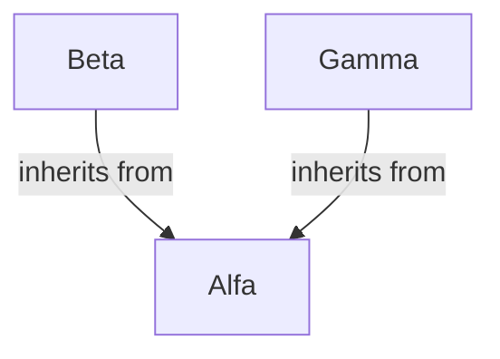
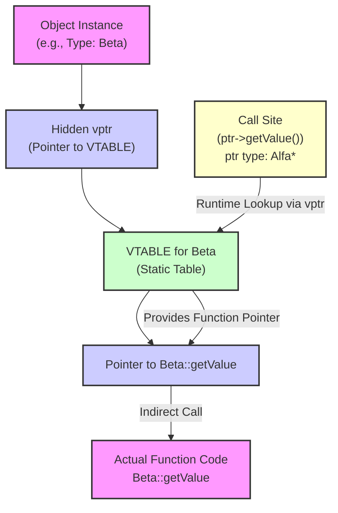
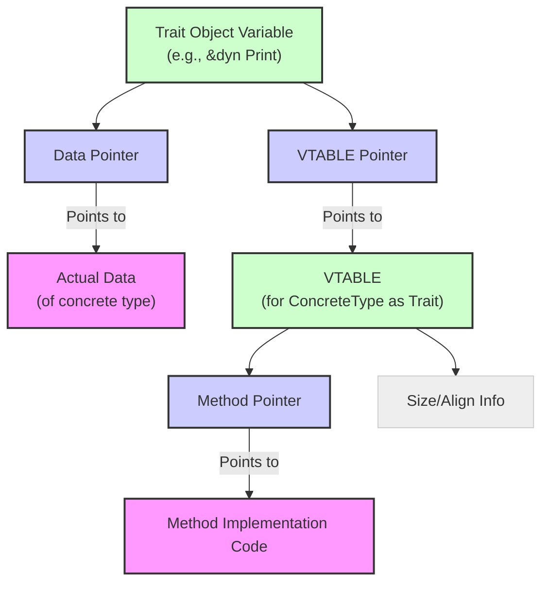

# Polymorphism and Traits in Rust

Rust achieves polymorphism using **Traits** and **Generics**. It avoids traditional class inheritance for its approach.

## What is Polymorphism?

*   **Origin:** Greek "*poly*" (many) + "*morphē*" (form) = "**having many forms**".
*   **In Programming:** Code (functions, methods, data structures) works uniformly with values of different types sharing common behaviors.
    *   *Analogy:* An `Animal`'s "make sound" method can be called on a `Dog` or `Cat` instance, producing the correct sound without the caller knowing the specific type beforehand.

## Why is Polymorphism Important?

It prevents code duplication (**DRY** - Don't Repeat Yourself) by defining shared behaviors abstractly (**traits**). This allows writing general, flexible, and maintainable code that works with any type implementing those behaviors.

## How Programming Languages Achieve Polymorphism

1.  **Generic Programming (Parametric Polymorphism):** Code uses type parameters, working for types satisfying constraints (e.g., `C++ templates`, `Rust generics`). Resolved at **compile time**.
2.  **Subtype Polymorphism:** Code for a base type works with derived type instances (e.g., `C++ inheritance`). Often involves **runtime** resolution.
3.  **Ad-hoc Polymorphism:** Function behavior varies by argument type (e.g., function overloading).

---

# Polymorphism in C and C++: A Contrast

## Polymorphism in C

C lacks built-in OOP features for polymorphism. It can be simulated manually using function pointers in structs or `void` pointers, but this requires careful programmer management and lacks compile-time safety.

## Polymorphism in C++

Achieved primarily via **inheritance** and **virtual methods** (**subtype polymorphism**) and **templates** (**generic programming**).

*   **Virtual Methods:** Declared with `virtual`. Method implementation resolved at **runtime** based on the object's actual type (**dynamic dispatch**).
*   **Mechanism (Dynamic Dispatch):** Uses a **VTABLE** (Virtual Table) – a static table of function pointers for virtual methods, created by the compiler for classes with virtual methods. Each object instance of such a class gets a hidden **`vptr`** (Virtual Pointer) pointing to its class's VTABLE (adds **memory overhead** per object). Virtual method calls use the `vptr` for a runtime lookup in the VTABLE, resulting in an indirect function call (**runtime performance cost**).

**Example C++ Code Demonstrating Polymorphism:**

```cpp
#include <iostream>
#include <memory> // For std::unique_ptr

// C++ Class Definitions
class Alfa { // Base class
public:
    virtual int getValue() const { return 1; } // Virtual method
    virtual ~Alfa() {} // Essential virtual destructor for cleanup
};
class Beta: public Alfa { // Derived
public:
    int getValue() const override { return 2; } // Override
    ~Beta() override {}
};
class Gamma: public Alfa { // Derived
public:
    int getValue() const override { return 3; } // Override
    ~Gamma() override {}
};

int main() {
    std::unique_ptr<Alfa> ptr1 = std::make_unique<Alfa>();
    std::unique_ptr<Alfa> ptr2 = std::make_unique<Beta>(); // Base ptr, derived object
    std::unique_ptr<Alfa> ptr3 = std::make_unique<Gamma>(); // Base ptr, derived object

    // Dynamic dispatch via virtual methods
    std::cout << "Value from ptr1: " << ptr1->getValue() << std::endl; // Calls Alfa::getValue()
    std::cout << "Value from ptr2: " << ptr2->getValue() << std::endl; // Calls Beta::getValue()
    std::cout << "Value from ptr3: " << ptr3->getValue() << std::endl; // Calls Gamma::getValue()

    return 0; // unique_ptr handles deletion
}
```

**Diagram of Inheritance Hierarchy:**

<p align="center">



</p>

**Diagram of Runtime Virtual Method Dispatch (Conceptual):**

<p align="center">



</p>

## Abstract Classes and Pure Virtual Methods in C++

*   Only `virtual` methods use dynamic dispatch.
*   **Pure Virtual Methods:** `virtual int calculateArea() = 0;`. Declared without implementation; derived classes *must* implement.
*   **Abstract Classes:** Contain >= 1 pure virtual method. Cannot be instantiated; serve as base classes.
*   **Pure Abstract Classes / Interfaces:** Abstract classes with only pure virtual methods. Define contracts.

---

# Traits in Rust: Rust's Approach to Polymorphism

Rust uses **Traits** to define shared behaviors (like interfaces) and **Generics** to write code accepting types that implement traits.

*   **What Defines a Trait?** A **Trait** is a contract specifying method signatures (and optionally associated items) types must implement for a behavior.
*   **Expressing Shared Behavior:** Implementing a trait signals a type provides the trait's behaviors.
*   **Dispatch:**
    *   **Static Dispatch (Monomorphization):** Compiler knows concrete type (via generics/`impl Trait`). Generates specialized code per type. **Zero runtime cost** (direct calls), potential binary size increase.
    *   **Dynamic Dispatch (`&dyn Trait`, `Box<dyn Trait>`):** Concrete type unknown until runtime (using **trait object**). Runtime VTABLE lookup determines method. Small **runtime cost** (indirect call), **memory overhead** (fat pointer).

---

## Defining and Using a Trait in Rust

### 1. Defining a Trait

`trait TraitName { method_signatures; }`. Methods often take `self`.

```rust
trait SomeTrait {
  fn some_operation(&mut self) -> String;
}
```

### 2. Implementing a Trait for a Concrete Type

`impl TraitName for TypeName { method_bodies; }`. Provide implementation for trait methods.

```rust
struct SomeType { data: i32, }
impl SomeTrait for SomeType {
  fn some_operation(&mut self) -> String {
    self.data += 1;
    format!("Data incremented to: {}", self.data)
  }
}
```

### 3. Using a Trait Method

Call via `instance.trait_method()`. Compiler usually uses static dispatch if type is known. Trait must be in scope (`use`).

---

### Example 1: The `Summarizable` Trait

`summary()` trait implemented for `f64` (format float) and `&str` (truncate/copy).

```rust
trait Summarizable { fn summary(&self) -> String; }
impl Summarizable for f64 { fn summary(&self) -> String { format!("{:.4}", self) } }
impl Summarizable for &str {
    fn summary(&self) -> String {
        if self.len() > 5 { format!("{}...", &self[..=5]) } else { self.to_string() }
    }
}
fn main() {
    let n = 1.0 / 3.0; println!("Summary of {}: {}", n, n.summary());
    let hello_world = "Hello, World"; println!("Summary of \"{}\": {}", hello_world, hello_world.summary());
    let hi = "Hi"; println!("Summary of \"{}\": {}", hi, hi.summary());
}
```

---

### Method Receiver `self` in Traits

Determines interaction with instance:
*   `self`: Takes **ownership**.
*   `&self`: Takes **immutable reference** (read-only). Most common.
*   `&mut self`: Takes **mutable reference** (read/write).

`Self` (capital S) in trait/impl refers to the implementing type. Explicit syntax: `self: Self`, `self: &Self`, `self: &mut Self`. Called via `instance.method()`.

```rust
trait T2 { fn takes_self(self); fn takes_immut_self(&self); fn takes_mut_self(&mut self); }
```

---

### Example 2: The `HasArea` Trait

`get_area()` trait for `Circle` and `Rectangle`.

```rust
trait HasArea { fn get_area(&self) -> f64; }
struct Circle { radius: f64 } impl HasArea for Circle { fn get_area(&self) -> f64 { std::f64::consts::PI * (self.radius * self.radius) } }
struct Rectangle { width: f64, height: f64, } impl HasArea for Rectangle { fn get_area(&self) -> f64 { self.width * self.height } }
fn main() {
    let circle = Circle { radius: 3.0 }; println!("Area of the circle: {}", circle.get_area());
    let rectangle = Rectangle { width: 4.0, height: 5.0 }; println!("Area of the rectangle: {}", rectangle.get_area());
}
```

---

### Example 3: The `Scalabile` Trait and Using `Self` in Return Types

`scala(&self, num: f32) -> Self` trait method returns a *new* instance of the implementing type (`Self`).

```rust
trait Scalabile { fn scala(&self, num: f32) -> Self; }
struct Punto { x: f32, y: f32, }
impl Scalabile for Punto {
    fn scala(&self, num: f32) -> Self { // Self resolves to Punto
        Punto { x: self.x * num, y: self.y * num, }
    }
}
fn main() {
    let punto_originale = Punto { x: 10.0, y: 20.0 };
    let punto_scalato = punto_originale.scala(0.5);
    println!("Original Punto - x: {}, y: {}", punto_originale.x, punto_originale.y);
    println!("Scaled Punto - x: {}, y: {}", punto_scalato.x, punto_scalato.y);
}
```

---

### Methods Without `self` (Associated Functions)

Functions in traits/impl blocks without a `self` receiver. Called using `::` (e.g., `TypeName::function()`, `TraitName::function()`). Often used for constructors (`new()`).

```rust
trait Default { fn default() -> Self; }
impl Default for i32 { fn default() -> Self { 0 } }
fn main() {
    let zero: i32 = Default::default(); println!("Default i32 (Trait prefix): {}", zero);
    let zero_again = i32::default(); println!("Default i32 (Type prefix): {}", zero_again);
}
```

---

### Example 4: The `Inizializzabile` Trait and `#[derive(Default)]`

Custom associated function `inizializza`. `#[derive(Default)]` automatically implements `Default` trait's `default()` associated function if fields implement `Default`.

```rust
trait Inizializzabile { fn inizializza(a: i32, b: i32) -> Self; }
#[derive(Default, Debug)] struct Punto { x: i32, y: i32, }
impl Inizializzabile for Punto { fn inizializza(a: i32, b: i32) -> Self { Punto { x: a, y: b } } }
fn main() {
    let punto = Punto::inizializza(5, 10); println!("Punto initialized with inizializza: ({}, {})", punto.x, punto.y);
    let punto1: Punto = Punto::default(); println!("Punto initialized with Default (Type prefix): {:?}", punto1);
    let punto2: Punto = Default::default(); println!("Punto initialized with Default (Trait prefix): {:?}", punto2);
}
```

---

### Associated Types in Traits

Placeholder types `type Name;` within a trait. Implementing types specify concrete types `type Name = ConcreteType;` in `impl`. Used for related types specific to each implementation (e.g., `Iterator::Item`).

```rust
trait T3 { type AssociatedType; fn process(&self, arg: Self::AssociatedType); }
struct SomeType { data: i32 } impl T3 for SomeType { type AssociatedType = i32; fn process(&self, arg: i32) { println!("SomeType::process called with i32: {} and data: {}", arg, self.data); } }
struct OtherType { } impl T3 for OtherType { type AssociatedType = &str; fn process(&self, arg: &str) { println!("OtherType::process called with &str: {}", arg); } }
fn main() { let s = SomeType { data: 100 }; s.process(1234); let o = OtherType { }; o.process("Hello, Rust!"); }
```

---

### Example 5: The `Convertible` Trait with an Associated Type `Output`

`Convertible` trait defines `type Output` for conversion target. `NumeroIntero` implements with `Output = f64`, `NumeroReale` with `Output = i32`.

```rust
trait Convertible { type Output; fn converti(&self) -> Self::Output; }
struct NumeroIntero { valor: i32 } impl Convertible for NumeroIntero { type Output = f64; fn converti(&self) -> Self::Output { self.valor as Self::Output } }
struct NumeroReale { valor: f64 } impl Convertible for NumeroReale { type Output = i32; fn converti(&self) -> Self::Output { self.valor as Self::Output } }
fn main() {
    let numero_intero = NumeroIntero { valor: 42 }; let valore_convertito_f64: f64 = numero_intero.converti(); println!("Integer value converted to float: {}", valore_convertito_f64);
    let numero_reale = NumeroReale { valor: 42.3 }; let valore_convertito_i32: i32 = numero_reale.converti(); println!("Float value converted to integer: {}", valore_convertito_i32);
}
```

---

## Default Implementations in Traits

Traits can provide default method implementations. Implementing types can use the default or override it. Defaults can call other trait methods.

```rust
trait T4 { fn f(&self) { println!("Using default implementation of T4::f()"); } }
struct SomeType; impl T4 for SomeType {} // Uses default f()
struct OtherType; impl T4 for OtherType { fn f(&self) { println!("Using overridden implementation of T4::f() for OtherType"); } } // Overrides f()
fn main() { let s = SomeType; let o = OtherType; s.f(); o.f(); }
```

---

### Example 6: The `Moltiplicabile` Trait with a Default Implementation

`Moltiplicabile` has required `moltiplica` and default `moltiplicare_per_due` calling `moltiplica(2)`. `Numero` uses default; `Numero2` overrides `moltiplicare_per_due`.

```rust
trait Moltiplicabile {
    fn moltiplica(&self, factor: i32) -> i32;
    fn moltiplicare_per_due(&self) -> i32 { println!("Using default Moltiplicazione per 2 from trait"); self.moltiplica(2) }
}
struct Numero { valor: i32 } impl Moltiplicabile for Numero { fn moltiplica(&self, factor: i32) -> i32 { self.valor * factor } }
struct Numero2 { valor: i32, altro: i32 }
impl Moltiplicabile for Numero2 {
    fn moltiplica(&self, factor: i32) -> i32 { self.valor * factor }
    fn moltiplicare_per_due(&self) -> i32 { println!("Overriding Moltiplicazione per 2 for Numero2"); self.altro * 2 }
}
fn main() {
    let numero = Numero { valor: 7 }; println!("Result with Tipo Numero: {}", numero.moltiplicare_per_due());
    let numero2 = Numero2 { valor: 5, altro: 1 }; println!("Result with Tipo Numero2: {}", numero2.moltiplicare_per_due());
}
```

---

## Sub-traits and Super-traits (Trait Inheritance)

A trait (sub-trait) can require implementing types to also implement other traits (super-traits) using `: Supertrait + AnotherTrait`. Implementers must provide all required methods.

```rust
trait Supertrait { fn method_a(&self); fn method_b(&self); }
trait Subtrait: Supertrait { fn method_c(&self); } // Subtrait requires Supertrait
struct SomeType;
impl Supertrait for SomeType { fn method_a(&self) { println!("Implementation for Supertrait::method_a()"); } fn method_b(&self) { println!("Implementation for Supertrait::method_b()"); } }
impl Subtrait for SomeType { fn method_c(&self) { println!("Implementation for Subtrait::method_c()"); } }
fn main() { let s = SomeType; s.method_a(); s.method_b(); s.method_c(); }
```

---

### Example 8: `Intestabile: Stampabile` (Calling Supertrait Methods)

`Intestabile` requires `Stampabile`. `Documento` implements both. `Intestabile::stampa_intestazione` can call `self.stampa()` (from `Stampabile`).

```rust
trait Stampabile { fn stampa(&self); } // Supertrait
trait Intestabile: Stampabile { fn stampa_intestazione(&self); } // Subtrait requires Stampabile
struct Documento { titolo: String, contenuto: String, }
impl Stampabile for Documento { fn stampa(&self) { println!("Contenuto: {}", self.contenuto); } }
impl Intestabile for Documento {
    fn stampa_intestazione(&self) {
        println!("--- {} ---", self.titolo);
        self.stampa(); // Call supertrait method
        println!("-----------");
    }
}
fn main() {
    let mio_documento = Documento { titolo: String::from("My Report"), contenuto: String::from("Content bla bla"), };
    println!("Printing content directly:"); mio_documento.stampa();
    println!("\nPrinting with header:"); mio_documento.stampa_intestazione();
}
```

---

### Resolving Ambiguity

If multiple implemented traits (or direct methods) have identical method names/signatures, `instance.method()` prioritizes direct `impl Type` methods. To explicitly call a trait method, use **Universal Function Call Syntax (UFCS)**: `<Type as Trait>::method(value, args)`.

```rust
trait TraitA { fn f(&self); } trait TraitB: TraitA { fn f(&self); }
struct SomeType;
impl SomeType { fn f(&self) { println!("Implementation directly on SomeType"); } } // Direct impl
impl TraitA for SomeType { fn f(&self) { println!("Implementation for TraitA::f()"); } } // Trait A impl
impl TraitB for SomeType { fn f(&self) { println!("Implementation for TraitB::f()"); } } // Trait B impl
fn main() {
    let s = SomeType;
    s.f(); // Calls direct impl
    <SomeType as TraitA>::f(&s); // Explicit TraitA
    <SomeType as TraitB>::f(&s); // Explicit TraitB
}
```

---

## Invoking a Trait Method: Dispatching

How the compiler/runtime determines which implementation to run.
*   **Static Dispatch (Monomorphization):** Resolved at **compile time**. Compiler generates specialized code copies for each concrete `T` used. **Zero runtime cost**.
*   **Dynamic Dispatch:** Resolved at **runtime** (trait objects). VTABLE lookup. Small **runtime cost**.

---

### Example 11: The `Print` Trait with a `&dyn Print` Trait Object

`process` takes `&dyn Print` (trait object). `v.print()` uses dynamic dispatch.

```rust
trait Print { fn print(&self); }
struct S { i: i32 } impl Print for S { fn print(&self) { println!("S instance with value: {}", self.i); } }
fn process_dynamic(v: &dyn Print) { v.print(); } // Dynamic dispatch
fn process_static(v: &impl Print) { v.print(); } // Static dispatch (impl Trait)
fn main() {
    let s_instance = S { i: 10 };
    println!("Using static dispatch:"); process_static(&s_instance);
    println!("\nUsing dynamic dispatch:"); process_dynamic(&s_instance); // &S coerces to &dyn Print
}
```

---

## Object-Traits (Trait Objects - `&dyn Trait`, `Box<dyn Trait>`, etc.)

Refer to different concrete types implementing a trait using `dyn Trait`.
*   **Fat Pointer:** `&dyn Trait` or `Box<dyn Trait>` is a pointer twice the size of a regular pointer, holding: data pointer + VTABLE pointer.
*   **Costs:** Runtime performance cost (VTABLE lookup, indirect call) + memory overhead (fat pointer).
*   **Object Safety:** Traits must be "**object safe**" to form trait objects. Methods must not take `self` by value or return `Self`, among other restrictions.

**Diagram Illustrating Trait Object Structure:**

<p align="center">



</p>

---

### Example 12: Heterogeneous Collection with `Vec<Box<dyn Shape>>`

`Vec` requires elements to be **`Sized`** (known size at compile time). `dyn Trait` is **not `Sized`**. `Box<dyn Trait>` *is* `Sized`. Storing boxed trait objects enables heterogeneous collections.

```rust
trait Shape { fn area(&self) -> f64; }
struct Circle { radius: f64 } impl Shape for Circle { fn area(&self) -> f64 { std::f64::consts::PI * self.radius * self.radius } }
struct Rectangle { width: f64, height: f64 } impl Shape for Rectangle { fn area(&self) -> f64 { self.width * self.height } }
fn main() {
    let circle = Circle { radius: 5.0 }; let rectangle = Rectangle { width: 3.0, height: 4.0 };
    let mut shapes: Vec<Box<dyn Shape>> = Vec::new(); // Vec of boxed trait objects (Sized)
    shapes.push(Box::new(circle)); // Box<Circle> coerces to Box<dyn Shape>
    shapes.push(Box::new(rectangle)); // Box<Rectangle> coerces to Box<dyn Shape>
    println!("Areas:"); for shape in shapes { println!("{}", shape.area()); } // Dynamic dispatch
}
```

---

### Example 13: Trait Object Calling Supertrait Methods

A trait object for a sub-trait (`&dyn Drawable` where `Drawable: Shape`) can call methods from the sub-trait (`draw`) and its super-traits (`Shape::area`). VTABLE includes entries for all.

```rust
trait Shape { fn area(&self) -> f64; } trait Drawable: Shape { fn draw(&self); } // Drawable requires Shape
struct Rectangle { width: f64, height: f64 } impl Shape for Rectangle { fn area(&self) -> f64 { self.width * self.height } }
impl Drawable for Rectangle { fn draw(&self) { println!("Drawing a rectangle."); } }
struct Square { side: f64 } impl Shape for Square { fn area(&self) -> f64 { self.side * self.side } }
impl Drawable for Square { fn draw(&self) { println!("Drawing a square."); } }
fn draw_shape(shape: &dyn Drawable) { shape.draw(); println!("Calculated Area: {}", shape.area()); } // Can call Shape methods
fn main() {
    let rectangle = Rectangle { width: 3.0, height: 4.0 }; draw_shape(&rectangle);
    println!("---");
    let square = Square { side: 2.0 }; draw_shape(&square);
}
```

---

## Functions with Parameter Abstraction (`impl Trait` Syntax)

Concise way to accept any type implementing a trait: `param: impl TraitA + TraitB`. Syntactic sugar for generics (`fn func<T: Trait>(p: T)`). Results in **Static Dispatch** (Monomorphization).

---

### Example 14: Function Accepting `impl Debug`

`mostra_debug` accepts any `Debug` type using `impl Debug`.

```rust
use std::fmt::Debug;
fn mostra_debug(valore: impl Debug) { println!("Debug representation: {:?}", valore); } // impl Debug is sugar for generic T: Debug
fn main() {
    mostra_debug("a string slice"); // Monomorphized for &str
    let my_vec = vec![1, 2, 3]; mostra_debug(my_vec); // Monomorphized for Vec<i32>
    mostra_debug(42); // Monomorphized for i32
}
```

---

### Example 15: Function Accepting `impl Forma` (Static Dispatch via `impl Trait`)

`stampa_dettagli_forma` accepts any `Forma` type using `impl Forma`.

```rust
trait Forma { fn area(&self) -> f64; fn perimetro(&self) -> f64; }
struct Cerchio { raggio: f64 } impl Forma for Cerchio { fn area(&self) -> f64 { std::f64::consts::PI * self.raggio * self.raggio } fn perimetro(&self) -> f64 { 2.0 * std::f64::consts::PI * self.raggio } }
struct Rettangolo { larghezza: f64, altezza: f64 } impl Forma for Rettangolo { fn area(&self) -> f64 { self.larghezza * self.altezza } fn perimetro(&self) -> f64 { 2.0 * (self.larghezza + self.altezza) } }
fn stampa_dettagli_forma(forma: impl Forma) { println!("Area: {}", forma.area()); println!("Perimetro: {}", forma.perimetro()); println!("---"); } // impl Forma is sugar for generic T: Forma
fn main() {
    let cerchio = Cerchio { raggio: 5.0 }; stampa_dettagli_forma(cerchio); // Monomorphized for Cerchio
    let rettangolo = Rettangolo { larghezza: 4.0, altezza: 6.0 }; stampa_dettagli_forma(rettangolo); // Monomorphized for Rettangolo
}
```

---

## Requirements for Trait Objects (`dyn Trait`) in More Detail

*   **`Sized` Trait:** Types with compile-time known size (most types). Generic parameters default to `Sized`.
*   **Dynamically Sized Types (DSTs) or `?Sized`:** Size unknown at compile time (`[T]`, `str`, `dyn Trait`). Opt-out of `Sized` bound with `?Sized`. Must be behind a pointer (`&`, `Box`, etc.).
*   **Why `dyn Trait` Needs Pointers/References:** `dyn Trait` is a DST. Cannot be stored where fixed size is needed (stack, most struct fields, `Vec` elements). Pointers/references *are* `Sized`. Fat pointers for DSTs hold data pointer + size/VTABLE info.

```rust
use std::fmt::Debug; use std::mem;
// T: ?Sized allows DSTs; must be &T, Box<T>, etc.
fn print_maybe_unsized<T: ?Sized + Debug>(val: &T) {
    println!("Value (potentially) unsized: {:?}", val);
    println!("Size of value data: {} bytes", mem::size_of_val(val));
    println!("Size of reference (&T): {} bytes", mem::size_of_val(&val)); // Size of fat pointer for DSTs
    println!("---");
}
fn main() {
    let x = 10; print_maybe_unsized(&x); // T: i32 (Sized), &T: &i32 (8 bytes)
    let s: &[i32] = &[1, 2, 3]; print_maybe_unsized(s); // T: [i32] (?Sized), &T: &[i32] (16 bytes fat pointer)
    let text: &str = "hello world"; print_maybe_unsized(text); // T: str (?Sized), &T: &str (16 bytes fat pointer)
    let boxed_trait: Box<dyn Debug> = Box::new(42); print_maybe_unsized(&boxed_trait); // T: Box<dyn Debug> (Sized), &T: &Box<dyn Debug> (8 bytes)
    print_maybe_unsized(&42 as &dyn Debug); // T: dyn Debug (?Sized), &T: &dyn Debug (16 bytes fat pointer)
}
```

---

### Another Use of Trait Objects: Heterogeneous Collections (Revisited)

Store different concrete types implementing a trait in collections like `Vec` by using `Box<dyn Trait>` or `&dyn Trait`.

```rust
trait Animale { fn fai_verso(&self); }
struct Cane; impl Animale for Cane { fn fai_verso(&self) { println!("Bau!"); } }
struct Gatto; impl Animale for Gatto { fn fai_verso(&self) { println!("Miao!"); } }
struct Pecora; impl Animale for Pecora { fn fai_verso(&self) { println!("Beeeeh!"); } }
fn main() {
    let mut animali: Vec<Box<dyn Animale>> = Vec::new(); // Heterogeneous collection (Sized elements)
    animali.push(Box::new(Cane)); // Coerce Box<Cane> to Box<dyn Animale>
    animali.push(Box::new(Gatto));
    animali.push(Box::new(Pecora));
    println!("Animal sounds:"); for animale in animali { animale.fai_verso(); } // Dynamic dispatch
}
```

---

### Common Standard Library Traits

Fundamental traits for capabilities, operators, formatting, conversions, etc.

| Category           | Key Trait(s)                         | Operators / Syntax Enabled        | Core Purpose                                                                 | Notes (selected)                                                                 |
| :----------------- | :----------------------------------- | :-------------------------------- | :--------------------------------------------------------------------------- | :------------------------------------------------------------------------------- |
| **Equality**       | `PartialEq`, `Eq`                    | `==`, `!=`                        | Check equality. `Eq` is total.                                               | `#[derive(PartialEq, Eq)]` often available.                                    |
| **Ordering**       | `PartialOrd`, `Ord`                  | `<`, `>`, `<=`, `>=`, `.cmp()`    | Compare for order. `Ord` is total.                                           | `#[derive(PartialOrd, Ord)]` often available. Requires `PartialEq`, `Eq`.    |
| **Arithmetic**     | `Add`, `Sub`, `Mul`, `Div`, `Rem`    | `+`, `-`, `*`, `/`, `%`           | Standard operators.                                                          | Manual `impl`, `std::ops`.                                                       |
| **Bitwise**        | `BitAnd`, `BitOr`, `BitXor`, `Shl`, `Shr` | `&`, `|`, `^`, `<<`, `>>`         | Standard bitwise operators.                                                  | Manual `impl`, `std::ops`.                                                       |
| **Unary**          | `Neg`, `Not`                         | `-` (unary), `!`                  | Unary operators.                                                             | Manual `impl`, `std::ops`.                                                       |
| **Indexing**       | `Index`, `IndexMut`                  | `[]`                              | Square-bracket access.                                                       | Manual `impl`, `std::ops`.                                                       |
| **Conversions**    | `From`, `Into`                       | `.from()`, `.into()`              | Infallible conversions (`From<T> for U` implies `Into<U> for T`).            | `std::convert`.                                                                  |
| **Fallible Conv.** | `TryFrom`, `TryInto`                 | `.try_from()`, `.try_into()`        | Fallible conversions (`Result`).                                             | `std::convert`.                                                                  |
| **String Parsing** | `FromStr`                            | `.from_str()`, `.parse()`         | Parse from `&str` (`Result`). `.parse()` is blanket `impl` for `FromStr`.  | `std::str`.                                                                      |
| **Dereferencing**  | `Deref`, `DerefMut`                  | `*`, `.` (coercion)               | Dereference pointer types, enable coercion.                                  | Manual `impl`, `std::ops`.                                                       |
| **Printing**       | `Display`, `Debug`                   | `{}` (Display), `{:?}` (Debug)    | String formatting (user vs developer).                                       | `Debug` often `#[derive]`, `Display` manual `impl fmt::Display`. `std::fmt`.   |
| **Cloning**        | `Clone`                              | `.clone()`                        | Deep copy.                                                                   | `#[derive(Clone)]` often available.                                              |
| **Copying**        | `Copy`                               | Implicit bitwise copy.            | Marker: cheap bitwise copy possible.                                         | Sub-trait of `Clone`, excludes `Drop`. `#[derive(Copy, Clone)]` often available. |
| **Dropping**       | `Drop`                               | Automatic on scope exit, `drop()` | Custom cleanup logic (destructor).                                           | Manual `impl`, excludes `Copy`.                                                  |
| **Error Handling** | `Error`                              | `.source()`, compatibility with `?` | Standard interface for error types. Requires `Debug` + `Display`.            | `std::error`.                                                                    |

---

### Simplified Definitions of Standard Library Traits `PartialEq` and `Eq`

```rust
use std::cmp::Ordering;
trait PartialEq<Rhs = Self> where Rhs: ?Sized {
    fn eq(&self, other: &Rhs) -> bool; // Required
    fn ne(&self, other: &Rhs) -> bool { !self.eq(other) } // Default
}
trait Eq: PartialEq<Self> {} // Marker trait, requires total equality (PartialEq<Self>)
```

---

### Simplified Definitions of Standard Library Traits `PartialOrd` and `Ord`

```rust
use std::cmp::Ordering;
trait PartialOrd<Rhs = Self> where Rhs: ?Sized + PartialEq<Rhs> {
    fn partial_cmp(&self, other: &Rhs) -> Option<Ordering>; // Required, may return None
    fn lt(&self, other: &Rhs) -> bool { self.partial_cmp(other) == Some(Ordering::Less) } // Defaults
    fn le(&self, other: &Rhs) -> bool { matches!(self.partial_cmp(other), Some(Ordering::Less | Ordering::Equal)) }
    fn gt(&self, other: &Rhs) -> bool { self.partial_cmp(other) == Some(Ordering::Greater) }
    fn ge(&self, other: &Rhs) -> bool { matches!(self.partial_cmp(other), Some(Ordering::Greater | Ordering::Equal)) }
}
trait Ord: Eq + PartialOrd<Self> { // Requires Eq + PartialOrd<Self>
    fn cmp(&self, other: &Self) -> Ordering; // Required, guaranteed Ordering
    fn max(self, other: Self) -> Self where Self: Sized { match self.cmp(&other) { Ordering::Less | Ordering::Equal => other, Ordering::Greater => self, } } // Defaults (Sized bound)
    fn min(self, other: Self) -> Self where Self: Sized { match self.cmp(&other) { Ordering::Less | Ordering::Equal => self, Ordering::Greater => other, } }
}
```

---

## Describing an Error using The `Error` Trait

Standard for error types. `Result<T, E>` convention is `E: Error`.
`std::error::Error` trait requires `Debug` (`{:?}`, often `#[derive]`) and `Display` (`{}`, manual `impl`). Optional `source()` for chaining.

```rust
use std::fmt; use std::error::Error;
#[derive(Debug)] struct CustomError { message: String, } // Requires Debug
impl fmt::Display for CustomError { fn fmt(&self, f: &mut fmt::Formatter<'_>) -> fmt::Result { write!(f, "A custom error occurred: {}", self.message) } } // Requires Display
impl Error for CustomError {} // Requires Debug and Display
fn do_something_risky(fail: bool) -> Result<i32, CustomError> {
    if fail { Err(CustomError { message: "Operation specifically requested to fail".to_string() }) } else { Ok(42) }
}
fn main() {
    println!("Attempting operation 1 (should succeed):");
    match do_something_risky(false) { Ok(v) => println!("Op 1 success: {}", v), Err(e) => println!("Op 1 failed: {}", e)); }
    println!("\nAttempting operation 2 (should fail):");
    match do_something_risky(true) { Ok(v) => println!("Op 2 success: {}", v), Err(e) => { println!("Op 2 failed: {}", e); println!("Debug details: {:?}", e); } }
}
```

---

## Generic Types (Generics) in Rust

Parametric polymorphism using placeholder types (`<T>`) for functions/structs. Compile-time safety + flexibility.

---

### Generic Functions

`fn name<T>(...) where T: Trait`. Type parameter `<T>` with **trait bounds**.
*   **Compile-Time Verification:** Checks safety for valid `T`.
*   **Monomorphization:** Compiler generates specialized code copies for each concrete `T` used.
*   **Result:** **Static Dispatch**, **zero runtime cost**.

```rust
use std::cmp::PartialOrd;
fn max<T: PartialOrd>(t1: T, t2: T) -> T { // Generic function with bound
    if t1 < t2 { t2 } else { t1 } // Uses < from PartialOrd
}
fn main() {
    println!("Maximum integer: {}", max(10, 20)); // Monomorphized for i32
    println!("Maximum float: {}", max(3.14, 2.718)); // Monomorphized for f64
    println!("Maximum string slice: {}", max("apple", "banana")); // Monomorphized for &str
}
```

---

### Generic Types (Structs, Enums, etc.)

Structures defined with type parameters (`struct Name<T>`). Hold data of type `T`. `impl` blocks must declare generics.

```rust
struct MyStruct<T> { value: T, } // Generic struct
impl<T> MyStruct<T> { fn new(value: T) -> Self { MyStruct { value } } fn get_value(&self) -> &T { &self.value } } // Impl for any T
impl<T: std::fmt::Debug> std::fmt::Debug for MyStruct<T> { fn fmt(&self, f: &mut std::fmt::Formatter<'_>) -> std::fmt::Result { f.debug_struct("MyStruct").field("value", &self.value).finish() } } // Impl only if T: Debug
fn main() {
    let int_struct = MyStruct::new(123); println!("Integer struct value: {}", int_struct.get_value()); // MyStruct<i32>
    let string_struct = MyStruct::new("hello"); println!("String struct value: {}", string_struct.get_value()); // MyStruct<&str>
    println!("Debug print: {:?}", int_struct);
}
```

---

### Traits vs. Generic Types (Their Relationship)

**Complementary:** Traits define *what* behaviors types share; Generics enable writing code that works for *any type* meeting those trait behavior requirements via **trait bounds**.

---

### Example 14: Generic Function with `Suona` Trait Bound (Static Dispatch)

`esegui_melodia` takes `&T` with `T: Suona` bound (or `&impl Suona`). Static dispatch.

```rust
trait Suona { fn suona(&self); }
struct Chitarra; impl Suona for Chitarra { fn suona(&self) { println!("Chitarra: Strum!"); } }
struct Pianoforte; impl Suona for Pianoforte { fn suona(&self) { println!("Pianoforte: Ding!"); } }
fn esegui_melodia<T>(instrumento: &T) where T: Suona { instrumento.suona(); } // Generic with bound (Static Dispatch)
// fn esegui_melodia(instrumento: &impl Suona) { instrumento.suona(); } // Shorthand
fn main() {
    let chitarra = Chitarra; esegui_melodia(&chitarra); // Monomorphized for &Chitarra
    let pianoforte = Pianoforte; esegui_melodia(&pianoforte); // Monomorphized for &Pianoforte
}
```

---

### Example 15: Function Accepting a Trait Object (`&dyn Suona`) (Dynamic Dispatch)

`esegui_melodia_dinamica` takes `&dyn Suona` (trait object). Dynamic dispatch.

```rust
trait Suona { fn suona(&self); }
struct Chitarra; impl Suona for Chitarra { fn suona(&self) { println!("Chitarra: Strum!"); } }
struct Pianoforte; impl Suona for Pianoforte { fn suona(&self) { println!("Pianoforte: Ding!"); } }
fn esegui_melodia_dinamica(instrumento: &dyn Suona) { instrumento.suona(); } // Takes trait object (Dynamic Dispatch)
fn main() {
    let chitarra = Chitarra; esegui_melodia_dinamica(&chitarra); // &Chitarra coerces to &dyn Suona
    let pianoforte = Pianoforte; esegui_melodia_dinamica(&pianoforte); // &Pianoforte coerces to &dyn Suona
}
```
