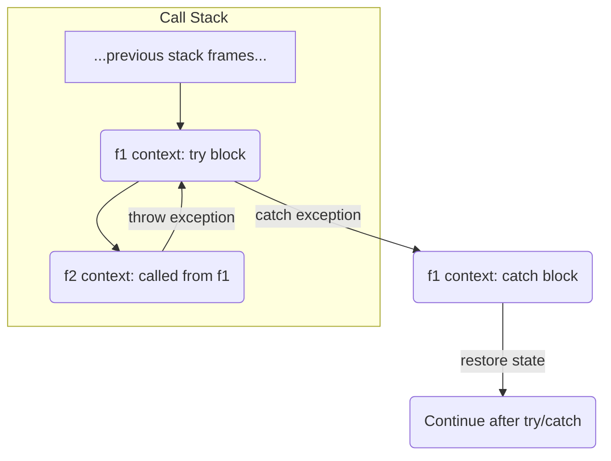

# Error Handling

---

## Errors and Exceptions

Computations can sometimes fail prematurely.

*   **Premature Failure:** When a computation fails before completing, it prevents the expected result from being returned or required side effects from occurring.

These failures can happen for different reasons:

*   **Programming Errors:** Issues caused by mistakes in the code itself.
*   **User Input Errors:** Failures resulting from invalid or unexpected data provided by the user.
*   **System Resource Errors:** Problems due to the system environment, such as a lack of memory or other resources.

Some errors are relatively easy to predict, like attempting an invalid mathematical operation (e.g., **division by zero**) or failing to convert text to a number.

Other errors are less often anticipated by programmers because they relate to external system limits or malfunctions that developers sometimes oversimplify in their mental model of reality. Examples include:

*   Running out of memory or disk space.
*   Network issues.
*   Problems with other peripheral devices.

Regardless of their cause, failures can be categorized into two main types:

*   **Recoverable Failures:** These do not corrupt the program's state. It's possible to implement a strategy to recover or continue from this type of error.
*   **Non-Recoverable Failures:** These cause an unpredictable alteration of the program's state or indicate that the computation cannot proceed further.

---

### Handling Strategies

How errors are handled depends on whether they are recoverable or not:

*   **For Non-Recoverable Cases:** The process must be terminated.
    *   This may involve performing some cleanup operations on the external environment before shutting down.
*   **For Recoverable Cases:** A state restoration or recovery strategy needs to be implemented.
    *   This could involve retrying the operation.
    *   Requesting intervention from the user or administrator.
    *   Using an alternative strategy to achieve the goal.
    *   ...and so on.

A challenge is that the exact point where a failure occurs might not have sufficient context to decide how to handle it appropriately.

*   To address this, if a computation fails within a function, control should ideally return to the caller.
    *   This return should include a description of what happened, allowing the caller (which likely has more context) to decide the recovery strategy.

This requirement to pass error information back up the call chain tends to increase code complexity. It introduces various branching paths (`if/else`, `switch/case`, `match`) to handle different outcomes. Managing the details across these branches can easily lead to logical errors.

*   Because of this, "modern" programming languages often include specific language features designed to support the management of **exceptions** (errors that interrupt normal control flow).

---

#### std::process::exit() Example

*(Code from file: `exit.rs`)*

```rust
use std::process;

fn main() {
    println!("Il programma sta per terminare con successo.");
    process::exit(100); // Exit the process with code 100

    // Any code after process::exit will NOT be executed.
    println!("Questo non verrà stampato.");
}
```

When run, the output shows the first message, then the process exits with code 100:

```text
Il programma sta per terminare con successo.
error: process didn't exit successfully: `target\debug\untitled38.exe` (exit code: 100)
Process finished with exit code 100
```

---

#### Panic!

The **`panic!`** macro serves to signal that the program has reached an inconsistent state from which it's impossible to continue execution without causing further damage.

*   It should be used when the program's state is so compromised that attempting recovery actions is not feasible.
*   This often occurs due to logical errors within the program itself.

Common situations where **`panic!`** might be appropriate include:

*   Accessing an array element outside its valid bounds.
*   Attempting integer division by zero.
*   Assertion failures (conditions expected to be true are false).

In these situations, **Rust** offers the **`panic!(...)`** macro, which accepts arguments similar to the `println!(...)` macro to format a message describing the error.

*   **Effect of `panic!()`:**
    *   Invoking **`panic!`** causes the stack to unwind, similar to **C++** exceptions.
    *   This triggers the execution of the `drop()` methods for variables that implement the **`Drop`** trait, ensuring cleanup of resources up to the point of the panic.
    *   If the thread where **`panic!`** is invoked is the main thread of the application, the entire process terminates with a non-zero error code.
    *   If it's a different thread, only that specific thread terminates, while the main process might continue.

---

##### panic! Example

*(Code from file: `panic.rs`)*

```rust
fn main() {
    let numbers = vec![1, 2, 3, 4, 5];
    let index = 5; // This index is out of bounds (valid indices are 0-4)

    // Check if the index is within the valid range
    if index < numbers.len() {
        let value = numbers[index];
        println!("Il valore all'indice {} è: {}", index, value);
    } else {
        // If the index is invalid, trigger a panic!
        panic!("Tentativo di accedere a un indice non valido.");
    }
}
```

When this code is run, the `else` block is executed because `5` is not less than `numbers.len()` (which is `5`). The **`panic!`** macro is called, and the program terminates with an error message including the provided string and location.

---

#### Repeating Execution

*(Code from file: `loop.rs`)*

```rust
use std::io;
use std::fs::File;

fn main() {
    // Start an infinite loop
    loop {
        println!("Enter the name of the file to open:");

        // Get user input
        let mut filename = String::new();
        io::stdin().read_line(&mut filename).expect("Failed to read line"); // read_line returns Result, but we expect it to succeed here
        let filename = filename.trim(); // Remove whitespace

        // Attempt to open the file
        match File::open(filename) {
            // If successful:
            Ok(file) => {
                println!("Successfully opened {}", filename);
                // Execute other operations on the opened file here if needed
                break; // Exit the loop because we succeeded
            },
            // If failed:
            Err(err) => {
                println!("Error opening {}: {}", filename, err);
                println!("Please try again."); // Prompt user to retry
            }
        }
    }
}
```

This code repeatedly prompts the user for a file name and tries to open it. If `File::open()` returns an **`Err`**, it prints an error message and the loop continues, asking for input again. If `File::open()` returns **`Ok(file)`**, it prints a success message and uses **`break`** to exit the loop.

---

## Syntactic Support for Error Handling

Different programming languages offer varying levels of built-in support for error handling:

*   **C Language:** Provides no direct syntactic support for modeling errors or exceptions.
    *   The responsibility for detecting, handling, and propagating errors lies entirely with the programmer.

*   **C++ Language** (and many others like **Java**, **C#**, **JavaScript**): Introduces the concept of **exceptions**.
    *   It provides keywords like `try`, `catch`, `throw`, and `finally` to define the logic for reporting and handling errors.
    *   You `try` to perform an operation.
    *   If something goes wrong, you `throw` an exception.
    *   A `catch` block is used to handle specific types of thrown exceptions.
    *   Using exceptions imposes a specific structure on the execution context (e.g., how the call stack and processor registers are managed). This can create issues, particularly for low-level code like operating system kernels.
    *   For example, the **Linux Kernel** is not designed to manage the specific execution context structures required by **C++** exceptions.

*   **Rust Language:** Does not use the exception concept like **C++**. Instead, it provides algebraic data types **`Result<T, E>`** and **`Option<T>`**.
    *   **`Result<T, E>`** represents a computation that can either succeed with a value of type `T` or fail with an error of type `E`.
    *   **`Option<T>`** represents a computation that might produce a value of type `T` (`Some(T)`) or might produce no value at all (`None`).
    *   These types explicitly represent possible outcomes in the function's signature.
    *   **Rust** also offers the **`panic!`** macro, which forces the current thread to stop execution and prints a message describing what happened. If the thread is the main application thread, the entire process terminates.

---

## Exceptions in C++

In **C++**, any computation can be stopped by invoking the `throw` instruction.

*   **The `throw` instruction:** This immediately halts the execution of the current function.
    *   It is followed by a value of any type, which describes the nature of the failure.
    *   After throwing, the program searches for an exception handling context (a `try` block) that includes a `catch` block capable of handling the thrown value's type. This search goes up the call stack through the function callers.

When an exception is thrown and the search for a handler proceeds up the call stack, a process called **stack unwinding** occurs:

1.  **Forced Return:** The throwing function performs a forced return to its caller.
2.  **Progressive Unwinding:** This process repeats, with control returning progressively up the history of computation (the call stack).
3.  **Searching for Handler:** This continues until an invocation contained within a `try { ... }` block is reached, which has a `catch` block associated with it that matches the type of the thrown error.
4.  **Resource Cleanup:** During the progressive contraction of the stack (**unwinding**), memory is deallocated, and destructors for local variables are invoked.
5.  **Alternative:** The **unwinding** could continue until the entire stack is contracted, leading to program termination if no handler is found.

A `try` block is followed by one or more `catch` blocks, like this:

```c++
try {
    // code that might fail directly or indirectly
} catch (ExceptionType1 e1) {
    // ...recovery instructions for ExceptionType1
} catch (ExceptionType2 e2) {
    // ...recovery instructions for ExceptionType2
} catch (...) {
    // ...handle any other exception type
}
```

---

### Catching Exceptions

When a `try` block is encountered in the call stack history after an exception is thrown, the type of the thrown value is compared, in sequence, with the types specified in the subsequent `catch` blocks.

1.  **Matching `catch` Block:**
    *   If a matching `catch` block is found (its type is compatible with the thrown exception type), the code inside that `catch` block is executed.
    *   The purpose of the `catch` block code is typically to recover the system's state.
    *   After the `catch` block finishes, the computation resumes from the instruction immediately following the *last* `catch` block associated with that `try`.
2.  **No Matching `catch` Block:** If none of the `catch` blocks associated with the current `try` block match the exception type, the process of searching for a handler continues further up the call stack, looking for a more external `try` block, if one exists.

*   **No Handler Found:** If the **unwinding** reaches the top of the call stack without finding any suitable `try/catch` block to handle the exception, the process is terminated.
    *   The program typically exits with an error code other than 0.

```c++
int f2() {
    int i = -1;
    if (some_condition)
        throw std::logic_error("err"); // Throwing an exception
    return i;
}

int f1() {
    try {
        return f2(); // Calling f2 within a try block
    } catch (std::logic_error e) {
        // restore state
        return -1; // Handling the specific exception type
    }
}
```

*   If `some_condition` in `f2` is true, `f2` throws a `std::logic_error`.
*   The `throw` halts `f2`'s execution immediately.
*   The system searches up the stack and finds the `try` block in `f1`.
*   It then checks if there's a `catch` block in `f1` that matches `std::logic_error`. Yes, there is.
*   The code inside the `catch` block is executed (commented as `// restore state`, then `return -1;`).
*   `f1` then returns `-1`. The exception is handled.

Here is a Mermaid diagram representing the exception propagation flow:



---

### RAII and Best Practices

While **C++** doesn't enforce specific rules for the data type used to describe an exception, it's common practice to use classes derived from `std::exception`.

*   Using `std::exception`-derived classes:
    *   This allows defining distinct types for different error scenarios, which helps the compiler provide better support for error handling.
    *   These classes can contain member variables to store more detailed information about the specific failure that occurred.

Because throwing an exception immediately interrupts the current function's execution (acting as an early return without initializing a return value), it's also common to manage unexpected behavior using the **RAII (Resource Acquisition Is Initialization)** pattern.

*   **RAII** with Exceptions:
    *   When an exception causes the stack to unwind, the destructors for local variables in the functions being unwound are automatically executed.
    *   These destructors can be designed to release acquired resources (like file handles, network connections, memory) or undo side effects started by their corresponding constructors.
    *   This ensures that cleanup happens reliably, even when an exception interrupts the normal flow.
*   [Link: https://rust-unofficial.github.io/patterns/patterns/behavioural/RAII.html]

**Rust** adopts this concept, relying on structures that implement the **`Drop`** trait for cleanup during **stack unwinding** (which happens during **`panic!`**).

---

## Limits of Exception Handling in C++

**C++** exception handling has some limitations:

*   **No Compile-Time Tracking:** The compiler cannot determine where exceptions might be thrown or where they are handled.
    *   Consequently, it doesn't force the programmer to use handling constructs like `try/catch`.

*   **Execution Blockage and Single Error Type:** Generating an exception blocks the execution of subsequent code and typically signals only a single type of error at the point of `throw`.
    *   This makes it cumbersome, for example, to validate multiple criteria simultaneously and report all failures at once.

*   **Context Sensitivity and Handling Complexity:** The same type of exception could potentially be generated in different parts of a computation, but might be handled at a single point higher up the call stack.
    *   This makes choosing the appropriate recovery strategy difficult, often requiring manual inspection of the failed call chain to understand the exact point of failure.

*   **Stack Structure Requirement:** Correctly unwinding the stack and returning to the most recent `try { ... }` block requires a specific structure for the stack and execution context.
    *   This required structure doesn't fit well with the assumptions made in the **Linux kernel**'s design. This is a primary reason why it's not feasible to write **Linux kernel** modules using **C++** (or at least **C++** features that rely on exception handling).

---

## Error Handling in Rust

**Rust** offers a functional approach to error modeling using the generic algebraic data type **`Result<T, E>`**.

*   **`Result<T, E>`:** This type models the outcome of an operation that can either succeed with a value of type `T` or fail with an error of type `E`.

Here is the definition of the **`Result`** enum:

```rust
enum Result<T, E> {
    Ok(T),
    Err(E),
}
```
*   **`Ok(T)`:** Represents a successful outcome, containing a value of type `T`.
*   **`Err(E)`:** Represents a failed outcome, containing an error value of type `E`.

Here is an example of a function `read_file` that returns a **`Result`**.
*(Code from file: `readfile.rs`)*

```rust
fn read_file(name: &str) -> Result<String, io::Error> {
    let r1 = File::open(name); // Could fail (io::Error)
    let mut file = match r1 {
        Err(why) => return Err(why), // If error, return it
        Ok(file) => file,           // If success, unwrap the value
    };

    let mut s = String::new();
    let r2 = file.read_to_string(&mut s); // Could fail (io::Error)
    match r2 {
        Err(why) => return Err(why), // If error, return it
        Ok(_) => Ok(s),             // If success, return the string wrapped in Ok
    }
}
```

**Question:** Why isn't the file explicitly closed in this example? (This hints at **Rust**'s **RAII**-like behavior).

---

### Processing Results

The **`Result<T, E>`** type provides several methods to access the data it holds.

*   **Checking for Success or Error:**
    *   `is_ok(&self) -> bool`: Returns `true` if the result is `Ok`, `false` otherwise.
    *   `is_err(&self) -> bool`: Returns `true` if the result is `Err`, `false` otherwise.

*   **Converting to `Option`** (Consuming the **Result**): These methods transform the **`Result`** into an **`Option`**, consuming the original **`Result`** value.
    *   `ok(self) -> Option<T>`:
        *   If the **`Result`** is `Ok(value)`, it returns **`Some(value)`**. The `value` is moved out of the **`Result`**.
        *   If the **`Result`** is `Err(error)`, it returns **`None`**. The error value is discarded.
    *   `err(self) -> Option<E>`:
        *   If the **`Result`** is `Err(error)`, it returns **`Some(error)`**. The `error` is moved out of the **`Result`**.
        *   If the **`Result`** is `Ok(value)`, it returns **`None`**. The success value is discarded.

*   **Applying a Function** (Mapping):
    *   `map(self, op: F) -> Result<U, E>`: If the **`Result`** is `Ok(value)`, applies the function `op` (a closure) to the `value` and wraps the *new* result in **`Ok`**. If the **`Result`** is `Err(error)`, it leaves the `error` unchanged and returns **`Err(error)`**.

*   **Unwrapping** (Potentially Panicking):
    *   `unwrap(self) -> T`: Returns the value inside an **`Ok`** variant. If the **`Result`** is **`Err`**, it causes a **`panic!`** with a default message. Use this when you are *certain* the operation will succeed.
    *   `unwrap_err(self) -> E`: Returns the value inside an **`Err`** variant. If the **`Result`** is **`Ok`**, it causes a **`panic!`** with a default message. Use this when you are *certain* the operation will fail.

---

### Ignoring Errors (unwrap and expect)

In some situations, you might encounter a potential error that you are confident will not actually occur based on prior checks in the code.

*   Alternatively, you might decide that implementing a specific handling strategy for an error is unnecessary, choosing instead to let the program terminate if that particular error occurs.

For these cases, the **`Result<T, E>`** type provides the methods **`unwrap()`** and **`expect(...)`**.

*   **`unwrap()`:**
    *   Returns the value of type `T` if the **`Result`** is **`Ok`**.
    *   Invokes the macro **`panic!(...)`** if the **`Result`** contains an error (**`Err`**).

*   **`expect(...)`:**
    *   Behaves like **`unwrap()`**, returning the value if **`Ok`** or panicking if **`Err`**.
    *   However, **`expect()`** allows you to provide a specific string message. This message will be used in the **`panic!`** instead of the default message generated by **`unwrap()`**, providing more context about why the panic occurred.

---

#### unwrap() Example

*(Code from file: `unwrap.rs`)*

```rust
fn divide(x: f64, y: f64) -> Result<f64, &'static str> {
    if y == 0.0 {
        Err("Impossibile dividere per zero")
    } else {
        Ok(x / y)
    }
}

fn main() {
    let dividend = 10.0;
    let divisor_success = 2.0;
    let divisor_error = 0.0;

    // This will succeed, unwrap() returns the f64 value (5.0)
    let result_success = divide(dividend, divisor_success).unwrap();
    println!("{}", result_success); // Output: 5

    // This will fail (division by zero), unwrap_err() returns the error string
    let result_error = divide(dividend, divisor_error).unwrap_err();
    println!("{}", result_error); // Output: Impossibile dividere per zero
}
```

For the **`enum Result<T, E>`**, the **`unwrap()`** method behaves as follows:

*   If the **`Result`** is **`Ok(T)`**, it extracts and returns the value `T` contained within the **`Ok`** variant.
*   If the **`Result`** is **`Err(E)`**, it causes a **`panic!`** (interrupting the program) with a message indicating that **`unwrap()`** was called on an **`Err`** value.

The **`unwrap_err()`** method behaves as follows:

*   If the **`Result`** is **`Err(e)`**, it returns the value `e` contained within the **`Err`** variant.
*   If the **`Result`** is **`Ok(t)`**, it causes a **`panic!`** (interrupting the program) with a message indicating that **`unwrap_err()`** was called on an **`Ok`** value.

---

#### is_ok() Example

*(Code from file: `isok.rs`)*

```rust
fn divide(x: f64, y: f64) -> Result<f64, &'static str> {
    // ... same divide function as before ...
    if y == 0.0 {
        Err("Impossibile dividere per zero")
    } else {
        Ok(x / y)
    }
}

fn main() {
    let dividend = 10.0;
    let divisor = 0.0; // This will cause an error

    let result = divide(dividend, divisor);

    // Check if the result is Ok before trying to unwrap the success value
    if result.is_ok() {
        println!("Il risultato della divisione è: {}", result.unwrap()); // Potential panic if check was wrong
    } else {
        // If not Ok, it must be Err, unwrap_err() is safe here
        println!("Errore: {}", result.unwrap_err());
    }
}
```

---

#### Functioning of ok() and err()

The methods **`ok()`** and **`err()`** allow converting a **`Result`** into an **`Option`**.

*   **The `ok()` method:** Converts a **`Result<T, E>`** into an **`Option<T>`**.
    *   If the **`Result`** is **`Ok(value)`**, the **`ok()`** method returns **`Some(value)`**. The value contained in the **`Ok`** variant is "wrapped" in a **`Some`** within the resulting **`Option`**.
    *   If the **`Result`** is **`Err(error)`**, the **`ok()`** method returns **`None`**. The error value contained in the **`Err`** variant is simply discarded, and the resulting **`Option`** indicates the absence of a success value.

*   **The `err()` method:** Converts a **`Result<T, E>`** into an **`Option<E>`**.
    *   If the **`Result`** is **`Err(error)`**, the **`err()`** method returns **`Some(error)`**. The error value contained in the **`Err`** variant is "wrapped" in a **`Some`** within the resulting **`Option`**.
    *   If the **`Result`** is **`Ok(value)`**, the **`err()`** method returns **`None`**. The success value contained in the **`Ok`** variant is simply discarded, and the resulting **`Option`** indicates the absence of an error value.

Note:
*   **`ok()`** returns **`Option<T>`**.
*   **`err()`** returns **`Option<E>`**.

---

##### ok() and err() Example

*(Code from file: `ok.rs`)*

```rust
fn divide(x: f64, y: f64) -> Result<f64, &'static str> {
    // ... same divide function as before ...
    if y == 0.0 {
        Err("Impossibile dividere per zero")
    } else {
        Ok(x / y)
    }
}

fn main() {
    let dividend = 10.0;
    let divisor_success = 2.0;
    let divisor_error = 0.0;

    let result_success = divide(dividend, divisor_success);
    let result_error = divide(dividend, divisor_error);

    println!("10 / 2");
    // Using ok() on the success result: returns Some(value)
    match result_success.ok() {
        Some(value) => println!("Il risultato della divisione è: {}", value),
        None => println!("Nessun risultato presente"), // This branch won't be taken
    }
    // Using err() on the success result: returns None
    match result_success.err() {
        Some(message) => println!("Errore: {}", message), // This branch won't be taken
        None => println!("Nessun errore presente"),
    }

    println!("10 / 0");
    // Using ok() on the error result: returns None
    match result_error.ok() {
        Some(value) => println!("Il risultato della divisione è: {}", value), // This branch won't be taken
        None => println!("Nessun risultato presente"),
    }
    // Using err() on the error result: returns Some(error_message)
    match result_error.err() {
        Some(error_message) => println!("Errore: {}", error_message),
        None => println!("Nessun errore presente"), // This branch won't be taken
    }
}
```

---

##### map() Example

*(Code from file: `map.rs`)*

```rust
fn divide(x: f64, y: f64) -> Result<f64, &'static str> {
    // ... same divide function as before ...
    if y == 0.0 {
        Err("Impossibile dividere per zero")
    } else {
        Ok(x / y)
    }
}

fn to_percentage(value: f64) -> f64 {
    value * 100.0
}

fn main() {
    let dividend = 12.0;
    let divisor = 55.0; // This will succeed

    // Using map() to convert the division result (if successful) to a percentage
    let result = divide(dividend, divisor).map(to_percentage);

    match result {
        Ok(value) => println!("Risultato della divisione in percentuale è:{:.1}%", value),
        Err(error_message) => println!("Errore: {}", error_message), // This branch won't be taken
    }
}
```

---

#### Functioning of map() and map_err()

These methods apply a function (closure) to the value inside the **`Result`**, but only for one of the variants.

*   **The `map()` method:** Behaves as follows:
    *   If the **`Result`** is **`Ok(value)`**, it takes the closure `op` and calls it with `value`. The result of the closure is then wrapped in a new **`Ok`**.
    *   If the **`Result`** is **`Err(error)`**, the closure is *not* called, and the **`Err(error)`** is returned unchanged.

*   **The `map_err(self, op: O) -> Result<T, F>` method:** Behaves as follows:
    *   If the **`Result`** is **`Ok(value)`**, the closure `op` is *not* called, and the **`Ok(value)`** is returned unchanged.
    *   If the **`Result`** is **`Err(error)`**, it takes the closure `op` and calls it with `error`. The result of the closure is then wrapped in a new **`Err`**.
    *   Note:
        *   `O` is the type of the closure.
        *   `F` is the type of the new error value that the closure will return.

---

##### map() and map_err() Example

*(Code from file: `map2.rs`)*

```rust
fn parse_and_add_one(s: &str) -> Result<i32, String> {
    s.parse::<i32>() // Attempts to parse the string into an i32. Returns Result<i32, ParseIntError>.
        .map(|n| n + 1) // If parsing succeeds (Ok(n)), add 1 to n. Result is now Result<i32, ParseIntError>.
        .map_err(|_| format!("Impossibile convertire '{}' in un intero", s)) // If parsing fails (Err), map the error (ParseIntError) to a custom String. Result is now Result<i32, String>.
}

fn main() {
    let success = parse_and_add_one("10");
    println!("Successo: {:?}", success);
    // Output: Successo: Ok(11)

    let failure = parse_and_add_one("abc");
    println!("Fallimento: {:?}", failure);
    // Output: Fallimento: Err("Impossibile convertire 'abc' in un intero")
}
```

---

## Propagating Errors: The ? Operator

In many functions, especially library functions, the function itself doesn't know the best recovery strategy for a potential error. The most appropriate action is often to simply report the error and return it to the caller, who has more context.

*   Returning a **`Result<T, E>`** object is a simple way to achieve this.
*   However, manually matching on every **`Result`** to propagate an error (`match result { Ok(v) => v, Err(e) => return Err(e) }`) can lead to complex and repetitive code.

To simplify this common pattern, **Rust** provides the **`?` operator**. This operator is syntactic sugar for handling **`Result`** and **`Option`** values.

*   **Behavior of `?` on `Result`:** When applied to an expression that evaluates to a **`Result<T, E>`**:
    *   If the result is **`Ok(value)`**, the **`?`** operator "unwraps" the value `value`, and the execution continues with that value.
    *   If the result is **`Err(error)`**, the **`?`** operator immediately returns the **`Err(error)`** from the *current function*. Execution of the current function stops.

For this behavior to work, there is a requirement:

*   The function where the **`?`** operator is used **must** have a return type that is compatible with the error type being propagated by **`?`**.
    *   Specifically, the function must return a **`Result<U, E>`** (where `E` is the same error type or convertible to it) or an **`Option<U>`**.

---

### Syntax Sugar

The use of the **`?`** operator provides a much more compact syntax (it's "**syntax sugar**").

*   It makes the code easier to read, highlighting the main successful path of the function's logic.
*   It effectively delegates the writing of the necessary `if / match` clauses needed to evaluate the error case to the compiler. The compiler inserts the logic to check for **`Err`** and return it early.

---

### ? Operator Example with Result

*(Code from file: `error2.rs`)*

```rust
// This function attempts to parse a string into an i32 and returns Result<i32, std::num::ParseIntError>
// It uses '?' to propagate the error directly if parsing fails.
fn parse_integer(text: &str) -> Result<i32, std::num::ParseIntError> {
    // text.parse::<i32>() returns Result<i32, ParseIntError>
    let number: i32 = text.parse::<i32>()?; // If parse() returns Err, the '?' returns that Err from parse_integer
                                             // If parse() returns Ok(value), '?' unwraps value into 'number'

    // If we reach here, parse succeeded. Wrap the number in Ok and return.
    Ok(number)
}

fn main() {
    // Call the function and handle the Result it returns
    match parse_integer("42") {
        Ok(number) => println!("Parsed integer: {}", number),
        Err(err) => eprintln!("Error: {}", err), // This branch will handle the ParseIntError if '42' wasn't valid
    }
}
```

In `parse_integer`, `text.parse::<i32>()?` tries the parsing. If it's an **`Ok`**, the integer is assigned to `number`. If it's an **`Err(ParseIntError)`**, the **`?`** sees the **`Err`** and immediately returns `Err(ParseIntError)` from `parse_integer`.

---

### ? Operator Example with File Reading

*(Code from file: `error1.rs`)*

```rust
use std::fs::File;
use std::io::{self, Read}; // Import Read trait for read_to_string
use std::path::Path; // Import Path

fn read_file_contents(filename: &str) -> Result<String, io::Error> {
    // File::open returns Result<File, io::Error>
    let mut file = File::open(filename)?; // If File::open fails (Err), '?' returns Err(io::Error) from this function.
                                          // If successful (Ok), '?' unwraps the File into 'file'.

    let mut contents = String::new();
    // file.read_to_string returns Result<usize, io::Error>
    file.read_to_string(&mut contents)?; // If read_to_string fails (Err), '?' returns Err(io::Error) from this function.
                                         // If successful (Ok), '?' unwraps the result (number of bytes read), which is discarded here.

    // If we reach here, both operations succeeded. Return the contents wrapped in Ok.
    Ok(contents) // Returns the file contents as a String wrapped in Ok
}

fn main() {
    // Call the function and handle the Result
    match read_file_contents("prova.txt") {
        Ok(contents) => println!("Contenuto del file: {}", contents),
        Err(err) => println!("Errore: {}", err), // This handles io::Error propagated by '?'
    }
}
```

Here, `File::open(filename)?` attempts to open the file. If it returns **`Err(io::Error)`**, the **`?`** immediately exits `read_file_contents` returning that error. If successful, execution continues. Similarly, `file.read_to_string(...)?` handles the potential **`io::Error`** from reading. The function's return type **`Result<String, io::Error>`** is compatible with the error type **`io::Error`** being propagated.

---

### ? Operator in main

The **`?`** operator can only be used in functions that return a **`Result<T, E>`** or an **`Option<T>`**.

*   The **`main`** function can use the **`?`** operator, but only if we explicitly declare its return type.
*   If **`main`** uses the **`?`** operator, it must be declared to return a value of type **`Result<T, E>`** (commonly **`Result<(), E>`** to indicate no successful return value other than unit **`()`**).

---

#### ? Operator in main Example

*(Code from file: `error5.rs`)*

```rust
fn divide(x: f64, y: f64) -> Result<f64, String> {
    if y == 0.0 {
        Err(String::from("Divisione per zero")) // Returns a String error
    } else {
        Ok(x / y) // Returns a f64 success value
    }
}

// The main function is declared to return a Result<(), String>.
// This allows the use of the '?' operator inside main.
fn main() -> Result<(), String> {
    // This call succeeds. '?' unwraps the f64 value into 'result'.
    let result = divide(10.0, 5.0)?;
    println!("Il risultato della divisione è: {}", result);

    // This call fails (division by zero).
    // '?' sees the Err(String) returned by divide and immediately
    // returns that Err(String) from the main function.
    let result2 = divide(10.0, 0.0)?; // Program execution stops here, Err is returned from main
    println!("Il risultato della divisione è: {}", result2); // This line is not reached

    // If main successfully completes all operations, it returns Ok(())
    Ok(())
}
```

In this **`main`** function, the first call `divide(10.0, 5.0)?` succeeds, and `result` becomes `5.0`. The second call `divide(10.0, 0.0)?` returns **`Err("Divisione per zero")`**. The **`?`** operator on this **`Err`** causes the **`main`** function to immediately return that **`Err("Divisione per zero")`**. The program stops, and the final `println!` is not executed.

---

## Other Ways to Express Failure (Option<T>)

In some situations, it might be sufficient to simply distinguish between whether a computation produced a result or whether it was not possible to complete the computation.

*   For these cases, the **`Option<T>`** type exists. It contains two variants:
    *   **`Some<T>`:** Used to represent a successful result containing a value of type `T`.
    *   **`None`:** Used to indicate the absence of a result, without providing a specific reason for the failure.

*   The **`?`** operator can also be applied to expressions that return an **`Option<T>`**.
    *   When applied to an **`Option<T>`**:
        *   If the result is **`Some(value)`**, **`?`** unwraps the `value`.
        *   If the result is **`None`**, **`?`** immediately returns **`None`** from the current function.

*   The function where **`?`** is used with an **`Option<T>`** **must** return a type compatible with **`None`**, typically **`Option<U>`** for any type `U`.

---

### ? Operator Example with Option

*(Code from file: `error3.rs`)*

```rust
use std::vec::Vec; // Import Vec

// This function returns the first element of a vector as Option<i32>.
// It uses '?' to propagate None if the vector is empty.
fn get_first_element(numbers: Vec<i32>) -> Option<i32> {
    // numbers.first() returns Option<&i32>
    let first = numbers.first()?; // If numbers.first() returns None (vector is empty),
                                  // '?' immediately returns None from get_first_element.
                                  // If it returns Some(&value), '?' unwraps &value into 'first'.

    // If we reach here, first() returned Some(&value).
    // Dereference the reference to get the i32 value, wrap it in Some, and return.
    Some(*first) // Returns Some(i32)
}

fn main() {
    let numbers = vec![1, 2, 3, 4, 5];
    // Call the function with a non-empty vector
    let first_element = get_first_element(numbers.clone());

    // Handle the Option result
    match first_element {
        Some(n) => println!("Il primo elemento è: {}", n), // This branch is taken
        None => println!("La lista è vuota!"),           // This branch is not taken
    }

    let empty_numbers: Vec<i32> = vec![];
    // Call the function with an empty vector
    let first_element_empty = get_first_element(empty_numbers.clone());

    // Handle the Option result
    match first_element_empty {
        Some(n) => println!("Il primo elemento è: {}", n), // This branch is not taken
        None => println!("La lista è vuota!"),           // This branch is taken
    }
}
```

In `get_first_element`, `numbers.first()?` attempts to get a reference to the first element. If the vector is empty, `first()` returns **`None`**, and the **`?`** operator immediately returns **`None`** from `get_first_element`. If the vector is not empty, `first()` returns **`Some(&value)`**, **`?`** unwraps `&value` into the `first` variable, and the function continues to return **`Some(*first)`**. The function's return type **`Option<i32>`** is compatible with **`None`**.

---

### ? Operator Example with Option (Getting First Word)

*(Code from file: `error4.rs`)*

```rust
// This function returns the first word of a sentence (as a string slice) if a space is found.
// It returns None if no space is found (or sentence is empty).
fn get_first_word(sentence: &str) -> Option<&str> {
    // sentence.find(' ') returns Option<usize> (the index of the first space)
    let first_space = sentence.find(' ')?; // If find(' ') returns None (no space),
                                          // '?' immediately returns None from get_first_word.
                                          // If it returns Some(index), '?' unwraps index into 'first_space'.

    // If we reach here, a space was found.
    // Return a slice of the string from the beginning up to the space, wrapped in Some.
    Some(&sentence[..first_space]) // Returns Some(&str)
}

fn main() {
    let sentence = "Hello,world!"; // No space

    // Call the function
    match get_first_word(sentence) {
        Some(word) => println!("Il primo parola è: {}", word), // This branch is not taken
        None => println!("La stringa è vuota o non contiene spazi!"), // This branch is taken
    }

    let sentence2 = "ciao mamma"; // Contains a space

    // Call the function again
    match get_first_word("ciao mamma") {
        Some(word) => println!("Il primo parola è: {}", word), // This branch is taken (word is "ciao")
        None => println!("La stringa è vuota o non contiene spazi!"), // This branch is not taken
    }
}
```

In `get_first_word`, `sentence.find(' ')?` attempts to find the index of the first space. If no space is found, `find()` returns **`None`**, and the **`?`** operator immediately returns **`None`** from `get_first_word`. If a space is found at `index`, `find()` returns **`Some(index)`**, **`?`** unwraps `index` into `first_space`, and the function continues to return **`Some(&sentence[..first_space])`**. The function's return type **`Option<&str>`** is compatible with **`None`**.

---

### unwrap() on Option

*(Code from file: `unwrap_option.rs`)*

```rust
fn main() {
    // An Option that contains a value (Some)
    let valore_presente: Option<i32> = Some(10);

    // We use unwrap() to get the value. This is safe because it's Some.
    let numero = valore_presente.unwrap();
    println!("Il numero è: {}", numero); // Output: Il numero è: 10

    // An Option that does not contain a value (None)
    let valore_assente: Option<String> = None;

    // If we call unwrap() on an Option that is None, the program will panic.
    // The following commented-out code would cause a crash:
    // let testo = valore_assente.unwrap(); // Calling unwrap() on None
    // println!("Il testo è: {}", testo);

    // To avoid the panic, we should always check if the Option is Some before calling unwrap()
    if valore_assente.is_some() {
        // This branch is NOT taken because valore_assente is None
        let testo = valore_assente.unwrap(); // This line would be unsafe here
        println!("Il testo è: {}", testo);
    } else {
        // This branch IS taken because valore_assente is None
        println!("Il valore di testo è assente."); // Output: Il valore di testo è assente.
    }
}
```

For the **`enum Option<T>`**, the **`unwrap()`** method behaves as follows:

*   If the **`Option`** is **`Some(T)`**, it returns the value `T` contained within the **`Some`** variant.
*   If the **`Option`** is **`None`**, it causes a **`panic!`** (interrupting the program) with a message indicating that **`unwrap()`** was called on a **`None`** value.

The `unwrap_err()` method *cannot* be applied to an **`Option<T>`**. It is a method specific to the **`Result`** type.

---

## Propagating Heterogeneous Errors

When a function can produce errors of different data types, a mechanism is needed to unify these different error types so they can be propagated using a single return type (like **`Result<T, E>`**).

*   **The Problem:** If `E` in **`Result<T, E>`** must be a single type, how can a function return different potential error types (e.g., **`io::Error`** or **`ParseIntError`**)?

*   **A Solution:** **Rust**'s standard library provides the **`std::error::Error`** trait. Any type that wants to be considered an error type should implement this trait. The **`std::convert::From`** trait is also key.
*   The **`From<T>`** trait allows converting a value of type `T` into the current type. If an error type `E1` implements **`From<E2>`**, then **`?`** can automatically convert an **`Err(E2)`** into an **`Err(E1)`** when propagating errors.

*   To handle *arbitrary* error types via propagation, a common approach is to convert them into a "**trait object**" like **`Box<dyn error::Error>`**.
    *   **`Box<dyn error::Error>`** can hold any type that implements the **`error::Error`** trait, boxed on the heap. This allows functions to return errors of various concrete types.
    *   During the conversion into **`Box<dyn error::Error>`**, some specific information about the original concrete error type might be lost.
    *   You *can* try to recover the specific original error type using methods like `downcast_ref()`, but this requires knowing the expected type beforehand.
    *   The conversion to **`Box<dyn error::Error>`** can happen implicitly when using the **`?`** operator, provided the necessary **`From`** implementation exists (which it often does for standard error types).

---

### Box<dyn Error>

*(Code from file: `boxdynerror.rs`)*

```rust
use std::fs::File;
use std::io::Read;
use std::path::Path;
use std::error::Error; // Import the Error trait

// This function reads lines from a file and sums them as i32.
// It can return io::Error (from file ops) or ParseIntError (from parsing).
// It unifies these by returning Result<i32, Box<dyn Error>>.
fn sum_file(path: &Path) -> Result<i32, Box<dyn Error>> {
    // File::open returns Result<File, io::Error>. '?' propagates it.
    // io::Error implements From<io::Error> for Box<dyn Error> automatically.
    let mut file = File::open(path)?;

    let mut contents = String::new();
    // file.read_to_string returns Result<usize, io::Error>. '?' propagates it.
    file.read_to_string(&mut contents)?;

    let mut sum = 0;
    for line in contents.lines() {
        // line.parse::<i32>() returns Result<i32, ParseIntError>. '?' propagates it.
        // ParseIntError implements From<ParseIntError> for Box<dyn Error> automatically.
        sum += line.parse::<i32>()?;
    }

    // If everything succeeded, return the sum wrapped in Ok.
    Ok(sum)
}

// This function calls sum_file and handles the Box<dyn Error> result.
fn handle_sum_file_errors(path: &Path) {
    match sum_file(path) {
        Ok(sum) => println!("sum is {}", sum),
        Err(err) => {
            // We received a boxed error. Try to downcast it to specific types.
            if let Some(e) = err.downcast_ref::<std::io::Error>() {
                // If it was an io::Error
                println!("Errore di I/O nella gestione del file: {}", e);
            } else if let Some(e) = err.downcast_ref::<std::num::ParseIntError>() {
                // If it was a ParseIntError
                println!("Errore nell'elaborazione del file: {}", e);
            } else {
                // If it's any other type (shouldn't happen in this case)
                unreachable!(); // This macro causes a panic if reached
            }
        }
    }
}

fn main() {
    let path = Path::new("file.txt");
    handle_sum_file_errors(&path);
}
```

In `sum_file`, the **`?`** operator is used multiple times. Because the function's return type is **`Result<i32, Box<dyn Error>>`**, when **`?`** encounters an **`io::Error`** or a **`ParseIntError`**, it automatically converts it into a **`Box<dyn Error>`** and returns it. In `handle_sum_file_errors`, the **`Err`** variant contains a **`Box<dyn Error>`**. We use **`downcast_ref()`** to check if the underlying error is specifically an **`io::Error`** or a **`ParseIntError`** to print a more specific message. The **`unreachable!()`** macro is used in the final `else` branch because, based on the potential errors in `sum_file`, we expect the error to *always* be either **`io::Error`** or **`ParseIntError`**. A panic triggered by **`unreachable!()`** indicates a logical flaw if it is ever reached.

---

### Custom Error Types and Helper Crates

To propagate heterogeneous errors without forcing the system's types (as with **`Box<dyn Error>`**), it is possible to implement a **custom error type**.

*   **Custom Error Type Approach:** Define your own **`enum`** or **`struct`** to list all the specific types of errors your part of the program can produce.
    *   All custom error types should implement the **`Error`** trait and consequently the **`Debug`** and **`Display`** traits.
    *   The **`?`** operator will use **`From`** implementations to automatically convert the specific errors from called functions into variants of your custom error **`enum`**.

Implementing the necessary traits (**`Error`**, **`Display`**, **`From`**) for a custom error enum can involve writing repetitive code ("**boilerplate**"). However, crates exist to help with this.

*   **The `thiserror` Crate:** Provides significant assistance for implementing types that represent errors.
    *   It offers a `#[derive(Error, Debug)]` macro which automatically generates the necessary implementations for the **`Error`** and **`Debug`** traits.
    *   The `#[error("Message with format")]` attribute placed on enum variants (or structs) automatically generates the **`Display`** implementation.
    *   The `#[from]` attribute placed on a field within an enum variant automatically generates the **`From`** implementation needed for **`?`** to convert the error type of that field into your custom error type.

*   **The `anyhow` Crate:** Defines the `anyhow::Error` trait object (similar to **`Box<dyn Error>`**) and **`anyhow::Result<T>`** (which is **`Result<T, anyhow::Error>`**).
    *   It simplifies error handling in applications where you only care that *an* error occurred, not necessarily the specific type, and want simple propagation.
    *   It offers methods like **`context(...)`** and **`with_context(...)`** to easily add contextual information to propagated errors.

*   **Comparison:** The **`thiserror`** crate inter-operates correctly with **`anyhow`**. This approach of defining custom error types (often simplified by **`thiserror`**) that can be converted into a generic error type (like `anyhow::Error`) works well. This approach is particularly well-suited for **creating libraries**, where you want to define a stable, public API that includes explicit error types for users of your library to handle. In this case, the clarity of defining the error types outweighs the simplicity of writing application code (where **`anyhow`** might be sufficient).

---

#### thiserror Crate

To use the **`thiserror`** crate, add it as a dependency in your `Cargo.toml` file:

```toml
[dependencies]
thiserror = "1.0.30" # Use the current version
```

Here is the definition of the custom error enum `SumFileError` using **`thiserror`**:

```rust
use thiserror::Error; // Import the Error derive macro

#[derive(Error, Debug)] // Automatically derive Error and Debug traits
pub enum SumFileError {
    // #[error(...)] generates the Display implementation for this variant
    // #[from] generates the From<io::Error> implementation
    #[error("IO error {0}")]
    Io(#[from] std::io::Error), // Contains an io::Error

    // #[error(...)] generates the Display implementation for this variant
    // #[from] generates the From<ParseIntError> implementation
    #[error("Parse error {0}")]
    Parse(#[from] std::num::ParseIntError), // Contains a ParseIntError
}
```

This enum now explicitly lists the two types of errors our `sum_file` function can produce (**`io::Error`** and **`ParseIntError`**). The `#[from]` attributes mean that whenever a function returning **`Result<_, io::Error>`** or **`Result<_, ParseIntError>`** is used with the **`?`** operator within a function returning **`Result<_, SumFileError>`**, the error will be automatically converted into the corresponding **`SumFileError::Io`** or **`SumFileError::Parse`** variant.

---

##### thiserror Example

*(Code from file: `thiserror.rs`)*

```rust
use std::fs::File;
use std::io::Read;
use std::path::Path;
use thiserror::Error; // Import the Error derive macro

// Define the custom error type using thiserror
#[derive(Error, Debug)]
pub enum SumFileError {
    #[error("IO error {0}")]
    Io(#[from] std::io::Error),

    #[error("Parse error {0}")]
    Parse(#[from] std::num::ParseIntError),
}

// sum_file now returns Result<i32, SumFileError>
fn sum_file(path: &Path) -> Result<i32, SumFileError> {
    // File::open returns Result<File, io::Error>. '?' uses From<io::Error> for SumFileError.
    let mut file = File::open(path)?;

    let mut contents = String::new();
    // read_to_string returns Result<usize, io::Error>. '?' uses From<io::Error> for SumFileError.
    file.read_to_string(&mut contents)?;

    let mut sum = 0;
    for line in contents.lines() {
        // parse returns Result<i32, ParseIntError>. '?' uses From<ParseIntError> for SumFileError.
        sum += line.parse::<i32>()?;
    }

    Ok(sum)
}

// handle_sum_file_errors now matches directly on the SumFileError variants.
fn handle_sum_file_errors(path: &Path) {
    match sum_file(path) {
        Ok(sum) => println!("the sum is {}", sum),
        Err(SumFileError::Io(err)) => { println!("{}", err) }, // Matches SumFileError::Io
        Err(SumFileError::Parse(err)) => { println!("{}", err) }, // Matches SumFileError::Parse
    }
}

fn main() {
    let path = Path::new("file.txt");
    handle_sum_file_errors(&path);
}
```

This version is cleaner in `handle_sum_file_errors` because we can directly match on the specific **`SumFileError`** variants (**`Io`** or **`Parse`**) without needing `downcast_ref()`. The **`?`** operator in `sum_file` automatically handles the conversion of **`io::Error`** and **`ParseIntError`** into the appropriate **`SumFileError`** variants because of the `#[from]` attributes on the enum definition.

---

#### anyhow vs. thiserror Comparison

*   **The `anyhow` Crate:**
    *   Provides the `anyhow::Error` trait object and **`anyhow::Result<T>`** (which is equivalent to **`Result<T, anyhow::Error>`**).
    *   Automatically implements **`From`** for most standard error types, allowing **`?`** to convert them into `anyhow::Error` easily.
    *   Includes methods like **`context(...)`** and **`with_context(...)`** to add explanatory messages when propagating errors.
    *   Is ideal for **applications** where the main goal is simple error propagation and the caller typically doesn't need to inspect the exact type of error, just that *an* error occurred.

*   **The `thiserror` Crate:**
    *   Helps define custom error types (**`enum`**, **`struct`**) that clearly list the possible error scenarios.
    *   Simplifies the implementation of necessary traits (**`Error`**, **`Display`**, **`From`**).
    *   Is ideal for **libraries**, where you want to define a stable, public API that includes explicit error types for users of your library to handle.

This approach of defining custom error types (often simplified by **`thiserror`**) that can be converted into a generic error type (like `anyhow::Error`) works well. In application code, using **`anyhow::Result`** and **`?`** with **`context`** simplifies error handling significantly, even when calling functions that return errors defined by libraries using **`thiserror`**. The **`anyhow`** approach prioritizes code writing simplicity, assuming that error messages will primarily be interpreted by humans (e.g., from logs or displayed to the user), rather than being programmatically handled based on their specific type.

---

#### anyhow Crate

*(Code from file: `mainerror.rs`)*

```rust
use anyhow::{Result, Context}; // Import Result and Context from anyhow
use std::fs::File;
use std::io::Read;
use std::path::Path;

// sum_file now returns anyhow::Result<i32>
// This is equivalent to Result<i32, anyhow::Error>
fn sum_file(path: &Path) -> Result<i32> { // No need to specify error type explicitly here
    // File::open returns Result<File, io::Error>.
    // The '?' operator converts io::Error into anyhow::Error.
    // context() adds a message if an error occurs.
    let mut file = File::open(path).context(format!("Missing path {}", path.display()))?;

    let mut contents = String::new();
    // read_to_string returns Result<usize, io::Error>.
    // context() adds a message if an error occurs.
    file.read_to_string(&mut contents).context("File read error")?;

    let mut sum = 0;
    for line in contents.lines() {
        // parse returns Result<i32, ParseIntError>.
        // with_context() adds a message if an error occurs.
        sum += line.parse::<i32>().with_context(|| format!("Not a number: {}", line))?;
    }

    Ok(sum)
}

// handle_sum_file_errors receives anyhow::Result<i32>
fn handle_sum_file_errors(path: &Path) {
    match sum_file(path) {
        Ok(sum) => println!("the sum is {}", sum),
        Err(err) => {
            // The error is anyhow::Error. We can print it directly,
            // including the context added by context/with_context.
            // We can also still try downcasting, though it's less common with anyhow.
            if let Some(e) = err.downcast_ref::<std::io::Error>() {
                // If it was an io::Error (checking original type)
                println!("Errore di I/O (originale): {}", e);
            } else if let Some(e) = err.downcast_ref::<std::num::ParseIntError>() {
                // If it was a ParseIntError (checking original type)
                println!("Errore nell'elaborazione (originale): {}", e);
            }
            // The anyhow error itself contains the chain of errors, including context
            println!("Errore completo: {:?}", err); // Print the full error chain with Debug format
        }
    }
}

fn main() {
    let path = Path::new("file.txt");
    handle_sum_file_errors(&path);
}
```

In this example, **`anyhow::Result`** is used as the return type for `sum_file`. The **`?`** operator automatically handles the conversion of the underlying errors (**`io::Error`**, **`ParseIntError`**) into `anyhow::Error`. We use **`.context(...)`** and **`.with_context(...)`** to add helpful messages if an error occurs at those specific points. In `handle_sum_file_errors`, we can simply print the `anyhow::Error` directly (`println!("Errore completo: {:?}", err);`), and it will include the original error and the context added by the **`context`** methods. We can still attempt to downcast, but the primary benefit of **`anyhow`** is simplified propagation and reporting of *any* error type.

---

## Glossary

*   **Operatore try?**: A suffix operator (**`?`**) applied to values of type **`Result<T, E>`** or **`Option<T>`**. It simplifies error or **`None`** propagation by automatically unwrapping the success/**`Some`** value or returning the error/**`None`** from the current function.

*   **Syntax sugar**: Modifications to the language syntax that make code easier to read or write without adding new fundamental capabilities to the language. It's a more convenient or pleasant way to express code that could otherwise be written in a more verbose or less intuitive way. The compiler converts the "**sugared**" syntax into the more complex underlying form.

*   **Boilerplate code**: Sections of code that are highly repetitive and must be included with little or no modification in multiple places, often for implementing traits or common patterns. Crates like **`thiserror`** help reduce **boilerplate**.