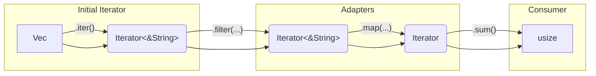

# Iterators

---

## Iterators

An **iterator** is a stateful data structure producing a sequence of values one at a time via its `next(&mut self) -> Option<Self::Item>` method, which returns `Some(value)` or `None` when exhausted. Iterators can be created from containers (`Vec`, arrays) or programmatically (ranges, generators).

**Iterator adaptors** are methods that create a new iterator from an existing one, transforming the sequence (filtering, mapping) without consuming the original iterator or the source data (lazy evaluation). Standard libraries provide iterators for uniform access to data sources.

Using iterators offers advantages over manual loops like indexing: **code compactness, readability, maintainability, potential efficiency (due to laziness), and abstraction**.

**Comparison Example:**

*   **`for` loop with indexing (`for.rs`):**

```rust
let v1 = vec![1, 2, 3, 4, 5, 6];
let mut v2 = Vec::<String>::new();
for i in 0..v1.len() {
    if v1[i] % 2 != 0 { continue; } // Skip odd
    v2.push(format!("a{}", v1[i])); // Format even
}
println!("{:?}", v2); // ["a2", "a4", "a6"]
```

*   **Equivalent using iterators (`iter0.rs`):**

```rust
let v1 = vec![1, 2, 3, 4, 5, 6];
let v2: Vec<String> = v1.iter() // &i32 iterator
      .filter(|val|{ *val % 2 == 0 }) // Filter &i32
      .map(|val| format!("a{}", val)) // Map &i32 to String
      .collect(); // Collect into Vec<String>
println!("{:?}", v2); // ["a2", "a4", "a6"]
```

---

## Iterator Characteristics

*   **Uniform Access:** Consistent data processing interface.
*   **Lazy Evaluation:** Computation happens only when `next()` is called by a consumer.
*   **Parallel Processing:** Possible with suitable libraries/adaptors.
*   **Flexibility through Chaining:** Adaptors can be chained for complex pipelines.

---

## Data Sources

Iterators source data from:

*   **Data Containers:** Traversing existing elements.
*   **Generators:** Producing data on demand.

<p align="center">

```rust
use rand::Rng;

fn main() {
    // From a range (generator)
    let v1: Vec<i32> = (1..10).collect(); // Generates 1-9

    // From a range (structure) + generator (in map)
    let numeri: Vec<u32> = (0..10) // Range provides structure (10 items)
        .map(|_| rand::thread_rng().gen_range(1..=100)) // Map each item to a random number (generator)
        .collect(); // Collect 10 random numbers

    println!("{:?} \n{:?}", v1, numeri);
}
```

</p>

---

## Iterators in Rust: The `Iterator` Trait

Any type implementing `std::iter::Iterator` is an iterator.

```rust
trait Iterator {
    type Item; // Type of items produced
    fn next(&mut self) -> Option<Self::Item>;
    // ... other methods ...
}
```

`next` takes `&mut self` to modify the iterator's internal state (position, etc.).

---

## Iterators and Ownership

Containers provide methods to create iterators, controlling ownership:

*   **`iter()`:** Borrows immutably, yields **immutable references** (`&Item`). Doesn't consume container.
*   **`iter_mut()`:** Borrows mutably, yields **mutable references** (`&mut Item`). Doesn't consume container. Allows in-place modification.
*   **`into_iter()`:** **Consumes** container, yields **owned values** (`Item`).

---

## `iter()` Example (`iter.rs`)

Iterating by immutable reference.

<p align="center">

```rust
fn main() {
    let numbers = [1, 2, 3, 4, 5]; // Array

    println!("Using numbers.iter():");
    for num_ref in numbers.iter() { // &i32
        println!("{}", num_ref); // Prints 1-5
    }

    println!("\nOriginal array: {:?}", numbers); // Still usable
}
```

</p>

---

## `iter_mut()` Example (`itermut1.rs`)

Iterating by mutable reference to modify elements.

<p align="center">

```rust
fn main() {
    let mut numbers = vec![1, 2, 3, 4, 5]; // Mutable vector

    println!("Using numbers.iter_mut():");
    for num_mut_ref in numbers.iter_mut() { // &mut i32
        *num_mut_ref += 1; // Modify element
    }
    println!("Vector after increment: {:?}", numbers); // [2, 3, 4, 5, 6]
}
```

</p>

---

## `into_iter()` Example (`intoiter1.rs`)

Iterating over owned values, consuming the source.

<p align="center">

```rust
fn main() {
    let v = vec![10.0, 30.0, 50.0, 90.0]; // f64 vector
    let mut sum = f64::default();

    println!("Consuming v with into_iter():");
    for num in v.into_iter() { // num is f64 (owned)
        sum += num;
    }
    println!("Sum calculated via into_iter: {}", sum); // 180.0

    // println!("v after into_iter: {:?}", v); // ERROR: value borrowed here after move
}
```

</p>

---

## `next()` Example (`next.rs`)

Explicit calls to `next()` manage iterator state.

<p align="center">

```rust
fn main() {
    let mut numbers = vec![1, 2, 3, 4, 5];

    println!("Getting first element with iter().next():");
    let mut iter_ref = numbers.iter(); // Iterator<&i32>
    if let Some(first_num_ref) = iter_ref.next() { // first_num_ref is &i32
        println!("Il primo numero e' {} ", first_num_ref); // 1
    }

    println!("\nGetting and modifying first element with iter_mut().next():");
    let mut iter_mut_ref = numbers.iter_mut(); // Iterator<&mut i32>
    if let Some(first_num_mut_ref) = iter_mut_ref.next() { // first_num_mut_ref is &mut i32
        *first_num_mut_ref += 1; // Modify vector element
        println!("Modified first element.");
    }

    println!("\nVector after modification:");
    for num_ref in numbers.iter() { // Use new iter() to show state
        println!("{}", num_ref); // 2, 2, 3, 4, 5
    }
}
```

</p>

---

## Custom Iterator Example (Counter)

Implement the `Iterator` trait (`next` method) to create custom iterators.

<p align="center">

```rust
struct Contatore { count: usize, max: usize }

impl Iterator for Contatore {
    type Item = usize;
    fn next(&mut self) -> Option<Self::Item> {
        if self.count < self.max {
            let current_val = self.count;
            self.count += 1;
            Some(current_val)
        } else {
            None
        }
    }
}

fn main() {
    let mut contatore = Contatore { count: 0, max: 10 };
    println!("Using custom iterator with while let Some:");
    while let Some(i) = contatore.next() {
        println!("{}", i); // Prints 0-9
    }
    println!("Calling next() after exhaustion: {:?}", contatore.next()); // None
}
```

</p>

---

## Challenge: Iterator Consumption

**CHALLENGE!** 🦀

Consider `for num in v` which implicitly calls `v.into_iter()`. When `break` is used, the loop exits early.

<p align="center">

```rust
#[derive(Debug)] struct S(i32); // Simple struct

impl Drop for S { // Implement Drop to see when S is destroyed
    fn drop(&mut self) { println!("Dropping S ({})", self.0); }
}

fn main() {
    let v = vec![S(1), S(2), S(3), S(4), S(5), S(6), S(7), S(8), S(9), S(10)];
    println!("Vector created.");
    println!("Starting loop (implicit into_iter)...");
    for num in v { // Calls v.into_iter(), consumes v. `num` gets owned S.
        println!("Processing num: {:?}", num);
        if num.0 % 3 == 0 {
            println!("Breaking loop at num: {:?}", num);
            break;
        } // `num` goes out of scope here, Dropping S is printed for S(1), S(2).
    } // `num` (S(3)) goes out of scope here, Dropping S(3) is printed.
    println!("Loop finished or broken.");
    // `v` was consumed. The iterator created by into_iter still holds S(4) to S(10).
} // The iterator goes out of scope here, Dropping S(4) to S(10) are printed.
```

</p>

**Question:** What happens to vector `v` after `break`? Can it still be used?

**Answer:** The vector `v` is consumed by the `into_iter()` call implicit in the `for` loop. It cannot be used after the loop, regardless of whether the loop completed naturally or was exited early with `break`. The elements yielded *before* the `break` are dropped at the end of each iteration. The element that caused the `break` is dropped after the loop body finishes. The remaining elements, still held by the iterator internally, are dropped when the iterator itself goes out of scope (at the end of `main` in this example).

---

## Iterable Types (`IntoIterator`)

A type is **iterable** if it implements `std::iter::IntoIterator`, which defines how it converts *into* an iterator using `fn into_iter(self) -> Self::IntoIter`.

---

## `IntoIterator` Example 1 (Pixel) (`intoiterator1.rs`)

Making a struct iterable over its components.

<p align="center">

```rust
struct Pixel { r: i8, g: i8, b: i8 }

impl IntoIterator for Pixel {
    type Item = i8;
    type IntoIter = std::array::IntoIter<i8, 3>; // Iterator over a 3-element array

    fn into_iter(self) -> Self::IntoIter {
        [self.r, self.g, self.b].into_iter() // Create array, use its into_iter()
    }
}

fn main() {
    let pixel = Pixel { r: 54, g: 23, b: 74 };
    let mut iter = pixel.into_iter(); // Consumes pixel
    println!("Explicitly calling next():");
    if let Some(c) = iter.next() { println!("Il primo componente è: {}", c); } // 54
    if let Some(c) = iter.next() { println!("Il secondo componente è: {}", c); } // 23
    if let Some(c) = iter.next() { println!("Il terzo componente è: {}", c); } // 74
    if iter.next().is_none() { println!("Non ci sono più componenti."); } // Prints this

    let pixel2 = Pixel { r: 10, g: 20, b: 30 };
    println!("\nImplicit iteration with for loop:");
    for component in pixel2 { // Implicit into_iter(), consumes pixel2
         println!("Componente: {}", component); // Prints 10, 20, 30
    }
}
```

</p>

---

## `IntoIterator` Example 2 (Libro) (`intoiterator3.rs`)

Making a struct with a `Vec` field iterable by delegating to the `Vec`'s iterator.

<p align="center">

```rust
struct Libro { titolo: String, pagine: Vec<String>, } // Book struct

impl IntoIterator for Libro {
    type Item = String; // Yields String (pages)
    type IntoIter = std::vec::IntoIter<String>; // Reuses Vec's iterator

    fn into_iter(self) -> Self::IntoIter {
        self.pagine.into_iter() // Consume the Vec field and return its iterator
    }
}

fn main() {
    let mio_libro = Libro {
        titolo: String::from("L'isola del tesoro"),
        pagine: vec![String::from("Capitolo 1"), String::from("Capitolo 2")],
    };
    println!("Iterazione implicita con il ciclo for:");
    for pagina in mio_libro { // Implicit into_iter(), consumes mio_libro
        println!("Pagina: {}", pagina); // Prints pages
    }
    // println!("Titolo: {}", mio_libro.titolo); // ERROR: use of moved value

    let altro_libro = Libro {
        titolo: String::from("Alice"),
        pagine: vec![String::from("Prologo")],
    };
    println!("\nIterazione esplicita con while let:");
    let mut iteratore_pagine = altro_libro.into_iter(); // Consumes altro_libro
    while let Some(pagina) = iteratore_pagine.next() {
        println!("Pagina (tramite iteratore): {}", pagina); // Prints pages
    }
}
```

</p>

---

## Terminology

*   **Iterator:** Stateful, implements `Iterator` (has `next`).
*   **Container:** Holds values, usually iterable.
*   **Lazy evaluation:** Delays work until results are needed.
*   **Eager evaluation:** Performs work immediately.
*   **Iterable:** Implements `IntoIterator` (can produce iterator).
*   **Item:** A single value from an iterator (`Iterator::Item`).
*   **Adapter:** Creates a new, transformed iterator from an existing one (lazy).
*   **Consumer:** Consumes an iterator to produce a result or side effect (eager).

---

## Adapters

Adapters are methods on `Iterator` that return a new, transformed iterator. They are **lazy** and **chainable**. Execution starts with a final **consumer**.

<p align="center">



</p>

**Common Adapters:** `map`, `filter`, `filter_map`, `flatten`, `flat_map`, `take`, `take_while`, `skip`, `skip_while`, `peekable`, `fuse`, `rev`, `inspect`, `chain`, `enumerate`, `zip`, `copied`, `cloned`, `cycle`.

---

## `map()` Example (`map1.rs`)

Applies a function to each item.

<p align="center">

```rust
fn main() {
    let numbers = vec![1, 2, 3, 4, 5];
    let doubled_iter = numbers.iter().map(|&x| x * 2); // &i32 -> i32
    println!("Doubled numbers:");
    for doubled_value in doubled_iter { println!("{}", doubled_value); } // 2, 4, 6, 8, 10
}
```

</p>

---

## `filter()` Example (`filter1.rs`)

Keeps items matching a predicate.

<p align="center">

```rust
use std::fs::File;
use std::io::{self, BufReader, BufRead}; // BufRead for .lines()
use std::io::Write; // For write

fn main() -> io::Result<()> {
    let path = "myfile.txt"; // Use a .txt extension for clarity

    // Create and write some lines to the file
    let mut output_file = File::create(path)?;
    writeln!(output_file, "Rust")?; // writeln! adds a newline
    writeln!(output_file, "❤️")?;  // Using writeln! for simplicity
    writeln!(output_file, "Fun")?;
    output_file.flush()?; // Ensure content is written

    // Open the file for reading
    let input_file = File::open(path)?;
    // Wrap the file reader in a BufReader
    let buffered_reader = BufReader::new(input_file);

    println!("Reading file line by line:");
    // Iterate over the lines of the file
    for line_result in buffered_reader.lines() {
        // lines() returns a Result for each line, as reading can fail or lines might be too large
        let line_content = line_result?; // Propagate error or unwrap Ok value
        println!("{}", line_content);
    }
    // Output:
    // Rust
    // ❤️
    // Fun

    Ok(())
}
```

</p>

*(Icon: A simple database cylinder labeled `filter1.rs`)*

---

## `filter_map()` Example (`filtermap1.rs`)

Filters and maps using a closure returning `Option`.

<p align="center">

```rust
fn main() {
    let numbers = vec![1, 2, 3, 4, 5];
    let even_numbers_iter = numbers.iter().filter_map(|&x| { // &i32 -> Option<i32>
        if x % 2 == 0 { Some(x) } else { None }
    }); // Yields i32 (unwrapped from Some)
    println!("Even numbers found via filter_map:");
    for n in even_numbers_iter { println!("{:?}", n); } // 2, 4
}
```

</p>

---

## `flatten()` Example (`flatten.rs`)

Flattens nested iterables.

<p align="center">

```rust
fn main() {
    let nested_numbers = vec![vec![1, 2, 3], vec![4, 5, 6], vec![7, 8, 9]]; // Vec<Vec<i32>>
    let flattened_numbers_iter = nested_numbers.into_iter().flatten(); // Vec<i32> -> i32
    println!("Flattened numbers:");
    for n in flattened_numbers_iter { println!("Numeri appiattiti: {:?}", n); } // 1 to 9
}
```

</p>

---

## `flat_map()` Example (`flatmap.rs`)

Maps to iterators and flattens.

<p align="center">

```rust
fn main() {
    let numbers = vec![1, 2, 3, 4];
    let new_numbers_iter = numbers.iter() // &i32
        .flat_map(|&x| vec![x, x * x, x * x * x].into_iter()); // &i32 -> Iterator<i32> -> i32
    println!("Numbers after flat_map:");
    for n in new_numbers_iter { println!("{:?}", n); } // 1,1,1, 2,4,8, ...
}
```

</p>

---

## `take()` Example (`take.rs`)

Yields the first `n` elements.

<p align="center">

```rust
fn main() {
    let numbers = vec![1, 2, 3, 4, 5];
    let first_three_iter = numbers.iter().take(3); // &i32 -> &i32 (limited)
    println!("First three numbers:");
    for n_ref in first_three_iter { println!("{:?}", n_ref); } // 1, 2, 3
}
```

</p>

---

## `take_while()` Example (`takewhile.rs`)

Yields elements while a predicate is true.

<p align="center">

```rust
fn main() {
    let numbers = vec![5, 10, 15, 20, 22, 30]; // 22 breaks pattern
    let multiples_of_five_iter = numbers.iter() // &i32
        .take_while(|&num| *num % 5 == 0); // Takes until false (&22)
    println!("Numbers taken while multiple of 5:");
    for n_ref in multiples_of_five_iter { println!("Multipli di 5: {:?}", n_ref); } // 5, 10, 15, 20
}
```

</p>

---

## `skip()` Example (`skip.rs`)

Skips the first `n` elements.

<p align="center">

```rust
fn main() {
    let numbers = vec![1, 4, 5, 6, 7];
    let skipped_iter = numbers.iter().skip(2); // Skip 1, 4
    println!("Numbers after skipping the first two:");
    for n_ref in skipped_iter { println!("Valori dopo i primi 2: {:?}", n_ref); } // 5, 6, 7
}
```

</p>

---

## `skip_while()` Example (`skipwhile.rs`)

Skips elements while a predicate is true, yields from the first false.

<p align="center">

```rust
fn main() {
    let numbers = vec![1, 3, 5, 7, 2, 7, 8, 9, 10]; // Starts with odds
    let skipped_iter = numbers.iter()
        .skip_while(|&num| *num % 2 != 0); // Skips 1, 3, 5, 7. Starts yielding from 2.
    println!("Numbers starting from the first even number:");
    for n_ref in skipped_iter { println!("Tutti i numeri a partire dal primo pari: {:?}", n_ref); } // 2, 7, 8, 9, 10
}
```

</p>

---

## `peekable()` Example (`peekable1.rs`)

Creates an iterator that allows peeking at the next element without consuming it.

<p align="center">

```rust
use std::fs::File;
use std::io::{self, BufReader, Result as IoResult, BufRead}; // Alias Result for clarity

fn main() -> IoResult<()> {
    // Open a file for reading (ensure example.txt exists)
    let file = File::open("example.txt")?;

    // Create a BufReader with a buffer size of 1024 bytes
    let mut buf_reader = BufReader::with_capacity(1024, file);

    // Example of use: read one line from the file
    let mut line = String::new();
    // read_line appends to the string, so it should be empty initially for the first line.
    // It returns the number of bytes read (including the newline, if present).
    let num_bytes_read = buf_reader.read_line(&mut line)?;

    println!("Bytes read: {}, Line content: '{}'", num_bytes_read, line.trim_end()); // trim_end to remove newline for printing

    Ok(())
}
```

</p>

*(Icon: A simple database cylinder labeled `peekable1.rs`)*

---

## `fuse()` Example (`fuse1.rs`)

Ensures `None` is always returned after the first time `next()` returns `None`.

<p align="center">

```rust
use std::fs::File;
use std::io::{self, Read};

fn main() -> io::Result<()> {
    // Open two files in read mode
    // Ensure file1.txt and file2.txt exist
    let file1 = File::open("file1.txt")?;
    let file2 = File::open("file2.txt")?;

    // Concatenate the two readers
    let mut chained_reader = file1.chain(file2);

    // Declare a buffer to hold the read data
    let mut buffer = Vec::new(); // Using Vec<u8> for dynamic sizing

    // Read the concatenated data into the buffer
    chained_reader.read_to_end(&mut buffer)?;

    // Convert the buffer to a UTF-8 string and print it
    match String::from_utf8(buffer) {
        Ok(content) => println!("Combined content:\n{}", content),
        Err(_) => println!("Error decoding content as UTF-8"),
    }
    Ok(())
}
```

</p>

*(Icon: A simple database cylinder labeled `fuse1.rs`)*

---

## `rev()` Example (`rev1.rs`)

Reverses the order of elements (requires `DoubleEndedIterator`).

<p align="center">

```rust
use std::fs::File;
use std::io::{self, Read};

fn main() -> io::Result<()> {
    // Open the file in read mode
    let file = File::open("test.txt")?; // Ensure test.txt has at least 10 bytes

    // Create a new reader that reads only the first 10 bytes from the original file
    let mut limited_reader = file.take(10);

    // Declare a buffer to hold the read data
    let mut buffer = Vec::new();

    // Read the first 10 bytes from the file and store them in the buffer
    limited_reader.read_to_end(&mut buffer)?;

    // Convert the buffer to a UTF-8 string and print it
    match String::from_utf8(buffer) {
        Ok(content) => println!("First 10 bytes:\n'{}'", content),
        Err(_) => println!("Error decoding content as UTF-8 (or file was < 10 bytes)"),
    }
    Ok(())
}
```

</p>

*(Icon: A simple database cylinder labeled `rev1.rs`)*

---

## `inspect()` Example (`inspect1.rs`)

Performs a side effect (closure execution) for each element without modifying it (useful for debugging).

<p align="center">

```rust
fn main() {
    let numbers = vec![1, 2, 3, 4, 5];
    let doubled_numbers_iter = numbers.iter() // &i32
        .inspect(|&x| println!("Inspecting Elemento: {}", x)) // &i32 -> Inspect<&i32>
        .map(|&x| x * 2); // Inspect<&i32> -> Map<Inspect<&i32>, _> (yielding i32)

    println!("\nFinal doubled results:");
    for n in doubled_numbers_iter { println!("Raddoppiato: {:?}", n); } // Prints interleaved
}
```

</p>

---

## `chain()` Example (`chain1.rs`)

Concatenates two iterators yielding the same item type.

<p align="center">

```rust
use std::fs::File;
use std::io::{self, BufReader, Result as IoResult, BufRead};

fn main() -> IoResult<()> {
    // Open a file for reading (ensure example.txt has at least two lines)
    let file = File::open("example.txt")?;

    // Create a BufReader
    let mut buf_reader = BufReader::with_capacity(1024, file);

    // Read one line from the file
    let mut line = String::new();
    buf_reader.read_line(&mut line)?;
    println!("First line: {}", line.trim_end());

    // To read the next line into the same 'line' variable, clear it first
    line.clear();
    buf_reader.read_line(&mut line)?;
    println!("Second line: {}", line.trim_end());

    Ok(())
}
```

</p>

*(Icon: A simple database cylinder labeled `chain1.rs`)*

---

## `chars()` Example (`chain_chars.rs`)

`chars()` is a method on `&str` returning `Iterator<Item=char>`. This example combines `flat_map` with `chars`.

<p align="center">

```rust
fn main() {
    let words = vec!["hello", "world"]; // &str
    let chars_str = "123";             // &str

    let chained_sequence_iter = words.iter() // &&str
        .flat_map(|word| word.chars()) // &&str -> Iterator<char> -> char
        .chain(chars_str.chars());     // char + Iterator<char> -> char

    println!("Chained characters:");
    for n in chained_sequence_iter { println!("Carattere: {:?}", n); } // 'h','e','l','l','o','w','o','r','l','d','1','2','3'
}
```

</p>

---

## `enumerate()` Example (`enumerate.rs`)

Pairs elements with their 0-based index.

<p align="center">

```rust
fn main() {
    let my_vec = vec!["a", "b", "c"];
    let mut enumerated_iter = my_vec.iter().enumerate(); // &&str -> (usize, &&str)

    println!("Enumerated elements:");
    while let Some((index, value_ref)) = enumerated_iter.next() {
        println!("Indice: {}, Valore: {}", index, value_ref); // 0:a, 1:b, 2:c
    }
}
```

</p>

---

## `zip()` Example (`zip.rs`)

Combines two iterators into pairs (`(item1, item2)`), stopping when the shortest is exhausted.

<p align="center">

```rust
fn main() {
    let numbers = vec![1, 2, 3];
    let letters = vec!['a', 'b', 'c']; // Same length for simplicity
    let mut zipped_iter = numbers.iter().zip(letters.iter()); // &i32 + &char -> (&i32, &char)

    println!("Zipped elements:");
    while let Some((number_ref, letter_ref)) = zipped_iter.next() {
        println!("Numero: {}, Lettera: {}", number_ref, letter_ref); // 1:a, 2:b, 3:c
    }
}
```

</p>

---

## `by_ref()` Example (`byref.rs`)

Gets a mutable reference to the iterator allowing it to be used by subsequent adaptors without consuming the original iterator.

<p align="center">

```rust
use std::fs::File;
use std::io::{BufReader, BufRead, Result as IoResult};
use std::str; // For from_utf8

fn main() -> IoResult<()> {
    let file = File::open("divinacommedia.txt")?; // "divinecomedy.txt"
    let mut reader = BufReader::new(file);
    let mut total_bytes_read = 0;

    loop {
        // 1. Get a slice of the buffered data
        let buffer_slice = reader.fill_buf()?;
        let num_bytes_in_buffer = buffer_slice.len();

        // 2. Check if EOF
        if num_bytes_in_buffer == 0 {
            break; // End of file
        }

        // 3. Process the data in the buffer (e.g., print as UTF-8)
        match str::from_utf8(buffer_slice) {
            Ok(s) => print!("{}", s), // Print the valid UTF-8 part
            Err(_) => {
                // Handle invalid UTF-8 if necessary, or print a warning
                // For simplicity, we might just print a warning and consume.
                // A more robust approach would find the last valid UTF-8 char boundary.
                eprintln!("\nWarning: Invalid UTF-8 encountered in buffer. Consuming raw bytes.");
                // Or print buffer_slice directly for debugging
            }
        }

        // 4. Tell the BufReader how many bytes we processed from this slice
        reader.consume(num_bytes_in_buffer);
        total_bytes_read += num_bytes_in_buffer;
    }

    println!("\nReading completed. Total bytes read: {}", total_bytes_read);
    Ok(())
}
```

</p>

*(Icon: A simple database cylinder labeled `byref.rs`)*

---

## `cloned()` Example (`cloned1.rs`)

Yields cloned values of `Clone` types from references (`&T` to `T`).

<p align="center">

```rust
fn main() {
    let words = vec!["hello".to_string(), "world".to_string()]; // Vec<String>
    let cloned_iter = words.iter().cloned(); // &String -> String (cloned)
    println!("Cloned words:");
    for word in cloned_iter { println!("Parola: {}", word); } // hello, world (owned copies)
    println!("\nOriginal words (still available):");
    for word_ref in words.iter() { println!("Parola: {}", word_ref); } // hello, world (original)
}
```

</p>

---

## `copied()` Example (`copied1.rs`)

Yields copies of `Copy` types from references (`&T` to `T`).

<p align="center">

```rust
fn main() {
    let tuple_vec = vec![(1, 'a'), (2, 'b')]; // Vec<(i32, char)>, (i32, char) is Copy
    let copied_iter = tuple_vec.iter().copied(); // &(i32, char) -> (i32, char) (copied)
    println!("Copied tuples:");
    for tuple_val in copied_iter { println!("Tuple: {:?}", tuple_val); } // (1, 'a'), (2, 'b')
    println!("\nOriginal tuples:");
    for tuple_ref in tuple_vec.iter() { println!("Tuple: {:?}", tuple_ref); } // (1, 'a'), (2, 'b')
}
```

</p>

---

## `cycle()` Example (`cycle.rs`)

Repeats the sequence indefinitely (requires `Clone`).

<p align="center">

```rust
fn main() {
    let numbers = vec![1, 2, 3]; // Vec<i32>::iter() is Clone
    let mut cycle_iter = numbers.iter().cycle(); // &i32 -> Cycle<&i32>
    println!("First 5 elements from cycling iterator:");
    for _ in 0..5 { if let Some(num_ref) = cycle_iter.next() { println!("Numero: {}", num_ref); } } // 1, 2, 3, 1, 2
}
```

</p>

---

## Consumers

Consumers consume the iterator, triggering its execution and producing a final result or side effect.

**Common Consumers:** `collect`, `for_each`, `try_for_each`, `nth`, `all`, `any`, `find`, `count`, `sum`, `product`, `max`, `max_by_key`, `min`, `min_by_key`, `position`, `rposition`, `last`, `fold`, `try_fold`, `find_map`, `partition`, `unzip`, `cmp`, `eq`, `ne`, `lt`, `le`, `gt`, `ge`.

---

## `collect()` Example (`collect.rs`)

Gathers elements into a collection.

<p align="center">

```rust
fn main() {
    let numbers = vec![1, 2, 3, 4, 5];
    let even_numbers: Vec<_> = numbers.iter() // &i32
        .filter(|&x| x % 2 == 0) // &i32 (2, 4)
        .collect();              // Vec<&i32>
    println!("Numeri pari (as references): {:?}", even_numbers); // [&2, &4]

    let owned_even_numbers: Vec<i32> = numbers.iter()
        .filter(|&x| x % 2 == 0)
        .copied() // &i32 -> i32
        .collect(); // Vec<i32>
    println!("Numeri pari (owned): {:?}", owned_even_numbers); // [2, 4]
}
```

</p>

---

## `for_each()` Example (`foreach.rs`)

Executes a closure for each element (side effect).

<p align="center">

```rust
use std::fs::File;
use std::io::{self, Write}; // For Write trait and io::Result

fn main() -> io::Result<()> {
    let mut file = File::create("output.txt")?;

    // Data to write to the file (as a byte slice)
    let data = b"Hello, world!\n"; // b"..." creates a byte string literal

    let num_writes = 5; // Number of times to write the data to the file
    let mut total_bytes_written = 0;

    for _ in 0..num_writes {
        // Write the data to the file and check the return value
        match file.write(data) {
            Ok(bytes_written_this_call) => {
                total_bytes_written += bytes_written_this_call; // Update total bytes written
                // Note: write() might not write all of 'data' in one go,
                // though for small 'data' it usually does.
            }
            Err(err) => {
                eprintln!("Error during writing to file: {}", err);
                // Decide if to break or continue
            }
        }
    }

    // Print the total number of bytes successfully written to the file
    println!("Total bytes written to the file: {}", total_bytes_written);
    // May need to call file.flush()?; here to ensure data is on disk before program ends.
    Ok(())
}
```

</p>

*(Icon: A simple database cylinder labeled `foreach.rs`)*

---

## `try_for_each()` Example (`tryforeach.rs`)

Executes a fallible closure, stopping on `Err` or `None`.

<p align="center">

```rust
fn main() {
    let strings = vec!["programming".to_string(), "computer".to_string(), "short".to_string()];
    println!("Checking string lengths using try_for_each:");
    let result: Result<(), &str> = strings.iter() // &String
        .try_for_each(|s| -> Result<(), &str> { // &String -> Result<(), &str>
            if s.len() > 5 { println!("La lunghezza di '{}' è maggiore di 5.", s); Ok(()) }
            else { println!("'{}' is too short, stopping.", s); Err("String length <= 5") }
        });
    println!("\nIteration result:");
    match result { Ok(()) => println!("All long."), Err(e) => println!("Errore: {}", e), } // Errore: String length <= 5
}
```

</p>

---

## `nth()` Example (`nth.rs`)

Gets the element at index `n` (`Option`), consuming elements up to `n`.

<p align="center">

```rust
fn main() {
    let numbers = vec![10, 20, 30, 40, 50];
    println!("Getting the 3rd element (index 2):");
    match numbers.iter().nth(2) { // New iterator, &i32 -> Option<&i32>
        Some(&number) => println!("Terzo elemento: {}", number), // 30
        None => println!("Nessun elemento trovato all'indice specificato."),
    }
    println!("\nGetting the 10th element (index 9):");
    match numbers.iter().nth(9) { // New iterator
        Some(&number) => println!("Tenth element: {}", number),
        None => println!("Nessun elemento trovato all'indice specificato."), // None
    }
}
```

</p>

---

## `all()` Example (`all.rs`)

Checks if a predicate is true for all elements (`bool`, short-circuits on false).

<p align="center">

```rust
fn main() {
    let numbers1 = vec![2, 4, 6, 8, 10]; // All even
    let numbers2 = vec![2, 4, 6, 7, 8, 10]; // Contains odd
    let all_even1 = numbers1.iter().all(|&x| x % 2 == 0); // &i32 -> bool
    println!("Are all elements in {:?} even? {}", numbers1, all_even1); // true
    let all_even2 = numbers2.iter().all(|&x| x % 2 == 0); // &i32 -> bool
    println!("Are all elements in {:?} even? {}", numbers2, all_even2); // false (stops at 7)
}
```

</p>

---

## `any()` Example (`any.rs`)

Checks if a predicate is true for any element (`bool`, short-circuits on true).

<p align="center">

```rust
fn main() {
    let words1 = vec!["hello", "world", "rust", "programming"]; // Has long word
    let words2 = vec!["hi", "rust", "go"]; // No long word
    let any_long_word1 = words1.iter().any(|&word| word.len() > 5); // &&str -> bool
    if any_long_word1 { println!("In {:?}: At least one word > 5.", words1); } // Prints this
    else { println!("In {:?}: No word > 5.", words1); }

    let any_long_word2 = words2.iter().any(|&word| word.len() > 5); // &&str -> bool
    if any_long_word2 { println!("In {:?}: At least one word > 5.", words2); }
    else { println!("In {:?}: No word > 5.", words2); } // Prints this
}
```

</p>

---

## `max()` Example (`max.rs`)

Finds the maximum element (`Option`), requires `Ord`.

<p align="center">

```rust
fn main() {
    let numbers = vec![10, 30, 20, 50, 40];
    let max_number = numbers.iter().max(); // &i32 -> Option<&i32>
    match max_number {
        Some(max_ref) => println!("Il massimo elemento è: {}", max_ref), // 50
        None => println!("L'iteratore è vuoto."),
    }
    let empty_vec: Vec<i32> = vec![];
    let max_empty = empty_vec.iter().max();
    match max_empty {
        Some(max_ref) => println!("Il massimo elemento è: {}", max_ref),
        None => println!("L'iteratore vuoto non ha massimo."), // Prints this
    }
}
```

</p>

---

## `max_by_key()` Example (`maxbykey.rs`)

Finds the element with the maximum key from a closure.

<p align="center">

```rust
fn main() {
    let words = vec!["hello", "world", "rust", "programming"];
    let longest_word_option = words.iter().max_by_key(|word| word.len()); // &&str -> usize -> Option<&&str>
    match longest_word_option {
        Some(longest_ref) => println!("La stringa più lunga è: {}", longest_ref), // programming
        None => println!("L'iteratore è vuoto."),
    }
}
```

</p>

---

## `sum()` Example (`sum.rs`)

Calculates the sum of elements (requires `Sum`).

<p align="center">

```rust
fn main() {
    let numbers = vec![1, 2, 3, 4, 5];
    let sum_val: i32 = numbers.iter().sum(); // &i32 -> i32 (requires Sum)
    println!("La somma di tutti gli elementi è: {}", sum_val); // 15
}
```

</p>

---

## `find()` Example (`find.rs`)

Finds the first element matching a predicate (`Option`).

<p align="center">

```rust
fn main() {
    let numbers = vec![2, 4, 6, 7, 8, 9]; // First odd is 7
    let mut numbers_iter_ref = numbers.iter(); // Need mut for find
    let first_odd_option = numbers_iter_ref.find(|&x| *x % 2 != 0); // &i32 -> Option<&i32>
    match first_odd_option {
        Some(odd_ref) => println!("Il primo numero dispari è: {}", odd_ref), // 7
        None => println!("Nessun numero dispari trovato."),
    }
}
```

</p>

---

## `count()` Example (`count.rs`)

Counts the total number of elements.

<p align="center">

```rust
fn main() {
    let numbers = vec![2, 4, 6, 7, 8, 9];
    let odd_count = numbers.iter() // &i32
                    .filter(|&x| *x % 2 != 0) // Filter odds (&7, &9)
                    .count(); // Count filtered iterator
    println!("Il numero di dispari è: {}", odd_count); // 2

    let total_count = numbers.iter().count(); // Count all
    println!("Il numero totale di elementi è: {}", total_count); // 6
}
```

</p>

---

## `product()` Example (`product.rs`)

Calculates the product of elements (requires `Product`).

<p align="center">

```rust
fn main() {
    let numbers = vec![1, 2, 3, 4, 5];
    let product_val: i32 = numbers.iter().product(); // &i32 -> i32 (requires Product)
    println!("Il prodotto di {:?} è {}", numbers, product_val); // 120
}
```

</p>

---

## `position()` Example (`position.rs`)

Finds the index (`Option<usize>`) of the first element matching a predicate.

<p align="center">

```rust
fn main() {
    let numbers = vec![1, 3, 4, 6, 5]; // First even is 4 at index 2
    let mut numbers_iter_ref = numbers.iter(); // Need mut for position
    let index_option = numbers_iter_ref.position(|&x| x % 2 == 0); // &i32 -> Option<usize>
    match index_option {
        Some(i) => println!("The first even number is at index {}", i), // 2
        None => println!("No even number found"),
    }
}
```

</p>

---

## `rposition()` Example (`rposition.rs`)

Finds the index (`Option<usize>`) of the last element matching a predicate (requires `DoubleEndedIterator`).

<p align="center">

```rust
fn main() {
    let numbers = vec![1, 2, 3, 4, 5, 6]; // Last even is 6 at index 5
    let mut numbers_iter_ref1 = numbers.iter(); // Need mut for rposition
    let index_option = numbers_iter_ref1.rposition(|&x| x % 2 == 0); // &i32 -> Option<usize>
    match index_option {
        Some(i) => println!("The last even number is at index {}", i), // 5
        None => println!("No even number found"),
    }
}
```

</p>

---

## `last()` Example (`last.rs`)

Finds the last element (`Option`), efficiently for `DoubleEndedIterator`.

<p align="center">

```rust
fn main() {
    let numbers = vec![1, 2, 3, 4, 5]; // Vec<i32>::iter() is DoubleEndedIterator
    let last_even_option = numbers.iter().filter(|&x| x % 2 == 0).last(); // Filtered: &2, &4. Last: &4
    match last_even_option {
        Some(&number) => println!("L'ultimo numero pari è: {}", number), // 4
        None => println!("Non ci sono numeri pari"),
    }
    let last_element_option = numbers.iter().last(); // Last element: &5
    match last_element_option {
        Some(&number) => println!("L'ultimo elemento è: {}", number), // 5
        None => println!("L'iteratore è vuoto"),
    }
}
```

</p>

---

## `fold()` Example (`fold1.rs`)

Reduces the iterator to a single value using an initial value and an accumulating closure.

<p align="center">

```rust
fn main() {
    let numbers = vec![1, 2, 3, 4, 5];
    let sum = numbers.iter().fold(0, |acc, &x| acc + x); // &i32 -> i32 (sum)
    println!("La somma di tutti gli elementi (using fold) è: {}", sum); // 15
}
```

</p>

---

## `try_fold()` Example (`tryfold.rs`)

Fallible fold, stops and returns `Err` if the closure returns `Err`.

<p align="center">

```rust
fn main() {
    let numbers_ok = vec![2, 3, 4, 5];
    let numbers_err = vec![2, 3, 0, 4, 5]; // Contains zero

    println!("Calculating product with try_fold for numbers_ok:");
    let product_ok: Result<i32, &str> = numbers_ok.iter()
        .try_fold(1, |acc, &x| { // &i32 -> Result<i32, &str>
            if x != 0 { acc.checked_mul(x).ok_or("Overflow") } else { Err("Encountered Zero") }
        });
    match product_ok { Ok(result) => println!("Il prodotto è: {}", result), Err(err) => println!("Errore: {}", err), } // 120

    println!("\nCalculating product with try_fold for numbers_err:");
    let product_err: Result<i32, &str> = numbers_err.iter()
        .try_fold(1, |acc, &x| { // Stops at 0
            if x != 0 { acc.checked_mul(x).ok_or("Overflow") } else { Err("Encountered Zero") }
        });
    match product_err { Ok(result) => println!("Il prodotto è: {}", result), Err(err) => println!("Errore: {}", err), } // Errore: Encountered Zero
}
```

</p>

---

## `find_map()` Example (`findmap.rs`)

Applies an `Option`-returning closure and returns the first `Some` value.

<p align="center">

```rust
fn main() {
    let numbers = vec![1, 2, 3, 4, 5]; // First even is 2
    let mut numbers_iter_ref = numbers.iter(); // Need mut
    let result_option = numbers_iter_ref.find_map(|&x| { // &i32 -> Option<i32>
        if x % 2 == 0 { Some(x * 2) } else { None } // Find first even, map to double
    }); // Returns Option<i32>
    match result_option {
        Some(value) => println!("Il primo numero pari raddoppiato è: {}", value), // 4 (2*2)
        None => println!("Nessun numero pari trovato"),
    }
}
```

</p>

---

## `partition()` Example (`partition1.rs`)

Splits elements into two collections based on a predicate.

<p align="center">

```rust
fn main() {
    let numbers = vec![1, 2, 3, 4, 5];
    let (even_numbers, odd_numbers): (Vec<i32>, Vec<i32>) = numbers
        .into_iter() // i32 iterator (consumes vector)
        .partition(|&x| x % 2 == 0); // i32 -> bool. Partitions into Vec<i32> and Vec<i32>
    println!("Numeri pari: {:?}", even_numbers);   // [2, 4]
    println!("Numeri dispari: {:?}", odd_numbers); // [1, 3, 5]
}
```

</p>

---

## `unzip()` Example (`unzip.rs`)

Separates an iterator of tuples into two collections.

<p align="center">

```rust
fn main() {
    let data = vec![(1, 'a'), (2, 'b'), (3, 'c')]; // Vector of (i32, char)
    let (numbers, characters): (Vec<i32>, Vec<char>) = data.into_iter().unzip(); // (i32, char) -> (Vec<i32>, Vec<char>)
    println!("Numeri: {:?}", numbers);     // [1, 2, 3]
    println!("Caratteri: {:?}", characters); // ['a', 'b', 'c']
}
```

</p>

---

## Comparisons Between Iterators

Iterators can be compared lexicographically element by element, consuming the iterators.

*   `cmp`: Three-way comparison (`Ordering`).
*   `eq`, `ne`, `lt`, `le`, `gt`, `ge`: Boolean comparisons.

---

## `cmp()` Example (`cmp.rs`)

Three-way comparison.

<p align="center">

```rust
use std::cmp::Ordering;
fn main() {
    let numbers1 = vec![1, 2, 3];
    let numbers2 = vec![1, 2, 4]; // Differs at index 2
    let comparison_result = numbers1.iter().cmp(numbers2.iter()); // &i32 -> Ordering
    match comparison_result {
        Ordering::Less => println!("Il primo vettore è minore"), // Prints this (3 < 4)
        Ordering::Equal => println!("I due vettori sono uguali"),
        Ordering::Greater => println!("Il primo vettore è maggiore"),
    }
    let numbers3 = vec![1, 2, 3];
    let numbers4 = vec![1, 2, 3];
    let comparison_equal = numbers3.iter().cmp(numbers4.iter());
    match comparison_equal { Ordering::Equal => println!("Numbers3 == Numbers4"), _ => {} } // Prints this
}
```

</p>