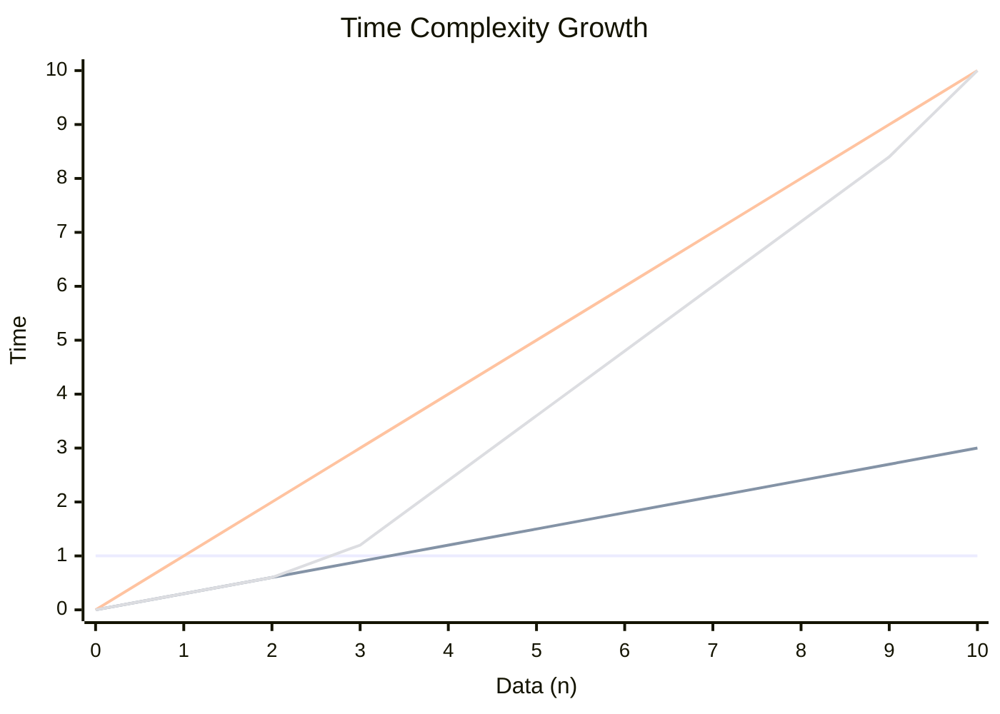
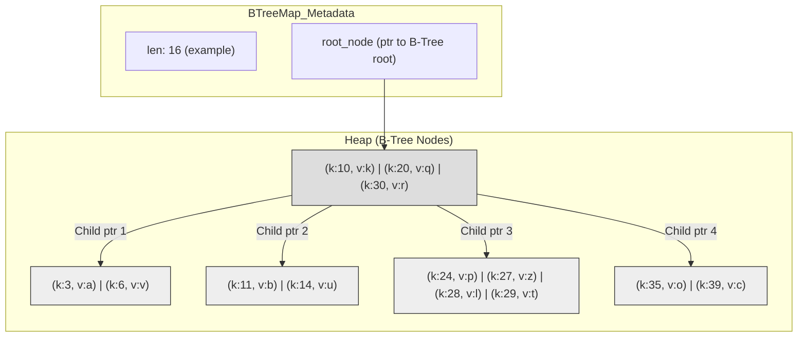

```mermaid
graph TD
    subgraph VecDeque Metadata
        direction LR
        BufferPtr["Buffer Ptr"]
        Capacity["Capacity: 8"]
        StartIdx["Start Index: 5"]
        StopIdx["Stop Index: 2 (logical end, wraps around)"]
    end

    subgraph HeapBuffer ["Heap (Circular Buffer View)"]
        direction LR
        B0[" "] -- D --> B1["D (idx 5, start)"] -- E --> B2["E (idx 6)"] -- A --> B3[" "] -- B --> B4["A (idx 0)"] -- C --> B5["B (idx 1, stop-1)"] -- next_is_B1 --> B6["C (idx 2, stop)"] -- D --> B7[" "]
    end

    BufferPtr --> HeapBuffer;
    StartIdx --> B1;
    StopIdx --> B6;
```

# Data Collections

---

## Data Collections

*   Standard libraries offer data structures simplifying programming via best algorithms for common problems, including:
    *   Ordered Lists
    *   Unique Sets
    *   Key-Value Maps

*   Different implementation strategies yield alternative performance versions.
    *   Programmers must understand data structure complexity properties and when to use one.

---

## Common Data Structures Across Languages

Table compares common data structure implementations in Rust, C++, Java, Python.

<p align="center">

| Description          | Rust                 | C++                      | Java                        | Python              |
| :------------------- | :------------------- | :----------------------- | :-------------------------- | :------------------ |
| Dynamic Array        | `std::Vec<T>`        | `std::vector<T>`         | `java.util.ArrayList<T>`    | `list`              |
| Double-Ended Queue   | `std::VecDeque<T>`   | `std::deque<T>`          | `java.util.ArrayDeque<T>`   | `collections.deque` |
| Doubly Linked List   | `std::LinkedList<T>` | `std::list<T>`*          | `java.util.LinkedList<T>`   | –                   |
| Priority Queue       | `std::BinaryHeap<T>` | `std::priority_queue<T>` | `java.util.PriorityQueue<T>`| `heapq`             |
| Hash Table (Map)     | `std::HashMap<K,V>`  | `std::unordered_map<K,V>`| `java.util.HashMap<K,V>`    | `dict`              |
| Ordered Map          | `std::BTreeMap<K,V>` | `std::map<K,V>`          | `java.util.TreeMap<K,V>`    | –                   |
| Hash Set             | `std::HashSet<T>`    | `std::unordered_set<T>`  | `java.util.HashSet<T>`      | `set`               |
| Ordered Set          | `std::BTreeSet<T>`   | `std::set<T>`            | `java.util.TreeSet<T>`      | –                   |

</p>

*\* C++ also has `std::forward_list<T>` for singly linked lists.*

---

## Time Complexity Overview

Table summarizes typical (average case) operation complexities. `O(1)`: constant, `O(log n)`: logarithmic, `O(n)`: linear (n elements).

<p align="center">

| Description            | Access   | Search    | Insertion | Deletion  |
| :--------------------- | :------- | :-------- | :-------- | :-------- |
| Dynamic Array          | O(1)     | O(n)      | O(n)      | O(n)      |
| Double-Ended Queue   | O(n)     | O(n)      | O(1)      | O(1)      |
| Doubly Linked List   | O(n)     | O(n)      | O(1)      | O(1)      |
| Priority Queue         | O(1)     | -         | O(log n)  | O(log n)  |
| Hash Table (Map/Set) | O(1)     | O(1)      | O(1)      | O(1)      |
| Ordered Map/Set        | O(log n) | O(log n)  | O(log n)  | O(log n)  |
| Hash Set (Access by value) | -        | O(1)      | O(1)      | O(1)      |
| Ordered Set (Access by value)| -        | O(log n)  | O(log n)  | O(log n)  |

</p>

*Note: "Access" means index for arrays, key/value for maps/sets.*

---

## Visualizing Complexity

Graph shows time complexity scaling with data.

<p align="center">



</p>

*   **O(1) (Constant):** Time independent of data size.
*   **O(log n) (Logarithmic):** Time increases slowly with data size.
*   **O(n) (Linear):** Time proportional to data size.
*   **O(n log n):** Time increases more than linearly but less than quadratically.

---

## Rust Common Collection Methods

Rust standard library collections offer common methods:

*   `new()`: Allocates new, empty collection.
*   `len()`: Returns current element count.
*   `clear()`: Removes all elements.
*   `is_empty()`: Returns `true` if empty.
*   `iter()`: Returns iterator over values.
*   `extend()`: Extends with another collection's elements.

All collections implement `IntoIterator`, `FromIterator` traits:

*   `into_iter()`: Converts collection to iterator (often consumes).
*   `collect()`: Creates collection from iterator.

---

## `Vec<T>` (Rust Dynamic Array)

*   `Vec<T>`: resizable `T` sequence, heap allocated.
    *   Create with `Vec::new()` or `vec![...]`.
*   `Vec<T>` internal struct: 3 private values:
    1.  Pointer to heap buffer storing elements.
    2.  Unsigned integer: buffer capacity.
    3.  Unsigned integer: elements stored (length).
*   Primary Rust data collection tool.
    *   Designed for minimal overhead, strong unsafe code interoperability.

---

## `Vec<T>`: Operations

*   **Adding Elements:** `push(...)` adds element end.
    *   If buffer has space, value placed first free, length increments.
*   **Buffer Growth:** If `push` finds buffer full, new larger buffer allocated.
    *   Old buffer contents copied.
    *   New element inserted.
    *   Old buffer deallocated.
*   **Accessing Elements:** Access with `&v[index]` or `get(index)`, `get_mut(index)` methods.
    *   Direct `v[index]` panics if index out of bounds.
    *   `get`, `get_mut` return `Option`: `Some(reference)` if valid, `None` if out of bounds (prevents panics). `get_mut` gives mutable reference.

---

## `Vec<T>`: Common Methods

`Vec<T>` methods access/modify contents:

*   `Vec::with_capacity(n)`: Allocates vector with initial capacity `n`.
*   `capacity()`: Returns current capacity.
*   `push(value)`: Adds element end.
*   `pop()`: Removes/returns last element as `std::Option`, if not empty.
*   `insert(index, value)`: Inserts element at `index`.
*   `remove(index)`: Removes/returns element at `index`.
*   `first()`, `first_mut()`: Return immutable/mutable reference to first element (as `Option`).
*   `last()`, `last_mut()`: Return immutable/mutable reference to last element (as `Option`).
*   `get(index)`, `get_mut(index)`: Return `Option` with immutable/mutable reference at `index`, if exists.
*   `get(range)`, `get_mut(range)`: Return `Option` with slice in `range`, if exists.
*   `retain(predicate)`: Keeps elements satisfying `predicate`.
*   `extend(vec)`: Appends elements from `vec`.

---

## `Vec<T>`: Example 1 (`vec1.rs`)

<p align="center">

```rust
fn main() {
    // Create a new empty vector
    let mut vec = Vec::new();

    // Check if the vector is empty
    println!("Is the vector empty? {}", vec.is_empty()); // Output: Is the vector empty? true

    // Add some elements to the vector
    vec.push(1);
    vec.push(2);
    vec.push(3);

    // Print the length of the vector after adding elements
    println!("New vector length: {}", vec.len()); // Output: New vector length: 3

    // Create an iterator from the vector
    let iter = vec.iter();

    // Iterate over the vector using the iterator
    println!("Elements of the vector:");
    for num in iter {
        println!("{}", num); // Output: 1, 2, 3 (on separate lines)
    }

    // Convert the vector into an iterator and collect the results into a new vector
    let new_vec: Vec<_> = vec.into_iter().collect();

    // Print the new vector
    println!("{:?}", new_vec); // Output: [1, 2, 3]
}
```

</p>

*(Icon: A simple database cylinder labeled `vec1.rs`)*

---

## `Vec<T>`: Example 2 (`vec2.rs`)

<p align="center">

```rust
fn main() {
    // Create a new vector with an initial capacity
    let mut vec = Vec::with_capacity(4);

    // Add elements to the vector (will cause reallocations if capacity is exceeded)
    vec.push(1);
    vec.push(2);
    vec.push(3);
    vec.push(4);
    vec.push(5); // Likely causes reallocation

    // Print the capacity of the vector
    println!("Capacity: {}", vec.capacity()); // Output: Capacity: (e.g., 8, depends on growth strategy)

    // Remove the last element from the vector
    let popped_element = vec.pop();
    println!("Removed: {:?}", popped_element); // Output: Removed: Some(5)

    // Insert a new element at the third index (index 2)
    vec.insert(2, 6); // vec is now [1, 2, 6, 3, 4] (assuming 5 was popped)

    // Remove the element at the second index (index 1)
    let removed_element = vec.remove(1);
    println!("Removed: {:?}", removed_element); // Output: Some(2) (vec is now [1, 6, 3, 4])

    // Access the first and last element
    if let Some(first_element) = vec.first() {
        println!("First element: {}", first_element); // Output: First element: 1
    }
    if let Some(last_element) = vec.last() {
        println!("Last element: {}", last_element); // Output: Last element: 4
    }

    // Access the first two elements of the vector mutably
    if let Some(first_mut) = vec.first_mut() {
        *first_mut = 10;
    }
    if let Some(second_mut) = vec.get_mut(1) { // Index 1 is now 6
        *second_mut = 20; // vec is now [10, 20, 3, 4]
    }

    // Access the first three elements of the vector
    println!("First 3: {:?}", vec.get(..3).unwrap()); // Output: First 3: [10, 20, 3]

    // Access and modify the first three elements of the vector mutably
    if let Some(slice) = vec.get_mut(..3) {
        for elem in slice {
            *elem *= 2; // Double each element
        }
    }
    // vec is now [20, 40, 6, 4]
    println!("{:?}", vec); // Output: [20, 40, 6, 4]

    // Retain only multiples of 3
    vec.retain(|&x| x % 3 == 0);
    println!("{:?}", vec); // Output: [6]
}
```

</p>

*(Icon: A simple database cylinder labeled `vec2.rs`)*

---

## `Vec<T>`: `get()` Method Example (`get.rs`)

<p align="center">

```rust
fn main() {
    let numbers = vec![1, 2, 3, 4, 5];

    // Get a reference to the element at the second index (index 1)
    if let Some(second_element) = numbers.get(1) {
        println!("The second element is: {}", second_element); // Output: The second element is: 2
    } else {
        println!("The second element does not exist in the vector");
    }

    // Try to get a reference to the element at the sixth index (index 5 - out of bounds)
    if let Some(sixth_element) = numbers.get(5) {
        println!("The sixth element is: {}", sixth_element);
    } else {
        println!("The sixth element does not exist in the vector"); // Output: This line prints
    }
}
```

</p>

*(Icon: A simple database cylinder labeled `get.rs`)*

---

## `Vec<T>`: `get_mut()` Method Example (`getmut.rs`)

<p align="center">

```rust
fn main() {
    let mut numbers = vec![1, 2, 3, 4, 5];

    // Modify the second element (index 1) of the vector
    if let Some(second_element_mut) = numbers.get_mut(1) {
        *second_element_mut = 10;
    }

    // Print the modified vector
    println!("Vector after modification: {:?}", numbers); // Output: Vector after modification: [1, 10, 3, 4, 5]
}
```

</p>

*(Icon: A simple database cylinder labeled `getmut.rs`)*

---

## `Vec<T>`: `extend()` Method Example (`extend.rs`)

<p align="center">

```rust
fn main() {
    let mut vec1 = vec![1, 2, 3];
    let vec2 = vec![4, 5, 6];

    // Extend vec1 with the elements of vec2
    vec1.extend(vec2); // Note: vec2 is consumed if it's not a slice or iterator of references

    println!("{:?}", vec1); // Output: [1, 2, 3, 4, 5, 6]
}
```

</p>

*(Icon: A simple database cylinder labeled `extend.rs`)*

---

## Double Ended Queue: `VecDeque<T>`

*   `VecDeque<T>` models **double-ended queue**. Allocates `T` elements on heap.
    *   Unlike `Vec<T>`, allows **O(1) insertion/removal** from **front/back** via `push_back`, `push_front`, `pop_back`, `pop_front`.
    *   `VecDeque<T>` faster than `Vec<T>` for many `pop_front` (as `Vec::remove(0)` is O(n)). `Vec<T>` usually preferable due to better cache for sequential access.
*   Elements accessed by **indexing**: `deque[index]`.
*   Implemented as **circular buffer**, **not guaranteed** contiguous in memory.
    *   Can make elements contiguous (if needed, e.g., for FFI) via `make_contiguous`.

---

## `VecDeque<T>`: Internal Structure (Conceptual)

`VecDeque<T>` visualizes as metadata + pointer to heap circular buffer.

<p align="center">



</p>

*   `len`: Number of pairs.
*   `capacity`: Underlying array size (buckets).
*   `table`: Pointer to heap bucket array. Buckets store hash, key, value. Collisions handled (e.g., chaining/open addressing).

---

## `VecDeque<T>`: Common Methods

*   `new()`: Creates new, empty queue.
*   `with_capacity(capacity)`: Creates new queue with initial capacity.
*   `push_front(value)`: Adds element front.
*   `push_back(value)`: Adds element back.
*   `pop_front()`: Removes/returns element front (as `Option`).
*   `pop_back()`: Removes/returns element back (as `Option`).
*   `get(index)`: Returns immutable reference at logical `index` (as `Option`).
*   `get_mut(index)`: Returns mutable reference at logical `index` (as `Option`).
*   `front()`: Returns immutable reference front (as `Option`).
*   `back()`: Returns immutable reference back (as `Option`).
*   `len()`: Returns element count.
*   `is_empty()`: Returns `true` if empty.
*   `clear()`: Removes all elements.
*   `retain(predicate)`: Keeps elements satisfying `predicate`.
*   `iter()`: Returns iterator over elements.
*   `iter_mut()`: Returns mutable iterator over elements.

---

## `VecDeque<T>`: Example 1 (`vecdeque1.rs`)

<p align="center">

```rust
use std::collections::VecDeque;

fn main() {
    let mut queue: VecDeque<i32> = VecDeque::new();

    queue.push_back(1);
    queue.push_back(2);
    // Queue: [1, 2]

    queue.push_front(3);
    queue.push_front(4);
    // Queue: [4, 3, 1, 2]
    println!("Queue: {:?}", queue); // Output: Queue: [4, 3, 1, 2]

    // Remove an element from the front of the queue
    if let Some(front_element) = queue.pop_front() {
        println!("Element removed from the front: {}", front_element); // Output: 4
    }
    // Queue: [3, 1, 2]
    println!("Queue after removal: {:?}", queue); // Output: Queue after removal: [3, 1, 2]

    // Remove an element from the back of the queue
    if let Some(back_element) = queue.pop_back() {
        println!("Element removed from the back: {}", back_element); // Output: 2
    }
    // Queue: [3, 1]
    println!("Queue after removal from back: {:?}", queue); // Output: Queue after removal from back: [3, 1]
    println!("Is the queue empty? {}", queue.is_empty()); // Output: false
}
```

</p>

*(Icon: A simple database cylinder labeled `vecdeque1.rs`)*

---

## `VecDeque<T>`: Example 2 (`vecdeque2.rs`)

<p align="center">

```rust
use std::collections::VecDeque;

fn main() {
    let mut deque: VecDeque<i32> = VecDeque::from(vec![1, 2, 3, 4, 5]);

    // Access element at index 2
    if let Some(element) = deque.get(2) {
        println!("Element at index 2: {}", element); // Output: Element at index 2: 3
    } else {
        println!("Invalid index");
    }

    // Modify element at index 3
    if let Some(element_mut) = deque.get_mut(3) {
        *element_mut = 10;
        println!("Modified deque: {:?}", deque); // Output: Modified deque: [1, 2, 3, 10, 5]
    } else {
        println!("Invalid index");
    }

    // Modify elements using direct indexing (if sure about bounds)
    for i in 0..5 {
        deque[i] = (i as i32) * 10; // Example modification
    }
    println!("{:?}", deque); // Output: [0, 10, 20, 30, 40] (or similar based on loop)
}
```

</p>

*(Icon: A simple database cylinder labeled `vecdeque2.rs`)*

---

## `VecDeque<T>`: `retain()` Method Example (`vecdeque3.rs`)

<p align="center">

```rust
use std::collections::VecDeque;

fn main() {
    let mut deque = VecDeque::from(vec![1, 2, 3, 4, 5, 6, 7, 8, 9, 10]);
    println!("Deque before retain: {:?}", deque);
    // Output: Deque before retain: [1, 2, 3, 4, 5, 6, 7, 8, 9, 10]

    // Keep only elements that are multiples of 3
    deque.retain(|&x| x % 3 == 0);

    println!("Deque after retain: {:?}", deque);
    // Output: Deque after retain: [3, 6, 9]
}
```

</p>

*(Icon: A simple database cylinder labeled `vecdeque3.rs`)*

---

## Priority Queue: `BinaryHeap<T>`

*   `BinaryHeap<T>`: `T` element collection. Stored in heap (**max-heap** by default). **Largest element** always at root.
    *   `T` must implement `Ord` trait.
*   `peek()` returns largest element with **O(1)**.
    *   Modifying via `peek_mut()` might require heap property adjustments; complexity can become **O(log n)** worst case.

---

## `BinaryHeap<T>`: Data Storage

*   Rust `BinaryHeap` internally stores data in **`Vec<T>`**.
*   Efficient contiguous memory storage.

Example:
```rust
use std::collections::BinaryHeap;

fn main() {
    let mut max_heap = BinaryHeap::new();
    max_heap.push(4);
    max_heap.push(5);
    max_heap.push(7);
    max_heap.push(6);
    max_heap.push(8);
    max_heap.push(3);
    max_heap.push(9);

    // The internal Vec<T> might look something like this (order depends on heap property):
    // For a max-heap, after pushes, it could be: [9, 7, 8, 4, 6, 3, 5]
    // The largest is 9. Children of 9 (7,8). Children of 7 (4,6). Children of 8 (3,5).
    println!("Value: {:?}", max_heap);
    // Example Output: Value: [9, 7, 8, 4, 6, 3, 5] (This is one valid heap representation)
}
```

*(Icon: A simple database cylinder labeled `binaryheap.rs`)*
*(Output box: Value: `[9, 7, 8, 4, 6, 3, 5]`)*

---

## `BinaryHeap<T>`: Data Storage and Heap Property

*(Image: A "nerd" emoji with glasses reading a book, next to "J4N" logo.)*

*   Rust `BinaryHeap` uses internal `Vec<T>`.
*   Data stored in linear vector, but `BinaryHeap` maintains **complete binary tree** property via index relationships.
*   For element at index `i` (0-indexed):
    *   Left child: `2 * i + 1`.
    *   Right child: `2 * i + 2`.
    *   Parent: `(i - 1) / 2` (integer division).
*   **Max-Heap Property:** Node value **≥** children values. Largest element always at root (index 0).

---

## `BinaryHeap<T>`: Push/Pop

*(Image repeats: "nerd" emoji with glasses reading a book, next to "J4N" logo.)*

*   **Insertion (`push`):**
    1.  New element added to **end of underlying `Vec<T>**`.
    2.  Then **"heapify up"** ("sift up"): compare new element with parent. Swap if larger. Repeat until not larger than parent or at root.

*   **Extraction (`pop` - removes the maximum):**
    1.  Max element (root) extracted (index 0 of `Vec<T>`).
    2.  To maintain heap, **last element** of `Vec<T>` moved to **root (index 0)**.
    3.  Then **"heapify down"** ("sift down"): compare root with children. Swap with larger child if smaller. Repeat until ≥ both children or at leaf.

---

## `BinaryHeap<T>`: Efficiency

*   **Efficiency:** Underlying `Vec<T>` ensures efficient access. `push` (insertion), `pop` (max extraction): **O(log n)** time complexity.
*   **Reason O(log n):** "Heapify up/down" traverse path leaf-to-root or root-to-leaf. Complete binary tree height is O(log n).

---

## `BinaryHeap<T>`: Example with Pop (`binaryheap2.rs`)

<p align="center">

```rust
use std::collections::BinaryHeap;

fn main() {
    let mut max_heap = BinaryHeap::new();
    max_heap.push(4);
    max_heap.push(5);
    max_heap.push(7);
    max_heap.push(6);
    max_heap.push(8);
    max_heap.push(30); // Largest element
    max_heap.push(15);
    max_heap.push(11);
    max_heap.push(13);
    max_heap.push(14);
    max_heap.push(20);
    max_heap.push(12);

    println!("Value: {:?}", max_heap);
    // Example Output (order may vary but 30 is at the root, effectively):
    // Value: [30, 13, 20, 11, 12, 14, 15, 4, 7, 5, 8, 6] (One possible valid heap order)
    // Simplified from slide: Value: [30, 13, 15, 11, 6, 5, 8, 4, 7] (if fewer pushes)

    let popped_value = max_heap.pop(); // Removes 30
    println!("Popped: {:?}, Heap after pop: {:?}", popped_value, max_heap);
    // Example Output (after 30 is popped, 20 might become the new root):
    // Value: [20, 13, 15, 11, 6, 5, 8, 4, 7] (Simplified from slide: [15, 13, 8, 11, 6, 5, 7, 4])
}
```

</p>

*(Icon: A simple database cylinder labeled `binaryheap2.rs` and "J4N" logo)*
*(Diagram: Two binary trees. First shows a max-heap with 30 at root. Second shows the heap after 30 is popped and 15 (or another large element) becomes the root after heapify-down.)*
*(Example output from slide:*
*Value: `[30, 13, 15, 11, 6, 5, 8, 4, 7]`*
*Value: `[15, 13, 8, 11, 6, 5, 7, 4]` (after pop)*

---

## `BinaryHeap<T>`: Common Methods

*   `new()`: Creates new, empty (max-)heap.
*   `from(data)`: Creates heap from iterable data (heapifies).
*   `push(value)`: Inserts element, maintains heap property.
*   `pop()`: Removes/returns largest element (as `Option`).
*   `peek()`: Returns immutable reference to largest element (as `Option`).
*   `peek_mut()`: Provides mutable reference to largest. Modifying might break heap property; handled by API re-heapifying on drop.
*   `len()`: Returns element count.
*   `is_empty()`: Returns `true` if empty.
*   `clear()`: Removes all elements.
*   `into_sorted_vec()`: Consumes heap, returns new vector sorted descending (for max-heap).
*   `clone()`: Creates copy.
*   `iter()`: Returns iterator over elements (order not guaranteed sorted).
*   `iter_mut()`: Returns mutable iterator (order not guaranteed). Direct element modification can break heap property.

---

## `BinaryHeap<T>`: Example with `peek` and `peek_mut` (`binaryheap3.rs`)

<p align="center">

```rust
use std::collections::BinaryHeap;

fn main() {
    let mut heap = BinaryHeap::from(vec![4, 10, 8, 3, 7]);
    heap.push(1);
    heap.push(15); // 15 should be the max

    println!("BinaryHeap: {:?}", heap); // Order not guaranteed, but effectively max is at root

    // Access the maximum element without removing it
    if let Some(max_val) = heap.peek() {
        println!("Maximum element: {}", max_val); // Output: Maximum element: 15
    } else {
        println!("The BinaryHeap is empty");
    }

    // Access the maximum element mutably to modify it
    if let Some(mut max_ref) = heap.peek_mut() {
        println!("Changing the maximum element: from {} to {}", *max_ref, *max_ref / 2);
        *max_ref /= 2; // e.g., 15 becomes 7. Heap property is re-established when max_ref drops.
    } else {
        println!("The BinaryHeap is empty");
    }
    // After modification, heap re-balances. Old max (15) became 7. New max would be 10.

    // Remove the maximum element
    if let Some(max_val_popped) = heap.pop() {
        println!("Element removed: {}", max_val_popped); // Output: Element removed: 10 (after 15 became 7)
    } else {
        println!("The BinaryHeap is empty");
    }

    println!("BinaryHeap after removal: {:?}", heap);
}
```

</p>

*(Icon: A simple database cylinder labeled `binaryheap3.rs`)*

---

## `BinaryHeap<T>`: Example with `into_sorted_vec` (`binaryheap4.rs`)

<p align="center">

```rust
use std::collections::BinaryHeap;

fn main() {
    // Create a BinaryHeap with some unsorted values
    let max_heap = BinaryHeap::from(vec![4, 2, 5, 1, 7, 6]);
    let mut copy_heap = max_heap.clone(); // Clone for popping and printing

    println!("Popping elements from cloned heap (descending order):");
    while let Some(value) = copy_heap.pop() {
        println!("Value: {}", value); // Output: 7, 6, 5, 4, 2, 1
    }

    println!("Original Max heap (consumed by pop if not cloned): {:?}", max_heap);

    // Call into_sorted_vec to get a sorted vector
    // This consumes max_heap.
    let sorted_vec = max_heap.into_sorted_vec();

    // Print the sorted vector (will be in descending order for max-heap)
    println!("Sorted vector: {:?}", sorted_vec); // Output: Sorted vector: [7, 6, 5, 4, 2, 1]
}
```

</p>

*(Icon: A simple database cylinder labeled `binaryheap4.rs`)*

---

## Double Linked List: `LinkedList<T>`

*   `LinkedList<T>`: **doubly linked list**. Access by index is **O(n)** (linear), not constant. *Accessing head/tail is O(1).*
    *   Like `VecDeque<T>`, allows **O(1) insertion/removal** from both ends.
*   `LinkedList<T>` methods restricted subset of `VecDeque<T>`.
    *   **Almost always preferable to use `Vec<T>` or `VecDeque<T>**` (superior performance/memory, better cache). Linked lists have node pointer overhead.

---

## `LinkedList<T>`: Structure and Trade-offs

*   `LinkedList<T>` node contains:
    *   Value `T`.
    *   Pointer `prev`.
    *   Pointer `next`.

*   **Advantages:**
    *   Efficient O(1) operations at the head/tail (push/pop from front/back).

*   **Disadvantages:**
    *   No indexing (random access O(n)).
    *   Memory overhead: `prev`/`next` pointers per element.
    *   Poor cache locality (nodes scattered): slower traversal than contiguous arrays (`Vec`).

*   **Usage:** **Rarely** used in modern Rust. `Vec`, `VecDeque` generally preferred.

---

## `LinkedList<T>`: Common Methods

*   `new()`: Creates new, empty list.
*   `push_front(value)`: Adds element beginning.
*   `push_back(value)`: Adds element end.
*   `pop_front()`: Removes/returns element front (as `Option`).
*   `pop_back()`: Removes/returns element end (as `Option`).
*   `front()`: Returns immutable reference front (as `Option`).
*   `back()`: Returns immutable reference end (as `Option`).
*   `iter()`: Returns iterator over elements.
*   `iter_mut()`: Returns mutable iterator over elements.
*   `into_iter()`: Consumes list, returns iterator.
*   `len()`: Returns element count.
*   `is_empty()`: Returns `true` if empty.
*   `clear()`: Removes all elements.
*   `split_off(at_index)`: Splits list into two at `at_index`. Original keeps elements before `at_index`. Returns new list with elements from `at_index` to end.
*   `append(other_list)`: Appends `other_list` to end, consuming `other_list`.

---

## `LinkedList<T>`: Example 1 (`linkedlist1.rs`)

<p align="center">

```rust
use std::collections::LinkedList;

fn main() {
    let mut list: LinkedList<i32> = LinkedList::new();

    list.push_back(2);
    list.push_back(4);
    // List: (2) <-> (4)
    list.push_front(5);
    list.push_front(1);
    // List: (1) <-> (5) <-> (2) <-> (4)
    println!("Linked List: {:?}", list); // Output: LinkedList { len: 4, head: Some(Node(1)), tail: Some(Node(4)) } (actual output may vary)

    // Insert an element at the beginning of the list
    list.push_front(0);
    // List: (0) <-> (1) <-> (5) <-> (2) <-> (4)
    println!("Linked List after push_front: {:?}", list);

    // Remove the last element from the list
    if let Some(last_element) = list.pop_back() {
        println!("Element removed from the back: {}", last_element); // Output: 4
    }
    // List: (0) <-> (1) <-> (5) <-> (2)
    println!("Linked List after pop_back: {:?}", list);

    // Remove the first element from the list
    if let Some(first_element) = list.pop_front() {
        println!("Element removed from the front: {}", first_element); // Output: 0
    }
    // List: (1) <-> (5) <-> (2)
    // Print the list after removing from the front
    println!("Linked List after pop_front: {:?}", list);
}
```

</p>

*(Icon: A simple database cylinder labeled `linkedlist1.rs`)*

---

## `LinkedList<T>`: `split_off()` and `append()` Example (`linkedlist2.rs`)

<p align="center">

```rust
use std::collections::LinkedList;

fn main() {
    let mut list = LinkedList::new();
    list.push_back("a".to_string());
    list.push_back("b".to_string());
    list.push_back("c".to_string());
    // list: ["a", "b", "c"]

    // Split the list at index 1. 'list' becomes ["a"], 'tail' becomes ["b", "c"]
    let mut tail = list.split_off(1);

    list.push_back("x".to_string()); // list is now ["a", "x"]
    list.append(&mut tail); // Append 'tail' to 'list'. list becomes ["a", "x", "b", "c"]
                            // 'tail' becomes empty after append.

    println!("Elements in list:");
    for element in list.iter() {
        println!("{}", element);
    }
    // This will print: a, x, b, c (each on a new line)
}
```

</p>

*(Icon: A simple database cylinder labeled `linkedlist2.rs`)*

---

## `LinkedList<T>`: Sorting a List (`linkedlist3.rs`)

To sort `LinkedList`: convert to `Vec`, sort `Vec`, convert back if needed.

<p align="center">

```rust
use std::collections::LinkedList;

fn main() {
    let mut list: LinkedList<i32> = LinkedList::new();
    list.push_back(3);
    list.push_back(1);
    list.push_back(5);
    list.push_back(2);

    // Convert the LinkedList into a Vec
    let mut vec: Vec<_> = list.into_iter().collect();

    // Sort the Vec
    vec.sort(); // Sorts in ascending order

    // Convert the sorted Vec back into a LinkedList
    let sorted_list: LinkedList<_> = vec.into_iter().collect();

    // Print the sorted list
    println!("Sorted list elements:");
    for element in sorted_list.iter() {
        println!("{}", element); // Output: 1, 2, 3, 5 (on separate lines)
    }
}
```

</p>

*(Icon: A simple database cylinder labeled `linkedlist3.rs`)*

---

## Maps (`HashMap<K,V>` and `BTreeMap<K,V>`)

Maps store key-value pairs.

*   **`HashMap<K,V>`:** `K`-`V` pairs collection. Stored on heap as **hash table**.
    *   Prefer `HashMap` when keys **lack natural order** or order unimportant.
    *   Inserting into `HashMap` can cause reallocation/movement if table full and needs resize.
    *   Key must be unique; `K` must implement `Eq`, `Hash` traits.

*   **`BTreeMap<K,V>`:** `K`-`V` pairs collection. Stored on heap as **tree** (B-Tree node per entry).
    *   Prefer `BTreeMap` when keys **have order**, need sorted iteration or range queries. Structure improves ordered node access efficiency.
    *   Inserting into `BTreeMap` can cause reallocation/movement (node splits/merges) if tree needs modification for balance/new entries.
    *   Key must be unique; `K` must implement `Ord` trait.

---

## Hash Table: `HashMap<K,V>` (Conceptual Structure)

`HashMap` uses hash function to map keys to underlying array indices/buckets.

```mermaid
graph TD
    subgraph HashMap_Metadata
        Len["len: 13"]
        Capacity["capacity: 16"]
        TablePtr["table (ptr to array of buckets)"]
    end

    subgraph HeapStorage ["Heap (Array of Buckets / Entries)"]
        direction LR
        Bucket0["b8a0 (hash)<br/>35 (key)<br/>'o' (value)"]
        Bucket1["0 (hash)<br/>- (empty)"]
        Bucket2["6e32 (hash)<br/>39 (key)<br/>'c' (value)"]
        Bucket3["6c21 (hash)<br/>3 (key)<br/>'a' (value)"]
        Bucket4["1ba7 (hash)<br/>29 (key)<br/>'t' (value)"]
        Bucket5["a4a5 (hash)<br/>30 (key)<br/>'r' (value)"]
        Bucket6["9256 (hash)<br/>10 (key)<br/>'k' (value)"]
        Bucket7["fdb0 (hash)<br/>14 (key)<br/>'u' (value)"]
        Bucket8["02bb (hash)<br/>27 (key)<br/>'z' (value)"]
        Bucket9["0 (hash)<br/>- (empty)"]
        Bucket10["256c (hash)<br/>20 (key)<br/>'q' (value)"]
        Bucket11["0 (hash)<br/>- (empty)"]
        Bucket12["574c (hash)<br/>11 (key)<br/>'b' (value)"]
        Bucket13["9a7fd (hash)<br/>6 (key)<br/>'v' (value)"]
        Bucket14["345c (hash)<br/>28 (key)<br/>'l' (value)"]
        Bucket15["d661 (hash)<br/>24 (key)<br/>'p' (value)"]
    end
    TablePtr --> Bucket0;
```

<p align="center">



</p>

*   `len`: Number of pairs.
*   `capacity`: Underlying array size (buckets).
*   `table`: Pointer to heap bucket array. Buckets store hash, key, value. Collisions handled (e.g., chaining/open addressing).

---

## `HashMap<K,V>`: Common Methods

*   `new()`: Creates new, empty map.
*   `with_capacity(capacity)`: Creates new map with initial capacity.
*   `insert(key, value)`: Inserts key-value pair. If key exists, updates value, returns old.
*   `get(&key)`: Returns immutable reference to value for key, if present (as `Option`).
*   `get_mut(&key)`: Returns mutable reference to value for key, if present (as `Option`).
*   `contains_key(&key)`: Checks if map contains key (returns `true`/`false`).
*   `remove(&key)`: Removes/returns value for key, if present (as `Option`).
*   `len()`: Returns pair count.
*   `is_empty()`: Returns `true` if empty.
*   `clear()`: Removes all pairs.
*   `keys()`: Returns iterator over keys.
*   `values()`: Returns iterator over values.
*   `iter()`: Returns iterator over key-value pairs.
*   `iter_mut()`: Returns mutable iterator over key-value pairs.
*   `entry(&key)`: Returns `Entry` enum for key, allowing safe manipulation (insert if vacant, modify if occupied). Often more efficient than separate `get`/`insert`.
*   `retain(predicate)`: Keeps pairs where `predicate`(key, value) returns `true`.

---

## `HashMap<K,V>`: Example 1 (`hashmap1.rs`)

<p align="center">

```rust
use std::collections::HashMap;

fn main() {
    let mut scores = HashMap::new();

    // Insert key-value pairs
    scores.insert(String::from("Alice"), 100);
    scores.insert(String::from("Bob"), 85);
    scores.insert(String::from("Charlie"), 90);

    // Access values by key (Note: using indexing directly panics if key not found)
    // It's safer to use .get()
    if let Some(alice_score) = scores.get("Alice") {
        println!("Alice's score: {}", alice_score); // Output: Alice's score: 100
    }

    // Update a value
    scores.insert(String::from("Bob"), 90); // Bob's score is now 90

    // Print all scores
    println!("All scores:");
    for (name, score) in &scores {
        println!("{} scored {}", name, score);
    }

    // Check if a key exists
    if !scores.contains_key("David") {
        println!("David does not have a registered score"); // Output: This line prints
    }

    // Remove a key-value pair
    scores.remove("Bob");

    // Check if the key is present after removal
    if scores.contains_key("Bob") {
        println!("Bob still has a registered score.");
    } else {
        println!("Bob no longer has a registered score."); // Output: This line prints
    }

    // Check the length of the HashMap
    println!("Number of scores: {}", scores.len()); // Output: 2 (Alice, Charlie)

    // Iterate over the values of the HashMap
    println!("Scores:");
    for score_val in scores.values() {
        println!("Score: {}", score_val);
    }

    // Iterate over references in the HashMap (again)
    println!("Scores (again):");
    for (name, score) in &scores {
        println!("{} scored {}", name, score);
    }

    // Remove all elements from the HashMap
    scores.clear();

    // Check if the HashMap is empty
    if scores.is_empty() {
        println!("The HashMap is empty."); // Output: This line prints
    }
}
```

</p>

*(Icon: A simple database cylinder labeled `hashmap1.rs`)*

---

## `HashMap<K,V>`: `keys()` Method Example (`hashmap2.rs`)

<p align="center">

```rust
use std::collections::HashMap;

fn main() {
    // Create a HashMap
    let mut scores = HashMap::new();
    scores.insert("Alice", 100);
    scores.insert("Bob", 90);
    scores.insert("Charlie", 80);

    // Use the keys method to get an iterator over the keys
    let keys_iter = scores.keys();

    // Iterate over the keys and print associated values
    println!("Values associated with keys in HashMap:");
    for key in keys_iter {
        // Use .get(key) to retrieve the value for each key
        if let Some(value) = scores.get(*key) { // Note: keys() iterates over &K, so dereference or use as is if get takes &K
            println!("Key: {}, Value: {}", key, value);
        }
    }
    // Example Output (order not guaranteed):
    // Key: Bob, Value: 90
    // Key: Alice, Value: 100
    // Key: Charlie, Value: 80
}
```

</p>

*(Icon: A simple database cylinder labeled `hashmap2.rs`)*

---

## `HashMap<K,V>`: `iter_mut()` Method Example (`hashmap3.rs`)

<p align="center">

```rust
use std::collections::HashMap;

fn main() {
    // Create a HashMap with some example entries
    let mut scores = HashMap::new();
    scores.insert(String::from("Alice"), 42);
    scores.insert(String::from("Bob"), 69);
    scores.insert(String::from("Charlie"), 87);

    // Iterate over the mutable values of the HashMap and modify them
    for (_name, score_mut) in scores.iter_mut() {
        *score_mut += 10; // Add 10 to each score
    }

    // Print the new scores
    println!("Updated scores:");
    for (name, score) in scores.iter() {
        println!("{}: {}", name, score);
    }
    // Example Output (order not guaranteed):
    // Bob: 79
    // Charlie: 97
    // Alice: 52
}
```

</p>

*(Icon: A simple database cylinder labeled `hashmap3.rs`)*

---

## `HashMap<K,V>`: `Entry` API

*   Rust optimizes map usage via `entry` method. Searches key, returns `enum` based on result:
    *   `entry(&mut self, key: K) -> Entry<'a, K, V>`

    ```rust
    pub enum Entry<'a, K, V> {
        Occupied(OccupiedEntry<'a, K, V>), // Key exists
        Vacant(VacantEntry<'a, K, V>),   // Key does not exist
    }
    ```

*   `Entry` enum provides methods for result, reduces memory movements (avoids separate `get`/`insert`).
    *   `and_modify<F>(self, f: F)`: If `Occupied`, executes action `f` on value.
    *   `or_insert(self, default: V)`: If `Vacant`, inserts new entry with `default` (avoids lookup costs).
    *   `or_insert_with(self, f: F)`: Like `or_insert`, but if `Vacant`, uses function `f` to compute default value.

---

## `HashMap<K,V>`: `Entry` API Example 1 (`hashmap3.rs`)

<p align="center">

```rust
use std::collections::HashMap;
use std::collections::hash_map::Entry; // Import Entry enum

fn main() {
    let mut scores: HashMap<String, i32> = HashMap::new();

    // Insert key-value pairs using the entry method
    scores.entry(String::from("Alice")).or_insert(100);
    scores.entry(String::from("Bob")).or_insert(90);
    scores.entry(String::from("Charlie")).or_insert(80);

    // Update Alice's score using the entry method
    let alice_entry = scores.entry(String::from("Alice"));
    match alice_entry {
        Entry::Occupied(mut entry) => {
            *entry.get_mut() += 10; // Add 10 to Alice's score
            println!("Alice's new score: {}", entry.get());
        }
        Entry::Vacant(_) => {
            println!("Alice not found"); // Alice is not present in the map (should not happen here)
        }
    }
    // Alice's score is now 110

    // Print the updated HashMap
    println!("HashMap: {:?}", scores);
    // Output: HashMap: {"Charlie": 80, "Bob": 90, "Alice": 110} (order may vary)
}
```

</p>

*(Icon: A simple database cylinder labeled `hashmap3.rs`)*

---

## `HashMap<K,V>`: `Entry` API Example 2 (`hashmap4.rs`)

<p align="center">

```rust
use std::collections::HashMap;

// Function to calculate the default score for a new team
fn calculate_default_score(team_name: &str) -> i32 {
    // Suppose the default score is twice the length of the team name
    (team_name.len() as i32) * 2
}

fn main() {
    let mut scores: HashMap<String, i32> = HashMap::new();
    scores.insert(String::from("Team Blue"), 10);
    scores.insert(String::from("Team Red"), 20);

    // Increment "Team Blue"'s score if it exists, otherwise insert a new score of 10
    scores.entry(String::from("Team Blue"))
        .and_modify(|score| *score += 5) // If Occupied, score becomes 15
        .or_insert(10);                  // If Vacant, insert 10

    // For "Team Green":
    // If it exists, increment its score by 5.
    // If it doesn't exist, insert a default score calculated by calculate_default_score.
    scores.entry(String::from("Team Green"))
        .and_modify(|score| *score += 5)
        .or_insert_with(|| calculate_default_score("Team Green")); // "Team Green" has 10 chars, score = 20

    // For "Team Maroon":
    // If it exists, increment its score by 5.
    // If it doesn't exist, insert 50.
    scores.entry(String::from("Team Maroon"))
        .and_modify(|score| *score += 5)
        .or_insert(50);

    println!("{:?}", scores);
    // Output: {"Team Red": 20, "Team Blue": 15, "Team Maroon": 50, "Team Green": 20} (order may vary)
}
```

</p>

*(Icon: A simple database cylinder labeled `hashmap4.rs`)*

---

## Ordered Map: `BTreeMap<K,V>` (Conceptual Structure)

`BTreeMap` stores key-value pairs in B-Tree, keeping keys sorted.

<p align="center">



</p>

*   `len`: Number of pairs.
*   `root_node`: Pointer to heap B-Tree root node. Nodes store sorted keys/values, child pointers.

---

## `BTreeMap<K,V>`: Common Methods

Many methods similar to `HashMap`, iteration order guaranteed by key.

*   `new()`: Creates new, empty BTreeMap.
*   `with_capacity(capacity)`: Creates new BTreeMap (capacity hint less direct than HashMap).
*   `insert(key, value)`: Inserts pair. If key exists, updates value.
*   `get(&key)`: Returns immutable reference to value for key (as `Option`).
*   `get_mut(&key)`: Returns mutable reference to value for key (as `Option`).
*   `contains_key(&key)`: Checks if map contains key.
*   `remove(&key)`: Removes/returns value for key (as `Option`).
*   `len()`: Returns pair count.
*   `is_empty()`: Returns `true` if empty.
*   `clear()`: Removes all pairs.
*   `iter()`: Returns iterator over key-value pairs, **sorted by key**.
*   `iter_mut()`: Returns mutable iterator over key-value pairs, **sorted by key**.
*   `range(range)`: Returns iterator over key-value pairs within `range` (e.g., `min_key..max_key`), sorted by key.
*   `range_mut(range)`: Returns mutable iterator over pairs within `range`, sorted by key.
*   `entry(&key)`: Returns `Entry` enum for key, allowing safe manipulation (similar to `HashMap` entry).

---

## `BTreeMap<K,V>`: Example 1 (`btreemap1.rs`)

<p align="center">

```rust
use std::collections::BTreeMap;

fn main() {
    let mut map = BTreeMap::new();
    map.insert(3, "tre");    // three
    map.insert(1, "uno");    // one
    map.insert(4, "quattro");// four
    map.insert(2, "due");    // two
    map.insert(5, "cinque"); // five

    println!("Map: {:?}", map);
    // Output: Map: {1: "uno", 2: "due", 3: "tre", 4: "quattro", 5: "cinque"} (Sorted by key)

    // Check if a key is present in the map
    println!("Is key 2 present in the map? {}", map.contains_key(&2)); // Output: true

    // Access the element associated with a key
    if let Some(value) = map.get(&3) {
        println!("Value associated with key 3: {}", value); // Output: "tre"
    }

    // Remove an element from the map
    let removed_value = map.remove(&4);
    match removed_value {
        Some(value) => println!("Element removed: {}", value), // Output: "quattro"
        None => println!("The key was not present in the map"),
    }

    // Iterate over the elements of the map (in key order)
    println!("Iteration over the map (sorted by key):");
    for (key, value) in &map {
        println!("Key: {}, Value: {}", key, value);
    }
    // Output:
    // Key: 1, Value: uno
    // Key: 2, Value: due
    // Key: 3, Value: tre
    // Key: 5, Value: cinque
}
```

</p>

*(Icon: A simple database cylinder labeled `btreemap1.rs`)*

---

## `BTreeMap<K,V>`: Example 2 (`btreemap3.rs`)

<p align="center">

```rust
use std::collections::BTreeMap;

fn main() {
    let mut map = BTreeMap::new();
    map.insert(1, "uno");
    map.insert(2, "due");
    map.insert(3, "tre");
    map.insert(4, "quattro");
    map.insert(5, "cinque");
    map.insert(6, "sei"); // six

    // Use the range method to iterate over a specified range of keys
    // Iterate over keys from 2 up to (but not including) 5
    println!("Elements in the range 2 to 4 (exclusive of 5):");
    let mut range_iter = map.range(2..5);
    while let Some((key, value)) = range_iter.next() {
        println!("Key: {}, Value: {}", key, value);
    }
    // Output:
    // Key: 2, Value: due
    // Key: 3, Value: tre
    // Key: 4, Value: quattro

    // Use the range_mut method to iterate mutably over a range
    // Iterate mutably over keys from 3 up to and including 10 (inclusive range with ..=)
    // Keys not present in the map within this range will simply not be iterated over.
    let mut range_mut_iter = map.range_mut(3..=10);
    // Modify values within the specified range
    while let Some((_key, value_mut)) = range_mut_iter.next() {
        *value_mut = "modificato"; // modified
    }

    // Print the map after modifications
    println!("Map after modifications: {:?}", map);
    // Output: Map after modifications: {1: "uno", 2: "due", 3: "modificato", 4: "modificato", 5: "modificato", 6: "modificato"}
}
```

</p>

*(Icon: A simple database cylinder labeled `btreemap3.rs`)*

---

## `BTreeMap<K,V>`: `entry()` and `enum Entry`

*   `BTreeMap` implements `entry`, similar to `HashMap`. Searches key, returns `Entry` enum based on result:
    *   `entry(&mut self, key: K) -> Entry<'a, K, V>`
*   `BTreeMap`'s `Entry` (**`btree_map::Entry`**) **does NOT** implement `and_modify()`, `or_insert()`, `or_insert_with()` like `HashMap`'s `Entry`. (Note: Newer Rust `BTreeMap::Entry` *has* these; slide may use older API).
*   To modify/insert using `BTreeMap` entry pattern (if chained methods unavailable): use `match` on `Entry`, call `get_mut` on `OccupiedEntry` or `insert` on `VacantEntry`.
*   For simple modification/insertion: use `get_mut()` then modify, or `insert()`.

---

## `BTreeMap<K,V>`: `entry()` Example (`btreemap4.rs`)

Example using `BTreeMap` `entry` API.

<p align="center">

```rust
use std::collections::BTreeMap;
use std::collections::btree_map::Entry; // For explicit matching

fn main() {
    let mut scores: BTreeMap<String, i32> = BTreeMap::new();
    scores.insert(String::from("Alice"), 42);
    scores.insert(String::from("Bob"), 69);

    // Increment Mark's score by 5 points, if Mark exists
    match scores.entry(String::from("Mark")) {
        Entry::Occupied(mut entry) => {
            // If the entry exists, add 5 to the existing score
            *entry.get_mut() += 5;
            println!("Mark's new score is: {}", entry.get());
        }
        Entry::Vacant(entry) => {
            // If the entry does not exist, insert a new entry with score 5
            entry.insert(5);
            println!("We have inserted a new score for Mark.");
        }
    }

    // Another example for Alice
    match scores.entry(String::from("Alice")) {
        Entry::Occupied(mut entry) => {
            *entry.get_mut() += 10; // Alice's score becomes 42 + 10 = 52
            println!("Alice's new score is: {}", entry.get());
        }
        Entry::Vacant(entry) => {
            entry.insert(10); // Should not happen as Alice exists
            println!("We have inserted a new score for Alice.");
        }
    }

    println!("Updated scores:");
    for (name, score) in &scores {
        println!("{}: {}", name, score);
    }
    // Output:
    // We have inserted a new score for Mark.
    // Alice's new score is: 52
    // Updated scores:
    // Alice: 52
    // Bob: 69
    // Mark: 5
}
```

</p>

*(Icon: A simple database cylinder labeled `btreemap4.rs`)*

---

## Sets (`HashSet<T>` and `BTreeSet<T>`)

Sets store unique elements.

*   **`HashSet<T>`:** Unique `T` elements set. Stored on heap as **hash table**.
    *   Inserting into `HashSet` can cause reallocation/data movement (if table full).
    *   `HashSet<T>` implemented as wrapper around `HashMap<T, ()>` (`()` unit type, no value).

*   **`BTreeSet<T>`:** Unique `T` elements set. Stored on heap as **tree** (B-Tree node per entry), keeping elements sorted.
    *   Inserting into `BTreeSet` can cause reallocation/data movement.
    *   `BTreeSet<T>` is implemented as a wrapper around `BTreeMap<T, ()>`.

*   **Equivalence:** Set is map with only keys, no meaningful values.

---

## Hash Set: `HashSet<T>` Methods

`HashSet<T>` provides set operations, element management methods.

*   `new()`: Creates new, empty hash set.
*   `insert(value: T) -> bool`: Inserts value. Returns `true` if inserted (not present), `false` if present.
*   `remove(value: &T) -> bool`: Removes value. Returns `true` if removed (was present), `false` if not found.
*   `contains(value: &T) -> bool`: Checks if set contains value (returns `true`/`false`).
*   `len() -> usize`: Returns element count.
*   `is_empty() -> bool`: Returns `true` if empty.
*   `clear()`: Removes all elements.
*   `iter() -> Iter<T>`: Returns immutable iterator over values (order arbitrary).
*   `iter_mut() -> IterMut<T>`: Returns mutable iterator over values (order arbitrary). *Note: `HashSet` typically lacks `iter_mut` as value mutation shouldn't affect hashing/equality.*
*   `get(value: &T) -> Option<&T>`: Returns reference to element equivalent to `value`, if present.
*   `take(value: &T) -> Option<T>`: Removes/returns element equivalent to `value`, if present.

---

## `HashSet<T>`: Set Operations

*   `union(&self, other: &HashSet<T>) -> HashSet<T>`: Returns new set with elements in current or `other` set.
*   `intersection(&self, other: &HashSet<T>) -> HashSet<T>`: Returns new set with elements in both sets.
*   `difference(&self, other: &HashSet<T>) -> HashSet<T>`: Returns new set with elements in current but not `other`.
*   `symmetric_difference(&self, other: &HashSet<T>) -> HashSet<T>`: Returns new set with elements in only one set.
*   `is_disjoint(&self, other: &HashSet<T>) -> bool`: Returns `true` if sets have no values in common.
*   `is_subset(&self, other: &HashSet<T>) -> bool`: Returns `true` if all values from `self` are in `other`.
*   `is_superset(&self, other: &HashSet<T>) -> bool`: Returns `true` if all values from `other` are in `self`.

*(Note: Methods typically return iterators to `.collect()` into new `HashSet`.)*

---

## `HashSet<T>`: Example 1 (`hashset1.rs`)

<p align="center">

```rust
use std::collections::HashSet;

fn main() {
    let mut numbers_set: HashSet<i32> = HashSet::new();

    // Insert some numbers into the set
    numbers_set.insert(1);
    numbers_set.insert(2);
    numbers_set.insert(3);
    numbers_set.insert(4); // Duplicate 4 will be ignored if inserted again

    // Check if the set contains a certain number
    println!("Does the set contain number 3? {}", numbers_set.contains(&3));
    // Output: Does the set contain number 3? true
    println!("Does the set contain number 5? {}", numbers_set.contains(&5));
    // Output: Does the set contain number 5? false

    println!("Number of elements in the set: {}", numbers_set.len());
    // Output: Number of elements in the set: 4

    println!("Is the set empty? {}", numbers_set.is_empty()); // Output: Is the set empty? false

    numbers_set.remove(&4); // Remove a number from the set

    // Iterate through the elements of the set and print them
    println!("Elements in the set:");
    for number in &numbers_set { // or numbers_set.iter()
        println!("{}", number);
    }
    // Output (order not guaranteed): e.g., 1, 2, 3

    // Remove all elements from the set
    numbers_set.clear();
    println!("Number of elements in the set after clearing: {}", numbers_set.len()); // Output: 0
}
```

</p>

*(Icon: A simple database cylinder labeled `hashset1.rs`)*

---

## `HashSet<T>`: Example 2 (`hashset2.rs`)

<p align="center">

```rust
use std::collections::HashSet;

fn main() {
    let mut numbers: HashSet<i32> = HashSet::new();
    numbers.insert(1);
    numbers.insert(2);
    numbers.insert(3);

    // Use .get() to check if an element is present
    if numbers.get(&2).is_some() {
        println!("Number 2 is present in the HashSet."); // Output: This line prints
    }

    // Use .take() to remove and return an element
    if let Some(number_taken) = numbers.take(&3) {
        println!("Number {} was removed from the HashSet.", number_taken); // Output: Number 3 was removed...
    } else {
        println!("Number 3 was not present.");
    }

    // Verify that number 3 has been removed
    if numbers.get(&3).is_none() {
        println!("Number 3 is no longer present in the HashSet."); // Output: This line prints
    }

    let old_number = 2;
    let new_number = 4;
    // Remove the old number if present and insert the new one
    if numbers.remove(&old_number) { // remove() returns true if element was present
        numbers.insert(new_number);
        println!("Number {} was replaced with {} in the HashSet.", old_number, new_number);
        // Output: Number 2 was replaced with 4...
    }

    println!("Final content of the HashSet: {:?}", numbers);
    // Output: e.g., {1, 4} (order not guaranteed)
}
```

</p>

*(Icon: A simple database cylinder labeled `hashset2.rs`)*

---

## `HashSet<T>`: Example 3 (Set Operations - `hashset3.rs`)

<p align="center">

```rust
use std::collections::HashSet;

fn main() {
    // First HashSet
    let set1: HashSet<i32> = [1, 2, 3, 4, 5].iter().cloned().collect();
    // Second HashSet
    let set2: HashSet<i32> = [3, 4, 5, 6, 7].iter().cloned().collect();

    // Union: Union of the two HashSets
    let union_set: HashSet<_> = set1.union(&set2).cloned().collect();
    println!("Union of the two sets: {:?}", union_set);
    // Output: Union of the two sets: {1, 2, 3, 4, 5, 6, 7} (order may vary)

    // Intersection: Intersection of the two HashSets
    let intersection_set: HashSet<_> = set1.intersection(&set2).cloned().collect();
    println!("Intersection of the two sets: {:?}", intersection_set);
    // Output: Intersection of the two sets: {3, 4, 5} (order may vary)

    // Difference: Elements present only in set1
    let difference1_set: HashSet<_> = set1.difference(&set2).cloned().collect();
    println!("Elements present only in set1: {:?}", difference1_set);
    // Output: Elements present only in set1: {1, 2} (order may vary)

    // Difference: Elements present only in set2
    let difference2_set: HashSet<_> = set2.difference(&set1).cloned().collect();
    println!("Elements present only in set2: {:?}", difference2_set);
    // Output: Elements present only in set2: {6, 7} (order may vary)

    // Symmetric Difference: Elements present only in one of the two sets
    let symmetric_difference_set: HashSet<_> = set1.symmetric_difference(&set2).cloned().collect();
    println!("Elements present only in one of the two sets: {:?}", symmetric_difference_set);
    // Output: Elements present only in one of the two sets: {1, 2, 6, 7} (order may vary)
}
```

</p>

*(Icon: A simple database cylinder labeled `hashset3.rs`)*

---

## `HashSet<T>`: Example 4 (Disjoint, Subset, Superset - `hashset4.rs`)

<p align="center">

```rust
use std::collections::HashSet;

fn main() {
    // Create two HashSets of integers
    let set1: HashSet<i32> = [3, 4, 5].iter().cloned().collect();
    let set2: HashSet<i32> = [6, 7].iter().cloned().collect(); // Disjoint from set1
    let set3: HashSet<i32> = [3, 4, 5, 9].iter().cloned().collect(); // Superset of set1

    // Check if the two sets are disjoint (set1 and set2)
    if set1.is_disjoint(&set2) {
        println!("Set1 and Set2 are disjoint."); // Output: This line prints
    } else {
        println!("Set1 and Set2 are not disjoint.");
    }

    // Check if set1 is a subset of set3
    if set1.is_subset(&set3) {
        println!("Set1 is a subset of Set3."); // Output: This line prints
    } else {
        println!("Set1 is not a subset of Set3.");
    }

    // Check if set3 is a superset of set1
    if set3.is_superset(&set1) {
        println!("Set3 is a superset of Set1."); // Output: This line prints
    } else {
        println!("Set3 is not a superset of Set1.");
    }
}
```

</p>

*(Icon: A simple database cylinder labeled `hashset4.rs`)*

---

## Ordered Set: `BTreeSet<T>` Methods

`BTreeSet<T>` stores unique elements sorted (based on `T` `Ord`). Many methods similar to `HashSet`, iteration guarantees sorted order.

*   `new()`: Creates new, empty BTreeSet.
*   `insert(value: T) -> bool`: Inserts value. Returns `true` if inserted (not present), `false` if present.
*   `remove(value: &T) -> bool`: Removes value. Returns `true` if removed (was present), `false` if not found.
*   `contains(value: &T) -> bool`: Checks if set contains value.
*   `len() -> usize`: Returns element count.
*   `is_empty() -> bool`: Returns `true` if empty.
*   `clear()`: Removes all elements.
*   `iter() -> Iter<T>`: Returns immutable iterator over values **in sorted order**.
*   `iter_mut() -> IterMut<T>`: Returns mutable iterator over values **in sorted order**. *(Note: Direct mutation changing order/equality is problematic. Use for in-place updates not affecting order.)*
*   `range(range: Q) -> Range<T>`: Returns iterator over elements within `range` (e.g., `min_val..max_val`), sorted. `Q` must implement `RangeBounds<T>`.

*(Set operations (`union`, etc.) also available for `BTreeSet`, similar to `HashSet`, operate on sorted iterators.)*

---

## `BTreeSet<T>`: Example 1 (`btreeset1.rs`)

<p align="center">

```rust
use std::collections::BTreeSet;

fn main() {
    let mut set: BTreeSet<i32> = BTreeSet::new();
    set.insert(5);
    set.insert(10);
    set.insert(18);
    set.insert(20);
    set.insert(35);

    // Print the set to verify insertion (elements will be sorted)
    println!("Set: {:?}", set); // Output: Set: {5, 10, 18, 20, 35}

    // Remove an element from the set
    set.remove(&20);

    // Print the set to verify removal
    println!("Set after removal: {:?}", set); // Output: Set after removal: {5, 10, 18, 35}

    // Check if an element is present in the set
    println!("Is 30 in the set? {}", set.contains(&30)); // Output: Is 30 in the set? false

    // Initialize an iterator over the set
    println!("Iterating over the set (sorted):");
    let mut iterator = set.iter();
    while let Some(element) = iterator.next() {
        println!("{}", element);
    }
    // Output:
    // 5
    // 10
    // 18
    // 35

    // Use the range method to get an iterator over a range of values
    // In this case, all numbers greater than or equal to 10 and less than 20
    println!("Numbers in the range [10, 20):");
    for number in set.range(10..20) { // Exclusive end for '..'
        println!("Number in interval: {}", number);
    }
    // Output:
    // Number in interval: 10
    // Number in interval: 18
}
```

</p>

*(Icon: A simple database cylinder labeled `btreeset1.rs`)*

---

## `BTreeSet<T>`: Example 2 (Set Operations - `btreeset2.rs`)

<p align="center">

```rust
use std::collections::BTreeSet;

fn main() {
    // Create some example BTreeSets
    let set_a: BTreeSet<i32> = vec![1, 2, 3].into_iter().collect();
    let set_b: BTreeSet<i32> = vec![2, 3, 4].into_iter().collect();

    // Calculate the union of set_a and set_b
    let union_result: BTreeSet<_> = set_a.union(&set_b).cloned().collect();
    println!("Union: {:?}", union_result); // Output: Union: {1, 2, 3, 4}

    // Calculate the intersection of set_a and set_b
    let intersection_result: BTreeSet<_> = set_a.intersection(&set_b).cloned().collect();
    println!("Intersection: {:?}", intersection_result); // Output: Intersection: {2, 3}

    // Calculate the difference between set_a and set_b (elements in a but not in b)
    let difference_result: BTreeSet<_> = set_a.difference(&set_b).cloned().collect();
    println!("Difference (A - B): {:?}", difference_result); // Output: Difference (A - B): {1}
}
```

</p>

*(Icon: A simple database cylinder labeled `btreeset2.rs`)*

---

## `BTreeSet<T>`: Example 3 (Disjoint, Subset, Superset - `btreeset3.rs`)

<p align="center">

```rust
use std::collections::BTreeSet;

fn main() {
    // Create two BTreeSets of integers
    let set1: BTreeSet<i32> = [3, 4, 5].iter().cloned().collect();
    let set2: BTreeSet<i32> = [3, 4, 5, 9].iter().cloned().collect(); // Superset of set1
    let set3: BTreeSet<i32> = [6, 7].iter().cloned().collect();      // Disjoint from set1

    // Check if set1 and set3 are disjoint
    if set1.is_disjoint(&set3) {
        println!("Set1 and Set3 are disjoint."); // Output: This line prints
    } else {
        println!("Set1 and Set3 are not disjoint.");
    }

    // Check if set1 is a subset of set2
    if set1.is_subset(&set2) {
        println!("Set1 is a subset of Set2."); // Output: This line prints
    } else {
        println!("Set1 is not a subset of Set2.");
    }

    // Check if set2 is a superset of set1
    if set2.is_superset(&set1) {
        println!("Set2 is a superset of Set1."); // Output: This line prints
    } else {
        println!("Set2 is not a superset of Set1.");
    }
}
```

</p>

*(Icon: A simple database cylinder labeled `btreeset3.rs`)*