# File I/O

---

## Files and File Systems

*   The **Operating System (OS)** provides permanent information storage via **files**.
*   A **file** links a byte block to a name within a **file system**, a hierarchical structure (folders/directories) with metadata (name, owner, permissions, dates). A file's location is its **path**.
*   Files support writing (creation), appending, and modifying (random access by positioning a cursor).
*   Files have **security constraints** (OS permissions). Unix-like systems use owner/group/other permissions (e.g., 9-bit map or octal).
*   Programming languages offer **cross-platform** file access. Rust uses `std::fs::File` for opened files and `std::fs` functions for directories.

---

## Paths

*   OS define path rules. Rust's `std::path::Path` and `std::path::PathBuf` provide portable path manipulation.
    *   `Path` is `str`-like (unsized, read-only).
    *   `PathBuf` is `String`-like (owned, mutable).
    *   They allow navigating by path segments and handle OS differences like separators (`\` vs `/`).
*   Methods provide info on:
    *   File existence and type (file, folder, symlink).
    *   Metadata (size, dates, permissions).

---

## Navigating the File System

Rust's `std::fs` module interacts with directory structure:

*   `read_dir(dir: &Path) -> Result<ReadDir>`: Returns iterator over directory contents (`DirEntry` items with name, type, metadata, path).
*   `create_dir(dir: &Path) -> Result<()>`: Creates new directory. Fails if permissions insufficient, directory exists, or parent missing.
*   `remove_dir(dir: &Path) -> Result<()>`: Removes directory. Fails if permissions insufficient, directory non-empty, or doesn't exist.

---

## `read_dir()` Example

<p align="center">

```rust
use std::fs;
use std::io; // For Result type alias

fn main() -> io::Result<()> {
    // Get the path of the current directory
    let directory_path = "."; // "." represents the current directory

    // Read the contents of the directory
    let entries = fs::read_dir(directory_path)?; // The '?' operator propagates errors

    // Iterate over the elements in the directory
    for entry_result in entries {
        // Handle potential errors when accessing each file/directory entry
        let entry = entry_result?;

        // Get the name of the element
        let file_name = entry.file_name();

        // Print the name of the element
        println!("{:?}", file_name);
    }

    Ok(()) // Indicate success
}
```

</p>

*(Icon: A simple database cylinder labeled `readdir.rs`)*

---

## `create_dir()` Example

<p align="center">

```rust
use std::fs;
use std::io;

fn main() -> io::Result<()> {
    // Define the path for the new directory to be created
    let new_directory_path = "./mynewdir";

    // Create the new directory
    fs::create_dir(new_directory_path)?;

    println!("Directory created successfully!");

    Ok(())
}
```

</p>

*(Icon: A simple database cylinder labeled `createdir.rs`)*

---

## `remove_dir()` Example

<p align="center">

```rust
use std::fs;
use std::io;

fn main() -> io::Result<()> {
    // Define the path of the directory to be removed
    let directory_to_remove = "./mynewdir"; // Assuming mynewdir was created previously

    // Remove the directory
    fs::remove_dir(directory_to_remove)?;

    println!("Directory removed successfully!");

    Ok(())
}
```

</p>

*(Icon: A simple database cylinder labeled `removedir.rs`)*

---

## Manipulating Files in the File System

Rust's `std::fs` module handles file operations:

*   `copy(from: &Path, to: &Path) -> Result<u64>`: Copies `from` file content to `to`. Returns bytes copied.
*   `rename(from: &Path, to: &Path) -> Result<()>`: Renames/moves file. Replaces `to` if exists. Behavior may depend on OS.
*   `remove_file(path: &Path) -> Result<()>`: Deletes file. Deletion might be postponed by OS if in use.

---

## `copy()` Example

<p align="center">

```rust
use std::fs;
use std::io; // For io::Result

fn main() -> io::Result<()> {
    // Path of the source file
    let source_path = "./prova.txt"; // "proof.txt" or "test.txt"
    // Path of the destination for the copied file
    let destination_path = "./file.txt";

    // Ensure prova.txt exists for the copy to work
    // For example, create it first:
    // fs::write(source_path, "This is a test file.")?;

    // Copy the file
    let bytes_copied = fs::copy(source_path, destination_path)?;

    println!("File copied successfully! Bytes copied: {}", bytes_copied);

    Ok(())
}
```

</p>

*(Icon: A simple database cylinder labeled `copy.rs`)*

---

## `rename()` Example

<p align="center">

```rust
use std::fs;
use std::io;

fn main() -> io::Result<()> {
    // Define the path of the file or directory to be renamed
    let old_path = "./file.txt"; // Assuming file.txt exists (e.g., from copy example)
    // Define the new name or path for the file or directory
    let new_path = "./new.txt";

    // Rename the file or directory
    fs::rename(old_path, new_path)?;

    println!("Renamed successfully!");

    Ok(())
}
```

</p>

*(Icon: A simple database cylinder labeled `rename.rs`)*

---

## `remove_file()` Example

<p align="center">

```rust
use std::fs;
use std::io;

fn main() -> io::Result<()> {
    // Define the path of the file to be removed
    let file_to_remove = "./new.txt"; // Assuming new.txt exists (e.g., from rename example)

    // Remove the file
    fs::remove_file(file_to_remove)?;

    println!("File removed successfully!");

    Ok(())
}
```

</p>

*(Icon: A simple database cylinder labeled `remove_file.rs`)*

---

## Operations with Files

*   File access is mediated by the **OS**. Files must be "opened" to get a **handle** or **file descriptor**.
*   `std::fs::File` offers opening methods:
    *   `open(path: P) -> Result<File>` (P: `AsRef<Path>`): Opens existing file **read-only**. Fails if not found.
    *   `create(path: P) -> Result<File>` (P: `AsRef<Path>`): **Truncates** if exists, creates if not. Opens **write-only**.
    *   `P: AsRef<Path>` allows passing `String` or `&str`.

---

## Opening and Reading a File Example

<p align="center">

```rust
use std::fs::File;
use std::io::prelude::*; // For Read trait methods like read_to_string
use std::io::Error;

fn main() -> Result<(), Error> {
    // Define the path of the file to open
    let file_path = "./myfile"; // Ensure this file exists with some content

    // Open the file in read mode
    // File::open returns a Result, so we use '?' to propagate errors
    let mut file = File::open(file_path)?;

    // Read the content of the file into a string
    let mut contents = String::new();
    file.read_to_string(&mut contents)?; // read_to_string also returns a Result

    // Print the content of the file
    println!("File content:");
    println!("{}", contents);

    Ok(())
}
```

</p>

*(Icon: A simple database cylinder labeled `open.rs`)*

---

## Creating and Writing to a File Example

<p align="center">

```rust
use std::fs::File;
use std::io::prelude::*; // For Write trait methods like write
use std::io::Error;

fn main() -> Result<(), Error> {
    // Define the path for the new file to be created
    let file_path = "./new_file.txt";

    // Create a new file (or truncate if it exists) and open for writing
    let mut file = File::create(file_path)?;

    // Write a string directly into the file
    let text = "This is a new file created in Rust!"; // "Questo è un nuovo file creato in Rust!"
    file.write_all(text.as_bytes())?; // write_all ensures all bytes are written

    println!("File created and written successfully!");

    Ok(())
}
```

</p>

*(Icon: A simple database cylinder labeled `create.rs`)*

---

## File Operations (Part II): `OpenOptions`

*   `std::fs::OpenOptions` offers granular control over file opening via builder pattern before calling its `open` method.
*   Builder methods include:
    *   `.read(bool)`: Open for reading.
    *   `.write(bool)`: Open for writing.
    *   `.create(bool)`: Create if not exist.
    *   `.truncate(bool)`: Truncate to zero length if exists and writing.
    *   `.append(bool)`: Open in append mode (writes go to end).

---

## `OpenOptions` Example

<p align="center">

```rust
use std::fs::OpenOptions;
use std::io::prelude::*; // For Write trait
use std::io; // For io::Result

fn main() -> io::Result<()> {
    let file_path = "./new_file.txt";

    // Open the file in write mode, truncating it if it already exists
    // If it doesn't exist, it won't be created by this combination unless .create(true) is also set.
    // The example implies create if not exists, so let's add .create(true)
    let mut file = OpenOptions::new()
                        .write(true)    // Enable writing
                        .create(true)   // Create if it doesn't exist
                        .truncate(true) // Truncate if it exists
                        .open(file_path)?;

    let text = "This is a new file created in Rust!"; // "Questo è un nuovo file creato in Rust!"
    file.write_all(text.as_bytes())?;

    println!("File opened (or created/truncated) and written successfully!");
    Ok(())
}
```

</p>

*(Icon: A simple database cylinder labeled `openoptions.rs`)*

---

## Reading and Writing Files (Convenience Functions)

`std::fs` provides convenience functions for whole-file operations on moderate size files:

*   `read_to_string(path: &Path) -> Result<String, std::io::Error>`: Reads entire content to `String`. Use only if content fits memory.
*   `write(path: &Path, contents: &[u8]) -> Result<(), std::io::Error>`: Writes byte slice to file. Creates/truncates file.

*These are `std::fs` functions, distinct from methods on `Read`/`Write` traits.*

---

## `fs::read_to_string()` Example

<p align="center">

```rust
use std::fs;
use std::io::Error; // Or just use std::io::Result

fn main() -> Result<(), Error> { // Or std::io::Result<()>
    let file_path = "./file.txt"; // Ensure this file exists

    // Read the entire content of the file into a string
    let contents = fs::read_to_string(file_path)?;

    // Print the content of the file
    println!("File content:\n{}", contents);

    Ok(())
}
```

</p>

*(Icon: A simple database cylinder labeled `fsreadtostring.rs`)*

---

## `fs::write()` Example

<p align="center">

```rust
use std::fs;
use std::io::Error; // Or std::io::Result

fn main() -> Result<(), Error> { // Or std::io::Result<()>
    let file_path = "./file.txt";
    let text = "This is text written with fs::write!"; // "Questo è un testo scritto con fs::write!"

    // Write the string (as bytes) to the file.
    fs::write(file_path, text.as_bytes())?;

    println!("Content written to file using fs::write successfully!");
    Ok(())
}
```

</p>

*(Icon: A simple database cylinder labeled `fswrite.rs`)*

---

## I/O Traits (`Read`, `BufRead`, `Write`, `Seek`)

Rust manages I/O via traits for generic reading/writing. Main traits: `Read`, `BufRead`, `Write`, `Seek`.

---

## I/O Trait Hierarchy (Conceptual)

Diagram shows types implementing I/O traits.

```mermaid
graph TD
    subgraph Read_Trait [Read Trait]
        StdIn_R["Stdin (Standard Input)"]
        File_R["File"]
        TcpStream_R["TcpStream (Network Connection)"]
        BufRead_Trait
    end

    subgraph BufRead_Trait ["BufRead Trait (sub-trait of Read)"]
        BufReader["BufReader<R>"]
        CursorU8["Cursor<&[u8]> (Memory Buffer)"]
        StdInLock["StdinLock"]
    end

    subgraph Write_Trait [Write Trait]
        StdOut["Stdout (Standard Output)"]
        StdErr["Stderr (Standard Error Stream)"]
        File_W["File"]
        TcpStream_W["TcpStream"]
        VecU8["Vec<u8> (Memory Buffer)"]
        BufWriter["BufWriter<W>"]
    end

    StdIn_R -- "Implements Read" --> Read_Trait_Node((Read));
    File_R -- "Implements Read" --> Read_Trait_Node;
    TcpStream_R -- "Implements Read" --> Read_Trait_Node;
    BufReader -- "Implements BufRead (and Read)" --> BufRead_Trait_Node((BufRead));
    CursorU8 -- "Implements BufRead (and Read)" --> BufRead_Trait_Node;
    StdInLock -- "Implements BufRead (and Read)" --> BufRead_Trait_Node;


    StdOut -- "Implements Write" --> Write_Trait_Node((Write));
    StdErr -- "Implements Write" --> Write_Trait_Node;
    File_W -- "Implements Write" --> Write_Trait_Node;
    TcpStream_W -- "Implements Write" --> Write_Trait_Node;
    VecU8 -- "Implements Write" --> Write_Trait_Node;
    BufWriter -- "Implements Write" --> Write_Trait_Node;
```

<p align="center">



</p>

*   `Read`: Sources like `File`, `Stdin`.
*   `BufRead`: Buffered reading (sub-trait of `Read`), like `BufReader`.
*   `Write`: Destinations like `File`, `Stdout`, `Stderr`.

---

## Enum `std::io::ErrorKind`

`std::io::ErrorKind` represents I/O error categories, returned in `std::io::Error`.

*   `NotFound`: File/directory not found.
*   `PermissionDenied`: Insufficient permissions.
*   `AlreadyExists`: File/directory exists.
*   `InvalidInput`: Invalid input for operation.
*   `TimedOut`: Operation timed out.
*   `Interrupted`: Operation interrupted (retryable).

---

## `ErrorKind` Example

<p align="center">

```rust
use std::io::{ErrorKind, Read, Error}; // Import Error for explicit type if needed
use std::fs::File;

fn main() {
    // Attempt to open a file
    match File::open("testo.txt") { // "text.txt"
        Ok(mut file) => {
            let mut content = String::new();
            // Attempt to read the file content
            match file.read_to_string(&mut content) {
                Ok(_) => println!("File content: {}", content),
                Err(e) => match e.kind() {
                    // Specific handling for different error types
                    ErrorKind::NotFound => println!("The file was not found during read."), // Unlikely if open succeeded
                    ErrorKind::PermissionDenied => println!("Permission denied during read."),
                    _ => println!("An error occurred while reading the file: {}", e),
                },
            }
        }
        Err(e) => match e.kind() {
            ErrorKind::NotFound => println!("The file was not found."),
            ErrorKind::PermissionDenied => println!("Permission denied for opening."),
            _ => println!("An error occurred while opening the file: {}", e),
        },
    }
}
```

</p>

*(Icon: A simple database cylinder labeled `errorkind.rs`)*

---

## `std::io::Read` Trait

*   Indicates ability to read byte stream. Implemented by `File`, `Stdin`, `TcpStream`.
*   Requires `read(buf: &mut [u8]) -> Result<usize>`. Returns `Ok(n)` (bytes read into buffer), `Ok(0)` for EOF or empty buffer. `read` calls can involve system calls.

---

## `read()` Method Example

<p align="center">

```rust
use std::fs::File;
use std::io::{self, Read}; // io::Result is an alias for std::result::Result<T, std::io::Error>

fn main() -> io::Result<()> {
    let mut file = match File::open("divinacommedia.txt") { // "divinecomedy.txt"
        Ok(f) => f,
        Err(error) => {
            println!("Error opening the file: {}", error);
            return Err(error);
        }
    };

    let mut buffer = [0; 10]; // Create a buffer of 10 bytes to read data
    // Attempt to read up to 10 bytes from the file into the buffer
    match file.read(&mut buffer) {
        Ok(bytes_read) => {
            println!("{} bytes were read from the file.", bytes_read);
            if bytes_read > 0 {
                // Convert the portion of the buffer that was read into a string (lossy for non-UTF8)
                let s = String::from_utf8_lossy(&buffer[..bytes_read]);
                println!("Data read: {}", s);
            } else {
                println!("End of file reached.");
            }
        }
        Err(e) => {
            eprintln!("An error occurred while reading the file: {}", e);
        }
    }

    let mut another_buffer = [0; 5]; // Attempt to read more data (after the first read)
    match file.read(&mut another_buffer) {
        Ok(second_bytes_read) => {
            println!("Another {} bytes were read from the file.", second_bytes_read);
            if second_bytes_read > 0 {
                let s = String::from_utf8_lossy(&another_buffer[..second_bytes_read]);
                println!("More data read: {}", s);
            } else {
                println!("End of file reached.");
            }
        }
        Err(e) => {
            eprintln!("An error occurred during the second read from the file: {}", e);
        }
    }

    Ok(())
}
```

</p>

*(Icon: A simple database cylinder labeled `read.rs`)*

---

## Methods of the `Read` Trait

`Read` trait provides derived methods:

*   `read_to_end(buf: &mut Vec<u8>) -> Result<usize>`: Reads until EOF, appends bytes to `Vec<u8>`.
*   `read_to_string(buf: &mut String) -> Result<usize>`: Reads until EOF, appends UTF-8 to `String`. Fails on invalid UTF-8.
*   `read_exact(buf: &mut [u8]) -> Result<()>`: Tries to fill `buf` exactly. Returns `ErrorKind::UnexpectedEof` if stream ends early.
*   `bytes() -> Bytes<Self>`: Iterator over stream bytes (as `Result<u8, io::Error>`).
*   `chain<R: Read>(next: R) -> Chain<Self, R>`: Concatenates two readers. Reads `self`, then `next`.
*   `take(limit: u64) -> Take<Self>`: Limits maximum bytes read from this reader.

---

## `read_to_end()` vs. `read_to_string()`

*   `read_to_end(&mut Vec<u8>)`: Reads all bytes, appends to `Vec<u8>`. Data remains uninterpreted.
*   `read_to_string(&mut String)`: Reads all bytes, appends to `String`, assumes UTF-8. Fails on invalid UTF-8.

---

## `read_to_end()` Example (`read1.rs`)

<p align="center">

```rust
use std::fs::File;
use std::io::Read; // Import the Read trait

fn main() { // main implicitly returns Result<(), Box<dyn Error>> or similar if '?' is used.
           // For simplicity, we'll handle errors explicitly here.
    // Open the file in read mode
    let mut file = match File::open("test.txt") { // Ensure test.txt exists
        Ok(f) => f,
        Err(e) => {
            println!("Error opening the file: {}", e);
            return;
        }
    };

    // Create an empty buffer to hold the read data
    let mut buffer: Vec<u8> = Vec::new();

    // Read the content of the file into the buffer
    match file.read_to_end(&mut buffer) {
        Ok(_) => { // Successfully read, number of bytes read is in Ok(_)
            // Convert the buffer into a UTF-8 string and print the content
            match String::from_utf8(buffer) { // from_utf8 is strict
                Ok(content) => println!("File content:\n{}", content),
                Err(_) => println!("Error decoding the file content as UTF-8"),
            }
        }
        Err(e) => println!("Error while reading the file: {}", e),
    }
}
```

</p>

*(Icon: A simple database cylinder labeled `read1.rs`)*

---

## `read_to_string()` Example (`read2.rs`)

<p align="center">

```rust
use std::fs::File;
use std::io::Read; // Import the Read trait

fn main() {
    // Open the file in read mode
    let mut file = match File::open("test.txt") { // Ensure test.txt exists and is UTF-8
        Ok(f) => f,
        Err(e) => {
            println!("Error opening the file: {}", e);
            return;
        }
    };

    // Declare an empty string to hold the file content
    let mut content = String::new();

    // Read the content of the file into the string
    match file.read_to_string(&mut content) {
        Ok(_) => {
            // Print the content of the file
            println!("File content:\n{}", content);
        }
        Err(e) => println!("Error while reading the file: {}", e),
    }
}
```

</p>

*(Icon: A simple database cylinder labeled `read2.rs`)*

---

## `read_exact()` Example (`read3.rs`)

<p align="center">

```rust
use std::fs::{self, File}; // For fs::write and File::open
use std::io::{self, Read}; // For Read trait and io::Result

fn main() -> io::Result<()> {
    let file_path = "test.txt";
    let text_content = "Ciao mamma guarda come mi diverto con Rust"; // "Hello mom, look how much fun I'm having with Rust"
    fs::write(file_path, text_content)?; // Write initial content to the file

    let mut file = File::open(file_path)?;

    // Declare an empty buffer to hold the read bytes
    let mut buffer = [0u8; 30]; // Prepare a buffer of 30 bytes

    // Read exactly 30 bytes from the file
    file.read_exact(&mut buffer)?;
    println!("Bytes read: {:?}", String::from_utf8_lossy(&buffer));
    // Output: First 30 bytes of text_content

    // Try to read another 30 bytes
    // This will likely fail with UnexpectedEof if the remaining file is less than 30 bytes.
    let result = file.read_exact(&mut buffer);
    match result {
        Ok(_) => println!("Bytes read (second attempt): {:?}", String::from_utf8_lossy(&buffer)),
        Err(e) => println!("Error reading bytes (second attempt): {} (Likely not enough bytes left)", e),
    }

    Ok(())
}
```

</p>

*(Icon: A simple database cylinder labeled `read3.rs`)*

---

## `bytes()` Iterator Example (`read4.rs`)

<p align="center">

```rust
use std::fs::File;
use std::io::{self, Read};

fn main() -> io::Result<()> {
    // Open the file in read mode
    let mut file = File::open("test.txt")?; // Ensure test.txt exists

    // Get an iterator over the bytes of the file
    // Iterate over the bytes and print the value of each byte
    println!("Bytes from file (value and char):");
    for byte_result in file.bytes() {
        match byte_result {
            Ok(b) => {
                // Attempt to convert byte to char for display, fallback if not valid UTF-8 char
                let char_display = char::from_u32(b as u32).unwrap_or('?');
                println!("Byte: {} ('{}')", b, char_display);
            }
            Err(e) => {
                println!("Error reading byte: {}", e);
                break; // Stop on error
            }
        }
    }
    Ok(())
}
```

</p>

*(Icon: A simple database cylinder labeled `read4.rs`)*

---

## `chain()` Example (`read5.rs`)

<p align="center">

```rust
use std::fs::File;
use std::io::{self, Read};

fn main() -> io::Result<()> {
    // Open two files in read mode
    // Ensure file1.txt and file2.txt exist
    let file1 = File::open("file1.txt")?;
    let file2 = File::open("file2.txt")?;

    // Concatenate the two readers
    let mut chained_reader = file1.chain(file2);

    // Declare a buffer to hold the read data
    let mut buffer = Vec::new(); // Using Vec<u8> for dynamic sizing

    // Read the concatenated data into the buffer
    chained_reader.read_to_end(&mut buffer)?;

    // Convert the buffer to a UTF-8 string and print it
    match String::from_utf8(buffer) {
        Ok(content) => println!("Combined content:\n{}", content),
        Err(_) => println!("Error decoding content as UTF-8"),
    }
    Ok(())
}
```

</p>

*(Icon: A simple database cylinder labeled `read5.rs`)*

---

## `take()` Example (`read6.rs`)

<p align="center">

```rust
use std::fs::File;
use std::io::{self, Read};

fn main() -> io::Result<()> {
    // Open the file in read mode
    let file = File::open("test.txt")?; // Ensure test.txt has at least 10 bytes

    // Create a new reader that reads only the first 10 bytes from the original file
    let mut limited_reader = file.take(10);

    // Declare a buffer to hold the read data
    let mut buffer = Vec::new();

    // Read the first 10 bytes from the file and store them in the buffer
    limited_reader.read_to_end(&mut buffer)?;

    // Convert the buffer to a UTF-8 string and print it
    match String::from_utf8(buffer) {
        Ok(content) => println!("First 10 bytes:\n'{}'", content),
        Err(_) => println!("Error decoding content as UTF-8 (or file was < 10 bytes)"),
    }
    Ok(())
}
```

</p>

*(Icon: A simple database cylinder labeled `read6.rs`)*

---

## `std::io::BufRead` Trait

*   A **sub-trait** of `Read` for **buffered reading** (default 8KB buffer) to improve I/O performance by reducing system calls, especially for small reads. Not useful for in-memory sources.
*   Requires `fill_buf()` (get slice of buffer data) and `consume(amt)` (mark bytes processed).
*   Offers convenience methods: `read_line(&mut String)` (reads up to newline), `lines()` (iterator over lines).

---

## `BufReader::lines()` Example (`bufreader1.rs`)

<p align="center">

```rust
use std::fs::File;
use std::io::{self, Write, BufReader, BufRead}; // BufRead for .lines()

fn main() -> io::Result<()> {
    let path = "myfile.txt"; // Use a .txt extension for clarity

    // Create and write some lines to the file
    let mut output_file = File::create(path)?;
    writeln!(output_file, "Rust")?; // writeln! adds a newline
    writeln!(output_file, "❤️")?;  // Using writeln! for simplicity
    writeln!(output_file, "Fun")?;
    output_file.flush()?; // Ensure content is written

    // Open the file for reading
    let input_file = File::open(path)?;
    // Wrap the file reader in a BufReader
    let buffered_reader = BufReader::new(input_file);

    println!("Reading file line by line:");
    // Iterate over the lines of the file
    for line_result in buffered_reader.lines() {
        // lines() returns a Result for each line, as reading can fail or lines might be too large
        let line_content = line_result?; // Propagate error or unwrap Ok value
        println!("{}", line_content);
    }
    // Output:
    // Rust
    // ❤️
    // Fun

    Ok(())
}
```

</p>

*(Icon: A simple database cylinder labeled `bufreader1.rs`)*
*(Callout bubble: "lines() returns a Result; if the line is too large and cannot be allocated, it gives an error.")*

---

## `BufReader::read_line()` Example (`bufreader2.rs`)

<p align="center">

```rust
use std::fs::File;
use std::io::{self, BufReader, Result as IoResult, BufRead}; // Alias Result for clarity

fn main() -> IoResult<()> {
    // Open a file for reading (ensure example.txt exists)
    let file = File::open("example.txt")?;

    // Create a BufReader with a buffer size of 1024 bytes
    let mut buf_reader = BufReader::with_capacity(1024, file);

    // Example of use: read one line from the file
    let mut line = String::new();
    // read_line appends to the string, so it should be empty initially for the first line.
    // It returns the number of bytes read (including the newline, if present).
    let num_bytes_read = buf_reader.read_line(&mut line)?;

    println!("Bytes read: {}, Line content: '{}'", num_bytes_read, line.trim_end()); // trim_end to remove newline for printing

    Ok(())
}
```

</p>

*(Icon: A simple database cylinder labeled `bufreader2.rs`)*

---

## `read_line()` Behavior with Buffer

`read_line()` appends content (including newline) to string buffer. Clear buffer for sequential line reads into the same variable.

<p align="center">

```rust
use std::fs::File;
use std::io::{self, BufReader, Result as IoResult, BufRead};

fn main() -> IoResult<()> {
    // Open a file for reading (ensure example.txt has at least two lines)
    let file = File::open("example.txt")?;

    // Create a BufReader
    let mut buf_reader = BufReader::with_capacity(1024, file);

    // Read one line from the file
    let mut line = String::new();
    buf_reader.read_line(&mut line)?;
    println!("First line: {}", line.trim_end());

    // To read the next line into the same 'line' variable, clear it first
    line.clear();
    buf_reader.read_line(&mut line)?;
    println!("Second line: {}", line.trim_end());

    Ok(())
}
```

</p>

*(Icon: A simple database cylinder labeled `bufreader2bis.rs`)*

---

## `fill_buf()` and `consume()`

*   Usage pattern: Call `fill_buf()` for a buffer slice `&[u8]`, process data in slice, call `consume(n)` to mark `n` bytes as processed.
*   `consume()` tells `BufReader` bytes are used, allowing it to manage its internal buffer and provide new data on subsequent `fill_buf()` calls.

---

## `fill_buf()` and `consume()` Example (`bufreader3.rs`)

<p align="center">

```rust
use std::fs::File;
use std::io::{BufReader, BufRead, Result as IoResult};
use std::str; // For from_utf8

fn main() -> IoResult<()> {
    let file = File::open("divinacommedia.txt")?; // "divinecomedy.txt"
    let mut reader = BufReader::new(file);
    let mut total_bytes_read = 0;

    loop {
        // 1. Get a slice of the buffered data
        let buffer_slice = reader.fill_buf()?;
        let num_bytes_in_buffer = buffer_slice.len();

        // 2. Check if EOF
        if num_bytes_in_buffer == 0 {
            break; // End of file
        }

        // 3. Process the data in the buffer (e.g., print as UTF-8)
        match str::from_utf8(buffer_slice) {
            Ok(s) => print!("{}", s), // Print the valid UTF-8 part
            Err(_) => {
                // Handle invalid UTF-8 if necessary, or print a warning
                // For simplicity, we might just print a warning and consume.
                // A more robust approach would find the last valid UTF-8 char boundary.
                eprintln!("\nWarning: Invalid UTF-8 encountered in buffer. Consuming raw bytes.");
                // Or print buffer_slice directly for debugging
            }
        }

        // 4. Tell the BufReader how many bytes we processed from this slice
        reader.consume(num_bytes_in_buffer);
        total_bytes_read += num_bytes_in_buffer;
    }

    println!("\nReading completed. Total bytes read: {}", total_bytes_read);
    Ok(())
}
```

</p>

*(Icon: A simple database cylinder labeled `bufreader3.rs`)*

---

## `std::io::Write` Trait

*   Indicates capability to write byte stream. Implemented by `File`, `Stdout`, `Stderr`, `TcpStream`, `Vec<u8>`.
*   Requires `write(buf: &[u8]) -> Result<usize>` (attempts to write `buf`, returns bytes written; may be short write) and `flush() -> Result<()>` (ensures buffered data is written).
*   Provides `write_all(buf: &[u8]) -> Result<()>` which calls `write` repeatedly until all data in `buf` is written.

---

## `write()` Method Example (`write1.rs`)

<p align="center">

```rust
use std::io::{self, Write}; // For Write trait and io::Result
use std::fs::File;

fn main() -> io::Result<()> {
    let mut file = File::create("output.txt")?;

    // Data to write to the file (as a byte slice)
    let data = b"Hello, world!\n"; // b"..." creates a byte string literal

    let num_writes = 5; // Number of times to write the data to the file
    let mut total_bytes_written = 0;

    for _ in 0..num_writes {
        // Write the data to the file and check the return value
        match file.write(data) {
            Ok(bytes_written_this_call) => {
                total_bytes_written += bytes_written_this_call; // Update total bytes written
                // Note: write() might not write all of 'data' in one go,
                // though for small 'data' it usually does.
            }
            Err(err) => {
                eprintln!("Error during writing to file: {}", err);
                // Decide if to break or continue
            }
        }
    }

    // Print the total number of bytes successfully written to the file
    println!("Total bytes written to the file: {}", total_bytes_written);
    // May need to call file.flush()?; here to ensure data is on disk before program ends.
    Ok(())
}
```

</p>

*(Icon: A simple database cylinder labeled `write1.rs`)*

---

## `write_all()` and `flush()` Example (`write2.rs`)

<p align="center">

```rust
use std::fs::File;
use std::io::{self, Write}; // For Write trait and io::Result

fn main() -> io::Result<()> {
    // Open the file in write mode (creates if not exists, truncates if exists)
    let mut file = File::create("output.txt")?;

    // Data to write to the file
    let data = b"Hello, world!\n";

    // Write all data to the file's buffer
    // write_all will loop internally until all bytes in 'data' are written or an error occurs.
    file.write_all(data)?;

    // Execute flush and handle the result
    // This ensures that any data buffered by the OS is written to the physical device.
    match file.flush() {
        Ok(()) => println!("Data successfully written and flushed to file."),
        Err(err) => {
            eprintln!("Error during flushing data to file: {}", err);
            return Err(err); // Propagate the error
        }
    }
    Ok(())
}
```

</p>

*(Icon: A simple database cylinder labeled `write2.rs`)*

---

## `write!()` Macro

*   `write!()` macro writes **formatted data** to any type implementing `std::io::Write`. Requires error handling.

```rust
use std::fs::File;
use std::io::{self, Write}; // For Write trait and io::Result

fn main() -> io::Result<()> {
    let mut buffer: Vec<u8> = Vec::new(); // Create an empty Vec<u8> buffer
    let num = 1;

    // Write formatted data to the Vec<u8> buffer using the write! macro
    write!(buffer, "This is a test ")?;
    write!(buffer, "of the write! macro.\nNumber: {}\n", num)?;

    // println!("Buffer content (as bytes): {:?}", buffer); // For debugging bytes
    // println!("Buffer content (as string): {}", String::from_utf8_lossy(&buffer));


    // Example of writing this buffer to a file
    let file_path = "myfile.txt";
    let mut output_file = File::create(file_path)?;
    // Write the content of the Vec<u8> buffer to the file
    // Using write_all is safer here for the whole buffer.
    output_file.write_all(&buffer)?;
    // Or using write! again with a string conversion:
    // write!(output_file, "{}", String::from_utf8_lossy(&buffer))?;

    Ok(())
}
```

*(Icon: A simple database cylinder labeled `write.rs`)*

---

## `flush()` Behavior

*   `write!()` macro (for OS-buffered types like `File`) implicitly includes a flush, requesting OS to save data to its kernel buffer.
*   `write()` trait method does *not* guarantee a flush. Explicit `file.flush()` is needed for manual control.

---

## `std::io::Seek` Trait

*   Allows **re-positioning read/write cursor** in a byte stream (like file). Cursor is `u64` offset.
*   Position relative to:
    *   `SeekFrom::Start(n: u64)`: `n` bytes from beginning.
    *   `SeekFrom::End(n: i64)`: `n` bytes from end (negative allowed).
    *   `SeekFrom::Current(n: i64)`: `n` bytes from current position (negative allowed).
*   Methods:
    *   `seek(&mut self, pos: SeekFrom) -> Result<u64>`: Positions cursor, returns new position from start.
    *   `stream_position(&mut self) -> Result<u64>`: Returns current position from start.
    *   `rewind(&mut self) -> Result<()>`: Positions cursor at beginning (`seek(SeekFrom::Start(0))`).

---

## `seek()` Example 1 (`seek1.rs`)

<p align="center">

```rust
use std::fs::OpenOptions;
use std::io::{self, Read, Write, Seek, SeekFrom};

fn main() -> io::Result<()> {
    // Open the file in read and write mode, create if it doesn't exist
    let mut file = OpenOptions::new()
                        .read(true)
                        .write(true)
                        .create(true) // Create if it doesn't exist
                        .open("example.txt")?;

    file.write_all(b"Hello, world!")?; // Initial content

    // Move the read/write cursor to the end of the file
    file.seek(SeekFrom::End(0))?;

    // Write additional data at the end of the file
    file.write_all(b" Additional data")?;
    // File now: "Hello, world! Additional data"

    // Move the read/write cursor to position 7 in the file (0-indexed)
    file.seek(SeekFrom::Start(7))?; // After "Hello, "

    // Write data at a specific position in the file, overwriting
    file.write_all(b"Rust ")?; // Replaces "world"
    // File now: "Hello, Rust ! Additional data" (Note: length of "Rust " is 5)

    // Move the read/write cursor to the beginning of the file
    file.seek(SeekFrom::Start(0))?;
    // Or use: file.rewind()?;

    let mut buffer = String::new();
    file.read_to_string(&mut buffer)?; // Read the entire modified content
    println!("File content: {}", buffer);
    // Output: File content: Hello, Rust ! Additional data

    Ok(())
}
```

</p>

*(Icon: A simple database cylinder labeled `seek1.rs`)*

---

## `seek()` Example 2 (`seek2.rs`)

<p align="center">

```rust
use std::fs::OpenOptions;
use std::io::{self, Read, Write, Seek, SeekFrom};

fn main() -> io::Result<()> {
    let mut file = OpenOptions::new()
                        .read(true)
                        .write(true)
                        .create(true)
                        .open("example.txt")?; // Ensure example.txt is initially empty or truncate it
    file.set_len(0)?; // Truncate to ensure clean state for this example

    file.write_all(b"Test Text for File")?; // "Prova di Testo del File"

    // Move cursor to the beginning of the file using seek_from_start
    file.seek(SeekFrom::Start(0))?;
    println!("Current cursor position: {}", file.stream_position()?); // Output: 0

    let mut buffer = [0; 10];
    // Read the first 10 bytes from the file
    file.read_exact(&mut buffer)?;
    println!("First 10 bytes of the file: {:?}", &buffer[..]);
    println!("Corresponds to: {:?}", String::from_utf8_lossy(&buffer)); // Output: "Test Text "
    println!("Current cursor position: {}", file.stream_position()?); // Output: 10

    // Move cursor to the end of the file using seek_from_end
    file.seek(SeekFrom::End(0))?;
    println!("At End: current cursor position: {}", file.stream_position()?); // Output: e.g., 18

    // Move cursor 5 bytes back from the end of the file
    file.seek(SeekFrom::Current(-5))?;
    println!("Back by 5: current cursor position: {}", file.stream_position()?); // Output: e.g., 13

    // Write more data (will append if at end, or overwrite if in middle)
    // Here, it overwrites the last 5 bytes and appends if " Additional data" is longer
    file.write_all(b" Additional data")?; // " Additional data"

    // Move cursor to position 10 within the file
    file.seek(SeekFrom::Start(10))?;
    println!("Moved to position 10: current cursor position: {}", file.stream_position()?); // Output: 10

    let mut buffer5 = [0; 5];
    // Read 5 bytes from the current position
    file.read_exact(&mut buffer5)?;
    println!("Data read from current position (10): {:?}", String::from_utf8_lossy(&buffer5));
    // Expected: "for F" if original was "Test Text for File" and then overwritten

    // Go back to start and read everything to verify
    file.seek(SeekFrom::Start(0))?;
    let mut full_buffer = Vec::new();
    file.read_to_end(&mut full_buffer)?;
    println!("Full file content: {}", String::from_utf8_lossy(&full_buffer));

    Ok(())
}
```

</p>

*(Icon: A simple database cylinder labeled `seek2.rs`)*

---

## `std::io::Cursor` (`seek3.rs`)

`Cursor` implements `Read`, `Write`, `Seek` for in-memory buffers (`Vec<u8>` or `&[u8]`), simulating a file/stream.

<p align="center">

```rust
use std::io::{self, Cursor, Seek, SeekFrom, Read};

fn main() -> io::Result<()> {
    // Create an in-memory buffer (simulating a file or stream)
    let data: Vec<u8> = b"Hello, Rust!".to_vec(); // byte string literal to Vec<u8>
    let mut cursor = Cursor::new(data); // Cursor wraps the Vec<u8>

    let mut buffer = [0; 5]; // Buffer to read into
    // Read a part of the data
    let bytes_read = cursor.read(&mut buffer)?;
    println!("Read {} bytes: {:?}", bytes_read, String::from_utf8_lossy(&buffer[..bytes_read]));
    // Output: Read 5 bytes: "Hello"

    // Get the current cursor position
    let current_position = cursor.stream_position()?;
    println!("Current cursor position: {}", current_position); // Output: 5

    // "Rewind" the cursor to the beginning of the stream
    cursor.rewind()?;
    println!("Cursor rewound to the beginning."); // Output: Cursor rewound to the beginning.

    let mut buffer_again = [0; 5]; // Buffer to read into again
    // Read again from the beginning
    let bytes_read_again = cursor.read(&mut buffer_again)?;
    println!("Read {} bytes again: {:?}", bytes_read_again, String::from_utf8_lossy(&buffer_again[..bytes_read_again]));
    // Output: Read 5 bytes again: "Hello"

    // You can also use seek to return to the beginning, but rewind is more concise for this specific purpose
    cursor.seek(SeekFrom::Start(0))?;
    println!("Cursor returned to the beginning using seek.");

    let mut buffer_third = [0; 5];
    let bytes_read_third = cursor.read(&mut buffer_third)?;
    println!("Read for the third time {} bytes: {:?}", bytes_read_third, String::from_utf8_lossy(&buffer_third[..bytes_read_third]));
    // Output: Read for the third time 5 bytes: "Hello"

    Ok(())
}
```

</p>

*(Icon: A simple database cylinder labeled `seek3.rs`)*
*(Callout: "Cursor, predefined type that implements Read, Write, and Seek traits")*

---

## Reading a File Containing Binary Data (`random.rs`)

Example reads from `/dev/urandom` (pseudo-random number source on Unix).

<p align="center">

```rust
use std::fs::File;
use std::io::{self, Read};

fn main() -> io::Result<()> {
    // "/dev/urandom": special file, source of pseudo-random numbers
    // originating from a secure source and managed by the kernel
    let mut f = File::open("/dev/urandom")?; // Open the random number generator file

    let mut count = 0;
    let mut buff = [0u8; 4]; // Buffer to store 4 bytes (size of an i32)

    loop {
        // Read exactly 4 bytes into the buffer
        f.read_exact(&mut buff)?; // reading from the file

        count += 1;
        // println!("Raw bytes (iteration {}): {:?}", count, buff); // For debugging raw bytes

        // Example condition to stop (e.g., after a few reads, or if a specific byte pattern is found)
        // The original example's if buff.iter().any(|b| *b==0) might stop too early for /dev/urandom.
        // Let's stop after a few iterations for demonstration.
        if count > 5 {
            println!("Stopping after 5 reads for demonstration.");
            return Ok(())
        }

        // Convert the buffer (4 bytes) into an i32 (big-endian byte order)
        let i = i32::from_be_bytes(buff);
        // Print the count and the integer value (in hexadecimal format)
        println!("Read #{}: Value (hex) = {:x}, Value (dec) = {}", count, i, i); // use the read value
    }
    // The loop as written might run indefinitely or until read_exact fails.
    // The original example seems to imply stopping if a zero byte is found,
    // which might be common in some binary data but not guaranteed for /dev/urandom.
}
```

</p>

*(Icon: A simple database cylinder labeled `random.rs`)*

---

## How is a File Closed?

*   `File` object uses **RAII**. Its destruction (`drop` method) guarantees resource release by invoking the OS `close` system call for the file handle. No explicit `close()` needed; it happens automatically when the `File` goes out of scope.

---

## Reading and Writing Structured Content (Serialization/Deserialization)

*   Use libraries for structured data I/O. **Serde** framework serializes (struct to format) and deserializes (format to struct) data for various formats (JSON, CSV, etc.).
*   Defines `serde::Serialize`, `serde::Deserialize` traits. Supports `#[derive(Serialize, Deserialize)]` macro for automatic trait implementation on compatible structs.

---

## Using the Serde Framework

1.  Add dependencies to `Cargo.toml`: `serde = { version = "1.0", features = ["derive"] }`, plus a format crate (`serde_json = "1.0"`, `csv = "1.3"`, etc.).
2.  Decorate structs with `#[derive(Serialize, Deserialize, Debug)]`.

```rust
use serde::{Serialize, Deserialize};
use std::collections::HashMap; // If used in struct

#[derive(Serialize, Deserialize, Debug)] // Debug is for easy printing
struct Data {
    name: String,
    data_vec: Vec<u8>, // Renamed from 'data' to avoid keyword conflict
    attributes: HashMap<String, String>,
}
```

---

## Serde Example: Serialize to JSON (`tojson.rs`)

<p align="center">

```rust
use serde::{Serialize, Deserialize}; // Serialize needed for struct
use std::fs::File;
use std::io::Write; // For file.write_all

// Define a data structure for our JSON data.
#[derive(Debug, Serialize, Deserialize)] // Serialize to convert to JSON, Deserialize to read from JSON
struct Person { // "Persona" in original
    name: String,    // "nome"
    surname: String, // "cognome"
    age: u32,        // "eta"
}

fn main() -> Result<(), Box<dyn std::error::Error>> { // Generic error handling
    let person1 = Person {
        name: "Mario".to_string(),
        surname: "Rossi".to_string(),
        age: 30,
    };
    let person2 = Person {
        name: "Luigi".to_string(),
        surname: "Bianchi".to_string(),
        age: 25,
    };

    let people = vec![person1, person2];

    // Serialize the vector into JSON format.
    // to_string() converts to a JSON string.
    let json_data_string = serde_json::to_string(&people)?;
    // For pretty-printed JSON:
    // let json_data_string = serde_json::to_string_pretty(&people)?;

    // Write the JSON string to a file.
    let mut file = File::create("people.json")?; // "persone.json"
    file.write_all(json_data_string.as_bytes())?;

    println!("Data serialized to people.json successfully!");
    Ok(())
}
```

</p>

*(Icon: A simple database cylinder labeled `tojson.rs`)*
*(Overlay: A larger database cylinder shape with example JSON content:*
`[{"name":"Mario","surname":"Rossi","age":30},{"name":"Luigi","surname":"Bianchi","age":25}]`*)*

---

## Serde Example: Deserialize from JSON (`fromjson.rs`)

<p align="center">

```rust
use serde::Deserialize; // Only Deserialize needed for struct
use std::error::Error;
use std::fs::File;
use std::io::BufReader; // For efficient file reading

#[derive(Debug, Deserialize)] // Debug to print, Deserialize to read from JSON
struct Person {
    name: String,
    age: u32,
    city: String,
}

fn main() -> Result<(), Box<dyn Error>> {
    // Reading the JSON file
    // Ensure people.json exists with content like:
    // [
    //   {"name": "Alice", "age": 30, "city": "New York"},
    //   {"name": "Bob", "age": 25, "city": "San Francisco"}
    // ]
    let file = File::open("people.json")?;
    let reader = BufReader::new(file); // Use BufReader for potentially large files

    // Deserialize the JSON data into a Rust structure (Vec<Person>)
    let people: Vec<Person> = serde_json::from_reader(reader)?;

    // Print the deserialized data
    println!("People deserialized from people.json:");
    for person in &people {
        println!("{:?}", person);
    }
    // Output:
    // Person { name: "Alice", age: 30, city: "New York" }
    // Person { name: "Bob", age: 25, city: "San Francisco" }

    Ok(())
}
```

</p>

*(Icons: A small database cylinder labeled `fromjson.rs` and a larger one labeled `people.json` showing example JSON array of person objects.)*

---

## Serde Example: Serialize to CSV (`tocsv.rs`)

<p align="center">

```rust
use std::error::Error;
use serde::{Deserialize, Serialize}; // Both needed for struct if it might be read/written
use csv; // Add csv = "1.1" or similar to Cargo.toml

#[derive(Debug, Deserialize, Serialize)]
struct Record {
    city: String,
    region: String,
    country: String,
}

fn main() -> Result<(), Box<dyn Error>> {
    let records = vec![
        Record {
            city: "Seattle".to_string(),
            region: "Washington".to_string(),
            country: "USA".to_string(),
        },
        Record {
            city: "Asti".to_string(),
            region: "Piemonte".to_string(),
            country: "Italy".to_string(),
        },
    ];

    // Create or open the output CSV file
    let file = std::fs::File::create("output.csv")?;
    // Create a CSV writer from the file
    let mut wtr = csv::Writer::from_writer(file);

    // Serialize each record in the data structure into a CSV record.
    for record in records {
        wtr.serialize(record)?; // This writes one row to the CSV
    }

    wtr.flush()?; // Ensure all data is written to the file.
    println!("Data written to output.csv successfully!");
    Ok(())
}
```

</p>

*(Icons: A small database cylinder labeled `tocsv.rs` and a larger one showing example CSV content:*
`city,region,country`
`Seattle,Washington,USA`
`Asti,Piemonte,Italy`*)*

---

## Serde Example: Deserialize from CSV (`fromcsv.rs`)

<p align="center">

```rust
use std::{error::Error, fs::File};
use serde::Deserialize;
use csv; // Add csv = "1.1" or similar to Cargo.toml

#[derive(Debug, Deserialize)] // For reading CSV into this struct
struct Person { // "Persona" in original
    #[serde(rename = "Nome")] // Map CSV header "Nome" to field "name"
    name: String,
    #[serde(rename = "Cognome")] // Map CSV header "Cognome" to field "surname"
    surname: String,
    #[serde(rename = "Age")] // Map CSV header "Age" to field "age"
    age: u32,
}

fn main() -> Result<(), Box<dyn Error>> {
    // Open the CSV file for reading.
    // Ensure file.csv exists with content like:
    // Nome,Cognome,Age
    // Mario,Rossi,20
    // Luigi,Bianchi,51
    // Clara,Esposito,18
    // Gennaro,Fumagalli,35
    let file = File::open("./file.csv")?;
    // Create a CSV reader from the file. Assumes first row is header.
    let mut rdr = csv::Reader::from_reader(file);

    // Read each record from the CSV file and deserialize it into a Person struct.
    println!("People deserialized from file.csv:");
    for result in rdr.deserialize() {
        let person: Person = result?;
        println!("{:?}", person);
    }
    // Output:
    // Person { name: "Mario", surname: "Rossi", age: 20 }
    // Person { name: "Luigi", surname: "Bianchi", age: 51 }
    // ... etc.

    Ok(())
}
```

</p>

*(Icons: A small database cylinder labeled `fromcsv.rs` and a larger one labeled `file.csv` showing example CSV content with headers "Nome,Cognome,Age".)*