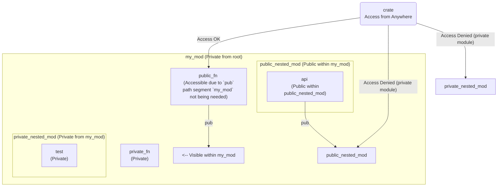

# Modules

Modularity is key to organizing and managing complexity in software source code. Rust provides a powerful module system for this purpose.

---

## Crates and Linking

The fundamental unit of compilation in Rust is a **crate**. A crate is a collection of source code files that are compiled together. The output of compiling a crate is either:

*   An **executable**: A binary program that can be run directly (requires a `main()` function).
*   A **library**: A collection of compiled code that can be used by other crates.

When one crate depends on and uses code from a library crate, the compiled code from the library must be combined with the code from the dependent crate. This process is called **linking**. Rust supports different types of linking:

*   **Static Linking:** The code from the library is copied directly into the final executable file.
    *   **Pros:** The executable is self-contained and does not rely on external library files being present at runtime.
    *   **Cons:** The executable file is larger. If multiple programs use the same static library, each executable will contain its own copy of the library code, potentially wasting disk space and memory.
*   **Dynamic Linking:** Only a reference to the library file is included in the executable. The actual library code is loaded into memory by the operating system when the program starts or when the library functions are first called.
    *   **Pros:** Executables are smaller. Multiple programs can share a single copy of the dynamically linked library's code in memory, saving resources. Updates to the library can potentially be picked up by the executable without recompilation (though this can also be a con if not managed carefully).
    *   **Cons:** The executable depends on the dynamic library file being present and correctly versioned on the system at runtime.

The type of library produced when compiling a library crate is specified in the `[lib]` section of the crate's `Cargo.toml` file using the `crate-type` key. It can be set to one or more values:

*   `rlib` (default for `["lib"]` in a new library crate): A Rust-specific static library format. Used only by other Rust executables or libraries.
*   `dylib` (`["dylib"]`): A Rust-specific dynamic library format (`.dll` on Windows, `.so` on Linux, `.dylib` on macOS). Used only by other Rust code, loaded at runtime.
*   `staticlib` (`["staticlib"]`): A C-compatible static library format (`.lib` on Windows, `.a` on Unix-like systems). Usable by programs written in other languages that can link against C static libraries.
*   `cdylib` (`["cdylib"]`): A C-compatible dynamic library format (`.dll`, `.so`, `.dylib`). Usable by programs in other languages that can load C dynamic libraries.

### Creating and Using Libraries (Rust Examples)

Here's a typical workflow for creating and using a simple Rust library within another Rust project:

1.  **Create the Library Project:** Use the Cargo command `cargo new my_lib --lib`. This creates a new directory `my_lib` with a basic structure: `Cargo.toml` for project configuration and `src/lib.rs` as the library's root source file.
2.  **Write Library Code:** Place the library's code in `src/lib.rs`. Use the `pub` keyword to make items (functions, structs, enums, modules, etc.) visible and usable from other crates.

    ```rust
    // my_lib/src/lib.rs (Example)

    /// Adds two unsigned 64-bit integers.
    pub fn add(left: u64, right: u64) -> u64 {
        left + right
    }

    // Private function within the library
    fn internal_helper() {
        println!("This is an internal helper");
    }

    // You might also export structs, enums, etc.
    // pub struct MyData { ... }
    ```
3.  **Configure Crate Type (Optional):** The default `rlib` is suitable for most Rust-to-Rust dependencies. If you needed a different type (like `dylib`), you'd modify `my_lib/Cargo.toml`:

    ```toml
    # my_lib2/Cargo.toml (Example for dylib)
    [lib]
    crate-type = ["dylib"] # Produce a dynamic library
    ```
4.  **Declare Dependency:** In the `Cargo.toml` file of the *main* project (the executable crate) that wants to use the library, add a dependency specifying the path to the library crate.

    ```toml
    # my_project/Cargo.toml (Example - in the project that uses my_lib)
    [dependencies]
    # This specifies a dependency on a local crate named 'my_lib'
    # located in the '../my_lib' directory relative to my_project.
    my_lib = { path = "../my_lib" } # Or my_lib2 etc., matching the directory name
    ```
5.  **Use Library in Main Project:** In the main project's source code (`src/main.rs` or `src/lib.rs`), use the `use` keyword to bring items from the library crate into scope and then call the public items. The library crate's name becomes the top-level module name you import from.

    ```rust
    // my_project/src/main.rs (Example)

    // Bring the entire `my_lib` crate/module into the current scope.
    // Items inside it are accessed via `my_lib::...`
    use my_lib;

    // Alternatively, bring specific items into scope:
    // use my_lib::add; // Now `add` can be called directly

    fn main() {
        // Call the public function from the library crate
        println!("Hello, world! {}", my_lib::add(1, 2));
        // my_lib::internal_helper(); // ERROR: internal_helper is private
    }
    ```

### C-Compatible Library Example

To create a library in Rust that can be used from C or other languages that interoperate with C, you configure the crate type and use attributes for C compatibility:

1.  **Create Library Project:** Start with `cargo new my_lib --lib` (let's call it `my_lib3` for this example).
2.  **Write C-Compatible Code:**
    *   Use the `#[no_mangle]` attribute above functions you want to be callable from C. This prevents the Rust compiler from "mangling" the function name (changing it for internal Rust purposes), ensuring its name remains as you declared it in the source code.
    *   Use the `extern "C"` keyword before the `fn` declaration. This tells Rust to use the C calling convention and Application Binary Interface (ABI) for this function, making it compatible with C function calls.
    *   Ensure the function is `pub` to be exported from the library.
    *   Use C-compatible data types (primitives like `u64`, `i32`, `f32`, `bool`, raw pointers `*const T`, `*mut T`, C-style structs using `#[repr(C)]`).

    ```rust
    // my_lib3/src/lib.rs (Example)

    // Prevent name mangling so C can find the function by name 'somma'.
    #[no_mangle]
    // Use the C calling convention (ABI) and make the function public.
    pub extern "C" fn somma(left: u64, right: u64) -> u64 {
        left + right
    }

    // More complex FFI (Foreign Function Interface) often involves extern blocks,
    // #[repr(C)] structs, and careful type handling, but this shows the basics.
    ```
3.  **Configure Crate Type:** Modify `my_lib3/Cargo.toml` to produce a C-compatible library (static or dynamic).

    ```toml
    # my_lib3/Cargo.toml (Example for staticlib)
    [lib]
    crate-type = ["staticlib"] # Or ["cdylib"] for dynamic
    ```
4.  **Build the Library:** Build the project, often with `--release` for optimized code.

    ```bash
    cd my_lib3
    cargo build --release
    ```

    This will generate the library file (e.g., `libmy_lib3.a` on Linux/macOS, `my_lib3.lib` on Windows for staticlib) in the `target/release/` directory.
5.  **Use in C Code:** Write your C code. Declare the Rust function you want to call using the `extern` keyword, specifying its name and signature using matching C types (`u64` in Rust corresponds to `unsigned long long` in C). Then, compile your C code and link it against the Rust library file.

    ```c
    // main.c (Example C file)
    #include <stdio.h>

    // Declare the function provided by the Rust library using extern
    extern unsigned long long somma(unsigned long long a, unsigned long long b); // Signature must match Rust function

    int main() {
        // Call the Rust function
        printf("3 + 4 = %llu\n", somma(3, 4));
        return 0;
    }
    ```

    ```bash
    # Compile the C code and link against the Rust static library
    # -L specifies directory to search for libraries (./my_lib3/target/release)
    # -l specifies the library name (my_lib3, note: 'lib' prefix and '.a'/.lib suffix are implied)
    gcc main.c -L./my_lib3/target/release -lmy_lib3 -o main_c

    # Run the compiled C executable
    ./main_c
    ```

---

## Modules and Visibility (Within a Crate)

Within a single crate, code is organized into a tree of **modules** using the `mod` keyword. Every crate has an implicit top-level module called the **root module**, referred to with the path `crate`.

*   **Hierarchy:** Modules can contain other modules, forming a nested tree structure.
*   **Visibility:** Items (functions, structs, enums, constants, etc.) within a module have a default visibility level: **private**. Private items are only accessible within their own module and any child modules nested directly inside it. To make an item accessible from outside its immediate parent module, you must use the `pub` keyword.
    *   `pub item;`: Makes `item` public within its containing module.
    *   For an item nested deep within the module tree (`crate::mod_a::mod_b::item`) to be accessible from the crate root or another distant module, **all modules along the path** from the usage location *down* to the item must also be publicly accessible (`pub mod mod_a`, `pub mod mod_b`).

### Module Structure and Visibility Example

```rust
// This is the implicit root module of the crate

mod my_mod { // `my_mod` is a private module, a child of the root
    fn private_fn() { /* ... */ } // `private_fn` is private to `my_mod`
    pub fn public_fn() { /* ... */ } // `public_fn` is public *within* `my_mod`

    mod private_nested_mod { // `private_nested_mod` is a private module, child of `my_mod`
        fn test() { /* ... */ } // `test` is private to `private_nested_mod`
    }

    pub mod public_nested_mod { // `public_nested_mod` is a public module *within* `my_mod`
        pub fn api() { /* ... */ } // `api` is public *within* `public_nested_mod`

        // Code within `public_nested_mod` can access anything in its parent (`my_mod`)
        // and anything in sibling modules within `my_mod`.
        // E.g., within `api()`, you could call `super::private_fn()`, `super::public_fn()`,
        // `super::private_nested_mod::test()`.
    }
    // Code within `my_mod` can access all its direct children and items.
    // E.g., within `my_mod`, you could call `private_fn()`, `public_fn()`,
    // `private_nested_mod::test()`, `public_nested_mod::api()`.
}

fn main() { // `main` is in the root module
    // Try accessing items from the root module:

    // my_mod::private_fn(); // ERROR: `private_fn` is private to `my_mod`. Not visible from root.

    my_mod::public_fn(); // OK: `public_fn` is public *within* `my_mod`, AND `my_mod`
                         // is a direct child of the root, making `my_mod` itself accessible
                         // from the root module's scope.

    // my_mod::private_nested_mod::test(); // ERROR: `private_nested_mod` is private to `my_mod`.
                                         // Even if `test` were pub, the path segment `private_nested_mod` is not public.

    // my_mod::public_nested_mod::api(); // ERROR: `public_nested_mod` is public *within* `my_mod`,
                                       // and `api` is public *within* `public_nested_mod`,
                                       // but the module `my_mod` itself is private (defined using just `mod my_mod { ... }`)
                                       // from the root. The path segment `my_mod` is not public.

    // To make public_nested_mod::api() accessible from root, `my_mod` would need to be `pub mod my_mod { ... }`.
}
```

**Diagram of Module Tree and Visibility (Example)**

<p align="center">



</p>

*(Note: The diagram simplifies that `my_mod` itself must be public for its public children to be accessible from root. `pub mod my_mod` makes the `my_mod` path segment public)*

---

### Accessing Symbols (Paths and `use`)

To refer to items defined in other modules, you use their **paths**.

*   **Absolute Paths:** Start from the crate root using `crate::`. E.g., `crate::std::mem::size_of_val` refers to the `size_of_val` function in the `mem` module, which is a child of the `std` module, starting from the root (`crate`).
*   **Relative Paths:** Start from the current module (`self::`), the parent module (`super::`), or directly by the name of a sibling module within the same parent. E.g., if you are in `crate::mod_a::mod_b`, `super::mod_c::some_function()` refers to a function in module `mod_c` (a sibling of `mod_b` under `mod_a`), and `self::my_item` refers to `my_item` within `mod_b`.

The **`use`** keyword allows you to bring a symbol (a module, function, struct, etc.) into the current scope, so you can refer to it by its name without needing its full path.

*   Import a single item: `use path::to::symbol;`
*   Import multiple items from the same path: `use path::to::{symbol1, symbol2, ...};`
*   Import all public items from a module: `use path::to::module::*;` (Use this judiciously, as it can make it unclear where names are coming from).
*   Access using `use` still requires that all modules and items in the specified path are **publicly accessible** from the location where `use` is declared.

---

### Modules and File Organization

The `mod` keyword also dictates how Rust finds the source code files for modules:

1.  **Inline Modules:** Define the module directly within the current file using `mod module_name { /* ... code ... */ }`.
2.  **Separate File Modules:** If you declare `mod module_name;` in a file:
    *   Rust looks for the module's code in a file named `module_name.rs` in the **same directory** as the file where `mod module_name;` is declared.
3.  **Separate Directory Modules:** If you declare `mod module_name;` in a file, Rust also looks for the module's code in a file named `module_name/mod.rs` in a **subdirectory** named `module_name` in the same directory. This allows organizing sub-modules within the `module_name` directory. Sub-modules of `module_name` would then be declared with `mod sub_subdir;` inside `module_name/mod.rs`, and their code would be in `module_name/sub_subdir.rs` or `module_name/sub_subdir/mod.rs`.

*   `src/main.rs`: This is the conventional root file for a **binary crate**. It implicitly defines the root module (`crate`). Any `mod` declarations in `src/main.rs` create child modules of the root.
*   `src/lib.rs`: This is the conventional root file for a **library crate**. It also implicitly defines the root module (`crate`). Any `mod` declarations in `src/lib.rs` create child modules of the root.
*   `Cargo.toml`: Defines the package structure, name, and dependencies, linking together the crates and modules.

---

### Renaming Imports (`as`)

When using the `use` keyword, you can rename the imported item using the `as` keyword to avoid name conflicts or simply for clarity within the local scope.

```rust
mod modulo_a {
    pub fn funzione() { println!("Funzione da modulo A"); }
}
mod modulo_b {
    pub fn funzione() { println!("Funzione da modulo B"); }
}

fn main() {
    // Without renaming, you'd have a name conflict or need full paths
    // use modulo_a::funzione; // Cannot also import modulo_b::funzione by the same name

    // Use 'as' to give them unique names in the local scope
    use modulo_a::funzione as funzione_a;
    use modulo_b::funzione as funzione_b;

    // Now you can call them using their local, aliased names
    funzione_a(); // Calls modulo_a::funzione() - Output: Funzione da modulo A
    funzione_b(); // Calls modulo_b::funzione() - Output: Funzione da modulo B
}
```

---

### The Prelude

Rust's standard library provides a **prelude**: a small list of items that are automatically imported into every module in every Rust program. This includes commonly used types and functions like `Vec`, `String`, `Iterator`, `Option`, `Result`, etc., reducing the need for explicit `use std::...` statements for the most fundamental items. The exact contents of the prelude can vary slightly between Rust editions.

---

# Test

Testing is a fundamental practice in software engineering to ensure code correctness, reliability, and maintainability. Rust has built-in support for writing tests.

---

## Test Overview

A **test** is a piece of code written specifically to execute another portion of the software and verify that its behavior matches expectations. Testing provides a safety net, particularly when refactoring or adding new features, ensuring existing functionality isn't broken.

Different levels of testing exist, each with a different scope and purpose:

*   **Unit Test:** Focuses on testing the **smallest testable unit** of code, typically a single function or method, in isolation. They are usually written by the developers who wrote the code being tested and assume internal knowledge of the component. They verify the component adheres to its internal specification. Fixing issues found by unit tests is generally the least expensive.
*   **Integration Test:** Tests how **two or more modules or components interact** and work together. They focus on the interfaces and communication channels between components, ignoring their internal implementation details. Integration tests are run on components that have already passed unit tests. They are often co-designed by developers and testers.
*   **System Test:** Tests the **complete, integrated software product** as a whole. This includes verifying functional requirements (does it do what it's supposed to?) and non-functional requirements (performance, security, usability, etc.). System tests are typically based on overall system specifications and use cases and are designed and executed by dedicated testers.
*   **Acceptance Test:** Tests the system against the **requirements defined by the client or end-users**. The goal is to confirm that the system meets the business needs and is ready for delivery. These tests are often executed by the actual end-users or client representatives.

---

## Unit Test (Rust)

Rust's testing features are designed with unit tests in mind, often placing them close to the code they test.

*   **Location:** Unit tests are typically placed in a dedicated `tests` submodule within the **same file** as the code they are testing.
*   `#[cfg(test)]`: This is a **conditional compilation attribute**. Code marked with this attribute is only compiled and included in the build when the `cfg` flag `test` is enabled (which Cargo automatically does when you run `cargo test`). This ensures your test code doesn't increase the size or compilation time of your regular build.
*   `#[test]`: This attribute is placed above a function to mark it as a test case that the test runner should execute.

### Test Syntax (Basic)

```rust
// src/lib.rs or src/main.rs (Example: Code to test)
pub fn add(left: u64, right: u64) -> u64 {
    left + right
}

// The test module, only compiled when running tests
#[cfg(test)]
mod tests {
    // Bring all items from the parent module into the scope of this tests module.
    // This allows tests to easily access functions like `add`.
    use super::*;

    // Mark this function as a test case
    #[test]
    fn it_works() {
        // Arrange: Set up test data/state
        let left = 2;
        let right = 2;

        // Act: Execute the code being tested
        let result = add(left, right);

        // Assert: Verify the result using an assertion macro
        // assert_eq! checks if the two values are equal. If not, the test fails and it prints the values.
        assert_eq!(result, 4);
    }

    // You can have multiple test functions within the #[cfg(test)] mod
    #[test]
    fn another_test() {
        assert_eq!(add(1, 1), 2);
    }
}
```

---

### Test Syntax (Assertions and Panics)

Rust provides several assertion macros for verifying conditions in tests:

*   `assert!(boolean_condition)`: This macro causes the test to fail if the `boolean_condition` evaluates to `false`.
*   `assert_eq!(value1, value2)`: This macro causes the test to fail if `value1` is not equal to `value2`. It requires the types to implement the `PartialEq` and `Debug` traits. If it fails, it prints the values of both `value1` and `value2`, which is very helpful for debugging.
*   `assert_ne!(value1, value2)`: This macro causes the test to fail if `value1` *is* equal to `value2`. It also requires `PartialEq` and `Debug`.

You can also write tests that specifically expect the code under test to **panic**.

*   `#[should_panic]`: Place this attribute above a test function. The test will pass *only if* the function panics during execution. If the function completes without panicking, the test fails.
*   `#[should_panic(expected = "message content")]`: Place this attribute above a test function. The test will pass *only if* the function panics *and* the panic message contains the specified substring "message content".

### Testing `Result` and Panics Example

```rust
// Function that might return an error (String) or panic (via unwrap())
pub fn divide(a: i32, b: i32) -> Result<i32, String> {
    if b == 0 {
        Err(String::from("Divisione per zero"))
    } else {
        Ok(a / b)
    }
}

#[cfg(test)]
mod tests {
    use super::*;

    #[test]
    fn test_divide_ok() {
        // Test the success case: expect an Ok(value) result
        assert_eq!(divide(10, 2), Ok(5));
        assert_eq!(divide(-10, 5), Ok(-2));
    }

    #[test]
    fn test_divide_error() {
        // Test the error case: expect an Err(message) result
        assert_eq!(divide(10, 0), Err(String::from("Divisione per zero")));
    }

    #[test]
    #[should_panic] // This test passes if the function panics
    fn test_divide_panic_basic() {
        // Calling unwrap() on the Err result is expected to cause a panic
        divide(10, 0).unwrap();
    }

    #[test]
    #[should_panic(expected = "Divisione per zero")] // This test passes only if it panics with this specific message
    fn test_divide_panic_message() {
        // Calling unwrap() on the Err result with the expected message
        divide(10, 0).unwrap();
    }
}
```

---

### Asserting with `Result<T, Error>` (Using `?`)

Test functions can also return `Result<(), E>` (where `E` is an error type) to conveniently use the `?` operator. This is useful when the code under test returns a `Result`, and you want the test to fail automatically if that code returns an `Err`.

```rust
// Function that might return an error during parsing
fn parse_number(s: &str) -> Result<i32, String> {
    s.parse::<i32>().map_err(|_| "Parsing fallito".to_string())
}

#[cfg(test)]
mod tests {
    use super::*;

    // This test function returns Result<(), String>.
    // If any operation within the test returns Err(String),
    // the `?` operator will propagate it, causing the test function
    // to return early with that error, thus failing the test.
    #[test]
    fn test_parse_valid() -> Result<(), String> {
        // parse_number("42") returns Ok(42). `?` unwraps it to 42.
        let num = parse_number("42")?;
        // If parse_number("42") had returned an Err, `?` would have
        // returned that Err from `test_parse_valid`, failing the test.
        assert_eq!(num, 42);

        // Return Ok(()) to indicate the test passed successfully.
        Ok(())
    }

    // This test demonstrates how to specifically test the error case.
    #[test]
    fn test_parse_invalid() -> Result<(), String> {
        // Call the function with invalid input.
        let result = parse_number("abc");
        // Assert that the result is indeed an error.
        assert!(result.is_err());

        // You could also check the error message if needed:
        // assert_eq!(result.unwrap_err(), "Parsing fallito".to_string());

        // Return Ok(()) because we successfully asserted that the error occurred.
        Ok(())
    }
}
```

In a test function returning `Result<(), E>`, returning `Ok(())` signifies a passing test, and returning `Err(error)` (either directly or via `?`) signifies a failing test.

---

## Integration Test (Rust)

Integration tests in Rust are used to test the public interface of a library crate, ensuring different parts of the library (or modules within it) work correctly together, and that the library interacts correctly with external code.

*   **Purpose:** To test the public API of your library (`src/lib.rs`) from the perspective of an external user. They use your crate like any other external dependency.
*   **Location:** Integration tests are placed in a dedicated directory named `tests/` at the same level as your `src/` directory.
*   **Structure:** Each file within the `tests/` directory (e.g., `tests/my_integration_tests.rs`) is compiled as its own separate crate. This test crate then imports your library crate using `use your_crate_name::...;` and calls its public functions/uses its public types.
*   **Applicability:** Integration tests are applicable only to **library crates** (`src/lib.rs`). Binary crates (`src/main.rs`) don't expose a public interface to other crates in the same way.

### Integration Test File Structure Example

```
my_lib/          # Your library project root
├── Cargo.toml
├── src/
│   └── lib.rs   # Your library code
└── tests/       # Directory for integration tests
    └── common/  # Optional: directory for common test setup/helpers
    │   └── mod.rs
    └── integration_test.rs # An integration test file (compiled as a separate crate)
    └── another_test_suite.rs # Another integration test file
```

### Library Code for Integration Test Example

```rust
// my_lib/src/lib.rs (Example library code)

// Define a public error enum
#[derive(Debug, PartialEq)]
pub enum CalcoloErrore {
    DivisionePerZero,
    // ... other error types
}

// Define public functions
/// Adds two integers.
pub fn somma(a: i32, b: i32) -> i32 {
    a + b
}

/// Divides two integers, returning an error on division by zero.
pub fn dividi(a: i32, b: i32) -> Result<i32, CalcoloErrore> {
    if b == 0 {
        Err(CalcoloErrore::DivisionePerZero)
    } else {
        Ok(a / b)
    }
}

// Any private items in lib.rs are NOT accessible by integration tests.
fn internal_logic() { /* ... */ }
```

### Integration Test Code Example

```rust
// my_lib/tests/calcolatrice.rs (Example integration test file)

// This file is compiled as its own test crate.
// To use items from the `my_lib` library crate, we must import them.
// The library crate name (`my_lib` as defined in Cargo.toml) is the crate root.
use my_lib::*; // Import all public items from the `my_lib` crate's root module

// Integration test functions are marked with #[test] just like unit tests.
#[test]
fn test_somma() {
    // Call the public function `somma` imported from `my_lib`.
    assert_eq!(somma(10, 5), 15);
    assert_eq!(somma(-2, 3), 1);
}

#[test]
fn test_divisione_ok() {
    // Test the Ok variant of the Result
    assert_eq!(dividi(10, 2), Ok(5));
}

#[test]
fn test_divisione_per_zero() {
    // Test the Err variant of the Result, using the public error enum.
    assert_eq!(dividi(10, 0), Err(CalcoloErrore::DivisionePerZero));
}

// You cannot call private items from lib.rs here:
// my_lib::internal_logic(); // ERROR: `internal_logic` is private
```

---

## Running Tests

You run all tests in your project (both unit tests and integration tests) using the Cargo command:

```bash
cargo test
```

Cargo will:
1.  Compile your code with the test flag (`--test`), including `#[cfg(test)]` sections and files in `tests/`.
2.  Build the test runner executable(s).
3.  Run all functions marked with `#[test]`.
4.  Print detailed output indicating which tests passed, failed, or were ignored.

Other useful `cargo test` options:

*   `cargo test <test_name_part>`: Run only tests whose name contains `<test_name_part>`. E.g., `cargo test divisione` would run `test_divisione_ok` and `test_divisione_per_zero`.
*   `#[ignore]`: You can mark a test function with `#[ignore]` to exclude it from the default test run. Useful for slow or temporarily broken tests.
*   `cargo test -- --ignored`: Run *only* the ignored tests.
*   `cargo test -- --show-output`: Display output printed by tests that pass (output from failing tests is shown by default).

---

## Automating Test Creation (Parameterised Tests)

Writing multiple test cases that share similar setup and logic can be repetitive. Parameterised tests allow you to write a single test function and provide multiple sets of input data ("cases") to run the function with.

The popular external crate `rstest` provides powerful features for parameterised testing, including defining test cases and fixtures (reusable test data setup).

1.  **Add Dependency:** Add `rstest` to your `Cargo.toml` in the `[dev-dependencies]` section (as it's only needed for testing).

    ```toml
    [dev-dependencies]
    rstest = "0.21" # Use the latest version
    ```
2.  **Use `#[rstest]`:** Instead of `#[test]`, annotate your parameterised test function with `#[rstest]`.
3.  **Provide Parameters:** Define the input data for each case using `#[case(...)]` attributes above the test function, or define reusable setup using `#[fixture]` functions. Parameters in the test function signature are matched by name (for fixtures) or position (for cases).

### Parameterised Test Example (Using `#[case]`)

This example uses `#[case]` attributes to provide different inputs and expected outputs for the `somma` and `dividi` functions.

```rust
// tests/parameterized_tests.rs (Example)
// Remember to import the function(s) from your library crate
use my_lib::*; // Assuming somma and dividi are public in my_lib
use rstest::rstest; // Import the rstest macro

// This test function is annotated with #[rstest] and takes parameters `a`, `b`, `expected`.
// The #[case(...)] attributes provide the values for these parameters for each test run.
#[rstest]
#[case(2, 3, 5)] // Run the test with a=2, b=3, expected=5
#[case(-1, 1, 0)] // Run the test with a=-1, b=1, expected=0
#[case(0, 0, 0)]   // Run the test with a=0, b=0, expected=0
fn test_somma(#[case] a: i32, #[case] b: i32, #[case] expected: i32) {
    // The test logic uses the parameters provided by the #[case] attributes.
    assert_eq!(somma(a, b), expected);
}

// Example testing the divide function with cases for both Ok and Err results.
#[rstest]
#[case(10, 2, Ok(5))] // Case 1: a=10, b=2, expected=Ok(5)
#[case(1, 0, Err(CalcoloErrore::DivisionePerZero))] // Case 2: a=1, b=0, expected=Err(...)
#[case(-15, 3, Ok(-5))] // Case 3: a=-15, b=3, expected=Ok(-5)
fn test_divisione(#[case] a: i32, #[case] b: i32, #[case] expected: Result<i32, CalcoloErrore>) {
    assert_eq!(dividi(a, b), expected);
}
```

When you run `cargo test`, `rstest` will execute the `test_somma` function three times (once for each `#[case]`) and the `test_divisione` function three times.

---

### Parameterised Test Example (Using `#[fixture]`)

Fixtures are functions marked with `#[fixture]` that provide reusable test data or setup. `rstest` automatically calls fixture functions and injects their return value into test function parameters that have the same name.

```rust
// src/lib2.rs (Example library code)
pub fn somma_vec(v: &[i32]) -> i32 { v.iter().sum() }

// tests/fixture_tests.rs (Example)
use rstest::{fixture, rstest};
use my_lib2::somma_vec; // Import the function to test

// This function is marked as a fixture. It provides a Vec<i32>.
#[fixture]
fn vettore() -> Vec<i32> {
    // This setup code runs before the test that uses this fixture.
    println!("Setting up vettore fixture..."); // Optional: can add setup/teardown logic
    vec![1, 2, 3, 4] // Return the test data
}

// This test function is marked with #[rstest]. It takes a parameter named `vettore`.
// rstest sees the parameter name matches the fixture name and calls the `vettore` fixture,
// injecting its return value (the Vec<i32>) as the argument for this parameter.
#[rstest]
fn test_somma_vec(vettore: Vec<i32>) { // Parameter name matches fixture name
    // The test logic uses the data provided by the fixture.
    assert_eq!(somma_vec(&vettore), 10); // Sum of [1, 2, 3, 4] is 10
}
```

When you run `cargo test`, `rstest` calls the `vettore` fixture once before running `test_somma_vec` and provides the `vec![1, 2, 3, 4]` to the test function.

---

### Parameterised Test Example (Using `#[fixture]` and `#[case]`)

You can combine fixtures and cases in a single parameterised test. Fixture parameters are populated by calling fixture functions with matching names, and `#[case]` parameters are populated by the values from the case tuples, matched by position.

```rust
// src/lib3.rs (Example library code)
pub fn somma_vec(v: &[i32]) -> i32 { v.iter().sum() }
// Hypothetical function to scale a vector:
pub fn scala_vec(v: &[i32], factor: i32) -> Vec<i32> {
    v.iter().map(|x| x * factor).collect()
}


// tests/combined_tests.rs (Example)
use rstest::{fixture, rstest};
use my_lib3::scala_vec; // Import the hypothetical function

// Fixture providing a common base vector
#[fixture]
fn base_vec() -> Vec<i32> { vec![1, 2, 3] }

// Parameterized test combining fixture and case data
#[rstest]
// The `base_vec` parameter will be provided by the `base_vec` fixture.
// The parameters annotated with `#[case]` will be populated by the #[case] tuples.
// The first #[case] value (2) goes to the first #[case] parameter (`fattore`).
// The second #[case] value (vec![2, 4, 6]) goes to the second #[case] parameter (`atteso`).
#[case(2, vec![2, 4, 6])] // Case 1: fattore=2, atteso=[2,4,6]
#[case(0, vec![0, 0, 0])] // Case 2: fattore=0, atteso=[0,0,0]
#[case(-1, vec![-1, -2, -3])] // Case 3: fattore=-1, atteso=[-1,-2,-3]
fn test_scala_vec(
    base_vec: Vec<i32>,      // This parameter gets data from the `base_vec` fixture
    #[case] fattore: i32,    // This parameter gets data from the #[case] tuple (1st value)
    #[case] atteso: Vec<i32>, // This parameter gets data from the #[case] tuple (2nd value)
) {
    // The test logic uses both the data from the fixture and the current case.
    let scaled = scala_vec(&base_vec, fattore);
    assert_eq!(scaled, atteso);
}
```

`rstest` will run the `test_scala_vec` function three times (once for each `#[case]`). In each run, it will call the `base_vec` fixture to get the base vector and use the values from the current `#[case` tuple for `fattore` and `atteso`. This is a powerful way to test functions with multiple inputs systematically.

Testing is an integral part of modern software development, and Rust's built-in features and the ecosystem of crates like `rstest` provide excellent support for writing robust tests at different levels.