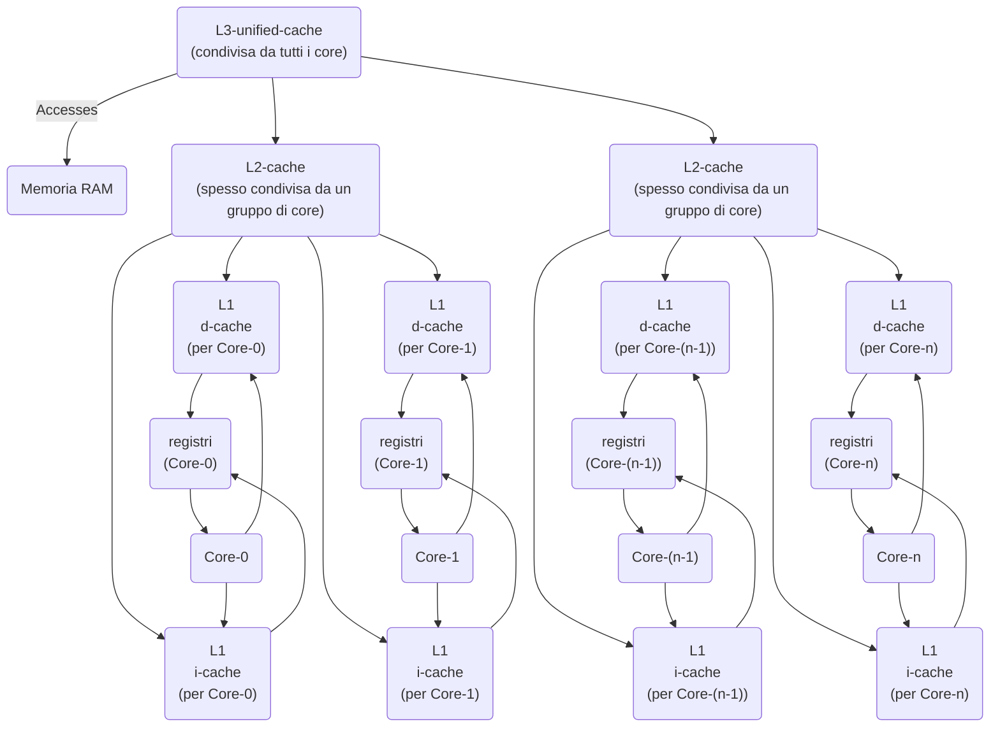
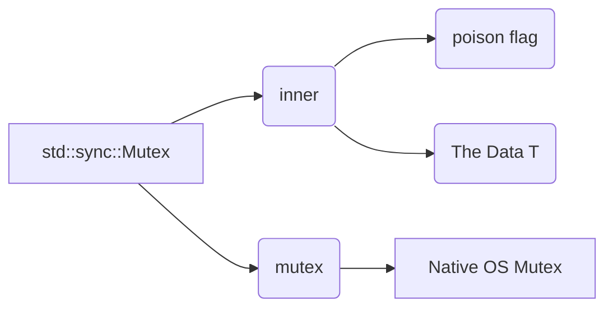
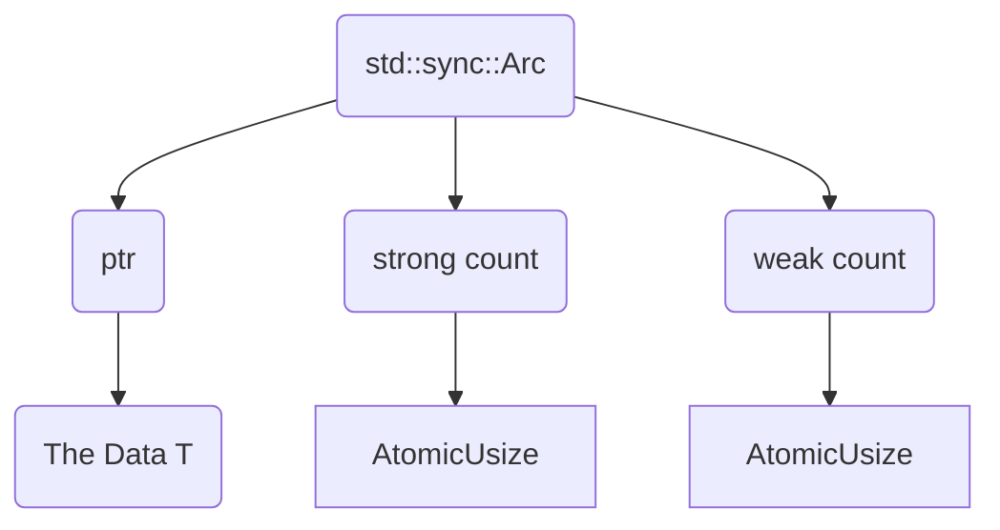
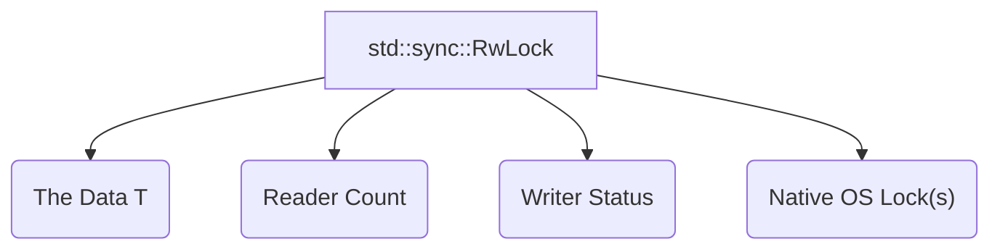

# Concurrency

**Concurrency** in computing refers to the ability of a system to handle multiple tasks or execution flows that make progress *seemingly* at the same time. This can be achieved in two ways:

*   **Interleaved Execution:** On a single processor core, the system rapidly switches between different tasks, giving the illusion of simultaneous execution (time-slicing).
*   **Parallel Execution:** On systems with multiple processor cores, different tasks can truly execute *simultaneously* on different cores.

## Concurrent Programming

A **concurrent program** is one designed with two or more execution flows running concurrently. These flows typically cooperate towards a shared objective.

*   **Goal:** The different execution flows within a concurrent program work together to achieve a common goal, often by sharing resources or communicating results.
*   **Execution:** Whether the execution is interleaved (on a single core) or parallel (on multiple cores) is managed by a **scheduler** (usually part of the operating system or a user-level library). The scheduler decides which flow runs on which core and for how long.

Different models exist for concurrent execution flows:

*   **Processes:** Isolated instances of a program, each with its own independent memory space (address space). This isolation prevents unintended interference between processes but makes cooperation (sharing data) more complex, typically requiring inter-process communication (IPC) mechanisms like pipes, sockets, or shared memory segments managed by the OS. Shared *external* resources like the file system or network can still be points of interference.
*   **Threads:** Independent execution flows *within* the same process.

A process starts with a single execution flow, known as the **main thread**. The main thread can then create additional threads. Explicit multithreading (where the programmer manually creates and manages threads) is the norm in languages like C, C++, and Rust. Some languages or runtimes (like Java, or JavaScript environments with Web Workers or Node.js worker threads) may provide abstractions or implicit threading models.

A **thread** is the smallest unit of execution that a scheduler can manage.

*   Each thread has its own execution stack (for local variables and function calls).
*   Crucially, **threads within the same process share the process's address space**. This means they can directly access and modify the same memory locations and data structures, which facilitates cooperation but introduces significant challenges in managing shared state.
*   A thread typically runs until it completes its task, encounters an error, or is explicitly terminated.

## Thread Management

The allocation of processor time and resources to threads is managed by the operating system or supporting libraries.

*   The **scheduler** determines which thread runs on which available core at any given moment. The scheduler's decisions are generally non-deterministic, meaning the exact order and timing of operations across different threads cannot be predicted reliably.
*   The OS keeps track of the state of each thread (e.g., a unique Thread ID - TID, CPU registers state, execution state like running, waiting, ready).

Thread management can be implemented as:

*   **Native threads (OS threads):** Threads are directly created and managed by the operating system kernel. The kernel scheduler handles scheduling and switching. This is the model used by the standard libraries of C++, Rust, and others.
*   **Green threads or Fibers (User-level threads):** Threads are managed by a user-level library or runtime environment, with potentially minimal involvement from the OS kernel. Scheduling and switching are handled within the user-level library. This often requires code to explicitly yield control (cooperative multitasking) or relies on runtime features like asynchronous I/O (preemptive-like multitasking but not true preemption on CPU).

C++ and Rust standard libraries provide interfaces to create and manage **native threads**. Some third-party libraries in Rust (like Tokio or async-std) implement user-level task/fiber models on top of a pool of native threads.

## Native Threads (OS Functions)

Operating systems provide system calls or APIs to interact with native threads. While the specific APIs vary, the core functionalities are similar:

*   **Creation:** A function is provided to start a new thread of execution, typically by specifying an entry point function for the new thread to begin executing and potentially providing arguments or setting stack size. The function call usually returns an opaque handle or ID representing the new thread.
*   **Identification:** Functions to get the unique ID of the currently executing thread (TID) within the system or process.
*   **Waiting for Termination (Join):** A function (`join` in Rust, `pthread_join` in pthreads) that blocks the calling thread until a specified target thread finishes its execution. This allows retrieving results or ensuring orderly shutdown.
*   **Cancellation:** Some systems provide mechanisms to request that a thread stop executing. However, this is often complex and requires the target thread to cooperate by periodically checking for cancellation requests; forcibly terminating threads can leave shared resources in an inconsistent state.

Differences in OS threading APIs historically made writing portable multithreaded applications challenging. Languages like Java first offered a portable threading model. Rust's standard library provides a cross-platform abstraction over native OS threads.

## What Concurrency Implies

**Benefits of Concurrency (especially with shared memory threads):**

*   **Reduced inter-process communication overhead:** Since threads share the same memory space, data can be shared simply by passing pointers or references. This is much faster and less complex than the explicit serialization/deserialization or copying required for IPC between processes.
*   **Overlapping computation and I/O:** When one thread performs a blocking operation (like waiting for data from a disk or network), the OS scheduler can switch to another thread that can perform computations. This improves CPU utilization, even on single-core systems, by preventing the CPU from idly waiting for slow I/O.
*   **Full utilization of multicore CPUs:** On systems with multiple cores, threads can run in parallel, allowing computationally intensive tasks to complete faster by distributing the workload across available cores.

**Drawbacks of Concurrency:**

*   **Significant increase in program complexity:** Concurrent programs are much harder to design, implement, debug, and reason about than sequential programs. Non-deterministic scheduling and interaction introduce subtle bugs.
*   **Requires memory access coordination:** The fact that threads share memory means they can simultaneously try to read or write to the same memory locations. Without careful coordination (synchronization), this leads to **data races** and unpredictable behavior.
*   **Challenges with memory hierarchy:** Modern CPUs have complex memory systems involving caches (L1, L2, L3) and may reorder instructions for performance. This means that a write by one thread might not be immediately visible to another thread running on a different core, or operations might appear to execute in a different order than they were programmed from the perspective of another thread.

## Concurrency in Practice (Execution Model)

In a single-core system, multiple threads are an abstraction managed by the OS scheduler. The CPU rapidly switches between threads (task switching), giving each a small slice of time. This switching is often triggered by hardware interrupts (e.g., timer interrupts).

On a multicore system, the OS scheduler can assign different threads to different physical cores, allowing them to run truly in parallel.

Any communication or data exchange between threads within the same process *must* happen via the process's shared memory area. However, accessing this shared area requires careful coordination due to the memory model intricacies described below.

## Memory Model

When multiple threads access the same memory location, the value a thread reads might be:

*   The initial value.
*   A value previously written by the *same* thread.
*   A value previously written by *another* thread.
*   Potentially, an unpredictable value if writes are not properly synchronized.

Hardware caches are designed to speed up memory access for individual cores. When a core writes to memory, the change might initially only be reflected in that core's local cache, not immediately in main RAM or the caches of other cores. Similarly, when a core reads, it might get a stale value from its cache instead of the latest value written by another core.

CPU micro-architectures also perform instruction reordering to optimize execution pipeline. While this reordering is safe for single threads, it can lead to surprising behavior in multithreaded contexts if not properly managed.

Predictable ordering and visibility of memory operations across threads require explicit **synchronization constructs**. These constructs often involve special hardware instructions (like memory fences or barriers) that force the CPU to complete pending memory operations and ensure changes become visible to other cores.

<p align="center">



</p>

The diagram illustrates the complex memory hierarchy. Data may reside in different caches at different levels (L1 per core, L2 per core or group, L3 shared) or in main RAM. Writes propagate through this hierarchy, often not instantaneously visible to all cores.

Special Assembly instructions can force cache invalidation or memory writes to guarantee visibility, but these are expensive operations.

**Open Problems in Concurrent Memory Access:**

*   **Atomicity:** Which operations are guaranteed to complete without interruption by another thread? Without synchronization, even simple operations like `i += 1` (which is typically a Read, Modify, Write sequence) are not atomic and can lead to race conditions.
*   **Visibility:** When is a write performed by one thread guaranteed to be seen by another thread? Writes might be buffered in a core's local cache and not immediately visible to other cores.
*   **Ordering:** Can memory operations appear to happen in a different order from the perspective of another thread than they were programmed? Compiler and processor optimizations (like reordering reads/writes) can make the observed order of events inconsistent across threads.

## The Processors' Responses

Different processor architectures (like x86 and ARM) have different memory models specifying the guarantees they provide about visibility and ordering without explicit synchronization. They also provide specific instructions to enforce stronger guarantees when needed:

*   **x86:** Has a relatively strong memory model (closer to sequential consistency) compared to others. Writes are generally visible to all cores in a predictable manner, and operations are less arbitrarily reordered by the hardware. However, fences are still sometimes necessary for complex scenarios. x86 provides **fence instructions** like `LFENCE` (Load Fence), `SFENCE` (Store Fence), and `MFENCE` (Memory Fence) to enforce ordering of memory operations.

    ```
    // Example conceptual usage of fence instructions in pseudo-assembly
    T1: // Thread 1
    MOV [data], eax // Write data to a memory location
    SFENCE         // Ensure all previous stores are globally visible before proceeding
    MOV [flag], 1  // Set a flag to indicate data is ready

    T2: // Thread 2
    wait: CMP [flag], 1 // Check the flag
    JNE wait           // Loop until flag is set (indicating data is ready)
    MFENCE             // Ensure all previous loads/stores (like the flag check) are completed
                       // and that any subsequent loads (like reading data) are not reordered before the flag check.
                       // Guarantees writes from T1 (including [data]) are visible.
    MOV ebx, [data]    // Read the data, guaranteed to be the value written by T1
    ```
*   **ARM:** Has a weaker memory model, allowing more aggressive reordering of loads and stores by the CPU for performance. Requires more frequent use of explicit **memory barrier** instructions (like `DMB` - Data Memory Barrier, `DSB` - Data Synchronization Barrier, `ISB` - Instruction Synchronization Barrier) to enforce causal ordering and visibility.

Modern programming languages and libraries abstract these low-level hardware details. Synchronization primitives like mutexes and atomic types internally use these barrier instructions to provide predictable behavior (`std::sync::Mutex`, `std::sync::atomic::Atomic...` in Rust). Without such explicit compiler or programmer-provided synchronization (via library types), there are no guarantees on memory ordering or visibility for shared data access in concurrent code.

## Errors (in Concurrent Programming)

Concurrent programming introduces a new class of errors related to timing and interaction:

*   **Passive Blocks (Deadlock):** Occurs when two or more threads are permanently blocked, waiting for resources held by each other (e.g., Thread A holds Lock X and waits for Lock Y, while Thread B holds Lock Y and waits for Lock X).
*   **Active Blocks (Livelock):** Threads continuously change their state in response to each other but make no actual progress towards their goal. They are not blocked but are stuck in a loop of dependent actions.
*   **Absence of Termination (Infinite Loop):** A thread might fail to stop executing because it's busy-waiting (repeatedly checking a condition without yielding the processor) on a condition that never becomes true, or it misses a state change due to improper synchronization.
*   **Unpredictable Results:** The output of the program varies from run to run or on different systems due to non-deterministic scheduling and the lack of guaranteed memory ordering/visibility. This is often caused by **data races**.
*   **Casual Malfunctions:** Errors that are difficult to reproduce because they depend on a specific, unlikely interleaving of thread execution or memory update timing. These are often intermittent ("Heisenbugs").

## Correctness (in Concurrent Programming)

Achieving correctness in concurrent programs requires careful design.

*   For any mutable shared data object, you must ensure its invariants (rules about its valid state) are maintained.
*   When a thread modifies shared data, it should ideally have exclusive access.
*   Any intermediate, inconsistent states during an update should not be visible to other threads.

In most languages (C++, Java, etc.), the responsibility for using synchronization constructs correctly lies entirely with the programmer. Tools like static analysis, race detectors, and formal methods are often needed to gain confidence in correctness, as exhaustive testing of concurrent behavior is practically impossible due to the vast number of possible execution interleavings.

Incorrect concurrent code is notoriously hard to test and optimize because subtle timing differences can hide or reveal bugs.

Rust's ownership and borrowing system, extended with its concurrency traits (`Send`, `Sync`), provides a unique approach. The borrow checker analyzes shared mutable access at compile time. It enforces that within a single program section, you can either have multiple immutable references or one mutable reference, effectively preventing **data races** (simultaneous access where at least one is a write). This transforms a large class of runtime errors into compile-time errors, enabling "fearless concurrency" – the ability to write concurrent code with greater confidence in its safety. However, Rust does not automatically prevent higher-level concurrency problems like deadlocks or livelocks; these remain the programmer's responsibility based on the algorithm's design.

## Shared Access: Possible Solutions

When multiple threads need to safely access or modify shared data, various synchronization primitives are used:

*   **Atomic Types:** Provide atomic (indivisible) operations for simple, primitive types (booleans, integers, pointers). Operations like atomic increment, decrement, load, store, and compare-and-swap are implemented using special, indivisible processor instructions that guarantee they complete without interruption, even on multicore systems. Standard libraries encapsulate these operations and often include necessary memory barriers to ensure visibility.
*   **Mutex (Mutual Exclusion):** A fundamental synchronization primitive that protects shared data structures from simultaneous access. A mutex has states: locked/owned by a single thread, or unlocked/available.
    *   A thread must call `lock()` on the mutex before accessing the shared data it protects. If the mutex is already locked, the thread blocks until the owner calls `unlock()`.
    *   When a thread holds the mutex lock, it has exclusive access to the protected data.
    *   After finishing its work with the data, the thread must call `unlock()` to release the mutex, allowing other waiting threads to acquire it.
    *   Mutexes should protect the shared resource during both read and write operations to ensure data consistency.
    *   To maximize potential parallelism, a mutex should protect the smallest amount of data necessary and be held for the shortest duration possible.
*   **Condition Variable:** Used in conjunction with a mutex. A condition variable allows threads to block and wait efficiently (without consuming CPU cycles in a busy loop) until a specific condition becomes true. Another thread that changes the shared state (protected by the mutex) to satisfy the condition can then signal the condition variable, waking up one or more waiting threads.

## Native Synchronization Structures (OS Examples)

Operating systems provide the underlying implementations for these primitives:

*   **Windows:**
    *   User-level (faster within a single process): `CriticalSection`, `SRWLock` (Slim Reader/Writer Lock), `ConditionVariable`.
    *   Kernel Objects (can be used across processes): `Mutex`, `Event`, `Semaphore`, `Pipe`, `Mailslot`, etc.
*   **Linux (pthreads):**
    *   User-level: `pthread_mutex`, `pthread_cond` (condition variable), `pthread_rwlock` (reader/writer lock).
    *   Kernel Objects: `Semaphore`, `Pipe`, `Signal`, `Futex` (Fast Userspace Mutex).

Rust's standard library (`std::sync`) provides a portable interface that wraps the native OS implementations of these primitives.

## Mutex in Rust (`std::sync::Mutex<T>`)

Rust's standard library provides `std::sync::Mutex<T>`, which encapsulates both the data `T` that needs protection and a reference to the underlying native OS mutex.

<p align="center">



</p>

The key to Rust's mutex is that the data `T` is *inside* the `Mutex`. Accessing the data `T` is only possible by successfully calling the `lock()` method on the `Mutex`.

*   `lock()`: This method attempts to acquire the mutex. If the mutex is currently locked by another thread, the calling thread will **block** until the mutex becomes available. It returns a `LockResult<MutexGuard<T>>`.
*   **Poisoning:** A `Mutex` can become **poisoned** if a thread panics while holding the lock. This signals that the data protected by the mutex might be in an inconsistent or partially updated state. Subsequent calls to `lock()` will return an `Err` variant containing information about the poisoning, but crucially, the data can still be accessed from this error (`poisoned.into_inner()`) if you choose to proceed despite the potential inconsistency. `lock().unwrap()` will panic if the mutex is poisoned.
*   `MutexGuard<T>`: If `lock()` is successful (returns `Ok`), it returns a `MutexGuard<T>`. This guard is a smart pointer that implements `Deref<T>`, allowing you to access the protected data `T` through it, usually getting a `&mut T` reference (enforcing that only the thread holding the lock can modify the data).
*   **RAII (Resource Acquisition Is Initialization):** The `MutexGuard` is a prime example of RAII in Rust. It holds the mutex lock for the duration of its lifetime. When the `MutexGuard` variable goes out of scope (either normally or due to a panic), its `drop` method is automatically called, which releases the underlying OS mutex. This guarantees the mutex is released even if errors occur.
*   **Memory Barriers:** The `lock()` method includes an **acquire** memory barrier (ensuring subsequent memory reads happen after the lock is acquired and see writes that happened before a release on the same mutex). The `drop` method of `MutexGuard` includes a **release** memory barrier (ensuring all memory writes made while holding the lock are globally visible *before* the lock is released).

In languages like C++, the mutex is typically a separate object from the data, and the programmer must remember to acquire the mutex *before* accessing the data and release it *after*. Rust's `Mutex<T>` encapsulates the data, making it impossible to access the protected `T` without going through the `Mutex` and its `lock()` method, thus enforcing the protection at the type level.

## Releasing Mutexes (RAII)

Ensuring that locks are always released is critical to avoid deadlocks and resource starvation. If a thread holding a lock terminates unexpectedly (e.g., due to an unhandled exception or panic) without releasing the lock, other threads waiting for that lock will remain blocked indefinitely.

The RAII (Resource Acquisition Is Initialization) pattern is a robust solution: the resource (the lock) is acquired when a scope or object is entered/created (initialization), and it is automatically released when that scope or object is exited/destroyed (e.g., via a destructor).

*   **C++ `std::lock_guard`:** A common C++ RAII wrapper for mutexes. Its constructor takes a mutex and locks it; its destructor is automatically called when the `lock_guard` variable goes out of scope, releasing the mutex. This guarantees release even if exceptions are thrown.

    ```cpp
    template <class T>
    class shared_vector {
        std::vector<T> v;
        std::mutex m; // Mutex protecting the vector

    public:
        int size() {
            std::lock_guard<std::mutex> l(m); // Acquire lock using RAII (constructor locks m)
            return v.size();
        } // The lock 'l' is automatically released here when it goes out of scope (destructor unlocks m)

        T front() {
            std::lock_guard<std::mutex> l(m); // Acquire lock using RAII
            return v.front();
        } // The lock 'l' is automatically released here

        void push_back(T t) {
            std::lock_guard<std::mutex> l(m); // Acquire lock using RAII
            v.push_back(t);
        } // The lock 'l' is automatically released here
    };
    ```
While `std::lock_guard` in C++ guarantees lock release, it doesn't enforce *which* data the mutex protects or prevent programmers from accessing the vector `v` directly outside of the synchronized methods, bypassing the mutex. Rust's `Mutex<T>` solves this by making the protected data part of the mutex object itself, ensuring access is only possible via the guard.

## The Toilet Algorithm Analogy

A simple analogy for mutex behavior:
Imagine a single-stall public restroom (the shared resource).
1.  Someone wants to use it (a thread wants to access shared data).
2.  They check if the stall is locked (attempt to `lock()` the mutex).
3.  If it's unlocked, they enter and lock it behind them (acquire the mutex). Other people trying to enter now have to wait outside (other threads block on `lock()`).
4.  They use the stall exclusively (modify the shared data).
5.  When finished, they unlock the door and leave (call `unlock()` or the `MutexGuard` goes out of scope).
6.  The next person in the queue (waiting thread) can now enter.

## Shared Ownership in Rust (`std::sync::Arc<T>`)

Threads within the same process share memory, but they typically don't share ownership of variables directly without careful management. If you pass a variable to a new thread using a `move` closure, ownership is transferred to the thread, and the original variable is invalidated. To allow multiple threads to simultaneously hold shared, immutable references to the *same* underlying data, you need a thread-safe shared ownership mechanism.

`std::sync::Arc<T>` (Atomic Reference Counted) is the thread-safe counterpart to `std::rc::Rc<T>`. It enables multiple parts of your program (including different threads) to share ownership of a single piece of data `T`.

<p align="center">



</p>

*   An `Arc<T>` instance holds a pointer to the data `T` on the heap and pointers to two **atomic reference counters**: a **strong count** and a **weak count**.
*   `Arc::new(value)` creates an `Arc` with a strong count of 1. The data `T` is allocated on the heap.
*   `Arc::clone(&arc_instance)` creates a new `Arc` instance that points to the *same* data on the heap and **atomically increments** the strong count. Cloning an `Arc` is cheap.
*   The data `T` is deallocated from the heap only when the strong count drops to zero.
*   `Rc<T>` is **not thread-safe** because its reference counters are not atomic, making them susceptible to data races if accessed concurrently from multiple threads. You **cannot** directly share an `Rc` across threads.
*   `Arc<T>` uses atomic operations for its reference counters, making it safe to clone and pass between threads. `Arc` implements the `Send` and `Sync` traits (provided `T` also implements them).

When sharing mutable data across threads using `Arc`, you typically need to combine `Arc` with a synchronization primitive like `Mutex<T>` or `RwLock<T>`: `Arc<Mutex<T>>` or `Arc<RwLock<T>>`. The `Arc` provides shared ownership of the container (`Mutex` or `RwLock`), and the container provides safe, exclusive (or shared-read/exclusive-write) access to the inner data `T`.

When passing a cloned `Arc` to a newly spawned thread, you must use the `move` keyword in the thread's closure to transfer ownership of the cloned `Arc` into the thread's scope.

## Sharing with Mutex and Arc (Rust Example)

This example demonstrates how to share a single mutable integer across multiple threads, with each thread incrementing it 100 times, using `Arc<Mutex<i32>>`.

```rust
use std::sync::Mutex;   // For mutual exclusion
use std::thread;         // For spawning threads
use std::sync::Arc;      // For shared ownership across threads
use std::thread::Scope;  // For managing thread lifetimes explicitly

fn main() {
    // Create a value (0) inside a Mutex for safe mutable access.
    // Wrap the Mutex in an Arc for shared ownership across threads.
    // `n` is Arc<Mutex<i32>>, initially pointing to a Mutex<i32> containing 0.
    let n = Arc::new(Mutex::new(0));

    // Use a thread scope provided by `thread::scope`. This ensures all spawned
    // threads finish before the scope exits, allowing them to borrow data from the
    // main thread safely (though here we're using Arc for shared ownership).
    thread::scope(|s: &Scope| { // `s` is a handle to the scope
        // Spawn 10 threads
        for _ in 0..10 {
            // Clone the Arc for THIS specific thread. This increments the strong count.
            let n_clone = Arc::clone(&n);

            // Spawn a new thread using the scope handle.
            // The `move` keyword transfers ownership of `n_clone` into the thread's closure.
            s.spawn(move || {
                // This code runs in the new thread.
                // Acquire the mutex lock. This blocks until the lock is available.
                let mut guard = n_clone.lock().unwrap(); // `unwrap()` here will panic if mutex is poisoned

                // `guard` is a MutexGuard, providing &mut i32 access to the inner 0.
                // We can now safely modify the shared integer.
                for _ in 0..100 {
                    *guard += 1; // Dereference the guard to access and increment the i32
                }
                // The mutex is automatically released when `guard` goes out of scope.
                // Since `guard` is local to the closure, it goes out of scope at the end of this block.

                // Print the value observed by this thread after its increments (while still holding the lock briefly)
                // println!("Alla fine del thread:{:?} n = {:?}", thread::current().id(), guard); // Optional print
            });
        }
    }); // `thread::scope` waits here for all spawned threads (s.spawn(...)) to finish.

    // After all threads have finished, the total increments should be 10 threads * 100 increments = 1000.
    // Acquire the mutex one last time in the main thread to read the final value.
    println!("Final result: {:?}", *n.lock().unwrap()); // Use unwrap() again (panics on poison)
}
```
Expected Final Output: `Final result: 1000`

## Poisoned Mutex (Rust)

As mentioned, a `Mutex` is marked as "poisoned" if a thread holding the lock panics. This is a safety mechanism to indicate that the data might be in an inconsistent state.

*   When a thread panics while holding a `MutexGuard`, the mutex enters a poisoned state.
*   Subsequent attempts by other threads to acquire the lock using `lock()` will return a `LockResult::Err` variant.
*   This `Err` variant wraps a `PoisonError`. Crucially, the `PoisonError` contains the `MutexGuard` that would have been returned had the lock not been poisoned. You can call `into_inner()` on the `PoisonError` to recover this guard and access the potentially inconsistent data. This allows you to decide whether to proceed or handle the error differently. Using `lock().unwrap()` on a poisoned mutex will cause the current thread to panic.

```rust
use std::sync::{Arc, Mutex}; // For shared ownership and mutex
use std::thread;              // For spawning threads

fn main() {
    // Create a shared mutable integer protected by a mutex and shared via Arc
    let data = Arc::new(Mutex::new(0));
    let data_cloned = Arc::clone(&data); // Clone Arc for the spawned thread

    // Spawn a thread that will panic while holding the mutex lock
    let panic_thread_handle = thread::spawn(move || {
        // Acquire the mutex lock. This will succeed initially.
        let mut num = data_cloned.lock().unwrap(); // unwrap() will panic if already poisoned (unlikely here)
        *num += 1; // Safely modify the data (value becomes 1)

        println!("Thread panicking while holding mutex.");
        // Intentionally cause a panic while holding the lock
        panic!("Oops! Il thread ha avvelenato il mutex."); // "Oops! The thread has poisoned the mutex."
        // The MutexGuard `num` would normally go out of scope and unlock, but the panic prevents normal cleanup.
        // The OS will eventually clean up thread resources, but the Mutex state is marked poisoned.
    });

    // Wait for the spawned thread to finish (it will finish by panicking)
    let join_result = panic_thread_handle.join();
    println!("Panic thread finished with result: {:?}", join_result); // Output will show the panic

    // Now, try to acquire the mutex in the main thread. It is now poisoned.
    let result = data.lock(); // This will return Err(poisoned) because the mutex is poisoned

    match result {
        Ok(guard) => { // This arm is reached only if the mutex was *not* poisoned.
            println!("Mutex non avvelenato. Valore: {}", *guard); // "Mutex not poisoned. Value:"
        }
        Err(poisoned_error) => { // This arm is reached because the mutex is poisoned.
            println!("// Il mutex è avvelenato. Recuperiamo il valore"); // "// The mutex is poisoned. We recover the value"
            // The `poisoned_error` contains the MutexGuard. Call `into_inner()` to get it.
            let mut guard = poisoned_error.into_inner();
            println!("Mutex avvelenato. Valore recuperato: {}", *guard); // "Poisoned mutex. Recovered value:"

            // You can still access and potentially modify the data through the recovered guard
            *guard += 1;
            println!("Stato del mutex resettato. Nuovo valore: {}", *guard); // "Mutex state reset. New value:"
            // The mutex is automatically released when `guard` goes out of scope here.
            // The mutex state is *not* automatically reset by `into_inner()`, but it will
            // accept future `lock()` calls without immediately returning Err, while still
            // signaling prior poisoning via `.is_poisoned()` on the guard.
        }
    }
}
```

## Read-Write Lock in Rust (`std::sync::RwLock<T>`)

A Read-Write Lock (or Reader-Writer Lock) is a synchronization primitive more flexible than a Mutex when the pattern of access to shared data involves significantly more reads than writes.

*   It allows multiple threads to hold a **shared lock** concurrently for reading.
*   It allows only one thread to hold an **exclusive lock** for writing.
*   When a thread holds an exclusive write lock, no other threads (readers or writers) can acquire a lock.
*   When one or more threads hold a shared read lock, no threads can acquire an exclusive write lock.

This allows higher concurrency for read-heavy workloads compared to a mutex, where even reads require exclusive access. `std::sync::RwLock<T>` in Rust encapsulates data `T` and manages the read/write locking state.

<p align="center">



</p>

Diagram Text Labels (Translated/Interpreted):
Top Right Diagram (Illustrates RwLock Behavior):
- `RwLock<T>`
- Diagram shows boxes representing threads. Arrows indicate activity.
- Multiple 'R' (Reading) boxes can be active simultaneously.
- Only one 'W' (Writing) box can be active.
- 'Q' (Queuing/waiting) boxes wait if their requested lock type is blocked.
- `Mutex<T>`
- Diagram illustrates only one 'R' or 'W' box active at a time.
- "With a Mutex, we need to lock for both reads and writes, making our read-heavy workload much slower."

*   `read()`: Attempts to acquire a **shared read lock**. Returns a `LockResult<RwLockReadGuard<T>>`. Blocks if a writer currently holds the exclusive lock. Multiple threads can successfully call `read()` concurrently.
*   `write()`: Attempts to acquire an **exclusive write lock**. Returns a `LockResult<RwLockWriteGuard<T>>`. Blocks if any reader or writer currently holds a lock. Only one thread can successfully call `write()` at a time.
*   Both methods return `LockResult` and can indicate poisoning if a thread panics while holding a read or write lock.
*   `RwLockReadGuard<T>` and `RwLockWriteGuard<T>` are RAII guards. They hold the respective lock types while in scope and automatically release them upon destruction. `RwLockReadGuard` provides `&T` access (immutable), and `RwLockWriteGuard` provides `&mut T` access (mutable).

## Read-Write Lock (Rust Examples)

Example showing multiple threads reading concurrently from data protected by an `RwLock`.

```rust
use std::sync::{Arc, RwLock}; // For shared ownership and read-write lock
use std::thread;              // For spawning threads

fn main() {
    // Create a vector inside an RwLock for safe concurrent access.
    // Wrap the RwLock in an Arc for shared ownership across threads.
    let data = Arc::new(RwLock::new(vec![1, 2, 3, 4, 5]));

    // Vector to hold thread handles
    let mut threads = vec![];

    // Create 10 threads that will read from the shared data
    for i in 0..10 {
        // Clone the Arc for EACH thread. This increments the strong count.
        let data_clone = Arc::clone(&data);

        // Create the thread. The `move` keyword transfers ownership of `data_clone` into the closure.
        threads.push(thread::spawn(move || {
            // Obtain a read lock (non-exclusive) on the RwLock.
            // This blocks only if a writer holds the lock. Multiple readers can acquire it.
            let guard = data_clone.read().unwrap(); // unwrap() will panic on poisoning

            // Access the data safely via the read guard. The guard provides &Vec<i32>.
            println!("Thread {}: {:?}", i, *guard); // Read the data

            // The read lock is automatically released when `guard` goes out of scope.
        }));
    }

    // Wait for all threads to finish.
    for thread in threads {
        thread.join().unwrap(); // unwrap() will panic if a thread panicked
    }
    // Multiple threads likely executed their read block simultaneously.
}
```

Example showing a reader and a writer thread using the same `RwLock`.

```rust
use std::sync::{Arc, RwLock}; // For shared ownership and read-write lock
use std::thread;              // For spawning threads

fn main() {
    // Create a vector inside an RwLock, shared via Arc.
    let data = Arc::new(RwLock::new(vec![1, 2, 3]));

    // Clone the Arc for the reader thread and another clone for the writer thread.
    let data_clone_reader = Arc::clone(&data);
    let data_clone_writer = Arc::clone(&data);

    // Thread that reads from the shared data structure
    let reader = thread::spawn(move || { // Move cloned Arc into the reader closure
        // Obtain a read lock. Blocks only if a writer holds the lock.
        let guard = data_clone_reader.read().unwrap(); // unwrap() will panic on poisoning
        println!("Thread lettore: {:?}", *guard); // "Reader thread:"

        // The read lock is automatically released when `guard` goes out of scope.
    });

    // Thread that writes to the shared data structure
    let writer = thread::spawn(move || { // Move cloned Arc into the writer closure
        // Obtain a write lock (exclusive). Blocks if ANY reader or writer holds a lock.
        let mut guard = data_clone_writer.write().unwrap(); // unwrap() will panic on poisoning

        // Access and modify the data safely via the write guard. The guard provides &mut Vec<i32>.
        guard.push(4);
        println!("Thread scrittore: {:?}", *guard); // "Writer thread:"

        // The write lock is automatically released when `guard` goes out of scope.
    });

    // Wait for both threads to finish. The scheduler will handle contention for the lock.
    reader.join().unwrap();
    writer.join().unwrap();
}
```

Handling poisoning for `RwLock` is similar to `Mutex`: check the `LockResult` for `Err(poisoned)` and use `poisoned.into_inner()` to access the data guard.

```rust
use std::time::Duration;
use std::sync::{Arc, RwLock};
use std::thread;

fn main() {
    let data = Arc::new(RwLock::new(vec![1, 2, 3])); // Shared data via Arc and RwLock
    let data_clone_reader2 = Arc::clone(&data); // For reader 2
    let data_clone_writer = Arc::clone(&data); // For writer thread

    // Writer thread (panics while holding write lock)
    let writer_handle = thread::spawn(move || { // Move cloned Arc into the writer closure
        // Acquire write lock. This will succeed initially.
        let mut guard = data_clone_writer.write().unwrap(); // unwrap() panics on poisoning
        guard.push(4); // Modify data
        println!("Writer thread is about to panic.");
        // Intentionally cause a panic while holding the write lock.
        panic!("Oops, ho fatto un errore!"); // "Oops, I made an error!"
    });

    // Reader thread 2 (attempts to read after potential poisoning and handles error)
    let reader2_handle = thread::spawn(move || { // Move cloned Arc into the reader closure
        thread::sleep(Duration::from_millis(100)); // Wait a bit to give writer a chance to panic
        println!("Reader 2 attempting to acquire read lock.");

        // Acquire read lock - this might return Err(poisoned) if the writer panicked while holding the lock.
        let guard_result = data_clone_reader2.read();

        match guard_result {
            Ok(guard) => { // This arm is reached if the lock was acquired successfully (not poisoned).
                println!("Valore letto con successo: {:?}", guard); // "Value read successfully:"
            }
            Err(poison_error) => { // This arm is reached if the RwLock is poisoned.
                println!("Reader 2: RwLock è stato avvelenato. Contiene {:?}", poison_error.into_inner());
                // "Reader 2: RwLock is poisoned. Contains" - Access the data from the error.
                // `into_inner()` consumes the PoisonError and returns the RwLockReadGuard.
            }
        }
    });

    // Wait for the writer thread to finish (it will panic, so join() returns Err)
    writer_handle.join().unwrap_err(); // Expect and handle the panic result from the writer thread

    // Wait for the reader thread to finish (it handles the potential poisoning itself)
    reader2_handle.join().unwrap(); // Expect a successful join result from the reader thread
}
```

## Atomic Types

The `std::sync::atomic` module in Rust provides atomic versions of primitive types like booleans, integers (`AtomicU8`, `AtomicI16`, `AtomicI32`, `AtomicI64`, `AtomicIsize`), unsigned integers (`AtomicU8`, ..., `AtomicUsize`), and pointers (`AtomicPtr`).

Atomic types provide operations (like read, write, add, subtract, compare-and-swap) that are guaranteed to be **indivisible** even when accessed concurrently by multiple threads. These operations are implemented using special hardware instructions when available, and via locks otherwise.

*   `load(&self, ordering: Ordering) -> T`: Reads the value atomically.
*   `store(&self, value: T, ordering: Ordering)`: Writes a value atomically.
*   `fetch_add(&self, v: T, ordering: Ordering) -> T`: Atomically adds `v` to the value and returns the value *before* the addition. Similar `fetch_*` methods exist (`fetch_sub`, `fetch_and`, `fetch_or`, `fetch_xor`, `fetch_max`, `fetch_min`, `fetch_swap`). These are Read-Modify-Write operations.
*   `compare_exchange(&self, current: T, new: T, success_ordering: Ordering, failure_ordering: Ordering) -> Result<T, T>`: Atomically reads the value. If it's equal to `current`, it writes `new` and returns `Ok(current)`. Otherwise, it leaves the value unchanged and returns `Err(actual_value_read)`. This is a powerful primitive for lock-free algorithms.

Each atomic operation method takes an `Ordering` parameter (`Relaxed`, `Release`, `Acquire`, `AcqRel`, `SeqCst`). This parameter specifies the required **memory synchronization** guarantees between threads interacting with the atomic variable and potentially other memory locations. The strength of ordering affects performance; `SeqCst` provides the strongest guarantee (sequential consistency, implying a global total order of atomic operations) but can be more costly than others. `Relaxed` provides only atomicity, with no guarantees on memory ordering or visibility relative to other memory operations. `Release` and `Acquire` are commonly used together to create ordered sections of code across threads without the full cost of `SeqCst`.

Atomic types themselves provide thread-safe access (`Sync`). They have internal mutability, meaning their modification methods take `&self`. This allows them to be shared using `Arc<T>` or used directly as `static` global variables in a thread-safe manner.

## Atomic Types (Examples)

**Producer-Consumer using AtomicBool for Signaling:** This example uses a `Mutex` for protecting the shared buffer data and an `AtomicBool` with `Release`/`Acquire` ordering to signal when the producer is finished.

```rust
use std::sync::{Arc, Mutex}; // For shared buffer and mutex
use std::thread;              // For spawning threads
use std::time::Duration;      // For sleeping
use std::sync::atomic::{AtomicBool, Ordering}; // For atomic boolean flag and memory ordering

fn main() {
    // Shared buffer (Vec) protected by a Mutex, shared via Arc
    let buffer = Arc::new(Mutex::new(Vec::with_capacity(10)));

    // Atomic flag to signal when the producer is finished. Shared via Arc.
    let producer_finished = Arc::new(AtomicBool::new(false)); // Flag is false initially

    // Clone Arcs for the producer thread
    let buffer_clone_producer = Arc::clone(&buffer);
    let producer_finished_clone_producer = Arc::clone(&producer_finished);

    // PRODUCER THREAD
    let producer_handle = thread::spawn(move || { // Move cloned Arcs into producer closure
        for i in 0..10 {
            // Simulate some work
            // thread::sleep(Duration::from_millis(100));

            // Acquire lock on the buffer
            let mut buffer_guard = buffer_clone_producer.lock().unwrap();
            buffer_guard.push(i); // Add item to buffer
            println!("Produttore: prodotto {}", i); // "Producer: produced"
            // Mutex is automatically released when `buffer_guard` goes out of scope.
        }
        println!("Produttore: finito di produrre."); // "Producer: finished producing."
        // Set the flag to true *after* all production is done.
        // Use Release ordering: This store makes all *previous* writes by this thread
        // (specifically, writes to the buffer while holding the mutex) visible to other threads
        // that later perform an Acquire operation on this same atomic.
        producer_finished_clone_producer.store(true, Ordering::Release);
    });

    // Clone Arc for the consumer thread
    let buffer_clone_consumer = Arc::clone(&buffer);

    // CONSUMER THREAD
    // Note: The consumer thread needs access to the original `producer_finished` Arc,
    // not the clone used by the producer thread, to observe the state change.
    // So, the `producer_finished` Arc used by the consumer handle is the one from main().
    let consumer_handle = thread::spawn(move || { // Move cloned buffer Arc into consumer closure
        loop { // Loop indefinitely until broken
             thread::sleep(Duration::from_millis(50)); // Small sleep to avoid tight loop when buffer empty
            let mut buffer_guard = buffer_clone_consumer.lock().unwrap(); // Acquire lock on buffer
            let len = buffer_guard.len();

            if len > 0 {
                // If there are items in the buffer, consume one.
                let value = buffer_guard.remove(0);
                println!("Consumatore: consumato {}", value); // "Consumer: consumed"
            } else {
                // Buffer is empty. Check if producer is finished.
                // Use Acquire ordering: This load ensures we see writes made by the producer
                // *before* its Release store to this atomic.
                if producer_finished.load(Ordering::Acquire) {
                     // Check buffer *one last time* after seeing producer is finished.
                     // This double-check after Acquire load and re-acquiring mutex is robust.
                    if buffer_guard.is_empty() {
                        break; // If producer is finished AND buffer is empty, exit the loop.
                    }
                }
            }
            // Mutex is automatically released when `buffer_guard` goes out of scope.
            // If buffer was empty and producer not finished, we release lock and loop to try again.
        }
        println!("Consumatore: Tutti gli elementi sono stati consumati."); // "Consumer: All elements have been consumed"
    });

    // Wait for both threads to finish
    producer_handle.join().unwrap();
    consumer_handle.join().unwrap();
}
```
**Explanation:** The `Ordering` parameter is crucial here. The `Release` store by the producer ensures that all writes it performed *before* setting the flag are made visible. The `Acquire` load by the consumer ensures that if it sees the flag is true, it will also see all the memory writes that the producer made before setting the flag. This pattern is a common way to signal readiness between threads.

**Concurrent Counter using AtomicUsize:** This is the classic "concurrent counter" example demonstrating atomic operations.

```rust
use std::sync::Arc;                  // For shared ownership
use std::sync::atomic::{AtomicUsize, Ordering}; // For atomic counter and memory ordering
use std::thread;                     // For spawning threads

fn main() {
    const NUM_THREADS: usize = 10;       // Number of threads to spawn
    const NUM_INCREMENTS: usize = 10_000; // Number of increments each thread performs

    // Create an AtomicUsize counter, shared via Arc.
    // Atomic types can be used directly with Arc as they are Sync and have internal mutability.
    let counter = Arc::new(AtomicUsize::new(0));
    let mut handles = vec![]; // To store thread handles for joining

    // Spawn NUM_THREADS threads
    for _ in 0..NUM_THREADS {
        // Clone the Arc for each thread (shared ownership of the AtomicUsize)
        let counter_clone = Arc::clone(&counter);

        // Spawn a thread. Move the cloned Arc into the closure.
        handles.push(thread::spawn(move || {
            // Each thread performs NUM_INCREMENTS increments.
            for _ in 0..NUM_INCREMENTS {
                // Atomically increment the counter.
                // fetch_add guarantees that the read-modify-write is indivisible.
                // Relaxed ordering is sufficient here because we only care about the
                // final count, not the order of increments relative to other memory operations.
                counter_clone.fetch_add(1, Ordering::Relaxed);
            }
        }));
    }

    // Wait for all threads to finish.
    for handle in handles {
        handle.join().unwrap(); // unwrap() will panic if a thread panicked
    }

    // Load the final value of the counter.
    // Relaxed ordering is fine for the final read after all threads have joined.
    println!("Final counter value: {}", counter.load(Ordering::Relaxed));
}
```
Expected Final Output: `Final counter value: 100000` (10 threads * 10,000 increments)

**Signaling Threads using AtomicBool:** This example uses an `AtomicBool` flag to signal a thread to stop executing.

```rust
use std::sync::Arc;                  // For shared ownership
use std::thread;                     // For spawning threads
use std::sync::atomic::{AtomicBool, Ordering}; // For atomic boolean flag and memory ordering
use std::time::Duration;             // For sleeping

fn main() {
    // Create an AtomicBool flag, shared via Arc, initialized to true.
    // This flag controls whether the spawned thread continues running.
    let running = Arc::new(AtomicBool::new(true));
    // Clone the Arc for the spawned thread.
    let running_clone = Arc::clone(&running);

    // Spawn a thread
    let handle = thread::spawn(move || { // Move the cloned Arc into the closure
        // Loop while the `running_clone` flag is true.
        // Use Relaxed ordering for the load as no specific memory synchronization is needed beyond atomicity.
        while running_clone.load(Ordering::Relaxed) {
            println!("Working...");
            thread::sleep(Duration::from_secs(1)); // Simulate work
        }
        println!("Thread exiting...");
    });

    // In the main thread, simulate doing some work.
    thread::sleep(Duration::from_secs(5)); // Main thread sleeps for 5 seconds

    // Set the `running` flag to false to signal the spawned thread to exit its loop.
    // Use Relaxed ordering for the store as no specific memory synchronization is needed beyond atomicity.
    running.store(false, Ordering::Relaxed);
    println!("Main thread signalled the spawned thread to stop."); // Added for clarity

    // Wait for the spawned thread to finish.
    handle.join().unwrap(); // unwrap() will panic if the spawned thread panicked
    println!("Main thread finished."); // Added for clarity
}
```
Expected Output (approximately):

```
Working...
Working...
Working...
Working...
Working...
Main thread signalled the spawned thread to stop.
Thread exiting...
Main thread finished.
```

## Global Variables

Mutable static variables (`static mut`) in Rust are not protected by default and are inherently unsafe for concurrent access. Accessing or modifying them requires an `unsafe` block. The compiler cannot guarantee safety if multiple threads access `static mut` simultaneously.

```rust
// A mutable static variable. This is inherently not thread-safe.
static mut COUNTER: i32 = 0; // Requires 'unsafe' for access/modification

fn increment_counter_unsafe() {
    // Accessing and modifying `static mut` requires an `unsafe` block.
    // This code provides no actual thread-safety guarantees.
    unsafe {
        COUNTER += 1; // This operation is not atomic.
    }
    // Accessing also requires unsafe block.
    println!("New value of COUNTER: {}", unsafe { COUNTER });
}

fn main() {
    // Calling `increment_counter_unsafe` from multiple threads would be a data race.
    // Even calling it from the main thread requires an `unsafe` block around the call
    // if the function itself didn't use unsafe for the access (though typically the
    // *access within* the function is what needs unsafe).
    // The simple loop call below is generally fine in a single thread, but the unsafe block is still needed.
    // Note: The compiler would prevent spawning threads that call this unsafe function
    // in safe Rust unless you wrap the calls in `unsafe` blocks in the threads.
    for _ in 1..10 {
        increment_counter_unsafe();
    }
    println!("Final value of COUNTER: {}", unsafe { COUNTER }); // Accessing also unsafe
}
```
If you need mutable global state that is safe to access concurrently, use `static` with a thread-safe type like `Mutex<T>` or an atomic type.

```rust
use std::sync::atomic::{AtomicI32, Ordering}; // For atomic counter and ordering

// Define a static AtomicI32 counter. Atomic types are Sync, making them thread-safe
// for static use.
static COUNTER_ATOMIC: AtomicI32 = AtomicI32::new(0); // Safe for concurrent access

// This function is safe to call from multiple threads.
fn increment_counter_safe() {
    // Atomically increment the counter. This method requires &self, which is safe for statics.
    // Relaxed ordering is fine if we only care about the final count.
    COUNTER_ATOMIC.fetch_add(1, Ordering::Relaxed);
    // Safely load the value to print.
    println!("Valore aggiornato di COUNTER: {}", COUNTER_ATOMIC.load(Ordering::Relaxed)); // "Updated value of COUNTER:"
}

fn main() {
    // The safe function can be called without `unsafe` blocks.
    // This would be safe even from multiple spawned threads.
    for _ in 1..10 {
        increment_counter_safe();
    }
    // Safely load the final value.
    println!("Valore finale di COUNTER: {}", COUNTER_ATOMIC.load(Ordering::Relaxed)); // "Final value of COUNTER:"
}
```

## Weak References (`std::sync::Weak<T>`)

Similar to `std::rc::Weak<T>`, `std::sync::Weak<T>` provides a non-owning smart pointer for `std::sync::Arc<T>`. Weak references do not contribute to the strong reference count of an `Arc`. They are primarily used to break **reference cycles** between `Arc` pointers that would otherwise prevent memory from being deallocated, leading to memory leaks.

*   A `Weak<T>` is created from an `Arc<T>` using the `Arc::downgrade()` method.
*   To access the data pointed to by a `Weak` reference, you must call the `Weak::upgrade()` method. This attempts to create a new `Arc<T>`. It returns `Some(Arc<T>)` if the data is still alive (i.e., the strong count of the original `Arc` is greater than 0), and `None` if the data has already been deallocated (the strong count has dropped to 0).

```rust
use std::sync::Arc;  // For thread-safe shared ownership
use std::sync::Weak; // For non-owning weak references
use std::thread;     // For thread spawning (optional, but demonstrates thread-safety)
use std::mem::drop;  // For explicitly dropping Arc

fn main() {
    // Create an Arc containing a String. Strong count is 1.
    let data: Arc<String> = Arc::new("hello".to_string());
    println!("Initial Arc strong count: {}", Arc::strong_count(&data)); // Output: 1

    // Create a Weak reference from the Arc. Weak count becomes 1.
    // The strong count remains 1.
    let weak_ref: Weak<String> = Arc::downgrade(&data);
    println!("Weak ref created. Strong count: {}, Weak count: {}", Arc::strong_count(&data), Weak::weak_count(&weak_ref)); // Output: Strong count: 1, Weak count: 1

    // Try to upgrade the weak reference. This should succeed because the strong count is > 0.
    if let Some(upgraded_arc) = weak_ref.upgrade() {
        // `upgraded_arc` is a new Arc<String>. The strong count is temporarily incremented.
        println!("Weak reference upgraded successfully: {}", upgraded_arc.to_uppercase()); // Output: Weak reference upgraded successfully: HELLO
        println!("Strong count after upgrade: {}", Arc::strong_count(&data)); // Output: 2 (upgraded_arc exists)
        // `upgraded_arc` goes out of scope here, decrementing the strong count.
    } else {
        println!("Weak reference is no longer valid (upgrade failed).");
    }
     println!("Strong count after upgrade scope: {}", Arc::strong_count(&data)); // Output: 1

    // Explicitly drop the original strong reference.
    // This decrements the strong count to 0. The data is deallocated.
    drop(data);
    println!("Original Arc dropped. Strong count: {}", Weak::strong_count(&weak_ref)); // Output: 0

    // Attempt to upgrade the weak reference again. This should now fail because the strong count is 0.
    if let Some(upgraded_arc) = weak_ref.upgrade() {
        // This block should not be reached as the data has been deallocated.
        println!("Weak reference still alive unexpectedly: {}", upgraded_arc);
    } else {
        // This block will be reached.
        println!("Weak reference is no longer valid. Data has been deallocated."); // Output: Weak reference is no longer valid. Data has been deallocated.
    }
    // `weak_ref` goes out of scope here. Since strong count is 0, weak count also drops.
}
```

## Conditional Waits (`std::sync::Condvar`)

Condition variables (`std::sync::Condvar`) are used to make threads wait efficiently until a specific condition, based on shared mutable state, becomes true. They are *always* used in conjunction with a mutex that protects the shared state defining the condition.

A thread waiting on a condition variable will:
1.  Acquire the mutex protecting the shared state.
2.  Check the condition.
3.  If the condition is false, it calls `wait()` on the condition variable, passing the mutex guard. `wait()` atomically releases the mutex and puts the thread to sleep, not consuming CPU.
4.  Another thread modifies the shared state (while holding the mutex) and signals the condition variable (`notify_one` or `notify_all`).
5.  The waiting thread(s) wake up, re-acquire the mutex (this might block if the notifying thread or another thread still holds it), and then resume execution.
6.  Upon waking, the thread *must* re-check the condition, typically in a loop, due to the possibility of **spurious wakeups** (waking without an explicit notification).

*   `Condvar::new()`: Creates a new condition variable.
*   `wait(&self, guard: MutexGuard<'a, T>) -> LockResult<MutexGuard<'a, T>>`: Suspends the current thread, atomically releases the provided mutex `guard`, waits for notification, reacquires the mutex, and returns the reacquired guard. Returns `Err` if the mutex was poisoned.
*   `wait_while(&self, guard: MutexGuard<'a, T>, condition: F) -> LockResult<MutexGuard<'a, T>>`: A more robust wait method. It waits in a loop *while* the `condition` closure (which takes a mutable reference to the protected data `&mut T` and returns `bool`) evaluates to `true`. It atomically releases the mutex and waits; upon waking (due to notification or spurious wakeup), it reacquires the mutex and re-evaluates the `condition` closure. This handles spurious wakeups and simplifies logic. It also helps prevent **lost notifications** if the condition is checked *before* entering the loop/wait.
*   `notify_one(&self)`: Wakes up at most one thread that is waiting on this condition variable.
*   `notify_all(&self)`: Wakes up all threads that are waiting on this condition variable.

**Lost notifications** can occur if a thread signals *before* another thread has reached the `wait()` call. Checking the condition *before* entering the wait loop (`wait_while` or manual `while` loop) helps mitigate this: if the condition is already true when the waiter arrives, it doesn't need to wait at all.

**Condvar Example (Basic Wait/Notify - using `wait`):**

```rust
use std::sync::{Arc, Mutex, Condvar}; // For synchronization primitives
use std::thread; // For thread spawning
use std::time::Duration; // For sleeping

fn main() {
    // Create a shared pair: a Mutex protecting a boolean condition flag, and a Condvar.
    // Wrap the pair in an Arc for shared ownership across threads.
    let pair = Arc::new( (Mutex::new(false), Condvar::new()) );

    // Clone the Arc pair for the spawned thread
    let pair2 = Arc::clone(&pair);

    // Spawn a new thread that will change the condition and notify.
    let _ = thread::spawn(move || { // `_ = ` ignores the JoinHandle, but join() below keeps main alive
        let (mutex, cvar) = &*pair2; // Dereference the Arc to get references to Mutex and Condvar

        // Acquire the mutex lock. This blocks until the lock is available.
        let mut started = mutex.lock().unwrap(); // This blocks if main thread already has it

        // Simulate some work or delay before signaling.
        thread::sleep(Duration::from_secs(1)); // Wait for 1 second

        // Change the condition flag to true.
        *started = true; // We notify the Condvar that the value has changed

        println!("Notifier: Changed condition to true and notifying one waiter.");
        // Notify one thread waiting on this Condvar.
        cvar.notify_one();

        // The mutex is automatically released when `started` (MutexGuard) goes out of scope here.
        println!("Notifier: Released mutex.");
    }); // The JoinHandle is dropped here.

    // In the main thread, wait for the condition flag to become true.
    let (mutex, cvar) = &*pair; // Get references to Mutex and Condvar in the main thread

    // Acquire the mutex lock *before* checking the condition and waiting.
    let mut started = mutex.lock().unwrap(); // Blocks if the spawned thread has it

    println!("Waiter: Waiting for condition...");

    // Wait on the condition variable. This will:
    // 1. Atomically release the mutex `started`.
    // 2. Block the current thread.
    // 3. Upon notification (or spurious wakeup), re-acquire the mutex.
    // 4. Return the reacquired MutexGuard.
    // NOTE: A simple `cvar.wait(started)` is vulnerable to spurious wakeups and lost notifications.
    // It's safer to use `wait_while` or a loop.
    started = cvar.wait(started).unwrap(); // A single wait call

    println!("Waiter: Thread started! Condition is now: {:?}", *started); // Print condition flag state (should be true)
    // The mutex is automatically released when `started` (MutexGuard) goes out of scope here.
}
```

**Condvar Example (Manual Loop Check using `wait`):** This example uses a `while` loop around the `wait()` call to correctly handle spurious wakeups and check the condition after waking.

```rust
use std::sync::{Arc, Mutex, Condvar}; // For synchronization primitives
use std::thread; // For thread spawning
use std::time::Duration; // For sleeping

fn main() {
    // Create a shared pair: Mutex<bool> (condition flag) and Condvar. Shared via Arc.
    let pair = Arc::new( (Mutex::new(false), Condvar::new()) );

    // Clone the Arc pair for the spawned thread (the notifier)
    let pair2 = Arc::clone(&pair);

    // Spawn a new thread that will change the condition and notify
    let notifier_handle = thread::spawn(move || { // Moved cloned Arc into closure
        let (mutex, cvar) = &*pair2; // Get references from cloned Arc

        // Acquire the mutex lock to modify the condition flag
        let mut pending = mutex.lock().unwrap();

        // Simulate work or delay
        thread::sleep(Duration::from_secs(1)); // Sleep for 1 second

        // Change the condition flag to true
        *pending = true;

        println!("Notifier: Condition changed to true and notifying one waiter.");
        // Notify one thread waiting on this Condvar
        cvar.notify_one();

        // Mutex automatically released when `pending` (MutexGuard) goes out of scope.
        println!("Notifier: Released mutex.");
    });

    // In the main thread, wait for the condition flag to become true.
    let (mutex, cvar) = &*pair; // Get references in main thread

    // Acquire the mutex lock *before* checking the condition and waiting.
    let mut pending = mutex.lock().unwrap(); // Blocks if notifier has it

    println!("Waiter: Waiting for condition...");

    // Use a while loop around `wait()` to correctly handle spurious wakeups.
    // The condition `!*pending` is checked:
    // 1. Initially, after acquiring the mutex.
    // 2. After every successful return from `wait()`.
    // The loop continues *while* the condition `!*pending` is true (i.e., while `*pending` is false).
    while !*pending { // While the condition (`*pending` is false) is true...
        // ...atomically release mutex, block, wake up, reacquire mutex, and return new guard.
        // The loop then re-evaluates `!*pending` using the state protected by the reacquired mutex.
        pending = cvar.wait(pending).unwrap(); // `wait` returns the reacquired guard.
    } // Loop exits when `*pending` becomes true.

    println!("Waiter: Condition is now true! {:?}", *pending); // Print condition flag state (should be true)
    // Mutex automatically released when `pending` (MutexGuard) goes out of scope.

    // Wait for the notifier thread to finish
    notifier_handle.join().unwrap();
}
```
**Explanation:** The `while !*pending` loop is the standard robust pattern for waiting on a condition variable using `wait()`. It ensures that even if the thread wakes up spuriously or misses a notification (because the state changed before it started waiting), it won't proceed until the condition `*pending == true` is actually met.

## Timed Waits (Condvar)

`Condvar` provides methods to wait for a condition with a specified timeout duration:

*   `wait_timeout(&self, guard, dur) -> LockResult<(MutexGuard<'a, T>, WaitTimeoutResult)>`: Similar to `wait`, but waits for at most `dur`. It returns a tuple: the reacquired mutex guard and a `WaitTimeoutResult` struct, which has a `timed_out()` method to check if the wait ended due to timeout. Like `wait`, this still typically needs a loop around it to re-check the condition after waking.
*   `wait_timeout_while(&self, guard, dur, condition: F) -> LockResult<(MutexGuard<'a, T>, WaitTimeoutResult)>`: Combines the features of `wait_while` and `wait_timeout`. It waits up to `dur`, re-evaluating the `condition` closure (which takes `&mut T` and returns `bool`) upon notification or spurious wakeup. It exits the wait *only if* the `condition` closure returns `false` or the timeout occurs. This is generally the most robust timed waiting method.

**Condvar Example (Timed Wait using `wait_timeout`):**

```rust
use std::sync::{Arc, Mutex, Condvar};
use std::thread;
use std::time::Duration;
use std::sync::MutexGuard; // Explicitly import MutexGuard (or use type inference)
use std::sync::WaitTimeoutResult; // Needed for WaitTimeoutResult

// Simple struct to hold the shared condition state and its condvar
struct SharedCondition {
    mutex: Mutex<bool>, // Protects the boolean condition flag
    cv: Condvar,       // For waiting/notifying
}

impl SharedCondition {
    pub fn new(condition: bool) -> Self {
        SharedCondition {
            mutex: Mutex::new(condition),
            cv: Condvar::new(),
        }
    }

    // Method for the notifier thread: changes the condition and notifies
    pub fn change_and_notify(&self) {
        println!("Notifier: Acquiring mutex to change condition...");
        let mut data_guard = self.mutex.lock().unwrap(); // Acquire mutex
        *data_guard = true; // Change the condition to true
        println!("Notifier: Condition changed, notifying one waiter...");
        self.cv.notify_one(); // Notify one waiting thread
        // Mutex automatically released when `data_guard` goes out of scope.
        println!("Notifier: Released mutex.");
    }

    // Method for the waiter thread: waits for the condition with a timeout
    pub fn looper(&self) {
        println!("Waiter: Starting loop to wait with timeout...");
        loop {
            // Acquire mutex before waiting
            let mut data_guard = self.mutex.lock().unwrap();
            println!("Waiter: Acquired mutex, checking condition...");

            // Check condition BEFORE waiting
            if *data_guard == true {
                 println!("Waiter: Condition is already true. Exiting loop.");
                 break; // Condition met, exit loop
            }

            println!("Waiter: Condition false, waiting with timeout (100ms)...");
            // Wait on the condition variable with a timeout
            // This atomically releases the mutex and blocks.
            // Upon waking, it reacquires the mutex.
            // Returns a tuple: (reacquired_guard, timeout_result)
            let wait_result: (MutexGuard<bool>, WaitTimeoutResult) = self.cv.wait_timeout(
                data_guard, // Pass the mutex guard
                Duration::from_millis(100) // Timeout duration
            ).unwrap(); // Handle potential lock poisoning

            // Split the result tuple
            let mut data_guard = wait_result.0; // Reacquired mutex guard
            let timeout_result = wait_result.1; // Result struct indicating timeout

            // Re-check the condition after waking up
            if *data_guard == true {
                // Condition is met
                println!("Waiter: Condition is now true after waking.");
                 if !timeout_result.timed_out() {
                     println!("Waiter: Woke up due to notification.");
                 } else {
                     // Note: It's possible to wake up from timeout *and* find the condition true
                     // if the notification happened just before or during the timeout.
                     println!("Waiter: Woke up due to timeout, but condition is also true.");
                 }
                break; // Condition met, exit the wait loop
            }

            // If condition is *still* false, check if it was a timeout
            if timeout_result.timed_out() {
                println!("Waiter: Timed out, condition is still false. Looping again.");
            } else {
                // Woke up not from timeout, but condition is still false (spurious wakeup)
                 println!("Waiter: Woke up spuriously, condition is still false. Looping again.");
            }
            // Mutex automatically released when `data_guard` goes out of scope at end of loop iteration.
        } // End of loop
        println!("Waiter: Exited waiting loop.");
    }
}


fn main(){
    // Create the shared condition data protected by Arc
    let shared = Arc::new(SharedCondition::new(false));

    // Clone Arc for the looper (waiter) thread
    let shared_for_looper = Arc::clone(&shared);

    // Vector to hold thread handles
    let mut handles = vec![]; //vettore dei threads creati per poi fare le dovute join (vector of threads created to do the necessary joins)

    // Spawn the looper (waiter) thread
    handles.push(thread::spawn(move|| {
        shared_for_looper.looper(); // Run the looper method in this thread
    }));

    // Clone Arc for the notifier thread
    let shared_for_notifier = Arc::clone(&shared);

    // Spawn the notifier thread
    handles.push(thread::spawn(move|| {
        // Aspetto prima di mandare la notifica
        // Waiting before sending the notification
        thread::sleep(Duration::from_secs(1)); // Wait for 1 second

        shared_for_notifier.change_and_notify(); // Change the condition and notify
    }));

    //Join finali
    // Final Joins
    for handle in handles {
        handle.join().expect("Thread panicked"); // Wait for each thread to finish
    }
    println!("Main thread finished.");
}
```

**Condvar Example (Timed Wait using `wait_timeout_while`):** This example uses the more convenient `wait_timeout_while` method, which combines the timeout and the predicate check.

```rust
use std::sync::{Arc, Mutex, Condvar}; // For synchronization primitives
use std::thread; // For thread spawning
use std::time::Duration; // For durations

fn main() {
    // Create a shared pair: Mutex<bool> (condition flag) and Condvar. Shared via Arc.
    let pair = Arc::new( (Mutex::new(false), Condvar::new()) );

    // Clone the Arc pair for the spawned thread (the notifier)
    let pair2 = Arc::clone(&pair);

    // Spawn a new thread that will change the condition and notify
    let notifier_handle = thread::spawn(move || { // Moved cloned Arc into closure
        let (lock, cvar) = &*pair2; // Get references from cloned Arc

        // Acquire the mutex lock to modify the condition flag
        let mut pending = lock.lock().unwrap();

        // Simulate work or delay
        thread::sleep(Duration::from_secs(2)); // Sleep for 2 seconds

        // Change the condition flag to true
        *pending = true;

        println!("Notifier: Condition changed to true and notifying one waiter.");
        // Notify one thread waiting on this Condvar
        cvar.notify_one();

        // Mutex automatically released when `pending` (MutexGuard) goes out of scope.
        println!("Notifier: Released mutex.");
    });

    // In the main thread, wait for the condition flag to become true using wait_timeout_while.
    let (lock, cvar) = &*pair; // Get references in main thread

    println!("Waiter: Waiting for condition with timeout...");

    // Wait on the condition variable with a timeout and a predicate check.
    // The wait_timeout_while method handles the mutex acquisition, release, and reacquisition loop internally,
    // re-evaluating the predicate after each wake-up.
    let result = cvar.wait_timeout_while(
        lock.lock().unwrap(), // Acquire and pass the mutex guard initially
        Duration::from_millis(500), // Timeout duration: 500ms
        // Predicate closure: takes a mutable reference to the protected data (&mut bool)
        // Wait *while* this predicate returns true (i.e., while the condition *is not* met).
        |&mut pending_flag| !pending_flag, // Wait while `pending_flag` is false
    ).unwrap(); // Handle potential lock poisoning

    // The result is a tuple: (reacquired_guard, timeout_result)
    let final_guard = result.0;
    let timeout_result = result.1;

    // After wait_timeout_while returns, the condition is either true or it timed out.
    if *final_guard { // Check the condition value using the final guard
        println!("Waiter: Condition met after waiting.");
        if !timeout_result.timed_out() {
            println!("Waiter: Woke up due to notification (and condition was true).");
        } else {
            println!("Waiter: Woke up due to timeout, but condition was also true.");
        }
    } else { // Condition is false, means it must have timed out
        println!("Waiter: Wait timed out, condition is still false.");
    }
    // Mutex automatically released when `final_guard` (MutexGuard) goes out of scope.

    // Wait for the notifier thread to finish
    notifier_handle.join().unwrap();
    println!("Main thread finished.");
}
```
**Explanation:** `wait_timeout_while` simplifies the waiting logic significantly. The predicate closure `|&mut pending_flag| !pending_flag` tells the condition variable to continue waiting as long as the flag inside the mutex is *false*. The method handles the mutex locking/unlocking and re-evaluating the predicate on its own.

## Barrier

A `std::sync::Barrier` is used to synchronize a fixed number of threads at a specific point in their execution. All threads block at the barrier until a predetermined number of threads (set when the barrier is created) have arrived. Once the required number of threads have arrived, they are all released simultaneously.

```rust
use std::sync::{Arc, Barrier}; // For shared ownership and barrier
use std::thread; // For thread spawning
use std::time::Duration; // For sleeping
use std::convert::TryInto; // For try_into()

fn main() {
    let num_threads = 10; // Number of threads to synchronize

    // Create a barrier for `num_threads` participants, shared ownership by Arc.
    // The barrier instance itself doesn't hold data, but needs to be shared mutably (internally)
    // across threads, and it is Sync, so Arc is appropriate.
    let barrier = Arc::new(Barrier::new(num_threads));

    // Vector to hold thread handles
    let mut handles = Vec::with_capacity(num_threads);

    // Spawn `num_threads` threads
    for i in 0..num_threads {
        // Clone the Arc for EACH thread (shared ownership of the barrier)
        let barrier_clone = Arc::clone(&barrier);

        // Spawn a thread. Move cloned Arc into the closure.
        handles.push(thread::spawn(move || {
            println!("Thread {} sta facendo un po' di lavoro", i); // "Thread {} is doing some work"

            // Simulate some variable work time for each thread
            thread::sleep(Duration::from_millis((i as u64 + 1) * 100)); // Sleep time increases with thread index

            println!("Thread {} è arrivato alla barriera", i); // "Thread {} has arrived at the barrier"

            // Wait at the barrier. This thread will block here until all `num_threads`
            // have also called `wait()` on this barrier instance.
            let barrier_wait_result = barrier_clone.wait(); // `wait()` returns a special struct

            println!("Thread {} ha superato la barriera. Am I leader? {}", i, barrier_wait_result.is_leader()); // "Thread {} has passed the barrier. Am I leader? {}"
            // One thread is arbitrarily designated the "leader" and its `is_leader()` call returns true.
        }));
    }

    // Wait for all spawned threads to finish their execution (which happens AFTER they pass the barrier).
    for handle in handles {
        handle.join().unwrap(); // unwrap() will panic if a thread panicked
    }
    println!("All threads finished.");
}
```
**Explanation:** Threads arrive at `barrier_clone.wait()`. The first `num_threads - 1` threads to arrive will block. The `num_threads`-th thread to call `wait()` will cause all blocked threads (including itself) to be unblocked and continue executing past the `wait()` call simultaneously. The `is_leader()` method can be used for a single thread to perform an action once all threads have arrived.