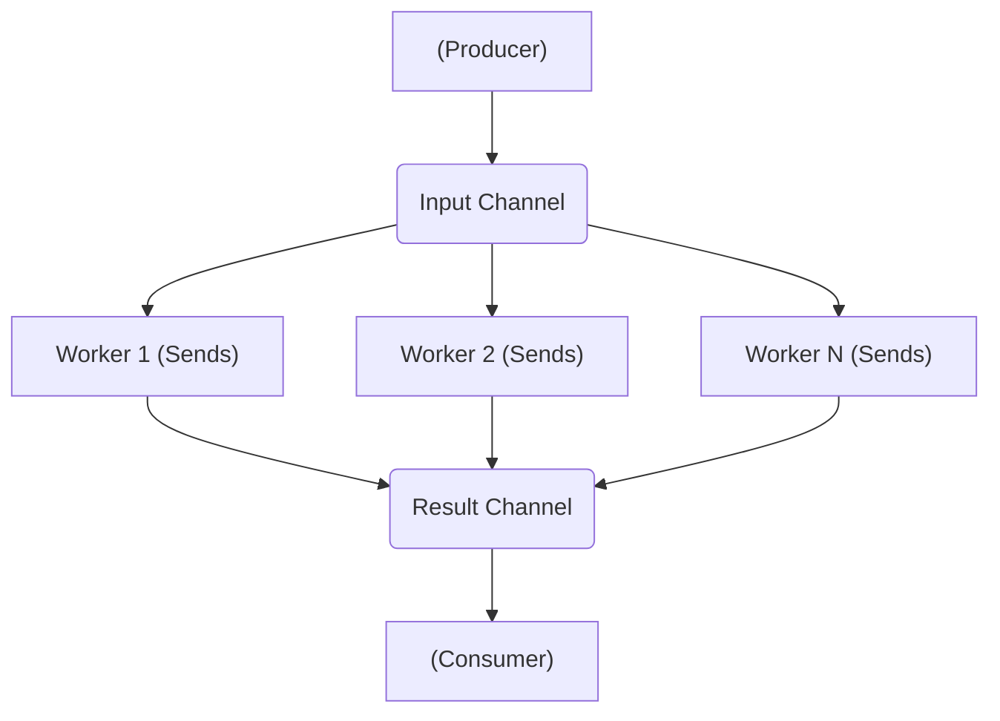
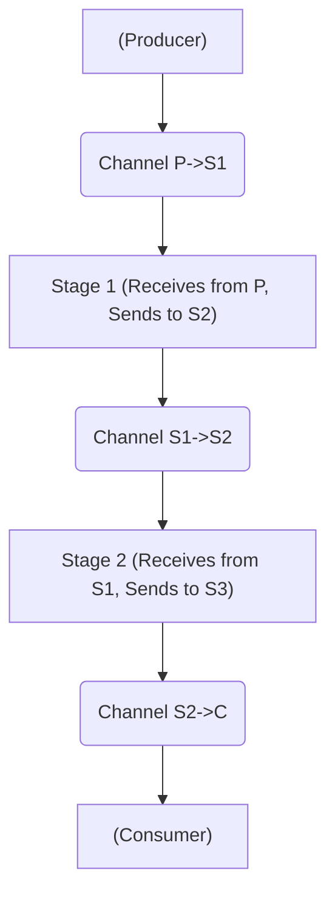

# Channels

This section delves into **Channels**, a powerful and idiomatic mechanism in Rust for concurrent programming, primarily based on the principle of **message passing**.

## Concurrency Models

There are two primary models for structuring concurrent programs:

1.  **Shared Data Structure (or Shared Memory):** In this model, concurrent execution flows (threads) communicate and coordinate by accessing and modifying shared data structures in memory. **Synchronization primitives** (like Mutexes, RwLocks, Atomics, Condition Variables) are used to *synchronize* access to this shared data, thereby enabling *communication* (threads read/write state changes visible to others).
2.  **Message Passing:** In this model, concurrent execution flows *communicate* with each other by sending and receiving messages through channels. The act of sending and receiving messages inherently provides **synchronization** (e.g., a message cannot be received before it is sent). Data is transferred from one flow to another, often transferring ownership in the process.

Rust's standard library provides robust support for both models, but message passing via channels is often highlighted as a safer and more idiomatic approach for many scenarios, aligning well with Rust's focus on ownership and safety.

## Message Passing (`std::sync::mpsc`)

Rust's standard library offers a message passing implementation in the `std::sync::mpsc` module. `mpsc` stands for "**multiple producer, single consumer**".

*   `std::sync::mpsc::channel<T>()`: This function creates a new **unbounded channel**. It returns an ordered pair: a `Sender<T>` and a `Receiver<T>`. `T` is the type of data that will be sent through the channel.
*   `Sender<T>`: The sending end of the channel. It has a `send(value: T)` method.
*   `Receiver<T>`: The receiving end of the channel. It has a `recv()` method.
*   **FIFO Order:** Messages sent through the channel are guaranteed to arrive at the receiver in the order they were sent (First-In, First-Out).
*   **Unbounded Capacity:** For channels created with `channel()`, the sender's `send()` method is **non-blocking**. Messages are queued up internally if the receiver isn't ready, and the channel can grow indefinitely (limited only by available memory).
*   **Blocking Receive:** The receiver's `recv()` method is **blocking**. It will pause the receiving thread's execution until a message is available in the channel.
*   **Channel Closure:** A channel is considered "closed" when *all* sender ends (`Sender<T>`) associated with it have been dropped, *and* the channel queue is empty.
    *   If `recv()` is called on a channel that is closed and empty, it will return an `Err` variant wrapping a `RecvError`.
    *   If `send()` is called on a channel whose receiver has been dropped, it will return an `Err` variant wrapping a `SendError<T>`.
*   **`Send` Trait:** The type of data `T` being sent through the channel must implement the `Send` trait. This trait is a marker trait indicating that a type's ownership can be safely transferred between threads.
*   **Multiple Producers - Single Consumer:** `mpsc` channels are designed such that the `Sender<T>` can be cloned (`sender.clone()`) to allow multiple threads to send messages to the same channel. However, the `Receiver<T>` cannot be cloned, meaning only one thread can receive messages from a given channel instance.

In message passing, the act of passing a message inherently transfers ownership of the data item from the sender to the receiver. This ownership transfer serves as both **synchronization** (the receive operation logically happens *after* the send operation) and **communication** (the data being transferred *is* the message). Channels allow threads to coordinate without explicit mutexes or condition variables for basic sending/receiving data.

### Unbounded Channel Example (`std::sync::mpsc::channel`)

This example shows multiple threads sending simple messages ("ok") to a single receiver thread using an unbounded channel.

```rust
use std::sync::mpsc::{channel, Sender}; // Import channel and Sender types
use std::thread;                       // For spawning threads
use std::time::Duration;               // For sleeping

fn main() {
    let mut handles = vec![]; // Vector to hold thread handles

    // Create an unbounded channel. Returns a Sender and a Receiver pair.
    let (tx, rx) = channel::<String>(); // Specify the type of messages (String)

    // Spawn 3 sender threads
    for i in 0..3 {
        // Clone the original sender (tx) for each thread.
        // This allows multiple threads to send messages to the same receiver.
        let tx_clone = tx.clone();
        let thread_id = i;

        // Spawn a thread. The `move` keyword transfers ownership of `tx_clone` into the closure.
        handles.push(thread::spawn(move || {
            let message = format!("ok from thread {}", thread_id);
            println!("[Sender {}] Sending: '{}'", thread_id, message);

            // Send a message through the channel. This is non-blocking for unbounded channels.
            // `send()` returns a Result. `unwrap()` will panic if the receiver has been dropped.
            tx_clone.send(message).unwrap();

            // The cloned sender `tx_clone` is dropped when the thread finishes.
            println!("[Sender {}] Finished.", thread_id);
        }));
    }

    // Drop the original sender in the main thread.
    // This is crucial! The `rx.recv()` loop below will only terminate
    // *after* ALL sender handles (the original `tx` and all its clones) are dropped AND
    // the channel queue becomes empty.
    drop(tx);
    println!("[Main] Dropped original sender.");

    // Receiver loop in the main thread.
    println!("[Main] Waiting for messages...");
    // `rx.recv()` blocks until a message is available or the channel is closed (all senders dropped and empty).
    // `while let Ok(msg) = rx.recv()` loops as long as `recv()` successfully receives a message (returns Ok).
    // It exits the loop when `recv()` returns Err (meaning the channel is closed and empty).
    while let Ok(msg) = rx.recv() {
        println!("[Receiver] Received: '{}'", msg);
        // Simulate processing time
        thread::sleep(Duration::from_millis(50));
    }
    println!("[Main] Receiver loop finished (channel closed and empty).");

    // Wait for all sender threads to finish
    for handle in handles {
        handle.join().expect("Sender thread panicked");
    }
    println!("[Main] All sender threads joined. Program finished.");
}
```

Example demonstrating sending different messages from cloned senders.

```rust
use std::sync::mpsc::{Sender, channel, Receiver}; // Import necessary types
use std::thread;                               // For spawning threads
use std::time::Duration;                       // For sleeping

// Although not strictly necessary here, this struct could hold channel ends
// if they needed to be grouped or managed.
struct SharedMsg{
    tx: Sender<String>,
    rx: Receiver<String>
}

impl SharedMsg{
    pub fn new()->Self{
        // Create an unbounded channel for String messages
        let (tx,rx) = channel::<String>();
        SharedMsg { tx, rx }
    }
}

fn main() {
    let mut handles = vec![]; // Vector to hold thread handles

    // Create the shared message structure (containing channel ends)
    let shared = SharedMsg::new();

    // Clone the sender for the first thread
    let tx1 = shared.tx.clone();
    handles.push(thread::spawn(move|| { // Move cloned sender into closure
        println!("[Sender 1] Sending 'Ciao'...");
        // Send the message. Check for error (if receiver dropped).
        if tx1.send("Ciao".to_string()).is_err() {
            println!("[Sender 1] Errore nell'invio del messaggio (Receiver dropped).");
        }
        println!("[Sender 1] Finished.");
    }));

    // Clone the sender for the second thread
    let tx2 = shared.tx.clone();
    handles.push(thread::spawn(move|| { // Move cloned sender into closure
         thread::sleep(Duration::from_millis(20)); // Simulate delay
        println!("[Sender 2] Sending 'Come stai?'...");
        // Send the message. Check for error.
        if tx2.send("Come stai?".to_string()).is_err() {
            println!("[Sender 2] Errore nell'invio del messaggio (Receiver dropped).");
        }
         println!("[Sender 2] Finished.");
    }));

    // Drop the original sender in main. This is needed so the receiver's loop eventually terminates.
    // The channel remains open as long as tx1 or tx2 clones exist.
    drop(shared.tx);
    println!("[Main] Dropped original sender.");


    // Receiver loop in main thread.
    println!("[Main] Waiting for messages...");
    // `while let Ok(...)` receives until the channel is closed and empty.
    while let Ok(msg) = shared.rx.recv() {
        println!("Messaggio ricevuto:");
        println!("- {}", msg); // Print the received message
         thread::sleep(Duration::from_millis(50)); // Simulate processing
    }
    println!("[Main] Receiver loop finished (channel closed and empty).");


    // Wait for sender threads to finish
    for handle in handles {
        handle.join().expect("Sender thread panicked");
    }
     println!("[Main] All sender threads joined. Program finished.");
}
```

## Producer-Consumer with Shared Counter (`std::sync::mpsc`)

This example combines message passing (for sending tasks) with shared memory synchronization (`Arc<Mutex>`) for aggregating results (counting processed tasks). Multiple producer threads send `Task` structs through a channel to a single consumer thread, which processes them and updates a shared counter.

```rust
use std::sync::mpsc::{channel, Sender, Receiver}; // Channel types
use std::thread;                             // Thread spawning
use std::sync::{Arc, Mutex};                 // Shared memory synchronization
use std::time::Duration;                     // Sleeping

#[derive(Debug)] // Allow printing Task with {:?}
pub struct Task {
    id: usize,
    testo: String,
}

fn main() {
    let mut handles = vec![]; // Vector to store thread handles

    // Create an unbounded channel for sending Task structs.
    let (task_sender, task_receiver) = channel::<Task>();

    // Shared counter for processed tasks.
    // Use Arc for shared ownership across threads.
    // Use Mutex to protect the counter for safe mutable access.
    let result_counter = Arc::new(Mutex::new(0));

    let num_producers = 2;
    let num_tasks_per_producer = 100;

    // Spawn `num_producers` producer threads
    for i in 0..num_producers {
        // Clone the sender for this producer thread.
        let tx = task_sender.clone();
        let producer_id = i;

        // Spawn the producer thread. Move the cloned sender into the closure.
        handles.push(thread::spawn(move || {
            println!("[Produttore {}] Avviato...", producer_id);
            for j in 0..num_tasks_per_producer {
                let task = Task {
                    id: producer_id * num_tasks_per_producer + j,
                    testo: format!("Task {} from Producer {}", j, producer_id),
                };
                // Send the task through the channel. Non-blocking for unbounded.
                // Unwrap will panic if the receiver is dropped.
                tx.send(task).unwrap();
                // thread::sleep(Duration::from_nanos(1)); // Small sleep
            }
            println!("[Produttore {}] Finito di produrre.", producer_id);
             // The cloned sender `tx` is dropped when the thread finishes.
        }));
    }

    // Spawn the single consumer thread.
    // Clone the Arc for the consumer thread to access the shared counter.
    let result_counter_c = Arc::clone(&result_counter);
    handles.push(thread::spawn(move || {
        println!("[Consumatore] Avviato...");
        let mut tasks_processed_count_local = 0; // Local counter for verification

        loop {
            // Receive a Task from the channel. This blocks if the channel is empty.
            match task_receiver.recv() {
                Ok(task) => {
                    // println!("[Consumatore] Elaboro Task id: {}", task.id); // Debug print
                    tasks_processed_count_local += 1; // Increment local counter
                    // thread::sleep(Duration::from_nanos(1)); // Simulate task processing work

                    // Acquire the mutex lock to safely update the shared counter.
                    {
                        let mut counter_guard = result_counter_c.lock().unwrap(); // Blocks if mutex held
                        *counter_guard += 1; // Increment the shared counter
                    } // The mutex guard is dropped here, releasing the mutex lock.
                }
                Err(_) => {
                    // `recv()` returns Err when the channel is closed (all senders dropped) AND empty.
                    println!("[Consumatore] Canale chiuso e vuoto. Terminazione.");
                    break; // Exit the consumer loop
                }
            }
        }
         println!("[Consumatore] Finito. Elaborati {} compiti localmente.", tasks_processed_count_local);
    }));

    // Drop the original sender in main.
    // This is necessary so that when ALL producer threads finish and drop their cloned senders,
    // the channel will become closed, allowing the consumer's `recv()` loop to eventually return Err.
    drop(task_sender);
    println!("[Main] Dropped original sender.");


    // Wait for all threads (producers and consumer) to finish.
    for handle in handles {
        handle.join().expect("A thread panicked");
    }

    // Print the final total count, acquiring the mutex one last time in main.
    let final_counter_guard = result_counter.lock().unwrap();
    println!("Total tasks processed: {}", *final_counter_guard); // Output: Total tasks processed: 200
}
```

## Synchronous Channels (`std::sync::mpsc::sync_channel`)

`std::sync::mpsc::sync_channel<T>(bound: usize)` creates a **bounded channel** with a fixed capacity `bound`.

*   It returns a `SyncSender<T>` and a `Receiver<T>`. `SyncSender` indicates that the `send` method might block.
*   If the channel currently holds `bound` messages, calling `send()` will **block** the sending thread until a receiver calls `recv()`, making space available in the channel.
*   A `bound` of `0` creates a **rendezvous channel**. In this case, `send()` will block until a receiver is *already* waiting with a `recv()` call. Data is transferred directly from sender to receiver without being buffered.

Synchronous channels are useful when you want to limit the amount of buffered data between producers and consumers, or enforce that producers and consumers coordinate more tightly (like in a rendezvous).

### Synchronous Channel Examples

**Bounded (Capacity 1):** Demonstrates the sender blocking when the buffer is full.

```rust
use std::time::Duration;       // For sleeping
use std::sync::mpsc::sync_channel; // Import sync_channel
use std::thread;              // For spawning threads

fn main() {
    // Create a synchronous channel with a bound of 1.
    // The channel can hold at most 1 message before `send()` blocks.
    let (sender, receiver) = sync_channel(1);
    println!("[Main] Created sync_channel with bound 1.");

    // Spawn a thread that attempts to send two messages quickly.
    thread::spawn(move|| { // Move the sender into the thread
        println!("[Sender] Sending 1...");
        sender.send(1).unwrap(); // Sends message 1. Channel has space (0 -> 1). Non-blocking.
        println!("[Sender] Sent 1.");

        println!("[Sender] Sending 2...");
        // Sends message 2. Channel is full (capacity 1, contains message 1).
        // This `send()` call will BLOCK until the receiver reads message 1, making space.
        sender.send(2).unwrap();
        println!("[Sender] Sent 2.");
    });

    println!("[Main] Waiting for messages...");
    // Receive the first message. This unblocks the sender thread which was waiting to send message 2.
    let received1 = receiver.recv().unwrap();
    println!("[Main] Received: {}", received1); // Output: 1

    // Simulate processing time in the receiver (main thread)
    thread::sleep(Duration::from_secs(1)); // Sleep for 1 second

    // Receive the second message.
    let received2 = receiver.recv().unwrap();
    println!("[Main] Received: {}", received2); // Output: 2
    println!("[Main] Finished.");
}
```

**Rendezvous (Capacity 0):** Demonstrates the sender blocking until a receiver is ready.

```rust
use std::sync::mpsc; // Import mpsc module
use std::thread;     // For spawning threads

fn main() {
    // Create a synchronous channel with a bound of 0. This is a rendezvous channel.
    // `send()` will block until a receiver is actively waiting.
    let (sender, receiver) = mpsc::sync_channel(0);
     println!("[Main] Created rendezvous channel.");

    // Sender thread: sends a message.
    thread::spawn(move || { // Move the sender into the thread
        println!("[Sender] Preparing to send message...");
        // This `send()` call will BLOCK immediately because the channel has 0 capacity
        // and the receiver (in the main thread) is not yet waiting with `recv()`.
        sender.send("Sto trasmettendo un messaggio e ci aspettiamo \nall'appuntamento".to_string()).unwrap();
        // This print happens *after* the receiver calls `recv()` and receives the value.
        println!("[Sender] Message sent.");
    });

    // Simulate main thread doing something else briefly.
     thread::sleep(std::time::Duration::from_millis(10));
     println!("[Main] About to receive message...");

    // Main thread (receiver): receive the message.
    // This `recv()` call will block until the sender calls `send()`.
    // Once the sender calls `send()`, the data is transferred directly.
    let received_value = receiver.recv().unwrap();

    println!("Valore ricevuto: {}", received_value); // Output: the message
    println!("[Main] Finished.");
}
```

## The Crossbeam Library

While `std::sync::mpsc` provides basic channels, the `crossbeam` crate (and specifically `crossbeam-channel`) offers more advanced and performant channel implementations, notably supporting **MPMC (Multiple Producer - Multiple Consumer)** and efficient selection over multiple channels.

*   `crossbeam::atomic::AtomicCell<T>`: Provides a thread-safe way to atomically replace or take any value `T` that implements `Send`. Useful for single-slot communication where only the latest value matters or you need to non-blockingly check if a value is available.
*   `crossbeam::queue`: Offers thread-safe, non-blocking, MPMC queues.
    *   `SegQueue<T>`: An unbounded queue. `push(item)` is always non-blocking. `pop()` is non-blocking, returning `Option<T>`.
    *   `ArrayQueue<T>`: A bounded (fixed capacity) queue. `push(item)` is non-blocking, returning `Result<(), T::Error>`. `pop() -> Option<T>` is non-blocking, returning `Some(T)` if successful, `None` if the queue is empty.
*   `crossbeam::channel`: Provides MPMC channels with `bounded(capacity)` and `unbounded()` constructors. Crucially, **both `Sender` and `Receiver` types are `Clone`, `Send`, and `Sync`**, enabling true MPMC patterns. Includes features like `select!` for waiting on multiple channels and time-based receivers (`after`, `tick`).
*   `crossbeam::deque`: Implements work-stealing queues (`Worker`, `Stealer`, `Injector`), a common pattern for load balancing parallel tasks.

## `AtomicCell` (`crossbeam_utils::atomic::AtomicCell`)

An `AtomicCell` allows for atomic operations (load, store, swap, take) on a single value of any type `T` that implements the `Send` trait. This is useful for low-contention scenarios or when you need to pass ownership of a value atomically.

```rust
use crossbeam_utils::atomic::AtomicCell;
use std::sync::Arc; // For shared ownership
use std::thread;     // For spawning threads
use std::time::Duration; // For sleeping

fn main() {
    // Create an AtomicCell holding an Option<String>, shared via Arc.
    // Initially, the cell contains None.
    let message_cell = Arc::new(AtomicCell::new(None::<String>()));
    println!("[Main] Creata AtomicCell: {:?}", message_cell.load()); // Output: None

    // Producer thread: simulates work, puts a message into the cell using `swap`.
    let producer_cell = Arc::clone(&message_cell); // Clone Arc for producer
    let producer_handle = thread::spawn(move || { // Move cloned Arc into closure
        println!("[Produttore] Inizio...");
        thread::sleep(Duration::from_millis(500)); // Simulate work

        let message = String::from("Hello from the producer!");
        // Atomically swap the value in the cell with a new value.
        // Returns the OLD value that was in the cell.
        let old_value = producer_cell.swap(Some(message)); // Cell becomes Some("Hello..."), old_value is None

        println!("[Produttore] Messaggio inserito nella cella. Vecchio valore: {:?}", old_value);
        thread::sleep(Duration::from_millis(500)); // Simulate work
        println!("[Produttore] Fine.");
    });

    // Consumer thread: loops, tries to take the message from the cell using `take`.
    let consumer_cell = Arc::clone(&message_cell); // Clone Arc for consumer
    let consumer_handle = thread::spawn(move || { // Move cloned Arc into closure
        let mut received_message: Option<String> = None;

        loop {
            println!("[Consumatore] In attesa del messaggio...");
            thread::sleep(Duration::from_millis(100)); // Wait briefly

            // Atomically take the value from the cell.
            // Replaces the value in the cell with the type's default (None for Option)
            // and returns the value that *was* in the cell.
            if let Some(msg) = consumer_cell.take() { // Try to take the message
                println!("[Consumatore] Messaggio ricevuto: '{}'", msg);
                received_message = Some(msg);
                break; // Exit loop once received.
            }
             // If take() returns None, the cell was empty. Loop and try again.
        }
        println!("[Consumatore] Fine.");
    });

    // Wait for threads to finish.
    producer_handle.join().unwrap();
    consumer_handle.join().unwrap();

    println!("\n[Main] Programma terminato. Final cell state: {:?}", message_cell.load()); // Load final state (should be None)
}
```

## `crossbeam_channel` (MPMC)

`crossbeam_channel` provides channel implementations where *both* the `Sender` and `Receiver` types implement `Clone`, `Send`, and `Sync`. This enables True MPMC (Multiple Producer - Multiple Consumer) patterns. Any message sent to the channel by any producer can be received by any one of the waiting consumers (a message is received by *only one* consumer).

Crossbeam channels are well-suited for:

*   **Fan-out / Fan-in:** One producer distributing tasks to multiple workers (fan-out via cloning the receiver for workers), and multiple workers sending results back to a single consumer (fan-in via cloning the sender for workers).
*   **Pipeline:** Chaining multiple processing stages using channels between them.
*   **General Producer / Consumer (MPMC):** Any number of producers sending tasks, and any number of consumers picking them up.

**Fan-Out / Fan-in Diagram:**

<p align="center">



</p>

**Pipeline Diagram:**

<p align="center">



</p>

## Fan-Out / Fan-In Example (`crossbeam_channel`)

```rust
use std::thread;
use crossbeam_channel::{bounded, Receiver, Sender}; // Import crossbeam_channel

// Worker function: receives tasks, processes, sends results
fn worker(id: usize, rx: Receiver<i32>, tx: Sender<String>) {
    println!("[Worker {}] Avviato.", id);
    // Loop until the input channel is closed and empty
    while let Ok(value) = rx.recv() { // Receive from the input channel
        // Simulate processing
        let result = format!("W{} ({})", id, value);
        println!("[Worker {}] Elaboro {}. Invio '{}'", id, value, result);
        // Send the result to the output channel
        tx.send(result).unwrap(); // Panics if receiver dropped
    }
    println!("[Worker {}] Canale input chiuso. Terminazione.", id);
     // The worker's clone of the output sender (tx) is dropped here.
}

fn main() {
    // Create the Producer -> Worker (Input) channel. Bounded with capacity 10.
    let (tx_input, rx_input) = bounded::<i32>(10);
    println!("[Main] Canale input (P->W) creato.");

    // Create the Worker -> Consumer (Output) channel. Bounded with capacity 10.
    let (tx_output, rx_output) = bounded::<String>(10);
     println!("[Main] Canale output (W->C) creato.");

    let num_workers = 3;
    let mut worker_handles = Vec::new();

    // Spawn workers (Fan-out):
    // Each worker needs a RECEIVER clone for the input channel (rx_input)
    // Each worker needs a SENDER clone for the output channel (tx_output)
    for i in 0..num_workers {
        let rx = rx_input.clone(); // Clone the input receiver for this worker
        let tx = tx_output.clone(); // Clone the output sender for this worker
        worker_handles.push(thread::spawn(move || worker(i, rx, tx))); // Move clones into closure
    }
    println!("[Main] {} worker threads avviati.", num_workers);

    // Producer (main thread): send tasks to the input channel.
    println!("[Main] Invio compiti ai worker...");
    for i in 1..=10 {
        tx_input.send(i).unwrap(); // Send task. Panics if receiver dropped.
    }
    println!("[Main] Finito di inviare compiti. Chiudo canale input.");
    // Drop the original producer's sender handle for the input channel.
    // This signals to the workers (via their cloned receivers) that no more input is coming.
    drop(tx_input);

    // Consumer (main thread): receive results from the output channel (Fan-in).
    println!("[Main] In attesa di risultati dai worker...");
    // Loop until the output channel is closed (all worker tx clones dropped) AND empty.
    while let Ok(result) = rx_output.recv() {
        println!("Received result: {}", result);
    }
    println!("[Main] Canale output chiuso e vuoto. Finito di ricevere risultati.");


    // Wait for all worker threads to finish.
    for handle in worker_handles {
        handle.join().unwrap(); // Panics if a worker thread panicked
    }
    println!("[Main] Tutti i worker threads terminati. Programma finito.");
}
```

## Pipeline Example (`crossbeam_channel`)

```rust
use std::thread;
use crossbeam_channel::{bounded, Receiver, Sender}; // Import crossbeam_channel

// Stage 1: Receives i32, transforms to String, sends String
fn stage_one(rx: Receiver<i32>, tx: Sender<String>) {
    println!("[Stage 1] Avviato.");
    while let Ok(value) = rx.recv() { // Receive from input channel (P->S1)
        println!("[Stage 1] Ricevuto: {}. Elaboro...", value);
        let processed = format!("Processed({})", value);
        // Send processed value to the next stage (S1->S2)
        tx.send(processed).unwrap(); // Panics if next stage receiver dropped
    }
    println!("[Stage 1] Canale input chiuso. Finito di elaborare. Chiudo canale output.");
    // Drop the sender to the next stage (S1->S2) when input is exhausted.
    drop(tx);
}

// Stage 2: Receives String, transforms to String, sends String
fn stage_two(rx: Receiver<String>, tx: Sender<String>) {
    println!("[Stage 2] Avviato.");
    while let Ok(value) = rx.recv() { // Receive from input channel (S1->S2)
        println!("[Stage 2] Ricevuto: '{}'. Elaboro...", value);
        let final_result = format!("Final({})", value);
        // Send final result to the consumer (S2->C)
        tx.send(final_result).unwrap(); // Panics if consumer receiver dropped
    }
    println!("[Stage 2] Canale input chiuso. Finito di elaborare. Chiudo canale output.");
    // Drop the sender to the consumer (S2->C) when input is exhausted.
    drop(tx);
}

fn main() {
    // Create channels linking the stages:
    // 1. Producer (main) -> Stage 1 (P->S1)
    let (tx_p_s1, rx_p_s1) = bounded::<i32>(10);
    println!("[Main] Canale P->S1 creato.");
    // 2. Stage 1 -> Stage 2 (S1->S2)
    let (tx_s1_s2, rx_s1_s2) = bounded::<String>(10);
    println!("[Main] Canale S1->S2 creato.");
    // 3. Stage 2 -> Consumer (main) (S2->C)
    let (tx_s2_c, rx_s2_c) = bounded::<String>(10);
    println!("[Main] Canale S2->C creato.");


    // Spawn stage threads, moving the appropriate channel ends into each.
    // Stage 1 gets rx_p_s1 and tx_s1_s2
    let stage_one_handle = thread::spawn(move || stage_one(rx_p_s1, tx_s1_s2));
    println!("[Main] Thread Stage 1 avviato.");
    // Stage 2 gets rx_s1_s2 and tx_s2_c
    let stage_two_handle = thread::spawn(move || stage_two(rx_s1_s2, tx_s2_c));
    println!("[Main] Thread Stage 2 avviato.");


    // Producer (main thread): send data to Stage 1.
    println!("[Main] Invio dati a Stage 1...");
    for i in 1..=5 {
        tx_p_s1.send(i).unwrap(); // Send task to Stage 1
    }
    println!("[Main] Finito di inviare dati a Stage 1. Chiudo canale P->S1.");
    // Drop the producer's sender to Stage 1. This signals to Stage 1 that no more input is coming.
    drop(tx_p_s1);


    // Consumer (main thread): receive results from Stage 2.
    println!("[Main] In attesa di risultati da Stage 2...");
    // Loop until the S2->C channel is closed (by Stage 2 dropping its sender) AND empty.
    while let Ok(result) = rx_s2_c.recv() {
        println!("Received final result: {}", result);
    }
    println!("[Main] Canale S2->C chiuso e vuoto. Finito di ricevere.");


    // Wait for stage threads to finish. Their loops terminate when their input channels close.
    stage_one_handle.join().unwrap();
    stage_two_handle.join().unwrap();
     println!("[Main] Tutti i stage threads terminati. Programma finito.");
}
```

## Producer/Consumer (MPMC) Example (`crossbeam_channel`)

This example shows multiple producer threads sending messages to a channel, and multiple consumer threads receiving messages from that *same* channel. Each message sent by a producer is received by *exactly one* of the waiting consumers.

```rust
use std::thread;
use crossbeam_channel::{bounded, Receiver, Sender}; // Import crossbeam_channel
use std::time::Duration; // For sleeping

// Producer function: sends (producer ID, value) tuples
fn producer(id: usize, tx: Sender<(usize, i32)>) {
    println!("[Produttore {}] Avviato.", id);
    for i in 1..=3 { // Each producer sends 3 messages
        let message = (id, i as i32); // Create message: (producer ID, message value)
        println!("[Produttore {}] Invio: {:?}", id, message);
        // Send the message. Panics if receiver is dropped.
        tx.send(message).unwrap();
        thread::sleep(Duration::from_millis(50 * (id as u64 + 1))); // Simulate work
    }
    println!("[Produttore {}] Finito di inviare.", id);
    // The cloned sender (tx) is dropped when the thread finishes.
}

// Consumer function: receives (producer ID, value) tuples
fn consumer(id: usize, rx: Receiver<(usize, i32)>) {
    println!("[Consumatore {}] Avviato.", id);
    // Loop until the channel is closed and empty.
    while let Ok((sender_id, val)) = rx.recv() { // Receive one message (from any producer)
        println!("[Consumatore {}] Ricevuto {} da Produttore {}", id, val, sender_id);
        thread::sleep(Duration::from_millis(70)); // Simulate work
    }
     println!("[Consumatore {}] Canale chiuso. Terminazione.", id);
    // The cloned receiver (rx) is dropped when the thread finishes.
}

fn main() {
    // Create a bounded MPMC channel with capacity 10.
    // Both `tx` and `rx` are Clone, Send, Sync.
    let (tx, rx) = bounded::<(usize, i32)>(10);
    println!("[Main] Canale MPMC creato.");

    let num_producers = 3;
    let num_consumers = 2;
    let mut handles = Vec::new(); // To hold thread handles

    // Spawn producers, cloning sender for each. (MP part)
    for i in 0..num_producers {
        let tx_clone = tx.clone(); // Clone the sender for this producer
        handles.push(thread::spawn(move || producer(i, tx_clone))); // Move clone into closure
    }
    println!("[Main] {} produttori avviati.", num_producers);

    // Spawn consumers, cloning receiver for each. (MC part)
    for i in 0..num_consumers {
        let rx_clone = rx.clone(); // Clone the receiver for this consumer
        handles.push(thread::spawn(move || consumer(i, rx_clone))); // Move clone into closure
    }
    println!("[Main] {} consumatori avviati.", num_consumers);


    // Drop original sender and receiver in main.
    // This is CRITICAL for the consumer loops (`rx.recv()`) to terminate eventually.
    // The channel closes only when *all* sender handles are dropped AND *all* receiver handles are dropped.
    // If receivers are dropped first, senders get SendError. If senders are dropped first, receivers get RecvError.
    drop(tx);
    drop(rx);
    println!("[Main] Droppato sender e receiver originali.");


    // Wait for all threads (producers and consumers) to finish.
    for handle in handles {
        handle.join().unwrap(); // Panics if a thread panicked
    }
    println!("[Main] Tutti i threads terminati. Programma finito.");
}
```

## Multiple Producer - Single Consumer Example (`crossbeam_channel` unbounded)

This example demonstrates using `crossbeam_channel::unbounded` (which also supports MPMC, but we'll use it in an MPSC pattern here) with multiple producers and a single consumer, and shows how the consumer's `iter()` method can be used to receive messages.

```rust
use std::thread;
use crossbeam_channel::{unbounded, Receiver, Sender}; // crossbeam_channel
use std::time::Duration;

fn main() {
    // Create an unbounded crossbeam channel.
    // Both sender (tx) and receiver (rx) are MPMC-capable (Clone, Send, Sync).
    let (tx, rx) = unbounded::<String>();
    println!("[Main] Unbounded crossbeam_channel creato.");

    let num_producers = 3;
    let mut producer_handles = vec![];

    // Spawn `num_producers` producer threads
    for i in 0..num_producers {
        let tx_clone = tx.clone(); // Clone the sender for this producer
        let producer_id = i;
        let handle = thread::spawn(move || { // Move clone into closure
            println!("[Produttore {}] Avviato.", producer_id);
            for j in 0..2 { // Each producer sends 2 messages
                let message = format!("Messaggio {} dal produttore {}", j, producer_id);
                println!("[Produttore {}] Invio: '{}'", producer_id, message);
                // Send message. Non-blocking for unbounded channel.
                if let Err(e) = tx_clone.send(message) {
                    println!("[Produttore {}] Errore invio (Consumatore droppato): {:?}", producer_id, e);
                    break; // Exit loop on send error
                }
                thread::sleep(Duration::from_millis(50 * (producer_id as u64 + 1))); // Simulate work
            }
            println!("[Produttore {}] Finito di inviare.", producer_id);
            // The cloned sender (tx_clone) is dropped here.
        });
        producer_handles.push(handle); // Store handle
    }

    // Spawn the single consumer thread.
    // Move the ORIGINAL receiver (rx) into the consumer thread.
    let consumer_handle = thread::spawn(move || {
        println!("[Consumatore] In attesa di messaggi...");
        // `rx.iter()` provides an iterator that blocks until a message is available.
        // It continues until the channel is closed (all senders dropped) AND empty.
        for message in rx.iter() {
            println!("[Consumatore] Ricevuto: '{}'", message);
            thread::sleep(Duration::from_millis(100)); // Simulate processing
        }
        // The loop terminates when the channel is closed and empty.
        println!("[Consumatore] Canale chiuso. Finito di ricevere.");
        // The receiver (rx) is dropped here.
    });

    // Wait for all producer threads to finish.
    for handle in producer_handles {
        handle.join().expect("Il thread produttore non è terminato correttamente");
    }
    println!("\n[Main] Tutti i produttori hanno finito di inviare.");

    // Drop the original sender in main.
    // This is necessary to signal the consumer's `rx.iter()` loop to terminate
    // after it has received all pending messages. If this wasn't dropped, the iter()
    // would wait indefinitely for more messages.
    drop(tx);
    println!("[Main] Invio segnale di SHUTDOWN al consumatore (dropping sender).");

    // Wait for the consumer thread to finish.
    consumer_handle.join().expect("Il thread consumatore non è terminato correttamente");
    println!("[Main] Programma terminato.");
}
```

## `crossbeam_channel::select` and Time-based Receivers

`crossbeam_channel` provides a powerful `select!` macro that allows a single thread to wait on multiple channel operations (sends or receives) and proceed with the first operation that becomes ready. This is useful for handling multiple event sources or implementing timeouts.

*   `crossbeam_channel::after(duration)`: Creates a special receiver that sends a single `()` message after the specified `duration` has elapsed.
*   `crossbeam_channel::tick(duration)`: Creates a special receiver that sends a `()` message periodically, with a frequency specified by `duration`.

These time-based receivers can be used within `select!` branches to implement timeouts, periodic actions, or heartbeats.

```rust
use crossbeam_channel::select; // Import the select! macro
use crossbeam_channel::channel; // For basic channels
use std::thread; // For spawning threads
use std::time::{Duration, Instant}; // For durations and timing

fn main() {
    // Create a channel for receiving results from a worker. Bounded capacity 1.
    let (s, r) = channel::bounded(1);

    // Create a timeout channel that will send a message after 5 seconds.
    let after = channel::after(Duration::from_secs(5));
    println!("[Main] Timeout set for 5 seconds.");


    // Worker thread: simulates work and sends completion messages.
    thread::spawn(move || { // Move sender s into closure
        println!("[Worker] Avviato. Simulo lavoro con durate crescenti.");
        for i in 1..=10 { // Simulate 10 operations
            let start = Instant::now();
            let work_duration = Duration::from_millis(i * 500); // Work duration increases (0.5s, 1s, 1.5s...)
            while start.elapsed() < work_duration {
                 // Simulate work by busy waiting (bad practice in real code, use sleep)
                 // thread::sleep(Duration::from_millis(10)); // Better: use sleep
             }
             println!("[Worker] Lavoro {} completato ({}ms).", i, work_duration.as_millis());
            // Send completion message. This might block if the receiver (main) isn't ready
            // and the channel is full (capacity 1).
            let send_result = s.send(format!("Operazione {} completata dopo {:?}", i, work_duration));
            if send_result.is_err() {
                println!("[Worker] Errore nell'invio del risultato: {:?}", send_result.unwrap_err());
                break; // Exit if send fails (receiver dropped)
            }
        }
         println!("[Worker] Finito di simulare lavoro. Chiudo canale.");
         // Sender s is dropped here.
    });

    println!("[Main] select! allows listening to multiple channels simultaneously...");
    println!("[Main] Aspetto risultato o timeout...");

    // Monitor loop in main thread: uses select! to wait on either the result channel or the timeout channel.
    loop {
        select! {
            // This branch is executed if a message is received from the `after` channel (timeout occurred).
            recv(after) -> _ => { // `_` because we don't care about the () message
                println!("[Main] Timeout! Operazione non completata in tempo.");
                break; // Exit the monitor loop
            },
            // This branch is executed if a message is received from the `r` channel (worker sent a result).
            recv(r) -> msg => { // `msg` is the received message (Result<String, RecvError>)
                match msg {
                    Ok(received_msg) => println!("[Main] Ricevuto risultato: '{}'", received_msg),
                    Err(_) => { // Channel closed and empty (worker finished/panicked)
                         println!("[Main] Canale risultati chiuso.");
                         // Check if there are any remaining messages after the channel closed
                         while let Ok(msg) = r.try_recv() { // Use try_recv() for non-blocking check
                              println!("[Main] Received remaining: '{}'", msg);
                         }
                        break; // Exit the monitor loop
                    }
                }
            },
        }
         println!("[Main] Continuo ad aspettare...");
    }

    // Note: We might need to explicitly join the worker thread here in a real app
    // to ensure it finishes and resources are cleaned up.
    // Example: worker_handle.join().unwrap(); (requires storing the JoinHandle)
     println!("[Main] Programma terminato.");
}
```

**`after` and `tick` example:** Demonstrates using `tick` for a periodic heartbeat and `after` for an overall timeout, combined with a channel for process completion signal.

```rust
use crossbeam_channel::{tick, after, select, bounded}; // Import time-based channels, select!, bounded
use std::thread; // For spawning threads
use std::time::Duration; // For durations
use rand::Rng; // For random number generation

fn main() {
    // Heartbeat channel: sends a message every 500ms.
    let heartbeat_rx = tick(Duration::from_millis(500));
    println!("[Monitor] Heartbeat impostato per ogni 500ms.");

    // Overall timeout channel: sends a message after 5 seconds.
    let timeout_rx = after(Duration::from_secs(5));
     println!("[Monitor] Timeout complessivo impostato per 5 secondi.");

    // Channel for the monitored process to signal completion. Bounded(0) for rendezvous.
    let (process_completion_tx, process_completion_rx) = bounded(0); // Rendezvous channel
     println!("[Monitor] Canale di completamento processo (rendezvous) creato.");

    // Monitored process thread: simulates variable work and signals completion.
    let process_handle = thread::spawn(move || { // Move completion sender into closure
        println!("[Processo] Avviato...");
        let mut rng = rand::thread_rng();
        // Simulate work duration between 0.5s and 5s.
        let work_duration_millis = (rng.gen::<u64>() % 4500) + 500;
        println!("[Processo] Lavorerò per {} ms.", work_duration_millis);
        thread::sleep(Duration::from_millis(work_duration_millis)); // Simulate work
        println!("[Processo] Lavoro completato in {} ms.", work_duration_millis);

        // Send completion signal. This will block if the receiver isn't ready (rendezvous).
        // Use `unwrap()` - panics if receiver dropped.
        let _ = process_completion_tx.send(());
        println!("[Processo] Segnalazione di completamento inviata.");
    });

    println!("[Monitor] In attesa di eventi (Heartbeat, Completamento, Timeout)...");

    // Monitor loop: uses select! to wait on heartbeat, completion, or timeout.
    loop {
        select! {
            // Branch for heartbeat channel.
            recv(heartbeat_rx) -> _ => { // Receives () from the tick channel
                println!("[Monitor] Segnale ricevuto! Il processo è ancora vivo.");
            },
            // Branch for process completion channel.
            recv(process_completion_rx) -> _ => { // Receives () from the bounded(0) channel
                println!("[Monitor] Processo completato con successo!");
                break; // Exit the monitor loop on successful completion
            },
            // Branch for timeout channel.
            recv(timeout_rx) -> _ => { // Receives () from the after channel
                println!("[Monitor] ATTENZIONE: Timeout scaduto! Il processo non è finito in tempo.");
                // IMPORTANT: The process thread might be blocked on `process_completion_tx.send(())`
                // if we timed out before the main thread reached the `process_completion_rx` branch.
                // We must receive from the completion channel here to unblock the process thread
                // and allow it to finish, preventing a potential deadlock or hang.
                let _ = process_completion_rx.recv(); // This receive unblocks the sender thread
                break; // Exit the monitor loop on timeout
            },
        }
    }

    // Wait for the monitored process thread to finish.
    process_handle.join().expect("Il thread del processo non è terminato correttamente");

    println!("[Main] Programma terminato.");
}
```

## `crossbeam::queue` Module (MPMC Queues)

Crossbeam's `queue` module provides non-blocking, MPMC-safe queue implementations that don't rely on the channel interface (`send`/`recv`). They are simple concurrent queues.

*   `SegQueue<T>`: An **unbounded**, thread-safe, MPMC FIFO queue. `push(item)` is always non-blocking. `pop() -> Option<T>` is non-blocking, returning `Some(item)` if successful, `None` if the queue is empty.
*   `ArrayQueue<T>`: A **bounded** (fixed capacity), thread-safe, MPMC circular queue. `push(item) -> Result<(), T>` is non-blocking, returning `Ok(())` if successful, `Err(item)` if the queue is full. `pop() -> Option<T>` is non-blocking, returning `Some(item)` if successful, `None` if the queue is empty.

These queues are useful for scenarios where producers don't want to block when sending, and consumers can check for items non-blockingly (often sleeping briefly if the queue is empty to avoid busy-waiting).

```rust
use crossbeam::queue::ArrayQueue; // Import ArrayQueue
use std::sync::Arc;              // For shared ownership
use std::thread;                 // For spawning threads
use std::time::Duration;         // For sleeping

// Define types of work items for the queue
#[derive(Debug, Clone)] // Needs Clone to push multiple copies if needed
enum Work {
    Task(u32),
    Stop, // Signal to stop the worker
}

fn main() {
    // Create a bounded ArrayQueue with capacity 5, shared via Arc.
    let queue = Arc::new(ArrayQueue::new(5));
    println!("[Main] Creata ArrayQueue con capacità: {}", queue.capacity());

    let num_workers = 3;
    let mut worker_handles = vec![]; // To hold worker thread handles

    // Spawn worker threads (consumers).
    for i in 0..num_workers {
        let q_clone = Arc::clone(&queue); // Clone Arc for this worker
        let worker_id = i;
        worker_handles.push(thread::spawn(move || { // Move clone into closure
            println!("[Worker {}] In attesa di compiti...", worker_id);
            loop {
                // Non-blocking pop from the queue.
                match q_clone.pop() {
                    Some(Work::Task(task_id)) => {
                        println!("[Worker {}] Elaboro Task {}", worker_id, task_id);
                        thread::sleep(Duration::from_millis(50)); // Simulate work
                    },
                    Some(Work::Stop) => {
                        println!("[Worker {}] Ricevuto segnale di STOP. Terminazione.", worker_id);
                        break; // Exit loop on Stop signal
                    },
                    None => {
                        // Queue is empty. Sleep briefly to avoid busy-waiting.
                        thread::sleep(Duration::from_millis(10));
                    }
                }
            }
            println!("[Worker {}] Fine.", worker_id);
        }));
    }

    // Main thread as producer: generates tasks and pushes them to the queue.
    let num_tasks_to_generate = 15;
    println!("[Main] Genero e invio compiti...");
    for i in 0..num_tasks_to_generate {
        let task = Work::Task(i as u32);
        print!("[Main] Tentativo di invio: {:?}...", task);
        loop {
            // Non-blocking push to the queue. Returns Err(task) if queue is full.
            // Retry the push if it fails due to a full queue.
            match queue.push(task.clone()) {
                Ok(_) => { println!("Inviato."); break; }, // Push successful, break inner loop
                Err(e) => { // Queue full
                    println!("Coda piena. Aspetto... (Non inviato: {:?})", e);
                    thread::sleep(Duration::from_millis(10)); // Wait briefly before retrying
                    // Need to clone `e` because `push` on error returns ownership of the failed item.
                    task = e; // Get ownership back to retry
                }
            }
        }
    }

    // After sending all tasks, send STOP signals (one for each worker).
    thread::sleep(Duration::from_millis(50)); // Give workers time to process last tasks
    println!("\n[Main] Tutti i compiti iniziali inviati. Invio segnale di STOP ai worker.");
     for _ in 0..num_workers {
        loop {
             // Send Stop signal. Retry if queue is full.
             if queue.push(Work::Stop).is_ok() { break; }
             thread::sleep(Duration::from_millis(10));
        }
    }
     println!("[Main] Segnali di STOP inviati.");

    // Wait for all worker threads to finish.
    for handle in worker_handles {
        handle.join().unwrap();
    }
    println!("[Main] Programma terminato.");
}
```

```rust
use crossbeam::queue::SegQueue; // Import SegQueue
use std::sync::Arc;           // For shared ownership
use std::thread;              // For spawning threads
use std::time::Duration;      // For sleeping

// Define event types for the queue
#[derive(Debug, Clone)] // Needs Clone
enum Event {
    Data(String),
    Shutdown, // Signal to stop the consumer
}

fn main() {
    // Create an unbounded SegQueue, shared via Arc.
    let queue = Arc::new(SegQueue::new());
    println!("[Main] SegQueue creata.");

    let num_producers = 3;
    let mut producer_handles = vec![]; // To hold producer handles

    // Spawn producer threads.
    for i in 0..num_producers {
        let q_clone = Arc::clone(&queue); // Clone Arc for this producer
        let producer_id = i;
        producer_handles.push(thread::spawn(move || { // Move clone into closure
            println!("[Produttore {}] Avviato.", producer_id);
            for j in 0..5 { // Each producer sends 5 data events
                let event_data = format!("Dato_{}__{}", producer_id, j);
                let event = Event::Data(event_data);
                println!("[Produttore {}] Invio: {:?}", producer_id, event);
                q_clone.push(event); // push() is non-blocking for SegQueue (unbounded).
                thread::sleep(Duration::from_millis(50 + (producer_id as u64 * 20))); // Simulate work
            }
            println!("[Produttore {}] Finito di inviare.", producer_id);
        }));
    }

    // Consumer thread.
    let q_consumer = Arc::clone(&queue); // Clone Arc for the consumer
    let consumer_handle = thread::spawn(move || { // Move clone into closure
        println!("[Consumatore] In attesa di eventi...");
        let mut received_count = 0;
        loop {
            // Non-blocking pop from the queue.
            match q_consumer.pop() {
                Some(Event::Data(data)) => {
                    println!("[Consumatore] Elaboro: {}", data);
                    received_count += 1;
                    thread::sleep(Duration::from_millis(70)); // Simulate processing
                },
                Some(Event::Shutdown) => {
                    println!("[Consumatore] Ricevuto segnale di SHUTDOWN. Terminazione.");
                    break; // Exit loop on Shutdown signal
                },
                None => {
                    // Queue empty. Sleep briefly to avoid busy-waiting.
                    thread::sleep(Duration::from_millis(5));
                }
            }
        }
        println!("[Consumatore] Terminazione. Elaborati {} eventi.", received_count);
    });

    // Main thread waits for producers to finish, then sends the shutdown signal.
    for handle in producer_handles {
        handle.join().unwrap();
    }
    println!("\n[Main] Tutti i produttori hanno finito di inviare.");

    println!("[Main] Invio segnale di SHUTDOWN al consumatore.");
    // Push the Shutdown signal. Non-blocking for SegQueue.
    queue.push(Event::Shutdown);

    // Wait for the consumer thread to finish.
    consumer_handle.join().unwrap();

    println!("[Main] Programma terminato.");
}
```

## `crossbeam::deque` Module (Work Stealing)

`crossbeam::deque` provides work-stealing queues, a common pattern for load balancing tasks across a fixed pool of threads. Each thread has a double-ended queue (deque), and when a thread's local queue is empty, it can "steal" tasks from the ends of other threads' deques or from a global injector queue.

*   `Worker<T>`: A thread-local double-ended queue. Tasks can be `push`ed and `pop`ed from the front (local access is fast).
*   `Stealer<T>`: A handle obtained from a `Worker`. Allows *other* threads to "steal" tasks from the *back* of the `Worker`'s queue. Stealing is less efficient than local pop but balances load.
*   `Injector<T>`: A thread-safe, MPMC global queue. New tasks can be injected here, and threads can steal from it when their local queue is empty and they cannot steal from others.

Threads typically try to `pop` from their local `Worker` queue first. If empty, they try to `steal` from other `Stealer` handles. If stealing fails (other queues are empty or `Steal::Retry` happens), they try to `steal` from the global `Injector`.

```rust
use crossbeam::deque::{Injector, Steal, Stealer, Worker}; // Work stealing types
use std::sync::Arc;           // For shared ownership of Injector/Stealer
use std::thread;              // For spawning threads
use std::time::Duration;      // For sleeping

fn main() {
    // Create a global Injector queue, shared via Arc. Used for initial task loading.
    let injector = Arc::new(Injector::new());

    // In the main thread, create its local worker queue.
    let worker_main = Worker::new_fifo();
    // Create a stealer handle for the main worker's queue. Other threads will steal from this.
    let stealer_main = worker_main.stealer();

    // Push some initial tasks to the main thread's local worker queue.
    println!("[Main] Aggiungo task alla coda locale...");
    for i in 1..=3 {
        let task = format!("local task {}", i);
        worker_main.push(task);
    }
    println!("[Main] Coda locale: {} task", worker_main.len());

    // Push some initial tasks to the global injector queue.
    println!("[Main] Aggiungo task alla coda globale (Injector)...");
    for i in 4..=6 {
        let task = format!("global task {}", i);
        injector.push(task);
    }
    println!("[Main] Coda globale: {} task", injector.len());


    let num_thieves = 2; // Number of threads that will steal work
    let mut handles = vec![]; // To hold thief thread handles

    // Spawn thief threads. Each needs a cloned Injector and a cloned Stealer.
    for id in 0..num_thieves {
        let injector_clone = injector.clone(); // Clone Injector
        let stealer_clone = stealer_main.clone(); // Clone Stealer for main worker
        let handle = thread::spawn(move || { // Move clones into closure
            println!("[Ladro {}] Avviato...", id);
            loop {
                // Strategy:
                // 1. Try to steal from the main thread's worker queue using its stealer handle.
                // 2. If stealing from the stealer fails (Empty or Retry), try to steal from the global injector.
                let task = match stealer_clone.steal().or_else(|| injector_clone.steal()) {
                    Steal::Success(task) => task, // Successfully stole a task
                    Steal::Retry => { // Steal attempt contested, retry
                        thread::sleep(Duration::from_millis(1)); // Brief sleep
                        continue;
                    },
                    Steal::Empty => { // Both stealer and injector are empty
                        thread::sleep(Duration::from_millis(1)); // Brief sleep
                        if injector_clone.is_empty() && stealer_clone.is_empty() {
                             // Double-check if both empty after short sleep
                            break; // No more work available, exit loop
                        }
                        continue; // Otherwise, continue the loop to retry stealing
                    },
                };
                // If we reached here, we successfully got a task. Execute it.
                println!("[Ladro {id}] Eseguito: {task}");
                // Simulate work
                thread::sleep(Duration::from_millis(50));
            }
            println!("[Ladro {id}] Nessun altro task. Fine.");
        });
        handles.push(handle); // Store handle
    }

    // Main thread processes tasks from its own local queue.
    // It can also participate in stealing if its local queue runs out,
    // but in this example, we simplify and just process local tasks.
    println!("[Main] Eseguo task dalla coda locale...");
    while let Some(task) = worker_main.pop() { // Pop from the front of its own queue
        println!("[Main] Eseguito: {task}");
        thread::sleep(Duration::from_millis(50)); // Simulate work
    }
    println!("[Main] Coda locale vuota. Attendo i ladri di finire.");

    // Wait for thief threads to finish. Their loops exit when no more work is available.
    for handle in handles {
        handle.join().unwrap();
    }
    println!("[Main] Programma terminato.");
}
```

## Rayon Library

`rayon` is a high-level library that simplifies **data parallelism** in Rust. It's designed for scenarios where you want to process elements of a collection or parts of a computation in parallel, without manually managing threads or channels. Rayon uses a **fork-join model** internally and employs **work stealing** (like `crossbeam::deque`) over a fixed thread pool for efficient load balancing.

Key features:

*   `join(task1, task2)`: A simple way to execute two closures (`task1` and `task2`) in parallel and wait for both to complete, returning their results as a tuple.
*   `par_iter()`: Provides parallel iterators for many standard collections (`Vec`, slices, ranges, etc.). You can use standard iterator methods (`map`, `filter`, `fold`, `sum`, `collect`, etc.) on a parallel iterator, and Rayon automatically distributes the work across its thread pool.
*   `ThreadPoolBuilder`: Allows configuring custom thread pools with specific sizes, stack sizes, thread names, etc. You can then use `pool.install(|| { ... })` to execute code within that custom pool.

```rust
// extern crate rayon; // No longer needed in modern Rust if added to Cargo.toml

use rayon::prelude::*; // Bring parallel iterator methods into scope
use rayon::join;         // Import the join function

fn main() {
    // Define two independent parallelizable tasks as closures.
    let task1 = || {
        println!("[Task 1] Esecuzione...");
        (1..=25_000).sum::<i32>() // Compute sum of a range
    };
    let task2 = || {
        println!("[Task 2] Esecuzione...");
        (1..=12).product::<i32>() // Compute product of a range
    };

    // Execute tasks in parallel using join.
    // Rayon uses its internal thread pool. The calling thread might also participate.
    // join waits for both closures to complete and returns their results.
    println!("[Main] Avvio join per task 1 e task 2...");
    let (result1, result2) = join(task1, task2);
    println!("[Main] Entrambi i task terminati.");

    // Use the results from the parallel tasks.
    println!("Risultato task 1: {}", result1);
    println!("Risultato task 2: {}", result2);
    println!("Il risultato combinato è: {}", result1 + result2);
     println!("[Main] Programma terminato.");
}
```

```rust
use rayon::prelude::*; // Bring parallel iterator methods into scope
use std::time::Instant; // For timing

fn main() {
    // Create a large vector of numbers.
    let numbers: Vec<i64> = (0..1_000_000).collect();
    println!("[Main] Creata lista di {} numeri.", numbers.len());

    // --- Sequential calculation ---
    let mut sum_sequential: i64 = 0;
    let start_seq = Instant::now();
    for n in &numbers { // Standard sequential iterator
        sum_sequential += n;
    }
    let duration_seq = start_seq.elapsed();
    println!("Somma sequenziale: {} (in {:?})", sum_sequential, duration_seq);

    // --- Parallel calculation ---
    let start_par = Instant::now();
    // Use `.par_iter()` to get a parallel iterator.
    // Use `.sum()` method on the parallel iterator. Rayon automatically
    // splits the work into chunks and sums them in parallel across its thread pool,
    // then combines the intermediate sums.
    let sum_parallel: i64 = numbers.par_iter().sum();
    let duration_par = start_par.elapsed();
    println!("Somma parallela: {} (in {:?})", sum_parallel, duration_par);

    // Note: For very small workloads, the overhead of parallelization
    // might make the parallel version slower than the sequential one.
    // For large workloads, the parallel version should be significantly faster.
    println!("[Main] Programma terminato.");
}
```

```rust
use rayon::prelude::*;      // Bring parallel iterator methods into scope
use rayon::ThreadPoolBuilder; // For building custom thread pools
use std::thread;            // For accessing current thread info

fn main() {
    println!("[Main] Costruisco un custom thread pool...");
    // Build a custom thread pool with specific configuration.
    let pool = ThreadPoolBuilder::new()
        .num_threads(4) // Set the number of threads in the pool
        .stack_size(2_000_000) // Set stack size for threads in this pool (e.g., 2MB)
        .thread_name(|index| format!("my-rayon-pool-thread-{}", index)) // Custom thread names
        .build() // Build the pool
        .unwrap(); // Panics if pool creation fails (e.g., insufficient resources)
    println!("[Main] Custom thread pool costruito.");


    println!("[Main] Installo il custom pool ed eseguo codice parallelo...");
    // Use `pool.install(|| { ... })` to execute code within this custom thread pool.
    // Any Rayon parallel operations within this closure will use this pool instead of the global one.
    pool.install(|| {
        let v: Vec<i32> = (1..200_000).collect();
        println!("[In Pool] Thread corrente: {:?}", thread::current().name()); // Should show main thread name initially
        println!("[In Pool] Calcolo somma parallela...");
        let sum: i32 = v.par_iter() // Uses the installed custom pool
            .map(|&x| {
                // Code inside map closure runs on threads from the pool
                // println!("  [Pool Thread] Executing on {:?}", thread::current().name()); // Debug print
                x * 2
            })
            .sum();
        println!("[In Pool] Somma calcolata.");
        println!("[In Pool] Risultato: {}", sum);
    }); // The pool.install closure finishes here. The custom pool threads are likely still alive.

    // The pool itself is dropped when it goes out of scope at the end of main(),
    // cleanly shutting down the custom threads.
    println!("[Main] Esecuzione Rayon completata nel custom pool.");
    println!("[Main] Programma terminato.");
}
```