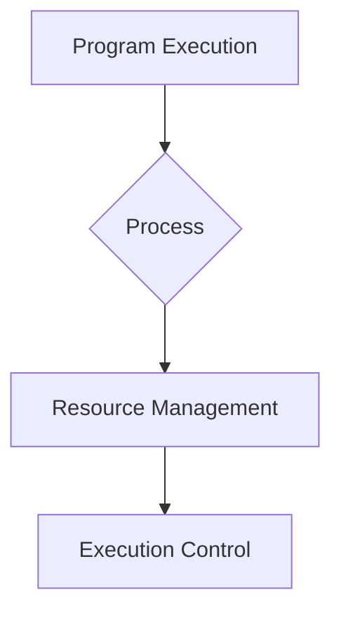
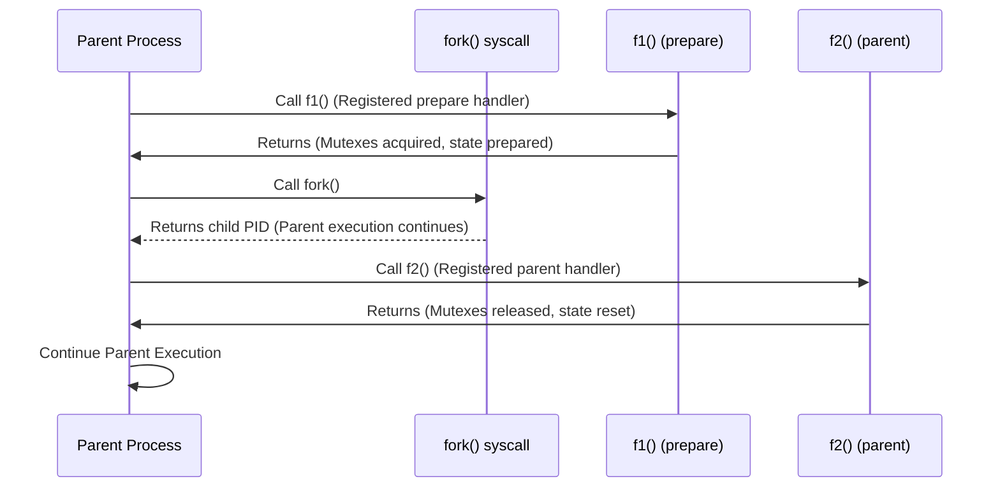
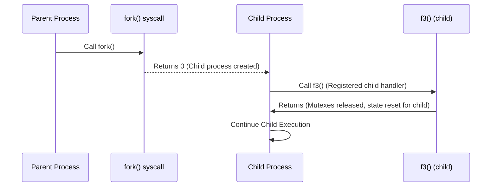
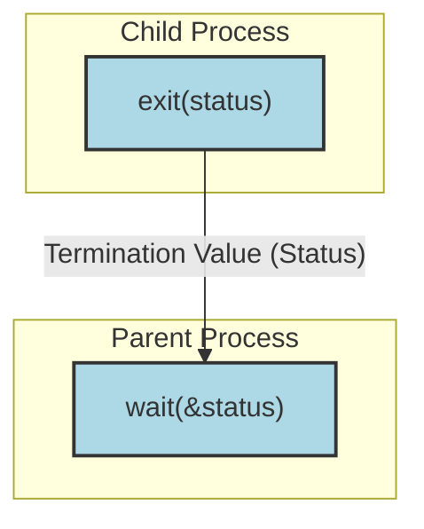

# Processes: Managing Execution

<p align="center">



</p>

A **process** represents the fundamental unit of execution for applications within an operating system. It is responsible for handling resource management and providing execution control.

---

## Understanding Processes

Each **process** is uniquely identified by a **PID** (Process ID). It operates within its own dedicated and isolated **address space**, which is designed to prevent interference with other processes.

---

## Processes and Isolation

While processes offer isolation, this is inherently **partial**. Processes can still interact or interfere via shared system components such as the File System, Authentication/Authorization/Accounting (AAA) services, the Network Subsystem, and various Peripherals or other Centralized Resources. To enable controlled communication and data sharing between processes, **Inter-Process Communication (IPC)** mechanisms are employed to intentionally **reduce isolation** in a structured manner.

---

## Concurrency and Processes

Within a single process, **threads** facilitate concurrency by sharing the same address space. However, utilizing **processes** for concurrency becomes necessary or desirable in specific scenarios: when reusing existing programs (which are often designed as separate processes), for scaling applications across multiple computers, or to enhance security through stronger isolation between components.

---

## Concurrency and Processes (Continued)

A complex system can often be structured as a collection of interconnected processes. These processes can be created by a parent process and are capable of cooperating regardless of their direct parent-child creation lineage. Every process always has at least one **primary thread**. Ultimately, multi-process systems are inherently concurrent, necessitating careful management of potential interference and coordination among them.

---

## Processes in Windows

In Windows, processes are treated as distinct, isolated entities. The `CreateProcess(...)` function is used to create a new process by following a sequence of steps:

1.  An empty **address space** is created.
2.  This address space is initialized with the **executable image** of the program.
3.  A **primary thread** is created (its execution typically begins at `_crtstartup`, which then calls `main()` or `WinMain()`).
4.  The primary thread is launched.
5.  Upon completion of `main()` or `WinMain()`, the C runtime implicitly calls `exit()` to perform necessary cleanup before the process terminates.

Windows processes generally start "**clean**," offering limited implicit resource sharing. Explicit resource sharing, such as inheriting certain handles (for files, semaphores, or pipes) and environment variables, is possible but must be configured.

---

## Creating Processes in Windows (Part 1)

This C code snippet demonstrates the initial setup for creating a child process in Windows. It includes necessary header files, declares `STARTUPINFO` and `PROCESS_INFORMATION` structures, and initializes them to zero. A basic command-line argument check is also included.

```c
#include <windows.h>
#include <stdio.h>
#include <tchar.h>

void _tmain(int argc, TCHAR *argv[])
{
    STARTUPINFO si;         // Structure to specify new process's window properties
    PROCESS_INFORMATION pi; // Structure to receive info about new process

    // Initialize structures to zero
    ZeroMemory(&si, sizeof(si));
    si.cb = sizeof(si); // Must set cb to size of structure
    ZeroMemory(&pi, sizeof(pi));

    // Basic command-line argument validation
    if (argc != 2) {
        printf("Usage: %s [cmdline]\n", argv[0]);
        return;
    }
    // ...continua nella Parte 2...
}
```

---

## Creating Processes in Windows (Part 2)

Following the initialization, this section of the C code calls `CreateProcess` to launch the child process, using the command line provided as `argv[1]`. It also includes error handling for the `CreateProcess` function call.

```c
// Assume preceding code is within a function scope (e.g., _tmain from Part 1)

    // Start the child process specified by argv[1]
    if (!CreateProcess(
        NULL,        // No module name (use command line)
        argv[1],     // Command line (e.g., "notepad.exe")
        NULL,        // Process handle not inheritable
        NULL,        // Thread handle not inheritable
        FALSE,       // Set handle inheritance to FALSE
        0,           // No creation flags
        NULL,        // Use parent's environment block
        NULL,        // Use parent's starting directory
        &si,         // Pointer to STARTUPINFO structure
        &pi          // Pointer to PROCESS_INFORMATION structure
    )) {
        printf("CreateProcess failed (%d).\n", GetLastError());
        return;
    }
    //...continua nella Parte 3...
```

---

## Creating Processes in Windows (Part 3)

This final part of the Windows process creation example demonstrates waiting for the newly launched child process to complete its execution. After the child process exits, its associated handles are closed to release system resources.

```c
// Assume preceding code (Part 1 & 2) is within a function scope

    // Wait until the child process exits.
    WaitForSingleObject(pi.hProcess, INFINITE); // Waits indefinitely for the child process handle to be signaled (process exits)

    // Close process and thread handles to free up system resources.
    CloseHandle(pi.hProcess);
    CloseHandle(pi.hThread);
```

---

## Processes in Linux

In Linux, the `fork()` system call is the primary mechanism for creating a child process. It creates a new address space that is initially an "identical" copy of the parent's, optimized with a **Copy-On-Write (CoW)** mechanism. The child process begins execution with a single thread (the one that called `fork()`) and inherits a snapshot of the parent's complete state. Consequently, unlike Windows processes, a Linux child process created by `fork()` does **not** start clean; it's a duplicate of its parent. The `fork()` call returns the child's **PID** in the parent process, `0` in the newly created child process, and `-1` if an error occurs.

---

## The `fork()` Call

The `fork()` system call possesses a unique characteristic: it is called once but **returns twice**. In the parent process, it returns the child's PID. Conversely, in the newly created child process, it returns `0`. This distinct behavior establishes a strong **parent-child relationship** between the two processes.

---

## Process Creation: `exec*()` Functions

In contrast to `fork()`, the `exec*()` family of functions (e.g., `execl`, `execv`) serves to **replace** the current process's entire memory image (its code, data, heap, and stack segments) with that of a **new executable program**. Essentially, an `exec*()` call transforms the current process into a new one, running a different program, without changing its **Process ID (PID)**. The various `exec*()` variants primarily differ in how they handle arguments and environment variables.

---

## `fork()` and `exec()` Example

This C code demonstrates a common Linux pattern: `fork()` is used to create a child process, and then `execl()` is called within the child to replace its process image with a new executable (`./ch.exe`). A `switch` statement is used to differentiate between the parent and child execution paths, and error handling for both `fork()` and `execl()` is included.

```c
#include <stdio.h>
#include <unistd.h>     // For fork(), execl()
#include <sys/wait.h>   // For wait() (optional, for parent to wait for child)

int main(const int argc, const char* const argv[]) {
    pid_t childPid = fork(); // Create a new process
    switch (childPid) {
        case -1: // Error case: fork failed
            puts("parent: error: fork failed!");
            break;
        case 0: // Child process: fork() returns 0 here
            puts("child: here (before execl)!");
            // Replace child's image with ./ch.exe. If execl succeeds, code after it is not run.
            if (execl("./ch.exe", "./ch.exe", (char *)0) == -1) {
                // execl returns -1 only if it fails
                perror("child: execl failed:"); // Print error message
            }
            // This line is only reached if execl failed to load the new program
            puts("child: here (after execl)!");
            break;
        default: // Parent process: fork() returns child's PID here
            printf("par: child pid=%d \n", childPid);
            // Parent could optionally wait for child here: wait(NULL);
            break;
    }
    return 0; // Both parent and (if execl failed) child will reach here and exit
}
```

---

## `fork()` and Threads

A significant problem arises when `fork()` is used in a multi-threaded parent process: `fork()` traditionally **duplicates only the calling thread** into the child. Other threads from the parent's process are not duplicated. This can lead to **deadlocks** in the child if **mutexes** or other synchronization objects held by a non-calling thread in the parent are inherited in a locked state. To mitigate these issues, `pthread_atfork()` (part of POSIX pthreads) allows registering specific handler functions: `prepare()` (called in parent *before* `fork()`, typically to acquire mutexes), `parent()` (called in parent *after* `fork()`, to release mutexes), and `child()` (called in child *after* `fork()`, to release inherited mutexes and reset its single-threaded state).

---

## `pthread_atfork()` Example

This C code snippet illustrates how `pthread_atfork()` is used to register placeholder functions (`f1`, `f2`, `f3`). These functions would perform the necessary prepare, parent-specific, and child-specific actions around a `fork()` call, thereby ensuring thread-safe behavior in a multi-threaded context.

```c
#include <stdio.h>
#include <unistd.h>
#include <pthread.h> // For pthread_atfork()

// Placeholder functions for prepare, parent, and child actions
void f1() { printf("f1: prepare (in parent, before fork)\n"); }
void f2() { printf("f2: parent (in parent, after fork)\n"); }
void f3() { printf("f3: child (in child, after fork)\n"); }

int main() {
    // Register the fork handlers
    // f1 runs before fork in parent
    // f2 runs after fork in parent
    // f3 runs after fork in child
    pthread_atfork(f1, f2, f3);

    printf("main: Calling fork...\n");
    int res = fork(); // Perform the fork

    if (res == -1) {
        printf("main: fork error!\n");
    } else if (res == 0) {
        printf("main: In child process.\n");
    } else {
        printf("main: In parent process, child PID: %d.\n", res);
    }

    printf("main: Exiting.\n");
    return 0;
}
```

---

## Parent Process Flow (`pthread_atfork`)

<p align="center">



</p>

This sequence diagram illustrates the execution flow within the parent process when `pthread_atfork()` handlers are registered and `fork()` is called. The `prepare` function (`f1()`) is executed before `fork()`, and the `parent` function (`f2()`) is executed after `fork()` returns to the parent.

---

## Child Process Flow (`pthread_atfork`)

<p align="center">



</p>

This sequence diagram illustrates the execution flow within the child process after `fork()` is called and `pthread_atfork()` handlers are registered. The child process receives `0` from `fork()`, and then the `child` function (`f3()`) is executed before the child continues its own execution.

---

## Terminating a Process

Process execution concludes either **voluntarily** (when the process calls a termination function itself) or **externally** (when it is killed by the operating system or another process). Upon termination, all resources allocated to the process—including memory, open file handles, acquired locks, IPC objects, and network sockets—are **deallocated** by the operating system and returned to the system's pool of available resources.

---

## Terminating a Process (Specifics)

Any thread within a multi-threaded process can initiate the process's termination. The functions used for **immediate termination** differ by OS: Windows uses `ExitProcess(int status)`, while Linux uses `_exit(int status)`. Both functions cause the **immediate termination** of all other threads within the process, with no further execution in those threads. The operating system then performs necessary resource cleanup. The `status` argument is typically an 8-bit integer, conventionally `0` signifies successful completion.

---

## Terminating a Process (Standard Library Functions)

While `_exit(int status)` (Linux) provides immediate termination, it does so without executing C runtime (CRT) cleanup routines (e.g., C++ object destructors for global/static objects), which can lead to resource leaks. Standard C and C++ libraries offer portable alternatives that provide more controlled termination: `exit(int status)` (C) and `std::exit(int status)` (C++). These functions perform proper **CRT cleanup** (including calling destructors for global and static objects) and allow registering callback functions using `std::atexit(void (*callback)())`. These registered callbacks are executed (in reverse order of registration) before the program finally exits.

---

## Managing Termination (Example)

This C++ code snippet demonstrates the use of `std::atexit` to register custom handler functions (`atexit_handler_1`, `atexit_handler_2`). These functions will be automatically called when the program terminates, whether `main` returns or `std::exit` is explicitly called, providing controlled cleanup.

```cpp
#include <iostream> // For std::cout, std::cerr
#include <cstdlib>  // For std::atexit, EXIT_SUCCESS, EXIT_FAILURE

// Handler function 1, will be called on program exit
void atexit_handler_1() {
    std::cout << "at exit #1\n";
}

// Handler function 2, will be called on program exit
void atexit_handler_2() {
    std::cout << "at exit #2\n";
}

int main() {
    // Register atexit_handler_1. Returns 0 on success, non-zero on failure.
    const int result_1 = std::atexit(atexit_handler_1);
    // Register atexit_handler_2. Handlers are called in reverse order of registration.
    const int result_2 = std::atexit(ateexit_handler_2);

    if ((result_1 != 0) || (result_2 != 0)) {
        std::cerr << "Registration failed\n";
        return EXIT_FAILURE; // Indicate failure to OS
    }

    std::cout << "returning from main\n";
    // When main returns, the C/C++ runtime implicitly calls std::exit() with main's return value.
    return EXIT_SUCCESS; // Indicate success to OS
}
```

---

## Managing Termination (Program Flow)

A program can also terminate if its `main` function simply returns; in such cases, the C/C++ runtime startup code implicitly calls `exit(status)` (or `std::exit(status)`) with the return value of `main`. Furthermore, if an unhandled exception occurs in any thread, the operating system or runtime will automatically call a termination function (e.g., `ExitProcess` in Windows or `_exit` in Linux) with an environment-defined status code to indicate abnormal termination.

---

## Return Codes

The integer **return code** (or **exit status**) from `exit()` or the `main` function is a value that the process passes back to its parent process or the operating system. While the value itself is arbitrary from the OS perspective, convention dictates: `0` signifies successful program execution, while **non-zero** values indicate some form of error or abnormal termination. The specific meaning of non-zero return codes is entirely application-specific and not defined by the operating system. Therefore, it is good practice to document your application's return codes and follow common conventions within your programming environment.

---

## Processes in Rust

Rust's standard library provides the `std::process` module for managing and interacting with processes. It offers a **cross-platform interface** that transparently utilizes underlying OS system calls (e.g., `fork`/`exec` on Unix, `CreateProcess` on Windows). The primary way to build and configure a new process is through the **`struct Command`**, which employs a **builder pattern**. You create a `Command` builder using `Command::new("cmd")`, then configure it with methods like `arg()`/`args()` (for arguments), `env()`/`env_remove()`/`env_clear()` (for environment variables), `current_dir()` (for working directory), and `stdin()`/`stdout()`/`stderr()` (for I/O redirection). After configuration, the `output()` method starts the process, waits for its termination, captures its standard output and standard error, and returns a `Result<Output>`. The `Output` struct contains the process's `status: ExitStatus`, its captured `stdout: Vec<u8>`, and `stderr: Vec<u8>`.

---

## Processes in Rust (ExitStatus)

The **`ExitStatus`** structure, part of `std::process`, provides a cross-platform way to inspect the exit code of a terminated process. On Unix-like systems, `ExitStatus` can also offer more detailed information about the reason for termination, such as whether the process exited normally, was terminated by a signal, was suspended, continued, or generated a core dump.

---

## Processes in Rust (Cross-Platform Example)

This Rust code demonstrates executing a simple "echo hello" command in a cross-platform manner using `Command::new()`. It adapts the executable (`cmd` on Windows, `sh -c` on Unix) and arguments based on the target operating system (`cfg!`). The code then captures and prints the `Output` struct, which includes the exit status and captured standard output/error.

```rust
use std::process::Command; // Import the Command struct for process management

fn main() {
    // Configure and execute the command based on the target OS
    let output = if cfg!(target_os = "windows") {
        // On Windows, use 'cmd /C' to execute the 'echo' command
        Command::new("cmd").args(["/C", "echo hello"]).output().expect("failed to execute process")
    } else {
        // On Unix-like systems, use 'sh -c' to execute the 'echo' command
        Command::new("sh").arg("-c").arg("echo hello").output().expect("failed to execute process")
    };

    // Print the entire Output struct, which includes status, stdout, and stderr
    println!("{:?}", output);
    // Expected output shows 'status: ExitStatus(ExitStatus(0))', 'stdout: "hello\n"', 'stderr: ""'
}
```

---

## Processes in Rust (Environment Variables and I/O)

By default, child processes inherit environment variables from their parent. The `Command` builder provides methods to precisely control this inheritance and redirection of standard I/O streams:

*   `env("KEY", "VALUE")`/`envs([("KEY", "VALUE"), ...])`: Add or modify specific environment variables for the child process.
*   `env_remove("KEY")`: Remove a specific environment variable from the child's environment.
*   `env_clear()`: Clear *all* inherited environment variables, starting the child with a completely clean environment; only explicitly added variables will be present.
*   `get_envs()`: Inspects the environment variables that have been set on the `Command` builder.

Standard I/O streams (`stdin`, `stdout`, `stderr`) can be redirected using `Command` methods that accept `Stdio` enum variants:

*   `inherit()`: The child process uses the parent's standard file descriptors (this is the default for `spawn` and `status`).
*   `piped()`: Creates an anonymous pipe, allowing the parent process to read from the child's stdout/stderr or write to its stdin (this is the default for `output`).
*   `null()`: Discards the child process's I/O for that stream (redirects to `/dev/null` or equivalent).

---

## Processes in Rust (Environment & Stdio Example)

This Rust code demonstrates setting a specific environment variable (`PATH`) for a child process executing the `ls` command and explicitly redirecting its standard output to `inherit()` the parent's console, ensuring it prints directly there.

```rust
use std::process::{Stdio, Command}; // Import Stdio for I/O redirection

fn main() {
    // Execute 'ls' command
    let _output = Command::new("ls")
        // Set the PATH environment variable for the child process to /bin
        .env("PATH", "/bin")
        // Redirect stdout to inherit from the parent process (print to console)
        .stdout(Stdio::inherit())
        .output() // Execute and wait for output
        .expect("ls command failed to start");
    // The output of 'ls' will be printed directly to the console because of Stdio::inherit()
    // The 'output' variable will contain an empty stdout Vec<u8> because it was inherited.
}
```

---

## Processes in Rust (Environment Manipulation Example)

This example shows how to launch a shell command (`sh -c "echo ... && printenv ..."`) in Rust, demonstrating the ability to add (`env()`) and remove (`env_remove()`) environment variables for the child process. The child process then prints these variables, illustrating the effect of the environment manipulation.

```rust
use std::process::Command; // For Command struct
use std::env;              // For env::vars() to inspect parent env

fn main() {
    let mut command = Command::new("sh"); // Create a Command for the shell
    // Pass a command string to the shell that echoes text and then prints specific env vars
    command.arg("-c").arg("echo 'Hello from child process!' && printenv MY_CUSTOM_VAR OTHER_VAR");

    let output = command
        // Add a custom environment variable for the child
        .env("MY_CUSTOM_VAR", "My custom personalized value")
        // Add another custom variable
        .env("OTHER_VAR", "Another value")
        // Remove the PATH environment variable for the child
        .env_remove("PATH")
        .output() // Execute the command and wait for its output
        .expect("Failed to execute command");

    // Print the captured standard output from the child process
    println!("Standard Output:\n{}", String::from_utf8_lossy(&output.stdout));
    println!("Exit Status: {}", output.status);
}
```

---

## Processes in Rust (Clean Environment Example)

This Rust code demonstrates creating a child process with a completely clean environment using `env_clear()`, ensuring no inherited environment variables are passed by default. It then explicitly adds only a specified variable (`CUSTOM_ONLY_VAR`) to the child's environment. The program also prints the parent's environment variables for comparison.

```rust
use std::process::Command; // For Command struct
use std::env;              // For env::vars() to inspect parent env

fn main() {
    let mut command_clean = Command::new("sh"); // Create a Command for the shell
    // Pass a command string to the shell to echo text and then print a specific env var
    command_clean.arg("-c").arg("echo 'Clean environment test' && printenv CUSTOM_ONLY_VAR");

    let output_clean = command_clean
        .env_clear() // Clear all inherited environment variables
        .env("CUSTOM_ONLY_VAR", "This variable only") // Add only this specific variable
        .output() // Execute the command and wait for its output
        .expect("Failed to execute clean command");

    // Print the captured standard output from the child process in the clean environment
    println!("Standard Output (clean environment):\n{}", String::from_utf8_lossy(&output_clean.stdout));

    // Print the parent process's environment variables for comparison
    println!("\n--- Parent process environment variables ---");
    for (key, value) in env::vars() {
        println!("{}: {}", key, value);
    }
}
```

---

## Processes in Rust (Standard I/O Redirection Examples)

This Rust code demonstrates various ways to redirect a child process's standard output using `Stdio` configurations: `Stdio::null()` to discard output, `Stdio::inherit()` to print output directly to the parent's console, and `Stdio::piped()` to capture the output programmatically into the `Output` struct.

```rust
use std::process::{Stdio, Command}; // Import Stdio for I/O redirection

fn main() {
    // Example 1: Redirect stdout to null (discard output)
    let mut output = Command::new("echo")
        .arg("Hello, world! (null)")
        .stdout(Stdio::null()) // Discard the output
        .output() // Execute and wait
        .expect("Failed to execute command with null stdout");
    println!("Output struct for null stdout: {:?}", output); // output.stdout will be empty

    // Example 2: Redirect stdout to inherit from parent (print to console)
    output = Command::new("echo")
        .arg("Hello, world! (inherit)")
        .stdout(Stdio::inherit()) // Output directly to the console
        .output() // Execute and wait
        .expect("Failed to execute command with inherit stdout");
    println!("Output struct for inherit stdout: {:?}", output); // output.stdout will be empty as it was inherited

    // Example 3: Redirect stdout to a pipe (capture output)
    output = Command::new("echo")
        .arg("Hello, world! (piped)")
        .stdout(Stdio::piped()) // Capture the output into output.stdout
        .output() // Execute and wait
        .expect("Failed to execute command with piped stdout");
    println!("Output struct for piped stdout: {:?}", output); // output.stdout will contain "Hello, world! (piped)\n"
}
```

---

## Processes in Rust (Changing Current Directory)

The `current_dir()` method on the `Command` builder allows you to specify the working directory for the child process. This is the directory from which the child process will resolve relative paths and where it will execute its operations.

```rust
use std::process::{Stdio, Command}; // Import Stdio for I/O redirection

fn main() {
    // Execute 'ls' command
    let _output = Command::new("ls")
        // Set the current working directory for the 'ls' command to "/bin"
        .current_dir("/bin")
        // Redirect stdout to inherit from the parent process (print to console)
        .stdout(Stdio::inherit())
        .output() // Execute and wait for output
        .expect("ls command failed to start");
    // The 'ls' command will list the contents of the /bin directory
}
```

---

## The `status()` Method

The `status()` method on a `Command` builder starts the process and **waits for its termination**. It returns a `Result<ExitStatus>`, which provides information solely about the process's exit status. Unlike `output()`, it does not capture standard output or standard error by default; these streams are inherited from the parent process unless explicitly redirected. The `ExitStatus` structure includes the exit code and, on Unix-like systems, details such as the signal that terminated the process or whether a core dump was generated.

---

## `status()` Example

This Rust code demonstrates using the `status()` method to execute the `ls` command and then checks the `ExitStatus` returned. It explicitly uses `child_status.success()` to determine if the process exited successfully and prints the status value or error code.

```rust
use std::process::Command; // For Command struct

fn main() {
    // Execute the 'ls' command and wait for its status
    let child_status = Command::new("ls")
        .status() // Execute and wait for only the exit status
        .expect("failed to execute process");

    // Check if the process exited successfully
    if child_status.success() {
        println!("Process exited successfully with status: {}", child_status);
    } else {
        // If it failed, print the failure status and its optional exit code
        println!("Process exited with failure status: {}", child_status);
        if let Some(code) = child_status.code() {
            println!("  Exit code: {}", code);
        } else {
            // On Unix, could be terminated by a signal
            println!("  Process terminated by signal, no exit code.");
        }
    }
}
```

---

## The `spawn()` Method

The `spawn()` method on a `Command` builder starts the process **without waiting for its termination**. It returns a `Result<Child>`, where the `Child` struct represents the running child process. This `Child` object provides methods to interact with the process later, such as waiting for its termination, accessing its standard I/O streams (if piped), or explicitly killing it.

---

## Three Modes of Process Management

<p align="center">

| Mode       | Behavior                                                                      | Return Type        | Default `stdin` & `stdout` Redirection |
| :--------- | :---------------------------------------------------------------------------- | :----------------- | :--------------------------------------- |
| `output()` | Starts process, **waits for termination**, and captures all standard output/error. | `Result<Output>`   | `piped()` (for all streams)                  |
| `status()` | Starts process, **waits for termination**, and returns only the exit status.    | `Result<ExitStatus>`| `inherit()` (from parent)                |
| `spawn()`  | Starts process **without waiting for termination**, returning a handle to the child. | `Result<Child>`    | `inherit()` (from parent)                |

</p>

Rust's `std::process::Command` offers three primary modes for executing and managing child processes, each with distinct behaviors and default I/O redirection:

---

## Processes in Rust (Child Structure Methods)

The `Child` struct, returned by the `spawn()` method, provides various methods for interacting with a running child process:

*   `stdin()`/`stdout()`/`stderr()`: These methods return mutable references to the child's standard I/O streams (`Stdin`, `Stdout`, `Stderr`) if they were configured as `Stdio::piped()` during `Command` creation. This allows the parent process to write to the child's input or read from its output.
*   `id()`: Returns the Process ID (PID) of the child process.
*   `wait()`: Blocks the current thread until the child process terminates, returning its `ExitStatus`.
*   `wait_with_output()`: Blocks the current thread until the child process terminates, captures its standard output and standard error (assuming they were `piped()`), and returns an `Output` struct.
*   `kill()`: Attempts to force-terminate the child process (sends a signal on Unix, terminates on Windows).

---

## Processes in Rust (`spawn` and `wait` Example)

This Rust code demonstrates launching a process (`ppp`, presumably a simple program) using `spawn()`, which returns a `Child` handle. The parent then explicitly calls `child.wait()` to block until the child process terminates. It includes error handling for both the `spawn` and `wait` operations, and checks the child's exit status.

```rust
use std::process::Command; // For Command struct

fn main() {
    println!("Parent: Attempting to launch child process 'ppp'.");
    // Try to spawn the 'ppp' command with an argument "Hello World"
    match Command::new("ppp").arg("Hello World").spawn() {
        Ok(mut child) => { // If spawn is successful, 'child' is a mutable Child handle
            println!("Parent: Child launched successfully, PID: {}.", child.id());
            println!("Parent: Waiting for child to terminate...");
            // Wait for the child process to terminate
            match child.wait() {
                Ok(status) => { // If wait is successful, 'status' is an ExitStatus
                    if status.success() {
                        println!("Parent: Child terminated successfully.");
                    } else {
                        println!("Parent: Child terminated with error status: {:?}", status.code());
                    }
                }
                Err(e) => println!("Parent: Error while waiting for child: {}", e)
            }
        }
        Err(e) => { // If spawn failed (e.g., 'ppp' not found)
            eprintln!("Parent: Failed to launch child: {}", e);
        }
    }
    println!("Parent: Exiting.");
}
```

---

## Processes in Rust (`wait_with_output` Example)

This example shows how to use `spawn()` to start a child process (`ls`), configuring its standard output to be piped. Subsequently, `child_process.wait_with_output()` is called on the `Child` handle to block until termination and simultaneously capture the child's standard output and standard error into the `Output` struct.

```rust
use std::process::{Command, Stdio}; // Import Stdio for I/O redirection
use std::os::unix::process::ExitStatusExt; // Required for .signal() (Unix-specific)

fn main() {
    println!("Parent: Launching 'ls -1 -a' and capturing output.");
    // Spawn the 'ls -1 -a' command, configuring its stdout to be piped
    let child_process = Command::new("ls")
        .arg("-1") // List one entry per line
        .arg("-a") // Include hidden files
        .stdout(Stdio::piped()) // Pipe stdout to parent
        .spawn() // Spawn the process without waiting
        .expect("Failed to launch 'ls'"); // Handle potential launch error

    // Wait for the child process to terminate AND capture its piped output
    let output = child_process.wait_with_output()
        .expect("Failed to get process output"); // Handle potential error while waiting/capturing

    if output.status.success() {
        // If the process exited successfully, print its captured stdout
        let stdout = String::from_utf8_lossy(&output.stdout);
        println!("Output (stdout):\n{}", stdout);
    } else {
        // If the process exited with an error, print its captured stderr
        let stderr = String::from_utf8_lossy(&output.stderr);
        eprintln!("Error (stderr):\n{}", stderr);
        // Also print exit code if available (Unix specific or standard code())
        if let Some(code) = output.status.code() {
            eprintln!("  Exit code: {}", code);
        } else if let Some(signal) = output.status.signal() {
            eprintln!("Terminated by signal: {}", signal);
        }
    }
}
```

---

## Processes in Rust (`kill` Example)

This Rust code demonstrates how to explicitly terminate a child process using the `kill()` method. It spawns a `sleep` command, retrieves its PID, then uses `child.kill()` to send a termination signal to the child. Finally, it `wait()`s for the child to confirm its termination and checks if it was killed by a signal.

```rust
use std::process::{Command, Stdio}; // Import Stdio for I/O redirection
use std::os::unix::process::ExitStatusExt; // Required for .signal() on Unix

fn main() {
    println!("Parent: Spawning a 'sleep 10' process.");
    // Spawn a 'sleep 10' process, piping its stdout (though it won't produce much)
    let mut child = Command::new("sleep").arg("10").stdout(Stdio::piped()).spawn().unwrap();

    let pid = child.id(); // Get the PID of the spawned child process
    println!("Parent: Spawned PID: {}", pid);

    println!("Parent: Attempting to kill process {}.", pid);
    // Attempt to kill the child process
    match child.kill() {
        Ok(_) => println!("Parent: Process {} killed successfully.", pid),
        Err(err) => eprintln!("Parent: Error killing process {}: {}", pid, err),
    }

    println!("Parent: Waiting for child to confirm termination.");
    // Wait for the child process to actually terminate
    match child.wait() {
        Ok(status) => {
            println!("Parent: Child exited with status: {}", status);
            // On Unix, check if it was terminated by a signal
            if let Some(signal) = status.signal() {
                println!("Parent: Process was terminated by signal: {}", signal);
            }
        }
        Err(err) => eprintln!("Parent: Error waiting for child: {}", err),
    }
}
```

---

## Redirecting Input/Output Streams (Piped Example)

This Rust code demonstrates inter-process communication by redirecting a child process's standard input and output to pipes. The parent process writes data to the child's standard input pipe and then reads the processed output from the child's standard output pipe. This example uses the `rev` (reverse text) command.

```rust
use std::io::prelude::*; // Import traits for read_to_string and write_all
use std::process::{Command, Stdio}; // Import Stdio for I/O redirection

fn main() {
    println!("Parent: Launching 'rev' command with piped I/O.");
    // Spawn the 'rev' command, configuring its stdin and stdout to be piped
    let mut process = Command::new("rev")
        .stdin(Stdio::piped())  // Parent can write to child's stdin
        .stdout(Stdio::piped()) // Parent can read from child's stdout
        .spawn()
        .expect("Failed to spawn 'rev' command");

    // Get the child's stdin pipe and write data to it
    // unwrap() is used here for simplicity, in real code handle Result
    process.stdin.unwrap().write_all(b"'isoc ovitrevid im non ehc innaaaa onarE")
        .expect("Failed to write to child's stdin");

    // Drop the stdin handle to signal EOF to the child, allowing it to process the input
    // This is important because rev will wait for more input otherwise
    drop(process.stdin);

    // Get the child's stdout pipe and read all output into a string
    let mut child_output = String::new();
    process.stdout.unwrap().read_to_string(&mut child_output)
        .expect("Failed to read from child's stdout");

    // Print the captured output, which should be the reversed string
    print!("Output from 'rev':\n{}", child_output);
    // Expected output: "Era non aaaanni hce non mi diverti cosa"
}
```

---

## `sysinfo` Crate

The `sysinfo` crate is a **third-party** Rust library that provides a convenient, cross-platform API for retrieving system and process information. You add it as a dependency in your `Cargo.toml` file (e.g., `sysinfo = "0.29"`). It allows you to query total memory, system name, and iterate over running processes to get details like PID, name, and disk usage.

```rust
use sysinfo::{Pid, System, SystemExt, ProcessExt}; // Import necessary traits and structs from sysinfo

fn main() {
    // Create a new System instance. It will hold system information.
    let mut sys = System::new_all();
    // Refresh all information (processes, memory, CPU, etc.)
    sys.refresh_all();

    println!("Total system memory: {} bytes", sys.total_memory());
    println!("System name: {:?}", sys.name()); // Get the OS name

    // Iterate over all running processes and print their PID, name, and disk usage
    println!("\n--- Running Processes ---");
    for (pid, process) in sys.processes() {
        println!("[{}] {} (Disk usage: {} bytes)", pid, process.name(), process.disk_usage().total_written_bytes());
    }
}
```

---

## Interactions between `fork()`, `stdio`, and `exit()`

In Linux, when `fork()` is called, the child process inherits copies of the parent's **file descriptors**, including those for standard I/O (stdin, stdout, stderr). Critically, this means that the **standard I/O buffers** (e.g., for `stdout`) are also duplicated. If the parent has pending buffered output (data written but not yet flushed to the terminal or file), both the parent and the child might attempt to flush this same buffered data, leading to duplicate or interleaved output. To prevent such duplicate output, it is good practice to explicitly `fflush(NULL)` (C) or `std::cout << std::flush` (C++) before calling `fork()` to ensure all pending buffered output is written to the destination.

---

## Terminating a Process (Rust Specific Functions)

Rust provides distinct functions for process termination:

*   `std::process::exit(code: i32)`: This function terminates the current process immediately. Similar to C's `_exit()`, it does **not** run destructors for global/static objects or execute `atexit` handlers. Only the lower 8 bits of the `code` are typically used by the operating system for the exit status. Potential resource leaks can occur if explicit cleanup isn't handled.
*   `std::process::abort()`: This function causes an immediate, abnormal termination of the process, typically by sending a `SIGABRT` signal (on Unix-like systems). It also does **not** run destructors or `atexit` handlers. It's intended for critical, unrecoverable errors.
*   `panic!(...)`: When a `panic!()` occurs, Rust primarily unwinds the current thread's stack, executing destructors for local variables on that stack. If the `panic!()` occurs in the main thread (or if another thread panics and the main thread attempts to join it without `catch_unwind`), the entire process is typically terminated. On Unix, this often results in an exit code of `101`.

---

## Managing Other Processes

Once a child process is spawned using `spawn()`, its management (e.g., waiting for its completion or forcefully terminating it) is handled via the `Child` struct methods (`wait()`, `wait_with_output()`, `kill()`). For managing external processes that were not spawned by the current program, or for more advanced waiting scenarios, operating system-specific system calls are used. These provide mechanisms for non-CPU consuming waits. On Windows, these include `WaitForSingleObject`, `WaitForMultipleObjects`, and `GetExitCodeProcess`. On Linux, common calls are `wait`, `waitpid`, and `waitid`.

---

## Managing Other Processes (`pid_t wait(int *status)`)

The `wait()` system call (Linux) is used by a parent process to wait for *any* of its child processes to terminate. It **blocks** the calling parent thread until a child process exits. It returns the PID of the terminated child. The `status` argument (an `int*`) receives information about the child's termination, including its exit code or the signal that terminated it. Calling `wait()` also allows the OS to **reap** the child process's resources and remove its entry from the process table, preventing it from becoming a **zombie**. If no children have terminated, `wait()` blocks. If there are no children processes at all, it returns `-1`.

---

## Managing Other Processes (`pid_t waitpid(...)`)

The `waitpid(pid, status, options)` system call (Linux) provides more granular control over waiting for child processes. The `pid` argument allows waiting for a **specific** child process by its PID (or special values like `-1` for any child). The `options` argument supports non-blocking checks (e.g., `WNOHANG` makes `waitpid` return 0 immediately if no child has terminated). The `status` argument (an `int*`) receives a 16-bit value encoding detailed termination information, including the exit code, signal number, and whether a core dump occurred.

---

## Value Returned to Parent Process

<p align="center">



</p>

This diagram conceptually illustrates how the termination status of a child process is conveyed back to its parent. When a child process calls `exit(status)`, this `status` value is then transferred to the parent process, which retrieves it via a `wait(&status)` call. The parent's `status` variable receives a consolidated value encoding various termination details (e.g., the exit code or information about the signal that terminated the child).

---

## Linux Process Termination Status

The 16-bit `status` value returned by `wait()` or `waitpid()` on Linux encodes different termination reasons. It can be unpacked using macros (e.g., `WIFEXITED`, `WEXITSTATUS`, `WIFSIGNALED`, `WTERMSIG`) to get specific information:

*   **Normal Termination (Exit):** If the process called `exit()` or returned from `main()`. The lower 8 bits of `status` contain the actual exit status (0-255); the most significant byte is 0.
*   **Signal Termination:** If the process was terminated by a signal (e.g., `SIGTERM`, `SIGKILL`). The lower 7 bits of `status` contain the signal number. The 8th bit (from LSB) indicates if a **Core Dump** was generated (1 if yes, 0 if no); the most significant byte is 0.
*   **Stopped by Signal:** If the process was stopped by a signal (e.g., `SIGSTOP`). The lower 7 bits of `status` contain the signal number; the most significant byte is 127 (`01111111`).
*   **Continued by Signal:** If a stopped process was continued by a signal (e.g., `SIGCONT`). The lower 8 bits of `status` are 255 (`11111111`); the most significant byte is 0.

A **Core Dump** is a copy of the process's memory state and CPU registers at the time of a failure (like a `SIGSEGV` or `SIGABRT`). It is stored as a file and is extremely helpful for debugging crashes.

---

## `ExitStatus` Example (Checking for Errors and Signals)

This Rust code demonstrates how to execute a command (`ls /nonexistent`) that is expected to fail and then use the `ExitStatus` returned by `child.wait()` to thoroughly check the termination reason, including the exit code or the signal that caused termination.

```rust
use std::process::Command; // For Command struct
use std::os::unix::process::ExitStatusExt; // Required for .signal() on Unix

fn main() {
    println!("Parent: Attempting to run 'ls /nonexistent' (expected to fail).");
    let command_result = Command::new("ls").arg("/nonexistent").spawn(); // Spawn the command

    match command_result {
        Ok(mut child) => { // If spawn successful
            println!("Parent: Process spawned successfully. Waiting...");
            match child.wait() { // Wait for child to terminate
                Ok(exit_status) => { // If wait successful, get ExitStatus
                    println!("Parent: Child exited with status: {}", exit_status);
                    if exit_status.success() {
                        println!("Parent: Child terminated correctly.");
                    } else {
                        println!("Parent: Child terminated with error.");
                    }

                    // Check for exit code (if terminated normally)
                    if let Some(code) = exit_status.code() {
                        println!("Parent: Exit code: {}", code);
                    } else {
                        // If no exit code, check for termination by signal (Unix-specific)
                        if let Some(signal) = exit_status.signal() {
                            println!("Parent: Process terminated by signal: {}", signal);
                        }
                    }
                    // Check if a core dump was generated (Unix-specific)
                    if exit_status.core_dumped() {
                        println!("Parent: Process generated a core dump.");
                    }
                }
                Err(e) => { // Error during wait
                    eprintln!("Parent: Error waiting for child: {}", e);
                }
            }
        },
        Err(e) => { // Error launching process (e.g., command not found)
            eprintln!("Parent: Error launching process: {}", e);
        }
    }
}
```

---

## `signal.rs` and `timer.rs` (Sending Signals and Checking Status)

This example demonstrates how a parent process can send a signal to a child process to terminate it. The `timer` executable (assumed to be a simple loop with a sleep) is spawned, and then the parent uses the `kill` command (sending `SIGTERM`, signal 15) to terminate the child. Finally, the parent waits for the child and checks its `ExitStatus` to confirm termination by a signal and whether a core dump was created.

```rust
use std::process::{Command, Stdio}; // For Command, Stdio
use std::os::unix::process::ExitStatusExt; // For .signal() (Unix-specific)

fn main() {
    println!("Parent: Spawning 'timer' process.");
    // Spawn the 'timer' process, piping its stdout (so it doesn't print directly to console)
    // Assume 'timer' is in ./target/debug/
    let mut child_process = Command::new("timer")
        .env("PATH", "./target/debug/") // Ensure 'timer' is found in this PATH
        .stdout(Stdio::piped())
        .spawn()
        .unwrap(); // Unwrapping for simplicity; handle errors in real code

    let child_pid = child_process.id(); // Get the PID of the spawned child
    println!("Parent: Spawned 'timer' with PID: {}", child_pid);

    println!("Parent: Sending SIGTERM (signal 15) to process {}.", child_pid);
    // Execute the 'kill' command to send signal 15 (SIGTERM) to the child process
    Command::new("kill")
        .arg("-15") // The signal number (SIGTERM)
        .arg(child_pid.to_string()) // The PID of the child process
        .status() // Execute and wait for kill command's status
        .expect("Failed to execute kill command"); // Handle error if kill command fails

    println!("Parent: Waiting for 'timer' to terminate.");
    // Wait for the child process to actually terminate
    match child_process.wait() {
        Ok(exit_status) => {
            println!("Parent: 'timer' exited with status: {}", exit_status);
            // Check if the process was terminated by a signal
            if let Some(signal) = exit_status.signal() {
                println!("Parent: Process terminated by signal: {}", signal);
            }
            // Check if a core dump was generated
            if exit_status.core_dumped() {
                println!("Parent: Process generated a core dump.");
            }
        }
        Err(e) => {
            eprintln!("Parent: Error during process wait: {}", e);
        }
    }
}
```

---

## `wait_status.rs` (Checking Exit Status)

This Rust code demonstrates spawning a simple program (`exit0`, assumed to exit with status 0) and then waiting for its termination using `child.wait()`. It then inspects the `ExitStatus` to confirm successful termination, retrieve the explicit exit code, and check for signal termination or core dump generation, showing how `ExitStatusExt` methods are used.

```rust
use std::process::{Command, Stdio}; // For Command, Stdio
use std::os::unix::process::ExitStatusExt; // Required for .signal() and .core_dumped() on Unix

fn main() {
    println!("Parent: Spawning 'exit0' process (expected to exit with code 0).");
    // Spawn the 'exit0' process, piping its stdout (so it doesn't print directly)
    // Assume 'exit0' is in ./target/debug/
    let mut child_process = Command::new("exit0")
        .env("PATH", "./target/debug/") // Ensure 'exit0' is found
        .stdout(Stdio::piped())
        .spawn()
        .unwrap(); // Unwrapping for simplicity; handle errors in real code

    println!("Parent: Waiting for 'exit0' to terminate.");
    // Wait for the child process to terminate and get its exit status
    match child_process.wait() {
        Ok(exit_status) => {
            println!("Parent: 'exit0' exited with status: {}", exit_status); // Prints the display representation of ExitStatus

            // Check if the process exited successfully (exit code 0)
            if exit_status.success() {
                println!("Parent: Process terminated correctly.");
            }

            // Get the explicit exit code (if terminated normally)
            if let Some(code) = exit_status.code() {
                println!("Parent: Exit code: {}", code);
            }

            // Check if terminated by a signal (Unix-specific)
            if let Some(signal) = exit_status.signal() {
                println!("Parent: Terminated by signal: {}", signal);
            }

            // Check if a core dump was generated (Unix-specific)
            if exit_status.core_dumped() {
                println!("Parent: Generated a core dump.");
            }
        }
        Err(e) => {
            eprintln!("Parent: Error during process wait: {}", e);
        }
    }
}
```

---

## Testing Process Termination

To thoroughly test how your program handles child process termination, you should create child processes that exit in various ways: a normal success (`exit(0)`), a normal error (`exit(1)` or any other non-zero code), an abnormal termination (`abort()`), and an abnormal termination due to a program panic (`panic!()` in Rust).

---

## Process Termination: `exit(1)` and `exit(0)`

This Rust code demonstrates how a simple program can explicitly terminate itself with different exit codes using `std::process::exit()`. The parent process (from outside this snippet) would typically use `ExitStatus::code()` to retrieve and interpret these specific return values.

```rust
use std::process; // Import the process module for exit()

fn main() {
    println!("Example Rust program using process::exit()");
    let some_condition = true; // Simulating a condition for exiting

    if some_condition {
        println!("Exiting with error code 1.");
        process::exit(1); // Terminate the process with an error code of 1
    }

    // This line will only be reached if 'some_condition' is false
    println!("Exiting with success code 0.");
    process::exit(0); // Terminate the process with a success code of 0
}
```
When a parent process executes this code:
*   If `some_condition` is true, the parent's output would show `Exit code: 1` and indicate `terminated with error`.
*   If `some_condition` is false, the parent's output would show `Exit code: 0` and indicate `terminated correctly`.

---

## Process Termination: `abort()`

This Rust code snippet demonstrates the use of `std::process::abort()`, which causes an immediate and abnormal termination of the process without cleanup. When a parent process executes this code, it will typically detect that the child terminated due to a signal, specifically `SIGABRT` (signal 6 on Unix-like systems), and often observe that a **core dump** was generated.

```rust
use std::process; // Import the process module for abort()

fn main() {
    println!("Example Rust program using process::abort()");
    let some_condition = true; // Simulating a condition for aborting

    if some_condition {
        println!("Aborting the process!");
        process::abort(); // Cause immediate, abnormal termination
    }

    // This line will not be reached as abort() terminates immediately
    println!("This will not be printed.");
}
```
Parent Process Output when executing this program:
*   On Unix-like systems, you would see `Process terminated by signal: 6` (for SIGABRT) and often `The process generated a core dump`.

---

## Process Termination: `panic()`

This Rust code demonstrates the effect of a `panic!()` macro call in the main thread. A `panic!()` in Rust signals an unrecoverable error. By default, if a `panic!()` occurs in the main thread, it will cause the entire process to terminate. When a parent process executes this code, it will typically detect that the child exited with a conventional panic exit code (often `101` in Rust, though this can vary slightly or be `null` if a signal is caught before exit code is reported).

```rust
fn main() {
    println!("Example Rust program using panic!");
    let some_condition = true; // Simulating a condition for panicking

    if some_condition {
        println!("Triggering a panic!");
        panic!("Error: a panic occurred!"); // Cause the program to panic
    }

    // This line will not be reached if a panic occurs
    println!("This will not be printed.");
}
```
Parent Process Output when executing this program:
*   You would typically see `Exit code of the process: 101` and `terminated with error`, as `panic!` often results in this specific exit code.

---

## Orphan and Zombie Processes

Two specific states of child processes can arise from improper parent-child management:

*   **Orphan Process:** A child process becomes an orphan if its **parent process terminates before the child does**. In Linux (and other Unix-like systems), the orphaned child is then automatically **re-parented** by the special **`init`** process (which always has **PID 1**). The `init` process is responsible for performing the `wait*()` call on orphaned children to collect their exit status when they finally terminate, preventing them from becoming zombies.
*   **Zombie Process (Defunct Process):** A child process becomes a **zombie** if it **terminates before its parent process calls `wait*()`** (e.g., `wait()` or `waitpid()`) to collect its exit status. A zombie process has already finished executing and released most of its resources, but it retains its entry in the process table (including its PID and exit status) because the parent still needs to collect this information. Zombies do not consume CPU or much memory, but they do consume a PID and a process table entry. They are only fully removed from the system when the parent (or, if the parent terminates, `init`) finally performs the `wait*()` call.

---

## Orphan and Zombie Processes (Rust Example)

This Rust code demonstrates the conditions under which a zombie process might be created if `child.wait()` is not called promptly by the parent. It spawns a `sleep` child process and then the parent sleeps for a longer duration, allowing the child to terminate first. A `ps` command is run to observe process states, and finally, `child.wait()` is called to collect the status and prevent the zombie.

```rust
use std::process::Command; // For Command struct
use std::thread;            // For thread::sleep
use std::time::Duration;    // For Duration

fn main() {
    println!("Parent: Starting program to demonstrate process states.");

    // Spawn child process 1 that sleeps for 1 second
    let mut child1 = Command::new("sleep")
        .arg("1")
        .spawn()
        .expect("Failed to start child 1");
    println!("Parent: Child 1 (sleep 1) spawned with PID: {}.", child1.id());

    println!("Parent: Waiting for 2 seconds (longer than child 1's sleep)...");
    thread::sleep(Duration::from_secs(2)); // Parent sleeps longer than child1

    // At this point, child1 has likely terminated.
    // If child1.wait() is NOT called, child1 would become a zombie here.
    println!("Parent: Child 1 should have terminated. Checking process list.");
    // Run 'ps x' to list processes and potentially see the zombie (if wait() was omitted before this point)
    let _ps_output = Command::new("ps").arg("x")
        .spawn()
        .expect("Failed to start ps");

    // Explicitly call wait() on child1 to collect its status and prevent it from becoming a zombie
    // Or to reap it if it already became one.
    let status1 = child1.wait().expect("Failed to wait on child 1");
    println!("Parent: Child 1 (sleep) exited with status: {}", status1);

    // Add another child to demonstrate the state before wait()
    let mut child2 = Command::new("sleep")
        .arg("3")
        .spawn()
        .expect("Failed to start child 2");
    println!("Parent: Child 2 (sleep 3) spawned with PID: {}.", child2.id());
    println!("Parent: Checking process list again (Child 2 should be running).");
    let _ps_output_2 = Command::new("ps").arg("x")
        .spawn()
        .expect("Failed to start ps");
    thread::sleep(Duration::from_secs(4)); // Parent sleeps for child2 to finish
    let status2 = child2.wait().expect("Failed to wait on child 2");
    println!("Parent: Child 2 (sleep) exited with status: {}", status2);

    println!("Parent: Exiting.");
}
```