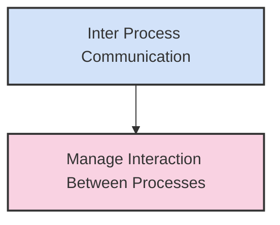
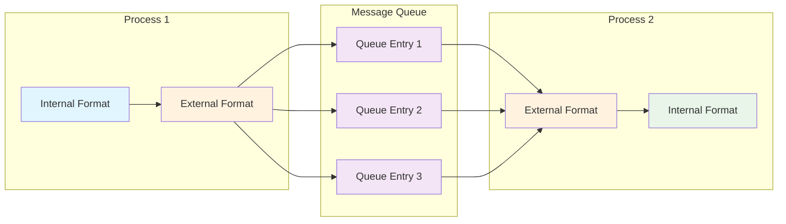
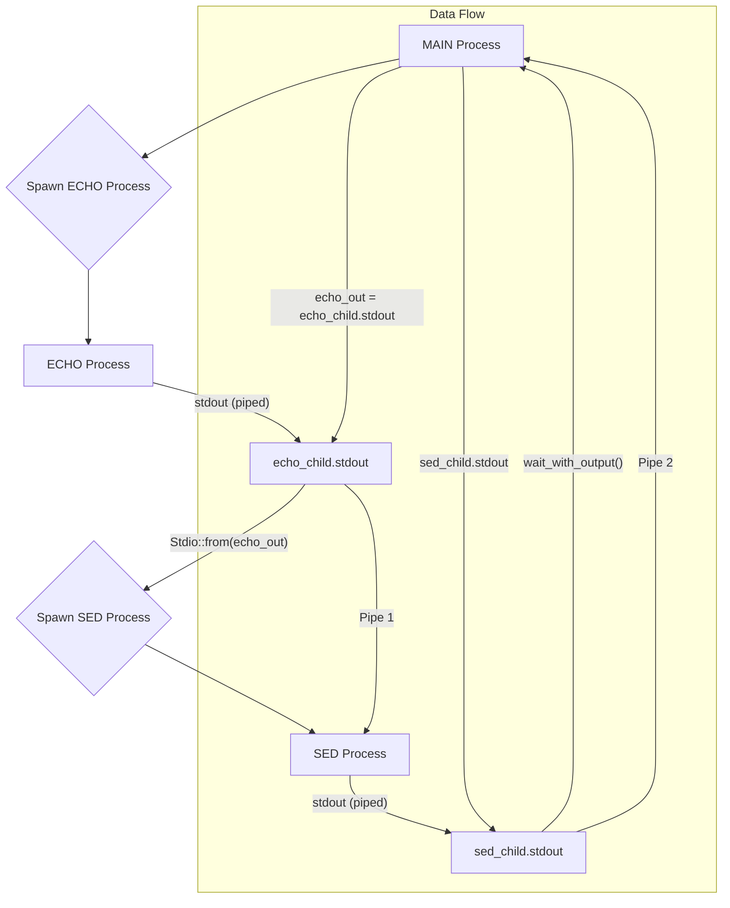
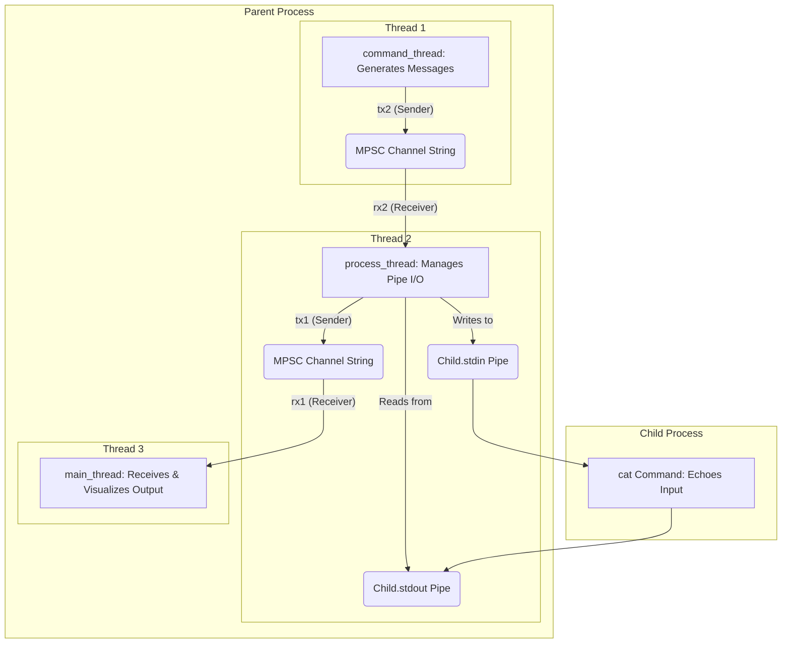
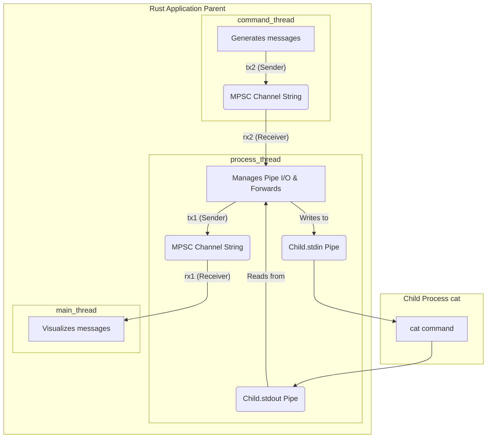

# Inter-Process Communication (IPC)

<p align="center">



</p>

---

## Process Interaction & IPC Mechanisms

Processes can interact simply by waiting for another's termination (e.g., collecting exit codes) or by exchanging data through standard I/O streams (`stdin`/`stdout`). However, more complex scenarios, particularly between unrelated processes, necessitate direct data exchange and fine-grained synchronization.

By default, operating systems (**OS**) enforce isolated address spaces, preventing direct data transfer between processes for security and stability. To enable controlled and safe communication, **OSs** provide various **Inter-Process Communication (IPC)** mechanisms. These mechanisms facilitate secure data sharing and coordination of activities between independent processes.

---

## Data Representation for IPC

Given their independence and isolated address spaces, processes must adapt information for exchange. Internal data representations (e.g., elementary types, structured types, pointers, system handles) are private to a process's memory space and unsuitable for direct export. Pointers, for instance, are meaningless in another process's address space, and system handles are typically non-exportable.

Therefore, internal data structures require explicit translation into a **transferable and interpretable external representation**. This involves replacing memory-specific references with memory-independent identifiers.

Common external data formats include:

*   **Text-Based Formats:** These are human-readable and generally easier to debug (e.g., **XML**, **JSON**, **CSV**).
*   **Binary Formats:** These are more compact and often faster to parse, but harder to inspect directly (e.g., **XDR**, **HDF**, **Protocol Buffers**).

**Protocol Buffers (Protobuf)**, developed by Google, is a prominent binary format widely used for efficient remote programming via **gRPC (Google Remote Procedure Calls)**. It uses defined data structures and service interfaces to automate data serialization.

Data exchange using **IPC** mechanisms typically involves two main steps:

1.  **Marshalling (Serialization):** The source process converts its internal data representation into the chosen external format.
2.  **Unmarshalling (Deserialization):** The destination process receives the data in the external format and reconstructs it into its own internal representation. This reconstruction may also transform the data structure to better suit the destination process's specific operations. These marshalling/unmarshalling operations can be manually coded or automatically generated by tools.

---

## Message Queues

A **message queue** is an **IPC** mechanism maintained by the operating system, allowing multiple source processes to send messages to a specific destination process.

*   **Asynchronous:** Messages are stored by the **OS** until they are read by the receiver; the sender does not need to wait for the receiver to process the message.
*   **Unidirectional:** Messages flow from the sender to the receiver. For bidirectional communication, two separate queues are typically needed.
*   **Named:** Message queues are identified by a unique, **OS-level** identifier, which is usually initialized by the destination (receiver) process.
*   **Block-Based:** Messages are transmitted and read as discrete blocks of data.
*   **Examples:** On Windows, **mail slots** (`CreateMailslot`) function as message queues. On Linux, **FIFOs** (named pipes, created with `mkfifo`) can be used as message queues.

---

## Message Queue Diagram

<p align="center">



</p>

**Flow Description:** Process 1 first converts its internal data to an external format. It then sends this external data to the message queue, where it is stored as discrete queue entries. Process 2 subsequently retrieves these external data entries from the queue and converts them back into its own internal format for processing.

---

## Named Pipes (Linux)

**Named pipes**, also known as **FIFOs (First-In, First-Out)**, are special file system objects in Linux used for **Inter-Process Communication**. They behave like pipes but have a name in the file system, making them accessible to unrelated processes.

*   **File System Presence:** Named pipes appear as regular files in the file system, identifiable by a path (e.g., `/tmp/my_pipe`).
*   **Non-Related Process Communication:** Unlike anonymous pipes, named pipes allow communication between processes that do not share a parent-child relationship.
*   **Persistence:** They remain in the file system until explicitly deleted.
*   **Buffer Capacity:** Named pipes typically have a kernel buffer of around 40 KB, allowing a significant amount of data to be queued.
*   **Unidirectional:** A single named pipe provides unidirectional communication. For bidirectional communication, two separate named pipes are required.
*   **Usage:** A named pipe is created using the `mkfifo` command or system call. Processes then open this file using standard `open()` calls and exchange data using `write()` and `read()` operations, just like regular files.
*   **Semisynchronous Communication:** Named pipes have a finite buffer. If the writer attempts to write data when the buffer is full, the writer process will block until the reader process consumes some data. Conversely, a reader will block if the pipe is empty until a writer provides data. This blocking behavior leads to a "**semisynchronous**" communication model.

### Named Pipe Examples (Linux Rust)

The following Rust examples demonstrate how to implement writing to and reading from named pipes in Linux.

#### Writing to a Named Pipe

This Rust code first creates a named pipe (`/tmp/my_pipe`), then optionally spawns a reader process (assuming it's a separate executable named `reader`). It verifies the pipe's existence, opens it for writing, and continuously writes input received from standard input (`stdin`) to the pipe.

```rust
use std::io;             // For general I/O operations
use std::process::Command; // For spawning commands
use std::fs::OpenOptions;  // For opening files with specific options
use std::io::Write;      // For writing data
use std::path::Path;     // For path manipulation

fn main() {
    let pipe_path = "/tmp/my_pipe";

    // Create the named pipe using the 'mkfifo' command.
    // This will block if the pipe already exists.
    Command::new("mkfifo")
        .arg(&pipe_path)
        .status()
        .expect("Failed to create named pipe with mkfifo");

    // Spawn a child process to act as the reader.
    // Ensure the 'reader' executable is in the PATH or specified with a full path.
    Command::new("reader")
        .env("PATH", "./target/debug/") // Assuming 'reader' is compiled here
        .spawn()
        .expect("Failed to start child process (reader)");

    // Check if the named pipe actually exists before attempting to open it.
    if !Path::new(pipe_path).exists() {
        eprintln!("Named pipe {} does not exist. Please create it first using mkfifo.", pipe_path);
        return;
    }

    // Open the named pipe for writing.
    let mut pipe = match OpenOptions::new().write(true).open(pipe_path) {
        Ok(file) => file,
        Err(e) => {
            eprintln!("Failed to open named pipe: {}", e);
            return;
        }
    };

    println!("Writer started. Type messages to send to the pipe. Ctrl+D to exit.");
    // Loop to continuously read from stdin and write to the pipe.
    loop {
        let mut input = String::new();
        
        match io::stdin().read_line(&mut input) {
            Ok(0) => break, // EOF reached, exit loop
            Ok(_) => {
                if let Err(e) = pipe.write_all(input.as_bytes()) {
                    eprintln!("Error sending: {}", e);
                    break;
                }
                let _ = pipe.flush(); // Ensure data is flushed to the pipe
            }
            Err(e) => {
                eprintln!("Error reading input: {}", e);
                break;
            }
        }
    }
    println!("Writer finished.");
}
```

#### Reading from a Named Pipe

This Rust code implements the reading side of a named pipe communication. It opens the specified named pipe for reading, creates a buffered reader for efficient line-by-line reading, processes the received content, and finally removes the pipe file from the file system.

```rust
use std::fs;             // For file system operations (like removing the pipe)
use std::fs::OpenOptions;  // For opening files with specific options
use std::io::{BufRead, BufReader}; // For buffered reading

fn main() {
    let pipe_path = "/tmp/my_pipe";

    println!("Reader started. Waiting for messages on {}. Ctrl+C to exit.", pipe_path);
    // Open the named pipe for reading. This will block until a writer opens the pipe.
    let pipe = match OpenOptions::new().read(true).open(pipe_path) {
        Ok(file) => file,
        Err(e) => {
            eprintln!("Failed to open named pipe: {}", e);
            return;
        }
    };

    // Create a buffered reader for line-by-line reading
    let reader = BufReader::new(pipe);

    // Iterate over lines read from the pipe
    for line in reader.lines() {
        match line {
            Ok(content) => println!("Received: {}", content),
            Err(e) => eprintln!("Failed to read from named pipe: {}", e),
        }
    }

    println!("Reader finished. Removing named pipe.");
    // Remove the named pipe file from the file system
    let _ = fs::remove_file(pipe_path);
}
```

#### Semisynchronous Named Pipe Reader

This Rust code demonstrates a reader that introduces a delay before starting to read from a named pipe. This setup illustrates how a writer process might block if the pipe's internal buffer fills up while the reader is delayed.

```rust
use std::fs::OpenOptions; // For opening files with specific options
use std::io::Read;        // For reading data
use std::time::Duration;  // For time durations
use std::thread;          // For thread::sleep

fn main() {
    let path = "/tmp/mia_fifo";

    // Open the named pipe for reading. This will block until a writer opens the pipe.
    let mut file = OpenOptions::new().read(true).open(path).expect("Failed to open the FIFO");

    let mut buffer = [0u8; 4096]; // Buffer to read data into

    println!("Reader started. Waiting 10 seconds before starting to read...");
    thread::sleep(Duration::from_secs(10)); // Introduce a delay
    println!("Resuming reading...");

    // Loop to continuously read from the pipe
    loop {
        match file.read(&mut buffer) {
            Ok(0) => { // EOF reached (writer closed its end)
                println!("EOF reached");
                break;
            }
            Ok(n) => { // 'n' bytes read
                println!("Read {} bytes", n);
                // In a real application, you would process buffer[..n] here
            }
            Err(e) => { // Error during read operation
                eprintln!("Read error: {}", e);
                break;
            }
        }
    }
    println!("Reader finished.");
}
```

#### Semisynchronous Named Pipe Writer

This Rust code implements the writing side of a semisynchronous pipe communication. It creates a named pipe (if it doesn't exist), spawns a reader process (assuming it's a separate executable named `reader`), and then continuously writes 8KB blocks of data to the pipe. This illustrates the "**semisynchronous**" nature where the sender might block if the pipe's buffer becomes full due to a slow or absent reader.

```rust
use std::fs::OpenOptions; // For opening files with specific options
use std::io::Write;       // For writing data
use std::process;         // For spawning commands

fn main() {
    let path = "/tmp/mia_fifo";

    // Create the named pipe. This will block if the pipe already exists until a reader opens it.
    process::Command::new("mkfifo").arg(path).status().unwrap();

    // Spawn a child process to act as the reader.
    process::Command::new("reader")
        .env("PATH", "./target/debug/") // Assuming 'reader' is compiled here
        .spawn()
        .expect("Failed to start child process (reader)");

    // Open the named pipe for writing. This will block until a reader opens the pipe.
    let mut file = OpenOptions::new().write(true).open(path)
        .expect("Failed to open the FIFO for writing");

    let block = vec![b'a'; 8192]; // Create an 8KB block of data
    let mut count = 0;

    println!("Starting to write to FIFO...");
    // Loop to continuously write blocks to the pipe
    loop {
        match file.write_all(&block) {
            Ok(_) => { // Write successful
                count += 1;
                println!("Written {} blocks ({} KB)", count, count * 8);
            }
            Err(e) => { // Error during write operation (e.g., pipe closed, broken)
                eprintln!("Write error: {}", e);
                break;
            }
        }
        if count == 100 { // Stop after 100 blocks for demonstration
            break;
        }
    }
    println!("Writer finished.");
}
```

---

## Local Sockets (Linux)

**Local sockets**, also known as **Unix domain sockets**, are a form of **Inter-Process Communication** available on Unix-like operating systems. They are designed for efficient communication between processes on the same host.

*   **Local Communication:** Explicitly optimized for communication *within* a single host, rather than across a network.
*   **Bidirectional:** Unlike basic named pipes, local sockets inherently support bidirectional data flow over a single connection.
*   **File System Path:** They are associated with a file system path (e.g., `/tmp/my_socket.sock`), which acts as their address.
*   **Multiple Connections:** A single server local socket can accept and manage multiple client connections concurrently.
*   **Client/Server Suitability:** Their bidirectional nature and support for multiple connections make them well-suited for implementing local client/server architectures.

### Local Socket Examples (Linux Rust)

The following Rust examples demonstrate how to create a simple client and server using Unix domain sockets.

#### Local Socket Server

This Rust code implements a basic echo server using Unix domain sockets. It binds to a file system path (`/tmp/echo.sock`), listens for incoming client connections, and handles each client's request in a separate thread for concurrency.

```rust
use std::os::unix::net::{UnixListener, UnixStream}; // For Unix domain sockets
use std::path::Path;                                 // For path manipulation
use std::io::{Read, Write, Result};                 // For I/O operations and Result type
use std::fs;                                         // For file system operations

// Handler for each client connection
fn handle_server(mut stream: UnixStream) {
    let mut buffer = [0u8; 5]; // Small buffer to read a fixed size message

    match stream.read(&mut buffer) { // Read from the client stream
        Ok(size) => {
            println!("[Server Thread] Received message: {}", String::from_utf8_lossy(&buffer[..size]));
            stream.write_all(&buffer[..size]).unwrap(); // Echo back the received message
        }
        Err(e) => eprintln!("[Server Thread] Read error: {}", e),
    }
}

fn main() -> Result<()> {
    let socket_path = "/tmp/echo.sock";

    // Clean up any old socket file that might be left over from a previous run
    if Path::new(socket_path).exists() {
        fs::remove_file(socket_path)?;
    }

    // Bind the listener to the socket path
    let listener = UnixListener::bind(socket_path)?;
    println!("Server listening on {}", socket_path);

    // Accept incoming connections in a loop
    for stream in listener.incoming() {
        match stream {
            Ok(stream) => {
                // Spawn a new thread to handle each client connection concurrently
                std::thread::spawn(move || {
                    handle_server(stream);
                });
            }
            Err(err) => eprintln!("Connection error: {}", err),
        }
    }
    Ok(())
}
```

#### Local Socket Client

This Rust code implements a simple client for a Unix domain socket server. It connects to the specified socket path, sends a message to the server, and then reads and prints the server's response.

```rust
use std::os::unix::net::UnixStream; // For Unix domain sockets
use std::io::{Read, Write, Result}; // For I/O operations and Result type

fn main() -> Result<()> {
    let socket_path = "/tmp/echo.sock";

    // Connect to the Unix domain socket server
    let mut stream = UnixStream::connect(socket_path)?;
    println!("Client connected to server.");

    let message = b"Hello from client!"; // Message to send to the server

    // Write the message to the server
    stream.write_all(message)?;
    println!("Client: Sent: {}", String::from_utf8_lossy(message));

    let mut buffer = [0u8; 512]; // Buffer to read server's response into

    // Read the server's response
    let size = stream.read(&mut buffer)?;

    println!("Client: Response from server: {}", String::from_utf8_lossy(&buffer[..size]));

    Ok(())
}
```

---

## Mail Slots (Windows)

**Mail slots** are Windows-specific **IPC** mechanisms that provide a unidirectional message queue. They are primarily used for broadcasting messages to multiple clients or for simple one-way communication.

*   **Unidirectional:** Data flows strictly in one direction, from sender to receiver.
*   **Message-Based:** They function as a queue of discrete messages, allowing messages to be sent and received as distinct blocks.
*   **Named:** Each mail slot is identified by a unique name within the Windows system.
*   **Roles:** A process creating and reading from a mail slot acts as the `MailslotServer`, while processes writing to it are `MailslotClient`s.
*   **Order:** The mail slot server must be created and active before clients attempt to connect and send messages.
*   **Rust Crate:** The `mail_slot` crate (e.g., version `0.1.3`) provides Rust bindings for Windows mail slot functionality.

### Mail Slot Examples (Windows Rust)

The following Rust examples demonstrate how to implement a mail slot server and client on Windows using the `mail_slot` crate.

#### Mail Slot Server

This Rust code implements a mail slot server on Windows. It listens for incoming messages on a named mail slot, processes them (printing to console), and gracefully terminates its loop upon receiving a specific "STOP" message from a client.

```rust
use std::thread;          // For thread::sleep
use std::time::Duration;  // For Duration
use mail_slot::{MailslotServer, MailslotName}; // From the 'mail_slot' crate

fn main() {
    let name = MailslotName::local("naive"); // Define the local mail slot name

    // Create a new mail slot server. This call will block until a client connects.
    let mut server = MailslotServer::new(&name).unwrap();

    println!("Server is running, waiting for messages on \"{}\"...", name.as_str());

    'outer: loop { // Outer loop to keep server running
        // Sleep briefly to avoid busy-waiting, check for messages periodically
        thread::sleep(Duration::from_millis(2000));

        // Attempt to get the next unread message from the mail slot
        match server.get_next_unread() {
            Ok(maybe_msg) => {
                match maybe_msg {
                    Some(msg_bytes) => { // Message received
                        let text = String::from_utf8_lossy(&msg_bytes); // Convert bytes to string

                        if text == "STOP" {
                            println!("[Server] Stop command received from client. Shutting down.");
                            break 'outer; // Exit the outer loop to terminate server
                        }
                        println!("[Server] Received: {}", text); // Print received message
                    }
                    None => { // No messages currently available
                        println!("[Server] No new messages available.");
                        continue; // Continue waiting for messages
                    }
                }
            }
            Err(e) => { // Error during read operation
                eprintln!("[Server] Read error: {}", e);
                break 'outer; // Exit loop on error
            }
        }
    }
    println!("[Server] Terminated.");
}
```

#### Mail Slot Client

This Rust code implements a mail slot client on Windows. It connects to a named mail slot server and sends a series of numbered messages, concluding with a "STOP" message to signal the server to terminate its operation.

```rust
use mail_slot::{MailslotName, MailslotClient}; // From the 'mail_slot' crate
use std::thread;          // For thread::sleep
use std::time::Duration;  // For Duration

fn main() {
    let name = MailslotName::local("naive"); // Define the local mail slot name

    // Connect to the mail slot server. This will block until the server is running.
    let mut client = MailslotClient::new(&name).unwrap();

    println!("[Client] Connected to mail slot server \"{}\".", name.as_str());

    // Send a series of numbered messages
    for i in 1..=5 {
        let message = format!("Message #{}", i);
        client.send_message(message.as_bytes()).unwrap(); // Send the message
        println!("[Client] Sent: \"{}\"", message);
        
        thread::sleep(Duration::from_millis(500)); // Pause briefly between messages
    }

    // Send the "STOP" command to signal server termination
    let message = format!("STOP");
    client.send_message(message.as_bytes()).unwrap();
    println!("[Client] Sent: \"{}\"", message);

    println!("[Client] Finished sending messages.");
}
```

---

## Named Pipes (Windows)

**Windows Named Pipes** offer a more robust and versatile **IPC** mechanism compared to mail slots.

*   **Bidirectional:** Unlike mail slots, a single named pipe instance supports data flow in both directions (reading and writing) over the same connection.
*   **Blocking Read:** Read operations on a named pipe are blocking; the reader process will pause until data is available in the pipe.
*   **Client-Initiated Closure:** A pipe instance closes when the client's handle to it is closed. The server detects this closure by receiving a 0-byte buffer on its read operation, signaling the end of the stream.
*   **Multiple Instances:** A server can create multiple, distinct instances of the same named pipe. This allows a single named pipe server to handle concurrent connections from multiple clients.
*   **Rust Crate:** The `named_pipe` crate (e.g., version `0.4.1`) provides Rust bindings for Windows Named Pipes.
*   **Order:** Similar to mail slots, the named pipe server side must be active (created and listening for connections) before the client attempts to connect to it.

### Named Pipe Examples (Windows Rust)

The following Rust examples demonstrate both unidirectional and bidirectional communication using Windows Named Pipes.

#### Named Pipe Server (Unidirectional)

This Rust code implements a Windows named pipe server designed for unidirectional communication (receiving data). It waits for a single client connection, continuously reads incoming data, and handles the client's closure by detecting a 0-byte read, indicating the end of the stream.

```rust
use named_pipe::PipeOptions; // From the 'named_pipe' crate for Windows Named Pipes
use std::io::Read;         // For reading data

fn main() {
    // Define the named pipe path using the Windows pipe naming convention
    let pipe_path = "\\\\.\\pipe\\test_pipe";

    // Create pipe options: 'single()' indicates this is a single-instance server.
    let pipe_options = PipeOptions::new(pipe_path).single().unwrap();

    println!("[Server] Waiting for a client on \"{}\"...", pipe_path);
    // Wait for a client to connect. This blocks until a client connects.
    let mut connection = pipe_options.wait().unwrap(); 
    println!("[Server] Client connected.");

    let mut buffer = [0u8; 128]; // Buffer to read incoming data

    // Loop to continuously read from the pipe
    loop {
        match connection.read(&mut buffer) {
            Ok(0) => { // A 0-byte read indicates the client has closed its end of the pipe.
                println!("[Server] Client has closed the pipe. End of stream.");
                break;
            }
            Ok(n) => { // 'n' bytes successfully read
                // Convert bytes to string and print
                println!("[Server] Received: {}", String::from_utf8_lossy(&buffer[..n]).trim());
            }
            Err(e) => { // Error during read operation
                eprintln!("[Server] Read error: {}", e);
                break;
            }
        } 
    }
    println!("[Server] Terminated.");
}
```

#### Named Pipe Client (Unidirectional)

This Rust code implements a Windows named pipe client designed for unidirectional communication (sending data). It opens the specified named pipe for writing and proceeds to send 10 sequential messages to the server.

```rust
use std::io::Write;       // For writing data
use std::fs::OpenOptions; // For opening files with specific options

fn main() {
    // Define the named pipe path
    let pipe_path = "\\\\.\\pipe\\test_pipe";

    println!("[Client] Connecting to pipe \"{}\"...", pipe_path);
    // Open the named pipe for writing. This will block until the server creates the pipe.
    let mut pipe = OpenOptions::new()
        .write(true)
        .open(pipe_path)
        .unwrap(); // Unwrap for simplicity; handle errors in production

    println!("[Client] Connected to server.");

    // Send 10 sequential messages to the server
    for i in 0..10 {
        let msg = format!("Number {}\n", i);
        pipe.write_all(msg.as_bytes()).unwrap(); // Write the message to the pipe
        print!("[Client] Sent message: \"{}\"", msg.trim()); // Print what was sent
        std::thread::sleep(std::time::Duration::from_millis(100)); // Small delay
    }
    println!("\n[Client] Finished sending messages. Closing pipe.");
}
```

#### Bidirectional Named Pipe Server

This Rust code implements a Windows named pipe server demonstrating bidirectional communication. It waits for a single client, receives an incoming message, processes it, and then sends a response back to the client over the same pipe connection.

```rust
use named_pipe::PipeOptions; // From the 'named_pipe' crate for Windows Named Pipes
use std::io::{Read, Write}; // For I/O operations

fn main() {
    let pipe_path = "\\\\.\\pipe\\pipe_demo"; // Define the named pipe path

    // Create pipe options: 'single()' indicates this is a single-instance server.
    let pipe_options = PipeOptions::new(pipe_path).single().unwrap();

    println!("[Server] Waiting for client on \"{}\"...", pipe_path);
    // Wait for a client to connect. This blocks.
    let mut connection = pipe_options.wait().unwrap();
    println!("[Server] Client connected.");

    let mut buffer = [0u8; 128]; // Buffer to read incoming data

    // Read message from the client
    let n = connection.read(&mut buffer).unwrap();
    let received_message = String::from_utf8_lossy(&buffer[..n]);
    println!("[Server] Received from client: {}", received_message.trim());

    // Prepare and send a response back to the client
    let response = b"Hello from server!\n";
    connection.write_all(response).unwrap();
    println!("[Server] Response sent to client.");

    println!("[Server] Interaction complete. Terminating.");
}
```

#### Bidirectional Named Pipe Client

This Rust code implements a Windows named pipe client for bidirectional communication. It connects to the specified named pipe server, sends an initial message, and then reads and prints the server's response from the same connection.

```rust
use std::fs::OpenOptions; // For opening files with specific options
use std::io::{Read, Write}; // For I/O operations

fn main() {
    let pipe_path = "\\\\.\\pipe\\pipe_demo"; // Define the named pipe path

    println!("[Client] Connecting to pipe \"{}\"...", pipe_path);
    // Open the named pipe for both reading and writing
    let mut pipe = OpenOptions::new()
        .read(true)
        .write(true)
        .open(pipe_path)
        .unwrap(); // Unwrap for simplicity; handle errors in production

    println!("[Client] Connected to server.");

    let message_to_send = b"Hello from client!\n"; // Message to send

    // Send the message to the server
    pipe.write_all(message_to_send).unwrap();
    println!("[Client] Message sent: \"{}\"", String::from_utf8_lossy(message_to_send).trim());

    let mut buffer = [0u8; 128]; // Buffer to read server's response

    // Read the server's response
    let n = pipe.read(&mut buffer).unwrap();
    let received_response = String::from_utf8_lossy(&buffer[..n]);
    println!("[Client] Response received: \"{}\"", received_response.trim());

    println!("[Client] Interaction complete.");
}
```

---

## Exchanging Structured Messages in Rust (`serde`)

The `serde` (serialization/deserialization) crate is a powerful and popular Rust library for converting Rust data structures into and from various external data formats.

*   **Broad Format Support:** `serde` itself is a framework; it works with a wide range of specific "data format" crates (e.g., `serde_json` for JSON, `bincode` for binary, `serde_xml` for XML) to handle the actual encoding and decoding.
*   **Automatic Derivation:** The core strength of `serde` lies in its ability to automatically generate serialization and deserialization code for your custom Rust structs and enums. This is achieved by adding `#[derive(Serialize, Deserialize)]` attributes to your data structures.

**`Cargo.toml` Configuration:**
To use `serde` and a format like `serde_json`, you need to add them to your project's `Cargo.toml` file:

<p align="center">

```toml
[dependencies]
serde = { version = "1.0.137", features = ["derive"] } # Enable derive feature for automatic code generation
serde_json = "1.0.140" # Example: Add support for JSON format
# Other data format crates (e.g., `bincode = "1.3"`) would be added here as needed.
```
</p>

**`build.rs` Script for Protobuf:**
This is a special Rust script named `build.rs`, placed in the project root. Cargo automatically executes this script *before* compiling the main Rust code. Its purpose is to invoke `prost-build` to compile your `.proto` files into Rust source code, which is then made available to your main application.

```rust
// build.rs
fn main() -> Result<(), Box<dyn std::error::Error>> {
    // Compile the specified .proto files (src/user.proto)
    // The second argument specifies the directory to search for .proto files
    prost_build::compile_protos(
        &["src/user.proto"], // List of .proto files to compile
        &["src/"]            // Directory to search for .proto files (and include paths)
    )?;
    Ok(())
}
```

**Installing `protoc` Compiler:**
The `prost-build` crate, despite being a Rust library, acts as a wrapper that invokes the external Protobuf compiler (`protoc`) executable. Therefore, you must have the `protoc` command-line tool installed on your system and accessible in your system's `PATH`.

*   **Ubuntu:** You can usually install it via your package manager: `sudo apt install protobuf-compiler`.
*   **Windows:** You need to download the `protoc` release from the official Protobuf GitHub repository, extract the executable, and ensure its directory is added to your system's `PATH` environment variable.

### `serde` JSON Example (Structs)

This Rust code demonstrates using `serde` in conjunction with `serde_json` to serialize (convert to JSON string) and deserialize (convert from JSON string) various types of Rust structs, including named structs, tuple structs, and unit structs.

```rust
use serde::{Serialize, Deserialize}; // Import necessary traits for serialization/deserialization

// Define a named struct `Point` with Debug, Serialize, and Deserialize traits
#[derive(Serialize, Deserialize, Debug)]
struct Point {
    x: i32,
    y: i32,
}

// Define a tuple struct `X`
#[derive(Serialize, Deserialize, Debug)]
struct X(i32, i32);

// Define another tuple struct `Y`
#[derive(Serialize, Deserialize, Debug)]
struct Y(i32);

// Define a unit struct `Z`
#[derive(Serialize, Deserialize, Debug)]
struct Z;

fn main() {
    // Create instances of the structs
    let point = Point { x: 1, y: 2 };
    let x = X(0, 0);
    let y = Y(0);
    let z = Z;

    // Serialize and deserialize Point
    let serialized_point = serde_json::to_string(&point).unwrap();
    println!("Serialized Point = {}", serialized_point);
    let deserialized_point: Point = serde_json::from_str(&serialized_point).unwrap();
    println!("Deserialized Point = {:?}", deserialized_point);
    println!();

    // Serialize and deserialize X (tuple struct)
    let serialized_x = serde_json::to_string(&x).unwrap();
    println!("Serialized X = {}", serialized_x);
    let deserialized_x: X = serde_json::from_str(&serialized_x).unwrap();
    println!("Deserialized X = {:?}", deserialized_x);
    println!();

    // Serialize and deserialize Y (tuple struct)
    let serialized_y = serde_json::to_string(&y).unwrap();
    println!("Serialized Y = {}", serialized_y);
    let deserialized_y: Y = serde_json::from_str(&serialized_y).unwrap();
    println!("Deserialized Y = {:?}", deserialized_y);
    println!();

    // Serialize and deserialize Z (unit struct)
    let serialized_z = serde_json::to_string(&z).unwrap();
    println!("Serialized Z = {}", serialized_z);
    let deserialized_z: Z = serde_json::from_str(&serialized_z).unwrap();
    println!("Deserialized Z = {:?}", deserialized_z);
}
```

### `serde` JSON Example (Enums)

This Rust code demonstrates using `serde` and `serde_json` to serialize and deserialize different variants of an enum to and from JSON strings, illustrating how `serde` handles various enum structures.

```rust
use serde::{Serialize, Deserialize}; // Import necessary traits

// Define an enum `E` with Debug, Serialize, and Deserialize traits
#[derive(Serialize, Deserialize, Debug)]
enum E {
    W { a: i32, b: i32 }, // Enum variant with named fields
    X(i32, i32),         // Enum variant with tuple fields
    Y(i32),              // Another enum variant with a single tuple field
    Z,                   // Unit enum variant
}

fn main() {
    // Create instances of enum variants
    let w = E::W { a: 0, b: 0 };
    let x = E::X(0, 0);
    let y = E::Y(0);
    let z = E::Z;

    // Serialize and deserialize enum variant W
    let serialized_w = serde_json::to_string(&w).unwrap();
    println!("Serialized W = {}", serialized_w);
    let deserialized_w: E = serde_json::from_str(&serialized_w).unwrap();
    println!("Deserialized W = {:?}", deserialized_w);
    println!();

    // Serialize and deserialize enum variant X
    let serialized_x = serde_json::to_string(&x).unwrap();
    println!("Serialized X = {}", serialized_x);
    let deserialized_x: E = serde_json::from_str(&serialized_x).unwrap();
    println!("Deserialized X = {:?}", deserialized_x);
    println!();

    // Serialize and deserialize enum variant Y
    let serialized_y = serde_json::to_string(&y).unwrap();
    println!("Serialized Y = {}", serialized_y);
    let deserialized_y: E = serde_json::from_str(&serialized_y).unwrap();
    println!("Deserialized Y = {:?}", deserialized_y);
    println!();

    // Serialize and deserialize enum variant Z
    let serialized_z = serde_json::to_string(&z).unwrap();
    println!("Serialized Z = {}", serialized_z);
    let deserialized_z: E = serde_json::from_str(&serialized_z).unwrap();
    println!("Deserialized Z = {:?}", deserialized_z);
}
```

### `serde` + Mail Slot Examples (Windows Rust)

These Rust examples demonstrate how to combine `serde_json` for structured message exchange with Windows Mail Slots for **IPC**.

#### `serde` + Mail Slot Server

This Rust code implements a mail slot server on Windows that uses `serde_json` to deserialize incoming **JSON** messages into `Point` structs. It processes these structured messages and gracefully terminates upon receiving a specific "STOP" message.

```rust
use mail_slot::{MailslotServer, MailslotName}; // From mail_slot crate
use serde::{Serialize, Deserialize};             // From serde crate

// Define the Point struct, deriving Serialize and Deserialize for serde
#[derive(Serialize, Deserialize, Debug)]
struct Point {
    x: i32,
    y: i32,
}

fn main() {
    let name = MailslotName::local("naive"); // Define the mail slot name

    // Create a new mail slot server
    let mut server = MailslotServer::new(&name).unwrap();

    println!("Server is running, waiting for messages on \"{}\"...", name.as_str());

    'outer: loop { // Loop to continuously check for messages
        // Retrieve all unread messages from the mail slot
        while let Some(msg_bytes) = server.get_next_unread().unwrap() {
            let msg_str = String::from_utf8(msg_bytes).unwrap(); // Convert message bytes to string

            if msg_str == "STOP" {
                println!("[Server] Stop command received from client. Shutting down.");
                break 'outer; // Exit the outer loop to terminate server
            }

            // Attempt to deserialize the JSON string into a Point struct
            match serde_json::from_str::<Point>(&msg_str) {
                Ok(deserialized_point) => {
                    println!("[Server] Received message: \"{}\"", msg_str);
                    println!("[Server] Deserialized Point = {:?}", deserialized_point);
                }
                Err(e) => {
                    eprintln!("[Server] Error deserializing message \"{}\": {}", msg_str, e);
                }
            }
        }
        // Sleep briefly to avoid busy-waiting if no messages are available
        std::thread::sleep(std::time::Duration::from_millis(100));
    }
    println!("[Server] Terminated.");
}
```

#### `serde` + Mail Slot Client

This Rust code implements a mail slot client on Windows that utilizes `serde_json` to serialize `Point` structs into **JSON** messages. It then sends these structured messages to the server, including a "STOP" message for server termination.

```rust
use serde::{Serialize, Deserialize};         // From serde crate
use mail_slot::{MailslotName, MailslotClient}; // From mail_slot crate

// Define the Point struct, deriving Serialize and Deserialize for serde
#[derive(Serialize, Deserialize, Debug)]
struct Point {
    x: i32,
    y: i32,
}

fn main() {
    let name = MailslotName::local("naive"); // Define the mail slot name

    // Connect to the mail slot server
    let mut client = MailslotClient::new(&name).unwrap();

    println!("[Client] Connected to mail slot server \"{}\".", name.as_str());

    // Create Point instances
    let point1 = Point { x: 1, y: 2 };
    let point2 = Point { x: 2, y: 1 };

    // Serialize Point1 to JSON string and send
    let serialized_point1 = serde_json::to_string(&point1).unwrap();
    println!("[Client] Serializing and sending Point1: {}", serialized_point1);
    client.send_message(serialized_point1.as_bytes()).unwrap();
    std::thread::sleep(std::time::Duration::from_millis(500)); // Small delay

    // Serialize Point2 to JSON string and send
    let serialized_point2 = serde_json::to_string(&point2).unwrap();
    println!("[Client] Serializing and sending Point2: {}", serialized_point2);
    client.send_message(serialized_point2.as_bytes()).unwrap();
    std::thread::sleep(std::time::Duration::from_millis(500)); // Small delay

    // Send the "STOP" command
    client.send_message(b"STOP").unwrap();
    println!("[Client] Sent STOP command.");

    println!("[Client] Finished sending messages.");
}
```

---

## Pipes (Unnamed)

**Unnamed pipes**, also known as **anonymous pipes**, are fundamental **IPC** mechanisms primarily used for communication between processes that have a **parent-child relationship**. They are temporary, existing only for the duration of the communicating processes.

*   **Byte Streams:** Pipes act as "tubes" that transfer arbitrary-sized sequences of bytes. Unlike message queues, pipes do not inherently segment data into discrete messages; they provide a continuous stream of bytes. Applications often need to implement their own message delimiters (e.g., newlines, length prefixes) to parse data correctly.
*   **Synchronous One-to-One:** Typically, a pipe involves one writer and one reader. Write operations will block the writer if the pipe's internal buffer is full. Read operations will block the reader if the pipe is empty.
*   **Implementation:** Pipes are implemented by the operating system kernel using internal buffers. They are available on both Linux and Windows.

---

## Pipe Communication Diagram

<p align="center">


</p>

**Flow Description:** Process 1 (Parent) converts its internal data into an external format and writes this data into the unnamed pipe. The pipe buffers the data. Process 2 (Child) reads the external data from the pipe and subsequently converts it back into its own internal format for further processing.

---

## Pipes (C/C++ APIs)

A pipe is typically viewed as a pair of **file descriptors** (on Unix) or handles (on Windows), representing its two ends: a writing end and a reading end.

*   **Unix (Linux):** Pipes are created using the `int pipe(int fd[2])` system call, which fills `fd[0]` with the read end and `fd[1]` with the write end file descriptors. These file descriptors are inherited by child processes created via `fork()`. Communicating processes then close the pipe end they do not use (e.g., reader closes its write end, writer closes its read end). Data is exchanged using `read()` and `write()` system calls, and the pipe ends are closed with `close()`.
*   **Windows:** Pipes are created using `BOOL CreatePipe(HANDLE *pHRead, HANDLE *pHWrite, SECURITY_ATTRIBUTES *lpPipeAttributes, DWORD nSize)`. Data is exchanged using `ReadFile()` and `WriteFile()` operations, and handles are closed with `CloseHandle()`.

### Pipe Examples (Rust)

Rust's `std::process::Command` struct and `Stdio::piped()` functionality abstract the underlying OS pipe APIs, providing a cross-platform way to manage pipes for child processes.

#### Chaining Commands Example

This Rust code demonstrates command chaining using pipes. The standard output of the `echo` command is piped to become the standard input of the `sed` command, mimicking the shell's `|` operator. The final output of `sed` is then captured by the parent process.

```rust
use std::process::{Command, Stdio}; // For Command and Stdio
use std::io::{self, Read, Write};    // For I/O traits

fn main() {
    println!("Parent: Chaining 'echo' to 'sed' via pipe.");

    // Step 1: Spawn 'echo' process, configuring its stdout to be piped
    let echo_child = Command::new("echo")
        .arg("Hello Mom")
        .stdout(Stdio::piped()) // Make echo's stdout available as a pipe handle
        .spawn()
        .expect("Failed to start echo process");

    // Get the stdout handle from the echo child. This handle points to the read end of the pipe.
    let echo_out = echo_child.stdout.expect("Failed to open echo stdout");

    // Step 2: Spawn 'sed' process, configuring its stdin to be the pipe from 'echo', and its stdout to be piped
    let sed_child = Command::new("sed")
        .arg("s/Mom/Mama/") // sed command to replace "Mom" with "Mama"
        .stdin(Stdio::from(echo_out)) // Redirect sed's stdin to echo's stdout pipe
        .stdout(Stdio::piped())      // Make sed's stdout available as a pipe handle
        .spawn()
        .expect("Failed to start sed process");

    // Step 3: Wait for the 'sed' process to terminate and capture its output
    let output = sed_child.wait_with_output()
        .expect("Failed to wait on sed process and capture output");

    // Print the captured stdout from the 'sed' process
    println!("Final output:\n{}", String::from_utf8_lossy(&output.stdout));
    // Expected output: "Hello Mama\n"
}
```

#### Chained Process Communication Diagram

<p align="center">



</p>

**Flow Description:** The MAIN process initiates the pipeline by spawning an `ECHO` process and configuring its standard output to be piped (`echo_child.stdout`). Subsequently, the MAIN process spawns a `SED` process, directing its standard input to receive data from the `ECHO` process's piped standard output (`Stdio::from(echo_out)`), and also piping the `SED` process's standard output (`sed_child.stdout`). Finally, the MAIN process waits for the `SED` process to complete and retrieves its captured standard output using `wait_with_output()`.

#### Interactive `wc` Example

This Rust code demonstrates spawning the `wc` (word count) utility as a child process. The parent process writes data to the child's standard input via a pipe and then reads the processed output from the child's standard output, also via a pipe.

```rust
use std::process::Command; // For Command
use std::io::prelude::*;  // For write_all, read_to_string
use std::process::Stdio;  // For Stdio::piped

// Define a test string (pangram-like) with multiple lines
static PANGRAM: &'static str = "This is a test string on 2 lines\nThis is the second line\n";

fn main() {
    println!("Parent: Spawning 'wc' command to count lines, words, and characters.");
    // Spawn the 'wc' command, configuring both its stdin and stdout to be piped
    let process = match Command::new("wc")
        .stdin(Stdio::piped())  // Parent can write to wc's stdin
        .stdout(Stdio::piped()) // Parent can read from wc's stdout
        .spawn() {
        Err(why) => panic!("Parent: Couldn't spawn wc: {}", why), // Handle error if wc fails to start
        Ok(process) => process,
    };

    println!("Parent: Sending string to 'wc' stdin.");
    // Write the PANGRAM string to the 'wc' process's stdin pipe
    match process.stdin.unwrap().write_all(PANGRAM.as_bytes()) {
        Err(why) => panic!("Parent: Couldn't write to wc stdin: {}", why), // Handle write error
        Ok(_) => println!("Parent: Sent my string to wc"),
    }

    // IMPORTANT: The stdin handle is dropped here, which implicitly closes the pipe to `wc`'s stdin.
    // This signals EOF to `wc`, allowing it to process the input it received.
    drop(process.stdin);

    let mut output_string = String::new();
    println!("Parent: Reading output from 'wc' stdout.");
    // Read all output from the 'wc' process's stdout pipe into a string
    match process.stdout.unwrap().read_to_string(&mut output_string) {
        Err(why) => panic!("Parent: Couldn't read wc stdout: {}", why), // Handle read error
        Ok(_) => print!("wc responded with:\n{}", output_string), // Print the output from wc
    }
}
```

#### Thread and Process Interaction

This Rust code demonstrates a scenario where a separate thread reads content from a file. The content is then piped as standard input to a child process (`rev`), which reverses the input. Finally, the `rev` process's reversed output is captured and printed by the main thread.

```rust
use std::fs::File;       // For file operations
use std::io::{self, Read, Write}; // For I/O traits
use std::process::{Command, Stdio}; // For Command and Stdio
use std::thread;         // For thread::spawn, thread::JoinHandle

fn main() -> io::Result<()> {
    let filename = "test.txt";

    // Create a temporary file and write some initial content to it.
    File::create(filename)?.write_all(b"Hello world!\nReverse me.")?;

    // Spawn a new thread to read the file contents.
    // The 'move' keyword ensures that 'filename' is moved into the thread's closure.
    let handle = thread::spawn(move || -> io::Result<String> {
        let mut file = File::open(filename)?; // Open the file within the thread
        let mut contents = String::new();
        file.read_to_string(&mut contents)?; // Read file content
        Ok(contents) // Return the content as a Result
    });

    // Spawn a child process ('rev' command) and configure its stdin and stdout to be piped.
    let mut child = Command::new("rev")
        .stdin(Stdio::piped())  // Parent can write to child's stdin
        .stdout(Stdio::piped()) // Parent can read from child's stdout
        .spawn()
        .expect("Failed to spawn child process"); // Handle error if 'rev' can't be spawned

    // Join the thread to get the file contents. unwrap() here assumes success.
    let file_contents = handle.join().unwrap()?;

    // Get the child's stdin pipe. The .take() method moves ownership of the pipe.
    if let Some(mut stdin) = child.stdin.take() {
        stdin.write_all(file_contents.as_bytes())?; // Write file content to child's stdin
    }
    // stdin handle is automatically dropped here, signaling EOF to the child.

    // Wait for the child process to finish and capture its output.
    let output = child.wait_with_output()?;

    // Print the captured stdout from the 'rev' process (should be the reversed text).
    println!("Output from 'rev' process:\n{}", String::from_utf8_lossy(&output.stdout)); 

    Ok(())
}
```

#### Semisynchronous Pipe Writer

This Rust code implements the writing side of a semisynchronous pipe communication. It continuously writes fixed-size blocks of data to a child process's standard input, demonstrating the potential for the writer to block (`write_all`) when the pipe's internal buffer fills up due to a slower reader.

```rust
use std::io::{self, Write};       // For I/O traits (write_all, flush)
use std::process::{Command, Stdio}; // For Command, Stdio
use std::thread;                  // For thread::sleep
use std::time::Duration;          // For Duration

const BLOCK_SIZE: usize = 8192; // Define a block size for writing (8KB)

fn main() -> io::Result<()> {
    println!("Parent: Program start: Testing write blocking on pipe.");

    // Spawn a child process named "reader_pipe".
    // Its stdin is piped so the parent can write to it.
    let mut child = Command::new("reader_pipe")
        .env("PATH", "./target/debug/") // Assume reader_pipe is compiled here
        .stdin(Stdio::piped())  // Pipe stdin to the child process
        .spawn()?; // Spawn the process and handle potential errors

    // Get the child's stdin pipe handle. .take() moves ownership.
    let mut child_stdin = child.stdin.take().expect("Failed to get child stdin");

    println!("Parent: Child process launched. Starting parent's write operations.");
    println!("Parent: The parent will continuously write to the pipe. Blocking will indicate the pipe is full.");

    let mut bytes_written: usize = 0;
    let mut block_count: usize = 0;

    let block_data = vec![b'A'; BLOCK_SIZE]; // Create a block of 'A' bytes

    // Loop to continuously write blocks to the pipe
    loop {
        match child_stdin.write_all(&block_data) {
            Ok(_) => { // Write successful
                bytes_written += BLOCK_SIZE;
                if bytes_written % BLOCK_SIZE == 0 { // Print status every block
                    block_count += 1;
                    print!("."); // Indicate a block has been written
                    io::stdout().flush()?; // Ensure '.' is printed immediately
                }
                thread::sleep(Duration::from_nanos(1)); // Small delay to avoid busy-looping too intensely
            }
            Err(e) => { // Error during write (e.g., pipe closed by reader)
                eprintln!("\nParent: Error during write: {}", e);
                break;
            }
        }
        
        if block_count == 10 { // Stop after 10 blocks for demonstration purposes
            break;
        }
    }

    println!("\nParent: Write finished. Total bytes written: {}", bytes_written);

    // Drop the stdin handle to close the pipe to the child, signaling EOF
    drop(child_stdin); 
    child.wait()?; // Wait for the child process to terminate

    println!("Parent: Program terminated.");
    Ok(())
}
```

#### Semisynchronous Pipe Reader

This Rust code implements the reading side of a semisynchronous pipe communication. It reads from its standard input (which is assumed to be connected to a writer's output) and prints the received data. An initial delay is included to demonstrate the blocking behavior for the writer when the pipe's buffer is allowed to fill up.

```rust
use std::time::Duration;  // For Duration
use std::thread;          // For thread::sleep
use std::io::{self, Read, Write}; // For I/O traits

fn main() -> io::Result<()> {
    let mut buffer = [0; 1024]; // Buffer for reading data
    let stdin = io::stdin();   // Get handle to standard input
    let mut handle = stdin.lock(); // Lock stdin for exclusive access
    let mut stdout = io::stdout(); // Get handle to standard output

    println!("Reader: Waiting 60 seconds before starting to read...");
    thread::sleep(Duration::from_secs(60)); // Introduce a long delay
    println!("Reader: Resuming reading...");

    // Loop to continuously read from stdin and write to stdout
    loop {
        match handle.read(&mut buffer) {
            Ok(0) => break, // EOF reached (writer closed its pipe)
            Ok(n) => { // 'n' bytes read
                stdout.write_all(&buffer[..n])?; // Write read bytes to stdout
                stdout.flush()?; // Ensure output is flushed immediately
            }
            Err(e) => { // Error during read
                eprintln!("Reader: Read error: {}", e);
                break;
            }
        }
    }
    println!("Reader: Output: End");
    Ok(())
}
```

### Client/Server + Pipe Logic

This section outlines a basic client/server interaction protocol that utilizes unnamed pipes for communication:

1.  **Client Confirmation:** The client sends an initial number to confirm its presence and signal it's ready.
2.  **Server Acknowledgment:** The server responds with "ACK" to initiate the communication exchange.
3.  **Client Sends Number:** The client then sends a random number (between 0 and 9).
4.  **Server Guesses & Responds:** The server "guesses" the number. If its guess is correct, it sends a "STOP" message, prompting the client to terminate. If the guess is incorrect, it sends "CONTINUE", indicating the client should send a new random number.
5.  **Server Waits for Termination:** The server waits for the client process to terminate after the interaction concludes.

#### Client/Server + Pipe Server Side

This Rust code implements the server-side logic for the outlined client/server interaction. It spawns a client process, handles the initial handshake, continuously guesses numbers, and sends "STOP" or "CONTINUE" messages based on its guesses.

```rust
use std::io::{Read, Write};       // For I/O traits
use std::process::{Command, Stdio}; // For Command, Stdio
use rand::Rng;                     // For random number generation

fn main() {
    println!("Server: Starting client/server pipe communication example.");

    // Spawn the client process. Its stdin and stdout are piped to the server.
    let mut child = Command::new("client")
        .env("PATH", "./target/debug/") // Assume 'client' is compiled here
        .stdin(Stdio::piped())   // Server can write to client's stdin
        .stdout(Stdio::piped())  // Server can read from client's stdout
        .spawn()
        .expect("Failed to start client process");

    let mut rng = rand::thread_rng(); // Initialize random number generator

    // Get the pipe handles for reading from client's stdout and writing to client's stdin
    let mut pipe_reader = child.stdout.take().expect("Failed to open stdout from child");
    let mut pipe_writer = child.stdin.take().unwrap();

    // Step 1: Read initial number from client to confirm it's alive (e.g., 2 bytes for "0\n" to "9\n")
    let mut number_str_buffer = [0; 2]; // Buffer for client's initial number
    pipe_reader.read_exact(&mut number_str_buffer)
        .expect("Failed to read initial number from client");
    println!("Server: The client is alive! (received: {})", std::str::from_utf8(&number_str_buffer).unwrap().trim());


    // Main interaction loop
    loop {
        // Step 2: Send "ACK" to client to initiate
        pipe_writer.write_all(b"ACK\n").expect("Failed to send acknowledge to client");
        println!("Server: Sent ACK.");

        // Step 3: Read client's random number (2 bytes for "X\n")
        let mut client_number_str_buffer = [0; 2];
        pipe_reader.read_exact(&mut client_number_str_buffer)
            .expect("Failed to read number from client");
        let client_number_str = std::str::from_utf8(&client_number_str_buffer).unwrap().trim();
        let client_number: i32 = client_number_str.parse().expect("Failed to parse client number");
        println!("Server: Received from client: {}", client_number);

        // Step 4: Server "guesses"
        let server_random_guess = rng.gen_range(0..=9);
        println!("Server: My guess: {}", server_random_guess);

        if server_random_guess == client_number {
            // If correct, send "STOP" and terminate loop
            pipe_writer.write_all(b"STOP\n").expect("Failed to send STOP acknowledge");
            println!("Server: Guess correct. Sent STOP. Terminating interaction.");
            break;
        } else {
            // If incorrect, client will continue; no specific message needed for CONTINUE
            println!("Server: Guess incorrect. Client will continue.");
        }
    }

    // Drop the writer handle to signal EOF to the client
    drop(pipe_writer);
    // Wait for the client process to terminate
    child.wait().expect("Failed to wait for client process");
    println!("Server: Client process terminated. Server exiting.");
}
```

#### Client/Server + Pipe Client Side

This Rust code implements the client-side logic for the client/server interaction using pipes. It generates random numbers, sends them to the server, and handles the server's "ACK" or "STOP" responses, terminating when instructed.

```rust
use std::io::{self, Read, Write}; // For I/O traits
use rand::Rng;                   // For random number generation

fn main() {
    let mut rng = rand::thread_rng(); // Initialize random number generator

    // Send initial random number to confirm presence to server
    let initial_random_number = rng.gen_range(0..=9);
    println!("{}", initial_random_number); // Print to stdout, which is piped to server's stdin
    io::stdout().flush().expect("Failed to flush stdout"); // Ensure it's sent

    // Loop for interaction
    loop {
        let mut response_buffer = String::new();
        // Read response from server's stdin pipe
        io::stdin().read_line(&mut response_buffer)
            .expect("Failed to read response from server");

        if response_buffer.trim() == "STOP" {
            println!("[Client] Received STOP from server. Terminating.");
            break; // Terminate client
        } else if response_buffer.trim() != "ACK" {
            eprintln!("[Client] Unexpected response from server: \"{}\". Terminating.", response_buffer.trim());
            break; // Handle unexpected response
        }

        // If "ACK", generate and send next random number
        let next_random_number = rng.gen_range(0..=9);
        println!("{}", next_random_number); // Print to stdout, piped to server
        io::stdout().flush().expect("Failed to flush stdout"); // Ensure it's sent
    }
}
```

### Client/Server + `serde` + Pipe Examples

These examples build on the pipe-based client/server communication by integrating `serde_json` to exchange structured data (specifically `Point` structs) in **JSON** format.

#### Client/Server + `serde` + Pipe Server Side

This Rust code implements the server for a client/server interaction using pipes. It utilizes `serde_json` to deserialize incoming **JSON** messages from the client into `Point` structs, demonstrating structured data exchange over unnamed pipes.

```rust
use serde::{Serialize, Deserialize};       // From serde crate
use std::io::{BufRead, BufReader, Read}; // For buffered reading
use std::process::{Command, Stdio};       // For Command, Stdio

// Define the Point struct, deriving Serialize and Deserialize for serde
#[derive(Serialize, Deserialize, Debug)]
struct Point {
    x: i32,
    y: i32,
}

fn main() {
    println!("Server: Starting client/server with serde + pipe example.");

    // Spawn the client process. Its stdin and stdout are piped.
    let mut child = Command::new("client")
        .env("PATH", "./target/debug/") // Assume 'client' is compiled here
        .stdin(Stdio::piped())   // Server can write to client's stdin
        .stdout(Stdio::piped())  // Server can read from client's stdout
        .spawn()
        .expect("Failed to start client process");

    // Get the pipe reader for client's stdout
    let pipe_reader = child.stdout.take().expect("Failed to open stdout from child");
    let mut reader = BufReader::new(pipe_reader); // Use buffered reader for lines

    let mut received_json_string = String::new();
    println!("Server: Waiting for message from client...");

    // Read the incoming JSON message from the client (until newline)
    match reader.read_line(&mut received_json_string) {
        Err(why) => panic!("Server: Couldn't read client stdout: {}", why),
        Ok(0) => println!("Server: Client closed pipe unexpectedly."),
        Ok(_) => {
            println!("Server: Received raw JSON from client:\n{}", received_json_string.trim());

            // Deserialize the JSON string into a Point struct
            match serde_json::from_str::<Point>(&received_json_string) {
                Ok(deserialized_point) => {
                    println!("Server: Deserialized Point = {:?}", deserialized_point);
                }
                Err(e) => {
                    eprintln!("Server: Error deserializing JSON: {}", e);
                }
            }
        }
    }

    // Wait for the child process to terminate
    child.wait().expect("Failed to wait for child process");
    println!("Server: Client process terminated. Server exiting.");
}
```

#### Client/Server + `serde` + Pipe Client Side

This Rust code implements the client for a client/server interaction using pipes. It utilizes `serde_json` to serialize a `Point` struct into a **JSON** message and then sends this structured message to the server via its standard output.

```rust
use serde::{Serialize, Deserialize}; // From serde crate
use std::io::{self, Write};         // For I/O traits

// Define the Point struct, deriving Serialize and Deserialize for serde
#[derive(Serialize, Deserialize, Debug)]
struct Point {
    x: i32,
    y: i32,
}

fn main() {
    println!("[Client] Starting client for serde + pipe example.");

    // Create a Point instance to send
    let point_to_send = Point { x: 1, y: 2 };

    // Serialize the Point struct into a JSON string
    let serialized_json = serde_json::to_string(&point_to_send).unwrap();
    
    // Print the serialized JSON string to stdout, which is piped to the server
    println!("{}", serialized_json);
    io::stdout().flush().expect("Failed to flush stdout"); // Ensure the message is sent

    println!("[Client] Sent JSON message. Client exiting.");
}
```

---

## The `std::net` Module

Rust's standard library provides the `std::net` module, which offers fundamental primitives for **synchronous network sockets**. Network operations (connecting, sending data, receiving data) performed using these primitives will block the current thread until the operation completes.

*   `TcpStream`: Represents an established TCP connection. Used by clients to connect to a server and by servers to manage individual client connections.
*   `TcpListener`: Used by a TCP server to bind to a specific address and port, listen for, and accept incoming TCP connections from clients.
*   `UdpSocket`: Used for sending and receiving connectionless UDP packets.
*   `IpAddr`, `Ipv4Addr`, `Ipv6Addr`: Structures representing generic IP addresses, IPv4 addresses, and IPv6 addresses, respectively.
*   `SocketAddr`, `SocketAddrV4`, `SocketAddrV6`: Structures representing a socket address, which combines an IP address with a port number.

### `std::net` Examples

The following Rust examples demonstrate basic client and server implementations using `std::net` for TCP communication.

#### `TcpStream` (Client Example)

This Rust code implements a simple TCP client. It connects to a server at a specified IP address and port, sends an `i32` integer (converted to big-endian bytes), and then receives and prints an `i32` integer response from the server.

```rust
use std::io::{Read, Write}; // For I/O traits
use std::net::TcpStream;   // For TCP client stream

fn main() {
    println!("[Client] Attempting to connect to 127.0.0.1:8080...");
    // Attempt to establish a TCP connection to the server
    let mut stream = TcpStream::connect("127.0.0.1:8080")
        .expect("Error connecting to server"); // Handle connection errors

    let number_to_send: i32 = 42; // The integer value to send

    println!("[Client] Connected. Sending: {}", number_to_send);
    // Convert the integer to a byte array (big-endian for consistent network byte order) and send
    stream.write_all(&number_to_send.to_be_bytes())
        .expect("Error sending the number");

    let mut buffer = [0; 4]; // Buffer to receive the 4-byte i32 response

    println!("[Client] Waiting for response...");
    // Read exactly 4 bytes (the size of an i32) from the server's response
    stream.read_exact(&mut buffer)
        .expect("Error reading the response");

    // Convert the received byte array back to an i32
    let received_result = i32::from_be_bytes(buffer);

    println!("[Client] Response from server: {}", received_result);
    println!("[Client] Disconnected.");
}
```

#### `TcpListener` (Server Example - Multi-Client)

This Rust code implements a basic TCP server using `TcpListener`. It binds to a local address (`127.0.0.1:8080`), listens for incoming client connections, and handles each client's request in a separate thread. This allows the server to manage multiple concurrent clients.

```rust
use std::io::{Read, Write}; // For I/O traits
use std::net::{TcpListener, TcpStream}; // For TCP server and client streams
use std::thread; // For spawning new threads

// Function to handle a single client connection
fn handle_client(mut stream: TcpStream) {
    let peer_addr = stream.peer_addr().expect("Failed to get peer address");
    println!("[Server Thread - {}] Client connected.", peer_addr);

    let mut buffer = [0; 4]; // Buffer to receive the 4-byte i32 from client

    // Read exactly 4 bytes (the size of an i32) from the client
    match stream.read_exact(&mut buffer) {
        Ok(_) => {
            let received_number = i32::from_be_bytes(buffer);
            println!("[Server Thread - {}] Received: {}", peer_addr, received_number);

            let doubled_number = received_number * 2; // Process: double the number

            println!("[Server Thread - {}] Sending response: {}", peer_addr, doubled_number);
            // Convert the doubled number to bytes and send back to client
            stream.write_all(&doubled_number.to_be_bytes())
                .expect("Error sending the response");
        }
        Err(e) => {
            eprintln!("[Server Thread - {}] Error reading from stream: {}", peer_addr, e);
        }
    }
    println!("[Server Thread - {}] Client disconnected.", peer_addr);
}

fn main() {
    // Bind the TcpListener to the specified IP address and port
    let listener = TcpListener::bind("127.0.0.1:8080")
        .expect("Error binding listener");
    println!("Server listening on 127.0.0.1:8080. Accepting connections...");

    // Loop indefinitely to accept incoming client connections
    for stream_result in listener.incoming() {
        match stream_result {
            Ok(stream) => {
                // If a connection is accepted, spawn a new thread to handle it
                // 'move' keyword moves ownership of 'stream' into the new thread
                thread::spawn(move || {
                    handle_client(stream);
                });
            }
            Err(e) => {
                eprintln!("Error accepting connection: {}", e);
            }
        }
    }
    println!("Server is shutting down."); // This line is reached if the loop breaks (e.g., listener error)
}
```

#### `TcpListener` (Server Example - Single Client then Close)

This Rust code demonstrates a TCP server that binds to an address, accepts and handles only one client connection, and then gracefully shuts down after that single client interaction is complete.

```rust
use std::io::{Read, Write}; // For I/O traits
use std::net::{TcpListener, TcpStream}; // For TCP server and client streams
use std::thread; // For spawning new threads

// Function to handle a single client connection
fn handle_client(mut stream: TcpStream) {
    let peer_addr = stream.peer_addr().expect("Failed to get peer address");
    println!("[Server Thread - {}] Client connected.", peer_addr);

    let mut buffer = [0; 4]; // Buffer to receive the 4-byte i32 from client

    // Read exactly 4 bytes (the size of an i32) from the client
    match stream.read_exact(&mut buffer) {
        Ok(_) => {
            let received_number = i32::from_be_bytes(buffer);
            println!("[Server Thread - {}] Received: {}", peer_addr, received_number);

            let doubled_number = received_number * 2; // Process: double the number

            println!("[Server Thread - {}] Sending response: {}", peer_addr, doubled_number);
            // Convert the doubled number to bytes and send back to client
            stream.write_all(&doubled_number.to_be_bytes())
                .expect("Error sending the response");
        }
        Err(e) => {
            eprintln!("[Server Thread - {}] Error reading from stream: {}", peer_addr, e);
        }
    }
    println!("[Server Thread - {}] Client disconnected.", peer_addr);
}

fn main() {
    // Bind the TcpListener to the specified IP address and port
    let listener = TcpListener::bind("127.0.0.1:8080")
        .expect("Error binding listener");
    println!("Server listening on 127.0.0.1:8080. Accepting ONE connection...");

    // Loop to accept a single incoming client connection
    for stream_result in listener.incoming() {
        match stream_result {
            Ok(stream) => {
                // If a connection is accepted, spawn a new thread to handle it
                let client_handle = thread::spawn(move || { // 'move' ownership of 'stream'
                    handle_client(stream);
                });
                client_handle.join().unwrap(); // Wait for the client handling thread to complete
                
                break; // Break the loop after handling one client
            }
            Err(e) => {
                eprintln!("Error accepting connection: {}", e);
            }
        }
    }
    println!("Server is shutting down after handling one client.");
}
```

---

## Marshalling/Unmarshalling with Protocol Buffers

**Protocol Buffers (Protobuf)**, developed by Google, is an efficient, language-neutral, and extensible method for serializing structured data. It defines data structures once in a simple definition language (`.proto` file), and a compiler automatically generates source code for creating, reading, and writing that data in various programming languages. This results in a compact, fast binary format.

*   **Language-Neutral Definition:** Data structures are defined once in a `.proto` file using Protobuf's syntax. This definition is independent of any specific programming language.
*   **Workflow:** The typical Protobuf workflow involves:
    1.  **`.proto` file:** A plain text file where you define your data structures (messages) using Protobuf syntax (specifying `syntax`, `package`, `message` types, and typed fields with unique field numbers).
    2.  `protoc` **compiler:** A command-line tool (`protoc`) that compiles `.proto` files into source code for your chosen language (e.g., Rust, C++, Java, Python). This generated code provides the methods for serialization and deserialization.
    3.  **Serialization/Deserialization Program:** Your application code then uses the generated Protobuf code to perform `encode()` (marshalling/serialization) and `decode()` (unmarshalling/deserialization) operations on your structured data.

**Example `src/user.proto`:**
This file defines a simple `MyData` message structure with three fields.

```protobuf
// src/user.proto
syntax = "proto3"; // Specifies Protocol Buffers version 3 syntax

package myapp; // Defines the package name for generated code

// Defines a message type named MyData
message MyData {
    string message = 1; // A string field with field number 1
    int32 value = 2;    // An integer field with field number 2
    bool is_active = 3; // A boolean field with field number 3
}
```

**`Cargo.toml` Configuration for Protobuf:**
To use Protobuf with Rust, you need to add specific crates to your `Cargo.toml`: `prost` (Rust Protobuf runtime), `prost-types` (for standard Protobuf types), and `prost-build` (for compiling `.proto` files during the build).

<p align="center">

```toml
[dependencies]
prost = "0.12"        # Rust Protobuf runtime library
prost-types = "0.12"  # For standard Protobuf types (e.g., Timestamp)

[build-dependencies]  # Dependencies for the build script
prost-build = "0.12"  # Used to compile .proto files into Rust code
```

</p>

**`build.rs` Script for Protobuf:**
This is a special Rust script named `build.rs`, placed in the project root. Cargo automatically executes this script *before* compiling the main Rust code. Its purpose is to invoke `prost-build` to compile your `.proto` files into Rust source code, which is then made available to your main application.

```rust
// build.rs
fn main() -> Result<(), Box<dyn std::error::Error>> {
    // Compile the specified .proto files (src/user.proto)
    // The second argument specifies the directory to search for .proto files
    prost_build::compile_protos(
        &["src/user.proto"], // List of .proto files to compile
        &["src/"]            // Directory to search for .proto files (and include paths)
    )?;
    Ok(())
}
```

**Installing `protoc` Compiler:**
The `prost-build` crate, despite being a Rust library, acts as a wrapper that invokes the external Protobuf compiler (`protoc`) executable. Therefore, you must have the `protoc` command-line tool installed on your system and accessible in your system's `PATH`.

*   **Ubuntu:** You can usually install it via your package manager: `sudo apt install protobuf-compiler`.
*   **Windows:** You need to download the `protoc` release from the official Protobuf GitHub repository, extract the executable, and ensure its directory is added to your system's `PATH` environment variable.

### Protobuf Serialization/Deserialization Program (Rust Example)

This Rust code demonstrates the full cycle of using Protobuf. It creates an instance of the custom `MyData` struct (defined in `user.proto`), serializes it into a compact binary Protobuf format, saves these bytes to a file, and then reads the binary data back from the file to deserialize it, verifying that the original data integrity is maintained.

```rust
// The 'include!' macro brings the generated Rust code from build.rs into scope.
// This generated code will define the `myapp` module and its `MyData` struct.
// The clippy allowance is often needed for generated code.
#[allow(clippy::derive_partial_eq_without_eq)]
pub mod myapp {
    include!(concat!(env!("OUT_DIR"), "/myapp.rs"));
}

use prost::Message; // Import the Message trait for encode/decode
use std::io::Write; // For file writing
use std::fs::File;  // For file operations
use std::io::Read;  // For file reading

fn main() {
    // 1. Create an instance of the generated MyData struct
    let my_struct_instance = myapp::MyData {
        message: "Hello Protobuf!".to_string(),
        value: 12345,
        is_active: true,
    };
    println!("Original structure: {:?}", my_struct_instance);

    // 2. Serialize (encode) the struct instance into a byte vector (Protobuf binary format)
    let mut buffer_bytes = Vec::new();
    my_struct_instance.encode(&mut buffer_bytes)
        .expect("Error during structure serialization");

    println!("Serialized bytes (Protobuf binary format): {:?}", buffer_bytes);
    println!("Size of serialized bytes: {} bytes", buffer_bytes.len());

    // 3. Save the serialized bytes to a file
    let output_filename = "my_data.bin";
    let mut file = File::create(output_filename)
        .expect("Failed to create file for writing");
    file.write_all(&buffer_bytes)
        .expect("Failed to write bytes to file");
    println!("Serialized data saved to: {}", output_filename);

    // 4. Read the serialized bytes back from the file
    let mut read_file = File::open(output_filename)
        .expect("Failed to open file for reading");
    let mut read_buffer = Vec::new();
    read_file.read_to_end(&mut read_buffer)
        .expect("Failed to read file");

    // 5. Deserialize (decode) the bytes back into a MyData struct instance
    let deserialized_instance = myapp::MyData::decode(&read_buffer[..])
        .expect("Error during data deserialization");
    println!("Deserialized structure: {:?}", deserialized_instance);

    // 6. Verify that the deserialized data matches the original
    assert_eq!(my_struct_instance, deserialized_instance);
    println!("Serialization and deserialization successful! Data integrity verified.");
}
```

### Output (Protobuf Serialization/Deserialization)

The output from the above Rust program demonstrates the compact binary representation generated by Protobuf and the successful round-trip serialization-deserialization process.

```text
Original structure: MyData { message: "Hello Protobuf!", value: 12345, is_active: true }
Serialized bytes (Protobuf binary format): [10, 15, 72, 101, 108, 108, 111, 32, 80, 114, 111, 116, 111, 98, 117, 102, 33, 16, 185, 96, 24, 1]
Size of serialized bytes: 22 bytes
Serialized data saved to: my_data.bin
Deserialized structure: MyData { message: "Hello Protobuf!", value: 12345, is_active: true }
```

---

## Complex Process Communication (Channels and Pipes)

<p align="center">



</p>

**Flow Description:** The `command_thread` generates messages and sends them via an **MPSC (Multi-Producer, Single-Consumer)** channel (`CH1`) to the `process_thread`. The `process_thread` receives these messages, writes them to the `cat` child process's standard input pipe (`CPI`), reads `cat`'s standard output pipe (`CPO`), and then forwards the `cat`'s output to the `main_thread` via another **MPSC** channel (`CH2`). The `cat` process itself simply echoes its input to its output.

### Example of Process Communication (`ipc.rs` Rust Code)

This Rust code demonstrates a complex **IPC** setup. It spawns a `cat` child process (which acts as a simple echo server). Then, it orchestrates message flow using **MPSC** channels and pipes between three distinct threads: a `command_thread` (which generates messages), a `process_thread` (which manages the pipe I/O with the `cat` process), and the `main_thread` (which receives and displays the processed output).

```rust
use std::io::{BufRead, BufReader, Write}; // For buffered I/O, writing
use std::process::{Command, Stdio};       // For Command, Stdio
use std::sync::mpsc::{channel, Receiver, Sender}; // For MPSC channels
use std::thread;                           // For spawning threads
use std::thread::sleep;                    // For sleep
use std::time::Duration;                   // For Duration

// Function to manage communication with the child process
fn start_process(sender: Sender<String>, receiver: Receiver<String>) {
    // Spawn the 'cat' child process, piping its stdin and stdout
    let mut child = Command::new("cat")
        .stdin(Stdio::piped())  // Parent can write to child's stdin
        .stdout(Stdio::piped()) // Parent can read from child's stdout
        .spawn()
        .expect("Failed to start process");

    // Move pipe handles into a new thread to manage I/O
    thread::spawn(move || {
        let mut pipe_in = BufReader::new(child.stdout.unwrap()); // Buffered reader for child's stdout
        let mut pipe_out = child.stdin.unwrap();                 // Writer for child's stdin

        // Loop to receive messages from the receiver channel and send them to the child
        for line_from_parent in receiver {
            // Write the received message to the child's stdin
            pipe_out.write_all(line_from_parent.as_bytes()).unwrap();

            let mut buf_from_child = String::new();
            // Read the child's response from its stdout
            match pipe_in.read_line(&mut buf_from_child) {
                Ok(_) => {
                    sender.send(buf_from_child).unwrap(); // Send child's response back via sender channel
                    continue;
                }
                Err(e) => {
                    eprintln!("An error occurred while reading from pipe: {:?}", e);
                    break;
                }
            }
        }
    });
}

// Function to generate messages for the child process
fn start_command_thread(sender: Sender<String>) {
    thread::spawn(move || {
        for i in 1..10 {
            sleep(Duration::from_secs(3)); // Pause for a few seconds
            // Send a new message to the sender channel
            sender.send(String::from(format!("Message {} from command thread\n", i)))
                .unwrap();
        }
    });
}

fn main() {
    // Create two MPSC channels:
    // tx1/rx1: for communication FROM process_thread TO main_thread
    // tx2/rx2: for communication FROM command_thread TO process_thread
    let (tx1, rx1) = channel(); // For process_thread -> main_thread
    let (tx2, rx2) = channel(); // For command_thread -> process_thread

    // Start the process_thread
    start_process(tx1, rx2); // Pass sender for main_thread and receiver for command_thread

    // Start the command_thread
    start_command_thread(tx2); // Pass sender for process_thread

    // The main_thread acts as the final consumer, receiving and printing messages
    println!("Main: Waiting for messages from echo process...");
    rx1.iter().for_each(|line| println!("Echo process response: {}", line.trim()));
    println!("Main: Finished receiving messages.");
}
```

### Detailed Communication Diagram (`ipc.rs` Example)

<p align="center">



</p>

**Flow Description:** The `command_thread` generates messages and sends them to the `process_thread` via the `CH_Cmd_Proc` **MPSC** channel. The `process_thread` receives these messages, writes them to the `cat` child process's standard input pipe (`CPI`), reads the `cat` process's standard output pipe (`CPO`), and then sends the received output to the `main_thread` via the `CH_Proc_Main` **MPSC** channel. The `cat` process itself simply echoes its input to its output.

---

## Cross-Platform Process Communication (`interprocess` Crate)

The `interprocess` crate is a **third-party** Rust library that provides a unified, cross-platform interface for various **Inter-Process Communication** mechanisms. While offering a common API, it also allows access to underlying **OS-specific** functionalities where needed. It supports a range of **IPC** methods, including **Unnamed Pipes**, **Named Pipes**, **POSIX/C signals** (on Unix-like systems), and **Local Sockets** (which map to **Unix Domain Sockets** on Unix-like systems and **Named Pipes** on Windows).

### `interprocess` Crate Example (Local Socket)

This Rust code demonstrates setting up a local socket for **IPC** using the `interprocess` crate. It showcases a server (running in a separate thread) and a client (running in the main thread) exchanging a simple "Hello" message.

```rust
use interprocess::local_socket::{LocalSocketListener, LocalSocketStream}; // Import local socket types
use std::io::{prelude::*, BufReader}; // For I/O traits and buffered reading
use std::{thread, time::Duration, io::Result}; // For threading, timing, and Result type

const SOCKET_NAME: &str = "my-socket"; // Define a constant for the socket path/name

fn main() {
    // Spawn a thread to run the server logic
    let server_thread_handle = thread::spawn(move || {
        run_server().unwrap(); // Run the server and unwrap any errors
    });

    // Give the server a moment to start up and bind
    thread::sleep(Duration::from_millis(100));

    // Run the client logic in the main thread
    run_client().unwrap();

    // Wait for the server thread to finish (after client disconnects)
    server_thread_handle.join().unwrap();
    println!("Main: Both client and server interactions complete.");
}

// Server logic function
fn run_server() -> Result<()> {
    println!("Server: Starting up.");
    // Attempt to remove any old socket file if it exists (important for Unix domain sockets)
    let _ = std::fs::remove_file(SOCKET_NAME);

    // Bind the local socket listener to the specified name/path
    let listener = LocalSocketListener::bind(SOCKET_NAME)?;
    println!("Server: Listening on '{}'", SOCKET_NAME);

    // Accept an incoming client connection. This will block until a client connects.
    let mut connection = listener.accept()?;
    println!("Server: Connection accepted.");

    // Create a buffered reader for the connection to read line by line
    let mut reader = BufReader::new(&mut connection);
    let mut message = String::new();
    // Read a line from the client
    reader.read_line(&mut message)?;
    println!("Server: Received from client: {}", message.trim());

    // Send a response back to the client
    connection.write_all(b"Hello client!\n")?;
    println!("Server: Response sent.");

    Ok(())
}

// Client logic function
fn run_client() -> Result<()> {
    println!("Client: Starting up.");
    // Connect to the local socket server
    let mut connection = LocalSocketStream::connect(SOCKET_NAME)?;
    println!("Client: Connected to server.");

    // Send a message to the server
    connection.write_all(b"Hello server!\n")?;
    connection.flush()?; // Ensure the message is sent immediately

    // Create a buffered reader for the connection to read line by line
    let mut reader = BufReader::new(&mut connection);
    let mut response = String::new();
    // Read the server's response
    reader.read_line(&mut response)?;
    println!("Client: Response from server: {}", response.trim());

    Ok(())
}
```