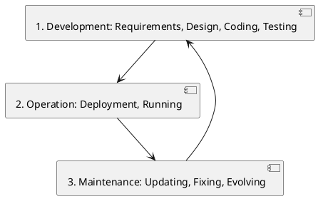

# Introduction

Software engineering provides a structured approach to building software, essential for projects involving multiple collaborators and requiring long-term evolution. Professional software development, extending beyond simple coding, faces significant inherent challenges:

*   **Communication**
*   **Coordination**
*   **Long-term Maintenance**
*   **Cost**
*   **Changes Over Time** (often complex and risky)
*   **Inherent Complexity**
*   **Being Not Perfect** (bugs are unavoidable)

## Software is More Than Just Code

Fundamentally, "Software" constitutes a complete package. This includes the core programs themselves, alongside necessary procedures for use and management, configurations, accompanying documentation, and relevant data.

### Examples of Software Components (Artifacts)

Beyond the code, typical software artifacts encompass *Requirement documents*, *Design plans*, *Test cases*, *Deployment scripts*, and *User manuals*.

## Types of Software

Software systems can be broadly categorized based on their purpose and operating environment:

*   **Embedded software:** Integrated directly into hardware devices (e.g., car engines, washing machines, train safety systems).
*   **Standalone software:** Runs independently on typical computers or mobile devices for end-users (e.g., word processors, browsers, photo editors).
*   **Enterprise software:** Large-scale systems used for organizational management across a business (e.g., CRM, ERP, banking systems).
*   **Production software:** Utilized in industrial settings to control or manage manufacturing processes (e.g., factory robots, quality control systems, Manufacturing Execution Systems - MES).

## Software Criticality

Software is further classified by the potential impact of its failure, defining its criticality level:

*   **Safety-critical software:** Failure carries a high risk of injury, death, or severe environmental damage (e.g., medical equipment, flight controls, nuclear plant systems). This category demands extreme reliability and correctness.
*   **Mission-critical software:** Failure results in major operational disruption, significant financial loss, or business failure (e.g., banking transactions, air traffic control, ERP). High availability and reliability are paramount.
*   **Other types of software:** Failure is generally inconvenient or causes only minor loss, not posing a threat to life or triggering major systemic collapse (e.g., most desktop/mobile apps, websites).

It's important to note that software embedded in physical systems, particularly safety-critical types, can have a direct and potentially severe physical consequence if failure occurs.

## Process and Product

Software engineering fundamentally emphasizes both the tangible **Product** (such as code and documentation) and the defined **Process** utilized to create it (encompassing activities, methods, and tools). The quality of the final product is strongly linked to the quality of the development process ("garbage in, garbage out").

The software process typically follows a lifecycle model. This lifecycle generally comprises three main phases:

These phases involve:

*   **Development:** The initial creation stage, including Requirements gathering/analysis, Design, Implementation/Coding, and Testing.
*   **Operation:** The phase where the software is used by end-users, covering Deployment and Running.
*   **Maintenance:** Work performed after initial delivery, categorized as Corrective (bug fixing), Adaptive (responding to environmental changes), and Perfective (adding features or improvements).

Decisions made during earlier phases significantly impact later ones. Consequently, changes required after delivery are often complex and costly, heavily influenced by the initial design and the software's maintainability.

### Process Properties

The efficacy of the software process itself is evaluated based on key properties: *Cost*, *Effort* expended, *Punctuality* (adherence to schedule), and *Conformance* (compliance with standards or regulations).

## Software Product Properties

The success of a software product is primarily judged by its **Functional properties** (what the software *does* to meet user needs) and its **Non-functional properties** or **Quality Attributes**. The latter describe *how well* the software performs its functions, encompassing aspects like performance, reliability, usability, security, and maintainability.

Consider the example of a Traffic Light Controller:

*   **Functional:** It must control the lights correctly, follow a specific sequence and timing, and react to pedestrian buttons or traffic sensors.
*   **Non-functional:**
    *   **Correctness:** Always display the correct sequence and never show conflicting signals simultaneously.
    *   **Reliability:** Exhibit a very low failure rate (e.g., fail only once in a million cycles).
    *   **Availability:** Achieve high uptime (e.g., 99.999%).
    *   **Security:** Be protected against tampering or hacking attempts.
    *   **Safety:** Never enter a hazardous state and include built-in fail-safes (e.g., revert to all lights red on error).
    *   **Usability:** Be easy for maintenance staff to configure or diagnose issues.
    *   **Efficiency:** Provide quick response times (e.g., under 0.1s) and use minimal resources.
    *   **Maintainability:** Allow easy modification of timings, addition of new lanes, or adaptation to rule changes.

Notably, non-functional properties are often critical requirements. They must be defined early in the project, explicitly designed into the system architecture, and thoroughly tested throughout the development lifecycle.

## Software Tools & Workbenches

Specialized tools and integrated environments (often called IDEs or Workbenches) play a vital role. They help automate repetitive tasks, provide support for complex activities, and ultimately improve both efficiency and quality in software development.

### Examples of Software Engineering Tools

Specific tools commonly used include:

*   **Version Control Systems:** Manage changes to code, track history, and support collaborative development (e.g., Git, Subversion).
*   **Requirement Management Tools:** Facilitate the capture, organization, and tracking of project requirements (e.g., tools supporting UML use cases or user stories).
*   **Design Tools:** Enable the creation of visual models representing software structure and behavior (e.g., tools for drawing UML diagrams).
*   **Integrated Development Environments (IDEs):** Bundle core coding and testing tools – such as code editors, compilers, debuggers, and build automation – into a single, cohesive interface (e.g., VS Code, IntelliJ IDEA, Eclipse).
*   **Testing Tools:** Provide assistance across various testing types, including unit test frameworks, UI automation tools, and performance testers.

The use of appropriate tools enhances developer productivity, ensures consistency across a project, simplifies collaboration among team members, and enables the adoption of modern practices like continuous integration and deployment.

## Laws of Software Engineering

Several common observations, often termed "laws," describe recurring phenomena in software development:

1.  Issues related to requirements are the primary identified cause of software project failure.
2.  A majority of software defects originate early in the requirements definition or design phases.
3.  The cost associated with fixing errors increases exponentially the later in the development lifecycle they are discovered.
4.  System complexity must be actively managed by decomposing systems into modular, hierarchical parts.
5.  Reusing existing components generally improves both the quality and reduces the cost of development.
6.  Deep understanding of the problem domain is essential for producing a good software design.
7.  Testing can prove the *existence* of defects but inherently cannot prove their complete absence.
8.  Any software that is useful will inevitably evolve over time (**Lehman's Laws**).
9.  During its evolution, system complexity tends to increase unless deliberate effort is made through refactoring, careful redesign, and testing (**Lehman's Laws**).
10. Adding more people to a software project that is already running late will typically make it even later (**Brooks's Law**). This is primarily due to the increased communication overhead introduced.
11. No single software process model or methodology is universally applicable; the chosen process must be adapted to fit the specific characteristics of the project at hand.

## Key Software Engineering Principles

Several fundamental guiding ideas underpin effective software engineering practices:

1.  **KISS (Keep It Simple, Stupid):** Prioritize simplicity in design and implementation. This makes systems easier to understand, build, test, and maintain.
2.  **Separation of Concerns (SoC):** Divide a system into distinct sections, where each part addresses a single, specific concern. This approach leads to **high cohesion** within each part and **low coupling** between different parts, simplifying development, testing, and subsequent modification.
3.  **Abstraction:** Focus on the essential features or behaviors of a system or component while hiding complex underlying details. This allows developers to manage mental complexity more effectively.
4.  **Conway’s Law:** States that the structure of a software system will tend to mirror the communication structure of the organization that built it. This highlights the significant impact that team organization has on the resulting software architecture.