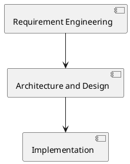
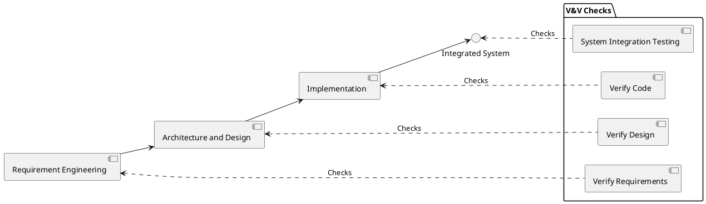
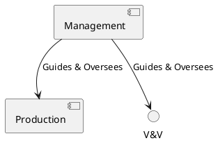
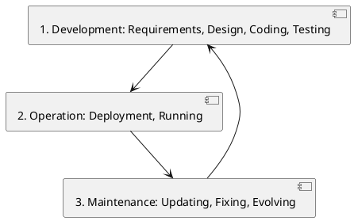

# Introduction to the Software Process

Software engineering employs structured **processes** to systematically guide software creation, subsequent deployment (operation), and ongoing updates or fixes (maintenance). A typical software process involves three fundamental aspects:

*   **Production:** The actual building of software components, including code and documentation.
*   **Verification:** Checking the software's quality and confirming fulfillment of requirements.
*   **Management:** Planning, coordinating resources, tracking progress, and controlling the overall project.

Distinct from traditional engineering disciplines that work with physical materials and scientific laws, software engineering deals with abstract concepts. This difference necessitates unique methods while still adhering to systematic approaches.

## Core Activities in Software Engineering

The primary objective is to reliably create software products (consisting of code, documentation, and data) with predictable cost, schedule, function, and reliability.

### Understanding Development Flow

Software construction can be conceptualized in different ways:

1.  **Bottom-Up View** (Starting from Executable): This perspective focuses on building upwards from the foundational elements towards the final executable software. The sequence moves from **Code** development to **Design** and then to **Requirement Engineering**, emphasizing the dependency of each step on those preceding it.
2.  **Top-Down Approach** (Starting from Requirements): Alternatively, this approach begins with the system as a whole and progressively breaks it down. The flow starts with **Requirement Analysis**, proceeds to **High-Level System Design**, then **Detailed Design**, and finally **Implementation and Integration**. This method is particularly effective for large, complex projects as it helps ensure that individual parts fit together coherently.

## The Production Process

Production activities primarily involve three core technical stages:

1.  **Requirement Engineering:** Defining precisely what the software *must* do. This phase includes gathering, analyzing, documenting, and managing requirements.
2.  **Architecture and Design:** Structuring the software system. This involves defining the overall blueprint (architecture) and creating detailed plans for individual components (design).
3.  **Implementation:** Building the software itself by writing code and assembling components according to the established design specifications.

These activities are fundamentally linked; requirements naturally precede design, which in turn precedes implementation. However, it's crucial to recognize that real-world processes often involve feedback loops and iterations between these stages.

## Validation and Verification (V&V)

**Validation** and **Verification** (V&V) are critical checks performed throughout the process. **Validation** ensures the software meets user needs (confirming that we are building the **right** product), while **Verification** confirms the software is built correctly according to its design and requirements (ensuring we are building the product **right**). V&V activities are interwoven throughout the development lifecycle:

*   **Requirement Verification:** Checking requirements for accuracy, consistency, and completeness.
*   **Design Verification:** Confirming the design aligns with the defined requirements.
*   **Code Verification:** Checking that the code correctly implements the design and adheres to coding standards, often involving code reviews, automated static analysis, and unit testing.
*   **System Integration Testing:** Verifying that combined software components function correctly together as an integrated system.

## Management in Software Engineering

Management activities are essential to ensure the software project operates effectively, stays on schedule and within budget, and ultimately meets its objectives. Key areas within software management include:

*   **Project Management:** Involves planning, assigning tasks, tracking progress, estimating costs and resources, managing risks, and scheduling activities.
*   **Configuration Management:** A systematic approach to storing, organizing, and tracking all project artifacts (like code and documentation), managing different versions, handling changes, and tracking dependencies.
*   **Quality Assurance (QA):** Focuses on defining quality goals, setting standards, conducting audits and reviews, and monitoring results to ensure the desired level of quality is achieved and maintained.

## Phases of the Software Lifecycle

The software process encompasses the entire lifespan of the software, typically broken down into distinct phases:

1.  **Development:** The initial phase where the software is created, involving Requirements definition, Design, Coding, and Testing.
2.  **Operation:** The phase during which the software is deployed and actively used by its end-users.
3.  **Maintenance:** Work performed on the software after its initial release. This includes Corrective maintenance (fixing bugs), Adaptive maintenance (making changes due to environmental shifts), and Perfective maintenance (adding new features or improvements).
4.  **Retirement:** The final phase where the software is eventually taken out of service.

Importantly, maintenance activities often involve repeating smaller development cycles on the existing software base. Accumulated constraints arising from successive changes over time can make future modifications increasingly harder and more costly.

## Comparing Software and Traditional Engineering

Comparing software engineering to traditional engineering highlights key differences:

| Feature | Traditional Engineering | Software Engineering |
| :--- | :--- | :--- |
| **Nature** | Physical materials, scientific laws | Abstract, logical entities |
| **Maturity** | Centuries of knowledge, standards | Relatively young, practices developing |
| **Variability** | Difficult/impossible to change built structures | Theoretically changeable, but managing complexity of changes is unique challenge |

## System vs. Software Processes

The specific process model used depends significantly on whether the software is standalone or integrated as part of a larger system:

*   **Standalone Software:** Typically follows a standard **software process** focused purely on the code, its structure, and associated documentation.
*   **Embedded Software:** Forms a component of a broader **system process** that also involves hardware development. A system process usually includes **System Requirements Engineering**, followed by **System Design** (which involves splitting responsibilities between hardware and software), then dedicated **Software Development** and **Hardware Development** tracks, culminating in **System Integration and Testing**.

## Approaches in Software Engineering Methodologies

Various methodologies, or process models, offer different ways to structure and organize software development activities:

*   **Cowboy Programming:** An unstructured approach with a sole focus on coding, generally only suitable for very small, personal projects lacking collaboration or longevity requirements.
*   **Document-Based Development** (e.g., **Waterfall**, **V-Model**): These models follow sequential phases with detailed documentation produced and reviewed between stages. They are often used for large, complex, or safety-critical projects, aiming for **predictability** through rigid adherence to the plan.
*   **Formal / Model-Based Development:** This rigorous approach uses **mathematical notation** and **automated verification tools** to achieve extremely high levels of assurance. It is primarily applied in developing safety- or security-critical applications.
*   **Agile Development** (e.g., **Scrum**, **Kanban**): Agile methodologies are **iterative and incremental**, valuing **flexibility**, close **customer collaboration**, and **frequent delivery** of working software. They emphasize adapting to change over strictly following a fixed plan and prefer direct communication over extensive documentation.

## Recent Trends in Software Engineering

Several recent trends continue to shape the field of software engineering:

*   **Software as a Service (SaaS):** Software hosted centrally in the cloud and accessed over the internet, typically on a subscription basis (e.g., Google Workspace, Salesforce).
*   **DevOps:** A significant cultural and practice shift integrating development (`Dev`) and operations (`Ops`) teams. The goal is to build, test, and deploy software faster and more reliably through enhanced collaboration and automation.
*   **Agile and Continuous Delivery (CD):** Building upon agile principles, Continuous Delivery automates the entire process from a code change to its readiness for production deployment, enabling rapid and safe releases.
*   **New Business Models:** The ways software is sold and distributed continue to evolve.

### Evolution of Business Models for Software

Historically, business models have shifted:

*   **ASP / Pay Per Use / Subscription (SaaS):** The dominant modern model where a provider hosts the software and the user pays a recurring fee for access.
*   **Freeware and Professional (Pro) Versions:** Offers a basic version for free while charging for advanced features or support ("freemium").
*   **Shareware:** Software offered for free trial, requiring payment for continued use (less common today).
*   **Adware:** Free software supported by displaying advertisements.

## Conclusion

In summary, software engineering is a systematic discipline that requires balancing **technical production activities** with necessary **Validation & Verification** and effective **management**. It stands apart from traditional engineering due to the abstract nature of software and the unique challenges posed by change management and achieving correctness. Crucially, no single process model fits all scenarios; methodologies must be carefully adapted based on specific project characteristics, inherent complexity, and the organizational context. Effective software engineering practice ultimately relies on understanding and applying these core concepts.