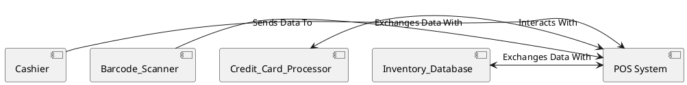
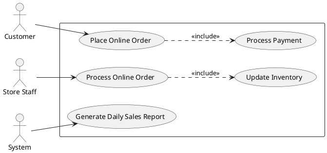
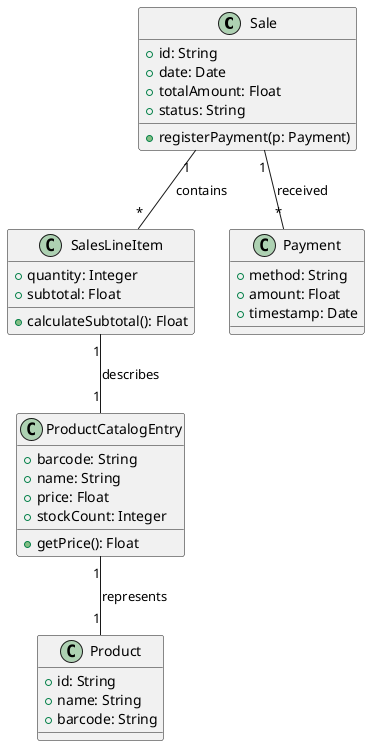
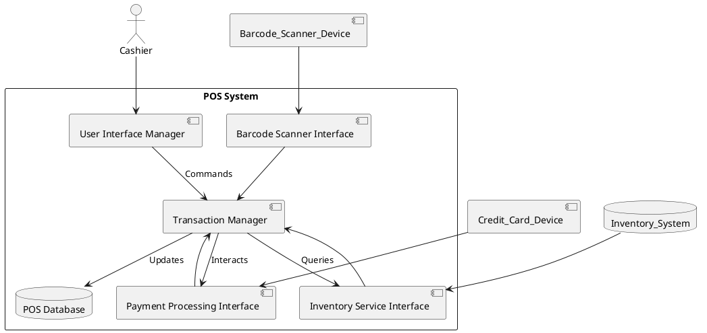

# Introduction to Requirement Engineering

**Requirement engineering (RE)** is the systematic process dedicated to defining the characteristics and capabilities of a software system. This crucial activity occurs **before** any coding begins. Its core purpose is to bridge the gap between diverse stakeholder needs and expectations and the detailed software specifications, thereby ensuring mutual understanding and preventing the costly mistake of building the *wrong* product.

## Key Concepts in Requirements

Fundamentally, requirements articulate *what* the software should do and *how well* it should perform:

*   **Functional Requirements:** These define the specific tasks or actions the system *must perform*. They describe features and behaviors from a user's perspective. Examples include "Process sales transactions" or "Allow user login."
*   **Non-Functional Requirements (NFRs) / Quality Attributes:** These specify *how well* the system performs its functions and impose constraints related to quality. Examples are defining performance metrics like "response time ≤ 500ms" or reliability goals like "availability ≥ 99.9%."

## Why Requirement Engineering is Crucial

Investing adequately in Requirement Engineering is vital for project success. Without it:

*   Poor, unclear, or frequently changing requirements are a leading cause of project failure, often resulting in scope creep, budget and schedule overruns, and ultimately, unusable systems.
*   Significantly, over 50% of software defects are traced back to issues originating in the requirements phase.
*   Consequently, fixing errors found early during requirements definition is dramatically less expensive than addressing them much later in the development lifecycle.
*   Therefore, validating requirements—checking their accuracy, consistency, completeness, and clarity—is a fundamental prerequisite.

Requirement engineering is not confined to a single phase but is involved throughout the entire **software development lifecycle**:

1.  **Definition:** Initial requirements are identified, analyzed, and documented.
2.  **Design:** Requirements directly inform the technical specifications and detailed design plans.
3.  **Implementation:** Code is written based on the design, which is derived from the requirements.
4.  **Validation:** The completed software is tested against the original requirements to confirm functionality and quality.
5.  **Maintenance:** RE principles are applied to manage changes—whether new features, fixes, or adaptations—needed for existing systems.

Given their dynamic nature, requirements are best treated as *living documents*. They require frequent revisit, clarification, and updates as understanding evolves or external circumstances change.

## Stakeholder Collaboration

Identifying and actively involving all relevant **stakeholders** is fundamental to capturing accurate and complete requirements. Stakeholders are defined as any individual, group, or organization with an interest in, affected by, or capable of influencing the system. Common examples include:

*   **Users:** Those who directly operate the system (e.g., cashiers, customers).
*   **Buyers / Customers:** Those who fund the project and define the primary business goals (e.g., executives, product owners).
*   **Domain Experts:** Individuals possessing deep knowledge of the specific business area (e.g., banking regulators, healthcare workflow specialists).
*   Other groups may include Regulators, Legal advisors, Marketing teams, Operations staff, and Support personnel.

For instance, developing a Traffic Light Controller involves stakeholders such as Traffic Engineers (defining logic and timing), City Officials (managing strategy and budget), Police/Emergency Services (requiring override capabilities), Maintenance Crews (need diagnostics and configuration tools), and implicitly, Pedestrians and Drivers (concerned with safety and wait times).

## Business Models & Requirements

The software's underlying **business model** significantly influences its requirements. For example:

*   A **SaaS / Subscription** model necessitates features for user account management, subscription handling, usage tracking, billing, payment integration, and managing different access levels.
*   An **Ad-supported** model requires functionality to display advertisements, collect user analytics (while adhering to privacy regulations like `GDPR`), and integrate with ad networks.
*   A **Free / Open Source** model often prioritizes ease of access, broad compatibility, and potentially features supporting community collaboration over complex billing systems.

Beyond core features, business models also dictate requirements for integration with external systems (e.g., interacting with payment gateways like **Visa/Mastercard APIs**) and ensuring compliance with legal or industry regulations (e.g., `GDPR`, `HIPAA`).

## User Profiling & Personas

Creating detailed **personas** is a technique used to help development teams understand the diverse needs, goals, and behaviors of different target user types. Personas are fictional, archetypal representations based on research, capturing demographics, behaviors, motivations, goals, and challenges. For e-commerce, personas might include "Convenience Seeker," "Deal Hunter," "New User," or "Store Manager." Defining these personas refines requirements by linking them explicitly to specific user types and their real-world contexts.

## System Boundaries & Context Diagrams

Clearly defining the **system boundaries** is essential. This involves clarifying precisely what components and functionalities are part of the new system and identifying external entities (users, other systems) with which it must interact. A **Context Diagram** serves as a valuable visual tool for this, depicting the system as a central element surrounded by these external actors and showing the flows of data or control between them.

Establishing clear boundaries is crucial for accurately defining the project **scope**, estimating **cost and resources**, and identifying the necessary **interfaces** for external communication.

## Interface Specifications

Precisely defining all system **interfaces**—the points where the system interacts with users or other systems—is critical for ensuring successful integration and usability. Interfaces can be of several types:

1.  **Procedural Interfaces (APIs):** These define how different parts of the system, or external systems, can call upon specific functions or services. They specify function names, required parameters, and expected outputs. An example is a `processPayment(amount, card_token)` function.
2.  **Data Interfaces:** These specify the structure, format, and meaning of data exchanged between systems or components. This could involve defining the structure of a JSON object containing product details.
3.  **Graphical User Interfaces (GUI):** These define the visual means of user interaction via screens, buttons, forms, menus, etc. They are often specified using wireframes, mockups, or interactive prototypes.

Detailed interface specifications provide the precise technical information needed for seamless communication and integration.

## ISO 25010: Software Quality Attributes

**ISO/IEC 25010** is a widely recognized international standard that provides a comprehensive framework for defining software quality attributes, which directly correspond to Non-Functional Requirements (NFRs). This standard helps ensure that NFRs are considered systematically and defined thoroughly. Key attributes defined include:

| **Attribute Category** | **Description** | **Example Measurable Requirement** |
| :--- | :--- | :--- |
| **Functional Suitability** | The degree to which functions meet stated and implied needs (completeness, correctness, appropriateness). | *(Primarily verified by executing the defined functional requirements and confirming correct behavior).* |
| **Performance Efficiency** | Performance relative to resources used (response time, throughput, resource utilization). | *"API response time must be ≤ 500ms for at least 99% of requests under peak load."* |
| **Compatibility** | Ability to exchange information with other systems and coexist in a shared environment. | *"The system shall integrate with the existing LDAP server for user authentication."* *"Exported reports must be compatible with Excel versions 2010 or later."* |
| **Usability** | Effectiveness, efficiency, and satisfaction for specified users achieving specific goals in a specific context. | *"New users shall complete the account creation process in ≤ 15 minutes without assistance."* *"Experienced users shall achieve ≥ 95% task completion rate after 2 hours of training."* |
| **Reliability** | Ability to perform functions under specified conditions for a specified period of time (availability, fault tolerance, recoverability, maturity). | *"System uptime shall be ≥ 99.9% measured monthly, excluding scheduled maintenance windows."* *"In case of a database connection loss, the system must automatically recover within 60 seconds."* |
| **Security** | Protection of information and data so that unauthorized persons or systems cannot access, use, or modify it (confidentiality, integrity, non-repudiation, accountability). | *"All sensitive customer data stored in the database must be encrypted using AES-256 or stronger."* *"Failed login attempts shall be rate-limited to a maximum of 5 per minute per IP address."* |
| **Maintainability** | Ease with which a system can be modified, corrected, or enhanced (modularity, reusability, testability, analyzability, changeability). | *"A moderate-sized feature enhancement (estimated effort 5 person-days) shall be implementable within 5 person-days of effort."* *"The core application codebase shall maintain ≥ 80% unit test coverage."* |
| **Portability** | Ability to be transferred from one environment to another (adaptability, installability, replaceability). | *"Server components shall be deployable on Linux (Ubuntu 20.04+) and Windows Server (2016+) operating systems without requiring code modifications."* |

## Measurable vs. Non-Measurable Requirements

For requirements to be useful, they must be clear, unambiguous, and verifiable. Vague, non-measurable terms lead to significant interpretation issues and make testing impossible.

*   **Non-Measurable** (To Avoid): Phrases like "System should be easy to use," "Minimize user errors," or "Software should be fast." These are subjective and cannot be objectively tested or verified.
*   **Measurable** (To Aim For): Requirements stated with specific, quantifiable criteria. Examples: "Users can complete the checkout process with ≤ 2 errors in 10 transactions after 2 hours of training," "Search results display time is less than 1 second for 95% of searches under peak load," or "Mean Time Between Failures (MTBF) shall be greater than or equal to 5000 hours."

Measurable requirements force clarity during the definition phase, provide objective criteria for both building and testing the software, and clearly define the criteria for project acceptance.

## Functional Requirements in Detail

**Functional requirements** specifically define the system's operations, tasks, and desired behaviors. They are typically captured using structured text descriptions, user stories, or formal use cases. For larger, complex systems, these requirements are often organized hierarchically to manage detail and dependencies.

Example of Hierarchical Functional Requirements for a Sales System:
*   **F1: Handle Sales Transactions**
    *   F1.1: Start a new transaction.
    *   F1.2: Scan a product barcode.
    *   F1.3: Manually enter product details.
    *   F1.4: Apply discount.
    *   F1.5: Finalize transaction (select payment method).
*   **F2: Manage User Accounts**
    *   F2.1: User login.
    *   F2.2: User logout.
    *   F2.3: Admin create new user account.

Effective management involves tracking functional requirements throughout the lifecycle, linking them to corresponding design elements, code modules, and test cases, and monitoring their status (e.g., defined, implemented, tested).

## Non-Functional Requirements (NFRs) in Detail

As discussed, **NFRs** define the software's quality attributes and constraints—essential aspects of *how well* the software performs. These determine the software's real-world acceptability and success beyond basic functionality. NFRs can be broadly categorized based on their source or focus:

*   **Product Requirements:** Define characteristics of the software product itself, such as speed, reliability, usability, or memory consumption.
*   **Organizational Requirements:** Derive from the policies and procedures of the developing or commissioning organization, including coding standards, required development methodologies, or documentation standards.
*   **External Requirements:** Stem from factors outside the system and organization, such as legal and regulatory compliance (`GDPR`, `HIPAA`), interoperability mandates with existing systems, or environmental constraints (e.g., operating temperature range).

It is crucial that NFRs, like functional requirements, are specific, unambiguous, and measurable. They significantly influence technical decisions related to architecture, technology stack selection, and the overall testing strategy and effort. For example, **NF1 (Performance)** might specify: "The time to execute Functional Requirement F1.1 (Start transaction) must be ≤ 50ms for 99% of attempts."

## Domain Requirements

**Domain requirements** are specific requirements derived from the particular business area or industry (the **domain**) for which the software is being built. These requirements dictate unique functions, data structures, constraints, calculations, and business rules specific to that domain, such as banking, healthcare, or manufacturing. For instance, in a train safety system, a domain requirement would involve calculating the minimum safe braking distance, which must include gradient compensation based on specific, complex formulas and rules defined within the railway engineering domain. Challenges in eliciting domain requirements include understanding specialized jargon and uncovering implicit assumptions held by domain experts. This necessitates active collaboration with domain experts to fully uncover and accurately document these crucial requirements.

## Scenarios & Use Cases

**Scenarios** and **Use Cases** are powerful techniques for describing system behavior from the perspective of a user or external system interacting with it:

*   A **Scenario** is a detailed, step-by-step description of a *single, specific sequence of interactions* performed to achieve a particular goal under defined conditions. For a POS system, a scenario could trace the exact steps for a typical successful cash sale: the Cashier scans items, the system updates the total, the customer pays cash, the system records the sale, and prints a receipt. Scenarios are also useful for describing *edge cases* or error conditions.
*   A **Use Case** is a broader concept that groups related scenarios around a common user goal. It describes a *set of possible interaction sequences* between an **actor** (a user role or external system) and the system to achieve that goal. A Use Case typically includes the *main success path* as well as descriptions of *alternative paths* and *exception flows*.

*(This diagram illustrates a Customer interacting with a "Place Online Order" Use Case which includes "Process Payment". Store Staff interact with "Process Online Order" which includes "Update Inventory". The System itself triggers "Generate Daily Sales Report".)*

Detailed Use Case specifications commonly include sections such as the Use Case Name, participating Actor(s), the Goal, Preconditions (conditions that must be met before the Use Case can start), Postconditions (conditions that are true after the Use Case completes), the Main Success Scenario, and descriptions of Alternative Flows and Exception Flows.

## Use Case Relationships

Use Cases can have defined relationships with each other:

*   **Include (`<<include>>`):** Indicates that one Use Case *incorporates* the behavior of another Use Case as a mandatory part of its flow. This is typically used to factor out common sequences of behavior shared by multiple Use Cases.
*   **Extend (`<<extend>>`):** Indicates that one Use Case *adds optional* behavior to another Use Case under specific conditions. This is used to model variations, exceptions, or infrequently occurring behavior.
*   **Generalization (Inheritance):** Represents a specialization relationship where one Use Case (the specialized one) inherits and potentially modifies the behavior of a more general Use Case. It models variations of a general interaction.

## Glossary & Class Diagrams

*   A **Glossary** is an essential artifact in requirement engineering. It is a centralized list of key project terms and acronyms, providing precise, agreed-upon definitions. This ensures consistent terminology across the team and stakeholders, avoiding ambiguity.
*   A **Class Diagram** (from the Unified Modeling Language - UML) is a visual model that represents the *static structure* of the system. It shows the different types of objects in the system (classes), their data elements (**attributes**), and the **relationships** between them. Class diagrams are particularly useful for clarifying data requirements and building a shared understanding of the conceptual model of the system.

*(This UML Class Diagram illustrates the relationships between core classes in a POS system: a Sale contains multiple SalesLineItems, each describing a ProductCatalogEntry which represents a Product. A Sale also receives multiple Payments.)*

## System Design & Deployment Considerations

The defined requirements, especially the Non-Functional Requirements related to performance, reliability, portability, and security, are critical inputs for subsequent project phases. They directly influence the **system design**—how the system is structured into subsystems and how those subsystems interact—and **deployment planning**, which involves identifying necessary hardware, software infrastructure, and environmental constraints.

*(Expanding on the Context Diagram, this diagram shows the internal structure of the POS System, detailing how its subsystems (UI Manager, Transaction Manager, Database, etc.) interact with each other and with the external entities (Cashier, Scanner, etc.) identified in the context.)*

## Requirement Document Structure

Requirements are typically consolidated and organized into a formal document, often called a Software Requirements Specification (**SRS**). A standard SRS structure might include sections such as an Introduction, an Overall Description of the system, the System Context (often including the context diagram), detailed Functional Requirements (potentially hierarchical), explicit Non-Functional Requirements (stated measurably), any specific Domain Requirements, Use Cases or Scenarios, Interface Requirements, a Glossary of terms, a High-Level System Design overview derived from requirements, and Appendices. Traceability matrices, which link each requirement to specific design elements, code modules, and test cases, are highly recommended for managing dependencies and tracking implementation status.

## Validation & Verification Techniques (in RE)

Several techniques are specifically employed *during* the Requirement Engineering process itself to ensure the quality and correctness of the requirements before moving forward:

*   **Inspections / Reviews:** Formal processes where stakeholders meticulously review requirement documents to identify defects. Common defects sought include **Omissions** (missing requirements), **Ambiguities** (unclear statements), **Conflicts** (contradictory requirements), **Incompleteness** (missing details), and **Infeasibility** (requirements that cannot be met).
*   **Prototyping:** Building simplified, often non-functional, models of parts of the system. These prototypes are used for stakeholder interaction and feedback, helping to uncover issues, usability problems, or unstated requirements that might have been missed in static documentation.
*   **Iterations:** Particularly in Agile methodologies, requirements are refined iteratively in short cycles. This allows for building working software increments based on current understanding and using the resulting feedback from stakeholders to adjust and clarify requirements for subsequent cycles.

## Common Requirement Defects

As highlighted by V&V techniques, certain errors appear frequently in requirement sets:

*   **Omissions:** Critical requirements are simply not documented.
*   **Ambiguities:** Statements are vague and open to multiple interpretations.
*   **Conflicts:** Two or more requirements contradict each other.
*   **Incompleteness:** Key details or necessary information are missing from a requirement description.
*   **Infeasibility:** Requirements that are impossible or unrealistic to implement within the project's constraints (budget, schedule, technology).

Employing rigorous V&V techniques (like inspections, prototyping, and workshops) and emphasizing measurable requirements are the most effective ways to identify and resolve these common defects early in the process.

## Elicitation Techniques

**Elicitation techniques** are the various methods used to actively discover and gather requirements from stakeholders and other sources. The choice of technique often depends on the project context, stakeholder availability, and the type of information needed. Common elicitation methods include:

*   Interviews with individual stakeholders.
*   Facilitated sessions like Focus Groups.
*   Structured Questionnaires or Surveys.
*   Ethnography or direct Observation of users in their work environment.
*   Collaborative Workshops involving multiple stakeholders.
*   Analysis of existing Documents (like manuals, reports, or legacy system specifications).

In conclusion, requirements form the fundamental bedrock for successful software development. Thorough definition, rigorous validation and verification, and diligent management of requirements throughout the software lifecycle are absolutely critical for delivering reliable, maintainable, and scalable software that genuinely meets user and business needs.