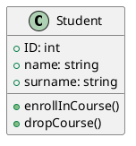
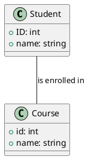
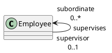
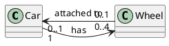
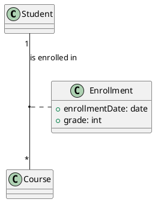
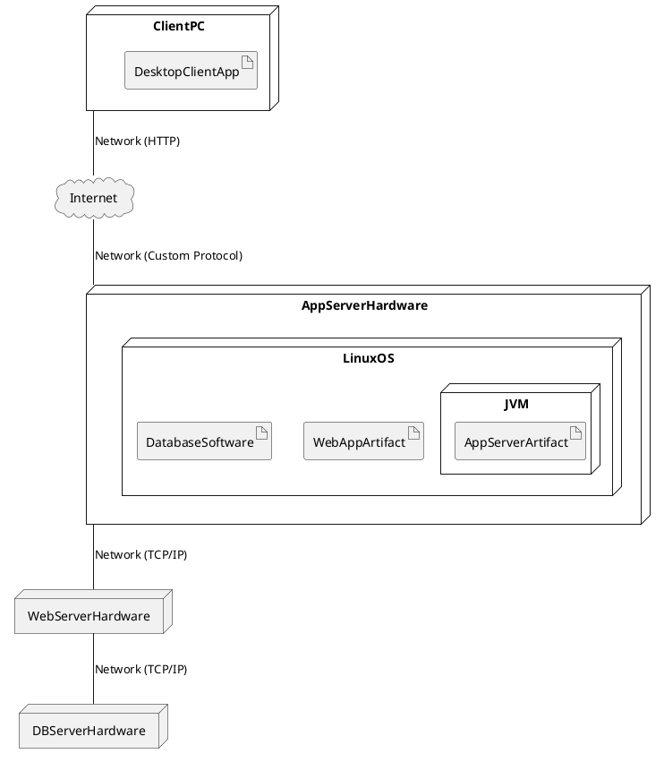

# UML: Unified Modeling Language

## Introduction to UML

The **Unified Modeling Language (UML)** is a standardized visual language widely used in software engineering. Its purpose is to help **specify, visualize, construct, and document** the artifacts of a system. Standardized by the **Object Management Group (OMG)**, UML comprises various diagram types, each designed to represent different aspects of a system. Common diagram types include Class, Activity, Use Case, Sequence, and Statechart diagrams.

Collectively, UML diagrams support diverse modeling goals:

*   **Conceptual Modeling:** Used to clarify domain concepts and their inherent relationships.
*   **Process Modeling:** Describes sequences of actions or workflows within a system.
*   **Functional Modeling:** Defines system behaviors primarily from a user's perspective.

## Class Diagrams

Among the most fundamental UML diagrams, **Class diagrams** model the **static structure** of a system. They illustrate the system's classes, their internal attributes and operations, and the relationships that exist between these classes.

### Components of a Class Diagram

A Class diagram is composed of several key elements:

*   **Class:** Represents a blueprint or template for creating objects (e.g., `Student`, `Course`).
*   **Instance / Object:** A specific, concrete realization of a class, possessing unique attribute values (e.g., a specific `Student` named "Mark Smith"). Objects are characterized by **Identity**, **Attributes**, **Operations**, and the ability to respond to **Messages**.
*   **Attribute:** A data property or characteristic held by objects of a class (e.g., `ID: int`, `name: string`). Attributes are typically shown with their Name and Type.
*   **Operation:** An action or behavior that instances of a class can perform (e.g., `enrollInCourse()`).
*   **Association:** A relationship or connection between two or more classes, depicted by a line linking the class boxes. Associations may optionally have a name describing the relationship.
*   **Links:** Represent specific connections that exist between individual object *instances* at runtime.

### Example: Object Instances Conceptually Illustrated

```plantuml
@startuml
class Student {
  + ID: int
  + name: string
  + surname: string
}

object "<u>Student1:Student</u>" {
  ID = 110234
  name = "Mark"
  surname = "Smith"
}

object "<u>Student3:Student</u>" {
  ID = 99045
  name = "Helen"
  surname = "Clark"
}
@enduml
```

*(Note: While illustrated here using `classDiagram` syntax for conceptual clarity, standard UML typically uses dedicated Object Diagrams to explicitly model object instances and their links at a specific point in time.)*

### Example: Basic Class Representation

A class is visually represented as a rectangle divided into sections for its name, attributes, and operations:



### Usage of Class Diagrams

Class diagrams are versatile and can be used at various levels of detail depending on the modeling goal:

*   **Model of Concepts (Domain Model):** Focuses on understanding the core entities and relationships within a specific business domain, independent of any software implementation.
*   **Model of System:** Provides a high-level overview of the major components, subsystems, and their relationships within the software system.
*   **Model of Software Classes (Implementation Model):** Details the specific classes that will be implemented in code, including precise data types for attributes and signatures for methods.

The chosen purpose dictates the content and level of detail included in the diagram.

### Identifying Classes

For creating conceptual (domain) models, potential classes are often identified by looking for nouns or noun phrases in requirements documents or domain discussions. These nouns may represent: Physical Entities, Roles, Social/Legal/Organizational Entities, Events, Time Intervals, Geographical Entities, or Reports/Summaries.

When designing software, additional software-specific classes must also be considered, such as: Collection Classes, Primitive Type Wrappers, GUI Classes, Data Transfer Objects (DTOs) or Beans, Data Access Objects (DAOs), Service Classes, and Controller Classes.

## Associations

Associations are the primary way to represent potential **links** between objects of different classes. In a Class diagram, an association is depicted by a simple line connecting the two classes involved. An optional name placed on the line can describe the nature of the relationship (e.g., `Student -- Course : is enrolled in`).



### Role in Association

Optionally, **role names** can be placed near a class box along an association line. A role name describes the specific part or role an object of that class plays within the context of that particular association (e.g., `Person -- City : lives in +resident`).

### Recursive Associations

A **recursive association** occurs when a class is associated with itself. This models relationships that exist between objects of the same class (e.g., representing a hierarchy where a `Person` can be a parent of another `Person`, or an `Employee` supervises other `Employees`).



*(This diagram models a potential relationship where an employee object can supervise zero or more other employee objects (the 'subordinates'), and each employee object can be supervised by zero or one other employee object (their 'supervisor').)*

## Multiplicity

**Multiplicity** specifies the minimum and maximum number of objects that can participate at one end of an association, from the perspective of the other end. Multiplicity indicators are placed near the class box to which they apply.



Common multiplicity values include:

*   `n`: Exactly `n` instances (e.g., `1`, `2`).
*   `*` or `0..*`: Zero or more instances.
*   `0..1`: Zero or one instance (optional).
*   `m..n`: A range of instances from `m` to `n`.
*   `m..*`: `m` or more instances.
*   `1`: Exactly one instance.

## Special Cases of Associations

UML provides specific notations for common types of relationships:

*   **Aggregation (Has-A, Weak Ownership):** Represents a "part-of" relationship where the "part" object can exist independently of the "whole" object. It's shown with a hollow diamond shape on the side of the "whole" class.

    ```plantuml
    @startuml
    class Car { }
    class Engine { }
    Car o-- "1" Engine : has
    @enduml
    ```

    *(A Car 'has' an Engine, but the Engine can exist and function separately.)*
*   **Composition (Part-Of, Strong Ownership):** Represents a stricter "part-of" relationship. In Composition, the "part" object's lifecycle is dependent on the "whole"; it typically cannot exist if the whole is destroyed. This is shown with a filled diamond on the side of the "whole" class.

    ```plantuml
    @startuml
    class Person { }
    class Hand { }
    Person *-- "2" Hand : has
    @enduml
    ```

    *(A Person 'has' two Hands, and the Hands typically cease to exist if the Person does.)*
*   **Specialization / Generalization (Inheritance):** Represents an "is-a-kind-of" hierarchy. A subclass inherits attributes and operations from a superclass. It is shown with a hollow triangle arrow pointing from the subclass to the superclass.

    ```plantuml
    @startuml
    class Person { }
    class Student { }
    class Employee { }
    Person <|-- Student
    Person <|-- Employee
    @enduml
    ```

    *(A Student is a kind of Person; an Employee is a kind of Person.)*
    Terminology used includes Parent/Child, Superclass/Subclass, and Ancestor/Descendent.

## Association Class

An **Association Class** is used to model attributes or operations that logically belong to the *relationship itself* between two classes, rather than belonging solely to either of the connected classes. It is drawn as a class box connected to the association line by a dashed line.

*   Use an Association Class when the concept you are modeling is primarily a property of the *link* between objects (e.g., `Enrollment` for a `Student` in a `Course`).
*   Consider modeling it as a regular intermediate class with separate associations if the concept is complex, has its own significant internal structure, or needs to exist independently of the specific link instances.



*(Here, `enrollmentDate` and `grade` are properties of the specific `Enrollment` relationship between a `Student` and a `Course`, not properties of the Student or Course alone.)*

## Best Practices in Class Diagrams

To create effective and clear Class diagrams:

*   **Do:**
    *   Clearly define the diagram's goal before starting (conceptual, system overview, implementation detail).
    *   Identify core concepts and potential classes (often by analyzing nouns).
    *   Use singular names for classes.
    *   Use verbs or descriptive phrases for association names.
    *   Always specify multiplicity for associations.
    *   Use role names and association classes where they clarify complex relationships.
    *   Model complex concepts with internal structure (like `Address`) as separate classes linked by association, rather than simple attributes.
    *   Model collections (like a list of phone numbers) as associations to another class (`PhoneNumber`) with appropriate multiplicity.
*   **Don't:**
    *   Forget to specify multiplicities, roles, or use association classes when needed.
    *   Mix different levels of abstraction within a single diagram.
    *   Use a class box for something that is merely a simple attribute type.
    *   Represent collections of objects as single attributes.
    *   Model transient or dynamic relationships that only exist briefly.
    *   Repeat relationships by modeling the same link as both an association and an attribute in connecting classes.
    *   Introduce unnecessary loops or overly complex structures.
    *   Confuse the goals of different diagram types (e.g., use a Class diagram to show process flow).
*   **Be Careful:**
    *   Remember that a subclass in generalization represents a fixed type; an object is an instance of *one specific class* (its most specialized one) at a time.
    *   When an entity can fulfill different roles dynamically (e.g., a `Person` being a `Captain` or a `Copilot` depending on the context), it's often better to model these roles using associations rather than using inheritance for roles, as the role isn't a fixed type.

### Patterns in Information Systems

Class diagrams are frequently used to model common structures found in information systems. Recognizing patterns helps in design:

*   **Catalogue vs. Inventory:** It's important to distinguish between the generic definition of a product type (the `Catalogue` entry, e.g., `CarModel` with properties like make, model, engine type) and specific physical instances of that product (the `Inventory` item, e.g., an individual `Car` with a unique VIN, color, specific engine number).

    ```plantuml
    @startuml
    class Car {
     + VIN: string
    }
    class CarModel {
     + modelName: string
    }
    Car "0..*" -- "1" CarModel : isModelOf
    @enduml
    ```
*   **Composite Pattern (Bill of Materials - BOM):** This pattern represents part-whole hierarchies where composite objects can contain other parts, which themselves can be either atomic (indivisible) or other composite objects. This is typically modeled using a recursive association from a `CompositePart` to a base `Part` class.

    ```plantuml
    @startuml
    class Part {}
    class AtomicPart {}
    class CompositePart {}
    Part <|-- AtomicPart
    Part <|-- CompositePart
    CompositePart "1" *-- "1..* component" Part : contains >
    @enduml
    ```

    *(A CompositePart is a Part and contains other Parts (Atomic or Composite).)*

## UML Deployment Diagram

A **UML Deployment Diagram** is used to model the **physical deployment** of software artifacts onto hardware and software execution environments. It shows the physical computing resources available, the deployable software units, and the connections between them.

### Components of a Deployment Diagram

Key components include:

*   **Node:** Represents a physical or logical entity capable of executing software. Nodes are typically shown as boxes with a 3D appearance. They can be specifically stereotyped as `<<device>>` (representing hardware like servers, workstations, mobile phones) or `<<executionEnvironment>>` (representing software environments like operating systems, JVMs, application servers, containers).
*   **Association:** A line representing a physical connection or communication path between nodes (e.g., a network connection).
*   **Artifact:** Represents a concrete, deployable physical unit of information (e.g., an executable file, library, configuration file, script). Artifacts are shown as rectangles with the `<<artifact>>` keyword.
*   **Nesting:** One node can be nested inside another (e.g., an execution environment inside a device), or artifacts can be nested inside nodes or execution environments to show where they are deployed.

### Example Deployment Diagram (Conceptual Representation Using classDiagram Syntax)

While actual Mermaid syntax for Deployment diagrams uses `deploymentDiagram`, the concepts and relationships can be conceptually illustrated using `classDiagram` syntax for clarity:



*(Note: This diagram uses `classDiagram` syntax and conceptual associations/aggregations to illustrate nodes and artifacts and their relationships, as a stand-in for a true `deploymentDiagram` which has dedicated syntax elements.)*
A Deployment diagram is essential for understanding the physical architecture and planning the deployment process.