# Introduction to Configuration Management

**Configuration Management (CM)** stands as a foundational practice in software engineering, specifically designed to systematically organize, track, and control all development artifacts. These artifacts span a wide range, including source code, documentation, test scripts, and design models.

CM is essential for effectively navigating project challenges, particularly those related to collaboration and the system's evolution over time. It addresses issues such as:

*   **Collaboration:** Managing simultaneous work on the same files or components by multiple individuals across development, operation, and maintenance phases.
*   **Dependencies:** Tracking formal and informal connections between various artifacts (e.g., code modules relying on each other, test cases verifying specific requirements, code implementing particular design elements).
*   **Control and Tracking:** Establishing mechanisms for managing version storage, controlling access permissions, handling concurrent modifications to files, maintaining a clear history of changes (recording who made them, when, and why), and enabling the reliable retrieval of specific past versions or the entire system state at any given point.

### Main Phases Where CM is Essential

CM practices are not limited to a single stage but are crucial throughout the software lifecycle:

*   **Development:** Managing artifacts as they are actively created, refined, and modified by the team.
*   **Deployment:** Ensuring that the correct versions of all necessary artifacts are packaged and installed correctly in target environments.
*   **Operation:** Managing the configurations of running systems and tracking any changes made to the operational environment.
*   **Maintenance:** Providing controlled mechanisms for implementing changes—whether bug fixes, new features, or adaptations—to existing software versions.
*   **Retirement:** Managing the final state of the system before it is decommissioned and ensuring that relevant versions and documentation are archived.

### Development Process and CM

Within the development phase, CM integrates tightly with core activities such as requirement engineering, design, implementation, testing, and overall project management. CM serves to track the evolution of artifacts and the relationships among them: requirements derive from initial needs, design is based on requirements, implementation follows the design, and tests verify the code and design against the original requirements. CM manages versions and controls changes applied across all these interconnected artifacts.

---

## Core Configuration Management Concepts

Understanding Configuration Management involves familiarity with fundamental terminology and common operations performed within CM systems.

### Basic Terminology

Key terms central to CM include:

*   **Configuration Item (CI):** The basic unit of management within CM. This can be a single file or a logical grouping of related files.
*   **Configuration:** A specific collection or snapshot of multiple CIs captured at a particular point in time, ideally representing a consistent state of the project.
*   **Repository:** The central storage location where CIs, their version history, and defined configurations are maintained.
*   **Versioning:** The automated mechanism provided by the system for storing and tracking every change made to CIs over history, enabling the retrieval of any past state.
*   **Change Control:** The formal processes and underlying mechanisms used to manage modifications to CIs, often including permissions, approval workflows, and handling strategies for concurrent changes.

### Workflow Operations

Typical operations within a CM workflow involve moving and modifying CIs:

*   **Check-out:** The action of obtaining a copy of a specific CI from the repository into a local workspace. In some CM models, this operation may also place a lock on the CI in the repository, preventing others from modifying it concurrently.
*   **Check-in / Commit:** The action of submitting modified CIs from a local workspace back into the repository. This saves the changes as a new version, records associated metadata (like author and timestamp), and releases any locks that were held.

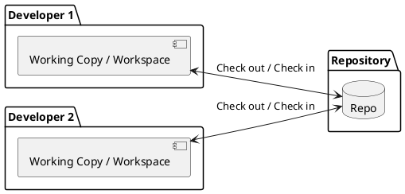

### Change Control Models

CM systems employ different strategies for managing changes when multiple users might attempt to modify the same CI simultaneously:

| Model | Description | Advantages | Disadvantages |
| :--- | :--- | :--- | :--- |
| **Lock-Modify-Unlock**| A user must explicitly lock a CI in the repository before they can modify it. Other users are blocked from checking out or modifying the locked CI until it is unlocked after the first user checks in their changes. | Guarantees that only one person is modifying a specific CI at a time, thereby preventing merge conflicts on that item. | Can create bottlenecks, particularly on frequently changed files. It inherently forces sequential work, which can hinder parallel development if locks are held for extended periods or forgotten. |
| **Copy-Modify-Merge** | Users copy CIs from the repository into their local workspaces, modify them independently and potentially in parallel. The CM system is then responsible for attempting to merge these concurrent changes when users check in their work. | Enables parallel work streams, significantly improving overall team speed and productivity. | Requires manual **conflict resolution** if the same part of a CI has been changed differently by multiple users before the merge attempt. This process can be complex and error-prone. |

### CM Implementation Choices

Several decisions are necessary when establishing CM practices for a project:

*   **What is a CI?:** Defining precisely which items will be managed by CM and determining the appropriate granularity (e.g., managing individual files versus entire modules or directories).
*   **Change Model:** Selecting the preferred strategy for handling concurrent modifications: Lock-Modify-Unlock or Copy-Modify-Merge.
*   **Commit Frequency:** Establishing guidelines or norms for how often developers should save their changes to the repository.
*   **CM Manager Role:** Designating individual(s) responsible for overseeing the CM process, defining policies, and managing the tool.
*   **CMS Tool:** Selecting the specific software application that will automate the CM processes (e.g., `Git`, `Subversion`, `Perforce`).

### Configuration Management Systems (CMS)

A **Configuration Management System (CMS)** is a software application specifically designed to automate and enforce CM processes. Core capabilities of a robust CMS include: Version tracking, enforcement of change control policies (like locking or merge handling), ability to rollback to previous versions, retrieval of specific past project states (configurations), comparison of different versions, access control mechanisms, and logging changes with metadata (user, timestamp). A CMS should be able to answer fundamental questions about project artifacts, such as their current location, who has permissions to change them, who made specific changes, and the exact state of any file at any point in history.

### CMS Taxonomy

CMS tools can be broadly categorized based on their underlying repository architecture:

| Type                | Description                                                                                                                                                                                                                                                                                                      | Example Systems                      | Key Characteristic                                                                                                   |
| :------------------ | :--------------------------------------------------------------------------------------------------------------------------------------------------------------------------------------------------------------------------------------------------------------------------------------------------------------- | :----------------------------------- | :------------------------------------------------------------------------------------------------------------------- |
| **Local CMS**       | The repository resides on the same machine as the user's workspace. These systems lack inherent multi-user collaboration features.                                                                                                                                                                               | RCS (Historical)                     | Repository and workspace are tightly coupled on the same machine. No built-in support for collaboration among users. |
| **Centralized CMS** | Features a single central server hosting the repository. Clients connect to this server to perform all operations. Clients typically only maintain local copies of the current versions of files they are working on.                                                                                            | CVS, Subversion (SVN), Perforce, TFS | Based on a single central repository. All client interactions go through this server.                                |
| **Distributed CMS** | Each client possesses a full copy of the *entire* repository, including its complete history, stored locally. Most operations are performed against this local repository, making them very fast. Synchronization with other repositories (like a remote server or other peers) is an explicit step when needed. | `Git`, Mercurial, Bazaar             | Each client has a complete, independent copy of the repository and its history. Most operations are local and fast.  |

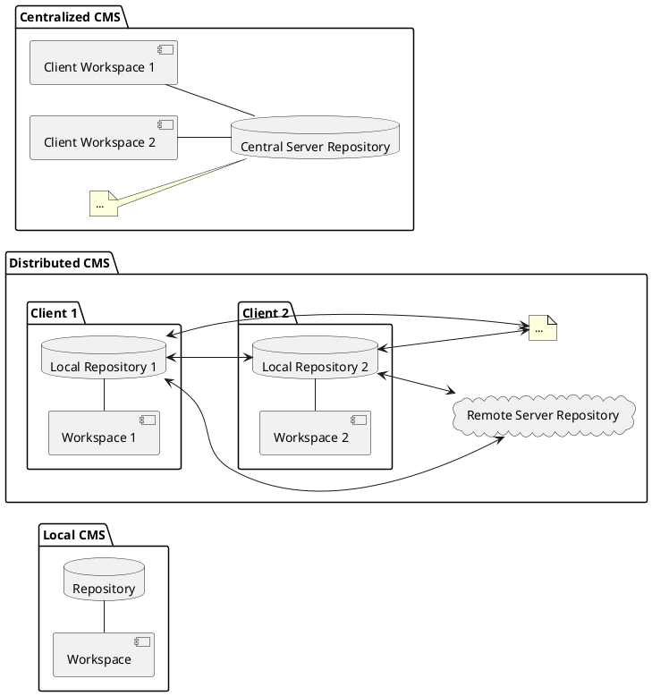

### Storage Models

CM systems utilize different internal strategies for storing the historical versions of Configuration Items:

*   **Deltas (Difference-based):** Stores the initial version of a file completely, but subsequent versions are stored only as the differences (deltas) relative to a preceding version. While potentially space-efficient, reconstructing a specific version requires applying a chain of deltas.
*   **Full Copies (Snapshot-based conceptually):** Conceptually, the system stores a full copy of the content for each version (though internally, this is highly optimized to avoid redundant storage). This model allows for much faster retrieval of any specific version without needing to apply deltas.

Modern CM systems, like `Git`, tend towards conceptual full copies or highly efficient snapshots due to falling storage costs and the demand for rapid access to project history.

### Configuration Models

Beyond individual file versions, CM is concerned with managing versions of the entire project configuration:

*   **Differences Model** (e.g., SVN): Each commit records the new versions of the files that were modified in that change. To reconstruct the project state at a past commit, the system must identify the specific version of each file that was current at that commit.
*   **Snapshot Model** (e.g., `Git`): Each commit captures a snapshot representing the full state of the project (all files and directories) from the Staging Area at the time of the commit. This means each commit object points directly to a complete snapshot. Files that haven't changed since a previous commit are efficiently linked to the existing content from that previous snapshot. This design makes operations involving the full project state (like branching, switching branches, or retrieving past states) very fast.

---

## Introduction to Git

`Git` is a widely adopted **distributed version control system (DVCS)**. It was initially created by Linus Tords in 2005 specifically for managing the development of the Linux kernel. Git's design principles represent a significant departure from older centralized systems.

### Key Git Characteristics

`Git` is distinguished by several key characteristics:

*   **Distributed Architecture:** As a DVCS, every developer working with a `Git` repository possesses a full, independent copy of the entire repository and its complete history locally on their machine.
*   **Snapshot-Based:** Rather than storing changes as file differences (deltas) for each version, `Git` primarily manages versions by storing complete project snapshots at each commit. Although internally optimized for space, the conceptual model is snapshot-based.
*   **Local Operations:** Most common `Git` tasks, such as committing changes, creating branches, merging branches locally, and reviewing history, are performed entirely against the local repository. This makes them extremely fast, as they don't require network communication with a central server.
*   **Integrity:** `Git` is designed with data integrity as a high priority. It uses `SHA-1` checksums to generate unique identifiers for data objects (including file content, directory structures, and commit objects), ensuring that data is not corrupted or tampered with.
*   **Additive Design:** `Git` operations primarily involve adding new data to the repository. It is very difficult to lose committed data unintentionally, as old objects typically remain available until explicitly cleaned up via garbage collection.

### Related Services

Numerous web-based platforms exist to host `Git` repositories and provide collaborative and project management features built around `Git`:

*   **GitHub:** A very popular hosting service offering features like pull requests, issue tracking, and project boards.
*   **GitLab:** Provides repository hosting along with an integrated platform for the entire DevOps lifecycle, including CI/CD, registry, and monitoring.
*   **Bitbucket:** Another hosting service, offered by Atlassian, which integrates tightly with other Atlassian products like Jira and Confluence.

### Git Workflow Components

`Git` manages the state of files through three conceptual areas within a local repository setup:

1.  **Working Directory:** This is the actual file system directory where you see and edit the files of your project.
2.  **Staging Area** (`Index`): A temporary area used to prepare the changes you want to include in the *next* commit. You use the `git add` command to place changes into this area.
3.  **Git Repository** (`.git` directory): A hidden folder within your project directory that contains Git's permanent history, all commit objects (snapshots), branch pointers, tags, and other essential internal data structures.

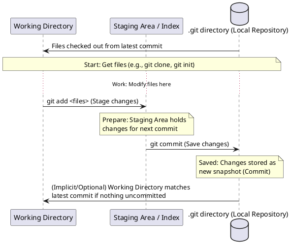

### Configuration Item States in Git

Within `Git`, a file in the Working Directory can be in various states relative to the repository:

*   **Untracked:** The file exists in the Working Directory but is not known to `Git` (it was not in the previous commit and has not been staged).
*   **Tracked:** The file is known to `Git` because it was present in a previous commit. Tracked files can be in several substates:
    *   **Unmodified:** The Working Directory version of the file exactly matches the version in the latest commit or the version currently in the Staging Area.
    *   **Modified:** The file has been changed in the Working Directory since the last commit or since it was last staged. These changes are not yet in the Staging Area.
    *   **Staged:** A modified version of the file has been added to the Staging Area using `git add`, signifying that these specific changes are ready to be included in the next commit.

You can use a `.gitignore` file to tell `Git` to intentionally ignore certain untracked files (like build outputs or editor configurations) so they don't clutter the `git status` output.

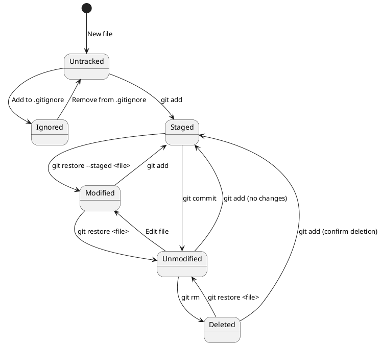

### Git Commit: Understanding the Core Operation

The `git commit` command is central to Git's workflow. It takes the current contents of the Staging Area and saves them as a new, immutable record in the local repository. Each commit object is a distinct entity that stores:

*   A reference (via a unique hash) to a specific snapshot of the project's files and directory structure, capturing the state as it was in the Staging Area.
*   Pointers to its parent commit(s), which establishes the historical lineage.
*   Metadata about the commit, such as the author, committer, timestamp, and the commit message.

Commits are atomic; they either succeed completely or fail. A descriptive commit message is mandatory. Common commands include `git commit` (opens editor), `git commit -m "message"`, and `git commit -a` (automatically stages all *tracked and modified* files before committing). `git commit --amend` allows modifying the most recent commit.

After a `git commit` command is executed: a new snapshot is effectively created (or reused if identical), a new commit object is stored in the repository, and the pointer for the currently active branch is updated to point to this new commit. It's important to remember that these changes are saved only in your **local** repository; they are not yet shared with any remote repositories. You use `git push` to share your local commits.

*   **Commit ID (Hash):** Each commit is uniquely identified by its `SHA-1` checksum (e.g., `f8d6d1c0...`). Shorter prefixes (e.g., `f8d6d1c`) are often used when the full hash is not needed.
*   **Referencing Commits:** Commits can be referenced using their full or short hash ID, by a branch name that points to them, by a tag, or using relative references (e.g., `HEAD~1` for the parent of the current commit).

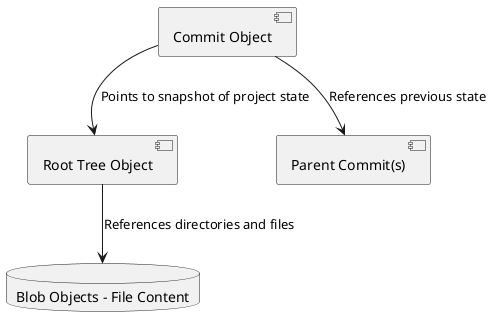

### Best Practices for Committing

Adhering to best practices for commits enhances collaboration and maintainability:

*   **Commit Frequently & Make Them Small:** Frequent, small commits make it easier to understand history, pinpoint when regressions were introduced, and simplify merging later.
*   **Write Clear, Descriptive Messages:** Start with a concise subject line (conventionally kept under 50 characters), followed by an optional blank line and a more detailed body explaining the context, problem, and solution.
*   **Each Commit = Single Logical Change:** Group related changes into one commit. Use the Staging Area (`git add` incrementally) to select which modified files or even parts of files belong together in a single commit.
*   **Conventional Commits:** Consider adopting a standardized commit message format (e.g., `type(scope): description`) for improved readability, easier filtering of history, and enabling automation (like generating changelogs). Common types include `feat`, `fix`, `docs`, `chore`, `refactor`, `test`. Appending `!` after the type (e.g., `feat!:`) indicates a breaking change.

```markdown
feat(profile): add user profile viewing page

Implements a new frontend page at /profile/{userId} that fetches
user details from the /api/users/{userId} endpoint and displays
them in a formatted view.

This change addresses the user story #88.
```

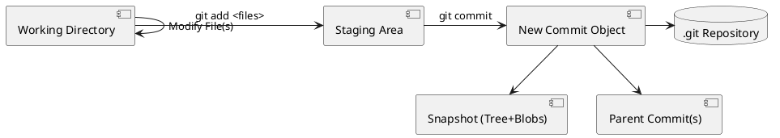

---

## Basic Git Commands

Getting started with `Git` involves learning a core set of commands for common workflows.

### Setup and Configuration

These commands set up your identity and repositories:

*   `git config --global user.name "Your Name"`: Sets the name that will be recorded as the author of your commits globally for all your Git repositories.
*   `git config --global user.email "your.email@example.com"`: Sets the email address for your commit author identity globally.
*   `git init`: Initializes a new, empty local Git repository in the current directory. This creates the hidden `.git` folder.
*   `git clone <repository-url>`: Downloads an existing repository from a remote location, including its full history, and automatically sets up a connection to the original remote repository (typically named `origin`).
*   `git remote add origin <remote-url>`: Used after `git init` to establish a connection to a remote repository. It creates a shortcut name (`origin` by convention) for the remote URL, allowing you to use `origin` instead of the full URL for push/pull operations.

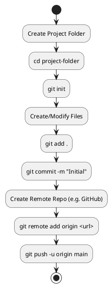

### Understanding Repository State (Status, Diff, Log)

These commands provide insight into the current state of your repository:

*   `git status`: Shows the current state of your Working Directory and Staging Area, indicating which files are untracked, modified but not staged, or staged and ready for commit.
*   `git diff`: Shows changes in the Working Directory that are not yet in the Staging Area (`git diff`). Use `git diff --staged` to show changes in the Staging Area that are not yet committed.
*   `git log`: Displays the commit history of the current branch, typically starting with the newest commit. Various options exist to filter or format the output.
*   `git ls-files`: Lists all the files that `Git` is currently tracking in your repository.

### Local Repository Operations (Working Directory & Staging Area)

These commands manage files and changes within your local setup:

*   `git add <files>/.` : Adds changes from specified files (or all files if using `.`) in the Working Directory to the Staging Area, preparing them for the next commit.
*   `git rm <file>`: Removes a file from `Git` tracking and also deletes it from the Working Directory.
*   `git restore <file>`: Discards any un-staged changes in a specific file, reverting it to the state it was in during the last commit or when it was last staged. **Use with caution as this can lose local work.**
*   `git restore --staged <file>`: Removes a file from the Staging Area, moving its changes back to the Working Directory (it becomes a modified, unstaged file again).
*   `git mv <old-file> <new-file>`: Renames or moves a tracked file within the Working Directory and stages the change in `Git`.
*   `git commit`: Saves the current contents of the Staging Area as a new commit object in the local repository.
*   `git commit -a`: A convenience command that automatically stages all *tracked and modified* files in the Working Directory and then performs a commit. Untracked files are not affected.

### Remote Repository Operations (Interacting with Shared Repos)

These commands facilitate collaboration by interacting with remote repositories:

*   `git push`: Uploads your local commits from your current branch to a connected remote repository.
*   `git pull`: Fetches changes from a specified remote repository and automatically attempts to merge them into your current local branch. This is equivalent to running `git fetch` followed by `git merge`.
*   `git fetch`: Downloads changes and objects (commits, branches, tags) from a remote repository to your local repository but **does not automatically merge** them into your current working branch. You can then inspect the fetched changes before deciding how to integrate them.
*   `git rebase`: An alternative command used to integrate changes from one branch into another (see Advanced).

### Help Commands

Accessing documentation for `Git` commands:

*   `git help <command>`: Displays detailed documentation in your terminal for the specified `Git` command (e.g., `git help commit`).
*   `git <command> --help`: Also displays the documentation for the command.

---

## Common Git Workflows

`Git` supports various workflows for managing development. Here are sequences for typical scenarios.

### Starting a New Project and Sharing It

Follow these steps to initialize a new project locally and make it available on a remote repository:

1.  Create the local project directory on your file system.
2.  Navigate into the directory in your terminal.
3.  Run `git init` to create a new local `Git` repository.
4.  Create and edit your initial project files.
5.  Use `git add .` to stage all created/modified files in the current directory for the first commit.
6.  Execute `git commit -m "Initial commit"` to save the staged changes as the first commit in your local repository.
7.  Create an empty repository on a remote hosting service (e.g., GitHub, GitLab).
8.  Run `git remote add origin <remote-url>` to link your local repository to the new empty remote repository. Replace `<remote-url>` with the URL provided by the hosting service.
9.  Use `git push -u origin main` (or `master`, depending on the default branch name) to upload your local `main` branch and its history to the remote repository. The `-u` flag sets the upstream tracking, so future `git push` and `git pull` commands on this branch can be run without arguments.

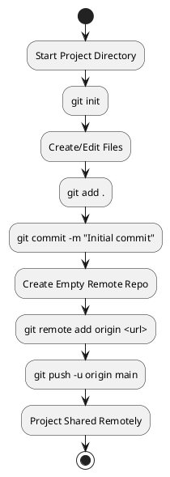

### Contributing to an Existing Project

To join an existing project hosted remotely:

1.  Identify the URL of the existing remote repository.
2.  Run `git clone <repository-url>` to download a full copy of the repository, including all history and branches. This also sets up the `origin` remote connection.
3.  Before starting work, it's good practice to run `git pull` to ensure your local `main` (or `master`) branch is up-to-date with the latest changes from the remote.
4.  Proceed to work on the project files in your Working Directory.
5.  Once ready to save a logical unit of work, use `git add <files>` to stage your changes.
6.  Run `git commit -m "Descriptive message"` to save the staged changes as a new commit in your local repository.
7.  Use `git push` to upload your new local commit(s) to the remote repository, sharing them with collaborators.

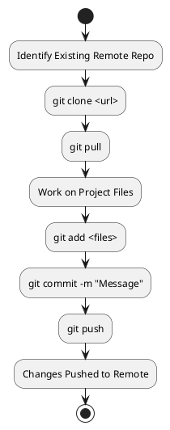

### Recovering Previous Versions

`Git`'s history allows you to retrieve or work with past states:

1.  Use `git log` to view the commit history and find the hash ID of the specific commit you want to examine or revert to.
2.  To inspect the state of the project at that specific commit without creating a new branch, you can use `git checkout <commit-hash>` or the newer command `git switch --detach <commit-hash>`. This puts you in a "**detached HEAD**" state.
3.  If you need to work on, modify, or recover files based on that past state while preserving your current work on a branch, create a new branch pointing at the desired commit: `git checkout -b <new-branch-name> <commit-hash>` or `git switch -c <new-branch-name> <commit-hash>`.

### Git Branching

One of Git's most powerful features is its lightweight and flexible **branching** system. Branching enables non-linear development, allowing multiple lines of work to evolve independently within the same repository. In `Git`, a branch is simply a lightweight, movable **pointer** or label that refers to a specific commit.

*   **Linear Development:** Without branching, all changes happen sequentially on a single line of history. This becomes problematic quickly in collaborative environments.
*   **Branching Development:** Developers can create separate branches for specific features, tasks, or bug fixes. Work proceeds on these isolated branches. When a feature is complete and stable, its changes are integrated back into a main integration branch (like `main`) via merging. This makes it easier to manage independent changes, experiment safely, and discard unwanted work without affecting the main codebase.

### Branching Concepts in Git

*   **Branch Pointer:** A symbolic name (like `main`, `develop`, `feature/add-user-profile`) that points to a specific commit. By convention, it points to the most recent commit made on that line of work.
*   `**main**` / `**master**`: Traditionally, the default or primary branch in a repository, intended to hold the main development line or stable code. (Recent trends favor `main` over `master`).
*   `**HEAD**`: A special pointer in `Git` that indicates the *current commit* you are working on in your Working Directory. `HEAD` usually points to the tip of the currently active branch, meaning that commits you make are added to that branch.
*   **Switching Branches:** When you switch branches, `Git` updates the `HEAD` pointer to the target branch and efficiently changes the files in your Working Directory to match the snapshot referenced by the commit that the target branch points to.

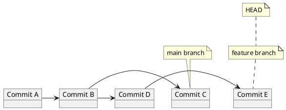

### Branching Commands

Essential commands for managing branches:

*   `git branch`: Lists all local branches in your repository.
*   `git branch <new-name>`: Creates a *new branch pointer* named `<new-name>`, pointing to the same commit that the current `HEAD` points to, but **does not switch** to the new branch.
*   `git checkout -b <new-name>` / `git switch -c <new-name>`: These are convenience commands that combine creating a new branch (`git branch <new-name>`) with switching to that new branch (`git checkout/switch <new-name>`).
*   `git checkout <existing-name>` / `git switch <existing-name>`: Switches your `HEAD` and Working Directory to point to the tip of the specified existing branch.
*   `git branch -d <name>`: Deletes the specified local branch. This is a "safe" deletion, preventing deletion if the branch has unmerged changes. Use `git branch -D <name>` to force deletion, even if changes are unmerged.

### Data Storage in Git (Revisited with Commits)

To understand branching and merging more deeply, recall Git's object types and how they relate in a commit:

*   **Blobs:** Store the actual content of files.
*   **Trees:** Store the directory structure of the project at a specific point in time. A tree object contains pointers to blob objects (for files) and other tree objects (for subdirectories), along with their names and modes.
*   **Commits:** A commit object ties everything together. It contains a pointer to the root tree object representing the project snapshot, pointers to its parent commit(s) (linking it into history), and the commit metadata.

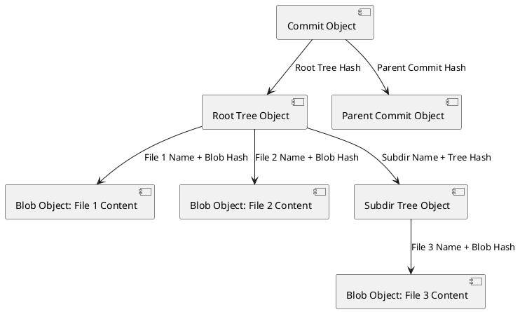
Each commit is a full snapshot, but Git efficiently reuses identical blob and tree objects across commits, minimizing storage space.

### Switching Branches (Internal Steps)

When you execute `git switch <branch-name>` or `git checkout <branch-name>`, Git performs several steps internally:

1.  It identifies the commit that the target branch pointer currently points to.
2.  It updates the `HEAD` pointer to point to this target commit (usually indirectly, by pointing to the target branch name).
3.  It compares the snapshot of the project referenced by the *previous* `HEAD` with the snapshot referenced by the *new* `HEAD`.
4.  `Git` then efficiently updates the files in your Working Directory to match the state of the project in the *new* snapshot. This might involve adding, deleting, or modifying files. `Git` ensures that any uncommitted changes in your Working Directory don't conflict with the switch before proceeding, or it might stash them.

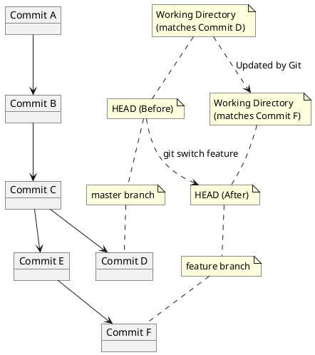

*   You can visualize branch histories using `git log`, `git log <branch-name>`, `git log --all` (show all branches), or `git log --graph` (draw an ASCII graph of commit history).

### Merging Branches

**Merging** is the process of integrating changes from one branch into another branch. `Git` finds a common ancestor commit between the two branches and attempts to combine the changes introduced in each branch since that ancestor.

*   **Fast-forward Merge:** Occurs when the target branch's tip commit is a direct ancestor of the source branch's tip commit. `Git` simply moves the target branch pointer forward to the source branch's tip. The history remains linear.
*   **Three-way Merge:** Occurs when both branches have diverged from their common ancestor (neither branch's tip is a direct ancestor of the other). `Git` combines the changes from both branches into a new snapshot and automatically creates a **merge commit**. This merge commit is special because it has two parent commits (the tips of the two merged branches), resulting in a non-linear history graph.
*   **Conflicts:** If the same part of the same file has been modified differently in the two branches being merged, `Git` cannot automatically combine the changes. It pauses the merge process, marking the conflicting sections in the affected files. Manual **conflict resolution** is required: you must edit the files to combine the changes as desired. After resolving conflicts, you `git add` the resolved files and then run `git commit` (often Git prompts this) to complete the merge by creating the merge commit. The `git mergetool` command can assist with conflict resolution using external tools.

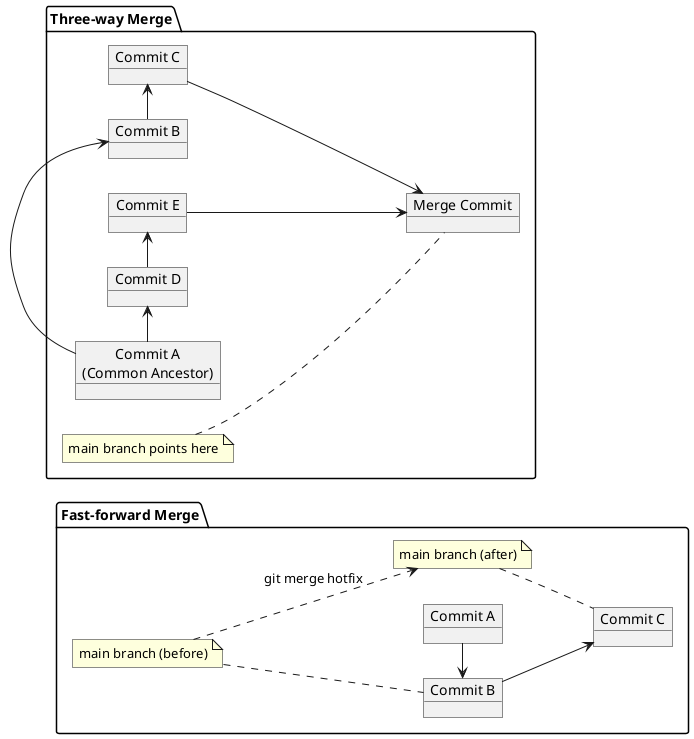

---

## Advanced Git Operations

`Git` provides more powerful tools for manipulating history and integrating changes in different ways.

### Rebasing

**Rebasing** is an alternative method to merging for integrating changes from one branch into another. Instead of finding a common ancestor and creating a merge commit, rebasing *rewrites* the commit history of the branch being rebased so that it appears to be based directly on the tip of the target branch. This is achieved by effectively replaying the commits from the branch being rebased onto the target branch's tip, creating *new* commit objects in the process. The basic command sequence is usually `git checkout <branch-to-rebase>`, then `git rebase <target-branch>`.

*   **Result:** The primary outcome of a successful rebase is a linear commit history, without the presence of merge commits.
*   **Caution:** Because rebasing creates *new* commit objects and rewrites history, you should **never rebase commits that have already been pushed to a shared remote repository** and potentially pulled by others. Doing so can cause significant problems for collaborators. Rebasing is best used on local, private branches that have not yet been shared.

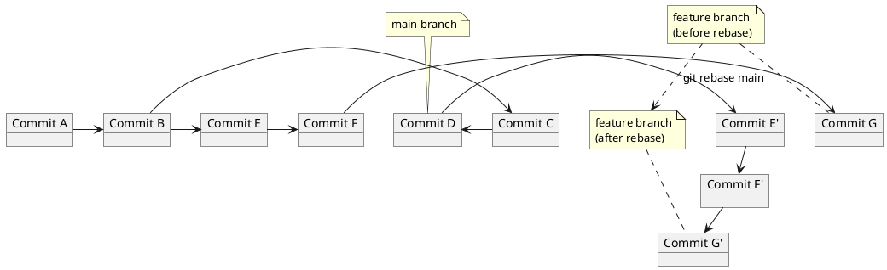

### Interactive Rebasing

`git rebase -i <commit>` (or referencing a point in history like `HEAD~N` for the last N commits) provides a powerful way to rewrite history with much finer control. It opens an editor presenting a list of the commits being rebased and allows you to specify actions for each commit. You can: `pick` (use the commit), `reword` (change message), `squash` (combine with previous), `fixup` (combine and discard message), `drop` (remove the commit), or `reorder` commits. Interactive rebase is particularly useful for cleaning up a messy history on a local branch before merging or pushing (e.g., squashing multiple "**WIP**" commits into a single logical change).

```text
pick 8406cb1 Add initial feature logic
pick f936300 Fix typo in config file
pick a1a2ee0 Update tests for new logic

# Rebase a1a2ee0..HEAD onto master
#
# Commands:
# p, pick <commit> = use commit
# r, reword <commit> = use commit, but edit the commit message
# s, squash <commit> = use commit, but meld into previous commit
# f, fixup <commit> = like "squash", but discard this commit's log message
# x, exec <command> = run command (the rest of the line) using shell
# d, drop <commit> = remove commit
# l, label <label> = label current HEAD with a name
# t, tdrop <label> = remove given label
# m, merge [-c <commit>|-C <commit>] <label> [# <mmlabel>]
# ., --continue = continue rebasing after resolve conflicts
# --abort = abort current rebase operation
```

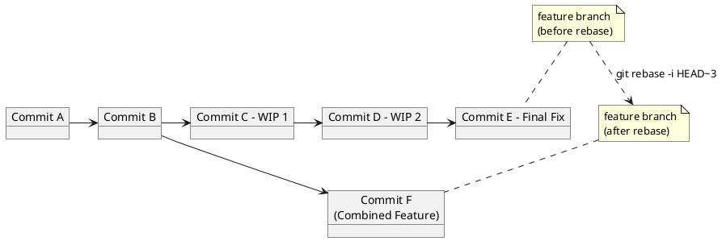

### Cherry-picking

**Cherry-picking** allows you to apply a specific commit (or a series of specific commits) from one branch onto another branch, creating new commits on the target branch. This is done without merging the entire source branch. The command is `git cherry-pick <commit-hash>`. Cherry-picking is useful for selectively porting isolated bug fixes or specific changes from one branch to another without bringing over all other changes on the source branch.

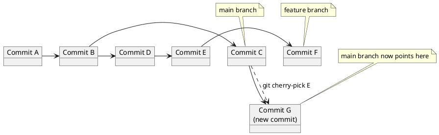

### Rebase vs. Merge (Comparison)

Both `git merge` and `git rebase` are used to integrate changes between branches, but they differ fundamentally in how they handle history and the structure of the commit graph.

| Feature | `git merge` | `git rebase` |
| :--- | :--- | :--- |
| **History** | Preserves the original history of both branches exactly as it happened. | Rewrites the commit history of the branch being rebased (by creating new commits). |
| **Graph** | For three-way merges, creates a new merge commit with two parent commits, resulting in a potentially complex, non-linear history graph. | Creates a clean, linear history by reapplying commits sequentially. Does not create merge commits (unless using specific interactive rebase options). |
| **Process** | Combines the snapshots from the two branch tips and their common ancestor; conflict resolution happens once, when the merge commit is being created. | Reapplies commits from one branch onto another one by one; conflict resolution may be required multiple times, for each commit being replayed. |
| **Safety** | Generally considered safer for integrating changes on shared, public branches because it doesn't rewrite history that others may have already based their work upon. Easy to revert a merge commit if needed. | Dangerous on shared, public branches because it rewrites history. Should primarily be used on local, private branches that have not been pushed. |
| **Readability** | Explicitly shows where merges occurred and parallel work diverged (can make history look "messy" or complex for frequent merges). | Creates a clean, linear history, which can be easier to follow, but might obscure the fact that work was done in parallel branches. |

```plantuml
@startuml
left to right direction
package "Merge History" {
    object A
    object B
    object C
    object D
    object E
    object F
    object M as "Merge Commit"
    A -> B
    B -> C
    C -> D
    B -> E
    E -> F
    D -> M
    F -> M
    note "main" as N_main_m
    N_main_m .. M
    note "feature" as N_feat_m
    N_feat_m .. F
}

package "Rebase History" {
    object A_r as "A"
    object B_r as "B"
    object C_r as "C"
    object E_p as "E'"
    object F_p as "F'"
    A_r -> B_r
    B_r -> C_r
    C_r -> E_p
    E_p -> F_p
    note "main" as N_main_r
    N_main_r .. C_r
    note "feature" as N_feat_r
    N_feat_r .. F_p
}
@enduml
```

---

## Collaborative Development Models

Git's distributed nature and powerful branching/merging features support various workflows for teams collaborating on a project.

### Shared Repository Model

In this common model, there is one central repository hosted on a server (like GitHub, GitLab, Bitbucket). Team members clone this central repository and push or pull directly to and from it. This model typically requires that all team members have direct write permissions to the central repository (though often with branch protection rules in place). Collaboration and code integration often happen via **Pull Requests** (or **Merge Requests**) which are discussed below. This model is generally simpler and works well for smaller, tightly integrated teams with high trust.

### Fork and Pull Model

This model is particularly prevalent in open-source projects. Contributors **fork** the main project repository on the hosting service, which creates their own personal copy of the entire repository. They then clone *their own fork* to their local machine, work on their changes, and push those changes back to their personal fork. To propose their changes for inclusion in the original project repository, they initiate a **Pull Request** (or **Merge Request**) from a branch in their fork to a branch in the original repository. This model allows contributions from external developers without granting them direct write access to the main project repository and provides a formal mechanism for code review before changes are integrated.

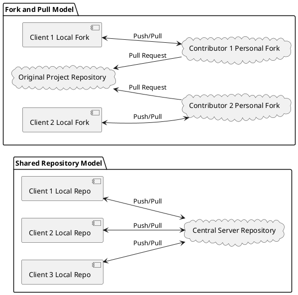

### Pull Requests / Merge Requests

**Pull Requests (PRs)** (GitHub, Bitbucket) or **Merge Requests (MRs)** (GitLab) are features provided by Git hosting services. They are the standard mechanism for collaborative code review and integration in most team workflows. A PR/MR is essentially a formal request to merge one branch into another (e.g., a feature branch into the `main` branch).

The process typically involves:

1.  A developer working on a feature branch locally.
2.  Pushing their local feature branch to the remote repository.
3.  Opening a Pull Request (or Merge Request) on the hosting service's website, specifying the source branch (their feature branch) and the target branch (e.g., `main`).
4.  The hosting service notifies designated reviewers.
5.  Reviewers examine the code changes in the PR/MR interface, add comments, and suggest modifications.
6.  The author makes any necessary updates by adding new commits to their local feature branch and pushing them; the PR/MR is automatically updated.
7.  Automated checks (like CI builds, tests, linting) configured for the project often run against the code in the PR/MR.
8.  Once approved by reviewers and all checks pass, the changes are integrated into the target branch, usually via a merge action performed through the hosting service's interface. The source branch is often deleted afterward.

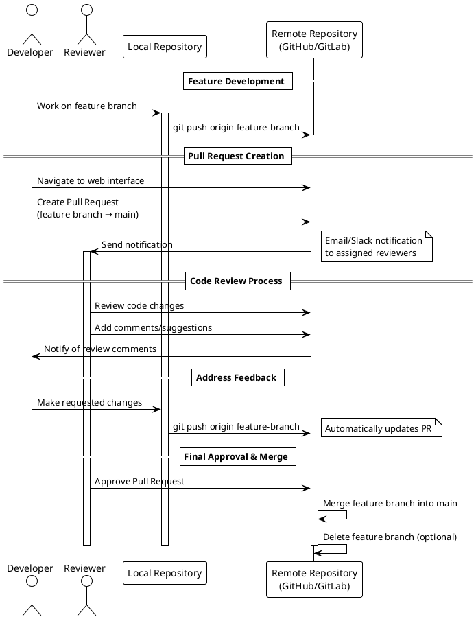

---

## Best Practices and Recovery

Even with powerful tools, understanding how to recover from mistakes and following best practices is crucial.

### When Things Go Wrong

It's common to make mistakes in `Git`. The primary rule is: **Don't Panic!** Git's design heavily favors preserving history; committed work is very rarely lost permanently.

*   **Uncommitted Changes:** Changes in your Working Directory that have not been staged or committed are the most vulnerable. They are not yet part of Git's history and can be lost by commands that forcibly alter the Working Directory state (e.g., `git checkout .`, `git restore .`, `git clean -f`, `git reset --hard`).
*   **Untracked Files:** Files that are present in the Working Directory but are not known to `Git` (never added) are not affected by versioning commands like `checkout` or `reset`. They are only removed by manual deletion or `git clean`.
*   `git reflog`: This is an essential recovery tool. It's a local log of where your `HEAD` and branch pointers have been over time. If you think you've lost a commit or a branch, `git reflog` can show you the hash IDs of recent actions, allowing you to find past states and use commands like `git checkout <hash>` or `git branch <new-name> <hash>` to recover them.

### Conventional Commits

Using **Conventional Commits** is a best practice for creating standardized commit messages. This format makes commit history easier to read, filter, and can enable automation tooling (like automated changelog generation or semantic versioning).

The structure is typically: `type(scope): description`, optionally followed by a blank line and a more detailed body, and then optional footers (e.g., `Fixes #`, `BREAKING CHANGE:`).
Common commit types include: `feat` (new feature), `fix` (bug fix), `docs` (documentation changes), `chore` (routine tasks, no code change), `refactor` (code restructuring), `test` (adding/changing tests). Appending `!` after the type (e.g., `feat!:`) explicitly indicates a breaking change.

```markdown
feat(profile): add user profile viewing page

This commit introduces a new frontend page at /profile/{userId}
for viewing user profile details. It integrates with the new
/api/users/{userId} endpoint.

Fixes #88
```

---

## Project Organization with Git

Structuring how development proceeds within a Git repository is achieved through **branching strategies**. These are structured workflows that define how branches are created, used, and merged to organize feature development, releases, and collaboration.

### Branching Strategies

Examples of common branching strategies include:

*   **Feature Branching:** A simple and very common modern workflow. A dedicated branch is created for each new feature, task, or bug fix. Development happens entirely on this branch, which is then merged back into a main integration branch (like `main` or `develop`) and typically deleted.
*   **GitFlow:** A more complex and opinionated strategy using a strict model with long-running branches (e.g., `main` for production-ready code, `develop` for ongoing development) and supporting branches for features, releases, and hotfixes. It's often used in projects with defined release cycles.
*   **Trunk-Based Development:** Involves small, very frequent commits made directly to the main branch (often called `trunk`). Features are typically developed and integrated rapidly, sometimes hidden behind feature flags until ready for release. This strategy requires high levels of automation (CI/CD) and confidence.

The choice of branching strategy should be tailored to the specific project's size, team structure, desired release frequency, and risk tolerance.

### Team Repository Structure Example

A common structure when using a Feature Branching strategy might look like this:

*   There is a primary, stable branch, often named `main` (or historically `master`). This branch is intended to contain production-ready code and is frequently protected on hosting services, meaning changes can only be integrated via an approved **Pull/Merge Request**, not direct pushes.
*   For each new work item (feature, task, bug), developers create a new **Feature/Task branch** starting from the latest state of the `main` branch.
*   Development and local commits happen on this dedicated feature branch.
*   Periodically, the developer pushes their local feature branch to the remote repository.
*   When the work is complete and ready for review, the developer opens a **Pull Request** (or Merge Request) on the hosting service, proposing to merge their feature branch into the `main` branch.
*   The PR/MR goes through code review and automated checks.
*   Upon approval, the changes are integrated into the `main` branch via the hosting service's interface. The feature branch is then typically deleted to keep the repository clean.
*   Some teams might use an intermediate `develop` branch as the primary integration branch, periodically merging `develop` into `main` for releases.

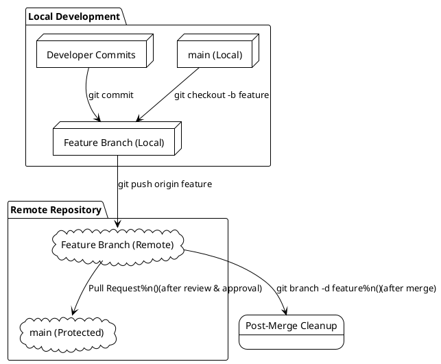

### Choosing a Strategy and Ensuring Consistency

Selecting the right branching strategy is important, but ensuring that the team consistently follows the chosen workflow is even more critical for successful collaboration. This includes agreeing on branch naming conventions, commit frequency and message standards, and the PR/MR review and merge process. It's also vital for developers to regularly integrate changes from the main integration branch (`main` or `develop`) into their long-running feature branches to detect potential conflicts early and minimize integration pain later. Teams should discuss and agree on the appropriate granularity for commits and the level at which branches should be created (e.g., per task, per story, per larger feature).