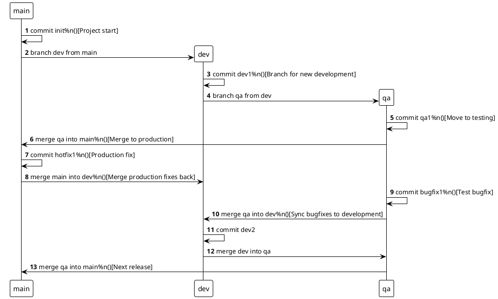
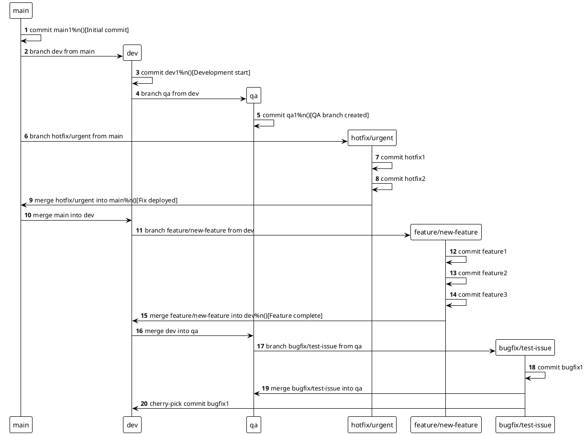

# GitFlow

## What is GitFlow?

*   **Definition:** **GitFlow** is a specific, defined **branching model** and workflow designed to structure and streamline the software development process using Git version control.
*   **Purpose:** It provides a clear set of rules and procedures for managing code versions, ensuring stability (especially for releases), and facilitating efficient collaboration within a development team.
*   **Origin:** Introduced by Vincent Driessen in a widely influential blog post in 2010.
*   **Adoption:** It has become a widely adopted model, particularly in software development environments that follow periodic release cycles, such as those using Agile methodologies.

*   **GitFlow as a Model:** It's important to understand that GitFlow is a **model** or a set of recommended practices, not a rigid, unchangeable specification. While the core concepts (like having separate branches for production and development) are consistent, teams and companies often **adapt** GitFlow to best suit their specific workflow, project needs, and deployment strategies.
*   **Common Variations:** Some common adaptations include:
    *   **Classic GitFlow:** Includes all the branch types described below, including dedicated `release/` branches for preparing releases.
    *   **Simplified GitFlow:** May omit the `release/` branches and handle release preparation directly on `dev` or a temporary branch.
    *   **Trunk-Based Development (TBD):** A different model entirely, often considered an alternative to GitFlow. TBD focuses on keeping the main branch (`trunk`/`main`) as the primary integration branch, with developers merging small, frequent changes directly or via very short-lived branches.

*   **Best Fit:** The most effective version of GitFlow (or deciding if another model like TBD is better) depends entirely on your team's size, project complexity, release frequency, and Continuous Integration/Continuous Deployment (CI/CD) practices.

## Why Use GitFlow?

The GitFlow model provides several significant advantages for development teams:

*   **Stability for Production:** Creates a clear and robust separation between code that is considered stable and ready for production and code that is currently under development or testing. This greatly reduces the risk of accidentally deploying unstable or unfinished code.
*   **Parallel Development:** Enables development teams to work efficiently by developing multiple features or tasks simultaneously on separate, isolated branches (`feature/` branches) without interfering with each other's code until they are ready to integrate.
*   **Structured Testing:** Incorporates dedicated branches (`QA/` or `release/`) for focused testing and integration phases before code is merged into the main production branch, helping to ensure the quality and stability of releases.
*   **Enhanced Collaboration:** Promotes Merge Requests (or Pull Requests on platforms like GitHub) as the primary mechanism for integrating code. This facilitates thorough code reviews and discussions among team members.
*   **Simplified Release Tracking:** Provides a clear history of production releases through the use of version tags on the `main` branch.

## When to Use GitFlow?

GitFlow is particularly well-suited for and provides the most value in specific project environments:

*   **Structured Release Cycles:** It is most valuable for projects that have planned, periodic release cycles (e.g., releasing a new version every few weeks or months), which is common in many traditional software development or Agile processes.
*   **Environments with Distinct Stages:** When you have distinct stages in your process like development, testing, and production, GitFlow's separate branches for `dev`, `QA` (or `release`), and `main` align well.
*   **CI/CD Environments:** Teams working within Continuous Integration / Continuous Deployment (CI/CD) environments will find GitFlow especially beneficial. Automated builds, tests, and deployments can be easily configured to trigger based on merges to specific GitFlow branches (e.g., build on `dev` merge, run extensive tests on `QA` merge, deploy to production on `main` merge).

*   **Alternative Fit:** GitFlow might be overly complex for very small teams, projects with continuous (daily) deployments (where Trunk-Based Development might be a better fit), or projects with no defined release cycle.

---

## Branch Structure

GitFlow defines two main types of branches: **Persistent Branches** that exist throughout the project's life, and **Ephemeral Branches** that are temporary and used for specific tasks.

### Persistent Branches

These branches form the backbone of the GitFlow workflow and remain stable reference points.

1.  **`main` branch (or `master`):**
    *   **Purpose:** Contains the history of the official, stable, and production-ready code.
    *   **Content:** Only contains code that has passed all development, testing, and release preparation phases.
    *   **Commits:** Direct commits to `main` are typically disallowed. Code reaches `main` only via merges from release-ready branches (like `QA` or `release/`).
    *   **Releases:** Each release to production is clearly marked on the `main` branch using a **version tag** (e.g., `v1.0.0`, `v1.0.1`, `v1.1.0`).
    *   **CI/CD Trigger:** Automated pipelines often trigger a production build and deployment when code is merged into `main` and/or a new tag is created.
    *   **Hotfixes:** Production bug fixes (`hotfix/` branches) are branched directly from `main` and merged back into `main`.
2.  **`dev` branch (or `develop`):**
    *   **Purpose:** Serves as the primary branch for integrating ongoing development work for the **next** release.
    *   **Content:** Contains the cumulative history of completed features that are planned for the upcoming release.
    *   **Commits:** Developers never work or commit directly to `dev`. Instead, they create `feature/` branches from `dev`.
    *   **Integration:** Once a `feature/` branch is completed, it is merged back into `dev`.
    *   **Flow to QA/Release:** Periodically, the integrated code on the `dev` branch is transitioned to a dedicated testing environment (like `QA/` or a `release/` branch) for stabilization.
3.  **`QA` branch (or `release/` branches):**
    *   **Purpose:** Provides a stable environment for comprehensive testing (like integration testing, system testing, regression testing) and final stabilization before code is released to production.
    *   **Content:** Contains a candidate version of the code for the next release, branched from `dev`.
    *   **Bug Fixing:** Bug fixes found during testing on this branch (`bugfix/` branches) are branched from *this* branch and merged back into *this* branch.
    *   **Stabilization:** Once testing is complete and all critical bugs are fixed, this branch is considered stable and ready for release.
    *   **Flow to Main:** When stabilized, the content of this branch is transitioned to `main`, and a release tag is created on `main`.

*Diagram showing the main flow of code between the core persistent branches.*

### Ephemeral Branches

These branches are temporary and have a specific, short-lived purpose. They are deleted once their purpose (completing a feature, fixing a bug) is fulfilled and their changes are merged into a persistent branch.

1.  **`feature/` branches:**
    *   **Purpose:** To isolate the development of a single, new feature.
    *   **Creation:** Always branched from the **`dev`** branch.
    *   **Naming Convention:** A common convention is `feature/<issueID>-<short-description>` (e.g., `feature/1234-add-user-login`). The issue ID typically links to a task in a project management tool (like Jira, GitLab Issues, GitHub Issues).
    *   **Workflow:**
        1.  Create the branch from `dev`.
        2.  Develop and unit test the feature on this branch.
        3.  Open a Merge Request (or Pull Request) to propose merging the changes back into `dev`.
        4.  Undergo code review and potentially add more commits based on feedback.
        5.  Merge the branch into `dev` once approved and tested.
        6.  Delete the `feature/` branch after merging.
2.  **`hotfix/` branches:**
    *   **Purpose:** To quickly fix critical bugs found in the **production code** (on `main`).
    *   **Creation:** Always branched directly from the **`main`** branch.
    *   **Naming Convention:** Common is `hotfix/<issueID>-<short-description>` or `hotfix/<version-number>` (e.g., `hotfix/5678-fix-payment-bug`, `hotfix/1.0.1`).
    *   **Workflow:**
        1.  Create the branch from `main`.
        2.  Implement and test the fix on this branch.
        3.  Open a Merge Request (or Pull Request) to propose merging the fix back into `main`.
        4.  Undergo code review.
        5.  Merge the branch into `main`.
        6.  Immediately create a new version tag on `main` for the hotfix release (e.g., `v1.0.1`).
        7.  **Crucially:** The changes from the `hotfix/` branch **must also be merged (or cherry-picked)** into the **`dev`** branch (and potentially the `QA` branch if it exists) to ensure the fix is included in the next regular release and doesn't reappear.
        8.  Delete the `hotfix/` branch after merging.
3.  **`bugfix/` branches:**
    *   **Purpose:** To fix bugs found during the **testing phase** (on `QA` or `release/` branches).
    *   **Creation:** Always branched from the **`QA`** branch (or the specific `release/` branch).
    *   **Naming Convention:** Common is `bugfix/<issueID>-<short-description>` (e.g., `bugfix/9012-fix-report-filter`).
    *   **Workflow:**
        1.  Create the branch from `QA`.
        2.  Implement and test the fix on this branch.
        3.  Open a Merge Request (or Pull Request) to propose merging the fix back into `QA`.
        4.  Undergo code review.
        5.  Merge the branch into `QA`.
        6.  Delete the `bugfix/` branch after merging.
        7.  Consider **cherry-picking** the fix into the **`dev`** branch if needed, to ensure the bug is fixed there as well before the next cycle from `dev` to `QA`.

*Diagram showing how ephemeral branches are created from and merged into the persistent branches.*

*   **Isolation:** GitFlow relies on these temporary branches to isolate individual development efforts. This prevents direct commits to persistent branches (`main`, `dev`, `QA`) and instead requires that every change (new feature, production fix, test bug fix) is done on its own separate, short-lived branch.
*   **Benefits of Isolation:** This approach enables:
    *   Proper code reviews through Merge Requests before integrating changes into shared branches.
    *   Maintains clean and structured code history on the persistent branches.
    *   Ensures only validated and reviewed changes reach the integration or production branches.

## Best Practices for GitFlow Implementation

Successful GitFlow adoption requires adhering to several key practices consistently across the team:

*   **Keep `main` Stable:** The `main` branch should *always* contain only code that is considered stable and ready for production. Only merge code into `main` that has successfully passed all testing and stabilization phases (typically from the `QA` or `release/` branch).
*   **Use Meaningful Merge Requests:** Merge Requests (or Pull Requests) are the gatekeepers for changes entering persistent branches.
    *   Write clear and descriptive titles and descriptions for MRs, explaining the purpose of the changes.
    *   Reference the associated issue ID from your project tracking system in the MR title or description (e.g., "feat: Add user login (#1234)").
    *   Include visual aids (like screenshots or GIFs) in the MR description, especially if the changes affect the user interface.
*   **Implement Unit Tests:** Write unit tests for your code and ensure they pass before merging a `feature/` or `bugfix/` branch into `dev` or `QA`. This ensures basic code quality and correctness at the lowest level.
*   **Keep `dev` in Sync:** Regularly merge (or cherry-pick) changes from `main` (especially hotfixes) and `QA` (bugfixes found during testing) back into the `dev` branch. This ensures that the `dev` branch contains all necessary fixes and doesn't diverge significantly from the other stable lines, preventing bugs from reappearing in future development cycles.
*   **Follow Strict Naming Conventions:** Consistently use the defined naming conventions for your branches (e.g., `feature/`, `hotfix/`, `bugfix/`) and include issue IDs and descriptions. This makes it easy to understand the purpose of each branch and track its related work.
*   **Leverage CI/CD Automation:** Configure your CI/CD pipeline to automatically trigger builds, run tests (unit, integration, regression), and potentially deploy based on merges into specific branches (`dev` for development builds, `QA` for test builds, `main` for production builds).

*   **Maintaining `main` Stability:** By strictly only merging code into `main` from a branch (like `QA`) that has undergone thorough testing, teams can effectively prevent unstable code from reaching the production environment.

## Bad Practices to Avoid with GitFlow

Several common mistakes can undermine the benefits of GitFlow and lead to confusion and instability:

*   **Working Directly on Persistent Branches:**
    *   **Bad:** Making commits directly to `main`, `dev`, or `QA` branches.
    *   **Good:** *Always* create and work on a separate ephemeral branch (`hotfix/`, `feature/`, `bugfix/`) for *any* change, no matter how small. Integrate changes only via Merge Requests.
*   **Not Syncing Branches Regularly:**
    *   **Bad:** Failing to merge `main` into `dev` after a hotfix, or failing to cherry-pick `bugfix/` changes from `QA` into `dev`. This leads to inconsistency where bugs fixed in one branch reappear in others.
    *   **Good:** Regularly pull and merge (or cherry-pick) necessary changes from `main` and `QA` into `dev`.
*   **Not Using Meaningful Branch Names:**
    *   **Bad:** Using generic or personal branch names like `feature/experiment1`, `johns-branch`, `fix-quick`, `my-changes`. These don't convey the branch's purpose.
    *   **Good:** Stick to the agreed-upon naming conventions (e.g., `feature/1234-add-login-form`, `hotfix/5678-fix-payment-bug`).
*   **Forgetting to Delete Merged Branches:**
    *   **Bad:** Leaving old `feature/`, `hotfix/`, or `bugfix/` branches on the remote repository after they have been successfully merged.
    *   **Good:** Always delete ephemeral branches after they are merged and their purpose is fulfilled. This keeps the repository clean and easy to navigate.
*   **Creating Personal Branches in the Shared Repo:**
    *   **Bad:** Using the shared team repository as a place to host personal, experimental, or untracked branches that don't follow team conventions or relate to specific project tasks.
    *   **Good:** Branches in the shared team repository should be related to ongoing project work and follow team conventions. If truly personal experimental work is needed, do it in a local-only branch or use a personal fork of the repository and keep it synced.

## Key Takeaways

*   **Structured Workflow:** GitFlow provides a well-defined structure for software development teams, particularly beneficial for those using Agile methodologies and requiring predictable releases.
*   **Branch Roles:** It establishes clear roles and relationships for different types of branches:
    *   **Persistent Branches (`main`, `dev`, `QA`):** Serve as stable lines of development and provide clear separation between production-ready code, ongoing development, and testing environments.
    *   **Ephemeral Branches (`feature/`, `hotfix/`, `bugfix/`):** Used for isolating individual tasks, enabling parallel work, and facilitating reviews.
*   **Quality Control:** Merge Requests (or Pull Requests) are integral to GitFlow, serving as crucial checkpoints for code review and quality control before changes are integrated into shared branches.
*   **Consistency:** Regular synchronization of fixes and features between branches (especially merging into `dev`) is essential to maintain consistency across the entire codebase and prevent the recurrence of bugs.

By implementing GitFlow (or an adapted version) correctly and adhering to best practices, teams can improve code quality, enhance collaboration, and ensure stable and predictable releases.