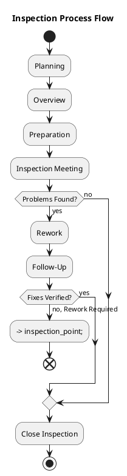
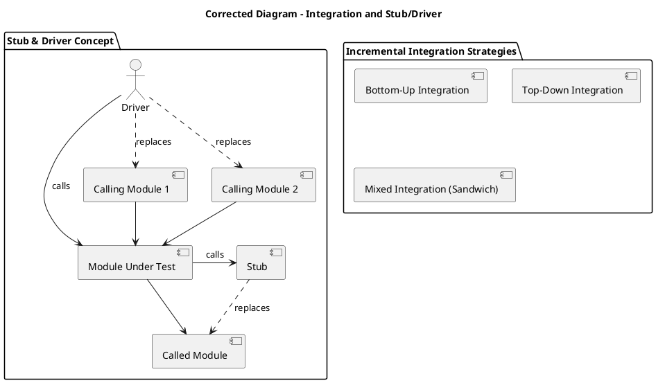

# Verification & Validation (V&V) in Software Development

Verification & Validation (V&V) are crucial processes in software development. They ensure software is built correctly and effectively meets user needs throughout its entire lifecycle: Development, Deployment, Operation, Maintenance, and Retirement.

During the **development** phase (including requirements, design, and implementation), V&V specifically involves inspections and testing, alongside continuous project and configuration management.

---

## V&V Definitions

*   **Validation:** "Is it the right software system?" This focuses on external aspects, ensuring the software meets user needs and expectations (effectiveness, reliability). It inherently involves stakeholders.
*   **Verification:** "Is the software system built right?" This focuses on internal aspects, confirming adherence to specifications and design (efficiency, correctness, internal consistency).

### V&V Scenarios (Car Example)

*   **Scenario 1 (Verification Pass, Validation Fail):** A 6-seat car is needed. If a 4-seat car is built correctly per developer's specifications, verification passes. However, validation fails because it doesn't meet the 6-seat requirement.
*   **Scenario 2 (Both Pass):** A 6-seat car is needed and correctly built, thus meeting the need; both processes pass.
*   **Scenario 3 (Verification Fail, Validation Pass on Requirements, Fail on Product):** A 6-seat car is intended, but a 4-seat car is produced. Here, verification fails because the product doesn't match the internal design. Validation, however, passes on the requirements (the 6-seat need was captured) but ultimately fails on the delivered product itself.

### Requirements & Defect Costs

Poorly defined requirements are a frequent cause of software issues. **Traceability**—the process of tracking requirements through design, code, and tests—is vital as it helps pinpoint failure sources.

Consequently, defect cost escalates dramatically with later discovery. Fixing a defect in the requirements phase is cheapest; post-release is most expensive. This leads to high **rework costs** (40-50% of development budgets, per Boehm), thereby highlighting the significant value of early defect detection.

#### Cost of Quality vs. Cost of Non-Quality

*   **Cost of Quality:** Represents the developer's investment in V&V activities (e.g., testing, inspections).
*   **Cost of Non-Quality:** Encompasses expenses due to defect fixing and failures. The developer typically bears this during the warranty period, while users often bear it post-warranty. Unclear requirements or vendor lock-in can unfortunately incentivize developers to deliver lower quality.

### Technical Debt

**Technical debt** describes effort not spent today (e.g., on quality, design) that incurs future "interest" in the form of increased effort and complications. Examples include poor variable names or code cloning.

### Defect Characterization

A defect is characterized by its **insertion activity (phase)** and its **removal activity (phase)**.

### Basic V&V Goals

1.  Minimize defects inserted.
2.  Maximize defects discovered and removed.
3.  Minimize time between defect insertion and removal.

### V&V Techniques

V&V techniques are categorized as either **static** (examining artifacts without execution) or **dynamic** (executing software).

*   **Static Techniques:** Include inspections and source code analysis.
*   **Dynamic Techniques:** Primarily involve testing.

#### V&V Techniques Per Activity

*   For **Requirements:** Static techniques include document inspection, while both static and dynamic approaches involve prototyping.
*   For **Design:** Static techniques, such as document inspection, are primarily used.
*   For **Implementation (Coding):** Dynamic techniques encompass unit, integration, and application testing; static techniques involve source code inspection.

---

## Inspections

Inspections are a formal, static analysis technique where a group manually reviews documents or code for defects. Notably, no corrections are made during the inspection meeting itself.

**Advantages:**
*   Highly effective at finding many defect types.
*   Applicable to requirements, design, and test cases.
*   No execution environment is needed.
*   Facilitates knowledge transfer and provides a global view.
*   Leverages group dynamics.

**Limits:**
*   Less suitable for non-functional properties (e.g., performance, usability).
*   Can be time-intensive for multiple participants.

### Fagan Inspection Process

#### Prerequisites for Successful Inspections

*   Management commitment.
*   A clear focus on finding defects, not fixing them during the meeting.
*   A minimum quality standard for the document being inspected.
*   No personnel evaluation based on defect count.
*   A constructive group approach.

#### Inspection Techniques vs. Document Type

*   **Ad hoc Reading:** Involves a general review of documents such as Code, Requirements, or Design.
*   **Defect Taxonomy-Based Reading:** Utilizes predefined defect categories for Code, Requirements, or Design documents.
*   **Checklist-Based Reading:** Employs structured questions for reviewing Code, Requirements, or Design.
*   **Code-Specific:** Techniques include mentally "executing" the code, reconstructing its purpose, and defining test cases.
*   **Requirements-Specific:** Techniques are diverse, including Scenario-Based, Defect-Based (e.g., Omission, Incorrect, Inconsistency, Ambiguity, Extraneous information), and Perspective-Based approaches (considering User, Designer, or Tester viewpoints).
*   **Design-Specific:** Techniques involve Traceability Matrix Review and Scenario Execution at the design level.

#### Defect Taxonomies for Requirements

*   **One-Level (Basili et al., 1996):** Omission, Incorrect Fact, Inconsistency, Ambiguity, Extraneous Information.
*   **Two-Level (Porter et al., 1995):** Omission (Missing Functionality/Performance/Environment/Interface), Commission (Ambiguous/Inconsistent/Incorrect/Extra Functionality, Wrong Section).

#### Checklists

Checklists serve to operationalize defect taxonomies.
*   **Requirements Checklists (Ackerman et al., 1989):** Focus on Completeness, Ambiguity, and Consistency.
*   **Code Checklists:** Address Data faults (uninitialized variables), Control faults (logic errors), I/O faults, Interface faults, Storage management faults, and Exception management faults.

#### Rates (Code Inspections)

*   **Overview:** Approximately 500 Lines of Code (LOC) per hour.
*   **Preparation:** Approximately 125 LOC per hour.
*   **Meeting:** Between 90-125 LOC per hour.

---

## Testing

**Testing** is a dynamic V&V technique involving executing software to find defects by observing differences between actual and expected behavior. A test is considered "successful" if it reveals a defect.
*   **Defect Testing:** Aims to find failures, which are symptoms of underlying defects.
*   **Debugging:** Focuses on searching for and removing the underlying faults.

#### Traceability in Testing

Linking requirements, design, code, use cases, test cases, and results helps identify failure sources.

#### Debugging Process

1.  Failure Detection.
2.  Fault Localization.
3.  Fault Repair.
4.  Re-testing.

#### Test Case Definition

A test case specifies input(s), expected output, and context/constraints.
*   **Test Suite:** A collection of related test cases.
*   **Test Log:** Records test execution details (reference, time, actual output, Pass/Fail status).

#### Test Activities and Scenarios

*   Writing or assembling test cases.
*   Running tests.
*   Recording results.

Common scenarios for testing include developer-led informal testing with a dedicated tester team, developer-centric testing, or layered testing involving internal or third-party teams.

#### Oracle

An **oracle** is responsible for determining the expected program behavior for a given test case.
*   **Ideal:** An automatic oracle and comparator.
*   **Common:** A human oracle, which is subject to errors and relies on specifications.
*   **Automatic:** Derived from formal specifications, or by utilizing trusted software/previous versions.

#### Theory and Constraints of Correctness

*   **Correctness:** Implies a program produces the right output for *all* inputs.
*   **Exhaustive Testing:** While required to *prove* absolute correctness, it is generally **impossible** due to combinatorial explosion.
*   Therefore, the primary **Goal of Testing** is not to prove correctness, but rather to **find defects** and achieve "good enough" confidence.
*   **Dijkstra's Thesis:** "Testing can only reveal the presence of errors, never their absence."
*   Consequently, **Test Case Selection** is a critical challenge, with effectiveness evaluated by **reliability** and **validity**.

#### Test Data Selection Theory

*   **D:** The program input domain.
*   **P(d):** The program's output for a given input `d`.
*   **OK(d):** Indicates `P(d)` matches the oracle.
*   **T:** The test set ($T \subseteq D$).
*   **SUCC(T):** Signifies that all tests in $T$ succeed ($\forall t \in T, \text{OK}(t)$).

*   **Validity:** A criterion $C$ is valid if, for an incorrect program, $C$ selects a test set $T$ that is *not successful*.
*   **Reliability:** A criterion $C$ is reliable if, for any two test sets $T_1$, $T_2$ selected by $C$, $SUCC(T_1)$ implies $SUCC(T_2)$ and vice-versa.
*   **Fundamental Theorem:** If $T$ is selected by a reliable and valid $C$, and $SUCC(T)$ is true, then the program is correct for *all* inputs. (This is often unattainable in practice).
*   **Uniformity:** A criterion is uniformly valid/reliable only if it selects the entire input domain, which corresponds to exhaustive testing.
*   **Howden Theorem:** It is impossible to algorithmically generate a finite "ideal test set" (one that is perfectly valid/reliable) for arbitrary programs.
*   **Brainerd-Landweber Theorem:** It is undecidable to determine if two arbitrary programs compute the same function.
*   **Weinberg’s Law:** Developers are considered unsuitable for testing their own code due to emotional unwillingness; therefore, testing should ideally be conducted by a separate QA team or via peer review.
*   **Pareto-Zipf Law (for Defects):** Approximately 80% of defects typically originate from about 20% of modules; thus, testing efforts should concentrate on these high-risk modules.

#### Summary of Testing Perspectives

*   **Correctness:** Strive for reliability and validity to uncover errors.
*   **Psychological:** Testers adopt a "policeman mindset," assuming defects exist.
*   **Risk Management:** Prioritize testing for safety or mission-critical functions.

#### Test Classification

*   **Per Item Under Test (Scope):** Unit, Integration, System, Regression.
*   **Per Approach (Technique/Focus):** Black Box (Functional), White Box (Structural), Reliability, Risk-Based.
*   **Per Formality (Structure):** Exploratory/Informal, Formal.

#### Test Per Item Under Test

*   **Unit Tests:** Focus on individual modules, functions, or classes in isolation.
*   **Integration Tests:** Focus on interactions between multiple modules or components.
*   **System Tests:** Evaluate the entire combined software system, encompassing API and GUI levels.

#### Test Per Formality

*   **Informal/Exploratory Testing:** Undocumented, ad-hoc, and difficult to repeat.
*   **Formal Testing:** Documented, systematic, and repeatable.

#### Test Classification and Coverage (Summary Table)

| Approach                | Unit Testing (Scope)          | Integration Testing (Scope)          | System Testing (Scope)             |
| :---------------------- | :---------------------------- | :----------------------------------- | :--------------------------------- |
| **Requirements-driven** | 100% of unit requirements     | 100% of product requirements         | 100% of system requirements        |
| **Structure-driven**    | 85% of logic paths            | 100% of modules tested together      | 100% of components tested together |
| **Statistics-driven**   | N/A                           | N/A                                  | 90-100% of usage profiles          |
| **Risk-driven**         | As required (high-risk units) | As required (high-risk integrations) | 100% if safety/mission critical    |

#### Coverage

Coverage is a metric used to assess the thoroughness of a test suite, calculated as: `(# entities covered / # total entities)`. An entity can be a test case, requirement, function, statement, decision, etc.

#### Coverage - Unit (Class Level)

*   **Methods/Functions:** Requires at least one test per method.
*   **Black Box:** Employs Equivalence Partitions (one test per partition), Boundary Values (tests at partition edges), and Random Inputs (covering a small percentage of inputs).
*   **White Box (Structural):** Aims for Statement, Decision, and Loop coverage.

#### Coverage - Integration (Interactions Between Classes)

*   **Dependencies:** Requires at least one test per dependency or interaction point.

#### Coverage - System (All Classes in Application)

*   **Functional Requirements:** Needs at least one test per functional requirement or use case.
*   **Non-Functional Requirements:** Requires at least one test per non-functional requirement (e.g., usability, portability, efficiency).

#### Unit Test

A unit test verifies a single, independent unit, such as a function, method, or class.
*   **Black Box (Functional):** These tests are based on specified functionality without internal knowledge, using techniques like Random, Equivalence Classes Partitioning, and Boundary Conditions.
    *   *Example:* For a `squareRoot` function, partitions for positive/negative numbers, boundary at zero, and extreme double values would be considered.
    *   *Combinatorial Equivalence:* For multiple criteria (e.g., converting a string to a number, considering integer form, sign, and length), it's important to cover all combinations. Note that the program's state also influences equivalence classes.
*   **White Box (Structural):** These tests examine the internal structure and logic, aiming for structural coverage (e.g., Statement, Decision, Condition, Path).

#### Unit Test - White Box

*   **Structural Coverage Objectives:**
    *   **Statement Coverage:** Ensures every statement (node in a control flow graph) is executed.
    *   **Decision Coverage (Branch):** Requires exercising both true and false outcomes of every decision (edge coverage).
    *   **Condition Coverage:**
        *   *Simple:* Each individual sub-condition evaluates to both true and false.
        *   *Multiple:* All combinations of true/false outcomes for individual conditions are covered.
    *   *Hierarchy:* Multiple condition coverage implies Simple condition coverage, which implies Decision coverage, which implies Statement coverage. (The reverse is not true).

*   **Path Coverage:** Aims to execute every unique path from start to end.
    *   **Challenge:** Combinatorial explosion typically makes this impractical.
    *   **Approximations:** Include Path-n coverage (testing specific loop iterations) and Loop Coverage (covering scenarios where a loop is not entered, entered once, and entered multiple times).

#### Testing Tools for Typescript

*   **Unit & Integration:** Jest, Mocha/Chai, AVA.
*   **Mocking:** ts-mockito, Sinon.js.
*   **Code Coverage:** Istanbul (nyc), Jest.
*   **GUI Testing:** Cypress, Selenium, Puppeteer, TestCafe.
*   **Profiling:** Node.js Profiler, VS Code Extensions, Chrome DevTools.

#### Integration Test

An integration test verifies interactions and interfaces between dependent units.
*   **Problem:** A common challenge is testing units with unfinished or complex dependencies.
*   **Dependency Defects:** These occur when units work correctly in isolation but fail when integrated (e.g., the Mars Polar Lander metric/imperial error).
*   **Techniques (Stubs & Drivers):**
    *   **Stub:** A substitute for a *called* module; it provides predefined results for dependencies.
    *   **Driver:** Code that "pilots" or calls the unit under test.
    *   **Goal:** Both techniques enable independent unit testing.
*   **Incremental Integration Strategies:** These involve a phased approach, integrating units in small groups to help localize defects more easily.
    *   **Bottom-Up:** Lowest-level modules are tested first, then combined with their callers.
    *   **Top-Down:** Highest-level modules are tested first, using stubs for lower-level dependencies.
    *   **Hybrid:** This common approach mixes both bottom-up and top-down strategies.
*   **Big Bang Integration:** All modules are developed and then assembled and tested at once, which makes defect localization significantly more difficult.
*   **Hardware/Software Integration:** In embedded systems, software units are initially tested with hardware stubs, and subsequently integrated with the actual hardware.

#### System Test

A system test evaluates the complete application as a whole.
*   **Focus:** It prioritizes both Functional properties (ensuring it meets requirements) and Non-Functional properties (such as efficiency, reliability, security, and performance).
*   **Considerations:** Testing involves different platforms (e.g., development vs. target/production environments) and different players (the developer, a dedicated test group, and the end user).

#### Platform and Test Environment

*   **Platform:** Refers to the operating system, DBMS, network, resources, libraries, and other applications.
*   **Target/Operation/Production Platform:** This is the live environment, generally not used for primary testing.
*   **Development Platform:** Where software is developed; typically differs from the target environment, which can lead to environment-specific bugs.

#### System Test and Players

*   **Developer:** Conducts tests on the development platform.
*   **Dedicated Test Group/Team:** Comprises professional system testers.
*   **End User:** Involved in two primary forms of testing:
    *   **Acceptance Testing:** Formal, client-driven tests conducted for custom software.
    *   **Beta Testing:** Informal, real-world usage by selected end users for mass-market products.

#### System Test and Test Types (Properties)

*   **Functional Properties:** These are based on requirements and use cases. Testing is prioritized according to the **usage profile**, with more effort allocated to frequently used functions.
*   **Non-Functional Properties:** These are emergent, system-level properties, including Usability, Reliability, Portability, Maintainability, Efficiency, Configuration, Recovery, Stress, and Security.

#### Reliability Testing

This process estimates software failure probability over time (e.g., Defect Rate, MTBF). It necessitates many independent test cases. Unlike hardware, software defect rates typically peak early in the lifecycle and then decline.

#### Risk-Based Testing/Safety

This approach prioritizes testing based on identified risks (calculated as probability x severity). It specifically focuses on safety or mission-critical functions (e.g., ABS tests for braking failures).

#### User Profiles Based Testing

This is a form of risk-based testing that considers the frequency of feature usage by different user types. More testing effort is allocated to frequently used features (e.g., 90% of effort for 5% of Word's functions).

#### Regression Testing

Regression testing involves repeating existing tests after changes to ensure no new defects are introduced and old ones do not reappear.

#### Test, Documentation, and Automation

*   **Problem:** Tests must be adequately documented and automated for effectiveness.
*   **Formal vs. Informal:** Informal tests are often lost, whereas formal tests are systematic, documented, and can be either operational (executable code) or non-operational (human-readable).
*   **Economics for Automation:** Automation is worthwhile if its cost (`Ea`) is less than the repeated manual effort (`Ew`) over `n` executions (i.e., $Ea / Ew < n - 1$). Generally, automate tests if they are executed more than 2-3 times.

#### Goodness of Test Cases

Effective test cases possess several qualities:
*   They have a reasonable probability of catching an error.
*   They perform interesting or necessary actions.
*   They are neither too simple nor overly complex.
*   They make failures readily obvious.
*   They are Mutually Exclusive and Collectively Exhaustive (MECE).

#### Mutation Testing

Mutation testing evaluates test suite effectiveness by injecting small, single changes (mutants) into the code. If a test fails for a mutant, it "kills" the mutant.
*   **Mutant:** A copy of the original program with one deliberate change.
*   **Killable Mutant:** A mutant that behaves differently from the original and is caught (killed) by a test.
*   **Equivalent Mutant:** A mutant that behaves identically to the original and cannot be killed by any test.
*   **Mutation Score:** Calculated as `(Killed Non-Equivalent Mutants) / (Total Non-Equivalent Mutants)`. The goal is 100%.
*   **Common Mutations:** Include deleting or swapping statements, and replacing operators or variables.
*   **Tools:** Stryker is a prominent tool for TypeScript mutation testing.

#### Code and Test Smells

These are informal indicators of potential problems or design issues (not actual bugs) that increase risk, reduce maintainability, and contribute to technical debt accumulation.

*   **Bad Code Smells (Fowler):** Examples include Duplicated Code, Long Method/Parameter List, Large Class, Divergent Change, Shotgun Surgery, Feature Envy, Data Clumps, Primitive Obsession, Switch Statements, Parallel Inheritance Hierarchies, Lazy Class, Speculative Generality, Temporary Field, Message Chain, Middle-Man, Inappropriate Intimacy, Alternative Classes with Different Interfaces, Incomplete Library Class, Data Class, Refused Bequest, and Excessive Comments.
*   **Test Smells (Van Deursen):** Include Mystery Guest, Test Run War, Lazy Test, Resource Optimism, General Fixture, Eager Test, Assertion Roulette, Sensitive Equality, Test Code Duplication, Indirect Testing, For Testers Only, and Magic Number (in tests).

---

## Static Analysis

Static analysis involves examining software artifacts without actual execution. This category encompasses both manual inspections and automated code analysis.
*   **Key Techniques:**
    *   **Compilation Static Analysis:** Performed by compilers to check for syntax, type, and semantic errors.
    *   **Control Flow Analysis:** Analyzes execution paths to identify issues like unreachable code or infinite loops.
    *   **Data Flow Analysis:** Analyzes variable definitions and uses (e.g., ensuring a variable is defined before use, or detecting double definitions).
    *   **Symbolic Execution:** Executes code with symbolic values, a more complex technique.
    *   **Reverse Documentation:** Reconstructs the current design from existing code.
*   **Specialized Tools:**
    *   **MISRA-C:** Provides guidelines for C language use in embedded systems (tools like QA-C, Testbed).
    *   **General Code Analyzers:** Tools like ESLint, SonarQube, and CodeClimate help identify code smells, duplication, and provide overall quality metrics.

### Testing and Quality

Analyzing defects found during V&V is fundamental not only for assessing product quality but also for continuously improving development processes.

---

## Overall V&V Summary

V&V represents a continuous process dedicated to preventing, finding, and fixing defects. This is achieved through various techniques: testing (dynamic), inspection (manual static), and static analysis (automated). For effective project economics, it is crucial to weigh the Cost of Quality (V&V investment) against the Cost of Non-Quality (expenses incurred from defect fixing and their consequences).

### Testing Classification Table (Summary)

| Test Type | Primary Focus | Who Typically Tests | Platform Used | Common Techniques |
| :--- | :--- | :--- | :--- | :--- |
| **Unit Test** | Functional / Structural | Developer / Dedicated Test Group | Development Platform | Black Box (BB), White Box (WB) |
| **Integration Test** | Functional | Developer / Dedicated Test Group | Development Platform | Incremental (Top-Down/Bottom-Up), Stubs/Drivers |
| **System Test** | Functional + Non-Functional | Developer / Test Group / User | Development, Target Platform | Requirement/Use Case Coverage, Usage Profiles, NF Properties |

### Coverage Table (Summary)

| Object Tested | Coverage Objective | Description |
| :--- | :--- | :--- |
| **Unit (class)** | **Methods/Functions** | Ensures at least one test case per method or function. |
| **Unit (class)** | **Black Box, Equivalence Partitions** | For a given method, defines equivalence partitions for its inputs, ensuring at least one test case per partition. |
| **Unit (class)** | **Black Box, Boundary Values** | For a given method, defines partitions and ensures at least one test case targets the boundaries between these partitions. |
| **Unit (class)** | **Black Box, Random Inputs** | Generates test cases randomly (e.g., covering a small percentage of all possible inputs); this approach requires an oracle. |
| **Unit (class)** | **White Box (Structural)** | For a given method, aims for: Statement coverage (every line executed), Decision coverage (every branch taken true/false), and Loop coverage (loop not entered, entered once, entered multiple times). |
| **Integration (some classes)** | **Dependencies** | Ensures at least one test case for each interaction or dependency between classes or modules. |
| **System (all classes)** | **Functional Requirements** | Ensures at least one test case for each functional requirement, verifying the entire system's adherence to specified features. This may align with testing 'main' class methods at the culmination of integration testing. |
| **System (all classes)** | **Scenarios/Use Cases** | Ensures at least one test case for each user scenario or use case, representing typical user interactions. |
| **System (all classes)** | **Non-Functional Requirements** | Ensures at least one test case per non-functional requirement (e.g., using frameworks like JUnit for efficiency testing). This includes meaningful tests for properties such as usability, portability, security, and performance. |

*   **Coverage (General):** Automated tools like Istanbul or Jest provide visual and numerical reports on statement, branch, and condition coverage.

### Profilers

Profilers are tools utilized during test execution to analyze the time spent in various functions, proving valuable for performance testing and identifying bottlenecks.

### Testing - Certifications

ISTQB offers globally recognized certifications for software testers, available at Foundation, Advanced, and Expert levels.