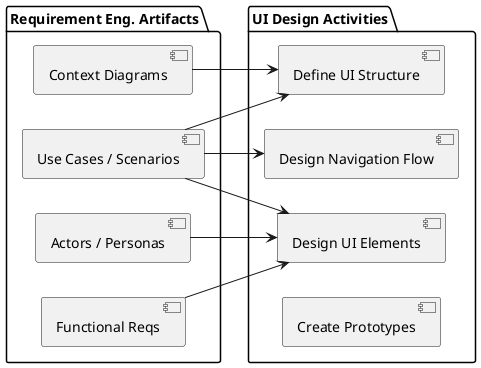
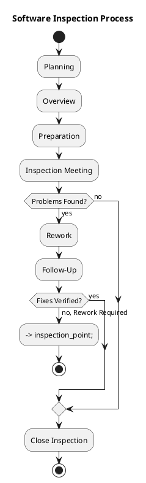
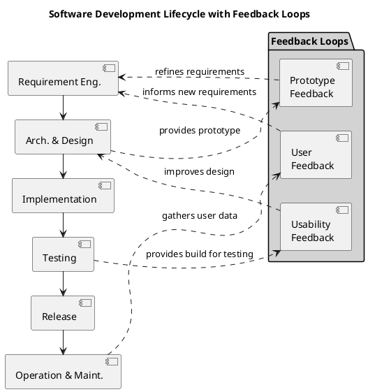
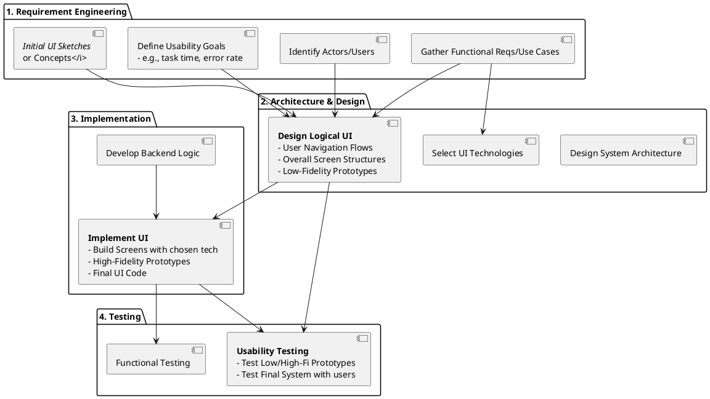
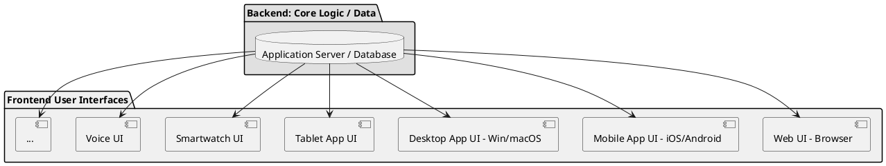
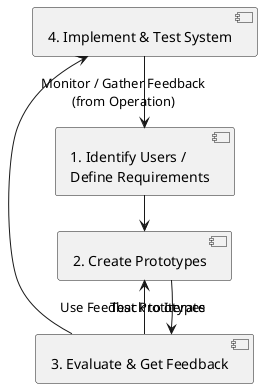

# Understanding Usability: A Key Non-Functional Requirement

User Interface (UI) design is vital for software systems with human users (actors), commonly involving the creation of Graphical User Interfaces (GUIs). Ideally, UI design commences after Requirement Engineering (RE) to define "what" (functional requirements, user roles, use cases) before determining "how." However, in practice, UI design and RE are iterative processes, with early UI sketches often aiding requirements gathering and continuous user feedback refining both.

---

## Example: A Simple Graphical User Interface (GUI) Structure

| Area Type             | Typical Content                                    | Primary Purpose within the UI                                                                  |
| :-------------------- | :------------------------------------------------- | :--------------------------------------------------------------------------------------------- |
| **Navigation/Menu**   | Menu bar (top), Sidebar, Tab controls, Breadcrumbs | Allows users to access different sections, features, or views.                                 |
| **Main Content Area** | Displayed data, Forms, Workspace, Document view    | The primary area where the user interacts with the current task or views relevant information. |
| **Toolbars/Actions**  | Buttons, Quick access icons, Action menus          | Provides access to common actions related to the main content area or current context.         |
| **Status Bar**        | Progress indicators, System messages, Hints        | Provides ongoing feedback to the user about system state, process progress, or context.        |

---

## Human-Computer Interaction: The Interfaces

Interaction fundamentally involves physical and logical layers:

| Interface Type                         | Description                                                                   | Examples                                                                                                                                                                                                                                           |
| :------------------------------------- | :---------------------------------------------------------------------------- | :------------------------------------------------------------------------------------------------------------------------------------------------------------------------------------------------------------------------------------------------- |
| **Physical Interface**                 | Tangible hardware components the user physically interacts with or perceives. | **Input (User to System):** Keyboard, Mouse, Touchscreen, Microphone, Camera   **Output (System to User):** Screen pixels, Printer, Speakers, Haptics                                                                                          |
| **Logical Interface** (often Software) | Abstract way information and controls are presented, implemented in software. | **Graphical User Interface (GUI):** Visual elements (WIMP paradigm).   **Command-Line Interface (CLI):** Text-based.   **Voice User Interface (VUI):** Spoken commands.   **Gesture-Based UI:** Physical movements tracked by sensors. |

---

## Key Principles for Effective UI Design

Effective UI design hinges upon two key principles: first, **testing with real users** to validate usability and iteratively refine designs based on direct feedback; and second, **starting with foundational RE outputs** (Context Diagrams, Actors/Personas, Functional Requirements, Use Cases) to thoroughly understand the system's purpose, users, and required behaviors.

---

## The Process: UI Design in the Software Lifecycle

UI design is integrated throughout the software lifecycle, characterized by continuous user feedback loops.

---

## UI Design within the Development Process

UI design activities are embedded within each major phase of the software development lifecycle:

---

## Considering Different Software Types

The type of software significantly influences UI design priorities and characteristics:

| Software Type                       | Key UI Design Focus / Characteristics                                                                                                                                                                         | Typical Examples                                                                                                                                                       |
| :---------------------------------- | :------------------------------------------------------------------------------------------------------------------------------------------------------------------------------------------------------------ | :--------------------------------------------------------------------------------------------------------------------------------------------------------------------- |
| **Embedded Software**               | Heavy hardware integration, severe constraints (screen size, input methods, processing power), real-time feedback, focus on a very specific task or small set of tasks. Usability is crucial but constrained. | UI for a thermostat, Car dashboard display, Controls on a washing machine, User interface on a medical device.                                                         |
| **Mass Market / Consumer Software** | Extreme focus on ease of learning, intuitiveness (often minimal training), aesthetics, broad audience appeal, engagement, simple workflows for common tasks.                                                  | User interfaces for social media apps, Mobile games, Consumer photo/video editors, Productivity tools (basic features).                                                |
| **Enterprise Software**             | Emphasis on efficiency for skilled users, handling complex data and workflows, consistency across modules, user productivity, role-based access and permissions reflected in the UI. Training is expected.    | User interfaces for Customer Relationship Management (CRM) systems, Enterprise Resource Planning (ERP) systems, Internal dashboards, Business-to-business (B2B) tools. |

---

## Means of Interaction: Input and Output Channels

Effective UI design considers all the ways users provide input to, and systems provide output from, a software application.

### Input Channels: How the User Communicates with the System

| Input Channel        | Examples / Methods                                                                                                  |
| :------------------- | :------------------------------------------------------------------------------------------------------------------ |
| **Touch**            | Direct interaction using fingers (e.g., touchscreens) or specialized tools like styluses.                           |
| **Keyboard/Mouse**   | Traditional desktop input using physical keyboards and pointing devices (e.g., mice, trackpads).                    |
| **Voice**            | Spoken commands or dictation processed by speech recognition software.                                              |
| **Eyes**             | Eye-tracking technology used for cursor control or detecting where a user is looking.                               |
| **Position/Gesture** | Interpreting physical movements and gestures using motion sensors (in phones, game controllers) or camera tracking. |

### Output Channels: How the System Communicates with the User

| Output Channel      | Examples / Methods                                                                                                                                            |
| :------------------ | :------------------------------------------------------------------------------------------------------------------------------------------------------------ |
| **Sight (Visual)**  | Displaying information on screens (various sizes and resolutions), printed reports, or interfaces in Augmented Reality (AR) or Virtual Reality (VR) displays. |
| **Hearing (Audio)** | System sounds (e.g., beeps, alerts), music playback, or spoken information delivered via text-to-speech (TTS).                                                |
| **Touch (Haptics)** | Providing tactile feedback through vibrations (e.g., smartphones, game controllers) or specialized force feedback devices.                                    |

---

## One Application, Many UIs: Adapting to Context

A single application often requires multiple UIs, each tailored to specific device or platform contexts (e.g., screen size, input method). These contexts include web, mobile, desktop, smartwatch, or voice. The main challenge lies in maintaining functional and branding consistency while simultaneously optimizing for each unique context.

---

## The Principle of Simplicity in UI Design

UI design should be "as simple as possible, but no simpler," thereby balancing necessary functions with intuitive operation. The ultimate goal is to minimize cognitive load by actively avoiding clutter, unnecessary steps, jargon, and inconsistency, thereby guiding users to achieve their goals effortlessly.

---

## Example: Designing UIs for a Robotic Vacuum Cleaner (RVC)

The RVC example effectively illustrates UI complexity based on the range of features offered.

### Basic UI Options (Illustrating Simplicity Trade-offs)

| Option                  | Description                                                                                                                    | Pros                                                                                                      | Cons                                                                                |
| :---------------------- | :----------------------------------------------------------------------------------------------------------------------------- | :-------------------------------------------------------------------------------------------------------- | :---------------------------------------------------------------------------------- |
| **1: Minimalist UI**    | One or two physical buttons on the device (e.g., On/Start, Off).                                                               | Extremely simple to understand and use for basic function.                                                | Very limited functionality, no feedback on status or errors beyond basic lights.    |
| **2: Basic Feedback**   | A few physical buttons plus a small status display (e.g., simple LCD screen showing codes).                                    | Still relatively simple, provides slightly more status information.                                       | Limited control options, status codes can be cryptic and require manual lookup.     |
| **3: More Control**     | Multiple dedicated physical buttons for key functions (e.g., Power, Start, Dock, Spot Clean, maybe simple navigation buttons). | Provides direct access to common functions.                                                               | Button layout can become complex for many features, still limited display/feedback. |
| **4: Rich Interaction** | Control primarily via a smartphone mobile app (connected via Wi-Fi).                                                           | Offers access to a vast range of features, high flexibility, detailed feedback, and future expandability. | Requires a smartphone and setup, potentially a more complex UI in the app itself.   |

### Advanced RVC UI Example (via Smartphone App)

Advanced RVCs commonly utilize smartphone apps, which offer features such as map management, scheduling, cleaning control (modes, spot cleaning), status monitoring (battery, logs, alerts), and settings (Wi-Fi, language, updates). Effective UI organization within these apps typically employs tabs, menus, or visual hierarchy to manage this inherent complexity.

---

## Understanding Users: Personas

**Personas** are detailed, fictional profiles. They represent significant user archetypes based on thorough research, aiming to deeply understand target users' shared characteristics, goals, and behaviors.

### Example RVC Personas

| Persona Archetype              | Description                                                     | Key Goal                                                            | Tech Savviness    | Key Context / Constraint                                       |
| :----------------------------- | :-------------------------------------------------------------- | :------------------------------------------------------------------ | :---------------- | :------------------------------------------------------------- |
| **"Busy Professional Parent"** | Middle-aged, often higher-income, managing family and work.     | Keep floors consistently clean with minimal effort or intervention. | Moderate to High. | Limited free time; needs automation and reliability.           |
| **"Tech-Savvy Student"**       | Young adult, potentially lower income, living in smaller space. | Basic cleaning, interested in smart features and integration.       | High.             | Budget-conscious; might value app control over simple buttons. |
| **"Elderly Homeowner"**        | Older adult, possibly retired, may have mobility issues.        | Simple, reliable operation for basic home cleanliness.              | Low to Moderate.  | May require large text, clear buttons, simple interface flow.  |
| **"Pet Owner"**                | Owns dogs, cats, or other shedding pets.                        | Frequent, effective cleaning, good at handling pet hair.            | Varies.           | Needs powerful suction and efficient dustbin management.       |

---

## Contextualizing Use: Life Scenarios

**Life Scenarios** describe a persona's interaction within a typical context (including environment, routine, and situation). They are crucial for revealing context-specific requirements and usability considerations.

*   **Example Scenarios for "Busy Professional Parent" (Sarah):**
    *   **Work Day:** The RVC runs autonomously on schedule; Sarah checks the app for any issues during her lunch break.
    *   **Weekend Morning:** Sarah uses the spot cleaning function via the app for the kitchen after breakfast without disturbing others.
    *   **Evening:** Sarah sets a quiet mode or a temporary no-go zone through the app to prevent the RVC from causing disturbance.

---

## Illustrating Interaction: Stories

**Stories** are narratives that illustrate a persona's step-by-step interaction with a product within a specific scenario to achieve a particular goal. **Present-Based (As-Is) Stories** highlight current pain points (e.g., Sarah manually vacuums, frustrated by pet hair). Conversely, **Future-Based (To-Be) Stories** describe desired interactions with the new UI (e.g., Sarah uses the EZClean app to schedule specific room cleaning and confirms completion via notifications).

---

## Example: EZGas Application (Hypothetical Gas Station Finder)

#### Personas and Needs (EZGas)

| Persona Archetype   | Description                                            | Primary Need / Goal                                                                     | Key UI Requirement Implication                                                                                                  |
| :------------------ | :----------------------------------------------------- | :-------------------------------------------------------------------------------------- | :------------------------------------------------------------------------------------------------------------------------------ |
| **Commuter Carlos** | Drives daily in heavy traffic, values efficiency.      | Find the *absolute nearest* station with *easy access* (avoiding traffic).              | Clear map view prominence, filtering by distance, integration with real-time traffic data (showing impact on route).            |
| **Doctor Diana**    | Works long, often late shifts, concerned about safety. | Find a *safe, well-lit* station late at night.                                          | Safety ratings/indicators on map/list, filtering by opening hours, filtering/sorting by safety features (lighting, attendance). |
| **Student Sam**     | Limited budget, concerned about cost.                  | Find the *absolute cheapest* gas nearby.                                                | Prominent price display (per gallon/liter), price sorting/filtering, highlighting cheapest options.                             |
| **Eco-Warrior Eva** | Prioritizes environmental impact.                      | Find stations offering *biofuels* or with *environmental initiatives* (e.g., charging). | Filtering by specific fuel types (E85, Biodiesel), indicators for charging stations or eco-certifications.                      |
| **EV Owner Eric**   | Drives an electric vehicle.                            | Find compatible *charging stations* with real-time availability.                        | Filtering by connector type (CCS, J1772), real-time availability status, charging speed info.                                   |

---

## Design Approaches: Guiding Philosophies

Various guiding philosophies inform UI design:
*   **Ergonomics/Human Factors:** Aims to optimize human-system interaction for user well-being and performance (encompassing safety, comfort, and mental load).
*   **Emotional Design (Don Norman):** Posits that design impacts users at Visceral (aesthetics), Behavioral (usability and efficiency), and Reflective (satisfaction and perceived value) levels.
*   **User Experience (UX) Design:** A broad discipline that encompasses all aspects of user interaction, including usability, accessibility, performance, aesthetics, emotional response, value, brand perception, and overall satisfaction. UI is a core component of UX.
*   **Transparent Technology / User-Centered Design (UCD):** Focuses on making technology effortless by deeply prioritizing user needs, goals, and context.

---

## Prototyping: Making Designs Tangible

**Prototypes** are partial or preliminary models that make UI designs tangible. They are instrumental for visualizing ideas, exploring options, gathering feedback, and facilitating communication. Importantly, they vary significantly in **fidelity** (their level of detail and realism).

### Fidelity

| Fidelity         | Description                                                                                                         | Examples                                                                                         | Common Tools Used                                                                                | Primary Purpose in Design Process                                                                                                |
| :--------------- | :------------------------------------------------------------------------------------------------------------------ | :----------------------------------------------------------------------------------------------- | :----------------------------------------------------------------------------------------------- | :------------------------------------------------------------------------------------------------------------------------------- |
| **Low (Lo-Fi)**  | Simple, quick, inexpensive representation of concepts and basic structure. Minimal detail, non-functional.          | Paper sketches, Whiteboard drawings, Digital wireframes (basic boxes and labels).                | Pen & paper, Whiteboard, Balsamiq, Figma (basic wireframing), Sketch (basic wireframing).        | Explore many ideas quickly, define basic structure and flow, get early feedback on concepts, cheap to discard or change.         |
| **High (Hi-Fi)** | Detailed, realistic representation that looks and feels close to the final product. May be interactive (clickable). | Clickable mockups, Interactive digital demos, Fully coded functional prototypes (for key parts). | Figma, Sketch, Adobe XD, Axure, InVision (for prototyping), sometimes actual code (HTML/CSS/JS). | Test visual design, detailed interactions, conduct usability testing, gain stakeholder re-buy-in, validate specific UI elements. |

---

## Gathering Feedback: Testing Prototypes and Systems

User UI testing is a continuous process, employing various methods:

| Feedback Method | Description | Typical Stage(s) Applied | Primary Goal |
| :--- | :--- | :--- | :--- |
| **Heuristic Evaluation** | Usability experts review UI against established principles. | Early/Mid-Design (Lo-Fi, Hi-Fi). | Quickly identify common usability problems based on expert knowledge. |
| **Cognitive Walkthrough** | Experts simulate a user's thought process step-by-step for specific tasks. | Early/Mid-Design (Lo-Fi, Hi-Fi). | Assess ease of learning for new users; identify conceptual hurdles. |
| **Usability Testing** | Representative end-users perform realistic tasks while being observed (often with Think-Aloud protocol). | Mid-Design (Hi-Fi Prototypes), Late Development (Final System), Post-Release. | Measure efficiency, effectiveness, user satisfaction; find usability problems. |
| **Ethnography** | Involves observing and interacting with users in their natural environment or workplace. | Early Requirement Engineering, Design. | Gain deep insights into real-world workflows and implicit needs. |
| **Interviews** | One-on-one conversations with stakeholders or users. | All stages. | Gather in-depth qualitative data (e.g., needs, opinions, motivations). |
| **Focus Groups** | A moderated discussion involving a small group of users. | Early Concept, Mid-Design. | Gather a range of opinions, brainstorm ideas, and understand group dynamics. |
| **Analytics** | Collecting and analyzing data on live system user interaction (e.g., clicks, navigation, feature usage). | Post-Release. | Understand actual user behavior patterns at scale; identify bottlenecks. |
| **A/B Testing** | Presenting two UI versions to different live user groups, then measuring performance (e.g., conversion, click-through rates).| Post-Release. | Optimize specific UI elements based on quantitative data. |
| **Surveys / Feedback Forms**| Questionnaires used to directly ask users for opinions, satisfaction levels, or to report problems. | Mid-Design (Hi-Fi Prototype), Post-Release. | Gather subjective ratings, demographic data, and general suggestions or bug reports from a large user base. |

---

## Designing the GUI: Practical Implementation Choices

The selection of GUI implementation technology significantly impacts development, performance, and the resulting product capabilities.

### Technical Implementation Choices

| Approach | Description | Pros | Cons | Typical Technologies/Examples |
| :--- | :--- | :--- | :--- | :--- |
| **Platform-Specific (Native)**| Requires a separate codebase for each operating system. | Offers best performance, a native look and feel, and full access to OS APIs. | Incurs the highest development cost and time, requiring multiple dedicated teams. | Swift/Objective-C (iOS), Kotlin/Java (Android), C#/WPF/UWP (Windows), C++/Qt. |
| **Cross-Platform Frameworks** | Allows developers to write a codebase once (e.g., in JavaScript, Dart, C#), which is then compiled or transpiled for multiple OSs. | Enables faster initial development, significant code reuse, and wider reach. | May involve potential performance overhead, limited native API access, and an imperfect native look and feel. | React Native, Flutter, Xamarin, .NET MAUI. |
| **Web Technologies** | Involves HTML, CSS, and JavaScript, displayed within a browser. Can also be wrapped in native containers. | Runs anywhere with a browser, features a single codebase for web, easier distribution, and a vast community. | Requires an internet connection (unless designed for offline use), may not feel perfectly "native," and performance depends on the browser. | HTML/CSS/JS, Frameworks (React, Angular, Vue, Svelte), Web Components. Electron (for desktop applications). |

### Key Usability Guidelines for GUI Design

Regardless of the chosen technology, usable GUIs consistently adhere to the following principles:
*   **Consistency:** Maintain uniform layouts, terminology, styles, and interaction patterns.
*   **Efficiency:** Minimize task time and effort; provide shortcuts for frequent actions.
*   **Feedback:** Offer immediate and clear responses to user actions, using visual cues, progress indicators, and messages.
*   **Affordance:** Design UI elements to visually suggest their intended use.
*   **Sensible Defaults:** Pre-select common or recommended options to streamline user interaction.
*   **Clear Messaging:** Use plain language for all labels, instructions, and error messages.
*   **Navigation:** Establish clear and intuitive structures through menus, tabs, and breadcrumbs.
*   **Simplicity:** Avoid clutter; utilize whitespace effectively; include only essential information and controls.

---

## Summary: The Essence of User-Centered UI Design

The UI is paramount for software success, especially in mass markets, as it directly dictates a user's ability to achieve their goals effectively. Consequently, effective UI design adheres to an iterative **User-Centered Design (UCD) process**.

The **golden rule** in this process is to continuously validate designs and gather feedback from real users throughout the entire lifecycle. This iterative approach ensures that the software is not just built correctly, but is truly the *right* and usable system for its intended audience.