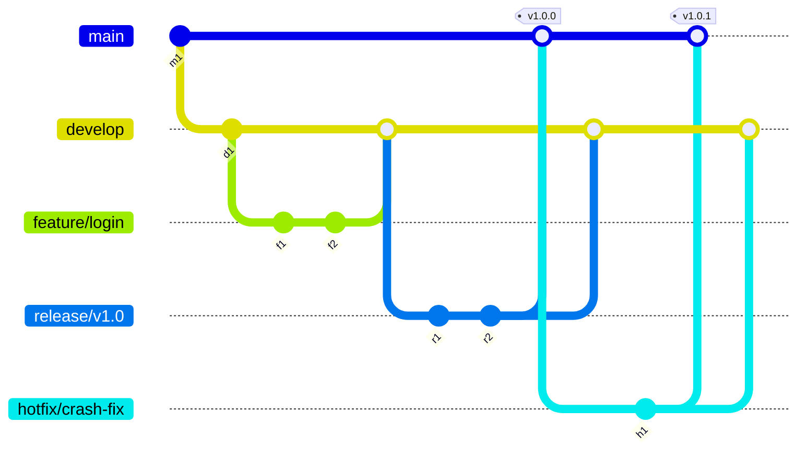

# Collaborating with Git

Effective teamwork fundamentally requires structured workflows for version control. This document provides an overview of the **GitFlow** branching model, explores **GitLab's integrated collaboration tools** (specifically Issues and Merge Requests), and details the importance of **Code Reviews**.

---

## GitFlow: A Structured Branching Model for Collaboration

**GitFlow** is a widely adopted branching model, introduced by Vincent Driessen in 2010. It is specifically designed to manage Git branches for enhanced code stability and improved collaboration, particularly in projects that adhere to defined release cycles.

<p align="center">



</p>

#### Core Concepts and Variations

GitFlow utilizes **long-lived branches**—namely `main` for production code and `develop` for ongoing development—alongside **temporary branches**. These temporary branches serve specific purposes: `feature/*` for new features, `release/*` for release preparation, `hotfix/*` for urgent production fixes, and `bugfix/*` for testing fixes. Teams commonly adapt this model to suit their individual project needs.

<p align="center">

| Variation             | Key Branch Differences                                                                      |
| :-------------------- | :------------------------------------------------------------------------------------------ |
| **Classic GitFlow**   | Employs dedicated `release/*` branches for stabilizing a release candidate.                      |
| **Simplified GitFlow**| Often omits `release/*` branches; stabilization may occur directly on `develop` or a temporary branch. |
| **Trunk-Based Development (TBD)** | Eliminates the `develop` branch entirely; features are merged rapidly into `main` (often with the aid of feature flags). |

</p>

Ultimately, the choice of a branching model depends on factors such as team size, release frequency, testing processes, and existing CI/CD practices.

#### Benefits of GitFlow

GitFlow offers several distinct advantages:
1.  **Code Stability:** It effectively separates stable production code (`main`) from active development (`develop`, `feature/*`), thereby significantly reducing deployment risk.
2.  **Parallel Development:** Multiple developers can work concurrently on isolated `feature/*` branches without mutual interference.
3.  **Structured Process:** The model provides a clearly defined workflow for handling features, releases, and urgent fixes.
4.  **Enhanced Collaboration:** It seamlessly integrates with Merge Requests, facilitating comprehensive code review.
5.  **Release Traceability:** Version tags applied to `main` create a clear and traceable history of deployments.

#### When is GitFlow Most Useful?

GitFlow proves particularly effective for projects characterized by:
1.  **Scheduled or Periodic Releases.**
2.  **Team-Based Development.**
3.  **CI/CD Pipelines.**
4.  **Version Maintenance** (specifically, supporting older production versions).

---

## GitFlow in Practice: A Real-Life Example Workflow

This example incorporates a dedicated `QA` branch for formal testing and stabilization, illustrating a more complex practical application of GitFlow.

#### Implementation Goals

The primary goals of this workflow are to:
*   Deliver stable, production-ready software.
*   Ensure high software quality through rigorous QA processes.
*   Support parallel feature development and efficient release stabilization.
*   Maintain strict isolation among production, development, and testing codebases.

#### Branch Structure: Persistent Branches

These branches are long-lived and form the backbone of the repository.

*   **`main` Branch:**
    *   This branch exclusively contains production-ready code.
    *   Code is merged into `main` only from `QA` (for releases) or `hotfix/*` (for urgent bugs).
    *   It is a protected branch, meaning direct commits are prohibited.
    *   Each release is tagged with version numbers (e.g., `v1.2.0`).
    *   Merges to `main` trigger the production CI/CD pipeline.
*   **`dev` Branch:**
    *   Serving as the primary integration point, this branch holds ongoing development for the *next* release.
    *   It consolidates completed `feature/*` branches.
    *   Developers must never commit directly to `dev`; instead, they branch `feature/*` from `dev`.
    *   Features are merged *into* `dev` via Merge Requests.
    *   Periodically, the `dev` branch's state is transitioned to `QA` for testing.
    *   Crucially, `dev` must be kept synchronized with `main` by merging back `hotfix` and `main` bug fixes.
    *   This branch is not considered stable enough for direct production deployment.
*   **`QA` Branch:**
    *   This branch is specifically dedicated to rigorous QA testing (including integration, system, and regression tests) of a release candidate.
    *   Code is merged *into* `QA` from `dev`.
    *   Bugs discovered in `QA` are fixed on `bugfix/*` branches, which are then merged *back into* `QA`.
    *   Once stabilized, the `QA` branch is merged *into* `main` for release.
    *   Bug fixes implemented on `QA` are also synced (cherry-picked) back into `dev` to ensure they are included in future development.

#### Branch Structure: Ephemeral (Temporary) Branches

These branches are designed to be short-lived, created for specific tasks, and subsequently deleted after successful integration into a persistent branch.

1.  **`feature/*` Branches:**
    *   These branches are used to isolate the development of single new features or enhancements.
    *   They are created *from* the **`dev`** branch.
    *   A typical naming convention is `feature/#<IssueID>-<short-description>`.
    *   The workflow involves: creating from `dev` -> developing the feature -> opening a Merge Request to `dev` -> undergoing review -> merging into `dev` -> and finally, **deleting** the feature branch.

    <p align="center">

    ```mermaid
    %%{ init: { 'gitGraph': {'mainBranchName': 'develop' } } }%%
    gitGraph
        commit id:"d1"
        branch feature/new-feature
        checkout feature/new-feature
        commit id:"f1"
        commit id:"f2"
        commit id:"f3"
        checkout develop
        commit id:"d2"
        merge feature/new-feature id:"m1"
        commit id:"d3"
        %% The feature branch is deleted after merge m1
    ```

    </p>

2.  **`hotfix/*` Branches:**
    *   These branches are dedicated to urgently fixing critical bugs identified in **production code** (`main`).
    *   They are created *from* the **`main`** branch (specifically, from the affected version tag).
    *   A common naming convention is `hotfix/#<BugID>-<short-description>`.
    *   The workflow entails: creating from `main` -> implementing the fix -> opening a Merge Request to `main` -> undergoing review -> merging into `main` -> tagging a new version (`v1.0.1`) -> **crucially, merging the fix into `dev`** (and `QA` if active) -> and finally, **deleting** the hotfix branch.

    <p align="center">

    ```mermaid
    %%{ init: { 'gitGraph': {'mainBranchName': 'main' } } }%%
    gitGraph
        commit id:"m1" tag:"v1.0.0"
        branch develop
        checkout develop
        commit id:"d1"
        checkout main
        branch hotfix/prod-bug
        checkout hotfix/prod-bug
        commit id:"h1"
        commit id:"h2"
        checkout main
        merge hotfix/prod-bug id:"m2" tag:"v1.0.1"
        checkout develop
        merge main id:"d2" %% Sync main into develop
        %% checkout QA; merge main %%; %% Sync main into QA if applicable
        %% The hotfix branch is deleted after merge m2 and sync d2
    ```
    
    </p>

3.  **`bugfix/*` Branches:**
    *   These branches are used to fix non-critical bugs discovered during **testing on `QA`**.
    *   They are created *from* the **`QA`** branch.
    *   A typical naming convention is `bugfix/#<BugID>-<short-description>`.
    *   The workflow involves: creating from `QA` -> implementing the fix -> opening a Merge Request to `QA` -> undergoing review -> merging into `QA` -> and finally, **deleting** the bugfix branch. Additionally, consider cherry-picking these fixes to `dev` to ensure they are included in future development.    <p align="center">

    ```mermaid
    %%{ init: { 'gitGraph': {'mainBranchName': 'QA' } } }%%
    gitGraph
        commit id:"q1"
        branch bugfix/qa-bug
        checkout bugfix/qa-bug
        commit id:"b1"
        commit id:"b2"
        checkout QA
        commit id:"q2"
        merge bugfix/qa-bug id:"m1"
        %% The bugfix branch is deleted after merge m1
        %% Cherry-pick commits b1, b2 onto develop if needed
    ```

    </p>
These ephemeral branches effectively isolate work, facilitate structured code reviews, maintain a clean commit history, and ensure that only thoroughly validated changes reach integration or production environments.

#### Best Practices for Using GitFlow

To maximize the benefits of GitFlow, adhere to these best practices:
1.  **Keep `main` Stable:** Only merge fully tested and approved code into `main` (either from `QA` or an approved `hotfix` branch).
2.  **Use Meaningful Merge Requests (MRs):** Ensure MRs have clear titles and descriptions, reference relevant issue IDs, and include visual aids like screenshots if helpful.
3.  **Test Thoroughly Before Merging:** Conduct unit tests before opening an MR to `dev` or `QA`; perform integration and regression tests on `QA` or `release` branches before merging to `main`.
4.  **Keep Persistent Branches Synchronized:** Regularly merge changes from `main` (after releases or hotfixes) into `dev`, and from `dev` into `QA`. If necessary, cherry-pick `bugfix` changes from `QA` to `dev`.
5.  **Follow Strict Naming Conventions:** Utilize consistent naming for branches, such as `feature/`, `hotfix/`, and `bugfix/`, typically including issue IDs and concise descriptions.
6.  **Maintain a Clean Repository:** Promptly delete ephemeral branches once they have been successfully merged.
7.  **Automate CI/CD:** Configure continuous integration and continuous delivery pipelines to automatically trigger builds, tests, and deployments based on branch merges.

#### Practices to Avoid with GitFlow

To prevent common pitfalls when using GitFlow, avoid these practices:
1.  **Working Directly on Persistent Branches:** Always create and use ephemeral branches for any code changes or new development.
2.  **Allowing Persistent Branches to Become Unsynced:** Ensure regular synchronization of changes from `main` (hotfixes) into `dev` and `QA`, and from `QA` (bugfixes) into `dev`.
3.  **Using Ambiguous or Non-Standard Branch Names:** Stick strictly to established naming conventions.
4.  **Leaving Merged Branches Undeleted:** Always delete ephemeral branches promptly after they have been merged.
5.  **Pushing Personal or Work-In-Progress (WIP) Branches to the Shared Remote Without Convention:** Only push project-related, conventionally named branches to the shared remote; reserve local branches or personal forks for experimental work.

---

## GitLab Issues: Tracking Work

**GitLab Issues** serve as a central system for tracking discrete units of work, including tasks, features, bugs, and questions. They provide a platform to define, discuss, assign responsibility for, and monitor the progress of these items. Crucially, Issues enhance context and traceability by enabling linking to relevant commits and Merge Requests.

#### Using Issues in Course Projects

GitLab Issues are particularly useful in course projects for two distinct purposes:
*   **Your Team's Internal Repository:** Use it for internal team workflow, including planning tasks, breaking down complex features, tracking bugs, assigning work, and discussing implementation details.
*   **General Course Repository:** Use it for communication with instructors or TAs, such as reporting specification issues, bugs in the base code, or clarifying questions.

#### Creating and Configuring Issues

To create and configure issues effectively:
1.  Navigate to your Project and select **Plan** -> **Issues**.
2.  Click the **"New Issue"** button.
3.  Provide a clear and concise **Title** (e.g., "Implement user login form," "Bug: Report filter not working").
4.  Write a detailed **Description** using Markdown, outlining steps to reproduce a bug, requirements for a feature, or specific task steps.
5.  **Optional but Recommended Fields:** Populate fields such as Assignees, Labels (e.g., `bug`, `feature`, `priority:high`), Due Date, Milestone, and Weight for better organization and tracking.

#### Linking Issues with Development Workflow

GitLab seamlessly integrates Issues with the Git development workflow:
*   **Create Branch/MR from Issue:** GitLab provides convenient buttons to create branches directly linked to specific issues.
*   **Automatic Linking:** Including the Issue ID in commit messages or the Merge Request title/description automatically links the Issue to the relevant commits and MRs.
*   **Automatic Closing:** Using keywords like `Closes #123` in the Merge Request description will automatically close the linked issue upon successful merge.

---

## Merge Requests (MRs): Proposing and Reviewing Changes

A **Merge Request (MR)** in GitLab is a formal proposal to incorporate changes from a **source branch** into a **target branch**. MRs are fundamental to **collaboration and code review** processes before any integration occurs.

#### Key Features of Merge Requests

Merge Requests offer a rich set of features:
*   **Propose & Integrate Changes:** They are the primary mechanism for submitting and incorporating code modifications.
*   **Diff Viewing:** Provide a line-by-line visual comparison of the proposed changes.
*   **Collaboration:** Facilitate discussion through inline comments, general comments, and threaded discussions.
*   **Workflow Tracking:** Maintain clear status indicators (e.g., Draft, Open, Merged), allowing teams to monitor progress.
*   **Issue Integration:** Link directly to issues, providing context and enabling automatic closure.
*   **CI/CD Integration:** Display the status of associated CI/CD pipelines, indicating test and build outcomes.

#### Creating a Merge Request

You should initiate an MR once your work on a source branch is complete and ready to be merged into a target branch.

**Essential Components for an MR:**
1.  **Source Branch:** The branch containing your changes (e.g., `feature/#123-user-login`).
2.  **Target Branch:** The branch where changes will be merged (e.g., `dev`, `main`).
3.  **Title:** A concise summary of the changes (e.g., "feat: Add user login form").
4.  **Description:** Explain WHAT was changed and WHY, reference relevant Issues (`Closes #123`), provide any necessary testing notes, and include visual aids like screenshots or GIFs.
5.  **Reviewers:** Designate the individuals who need to review the code.
6.  **Labels:** Apply relevant labels for categorization and project organization.

#### Configuration Options for MRs

Merge Requests offer several configuration options for enhanced control and organization:
*   **Assignee:** Designate the primary person responsible for the MR.
*   **Reviewers:** Specify required or requested code reviewers.
*   **Milestone/Labels:** Use these for effective project organization.
*   **Merge Options:**
    *   **Delete source branch when merge request is accepted:** This is highly recommended for ephemeral branches to keep the repository clean.
    *   **Squash commits when merge request is accepted:** This option combines multiple commits from the source branch into a single, clean commit on the target branch.
*   **Mark as Draft:** Indicates that the MR is not yet ready for formal review.

#### Reviewing Code Changes and Providing Feedback

GitLab provides robust tools for reviewing code and giving feedback:
*   **"Changes" Tab:** This tab displays a line-by-line diff, highlighting all modifications.
*   **Inline Comments:** Add comments directly on specific lines of code, which automatically create resolvable discussion threads.
*   **Structured Reviews:** Submit multiple "pending" comments together as a single, consolidated review. This review can include an overall summary and a clear status (e.g., Comment, Approve, Request changes).
*   **General Comments:** Use this section for overall feedback on the approach or for comments not directly tied to specific lines of code.

#### The Merging Process

Once a Merge Request has received the necessary approvals and its CI pipelines have passed, the merging process follows these steps:
1.  **Initiate Merge:** Click the "Merge" button, typically located on the MR page.
2.  **Execute Merge:** GitLab performs the merge operation based on the configured merge options.
3.  **Post-Merge Actions:** Any configured post-merge actions, such as source branch deletion, are executed.
4.  **Status Update:** The MR's status automatically changes to "Merged."
5.  **Issue Closure:** Any linked issues with auto-closing keywords in the MR description are closed.
6.  **Repository Update:** The target branch in the remote repository is updated with the merged changes.
7.  **(Optional) CI/CD Trigger:** Pipelines may automatically run on the updated target branch.

---

## Code Reviews: Ensuring Quality and Collaboration

A **code review** is a systematic process where peer developers meticulously examine source code *before* its integration into a shared codebase, typically through Merge Requests. This practice is critical for maintaining high software quality and fostering effective team collaboration.

#### Purpose and Goals of Code Review

Code reviews serve multiple essential purposes:
1.  **Bug Detection:** Identify errors that the original author might have overlooked.
2.  **Quality Improvement:** Suggest enhancements for code readability, maintainability, performance, and architectural soundness.
3.  **Standard Adherence:** Ensure that the code conforms to established coding standards and best practices.
4.  **Knowledge Sharing:** Disseminate understanding of the codebase across the team, thereby reducing the "bus factor."
5.  **Mentoring & Collaboration:** Provide valuable learning opportunities for less experienced developers and foster a sense of shared ownership within the team.

#### Establishing Code Review Rules and Guidelines

To ensure effective code reviews, it's crucial to establish clear rules and guidelines:
*   **Coding Standards:** Define comprehensive style guides and naming conventions, and leverage automated linters or formatters.
*   **Review Scope:** Clearly specify what reviewers should check for, including correctness, edge cases, security vulnerabilities, performance implications, test coverage, and overall code clarity.
*   **Checklists:** Provide reviewers with structured checklists to ensure thoroughness.
*   **Process:** Define clear expectations for review turnaround time, minimum required approvals, and conflict resolution mechanisms.

#### Roles and Responsibilities in Code Review

Maintaining high code quality is a shared responsibility, with specific roles defined:
*   **Author:** The author is responsible for writing clear and understandable code, thoroughly explaining changes in the Merge Request, responding constructively to feedback, making necessary revisions, and signaling the status of their changes.
*   **Reviewer:** The reviewer must examine the code carefully, provide timely, specific, constructive, and actionable feedback (focusing on the code itself, not the person), and responsibly approve or request further changes.
*   **Shared Responsibility:** Ultimately, maintaining high code quality is a collective team effort, requiring diligent participation from both authors and reviewers.

#### Communication Etiquette for Code Reviews

Effective communication is key to productive code reviews:

**For Authors:**
*   Be open to feedback, understanding that its purpose is code improvement.
*   Explain design choices clearly within the Merge Request.
*   Address all comments comprehensively, either by implementing changes or providing a clear explanation for not doing so.
*   Be timely in your responses and revisions.
*   Show gratitude for the reviewers' time and effort.

**For Reviewers:**
*   Focus feedback on the code itself, not the person who wrote it.
*   Be constructive and specific; whenever possible, suggest solutions rather than just pointing out problems.
*   Ask questions to understand rather than issuing commands.
*   Prioritize feedback, distinguishing between critical issues and minor "nits."
*   Provide timely reviews.
*   Approve responsibly, only when genuinely confident in the quality and correctness of the code.

#### Using GitLab's Review Tools

GitLab offers integrated tools to streamline the review process:
*   **Inline Comments:** Add contextual comments directly on specific lines of code within the "Changes" tab; these comments automatically form discussion threads.
*   **Structured Reviews:** Submit multiple "pending" comments collectively as a consolidated review. This feature allows for an overall summary and a clear status (e.g., Comment, Approve, Request changes) to be submitted simultaneously.

These tools centralize all discussions and feedback, thereby significantly enhancing transparency and efficiency throughout the code review process.