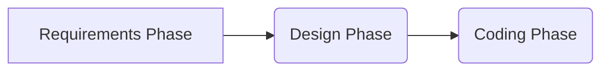
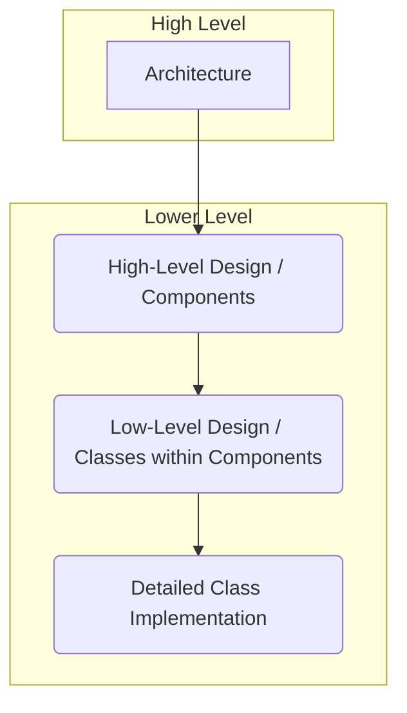
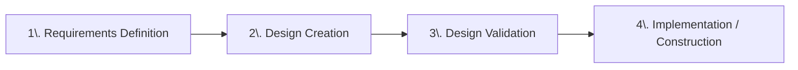
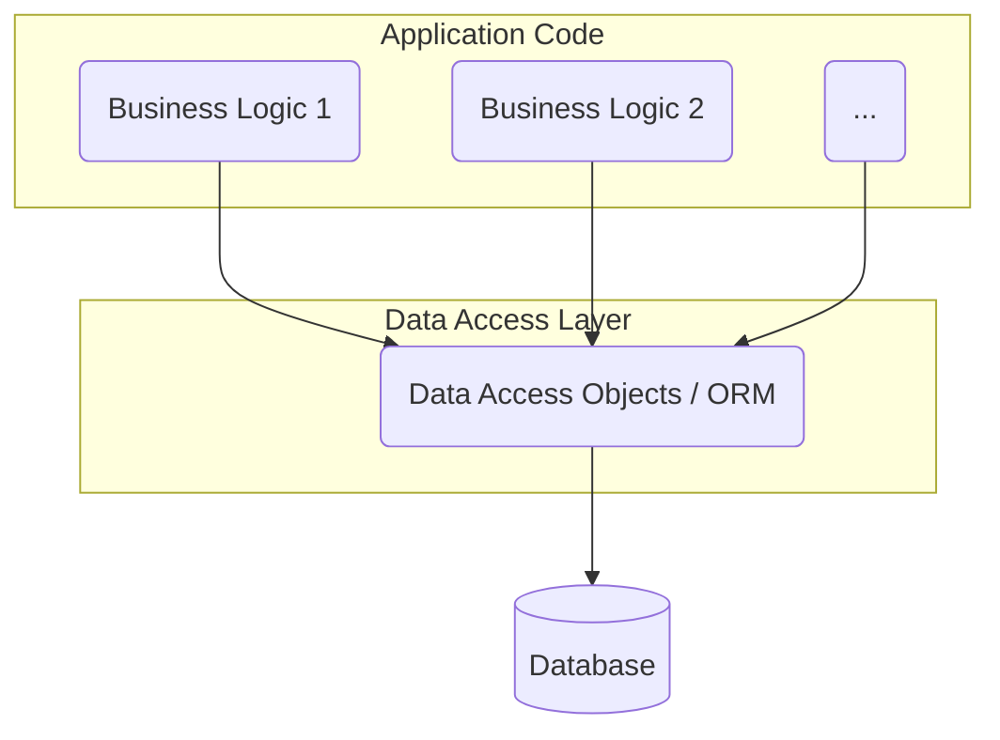
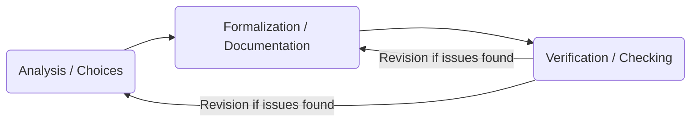
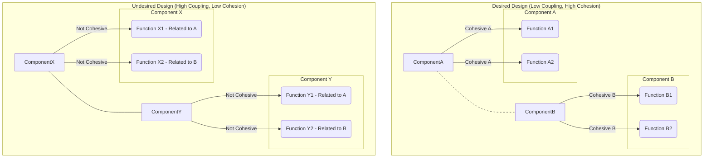

# Introduction to Architecture and Design

Software development progresses through distinct phases: Requirements, Design, and Coding.



1.  **Requirements Phase:** Defines **what** the software system should achieve (functional and non-functional characteristics), without detailing internal implementation.
2.  **Design Phase (Architecture and Design):** This phase follows requirements, determining **how** the system will be constructed and thereby creating its blueprint. This involves identifying components (classes) and working at various levels of detail. Specifically, **Architecture** refers to high-level design (major components, communication mechanisms, interconnections), while **Design** pertains to lower-level aspects (internal component structure, class details, attributes, methods).



This structured approach aligns with the **separation of concerns** principle, which aids in managing complexity. Here, Requirements define the problem from a black box view, while Design crafts the solution from an internal perspective. The **Coding Phase** logically follows; ideally, it should be straightforward if the design is complete. Conversely, difficulty encountered during coding often indicates an incomplete or flawed prior design.

This material will therefore cover the design **process**, its **steps**, relevant **properties**, suitable **notations**, and common **patterns**.

---

## Design Examples from Other Engineering Disciplines

"Design" in traditional engineering fields (e.g., Mechanical, Civil) illustrates its principles in concrete terms. For instance, truck design illustrates components at multiple levels of detail using blueprints. Similarly, house design employs floor plans to depict rooms and their spatial relationships. Both disciplines demonstrate a clear process:



In mature engineering fields, beginning implementation without a thoroughly validated design is universally considered high-risk and unprofessional.

### The Importance of Design: Validation

The Design phase is essential for the **early evaluation and validation of design choices**. It is crucial to evaluate fundamental decisions made during design at an early stage, as correcting flaws discovered post-implementation proves significantly more costly and difficult.

**Example (Civil Engineering):** Forgetting a connecting door in a house, only discovered after walls are up, requires costly rework.
**Example (Software - Database Access):**

*   With **No Upfront Design (Direct SQL)**, embedding SQL queries directly throughout the codebase leads to high costs and frequent errors when future database changes are required (e.g., migrating database technology).
*   Conversely, **Designed Access (Data Access Objects / ORM)** centralizes database interaction through a dedicated data access layer (DAO/ORM). This approach means changes to the database only necessitate modifying this specific layer, thereby simplifying maintenance, reducing errors, and significantly improving flexibility.



This data access strategy represents a high-level design choice, critically impacting long-term maintainability.

### From Requirements to Design: Creativity and Options

The transition from requirements ("what") to design ("how") is fundamentally a **creative process**, given that multiple distinct designs can fulfill the same set of requirements. In this context, experience is highly valuable, and **patterns** (both architectural and design) serve to formalize this accumulated experience by providing proven solutions to recurring problems.

**Example (Automotive):** Mid-sized cars share basic requirements but have hundreds of distinct designs. Fundamental choices (e.g., front-wheel drive) are common, while details vary greatly.

The challenge then becomes choosing the *best* design. This selection process inherently involves evaluating each candidate design's **non-functional properties**, since different designs will support or optimize these attributes in varying ways (e.g., prioritizing performance over maintainability, or vice-versa).

---

## System vs. Software-Only Processes

Software development processes vary significantly depending on the product's scope:

1.  A **System Process** is used for complex embedded systems that integrate software, hardware, mechanics, and electronics. It begins with **System Requirements**, which drive **System Design** (involving decomposition into Hardware, Software, Mechanical, and other specialized designs), followed by **System Integration** to form the **Final Embedded System**. Our particular focus here is on **Software Design** within this multi-disciplinary context.

    ```mermaid
    graph TD
        A[System Requirements] --> B(System Design);
        subgraph System Breakdown
            B --> C1(Hardware Design);
            B --> C2(Software Design);
            B --> C3(Mechanical Design);
            B --> C4(...Other Designs);
        end
        C1 & C2 & C3 & C4 --> D(System Integration);
        D --> E[Final Embedded System];
    ```

2.  Conversely, a **Software-Only Process** is applied to standalone software products that do not require custom hardware. Here, **Software Requirements** directly inform **Software Design**, which in turn guides **Coding** to build the final **Software Product**.

    ```mermaid
    graph LR
        A[Software Requirements] --> B(Software Design);
        B --> C(Coding);
        C --> D[Software Product];
    ```

Even in software-only projects, hardware configuration decisions and the distribution of components (e.g., across clients, servers, or cloud environments) are fundamental design choices, often visualized using Deployment Diagrams.

**Example (Software-Only - Hypothetical "EZGas" App):**

*   For instance, a **Standalone** application would be a single monolithic application running on one PC.
*   A **Client-Server** approach, conversely, supports multiple concurrent users, with a central server handling logic and data, and client browsers providing the user interface for interaction.

**Example (System - Heating Control System):** When allocating control logic between hardware and software, consider:

*   Under **Option 1 (One Processor per Room)**, the system would be more expensive and complex due to coordination overhead. However, it would offer greater flexibility and faster responses through local processing, providing more dedicated processing power per room.
*   By contrast, **Option 2 (One Processor for Whole House)** would be cheaper and simpler. Yet, it would be less flexible and offer slower responses due to a central bottleneck, ultimately providing less total processing power.

Evaluating these contrasting properties is crucial for choosing the most appropriate design based on overall project priorities.

---

## Defining Software Design

**Software design** involves defining software modules (such as components, functions, and classes) along with their interactions (via interfaces and protocols). Furthermore, it aims to satisfy both functional and non-functional requirements (e.g., performance, reliability, maintainability, scalability). Finally, it addresses crucial design-specific properties for code quality, such as coupling (interdependence) and cohesion (internal unity).

### Activities Within the Design Phase

The Design phase is inherently iterative and cyclical, encompassing the following activities:



1.  **Analysis:** This involves creative problem-solving, exploring various options, and making fundamental structural choices (at both architectural and detailed design levels).
2.  **Formalization:** This step involves documenting design choices using textual descriptions and diagrams (e.g., UML) to create a comprehensive design specification.
3.  **Verification:** Here, the formalized design is rigorously checked against established requirements and good design principles (e.g., low coupling, high cohesion). This ensures correctness and consistency. Any issues discovered during this process necessitate revisions.

The **Input** to this phase is the Requirements Document, detailing functional and non-functional specifications. The **Output** is the Design Document (a formalized design using text and diagrams), which must explicitly satisfy all input requirements.

---

## Deeper Look at Design Activities

Software design fundamentally distinguishes between high-level **Architecture** and lower-level **Design**.

### Architecture (High-Level Design):

This focuses on defining **major components** and their **communication model** (e.g., message passing, procedure calls). It also involves selecting appropriate **architectural patterns** (e.g., Client-Server, Layered).

### Design (Lower-Level Design):

This delves into the internal structure of components.

*   **Component/Package Level:** At this level, classes within components are defined, along with their internal and external interactions.
*   **Class Level:** This involves detailing individual classes, including their **attributes** (data elements, types, visibility), **methods** (operations, return types, parameters, visibility), and **responsibilities**. Furthermore, complex methods often require careful **algorithm selection**.

---

## Properties for Evaluating Design (Verification)

Design verification rigorously checks for the following:

*   **Consistency with Requirements:** The design must effectively implement all functional requirements and demonstrate its ability to achieve non-functional requirements (e.g., performance, security, reliability).
*   **Internal Correctness:** The design must be free from internal flaws and consistently adhere to established good design principles.

### Key Verification Techniques:

1.  **Traceability Matrix:** This technique links functional requirements directly to design elements, which helps identify any unimplemented requirements or unnecessary design components.
2.  **Scenario Walkthroughs (using Sequence Diagrams):** This involves simulating the dynamic behavior for specific use cases, thereby checking object interactions and assigned responsibilities.
3.  **Design Inspections/Reviews:** This is a formal peer examination of design documentation conducted to identify defects, inconsistencies, and ensure adherence to design principles.
4.  **Non-Functional Requirement Checks (Estimation/Modeling):** This assesses the likelihood of meeting Non-Functional Properties (NFPs), such as identifying performance bottlenecks through execution time estimates or evaluating reliability and maintainability through modeling.

### Design-Specific Non-Functional Properties:

*   **Scalability:** The ability to handle increasing workloads or data volumes while maintaining performance (e.g., scaling from 10 sensors to 1 million).
*   **Interoperability:** The capacity to work seamlessly with other distinct systems.
*   **Testability:** The ease with which the system or its components can be tested (in terms of observability and controllability).
*   **Deployability:** The simplicity and ease of installation and configuration.
*   **Mobility:** The ability to accommodate factors specific to mobile devices (e.g., battery life, network connectivity, screen size).

### Fundamental Structural Properties (Crucial for Code Quality):

*   **Complexity:** The number and intricacy of components and their interactions. The primary aim is to minimize complexity.
*   **Coupling:** The degree of interdependence between components. The goal is to achieve **low coupling**.
*   **Cohesion:** The functional relatedness of elements within a component. The goal is to achieve **high cohesion**.

**Overall Design Goals:** Fundamentally, design aims to reduce system complexity, minimize coupling, and maximize cohesion.



### Non-Technical Influences on Design:

*   **Cost:** Budgetary limitations.
*   **Schedule:** Deadlines, which can influence architectural styles (e.g., favoring approaches that enable parallel development).
*   **Staff Skills:** The expertise and capabilities of the development team.

**Trade-offs are Inherent:** Design inherently involves balancing conflicting goals (e.g., optimizing performance often conflicts with ease of maintainability). Therefore, priorities for these trade-offs should be clearly established with stakeholders during the requirements phase.

---

## Notations for Representing Design

Various notations are employed to formally express software design:

1.  **Boxes and Lines:** These are simple, informal diagrams suitable for brainstorming; however, they inherently lack precision.
2.  **UML (Unified Modeling Language) Diagrams:** These represent formal, standardized graphical notations.
    *   **Package Diagram:** This diagram shows high-level components ("packages") and their dependencies, proving useful for analyzing architecture, complexity, and coupling.
    *   **Class Diagram:** This illustrates the static structure within and across packages, detailing classes, attributes, methods, and their relationships (such as inheritance and association). It is used for lower-level design.
    *   **Detailed Class Description:** This supplements class diagrams with granular textual or tabular specifications for methods, including responsibilities, pre/post-conditions, and constraints.

Design documentation is typically hierarchical, progressing from Package to Class to Detailed Class. The creation of this documentation is an iterative process.

### Representing Dynamic Behavior:

*   **Sequence Diagram:** This diagram illustrates object interactions (message calls) within a specific scenario, showing the step-by-step control and data flow. It is valuable for verifying design against use cases and effectively explaining features.
*   **State Chart (State Machine Diagram):** This models the various states of an object or component and the transitions between them.

---

## Introduction to Design Patterns

**Design Patterns** (distinct from architectural patterns) address localized problems, typically involving 2-4 classes, by providing proven, reusable solutions. They enhance code flexibility, maintainability, extensibility, and understandability.

### Categories of Design Patterns:

1.  **Creational Patterns:** Focus on object creation mechanisms, abstracting or controlling the instantiation process.
2.  **Structural Patterns:** Deal with class or object composition and their organization into larger structures.
3.  **Behavioral Patterns:** Address algorithms and the assignment of responsibilities among objects, as well as their communication and interaction.

---

## Architectural Patterns Examples

These patterns provide high-level blueprints for organizing a system:

1.  **Repository Pattern:** The **Repository Pattern** is suited for systems where multiple tools operate on a **shared, central data store** (the Repository). In this pattern, tools interact *only* via the Repository, not directly with each other. Pros include reduced coupling, independent tool development, and simplified data sharing. Cons, however, are the requirement for an agreed data model, difficulties with schema changes, limited data policies, and the need for external distribution mechanisms. Example: Integrated Development Environments (IDEs) like Eclipse, where various tools operate on shared project files.

    ```mermaid
    graph TD
        Tool1(Editor) --> Repo{Repository / Files};
        Tool2(Compiler) --> Repo;
        Tool3(Debugger) --> Repo;
        Tool4(Testing Tool) --> Repo;
        Repo --> Tool1;
        Repo --> Tool2;
        Repo --> Tool3;
        Repo --> Tool4;
        %% Style direct interactions as forbidden/dashed
        Tool1 -.-> Tool2; class Tool1-Tool2 forbidden;
        Tool2 -.-> Tool3; class Tool2-Tool3 forbidden;
        style forbidden stroke-dasharray: 5 5, stroke:red
    ```

2.  **Client-Server Pattern:** The **Client-Server Pattern** is fundamental for distributed systems, where multiple **clients** request services or data from distinct **servers** over a network. Pros include specialization, standardized protocols, scalability, and independent evolution. Cons are distributed data management, complex server administration, and the absence of an inherent central directory of services. Example: The World Wide Web, with browsers acting as clients and web servers as servers.

    ```mermaid
    graph LR
        subgraph Clients
            Client1[Client A]
            Client2[Client B]
            Client3[Client C]
            ...
        end
        subgraph Network
            Server1(Server X)
            Server2(Server Y)
            ...
        end
        Client1 --> Server1;
        Client2 --> Server1;
        Client3 --> Server2;
        Client1 --> Server2;
    ```

3.  **Layered Pattern:** The **Layered Pattern** structures systems into distinct horizontal **layers**. Each layer exclusively uses services from the layer directly below it and provides services *only* to the layer directly above it. Pros encompass strong separation of concerns, enhanced maintainability and evolution, and the use of specialized tools. Cons, however, can include an overly structured design and potential performance overhead. Example: The ISO/OSI model (with 7 layers). A common application of this pattern is the **Three-Tier Architecture** (comprising Presentation, Application Logic, and Data Layers).

    ```mermaid
    graph TD
        LayerN(Layer N / e.g., Application) --> LayerN_1(Layer N-1 / e.g., Presentation);
        LayerN_1 --> LayerN_2(Layer N-2 / e.g., Session);
        LayerN_2 --> ...
        Layer2(...) --> Layer1(Layer 1 / e.g., Physical);

        %% Optional: Show restricted interaction
        LayerN -.-> LayerN_2; class LayerN-LayerN_2 forbidden;
        style forbidden stroke-dasharray: 5 5, stroke:red
    ```

    ```mermaid
    graph TD
        UI(Presentation Layer / UI) --> Logic(Application Logic Layer / Business Rules);
        Logic --> Data(Data Layer / Persistence);
        %% Style forbidden direct interaction
        UI -.-> Data; class UI-Data forbidden;
        style forbidden stroke-dasharray: 5 5, stroke:red
    ```

    Importantly, patterns can often be **combined** (e.g., a Client-Server server component might internally utilize a Layered pattern).

    ```mermaid
    graph TD
        subgraph Client Side
            Client(Client Application / Browser)
        end
        subgraph Server Side
            subgraph Server Internal
                UI(Presentation Layer) --> Logic(Application Logic);
                Logic --> Data(Data Layer);
            end
        end
        Client --> UI;
    ```

4.  **Pipes and Filter Pattern:** The **Pipes and Filter Pattern** is designed for sequential data processing through a series of independent, data-transforming steps. It comprises **Filters** (which transform data) and **Pipes** (which transport data from one filter's output to the next filter's input), operating between a Data Source and a Data Sink. Pros include filter independence, flexibility, reusability, potential for parallelism, and evolvability. A key requirement is that all filters must adhere to a common data format. Examples: Program compilation (involving Scanner, Parser, Semantic Analyzer, and Code Generator stages) and Unix shell commands (`grep | sort`).

    ```mermaid
    graph LR
        Source[(Data Source)] -- Pipe --> Filter1(Filter A);
        Filter1 -- Pipe --> Filter2(Filter B);
        Filter2 -- Pipe --> Filter3(Filter C);
        Filter3 -- Pipe --> Sink[(Data Sink)];
    ```

5.  **Broker Pattern:** In distributed systems, the **Broker Pattern** utilizes a central **Broker** to mediate communication between clients and servers. Servers register their services with the Broker. Clients then request services from the Broker, which in turn locates the appropriate server and forwards the request, often handling necessary data transformations. Pros include decoupling, location transparency, simplified client logic, and centralized management. Cons, however, involve the Broker potentially acting as a bottleneck or single point of failure, increased latency, and added complexity. Example: Insurance comparison websites.

    ```mermaid
    graph TD
        subgraph Clients
            Client1(Client A)
            Client2(Client B)
            Client3(Client C)
        end
        Broker(Broker);
        subgraph Servers
            ServerA(Server X)
            ServerB(Server Y)
            ServerC(Server Z)
        end

        Client1 --> Broker;
        Client2 --> Broker;
        Client3 --> Broker;
        ServerA --> Broker;
        ServerB --> Broker;
        ServerC --> Broker;
        Broker --> ServerA;
        Broker --> ServerB;
        Broker --> ServerC;
    ```

6.  **Model-View-Controller (MVC) Pattern:** The **Model-View-Controller (MVC) Pattern** separates an application's data and business logic (**Model**) from its presentation (**View**) and user input handling (**Controller**). This pattern is particularly prevalent in GUIs and web interfaces. Multiple Views can exist for a single Model. Pros include strong separation of concerns, support for multiple views, and enhanced reusability. Cons, however, involve increased complexity, potential performance overhead, and a steeper learning curve. This pattern often aligns with the Layered pattern. Example: An Excel spreadsheet, where data is the Model, the grid and charts are Views, and input handlers act as the Controller.

    ```mermaid
    graph TD
        subgraph MVC Pattern
            M(Model <br> Data & Business Logic)
            V(View <br> Presentation)
            C(Controller <br> Input Handling & Coordination)
        end

        User --> V;
        V -- User Actions --> C;
        C -- Updates --> M;
        C -- Selects/Updates --> V;
        M -- Notifies Changes --> C;
        V -- Reads Data --> M;
    ```

7.  **Microkernel Pattern:** The **Microkernel Pattern** is designed for flexible, extensible systems. It divides the system into a **Microkernel** (providing minimum, stable core functionality) and **Plugins** (external modules implementing optional features). Plugins interact via Microkernel APIs and can be developed and deployed independently. Pros include extensibility, flexibility, customization, isolation, independent evolution, and portability. Cons, however, are performance overhead, the complexity of Microkernel design, and the challenges of plugin management. Example: Web browsers, comprising a core engine and extensions.

    ```mermaid
    graph TD
        subgraph Microkernel Architecture
            MK(Microkernel <br> Core, Stable Functionality)
            P1(Plugin A <br> Optional/Evolving Feature)
            P2(Plugin B <br> Optional/Evolving Feature)
            P3(Plugin C <br> Added Later)

            P1 --> MK;
            P2 --> MK;
            P3 --> MK;
            MK --> P1;
            MK --> P2;
            MK --> P3;
        end
    ```

8.  **Monolith vs. Microservices Patterns:** These represent fundamentally distinct approaches for building large, complex applications.

    *   **Monolith Pattern:** The **Monolith Pattern** structures an entire application as a single, unified unit with a shared codebase and database, deployed together. Pros (particularly for smaller applications) include simpler initial setup, easier end-to-end testing and deployment, and potential performance benefits due to no network calls. Cons (as the application grows) encompass tight coupling, technology lock-in, scalability challenges, significant deployment risk (as even a small change requires a full redeploy), a rising complexity barrier, and difficult independent evolution of components.

        ```mermaid
        graph TD
            subgraph Monolithic Application
                direction LR
                UI(User Interface) --> Logic(Business Logic);
                subgraph Business Logic
                    Catalog(Catalog Management)
                    Inventory(Inventory Logic)
                    Orders(Order Processing)
                    Users(User Management)
                end
                Logic --> DAL(Data Access Layer);
                DAL --> DB[(Single Shared Database)];
            end
        ```

    *   **Microservices Pattern:** Conversely, the **Microservices Pattern** decomposes an application into small, independent, and autonomous services. Each service typically has its own dedicated data store and communicates with others over a network (e.g., via REST APIs). An API Gateway often acts as a single entry point for external consumers. Pros include decoupling, technology diversity, independent scalability and deployment, better organizational alignment, and enhanced resilience. Cons, however, involve the inherent complexity of distributed systems (e.g., managing latency, fault tolerance, and distributed transactions), increased operational overhead, challenges with eventual consistency, complexities in testing, difficulties in refactoring across services, and potential performance issues due to network calls. Many complex systems often evolve from monolithic architectures to microservices over time.

        ```mermaid
        graph TD
            User --> APIGateway(API Gateway / Orchestrator);

            subgraph Microservice Ecosystem
                CatalogSvc(Catalog Service);
                CatalogSvc --> CatalogDB[(Catalog DB)];

                OrderSvc(Order Service);
                OrderSvc --> OrderDB[(Order DB)];

                UserSvc(User Service);
        UserSvc --> UserDB[(User DB)];

                InventorySvc(Inventory Service);
                InventorySvc --> InventoryDB[(Inventory DB)];

                APIGateway --> CatalogSvc;
                APIGateway --> OrderSvc;
                APIGateway --> UserSvc;
                APIGateway --> InventorySvc;

                %% Example of inter-service communication
                OrderSvc -- API Call --> InventorySvc;
                OrderSvc -- API Call --> UserSvc;
            end
        ```

---

## Conclusion on Architectural Patterns

Architectural patterns are fundamental, high-level strategies for system organization. They offer proven approaches for managing data, defining processing flows, structuring interactions, and guiding deployment and evolution. As such, they form a crucial part of a designer's toolkit, chosen based on specific project requirements, context, and constraints. No single pattern is universally optimal; each possesses distinct strengths and weaknesses. Architectural decisions are made early in the development lifecycle and have a significant, long-lasting impact. Importantly, patterns are frequently **combined** (e.g., a Client-Server architecture might have an internal Layered architecture, MVC can be seen as a layering pattern, and Microservices often use an API Gateway that functions somewhat like a Broker).

---

## Transitioning from Architecture to Design

Following high-level architectural decisions, the design process transitions to a more detailed focus, encompassing **High-Level Design** and **Low-Level Design**.

### High-Level Design: Defining Classes

This stage identifies initial software **classes** directly from requirements.

*   **Starting Points for Class Identification:**
    *   **Glossary and Conceptual Model (Domain-Driven):** Key business concepts (often nouns) extracted from requirements (e.g., `Measurement`, `Sensor` for a geocontrol system) are strong candidates for corresponding software classes.
    *   **Actors (from Use Cases / Context Diagrams):** Human actors (e.g., `Administrator`) often translate directly to `User` classes or roles. Non-human or external systems (e.g., `Payment Gateway`) benefit from dedicated internal **proxy/adapter** classes to manage their APIs and isolate the core application code.

This initial list of classes is subsequently refined with solution-specific classes, and **Design Patterns** often prove invaluable in this refinement process.

### Low-Level Design: Detailing Classes and Relationships

This level focuses on fine-grained internal details *within* each class and on implementing relationships *between* classes.

1.  **Defining Class Internals:** For each class, the following must be specified:
    *   **Attributes:** Data elements, their data types, and their visibility (generally `private`).
    *   **Methods (Operations):** Functions, their return types, parameters, and visibility (`public` for interface methods, `private` for helper methods).
    *   **Setters and Getters:** These should be defined only where strictly necessary.
    *   **Algorithm Selection:** For methods containing non-trivial logic (e.g., `calculateCleaningPath()`), specific algorithms must be chosen.

2.  **Implementing Relationships (Associations):** Associations derived from conceptual models must be explicitly implemented using **references** and appropriate **data structures** (e.g., lists, sets, maps).
    *   For a **One-to-One (1:1)** relationship: an attribute holding a direct reference is used (e.g., `private Address address;`). Bidirectional relationships require references in both classes.

    ```mermaid
    classDiagram
        class A {
            -b_ref : B
        }
        class B {
            -a_ref : A
        }
        A "1" -- "1" B : knows
    ```

    *   For a **One-to-Many (1:N)** relationship: The 'one' side holds a **container** of references to the 'many' side (e.g., `private List<Room> rooms;`). The 'many' side often has a single reference back to the 'one' side.

    ```mermaid
    classDiagram
        class House {
            -rooms : List~Room~
            +addRoom(Room r)
        }
        class Room {
            -house_ref : House  // Optional reference back to the House
        }
        House "1" -- "*" Room : contains
    ```

    *   For a **Many-to-Many (M:N)** relationship:
        *   **Option 1 (Containers in Both Classes):** Each class maintains a container of references to the other, necessitating careful consistency management.

        ```mermaid
        classDiagram
            class Course {
                -students : List~Student~
                +addStudent(Student s)
            }
            class Student {
                -courses : List~Course~
                +addCourse(Course c)
            }
            Course "*" -- "*" Student : enrolls
        ```

        *   **Option 2 (Association Class):** If the association itself possesses attributes (e.g., `grade`), it should be modeled as a separate class (e.g., `Enrollment`) that holds references to the primary associated classes.

        ```mermaid
        classDiagram
            class Course {
                -enrollments : List~Enrollment~
            }
            class Student {
                 -enrollments : List~Enrollment~
            }
            class Enrollment {
                -course_ref : Course
                -student_ref : Student
                -grade : String // Attribute of the association
            }
            Course "1" -- "*" Enrollment
            Student "1" -- "*" Enrollment
        ```

3.  **Handling Persistence:** This involves determining if a class's state needs to be persisted and then choosing an appropriate storage mechanism (e.g., files, databases, cloud). This step also includes integrating relevant data access patterns (such as DAO or ORM).

---

## Low-Level Design Patterns

### Examples of Creational Patterns

1.  **Factory Method Pattern:** This pattern centralizes object creation logic within a 'Factory' class or method. It is particularly useful when dealing with varying object types (e.g., `TemperatureSensor`, `HumiditySensor`).

    ```mermaid
    classDiagram
        class Client
        class SensorFactory {
            +createSensor(type: String) : ISensor
        }
        class ISensor {
            <<interface>>
            +read()
        }
        class TemperatureSensor {
            +read()
        }
        class HumiditySensor {
            +read()
        }

        Client --> SensorFactory : uses
        SensorFactory ..> ISensor : creates instances of implementing classes
        TemperatureSensor ..|> ISensor : implements
        HumiditySensor ..|> ISensor : implements
    ```

2.  **Abstract Factory Pattern:** This pattern creates *families* of related objects without specifying their concrete classes (e.g., providing Windows vs. macOS UI elements). It defines an abstract interface for a factory (e.g., `IGUIFactory`), with concrete factories (like `WindowsFactory` or `MacFactory`) implementing this interface.

    ```mermaid
    classDiagram
        class Client
        class IGUIFactory {
            <<interface>>
            +createButton() : IButton
            +createCheckbox() : ICheckbox
        }
        class WindowsFactory {
            +createButton() : IButton
            +createCheckbox() : ICheckbox
        }
        class MacFactory {
            +createButton() : IButton
            +createCheckbox() : ICheckbox
        }
        class IButton { <<interface>> }
        class ICheckbox { <<interface>> }
        class WindowsButton { +IButton }
        class WindowsCheckbox { +ICheckbox }
        class MacButton { +IButton }
        class MacCheckbox { +IChebox }

        Client --> IGUIFactory : uses
        WindowsFactory ..|> IGUIFactory : implements
        MacFactory ..|> IGUIFactory : implements
        WindowsFactory ..> WindowsButton : creates
        WindowsFactory ..> WindowsCheckbox : creates
        MacFactory ..> MacButton : creates
        MacFactory ..> MacCheckbox : creates
        WindowsButton ..|> IButton : implements
        MacButton ..|> IButton : implements
        WindowsCheckbox ..|> ICheckbox : implements
        MacCheckbox ..|> ICheckbox : implements
    ```

3.  **Builder Pattern:** This pattern decouples the complex construction of an object from its representation. A dedicated 'Builder' object provides step-by-step methods (e.g., `buildPartA()`, `buildPartB()`) to configure various parts, with a final `getResult()` method to produce the `Product`. An optional 'Director' class can manage predefined construction sequences.

    ```mermaid
    classDiagram
        class Director {
            +construct(builder: Builder)
        }
        class Builder {
            <<interface>>
            +buildPartA()
            +buildPartB()
            +getResult() : Product
        }
        class ConcreteBuilder {
            -product : Product
            +buildPartA()
            +buildPartB()
            +getResult() : Product
        }
        class Product {
            -partA
            -partB
        }
        Director --> Builder : uses
        ConcreteBuilder ..|> Builder : implements
        ConcreteBuilder ..> Product : builds (creates instance)
    ```

4.  **Prototype Pattern:** This pattern creates new objects by copying or cloning existing 'prototype' objects. It is especially useful for complex or resource-intensive object creation. The pattern defines a `clone()` method on the prototype class; clients then invoke `clone()` instead of directly using constructors.

    ```mermaid
    classDiagram
        class Client
        class IPrototype {
            <<interface>>
            +clone() : IPrototype
        }
        class ConcretePrototype {
             +clone() : IPrototype
             +setState(data)
        }
        Client --> IPrototype : uses
        ConcretePrototype ..|> IPrototype : implements
        ConcretePrototype --o ConcretePrototype : creates via clone (association indicates creation)
    ```

5.  **Singleton Pattern:** This pattern ensures that a class has **only one instance** throughout the application, providing a globally accessible point via a `public static getInstance()` method. The class's constructor is private, and the single instance is held in a private static attribute.

    ```mermaid
    classDiagram
        class Singleton {
            -static instance: Singleton
            -Singleton() // Private constructor
            +static getInstance() : Singleton
        }
        Singleton -- Singleton : holds static instance
    ```

    ```mermaid
    graph LR
        A{"Call getInstance()"} --> B{Instance attribute is null?};
        B -- Yes --> C[Create new Singleton instance];
        C --> D[Assign new instance to static attribute];
        D --> E[Return static instance];
        B -- No --> E[Return static instance];
    ```

### Examples of Structural Patterns

These patterns focus on how classes and objects are composed into larger structures:

1.  **Adapter Pattern:** This pattern allows an existing class (the 'Adaptee') with an incompatible interface to collaborate with client code that expects a 'Target' interface. An 'Adapter' class implements the Target interface, holds a reference to the Adaptee, and translates client calls to the Adaptee's methods.

    ```mermaid
    classDiagram
        class Client
        class Target {
            <<interface>>
            +request()
        }
        class Adapter {
            -adaptee : Adaptee
            +request() // Implements Target interface
        }
        class Adaptee {
            +specificRequest() // Existing method with incompatible signature/name
        }
        Client --> Target : uses (interacts via the interface it expects)
        Adapter ..|> Target : implements (provides the interface the client expects)
        Adapter --* Adaptee : wraps (holds a reference to the incompatible object)
        Adapter ..> Adaptee : delegates to (calls methods on the wrapped object)
    ```

2.  **Bridge Pattern:** This pattern decouples an Abstraction from its Implementation, structuring them into two distinct class hierarchies. The Abstraction holds a reference to an Implementation object, delegating the actual work to it. This approach avoids a combinatorial explosion of classes when dealing with independent variations.

    ```mermaid
    classDiagram
      class Abstraction {
         # implementation : Implementation
         + operation() // Calls implementation.operationImpl()
      }
      class RefinedAbstraction {
         + refinedOperation() // Uses implementation.operationImpl() and adds logic
      }
      class Implementation {
          <<interface>>
          + operationImpl()
      }
      class ConcreteImplementationA {
          + operationImpl()
      }
      class ConcreteImplementationB {
          + operationImpl()
      }
      Abstraction o-- Implementation : holds reference
      RefinedAbstraction --|> Abstraction : extends abstraction
      ConcreteImplementationA ..|> Implementation : provides one implementation
      ConcreteImplementationB ..|> Implementation : provides another implementation
      Abstraction ..> Implementation : delegates calls to
    ```

3.  **Composite Pattern:** This pattern treats individual objects ('Leaf's) and collections of objects ('Composite's) uniformly within part-whole hierarchies. Both implement a common `Component` interface. Composite objects contain collections of Components and delegate operations to their children.

    ```mermaid
    classDiagram
        class Client
        class Component {
            <<abstract>>
            +operation() // Operation applicable to both leaves and composites
            +add(c: Component) // Child management (often only for Composite)
            +remove(c: Component) // Child management (often only for Composite)
            +getChild(i: int) : Component // Child access (often only for Composite)
        }
        class Leaf {
            +operation() // Implements operation for individual object
        }
        class Composite {
            -children : List~Component~
            +operation() // Implements operation by delegating to children
            +add(c: Component)
            +remove(c: Component)
            +getChild(i: int) : Component
        }
        Client --> Component : interacts uniformly
        Leaf --|> Component : is a component
        Composite --|> Component : is a component (and contains others)
        Composite o-- "*" Component : contains (0 or more) components
    ```

4.  **Decorator Pattern:** This pattern dynamically adds new responsibilities to individual objects at runtime through object composition, offering an alternative to inheritance. 'Decorator' classes wrap a 'Component' (which implements the same interface) and add behavior before or after delegating to the wrapped component. Multiple decorators can be stacked to layer functionality.

    ```mermaid
    classDiagram
        class Client
        class Component {
            <<interface>>
            +operation()
        }
        class ConcreteComponent {
            +operation() // Original behavior
        }
        class Decorator {
            <<abstract>>
            # component : Component
            +Decorator(c: Component) // Constructor takes wrapped component
            +operation() // Default implementation delegates to wrapped component
        }
        class ConcreteDecoratorA {
            +operation() // Adds behavior A, then calls super.operation()
            +addedBehaviorA() // Optional: decorator-specific method
        }
        class ConcreteDecoratorB {
            +operation() // Adds behavior B, then calls super.operation()
            +addedBehaviorB() // Optional: decorator-specific method
        }
        Client --> Component : uses (interacts via interface)
        ConcreteComponent ..|> Component : is a component
        Decorator ..|> Component : is also a component (by implementing interface)
        Decorator o-- Component : wraps (holds a reference to the component)
        ConcreteDecoratorA --|> Decorator : extends decorator
        ConcreteDecoratorB --|> Decorator : extends decorator
        Decorator ..> Component : delegates calls to wrapped object
    ```

5.  **Facade Pattern:** This pattern provides a simplified, high-level, and unified interface to a complex subsystem. A single 'Facade' class encapsulates the subsystem's internal complexity and delegates client requests to the appropriate subsystem objects. This effectively decouples the client from the subsystem's intricate internals.

    ```mermaid
    classDiagram
        class Client
        class Facade {
            -subsystemA : SubsystemClassA
            -subsystemB : SubsystemClassB
            -subsystemC : SubsystemClassC
            +operation1() // Simplified operation
            +operation2() // Another simplified operation
        }
        namespace Subsystem {
            class SubsystemClassA {
                +actionA1()
            }
            class SubsystemClassB {
                +actionB1()
                +actionB2()
            }
            class SubsystemClassC {
                +actionC1()
            }
        }
        %% Define relationships outside the namespace block
        SubsystemClassA -- SubsystemClassB
        SubsystemClassB -- SubsystemClassC
        Client --> Facade : uses (calls simplified methods)
        Facade --> SubsystemClassA : delegates to
        Facade --> SubsystemClassB : delegates to
        Facade --> SubsystemClassC : delegates to
    ```

6.  **Proxy Pattern:** This pattern provides a surrogate or placeholder object for another object (the 'RealSubject'), primarily to control or manage access to it (e.g., for lazy initialization, access control, logging, or remote access). A 'Proxy' class implements the same interface as the RealSubject, holds a reference to it, performs auxiliary functions, and then delegates the original call to the RealSubject.

    ```mermaid
    classDiagram
        class Client
        class Subject {
            <<interface>>
            +request()
        }
        class RealSubject {
            +request() // The actual functionality
        }
        class Proxy {
            -realSubject : RealSubject // May be null initially for lazy loading
            +request() // Implements Subject interface, controls access
        }
        Client --> Subject : uses (interacts via interface)
        RealSubject ..|> Subject : implements (provides the actual subject)
        Proxy ..|> Subject : implements (provides a surrogate)
        Proxy --* RealSubject : controls access to (holds reference or creates it)
        Proxy ..> RealSubject : delegates to (calls request() on real subject)
    ```

---

## Design Verification

Design verification ensures that the documented design is correct, complete, consistent, and meets all requirements *before* any coding begins.

### Goals:

1.  **Consistency with Requirements:** The design must effectively implement all functional requirements and demonstrate its ability to achieve non-functional requirements.
2.  **Internal Correctness:** The design must be free of internal flaws, exhibit consistency, and consistently adhere to good design principles.

### Key Verification Techniques:

1.  **Traceability Matrix:** This technique maps functional requirements to design elements to identify any gaps in implementation or unnecessary components.
2.  **Scenario Walkthroughs (using Sequence Diagrams):** This simulates the dynamic behavior for specific use cases, checking object interactions and assigned responsibilities.
3.  **Design Inspections/Reviews:** This is a formal peer examination of design documentation conducted to identify defects, inconsistencies, and ensure adherence to design principles.
4.  **Non-Functional Requirement Checks (Estimation/Modeling):** This assesses the likelihood of meeting Non-Functional Properties (NFPs), such as identifying performance bottlenecks, evaluating reliability, or estimating maintainability through estimation or modeling.

Ultimately, design verification is indispensable for identifying and rectifying problems early in the lifecycle, thereby saving significant cost and time compared to addressing them in later stages.

---

## Summary of Design Process

The software design process typically involves the following steps:

1.  **Start from Architecture:** Establish high-level components, their responsibilities, and appropriate architectural patterns.
2.  **High-Level Design (within components):** Identify initial classes from the requirements glossary or actors, then refine this list with solution-specific classes and apply architectural or high-level design patterns.
3.  **Low-Level Design (detailing classes):**
    *   Specify class internals, including attributes (type, visibility), methods (signatures, visibility), and algorithms for complex operations.
    *   Define how relationships (associations) are implemented using references and appropriate data structures.
    *   Handle persistence for relevant classes, choosing the mechanism and applying appropriate patterns.
    *   Apply design patterns (creational, structural, behavioral) to address localized problems.
4.  **Verification:** Systematically check the design against requirements (using traceability matrices), validate dynamic behavior (via scenario walkthroughs and sequence diagrams), conduct formal inspections and reviews, and estimate or model NFP compliance.