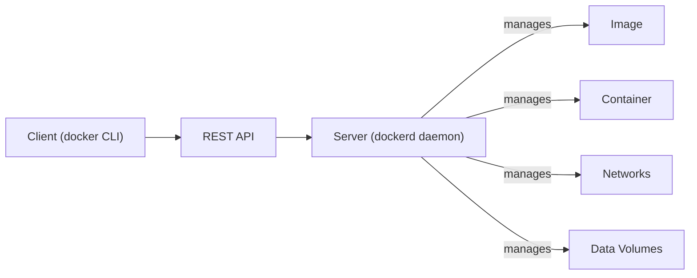
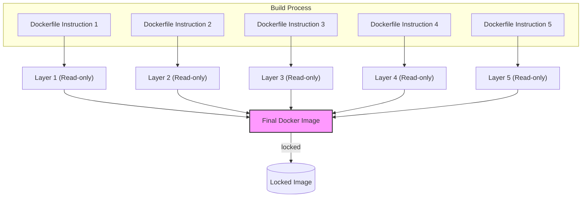
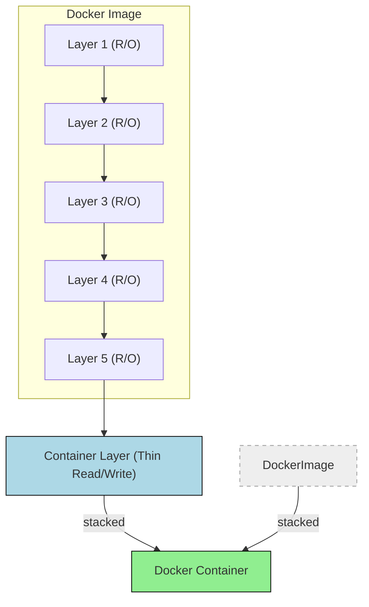
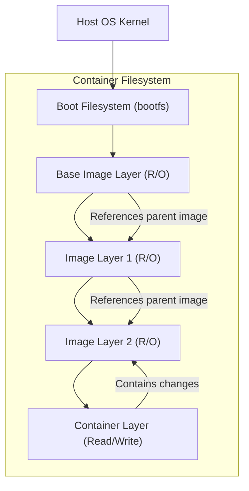
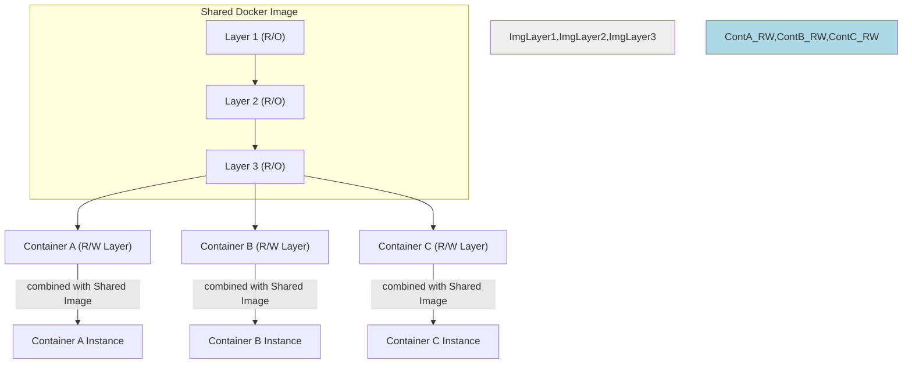
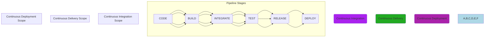
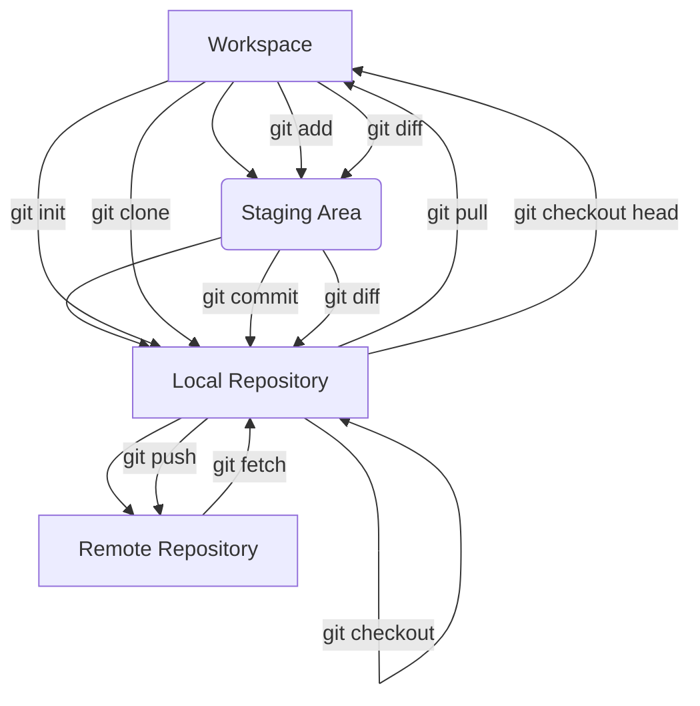
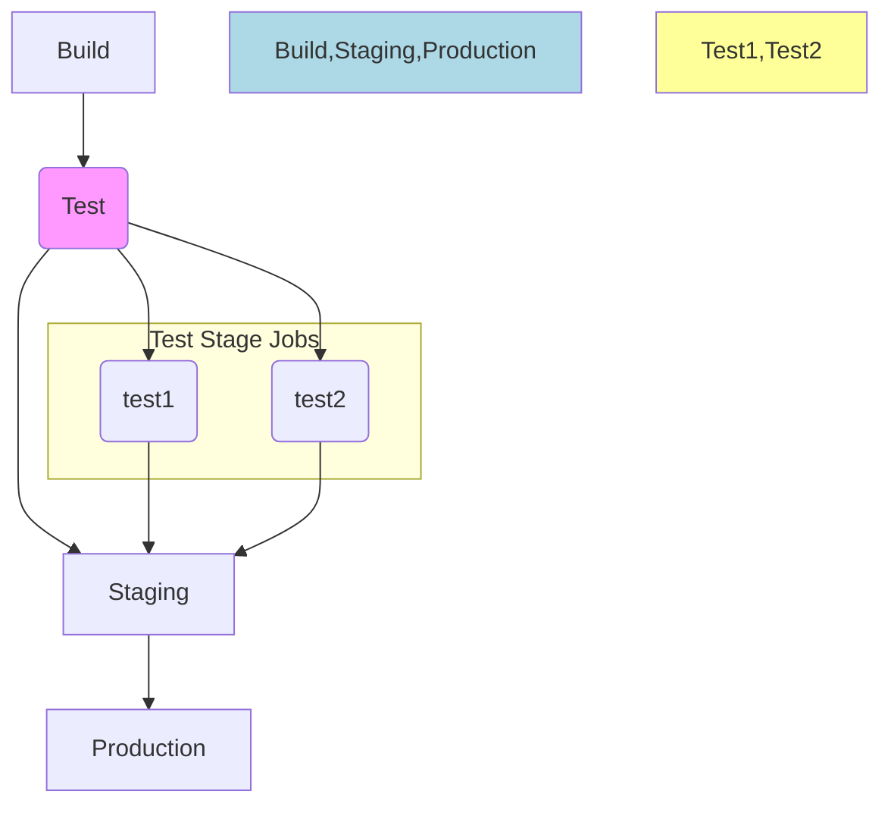

# Docker and Gitlab-CI/CD

## What is Docker

*   **Docker as a Platform:** Docker is a software platform designed to streamline the process of building, running, managing, and distributing applications.
*   **Operating System Virtualization:** It works by virtualizing the operating system of the computer on which it is installed. This capability allows for the efficient deployment of applications packaged into containers.
*   **Release and Impact:** First released in 2013, Docker significantly changed how developers approach creating and deploying applications.
*   **Development Language:** Docker itself is developed using the Go programming language, which contributes to its high efficiency and scalability.

---

## Context

The need for Docker arises in scenarios involving application deployment and management challenges, such as:

*   **Hosting Multiple Web Applications:** Running several different web applications simultaneously on a single server.
*   **Framework and Dependency Conflicts:** Dealing with applications built using different frameworks (like Node.js, Spring, or Flask), potentially requiring different versions of those frameworks or conflicting dependencies.
*   **Inability to Run Multiple Software Versions:** The difficulty of installing and managing multiple versions of core software like Node.js, Java, or Python on the same machine without conflicts.

---

## A solution without Docker

Traditionally, solutions to the challenges mentioned in the context involved:

*   **Multiple Physical Machines:** Hosting each application or group of applications on separate physical servers to avoid conflicts.
*   **Multiple Virtual Machines (VMs):** Using a single physical machine but hosting each application or group of applications within isolated virtual machines.
*   **Associated Costs:** Both of these approaches, especially managing multiple physical or virtual machines, involve significant costs related to acquiring and maintaining hardware and infrastructure.

---

## A solution with Docker

Docker offers a more lightweight and efficient solution through the concept of containers.

*   **Docker Host and Containers:** The Docker system consists of a Docker Host (the machine running Docker) and Containers.
*   **Logical Entities:** Containers are logical entities created and managed by the Docker Host.
*   **Virtualized Aspects:** Each container gets a virtual copy of essential system components, such as:
    *   The process table (listing running processes).
    *   Network interfaces.
    *   File system mount points.
*   **No Separate OS:** Unlike virtual machines, a Docker container does not contain its own full operating system.
*   **Shared Kernel:** Containers running on the same Docker Host share the kernel of the host operating system.

---

## Docker vs. VM

*Visual Representation:* The original image presented a diagram comparing the architecture of Virtual Machines (VMs) and Containers. The VM side showed multiple Guest OS instances running on a Hypervisor (Type 2) on top of a Host OS and Server hardware. Each Guest OS had its own Bins/Libs and App layers. The Containers side showed multiple App instances running on shared Bins/Libs, managed by the Docker Engine, all on a single Host OS and Server hardware. The diagram emphasized that containers are isolated but share the OS and, where appropriate, bins/libraries.

Here is a Mermaid diagram illustrating the key architectural differences between Virtual Machines and Docker Containers:

```mermaid
graph TD
    subgraph Virtual Machine Architecture
        VM_HW[Server Hardware] --> VM_HOST_OS(Host OS);
        VM_HOST_OS --> VM_HYPERVISOR["Hypervisor (Type 2)"];
        VM_HYPERVISOR --> VM_GUEST_A(Guest OS A);
        VM_HYPERVISOR --> VM_GUEST_B(Guest OS B);
        VM_GUEST_A --> VM_BINLIBS_A[Bins/Libs A];
        VM_GUEST_B --> VM_BINLIBS_B[Bins/Libs B];
        VM_BINLIBS_A --> VM_APP_A[App A];
        VM_BINLIBS_B --> VM_APP_B[App B];
        VM_GUEST_A --> VM_BINLIBS_A;
        VM_GUEST_B --> VM_BINLIBS_B;
    end

    subgraph Docker Container Architecture
        DOCKER_HW[Server Hardware] --> DOCKER_HOST_OS(Host OS);
        DOCKER_HOST_OS --> DOCKER_ENGINE[Docker Engine];
        DOCKER_ENGINE --> DOCKER_SHARED_BINLIBS[Shared Bins/Libs];
        DOCKER_SHARED_BINLIBS --> DOCKER_CONTAINERS[Containers];
        DOCKER_CONTAINERS -- (isolated but share OS) --> DOCKER_APP_A[App A];
        DOCKER_CONTAINERS -- (isolated but share OS) --> DOCKER_APP_B[App B];
        DOCKER_CONTAINERS -- (isolated but share OS) --> DOCKER_APP_C[App C];
    end

    VM_TITLE[VMs: Separate OS, Bins/Libs per App]
    DOCKER_TITLE[Containers: Shared OS Kernel and Bins/Libs]
```

<p align="center">



</p>

---

## Docker Networking

Docker provides different network types to control how containers communicate with each other and the outside world:

*   **Bridge Network:** This is the default network type for containers.
    *   Containers connected to the same bridge network can communicate with each other using their container names or aliases.
    *   The Docker host acts as a bridge, routing traffic between containers and to/from the external network.
*   **Host Network:** In this mode, the container shares the host's network stack directly.
    *   This can be useful for performance-sensitive applications as it avoids network address translation (NAT).
    *   However, it offers less isolation compared to the bridge network, as the container's network ports are directly exposed on the host.
*   **Overlay Network:** This network type enables communication between containers running on *different* Docker hosts.
    *   It is primarily used in multi-host Docker environments, such as Docker Swarm mode, to facilitate cluster-wide container communication.

---

## Advantages of Using Docker

Using Docker offers several key benefits:

*   **Shared Kernel:** Containers share the kernel of the host operating system, making them lightweight.
*   **Dependency Management:** Multiple containers with different software requirements (including different versions of dependencies) can run on the same host without conflicting.
*   **Resource Efficiency:** Eliminates the need for multiple physical or virtual machines, saving hardware resources and costs.
*   **Consolidated Hosting:** Allows multiple applications with potentially conflicting requirements to be hosted efficiently on a single host machine.
*   **Small Footprint:** Containers are generally small in size and consume minimal disk space compared to VMs.
*   **Speed and Efficiency:** Containers are more robust and boot up much faster than virtual machines.
*   **Cost Reduction:** Docker is less demanding on hardware resources, which directly contributes to reduced costs for users.

---

## Disadvantages of Using Docker

Despite its advantages, Docker also has some drawbacks:

*   **Performance Overhead:** There can be a decrease in performance compared to running applications directly on the host, due to resource sharing and isolation mechanisms.
*   **Learning Curve:** There is a learning curve associated with understanding Docker concepts, workflows, and best practices for new users.
*   **Limited OS Support:** Docker relies on Linux kernel features and has limited native support for some operating systems.
*   **OS Requirement Conflicts:** Docker cannot host applications that have fundamentally different operating system requirements (e.g., an application that *must* run on Windows cannot run natively on a Linux Docker host).
*   **Separate Hosts Needed:** Applications requiring different OS environments must be hosted on separate Docker Hosts that match their OS requirements.
*   **Cross-OS Limitation:** For example, applications designed for Linux and applications designed for Windows cannot typically be hosted on the same Docker Host simultaneously using native Docker features.

---

## Docker Engine

*   **Core Component:** Docker Engine is the essential core component of the Docker system.
*   **Operation Management:** It is responsible for managing the Docker platform's overall operations, including building images, running containers, managing networks, and handling data volumes.
*   **Main Components:** Docker Engine comprises three primary components:
    *   The Server
    *   The REST API
    *   The Client

*Visual Representation:* The original image showed a diagram illustrating the components of the Docker Engine and how they interact with other Docker concepts like images, containers, and data volumes. The diagram shows the Client communicating with the REST API, which communicates with the Daemon (Server), which manages Images, Containers, Networks, and Data Volumes.

Here is a Mermaid diagram illustrating the components and their interactions:

<p align="center">



</p>

---

## Docker Engine Components

Let's look closer at the Server and REST API components of the Docker Engine:

*   **The Server (dockerd):** This is the primary module of the Docker Engine.
    *   It runs as a daemon (a background process) typically named `dockerd`.
    *   `dockerd` is the core process that performs all the heavy lifting: creating and managing Docker images, containers, networks, and data volumes.
*   **The REST API:** This is the interface that external applications or tools use to interact with the Docker Engine.
    *   It exposes endpoints that allow applications to issue commands to the `dockerd` daemon and retrieve information.
    *   This enables programmatic control over Docker functionality.

---

## Working with Docker Engine

The third main component of the Docker Engine is the Client:

*   **The Client (Command-Line Interface):** The Client is the primary way users interact with Docker.
    *   It's typically a command-line interface (CLI) tool (the `docker` command).
    *   Users type commands into the Client to instruct the Docker Engine (`dockerd` via the REST API) to perform actions.
*   **Communication Interface:** The Client allows users to issue commands to the Docker daemon and other parts of the Docker Engine.
*   **User Experience:** The Client simplifies and streamlines the process of interacting with the powerful Docker Engine for users, abstracting away the underlying API calls.

---

## Docker Terminology

Understanding a few key terms is essential when working with Docker:

*   **Docker Image:**
    *   A Docker Image is a read-only template.
    *   It bundles the application code and all the dependencies, libraries, and configuration files required to run that application.
    *   Images serve as the blueprint from which Docker containers are created.
    *   Images are static: They represent a fixed snapshot of an application and its environment at a specific point in time.
*   **Docker Container:**
    *   A Docker Container is a logical entity that represents a running instance of a Docker Image.
    *   When you run a Docker Image, you create one or more containers based on that image.
    *   Containers are dynamic: They are the actual running processes executing the application defined by the image in an isolated Docker environment.

---

## Underlying Linux Technologies

Docker doesn't create isolation from scratch; it builds upon powerful, existing features of the Linux kernel.

*   **Leveraging Linux Features:** Docker utilizes kernel capabilities such as:
    *   **Overlay Filesystems:** For efficient layering of image data.
    *   **cgroups (Control Groups):** For managing resource allocation (CPU, memory, disk I/O) to containers.
    *   **Network Namespaces:** For providing isolated network stacks to containers.
    *   **Binding Mounts:** For mounting files or directories from the host into a container.
*   These underlying capabilities are native to Linux and can even be manipulated directly using standard bash commands, though this is complex.
*   **Docker's Simplification:** Docker simplifies the use of these complex Linux features significantly. It encapsulates them into a more user-friendly and accessible format primarily through the concept of a "Docker Image" and the Docker command-line interface. This innovation greatly streamlines the deployment and management of applications by making isolation and resource control easier to handle.

---

## Docker Hub

Docker Hub is a central online service for managing and sharing Docker images:

*   **Online Repository:** It functions as a public and private online repository for Docker Images.
*   **Storage and Distribution:** Users can store their custom Docker images on Docker Hub and distribute them to others or pull them down for deployment.
*   **Public and Private Images:** You have the option to make your images publicly accessible to everyone or keep them private, requiring authentication to access.
*   **Free Tier Limits:** Free Docker Hub accounts are typically limited to storing only one private image.
*   **Paid Subscriptions:** A paid subscription plan is required to store and manage multiple private Docker images.

---

## GitHub Container Registry (GHCR)

GitHub Container Registry (GHCR) is another option for hosting Docker images, integrated directly into the GitHub platform:

*   **New GitHub Feature:** GHCR is a relatively recent feature enabling GitHub users to host and manage their Docker images alongside their code.
*   **Central Storage:** It allows users to store their container images in a central location tied to their GitHub repositories. This integration makes it easier to manage and deploy applications whose code is already on GitHub.
*   **Streamlined Workflow:** GHCR facilitates a more integrated workflow, allowing users to push and pull container images seamlessly, much like they handle other code or files on GitHub.
*   **Free and Unlimited Storage:** One significant advantage is that GHCR offers free and unlimited storage for all GitHub users. This removes the need for users to set up separate container registries or pay for storage fees just to host their images.

---

## Building Docker Images

Docker images are built layer by layer based on instructions defined in a text file called a Dockerfile.

*   **Instruction per Layer:** Each distinct instruction specified in the Dockerfile creates a new layer in the Docker image.
*   **Read-Only Layers:** These layers are read-only (R/O). Once a layer is created during the build process, it cannot be modified.
*   **Layer Stacking:** At the conclusion of the build process, all these individual R/O layers are stacked and "stitched" together to form the final Docker image.
*   **Union File System:** This layering and stacking process is facilitated by a technology known as the Union File System (or UnionFS), which allows multiple directories (the layers) to be mounted as a single file system.

*Visual Representation:* The original image depicted a stack of read-only layers (`Layer 1` to `Layer 5`) building up to form a final `Image`, visually showing the layers stacked on top of each other and locked, indicating their read-only nature.

Here is a Mermaid diagram representing the layer stacking process during image building:

<p align="center">



</p>

---

## Docker Image Layers

Understanding the nature of Docker image layers is important:

*   **Immutable R/O Layers:** Docker image layers are immutable and read-only (R/O). This means that once a layer is created during the image build process, it cannot be modified.
*   **Layer Reusability:** The Union File System architecture allows layers to be efficiently reused. If instructions in a Dockerfile are unchanged, their corresponding layers can be fetched from a cache instead of being rebuilt. If an instruction is changed, that layer and all subsequent layers must be recreated.
*   **Creating New Layers on Change:** Any modification to an instruction in the image's definition results in the creation of new layers from that point onwards in the build process. The old layers affected by the change are discarded for that particular build.

---

## Creating Docker Containers

Docker containers are created from Docker images using a layered approach:

*   **Adding a R/W Layer:** A Docker container is created by adding a new, thin, writable (R/W) layer on top of the stack of read-only layers that make up the Docker image.
*   **Container Layer:** This top, writable layer is specifically known as the **container layer**.
*   **Copy-On-Write (COW):** The process of copying and editing files or objects that originated in the read-only image layers is managed by the Copy-On-Write (COW) strategy. When a file from a lower R/O layer needs to be modified, a copy is first made into the top R/W layer, and the changes are applied to the copy. The original R/O file remains untouched.
*   **Storing Changes:** All changes made within the running container (new files, modifications, deletions) are stored exclusively within this top, writable container layer.

*Visual Representation:* The original image displayed a diagram showing a stack of read-only image layers (with truncated hash IDs and sizes) and a lock icon. On top of this stack was a "Thin R/W layer" labeled "Container layer". An arrow pointed from the image stack and the R/W layer to a "Container" label. This illustrated the composition of a container from the base image layers plus a thin writable layer.

Here is a Mermaid diagram illustrating container creation from image layers:

<p align="center">



</p>

---

## Docker Container Layers

More details about the layers within a running container:

*   **Container Layer Position:** The writable container layer always resides at the very top of the layer stack.
*   **Layer Immutability:** The underlying image layers (the R/O layers) remain immutable. The container layer is the detached, writable R/W layer where changes occur.
*   **Changes Isolation:** Changes made *inside* a running container are only written to the top container layer. These changes do **not** affect the original, underlying image layers.
*   **Container Destruction:** When a Docker container is destroyed, the top writable container layer is also removed. This action effectively discards all changes that were made within that specific container instance. The original image remains unchanged.

*Visual Representation:* The original image showed a vertical stack of layers labeled from the bottom up: `kernel`, `bootfs`, `Base image`, `Image`, `Container`. The `Image` layers and `Base image` layers were shown as part of the "References parent image". The `Container` layer was labeled `Writable` and also showed labels like `add nginx`, `add nodejs`, `Ubuntu`, indicating content added in layers. This provided a view of how the container's filesystem stack sits on top of the base OS components.

Here is a Mermaid diagram illustrating the layered structure of a container relative to the host OS components:

<p align="center">



</p>

---

## Multiple Same Container Instances

A significant advantage of Docker's layered architecture is the efficiency it brings when running multiple containers from the same image.

*   **Shared Read-Only Layers:** The read-only layers that constitute the Docker image can be shared efficiently between *any* container instances that are started from that identical image. The host system only needs to store one copy of these R/O layers.
*   **Unique Writable Layer:** Each individual container instance created from the image gets its own dedicated and unique writable (R/W) container layer. This is where the container's specific state and any runtime changes are stored, ensuring isolation between containers.

*Visual Representation:* The original image showed a single stack of read-only image layers at the bottom. On top of this single base, multiple separate "Thin R/W layer" boxes were shown, each labeled with a container name/ID and size, and connected to a separate container icon (a small Docker container symbol). This visually represented that the lower layers were shared, while the top layer was distinct for each container.

Here is a Mermaid diagram illustrating shared image layers and unique container layers:

<p align="center">



</p>

---

## How to store data

Since changes made inside a container's R/W layer are lost when the container is destroyed, Docker provides mechanisms for persistent data storage:

*   **Volumes:** Volumes are the preferred method for persisting data generated and used by Docker containers.
    *   They are stored in a dedicated area on the host's filesystem (managed by Docker).
    *   Docker manages the lifecycle of volumes, making them easy to back up, migrate, and share between containers.
*   **Bind Mounts:** Bind mounts allow you to mount an arbitrary directory or file from the host machine directly into a container.
    *   They are stored anywhere on the host filesystem.
    *   You need to specify the exact path on the host.
    *   Bind mounts are useful for development (mounting source code), configuration files, or when the host's filesystem structure is important.
*   **Tmpfs Mounts:** Tmpfs mounts store data in the host's memory.
    *   They are temporary and not persisted to the host's filesystem.
    *   They are available only on Linux hosts.
    *   Useful for storing sensitive information or non-persistent state that needs high performance.

*   **Data Isolation Importance:** To leverage the benefits of containerization (portability, disposability), application data should ideally be isolated from the container's filesystem using Volumes or Bind Mounts. This ensures that the data survives container recreation or replacement.

---

## Docker Volumes Practical Example

Using Docker Volumes ensures that data persists independently of the container's lifecycle.

*   **Data Survival:** Data stored in a volume will survive if the container is removed, recreated, or crashes.

*Visual Representation:* The original image displayed a code snippet from a `docker-compose.yml` file showing the definition of a volume.

Here is the code snippet demonstrating volume definition:

<p align="center">

```yaml
services:
  db:
    image: mysql
    volumes:
      - db_data:/var/lib/mysql # Mount the 'db_data' volume to the MySQL data directory inside the container

volumes: # Define the volume outside the services section
  db_data: # Name of the volume
```

</p>

This configuration ensures that the database files stored by the MySQL container in `/var/lib/mysql` will actually be stored in the `db_data` volume on the host, preserving the data even if the `db` container is stopped, removed, or updated.

---

## Dockerfile

A Dockerfile is a key component in the Docker workflow:

*   **Build Instructions:** A Dockerfile is a simple text file that contains a set of instructions. These instructions are executed sequentially by the Docker engine to automatically build a Docker image.
*   **Image Definition:** It defines everything needed to create the image, including:
    *   The base image to start from.
    *   The application code and its dependencies.
    *   Commands to configure the environment (e.g., install software, set environment variables).
    *   The command to run the application when a container starts.
*   **Automated Building:** The Docker engine reads the Dockerfile and automates the image building process. The resulting image can then be used to create and run Docker containers. Containers provide isolation for the application and its dependencies from the host system.
*   **Deployment Ease:** By defining the application environment in a Dockerfile, you enable the application to be easily built and deployed consistently across different environments, platforms, and infrastructure.

---

## Dockerfile Example

Here is a typical example of a simple Dockerfile for a Node.js application, with explanations for each instruction:

```dockerfile
FROM node:latest       # Use the most recent official Node.js image as the base image for this container.
WORKDIR /app           # Create a new directory inside the container called /app and set it as the working directory for subsequent commands.
COPY . .               # Copy all source files from the current directory on the host into the /app directory inside the container (node_modules are typically excluded by a .dockerignore file).
RUN npm install        # Install the app's dependencies inside the container based on the package.json file.
EXPOSE 3001            # Inform Docker that the container listens on network port 3001 at runtime (this is informational, does not publish the port).
CMD ["npm", "start"]   # Define the command to run when the container starts (this starts the application using the script defined in package.json).
```

---

## Multi-stage builds in Dockerfile

Multi-stage builds are an advanced Dockerfile technique used for optimizing image size and build efficiency.

*   **Separating Stages:** This technique involves defining multiple `FROM` instructions in a single Dockerfile, effectively creating distinct build "stages".
    *   One stage (the "build stage") might include heavy tools and dependencies needed only to compile or package the application.
    *   Another stage (the "runtime stage") starts from a much smaller base image and copies only the *necessary* artifacts from the build stage.
*   **Reducing Final Image Size:** By discarding the build-time dependencies and tools not required at runtime, multi-stage builds significantly reduce the size of the final Docker image.

*Visual Representation:* The original image displayed a code snippet showing a multi-stage Dockerfile example.

Here is the code snippet demonstrating a multi-stage build:

<p align="center">

```dockerfile
# --- Build stage ---
FROM node:18 AS build # Use node:18 as the base for this stage, name it 'build'
WORKDIR /app
COPY . .
RUN npm install && npm run build # Install dependencies and build the application

# --- Production stage ---
FROM node:18-slim # Use a smaller node image for the final stage
WORKDIR /app
# Copy ONLY the built application from the 'build' stage
COPY --from=build /app/dist ./dist
# Define the command to run the built application
CMD ["node", "dist/server.js"]
```

</p>

---

## Building & Running the Docker Container

Once you have a Dockerfile, you can build an image and run a container from it using the `docker` command-line interface.

*   **Building an Image:** This command will build a Docker image based on the Dockerfile in the current directory (`.`) and tag it with the name `my-app-image`.

```bash
docker build -t my-app-image .
```

*   **Running a Container:** This command will run a container from the `my-app-image`, detach it (`-d`), publish port 3000 from the container to port 3000 on the host (`-p 3000:3000`), and mount a local directory (`/path/to/local/folder`) to the `/app` directory inside the container (`-v /path/to/local/folder:/app`).

```bash
docker run -d -p 3000:3000 -v /path/to/local/folder:/app my-app-image
```

---

## Tagging a Docker Image

Tagging is crucial for identifying, versioning, and pushing Docker images to registries.

*   **Tag Definition:** A tag is a label consisting of a name and an optional version reference for a specific Docker image.
*   **Registry Requirement:** Tagging an image with the full registry path is required before you can push it to a Docker registry (like Docker Hub or GHCR).
*   **Storage Location and Name:** The tag determines where (which registry and repository) and under what specific name and version the image will be stored in the registry.
*   **Tag Format:** The standard format for a tag includes the registry address, username/organization, image name, and the tag itself: `registry/username/image-name:tag`. If the `:tag` part is omitted, the default tag `latest` is used.
*   **Tagging During Build:** You can apply a tag directly when building the image using the `-t` flag:

```bash
docker build -t my-app:1.0.0 .
```

*   **Tagging an Existing Image:** You can also tag an existing image (identified by its name or ID) for pushing to a specific registry:

```bash
docker tag my-app ghcr.io/myusername/my-app:1.0.0
```

This creates a new tag (`ghcr.io/myusername/my-app:1.0.0`) that points to the same image as the original tag (`my-app`).

---

## Pushing a Docker Image

Pushing a Docker image makes it available in a remote registry.

Here are the general steps to push a Docker image to a registry:

1.  **Tag the Image:** Ensure the image is tagged with the full registry path (e.g., `ghcr.io/myusername/my-app:1.0.0`).
    *   *Command Example:* `docker tag my-app ghcr.io/myusername/my-app:1.0.0`
2.  **Log In to the Registry:** You need to authenticate with the target registry using your credentials.
    *   *Command Example:* `docker login ghcr.io` (You will be prompted for username and password or token).
3.  **Push the Image:** Use the `docker push` command followed by the fully tagged image name.
    *   *Command Example:* `docker push ghcr.io/myusername/my-app:1.0.0`

Important considerations when pushing an image:

*   **Write Access:** You must have the necessary permissions (write access) to the target repository in the registry.
*   **Availability:** Once successfully pushed, the image becomes available in the registry. It can then be pulled by others (if it's a public image) or used for automated deployments.

---

## Pulling a Docker Image

Pulling a Docker image retrieves it from a registry and stores it on your local Docker system.

*   **Pulling from a Registry:** Use the `docker pull` command followed by the full image name and tag (or `latest` by default) from the registry.

```bash
docker pull ghcr.io/myusername/my-app:1.0.0
```

*   **Automatic Pull on Run:** Docker automatically performs a pull operation if you attempt to run a container from an image that doesn't already exist locally on your machine.
    *   *Command Example:* `docker run -d mysql`
    *   When you run this, Docker first checks if the `mysql:latest` image is present locally. If not, it automatically pulls it from the default registry (Docker Hub in this case) before starting the container.
    *   The `-d` flag runs the container in detached mode (in the background).

Common scenarios where pulling an image is necessary:

*   **Using Base Images:** To obtain official or public base images (e.g., `ubuntu`, `mysql`, `node`, `nginx`) from Docker Hub or other registries to use in your Dockerfiles or for running standard software.
*   **Retrieving Updates:** To get the latest version of an image that is maintained internally within your organization or externally.
*   **Automated Workflows:** To fetch required images as part of automated CI/CD workflows before building or deploying applications.

---

## Docker Compose

Docker Compose is a tool designed to simplify the definition and management of multi-container Docker applications.

*   **Defining Multi-Container Apps:** Docker Compose allows you to define an application's entire service stack (multiple containers, networks, volumes) in a single configuration file, typically named `docker-compose.yml`.
*   **YAML or JSON Format:** The configuration file can be written in either YAML or JSON format, with YAML being the more commonly used and human-readable option.
*   **Configuration Details:** The `docker-compose.yml` file defines various aspects of your application's services, including:
    *   **Services:** Each service represents a containerized component of your application (e.g., a web server, a database, an API). The file specifies the image to use, ports, volumes, and other settings for each service.
    *   **Networks:** Defines the networks that containers will use to communicate with each other. You can define one or more networks and specify which services are connected to them.
    *   **Volumes:** Defines persistent data storage for your services. Volumes allow data to be shared between containers or stored outside the container's lifecycle on the host filesystem.

*   Docker Compose reads the `docker-compose.yml` file and automatically creates and configures all the necessary containers, networks, and volumes as defined. This allows you to spin up your entire application stack with a single command.

---

## Docker Compose Override

Docker Compose supports using multiple configuration files to manage different environments or configurations.

*   **Multiple Files:** You can define your application's base configuration in `docker-compose.yml` and then use separate override files to extend or modify that configuration for specific purposes.
*   **Automatic Override File:** By default, when you run `docker compose up`, Docker Compose automatically looks for and applies a file named `docker-compose.override.yml` in the same directory as `docker-compose.yml`.
*   **Differentiating Environments:** This feature is particularly useful for differentiating setups between development, testing, staging, and production environments. You can define common settings in the base file and environment-specific settings in override files.

Example Usage:

*   **Base Configuration (`docker-compose.yml`):** Contains the fundamental definition of your services, images, etc.
*   **Override Configuration (`docker-compose.override.yml`):** Might add volumes for local development, map ports for debugging, or define environment variables specific to the development environment.

You can explicitly specify which files to use with the `-f` flag:

```bash
# This command uses docker-compose.yml and docker-compose.prod.yml
docker compose -f docker-compose.yml -f docker-compose.prod.yml up -d
```
In this command, settings in `docker-compose.prod.yml` will override settings in `docker-compose.yml` where conflicts exist.

---

## Docker-compose.yml

The `docker-compose.yml` file serves as the central definition for a multi-container application.

*   **Service Configuration:** The file specifies the detailed configuration for each service (container) that makes up your application. This configuration includes:
    *   `image`: The Docker image to be used for this service.
    *   `ports`: Specifies port mappings between the host and the container.
    *   `environment`: Defines environment variables to be set inside the container.
    *   Other settings like `volumes`, `networks`, `depends_on`, etc.
*   **Automated Creation and Configuration:** Based on the definitions provided in the `docker-compose.yml` file, Docker Compose automatically handles the creation and configuration of all the necessary containers and their associated resources.

---

## Yaml files

YAML (YAML Ain't Markup Language) is a data serialization format commonly used for configuration files.

*   **Human-Readable Format:** YAML is designed to be easily readable and writable by humans. It's often used for configuration settings and storing structured data.
*   **Purpose:** It stands for "YAML Ain't Markup Language". It's created to be both simple for humans to work with and easy for machines to parse.
*   **Usage Areas:** YAML files are widely adopted in areas like web development, DevOps practices, and software configuration management.
*   **Structure:** YAML uses indentation (whitespace) and colons (`:`) to represent a hierarchy of values. It supports complex data structures, including:
    *   Lists (sequences)
    *   Dictionaries (mappings of key-value pairs)
    *   Nested objects
*   **Editing and Extensions:** YAML files can be edited using any standard text editor. They typically have file extensions such as `.yaml` or `.yml`.

---

## Yaml vs. JSON

YAML is often compared to JSON (JavaScript Object Notation) as both are data serialization formats. However, YAML offers certain advantages for configuration files compared to JSON:

*   **Readability and Flexibility:** YAML is generally considered more readable and flexible for complex configurations than JSON.
    *   **Cleaner Syntax:** YAML uses a cleaner syntax with fewer required structural characters like curly braces (`{}`), square brackets (`[]`), and quotation marks (`"`), especially for simple mappings and sequences.
    *   **Comments:** YAML supports comments using the `#` symbol, which is invaluable for documenting configuration files. JSON does not natively support comments.
    *   **Anchors and Aliases:** YAML allows defining reusable values using anchors (`&name`) and referencing them with aliases (`*name`). This helps avoid repetition and maintain consistency in configurations. JSON does not have this feature.
    *   **Multi-line Strings:** YAML makes it easier to write multi-line strings, which is useful for including commands, scripts, or larger blocks of text directly in the configuration.

*   **Drawbacks:** YAML also has some disadvantages:
    *   **Indentation Sensitivity:** YAML relies heavily on indentation to define structure. Incorrect indentation can lead to parsing errors that can be difficult to debug.
    *   **Error Proneness:** While designed for readability, the flexibility and syntax can sometimes make YAML files more prone to subtle errors if not carefully written.

---

## Environment Variables

Environment variables are a standard way to pass configuration information to applications and processes.

*   **Runtime Injection:** Environment variables are key-value pairs that are injected into a container's runtime environment when it is started.
*   **Configuration:** They are commonly used to configure the behavior of the application running inside the container without needing to modify the application's code itself.
*   **How to Define Them:** Environment variables can be defined for Docker containers in a few ways:
    *   Directly within the Dockerfile using the `ENV` instruction.
    *   In the `docker-compose.yml` file under the `environment` key for a service.
    *   *(Optional)* Using a separate `.env` file to centralize environment variable definitions, which can then be referenced in the `docker-compose.yml`.
*   **Why Use Them:** Using environment variables for configuration offers several benefits:
    *   **Configuration Separation:** It separates configuration details from the application code, making the code more portable and reusable.
    *   **Value Reusability:** Values can be reused across multiple services or configurations.
    *   **Environment Support:** They are crucial for supporting different environments (like development, testing, staging, or production) by providing environment-specific settings.

---

## Environment Variables in Dockerfile

The `ENV` instruction in a Dockerfile is used to set environment variables within the image, which will be available to containers running from that image.

```dockerfile
FROM node:latest

ENV SERVER_PORT=3001 # Sets a default environment variable SERVER_PORT with value 3001
ENV APP_ENV=production # Sets a default environment variable APP_ENV with value 'production'

WORKDIR /app
COPY . .
RUN npm install
EXPOSE ${SERVER_PORT} # You can use environment variables during the image build process (e.g., in EXPOSE, CMD, RUN instructions)
CMD ["npm", "start"]  # The CMD instruction will have these environment variables available
```

*   **Default Values:** `ENV` instructions set default values for environment variables that will be available during both the image build process and container runtime.
*   **Usage in Dockerfile:** Environment variables can be referenced within certain Dockerfile instructions (like `EXPOSE`, `CMD`, `RUN`) using `${VARIABLE_NAME}` or `$VARIABLE_NAME` syntax.
*   **Overriding in Compose:** Environment variables set with `ENV` in the Dockerfile can be overridden when running the container, for example, by defining the same variable in the `environment` section of a `docker-compose.yml` file.
*   **Application Code Access:** These environment variables are also accessible from within the application code running inside the container (e.g., in a Node.js application, you would typically access them via `process.env.SERVER_PORT`).

---

## Environment Variables in Docker Compose

Defining environment variables in the `docker-compose.yml` file provides a flexible way to pass configuration specific to a service or environment.

```yaml
services:
  frontend:
    image: app-frontend
    container_name: app-fe
    environment: # Define environment variables for this service
      SERVER_HOST: localhost # Override or set SERVER_HOST
      SERVER_PORT: 5000      # Override or set SERVER_PORT
      APP_PORT: 5173         # Override or set APP_PORT
    ports:
      - "5173:5173" # Map container port 5173 to host port 5173
```

*   **Overriding Dockerfile ENV:** Environment variables defined in the `environment` section of `docker-compose.yml` take precedence and override any default values set for the same variable in the Dockerfile's `ENV` instructions.
*   **Runtime Injection:** These variables are injected into the container's environment when the container is started by Docker Compose. They are then readable by the application code running inside.
*   **Environment-Specific Customization:** This is very useful for customizing container behavior based on the specific environment (e.g., setting database connection strings, API keys, or feature flags that differ between development and production).
*   **Anchors for Consistency:** As shown later, YAML anchors can be used within the `environment` section to define reusable sets of environment variables, helping to maintain consistency across multiple services that need the same configuration.

---

## Secrets Management in Docker

Environment variables are not suitable for passing sensitive data like passwords or API keys because they can be easily inspected. Docker provides a dedicated mechanism for managing secrets.

*   **Sensitive Data Exposure:** Environment variables are easily discoverable (e.g., using `docker inspect`) and should not be used for sensitive information.
*   **Docker Secrets:** For production environments, Docker Secrets is the recommended way to handle sensitive data.
*   **Encryption and Access:** Secrets are encrypted at rest and in transit. They are only decrypted and made available to the specific containers that are explicitly configured to need them.
*   **File Mounting:** Docker Secrets are not passed as environment variables inside the container. Instead, they are securely mounted as a file within the container's filesystem at a standard location: `/run/secrets/<secret_name>`. The application reads the secret value from this file.

*Visual Representation:* The original image displayed a code snippet from a `docker-compose.yml` file showing the definition and use of secrets.

Here is the code snippet demonstrating secrets management:

<p align="center">

```yaml
services:
  myapp:
    image: myapp:latest
    secrets: # List secrets this service needs access to
      - my_secret # Refers to the secret defined globally

secrets: # Define the secret globally
  my_secret: # Name of the secret
    file: ./my_secret.txt # Path to the file on the host containing the secret value
```

</p>

In this setup, the content of `./my_secret.txt` on the host will be securely made available inside the `myapp` container as a file at `/run/secrets/my_secret`.

---

## Reusable constants with YAML anchors

YAML's anchor and alias features allow you to define reusable blocks of configuration, preventing repetition and ensuring consistency across your `.yml` files.

*   **Anchors (`&name`):** An anchor is defined using the ampersand symbol (`&`) followed by a name. It marks a specific point in the YAML structure that you want to be able to reference later.
*   **Aliases (`*name`):** An alias is created using the asterisk symbol (`*`) followed by the name of a previously defined anchor. When the YAML parser encounters an alias, it substitutes the content of the corresponding anchor at that location.
*   **Configuration Consistency:** Anchors and aliases are very useful for keeping configurations consistent, especially when multiple services share similar settings (e.g., environment variables, volume mounts).
*   **Defining Constants:** You can define a section dedicated to storing reusable constants using anchors.

Example of defining reusable constants using anchors (e.g., in a `x-constants` block, though the name is arbitrary):

```yaml
x-constants:
  backend_host: &backend_host localhost
  backend_port: &backend_port 5000
  frontend_port: &frontend_port 5173
```
Here, `&backend_host`, `&backend_port`, and `&frontend_port` are anchors pointing to the values `localhost`, `5000`, and `5173` respectively.

*   **Referencing with Aliases:** You can then reference these defined values using aliases in other parts of your YAML file, such as the `environment` section of a service:

```yaml
environment:
  SERVER_HOST: *backend_host # Use alias *backend_host, which resolves to 'localhost'
  SERVER_PORT: *backend_port # Use alias *backend_port, which resolves to '5000'
```

---

## Limitations of anchors in Docker Compose

While useful, YAML anchors in Docker Compose have specific limitations you need to be aware of:

*   **Entire Scalar Values Only:** Anchors can only be used to replace entire scalar values (like strings, numbers, booleans).
*   **Cannot Be Used Inside Strings:** A key limitation is that you cannot use aliases (`*name`) *within* a string to perform partial interpolation. The alias must represent the entire value of the key.
*   **Full Value Expected:** You should only use anchors where the entire value is expected to be replaced by the alias.
*   **Example:** For defining port mappings (`ports`) or volume mounts (`volumes`), which often involve string formats like `"host:container"` or `"volume_name:/path"`, you cannot substitute only a part of the string using an alias. The alias would have to represent the entire `"host:container"` or `"volume_name:/path"` string.

*   **Not Valid Example:** The following demonstrates invalid usage where partial interpolation using an alias within a string is attempted:

<p align="center">

```yaml
environment:
  APP_PORT: *frontend_port # Valid: Alias replaces the entire value

... # other configuration

ports:
  # INVALID: Partial interpolation using *frontend_port inside a string is NOT supported
  - "*frontend_port:5173" # This attempts to use the alias within the port string format
```

</p>

This example shows that while `*frontend_port` works correctly for replacing the entire value of `APP_PORT` in the `environment` section, attempting to embed `*frontend_port` within the string `"*:5173"` in the `ports` section is invalid. Docker Compose expects the full string value for the port mapping, not a string with an embedded alias that needs interpolation.

---

## Example of Docker-compose.yml

*Visual Representation:* The original image displayed a code snippet showing a full `docker-compose.yml` file, defining multiple services (`db`, `espocrm`) with images, ports, environment variables, and volumes.

This is a real `docker-compose.yml` file example.

It defines:
*   An image for a database service (`db`) using `mariadb:10.6`.
*   An image for a web application service (`espocrm`) using `espocrm/espocrm:latest`.
*   A couple of volumes (`db_data`, `espocrm_data`) for the database data and CRM data respectively, ensuring that this data persists even if the containers are recreated.

<p align="center">

```yaml
version: '3.7' # Specify the Compose file format version

services:
  db: # Database service
    image: mariadb:10.6 # Use MariaDB image
    restart: always # Always restart the container if it stops
    environment: # Environment variables for the database
      MARIADB_ROOT_PASSWORD: ssssss # Root password
      MARIADB_DATABASE: ssss       # Database name
      MARIADB_USER: ssss           # Database user
      MARIADB_PASSWORD: sssss      # User password
    volumes: # Volumes for the database
      - db_data:/var/lib/mysql # Mount db_data volume to the data directory

  espocrm: # Web application service (CRM)
    image: espocrm/espocrm:latest # Use EspoCRM image
    restart: always # Always restart
    ports: # Port mapping
      - "18080:80" # Map host port 18080 to container port 80
    environment: # Environment variables for the CRM application
      DATABASE_HOST: db           # Database host (refers to the db service name)
      DATABASE_PORT: 3306         # Database port
      DATABASE_NAME: ssss         # Database name (matches db)
      DATABASE_USER: ssss         # Database user (matches db)
      DATABASE_PASSWORD: ssss     # Database password (matches db)
      SITE_URL: https://www.mysite.com/crm # URL of the site
      PUBLIC_URL_PATH: /=/crm     # Public URL path configuration
    volumes: # Volumes for the CRM application
      - espocrm_data:/var/www/html # Mount espocrm_data volume to the app directory

volumes: # Define the volumes used by services
  db_data: {} # Define db_data volume
  espocrm_data: {} # Define espocrm_data volume
```

</p>

---

## Docker usage

Once you have defined your application stack in a `docker-compose.yml` file, you can manage it easily using the `docker compose` command.

*   **Testing in Isolation:** You can use Docker to launch your application in a secure, isolated environment. This is beneficial for testing as it eliminates potential issues related to missing dependencies or compatibility conflicts on your local machine. The container provides a consistent environment defined by the image.
*   **Launching the Application:** To start all the services defined in the `docker-compose.yml` file in the current directory:

```bash
docker compose up -d
```

The `-d` flag runs the containers in detached mode (in the background).
*   **Stopping the Application:** To stop and remove the containers, networks, and volumes defined in the `docker-compose.yml` file:

```bash
docker compose stop
```

Note: `docker compose down` is often used to stop and *remove* containers, networks, and default volumes. `docker compose stop` just stops the running containers.

---

## Gitlab CI/CD

*Visual Representation:* The original image displayed the GitLab logo and the text "CI/CD" with a lightning bolt symbol.

```text
+-----------------+
|     /\   /\     |
|    /  \ /  \    |
|   /____|\__/    |
|  CI / CD        |
+-----------------+
```

This section introduces GitLab CI/CD.

---

## CI – Continuous Integration

Continuous Integration (CI) is a fundamental practice in modern software development.

*   **Development Methodology:** CI is a software development methodology focused on delivering high-quality software frequently and efficiently.
*   **Continuous Integration Process:** It involves developers continuously integrating their code changes into a shared repository (like Git). Each integration is then immediately verified by automated tests and builds.
*   **Early Problem Detection:** With CI, developers can detect and fix integration errors and bugs early in the development cycle, shortly after introducing the code change. This significantly reduces the negative impact of bugs later in the development process or in the final product.

---

## CD – Continuous Delivery/Deployment

Continuous Delivery (CD) and Continuous Deployment extend the principles of Continuous Integration.

*   **Automating Delivery:** CD automates the entire software delivery process, starting from the code commit, through building, testing, and preparing the software for release.
*   **Release Confidence:** With Continuous Delivery, code changes are ready to be released to end-users at any time. Developers and teams gain high confidence that the software can be released frequently and reliably.

Continuous Delivery branches into Continuous Deployment:

*   **Continuous Delivery:** The pipeline automatically prepares a new release, but a *manual* approval step is required before deploying it to production. Human validation is possible (and often required) before the release goes live.
*   **Continuous Deployment:** There is no human intervention in the deployment process. Every code change that successfully passes all automated tests in the pipeline is immediately deployed automatically to the production environment.
*   **Key Difference:** The fundamental difference is whether the release to production is manual (`Continuous Delivery`) or fully automated (`Continuous Deployment`). Continuous Deployment can be seen as fully automated Continuous Delivery.

---

## CI/CD: Benefits and Workflow Stages

Implementing CI/CD provides substantial benefits to software development teams:

*   **Increased Delivery Speed:** Automating the build, test, and deployment process allows teams to deliver new features and updates much faster.
*   **Enhanced Collaboration:** Frequent integration and automated checks improve collaboration among development teams by reducing integration conflicts and providing faster feedback.
*   **Improved Software Quality:** Automated testing throughout the pipeline helps catch bugs earlier, leading to higher quality software.
*   **Reduced Risk:** Automating the process and having continuous feedback reduces the overall risk associated with software development and releases.

The typical CI/CD workflow consists of several distinct stages:

1.  **Code Integration:** Developers commit code changes to the shared repository.
2.  **Automated Build:** The project is automatically built (e.g., compiling code, packaging).
3.  **Testing:** Automated tests are run (unit tests, integration tests, etc.).
4.  **Deployment (or Delivery):** The built and tested artifact is prepared for deployment and potentially deployed to staging or production environments.

*   **Workflow Assurance:** This structured workflow ensures that each code change undergoes thorough automated testing and validation before it is released to production, providing confidence in the deployed software.

---

## Release Pipeline

*Visual Representation:* The original image showed a horizontal flowchart representing the stages of a release pipeline: `CODE` -> `BUILD` -> `INTEGRATE` -> `TEST` -> `RELEASE` -> `DEPLOY`. Below this, horizontal arrows indicated which stages fall under `Continuous Integration` (CODE, BUILD, INTEGRATE, TEST), `Continuous Delivery` (CODE through RELEASE), and `Continuous Deployment` (CODE through DEPLOY).

Here is a Mermaid diagram illustrating the typical release pipeline stages and how they relate to CI/CD practices:

<p align="center">



</p>

This diagram shows the progression of code through the pipeline: starting with coding, then building, integrating changes, testing, preparing a release artifact, and finally deploying. It visually represents that Continuous Integration encompasses the steps up to testing, Continuous Delivery includes preparation for release, and Continuous Deployment automates the final deployment step.

---

## Gitlab CI/CD pipelines

GitLab provides a built-in CI/CD system tightly integrated with its Git repositories.

*   **Pipeline Creation and Orchestration:** GitLab CI/CD pipelines allow developers to define, orchestrate, and automate their CI/CD processes directly within their GitLab environment.
*   **Pipeline Stages:** Pipelines are composed of stages, which are executed in a defined order. Common stages include `build`, `test`, `deploy`, and `release`.
*   **Configuration File:** GitLab CI/CD pipelines are configured using a YAML file named `.gitlab-ci.yml`. This file is placed in the root directory of your Git repository. It defines the stages, jobs, and instructions for the pipeline.

---

## GitLab CI/CD Artifacts and Cache

GitLab CI/CD pipelines can manage files generated during pipeline execution in two primary ways: Artifacts and Cache.

*   **Artifacts:** These are files or directories generated by a CI/CD job (e.g., test reports, compiled binaries, built web pages).
    *   Artifacts are saved after a job completes.
    *   They can be passed to later stages of the pipeline for use by subsequent jobs.
    *   They can also be downloaded by users for inspection or external use.
*   **Cache:** This mechanism is used to store reusable dependencies or build outputs (e.g., `node_modules` directory for Node.js, Maven repository for Java).
    *   The cache is saved after a job and restored before subsequent jobs that use the same cache key.
    *   The primary purpose of caching is to speed up future pipeline runs by avoiding repetitive downloads or builds of dependencies.

*Visual Representation:* The original image displayed a code snippet from a `.gitlab-ci.yml` file demonstrating the use of cache and artifacts.

Here is a snippet from a `.gitlab-ci.yml` file demonstrating the use of cache and artifacts:

<p align="center">

```yaml
job: # Define a job
  script: # Commands to run
    - npm install # Install dependencies (these will be cached)
  cache: # Define caching configuration
    paths: # Directory to cache
      - node_modules/ # Cache the node_modules directory
  artifacts: # Define artifacts configuration
    paths: # Files or directories to save as artifacts
      - build/ # Save the 'build' directory as an artifact
```

</p>

---

## .gitlab-ci.yml

The `.gitlab-ci.yml` file is the central configuration for your GitLab CI/CD pipeline.

Here is an example of a simple `.gitlab-ci.yml` file with explanations:

```yaml
stages:             # Specifies the overall stages the pipeline will execute
  - test            # Defines a single stage named 'test' (stages run sequentially)

before_script:      # Commands to run before each job in the pipeline
  - cd code/server  # Change directory to the application code location
  - npm install     # Install project dependencies using npm

test_server:        # Defines a job named 'test_server'
  stage: test       # Assigns this job to the 'test' stage
  image: node:latest # Specifies the Docker image to use as the environment for this job (using a Node.js image)
  script:           # Commands to execute for this job
    - set NODE_ENV=test # Set an environment variable for the test execution
    - npm test –testPathPattern='(test_unit|test_integration)' # Run npm tests, specifically unit and integration tests

rules:              # Defines rules for when this job should run
  - if: '$CI_COMMIT_BRANCH == "main"' # This rule specifies that the job should only run if the commit is on the "main" branch
```
**Explanation:**

*   `stages`: Defines the order of stages in the pipeline.
*   `before_script`: Specifies commands that will run before each job defined in the file. In this example, it navigates to the code directory and installs dependencies.
*   `test_server`: Defines a specific job.
    *   `stage`: Links the job to a defined stage.
    *   `image`: Specifies the Docker image to use as the runtime environment for the job. This is where your tests or build commands will run.
    *   `script`: Contains the actual commands to be executed for this job. This example sets an environment variable and runs specific npm test suites.
*   `rules`: Defines conditions under which the job will be included in the pipeline. In this case, the `test_server` job will only run if the code is pushed to the `main` branch.

---

## Git Workflow

*Visual Representation:* The original image displayed a complex diagram illustrating a typical Git workflow with different repositories (Workspace, Staging Area, Local Repository, Remote Repository) and common Git commands/actions (git init, git clone, git pull, git fetch, git commit -a, git add, git commit, git push, git checkout head, git checkout, git diff) moving between these areas. It also shows branches.

This diagram illustrates a common Git workflow, showing how code moves between different areas:

*   **Workspace:** Where you make changes to files.
    *   Commands: `git init` (initializes a new Git repository), `git clone <url>` (copies a remote repository).
*   **Staging Area (Index):** Where you prepare changes to be committed.
    *   Command: `git add` (adds changes from the Workspace to the Staging Area).
*   **Local Repository:** Where committed changes are stored locally in branches.
    *   Commands: `git commit` (saves changes from the Staging Area to the Local Repository), `git pull` (fetches changes from a remote repository and merges them into the current local branch), `git checkout <branch>` (switches to a different branch or commit), `git checkout head` (switches to the latest commit on the current branch).
*   **Remote Repository:** The shared repository hosted on a platform like GitLab.
    *   Commands: `git fetch` (downloads objects and refs from a remote repository without merging), `git push` (uploads local commits to a remote repository).
*   **Diff:** Command (`git diff`) used to show changes between different points (e.g., Workspace vs. Staging, Staging vs. Last Commit, different branches).

Here is a Mermaid diagram illustrating the core workflow steps and commands:

<p align="center">



</p>

---

## CI/CD Jobs Triggering

GitLab CI/CD pipelines are triggered to run based on specific events.

*   **Default Trigger (Git Push):** By default, CI pipelines are automatically triggered whenever code is pushed to the Git repository (`git push`).
*   **Branch-Specific Execution:** CI jobs can be configured to run only on specific branches using rules or `only`/`except` keywords in the `.gitlab-ci.yml` file.
    *   In the context of the project discussed (GeoControl), the main CI/CD pipeline is configured to run specifically on the `main` branch.
*   **Manual Triggering on Test Branches:** It is possible to configure jobs to run manually on a dedicated branch, for example, named `testdelivery`. This is intended for checking the results of your tests on the CI environment *before* merging to `main`.
    *   **Important Note:** Be mindful that the machine executing these jobs ("Runner") needs to handle all requests. Use this manual triggering functionality sparingly to avoid overwhelming the Runner.
    *   **Strict Usage:** **Do NOT** use `testdelivery` (or similar test branches) as your regular development branch where you make all your commits. Use it **EXCLUSIVELY** for the specific purpose of manually testing the CI pipeline configuration or specific changes *before* merging to the main integration branch.
*   **External Trigger (POST):** Pipelines can also be triggered externally using a POST request to a specific API endpoint. This is useful for triggering multi-project CI pipelines or integrating with external systems.
*   **Scheduled Trigger:** Pipelines can be configured to run automatically on a predefined schedule (e.g., nightly builds or weekly reports).

---

## CI/CD Pipelines

GitLab CI/CD pipelines are the automated workflows executed on code changes.

*   **Execution on Git Push:** At every `git push` event (or other configured triggers), GitLab executes the pipeline defined in the `.gitlab-ci.yml` script.
*   **Job Execution:** The pipeline consists of jobs, which are executed in sequence according to the defined stages. Jobs within the same stage can run in parallel.
*   **Typical Stages:** Common stages include:
    *   `Build`: Compiling code, packaging artifacts.
    *   `Test`: Running various types of automated tests.
    *   `Deploy`: Deploying the application artifact (e.g., PDF documents, binaries, web pages) to target environments.

*Visual Representation:* The original image showed a screenshot from the GitLab UI displaying a pipeline view. It showed stages labeled "Build", "Test", "Staging", "Production". Under the "Test" stage, two parallel jobs ("test1", "test2") were visible. A red box highlighted the "Test" stage with its parallel jobs. Arrows connected stages indicating sequential flow, while parallel jobs were shown side-by-side within a stage.

Here is a Mermaid diagram illustrating the structure of the pipeline stages shown, including parallel jobs:

<p align="center">



</p>

*   **Job Execution by Runners:** The actual work of executing pipeline jobs is performed by specialized agents called "Runners". These Runners are machines or processes configured to pick up and execute jobs from GitLab.
*   **Project Runner:** For the specific project mentioned (GeoControl), a pre-configured Runner is available. While it is powerful, it can become overwhelmed, especially when many groups are simultaneously pushing changes close to a deadline.
*   **Branch Restriction Reason:** That is why the main CI/CD pipeline (including potentially resource-intensive jobs like full test suites or deployments) is configured to run only on the `main` branch, rather than every branch, to manage the load on the Runner.

---

## Example

*Visual Representation:* The original image showed a screenshot from the GitLab web interface. The top part showed a recent commit ("Update .gitlab-ci.yml file") with the author and time, and a "Passed" badge with a green checkmark and the commit short ID (`caacd58e`). A lock icon indicated protection. The lower part showed the commit details page, confirming the commit hash, author, and message. Crucially, it displayed a "Pipeline #20471 passed with stage test in 57 seconds" link with a green checkmark, indicating the successful execution of the pipeline triggered by this commit.

Here is a text image representation of the GitLab commit and pipeline status screenshot:

<p align="center">

```text
+-----------------------------------------------------------------+
|                                                             |
|  Update .gitlab-ci.yml file                                  |
|  Giacomo Garaccione authored 7 minutes ago                     |
|                                                  Passed [caacd58e] 🔒 |
+-----------------------------------------------------------------+

+-----------------------------------------------------------------+
| Commit caacd58e authored 7 minutes ago by Giacomo Garaccione    |
|                                                Browse files Options ˅ |
| Update .gitlab-ci.yml file                                      |
|                                                                 |
| -> parent ac67f332                                              |
|                                                                 |
| 🌳 Branches v2-base                                             |
|                                                                 |
| 🔀 No related merge requests found                              |
|                                                                 |
| ✅ Pipeline #20471 passed with stage test in 57 seconds        |
|                                                                 |
+-----------------------------------------------------------------+
```

</p>

This screenshot provides an example from the GitLab interface, showing:

*   **Commit Information:** A recent commit titled "Update .gitlab-ci.yml file", authored by Giacomo Garaccione. The commit ID is `caacd58e`.
*   **Pipeline Status Summary:** The commit is associated with a pipeline that has "Passed". This summary is visible directly on the commit listing. The lock icon suggests the branch is protected.
*   **Detailed Pipeline Link:** On the commit details page, there is a link indicating "Pipeline #20471 passed with stage test in 57 seconds". This confirms that a pipeline was triggered by this commit and successfully completed its defined stage (`test`) within the specified time.

---

## Example (Continued)

*Visual Representation:* The original image showed a screenshot from the GitLab web interface displaying the test report summary within a pipeline job view. It showed statistics like test suites run, tests run, test failures, code coverage percentages (Files, % Stmts, % Branch, % Funcs, % Lines) broken down by file, and a summary of test results (passed/failed).

Here is a text image representation of the GitLab test job report screenshot (showing a summary):

<p align="center">

```text
+-----------------------------------------------------------------+
|                                     Search job log 🔍    ⚙️ |
|                                                                 |
| ... (job log output) ...                                        |
| > test unit/api/doc.html/api-test.ts                            |
| ✓ should resolve true (9 ms)                                    |
|                                                                 |
| File        | % Stmts | % Branch | % Funcs | % Lines | Uncovered Line #s |
| ------------|---------|----------|---------|---------|--------------------|
| All files   | 60.00   | 0.36     | 28.76   | 40.58   |                   |
| file1.ts    | 0       | 0        | 0       | 0       | ...               |
| file2.ts    | 27.56   | 0        | 27.27   | 68.00   | ...               |
| ... (more files) ...                                            |
| userRoute.ts| 52.05   | 23.52    | 56.94   | 62.75   | 62-75,78-80,89-90,...|
|                                                                 |
| Test Suites: 7 passed, 0 failed, 7 total                         |
| Tests:      9 passed, 0 failed, 9 total                         |
| Snapshots:  0 total                                             |
| Time:       0.52 s                                              |
| Ran all test suites.                                            |
| 🧹 Cleaning up project directory and file based variables         |
| Job succeeded                                                   |
+-----------------------------------------------------------------+
```

</p>

This screenshot shows the output of a **test job** within a GitLab CI/CD pipeline, displaying:

*   **Job Log:** A section showing the standard output/error logs from the job execution (partially visible at the top).
*   **Test Results Summary:** Information about the test execution, including the number of test suites and individual tests run, and whether they passed or failed.
*   **Code Coverage Report:** Detailed code coverage percentages broken down by file, indicating the percentage of statements, branches, functions, and lines covered by the tests. This helps assess the quality and thoroughness of the test suite.

---

## Reporting problems

If you encounter issues with the project's code, it's important to report them effectively within the team's workflow.

*   **Open an Issue:** If you notice problems in the code, open a new issue in the **root project**'s issue tracker on GitLab.
*   **Replication Steps:** When creating the issue, if possible, provide a clear description of the steps required to reproduce the problem. This greatly helps others understand and debug the issue.
*   **Project Issue Tracker:** You can access the issue tracker for the GeoControl project at the following URL:
    *   <https://git-softeng.polito.it/se2024-25/geocontrol/-/issues>
*   **Team Communication:** The issue tracker is a valuable tool for communication within the team. You can use the issues associated with your project to discuss problems, propose solutions, and track progress collaboratively.

*Visual Representation:* The original image shows a screenshot of the "New Issue" page in GitLab. It has fields for "Title (required)", "Type" (Issue is default), "Description" (with Write/Preview tabs), an area for attaching files, and sections for "Assignee" and "Labels". The "Assignee" section shows a dropdown to select users and lists current project members (Luca Ardito, Giacomo Garaccione, Maurizio Morisio).

Here is a text image representation of the GitLab New Issue form:

<p align="center">

```text
+-----------------------------------------------------------------+
| New Issue                                                       |
+-----------------------------------------------------------------+
| Title (required)                                                |
| _______________________________________________________________ |
| Add description templates to help your contributors to communicate effectively! |
|                                                                 |
| Type ⓘ                                                          |
| [Issue        ˅]                                                |
|                                                                 |
| Description                                                     |
| [Write] [Preview]                                               |
| +-------------------------------------------------------------+ |
| | Write a description or drag your files here.                | |
| |                                                             | |
| +-------------------------------------------------------------+ |
| Supports Markdown. For quick actions, type /.                   |
|                                                                 |
| _______________________________________________________________ |
| ⓘ This issue is confidential and should only be visible to team members with at least Reporter access. |
|                                                                 |
| Assignee                                                        |
| [Unassigned   ˅]                    Assign to me                |
| _______________________________________________________________ |
| [Search users        🔍]                                        |
| _______________________________________________________________ |
| ✓ Unassigned                                                    |
|                                                                 |
| 👤 Luca Ardito                                                  |
|    @ardl23270                                                   |
| 👾 Giacomo Garaccione                                           |
|    @jacg23894                                                   |
| 👤 Maurizio Morisio                                             |
|    @maum1921                                                    |
| ... (other team members) ...                                    |
|                                                                 |
| Labels                                                          |
| [Labels       ˅]                                                |
|                                                                 |
| ... (Milestone, Due date, etc.) ...                             |
+-----------------------------------------------------------------+
```

</p>

This screenshot displays the form used to create a new issue in GitLab. You need to fill in the required title, provide a description of the problem (including replication steps if possible), and can optionally assign it to a team member or add labels to categorize it.

---

## How to deliver?

Delivering your project's code typically involves integrating your work into the main codebase.

*   **Delivery Branch:** Project deliveries are expected to be integrated into the `main` branch of your team's GeoControl project repository on GitLab.
*   **Merge Requests:** Since you are likely not allowed to directly push commits to the protected `main` branch, the standard process for contributing your work is by opening a **merge request**.
*   **Workflow with `dev` Branch:** If you work on your features or changes in a separate development branch (e.g., commonly named `dev`), the process involves:
    1.  Ensuring your `dev` branch is up-to-date and contains all your finished work.
    2.  Opening a merge request from your `dev` branch targeting the `main` branch. This is your formal request to merge the content of your `dev` branch into `main`.

*Visual Representation:* The original image shows a screenshot from GitLab illustrating the beginning of the merge request creation process. It shows the source project (EZWallet), source branch (`d023270/ezwallet`'s `dev`), and target project (EZWallet) with the target branch (`main`). It also shows information about the latest commit on the source branch.

Here is a text image representation of the GitLab Merge Request creation (branch selection):

<p align="center">

```text
+-----------------------------------------------------------------+
|                                    New merge request            |
+-----------------------------------------------------------------+
| Project Information ⓘ                                           |
| Repository                                                      |
| Issues 0                                                        |
| Merge requests 0                                                |
| CI/CD                                                           |
| ... (other menu items) ...                                      |
|                                                                 |
| Source branch                                                   |
| [EZWallet / d023270/ezwallet           ˅] [dev           ˅]     |
|                                                                 |
| Target branch                                                   |
| [EZWallet / ezwallet                  ˅] [main          ˅]     |
|                                                                 |
| ⓘ add date in req doc                                           |
|   Luca Ardito authored Apr 04, 2023                             |
|                                                  89883e 📋      |
|                                                                 |
|                                  Compare branches and continue  |
+-----------------------------------------------------------------+
```

</p>

This screenshot shows the starting point for creating a merge request. You select your source branch (containing your changes) and the target branch (where you want your changes to be merged, typically `main`). The interface then shows the commits that will be included in the merge request.

---

## How to deliver? (Continued)

After initiating the merge request creation, you configure its details.

*   **Compare Branches and Continue:** After selecting the source and target branches, you click the "compare branches and continue" button (or similar phrasing) to proceed to the next page.
*   **Merge Request Details Page:** This page is where you finalize the merge request. You can:
    *   Add a clear title and description for the merge request.
    *   Assign reviewers (e.g., the teachers) to review your code changes.
    *   Add labels or set a milestone.
*   **"Delete source branch" Option:** A key option to check after the merge request is accepted is "delete source branch".
    *   Checking this option means that after your changes are successfully merged into the target branch (`main`), your source branch (`dev` or feature branch) will be automatically deleted.
    *   This practice helps keep your repository clean. To continue development after a merge, you should start a new branch directly from the updated `main` branch.

*Visual Representation:* The original image shows a screenshot of the "New merge request" details page in GitLab. It includes fields for Title, Description, Assignee, Reviewer, Milestone, and Labels. It shows the "Delete source branch when merge request is accepted" checkbox.

Here is a text image representation of the GitLab New Merge Request details form:

<p align="center">

```text
+-----------------------------------------------------------------+
| New merge request                                               |
| from dev into main Change branches                              |
+-----------------------------------------------------------------+
| Title (required)                                                |
| [SE2024 documents delivery]                                     |
| Add description templates to help your contributors to communicate effectively! |
|                                                                 |
| Description                                                     |
| [Write] [Preview]                                               |
| +-------------------------------------------------------------+ |
| | add date in req doc                                         | |
| +-------------------------------------------------------------+ |
| Supports Markdown. For quick actions, type /.                   |
|                                                                 |
| Assignee                                                        |
| [Unassigned   ˅]                    Assign to me                |
|                                                                 |
| Reviewer                                                        |
| [Unassigned   ˅]                                                |
|                                                                 |
| Milestone                                                       |
| [Select milestone ˅]                                            |
|                                                                 |
| Labels                                                          |
| [Labels       ˅]                                                |
|                                                                 |
| ... (other fields) ...                                          |
|                                                                 |
| ⬜ Delete source branch when merge request is accepted. ⓘ        |
| ⬜ Squash commits when merge request is accepted. ⓘ            |
|                                                                 |
|                                  Create merge request [Cancel]  |
+-----------------------------------------------------------------+
|                                                                 |
| 04 Apr, 2023 1 commit                                           |
|                                                                 |
| ⓘ add date in req doc                                           |
|   Luca Ardito authored 2 weeks ago                              |
+-----------------------------------------------------------------+
```

</p>

This screenshot displays the form for specifying the details of the merge request before submitting it. You fill in the title (often a summary of the changes, like "SE2024 documents delivery" as seen in the example), add a description, and configure options like deleting the source branch after merging.

---

## CI/CD pipeline (Triggering on MR Acceptance)

The CI/CD pipeline plays a crucial role in validating code changes submitted via merge requests.

*   **Trigger on MR Acceptance:** When the teachers (or designated reviewers) review and accept your merge requests into the `main` branch, the main CI/CD pipeline configured for the `main` branch is automatically triggered.
*   **Pipeline Execution:** This pipeline (as defined in `.gitlab-ci.yml`) will then build, test, and potentially deploy the combined code, verifying that your changes integrate successfully and meet the required standards.

*Visual Representation:* The original image showed two screenshots related to a CI/CD pipeline in GitLab. The left side shows a pipeline triggered by a merge request, confirming it was queued and then ran. It links to the commit and shows the status (latest, Sde9be8b commit). The right side shows a detailed view of a running job within a pipeline, displaying the job log which includes steps like preparing the Docker environment, running Docker commands to start services (nginx, node), and eventually running tests ("Job test triggered just now by Luca Ardito").

Here is a text image representation of the GitLab pipeline triggered by MR and job log screenshots:

<p align="center">

```text
+-----------------------------------------------------------------+
|                                                                 |
| SE 2022-23 > EZWallet > Pipelines > #18046                       |
|                                                                 |
| 🏃 running Pipeline #18046 triggered 2 weeks ago by Luca Ardito |
|                                 Cancel Running Delete           |
|                                                                 |
| Update .gitlab-ci.yml file                                      |
| ⓘ 2 jobs for main in 58 seconds (queued for 1 second)           |
|                                                                 |
| 🟢 latest                                                       |
| ↪️ Sde9be8b 📋                                                   |
|                                                                 |
| 🔀 No related merge requests found                              |
|                                                                 |
+-----------------------------------------------------------------+
```

</p>

<p align="center">

```text
+-----------------------------------------------------------------+
|                                    Search job log 🔍    ⚙️ |
|                                                                 |
| SE 2022-23 > EZWallet > Jobs > #23019                           |
|                                                                 |
| 🏃 running Job test triggered just now by Luca Ardito          |
|                                                                 |
| 1 | Running with gitlab-runner 15.10.0 (459p4RB8)             |
| 2 | on hammer-hollistat-3, system id: r_8eK44TrRPD            |
| 3 | Preparing the "docker" executor                           |
| 4 | Using Docker executor with image node:14 ...              |
| 5 | Starting service nginx:4.4 ...                            |
| 6 | Starting service nodejs:14 ...                            |
| 7 | Using locally found image version due to "if-not-present" pull policy |
| 8 | Using docker image sha256:a9e207c0bb32a1800c595ccab9979f9a2... |
| 9 | Using docker image sha256:d83a1f42e8a5a ...                 |
| 10 | Waiting for services to be up and running (timeout 30 seconds)... |
| 11 | Using locally found image version due to "if-not-present" pull policy |
| 12 | Preparing environment                                     |
| 13 | Running on runner-hollistat-3-project-4408-concurrent-0 via ... |
| 14 | Fetching changes with git depth set to 20                 |
| 15 | Initialized empty Git repository in /builds/se-2022-23/ezwallet/git |
| 16 | Restoring environment variables                           |
| 17 | Restoring environment variables                           |
| 18 | Restoring environment variables                           |
| ... (test execution commands and output) ...                  |
|                                                        🟢 00:11 |
|                                                        🟢 00:05 |
|                                                                 |
+-----------------------------------------------------------------+
```

</p>

These screenshots illustrate:

1.  **Pipeline Triggered by MR:** The left screenshot confirms that a pipeline (`#18046`) was triggered after a merge request targeting the `main` branch was accepted. It shows the pipeline status (running) and the associated commit.
2.  **Job Execution Log:** The right screenshot displays the live log output of a running job (`test`) within the pipeline. It shows the steps being executed by the GitLab Runner, including setting up the environment and running the test commands as defined in the `.gitlab-ci.yml`. The message "Job test triggered just now by Luca Ardito" indicates who initiated the action (likely by merging the MR).

---

## Possible timeout issue

During peak times, especially near deadlines, the CI/CD pipeline might encounter timeout issues.

*   **Reason for Timeout:** It is possible for the CI/CD pipeline triggered by merge requests to time out. This primarily happens because, within a short period (a few minutes), potentially 130 pipelines (one for each group submitting a merge request) might be instantiated and competing for resources on the Runner.
*   **Runner Capacity:** While the pre-configured Runner machine is powerful, it is a single resource shared by many users. It may not be able to handle the load of processing all these concurrent pipeline requests, especially within the default 60-minute timeout limit for jobs.
*   **Teacher Intervention:** If this timeout condition occurs and your pipeline fails due to resource constraints, the teachers will monitor the jobs and restart them as needed to help them complete.