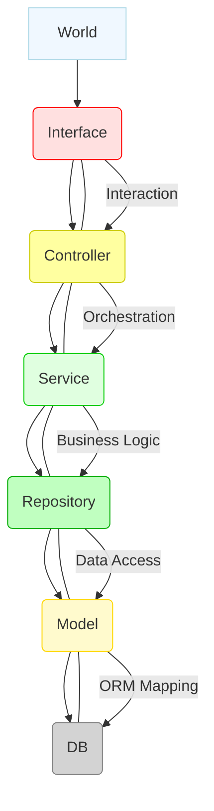

# Testing

---

## ORM Testing Principles & Strategy

Testing applications that use an Object-Relational Mapper (ORM) necessitates **avoiding direct interaction with the real application database**. This practice is crucial for ensuring test reliability and maintaining data integrity.

**Preferred Strategies:**
1.  **Mocking the Persistence Layer:** This involves simulating ORM-database interactions with predefined behaviors, enabling fast, isolated unit tests.
2.  **Separate, Isolated Test Database:** When mocking is not feasible, utilizing a dedicated in-memory SQLite `DataSource` allows for more realistic integration and end-to-end scenarios. Crucially, the **production database must never be used for testing**.

**Testing Focus:**
*   **Entities (Models):** These generally **do not require direct testing**, as their correctness is enforced by the ORM itself and the schema.
*   **Repositories and Services:** These are the **primary targets for comprehensive testing** due to their encapsulation of business logic and data access concerns.
*   **ORM Itself:** One should **avoid testing** the ORM's core functionality; instead, the focus should remain on the application's unique logic.

These principles collectively lead to two main approaches: **Mocking the Repository (for Unit Testing)** to achieve speed and isolation, and employing a **Test `DataSource` (for Integration Testing)** to verify the data layer in a realistic manner.

---

## Repository – Testing

The Repository layer serves to abstract data persistence. Its testing can be approached at different granularities:
1.  **Unit Testing the Repository:** This involves mocking the ORM operations (e.g., `save()`, `findById()`) to verify that the repository correctly invokes the ORM's methods.
2.  **Unit Testing Higher-Level Components:** Here, the entire repository is mocked to isolate higher-level business logic, allowing for focused testing of those components.
3.  **Integration Testing the Repository:** This approach utilizes a dedicated test database (such as an in-memory SQLite instance). While the repository itself is not mocked, its internal ORM operations **must still be mocked** to precisely control specific database interactions.

---

## Mocking the Persistence Layer

Mocking replaces the ORM's native repository methods with custom mock functions (e.g., using Jest). This technique simulates database interactions without requiring an actual database connection.

**Benefits:** Mocking offers significant advantages, including code isolation, no dependency on persistent storage, simplified test setup, and consequently, faster test execution.

### Jest Mocking Methods:

*   **`jest.fn()`:** Creates a **standalone mock function**. It tracks calls and allows for configurable behavior using methods like `mockReturnValue`, `mockResolvedValue`, `mockRejectedValue`, `mockImplementation`, or `mockReturnValueOnce`.
*   **`jest.spyOn()`:** Intercepts methods on existing objects. It tracks calls while optionally allowing the override of the original implementation.
*   **`jest.mock()`:** Replaces an **entire module** with a mocked version. This is commonly used to isolate the unit under test from external module dependencies, such as a database connection.

#### Mocking Example: Mocking Data Source with `jest.mock()`

```typescript
// Define mock functions for common repository operations.
const mockFind = jest.fn();
const mockSave = jest.fn();
const mockRemove = jest.fn();

// Replace '@database' module (which exports AppDataSource)
jest.mock("@database", () => ({
    AppDataSource: {
        getRepository: jest.fn(() => ({
            find: mockFind,
            save: mockSave,
            remove: mockRemove,
        })),
    },
}));
```

#### Mocking Example: Custom Repository Test Setup

```typescript
interface Repository<T> {
    find(options?: any): Promise<T[]>;
    save<T>(entity: T): Promise<T>;
    remove<T>(entity: T): Promise<T>;
}

export class UserRepository {
    private repo: Repository<UserDAO>;

    constructor() {
        this.repo = AppDataSource.getRepository(UserDAO);
    }

    async createUser(username: string, password: string, userType: UserType): Promise<UserDAO> {
        const existingUsers = await this.repo.find({ where: { username } });
        if (existingUsers.length > 0) {
            throwIfConflictFound(`User with username '${username}' already exists`);
        }
        const newUser = new UserDAO();
        newUser.username = username;
        newUser.password = password;
        newUser.type = userType;
        return this.repo.save(newUser);
    }
}
```

#### Mocking Example: Testing `createUser` Method

```typescript
describe('UserRepository', () => {
    beforeEach(() => {
        mockFind.mockClear();
        mockSave.mockClear();
    });

    it("should create a user when username does not exist", async () => {
        mockFind.mockResolvedValue([]);
        const savedUser = { id: 1, username: "John", password: "hashed_pass123", type: UserType.Admin, };
        mockSave.mockResolvedValue(savedUser);

        const userRepository = new UserRepository();
        const result = await userRepository.createUser("John", "pass123", UserType.Admin);

        expect(mockFind).toHaveBeenCalledWith({ where: { username: "John" } });
        expect(mockSave).toHaveBeenCalledWith(expect.objectContaining({
            username: "John",
            password: "pass123",
            type: UserType.Admin,
        }));
        expect(result).toEqual(savedUser);
    });

    it("should throw a conflict error if username already exists", async () => {
        mockFind.mockResolvedValue([{ id: 1, username: "John" }]);
        const userRepository = new UserRepository();

        await expect(userRepository.createUser("John", "pass123", UserType.Admin))
            .rejects
            .toThrow("User with username 'John' already exists");

        expect(mockSave).not.toHaveBeenCalled();
    });
});
```

---

## Test DataSource

A **Test `DataSource`**, typically an in-memory SQLite instance, is **well-suited** for end-to-end or integration tests that require actual database behavior. This database is recreated for each test run to ensure clean states, although it is generally slower than mock-based tests and necessitates proper initialization and cleanup procedures.

---

## SQLite for Testing

**SQLite** is an ideal choice for testing due to its lightweight and serverless nature.
*   **File-based Mode:** In this mode, data persists across sessions (e.g., `database: "database.sqlite"`).
*   **In-memory Mode:** Data is stored solely in RAM and is lost when the connection closes (e.g., `database: ":memory:"`). This mode is **highly beneficial for testing**, offering speed, isolation, and automatic disposability.

---

## Multi-layer Testing

Applications frequently employ layered architectures, which facilitate a clear separation of concerns among different components.

<p align="center">



</p>

### Layer Descriptions:

*   **World:** Represents the external environment, including users and other interacting systems.
*   **Interface Layer:** Responsible for handling external communication, parsing incoming requests, and invoking appropriate middleware.
*   **Controller Layer:** Orchestrates the flow of requests; it calls services and formats responses. Importantly, it **should not contain complex business logic**.
*   **Service Layer:** Contains the core business logic and domain rules. It performs data transformations and throws domain-specific errors.
*   **Repository Layer:** Encapsulates data access operations (e.g., CRUD functions, complex queries via ORM); it may also include light custom logic.
*   **Model Layer:** Defines data structures such as entities, Data Transfer Objects (DTOs), and custom errors. It **lacks active business logic**.
*   **DB (Database):** The persistent data store.

### Testing Interface (Routes) Layer

This layer is primarily responsible for routing requests and delegating them to appropriate handlers. Consequently, **integration testing is highly recommended** using tools like `supertest` to verify HTTP request-response cycles, middleware execution, routing, authentication, HTTP status codes, and the content of response bodies. Unit testing, in contrast, is rarely beneficial for this layer.

### Testing Controller Layer

The Controller layer orchestrates calls to services and repositories, handles their results and errors, and performs data filtering or transformation.
*   **Unit Testing:** To test controllers, **all their dependencies** (services, repositories) should be mocked. This verifies correct method calls, parameter passing, and flow control.
*   **Integration Testing:** This involves using **real service implementations** (and a test `DataSource` if services interact with data) to verify the interaction across a vertical slice of the application.

### Testing Service Layer

This layer contains the core business logic and domain rules. It performs data transformations and appropriately throws domain-specific errors. Being stateless, it is inherently highly testable.
*   **Unit Testing:** To test the service layer, its dependencies (repositories, other services) should be mocked. This verifies business rules, method calls, data flow, error handling, and edge cases.
*   **Integration Testing:** This is valuable for critical business flows. It typically uses either mocked or a dedicated test database to verify interaction with the data layer.

### Testing Model Layer

The Model layer defines data structures such as entities, DTOs, and error classes; however, it **lacks active business logic**. Consequently, direct unit testing of this layer is generally unnecessary, as its correctness is implicitly verified through testing other layers that interact with it.

---

## Jest Framework

**Jest** is a powerful JavaScript testing framework developed by Meta.

**Key Features:** It offers a simple API, built-in mocking and spying capabilities, comprehensive code coverage reporting, parallel test execution, and versatility across various environments (Node.js, TypeScript, React, Vue).

### Jest Configuration

Jest's behavior is managed primarily in `jest.config.ts` (or `jest.config.js`).
*   `preset: "ts-jest"`: Configures Jest to transpile TypeScript files.
*   `testEnvironment: "node"`: Specifies that tests should run in a Node.js environment.
*   `roots: ["<rootDir>/test"]`: Defines the directories where test files are located.
*   `transform`: Dictates how source files are processed before testing.
*   `moduleNameMapper`: Used to map module paths or aliases.

### Jest Coverage Configuration

*   `collectCoverage: true`: Enables the generation of code coverage reports.
*   `collectCoverageFrom`: Specifies glob patterns for files to include in coverage analysis.
*   `coveragePathIgnorePatterns`: Provides regex or glob patterns to exclude certain files (e.g., test files themselves) from coverage reporting.

### Jest Execution

Tests are typically run via `npm test` (which often maps to `jest --coverage` in `package.json`). Specific files can be targeted with `npm test test/path/to/file.ts`.

#### Report Output:

*   **Terminal Summary:** A concise, text-based report displayed directly in the console.
*   **Full HTML Report:** A detailed, interactive report available at `coverage/lcov-report/index.html`, showing line-by-line coverage.

#### Jest Console Report Example:

<p align="center">

| File                              | % Stmts | % Branch | % Funcs | % Lines | Uncovered Line #s |
| :-------------------------------- | :------ | :------- | :------ | :------ | :---------------- |
| All files                         | 72.26   | 30.39    | 40.32   | 72.57   |                   |
| src/app.ts                        | 100     | 100      | 100     | 100     |                   |
| src/utils.ts                      | 48.14   | 22.22    | 22.22   | 28.31   | 28-31, 35-51      |
| src/controllers/authController.ts | 50      | 0        | 0       | 50      | 9-14              |
| src/controllers/userController.ts | 71.42   | 50       | 71.42   |         | 16-17, 21-22      |
| src/middlewares                   | 100     | 0        | 100     | 100     |                   |
| src/middlewares/authMiddleware.ts | 100     | 0        | 100     | 100     | 10                |
| src/middlewares/errorMiddleware.ts| 100     | 100      | 100     | 100     |                   |
| src/repositories                  | 100     | 100      | 100     | 100     |                   |
| src/repositories/userRepository.ts| 100     | 100      | 100     | 100     |                   |
| src/routes                        | 61.85   | 3.7      | 61.05   |         |                   |
| src/routes/authenticationRoutes.ts| 66.66   | 100      | 0       | 66.66   | 9-12              |
| src/routes/gatewayRoutes.ts       | 64.28   | 100      | 0       | 64.28   | 8,13,18,23,28     |
| src/routes/measurementRoutes.ts   | 63.15   | 100      | 0       | 63.15   | 11,19,25,32,48,56 |
| src/routes/networkRoutes.ts       | 64.28   | 100      | 0       | 64.28   | 8,13,18,23,28     |
| src/routes/sensorRoutes.ts        | 64.28   | 100      | 0       | 64.28   | 8,13,18,23,28     |
| src/routes/userRoutes.ts          | 52      | 100      | 25      | 52      | 19,25-29,38-41,51-55 |
| src/services                      | 86.66   | 50       | 90.9    | 86.66   |                   |
| src/services/authService.ts       | 80      | 40       | 100     | 80      | 25,31,39,47,52    |
| src/services/errorService.ts      | 100     | 50       | 100     | 100     | 9-15,19           |
| src/services/mapperService.ts     | 90      | 75       | 83.33   | 90      | 20                |

</p>

**Overall Test Summary:** 1 suite passed, 5 total. 13 tests passed, 13 total. 0 snapshots. Time: 21.636 s.

#### Jest Web Page Report (Overall Summary Example):

<p align="center">

| File                              | Statements | Branches | Functions | Lines |
| :-------------------------------- | :--------- | :------- | :-------- | :---- |
| src                               | 72%        | 22.22%   | 22.22%    | 73.46%|
| src/controllers                   | 62.5%      | 0%       | 40%       | 62.5% |
| src/middlewares                   | 100%       | 0%       | 100%      | 100%  |
| src/repositories                  | 100%       | 100%     | 100%      | 100%  |
| src/routes                        | 61.05%     | 100%     | 3.7%      | 61.05%|
| src/services                      | 86.66%     | 50%      | 90.9%     | 86.66%|

</p>

---

## Creating a Test DataSource

A dedicated test database is essential for conducting isolated and reliable tests without requiring modifications to the application's core code.
*   **Strategy:** Overriding `AppDataSource` with `TestDataSource` (an in-memory SQLite instance) at runtime (e.g., using `Object.assign(AppDataSource, TestDataSource)` within Jest setup hooks) ensures that all application modules transparently utilize the test database.

### `AppDataSource` (Application's Primary)

```typescript
// Example: src/database/connection.ts
import { DataSource } from 'typeorm';
import { CONFIG } => '../config';

export const AppDataSource = new DataSource({
    type: CONFIG.DB_TYPE as any, database: CONFIG.DB_NAME,
    entities: CONFIG.DB_ENTITIES, synchronize: true, logging: false,
    host: CONFIG.DB_HOST, port: CONFIG.DB_PORT,
    username: CONFIG.DB_USERNAME, password: CONFIG.DB_PASSWORD
});
```

### `TestDataSource` (Dedicated Test)

```typescript
// Example: test/setup.ts
import { DataSource } from 'typeorm';
import { CONFIG } from '../src/config';
import { AppDataSource } from '../src/database/connection';

export const TestDataSource = new DataSource({
    type: "sqlite", database: ":memory:",
    entities: CONFIG.DB_ENTITIES, synchronize: true, logging: false
});

export async function initializeTestDataSource(): Promise<void> {
    if (!TestDataSource.isInitialized) {
        await TestDataSource.initialize();
    }
    Object.assign(AppDataSource, TestDataSource); // Crucial: Swap DataSources
}
```

---

## Implementing Tests (Jest Basics)

Jest provides a structured approach to writing tests:
*   **Test Suite (`describe`):** `describe(name, fn)` is used to group related test cases, thereby improving organization and readability.
*   **Test Case (`test` or `it`):** `test(name, fn)` or `it(name, fn)` defines a single, independent unit of behavior to be verified.
*   **Assertions (`expect()`):** `expect(value).toBe(expectedValue)` verifies values or behaviors using various built-in matchers.
*   **Test File Organization:** It is best practice to organize tests with one test file per suite, mirroring the source code structure (e.g., `test/UserRepository.test.ts`).

---

## Test Execution Options (Jest)

Jest offers several options to control test execution:
*   **`.only()`:** Instructs Jest to run *only* the marked test block or suite, skipping all others.
*   **`.skip()`:** Explicitly skips the marked test or suite during execution.
*   **`.todo()`:** Marks a placeholder for a test that is yet to be written.
*   **`.failing()`:** Marks a test that is expected to fail. If it fails as expected, it is reported as "passed (failing)"; if it unexpectedly passes, it is reported as "failed."

---

## Implementing Tests - Mocking (Jest Methods)

Mocking is fundamental for isolating the unit under test, preventing unintended side effects, and simulating various scenarios.

*   **`jest.fn()`:** Creates a standalone mock function. It tracks calls and allows its behavior to be configured with methods such as `mockReturnValue`, `mockResolvedValue`, or `mockImplementation`.
*   **`jest.spyOn()`:** Intercepts an existing method on an object. This allows tracking of method calls while optionally overriding the original behavior.
*   **`jest.mock()`:** Replaces an entire module with a mocked version. This is invaluable for isolating the unit under test from its external module dependencies.

---

## Supertest

**Supertest** is a Node.js library designed for testing HTTP servers and APIs. It achieves this by simulating HTTP requests and inspecting responses without needing a live server instance.

**Key Features:** Supertest enables HTTP request simulation, provides extensive request configuration options, offers comprehensive response inspection capabilities, features a fluent API, and integrates seamlessly with Jest. Its main advantage is simplifying test setup and accelerating test execution.

**Use Cases:** It is commonly employed for End-to-End (E2E) tests, route-level integration tests, and general API verification.

### Supertest Example Usage

```typescript
import request from "supertest";

let token: string; // Obtained in a setup hook

describe("GET /api/v1/users", () => {
    // beforeAll/afterAll hooks for test DB setup/teardown and token acquisition
    it("should get all users with valid authentication", async () => {
        const res = await request(app)
            .get("/api/v1/users")
            .set("Authorization", `Bearer ${token}`);

        expect(res.status).toBe(200);
        expect(res.body.length).toBe(3);
        const usernames = res.body.map((u: any) => u.username).sort();
        expect(usernames).toEqual(["admin", "operator", "viewer"]);
    });

    it("should return 401 if no authentication token is provided", async () => {
        const res = await request(app).get("/api/v1/users");

        expect(res.status).toBe(401);
        expect(res.body).toEqual({ error: "Unauthorized" });
    });
});
```

---

## Testing Asynchronous Code

Correctly testing asynchronous operations is vital for application reliability. Jest offers comprehensive support for these scenarios.

**Best Practices:**
1.  Declare test functions as `async`.
2.  Use `await` for calls that return Promises.
3.  For asynchronous errors, use `rejects.toThrow(...)`.
4.  Prefer `async/await` syntax over the `done()` callback for clarity and conciseness.
5.  Always `await` all Promises, including those within setup and teardown hooks.
6.  Optionally, use `expect.assertions(n)` to ensure a specific number of assertions are executed within an asynchronous test.
7.  Treat `async` test functions as implicitly returning Promises.