# Software Process Models

## Motivation

Software process models organize activities (e.g., requirement gathering, design) and techniques (e.g., UML, programming, testing) to develop software effectively.

---

## Outline

This chapter will cover the following topics:

1.  **Phases and Activities:** A breakdown of the different stages and actions involved in software development.
2.  **Processes and Process Models:** An explanation of what processes are and the various models used to structure them.
3.  **Projects:** How these processes apply to real-world software projects.
4.  **Selection of Process for Project:** Guidance on choosing the most suitable process model for a specific project based on its characteristics.

---

## Phases and Activities

Software development typically progresses through a product life cycle including Development, Deployment, Operation, Maintenance, and Retirement.

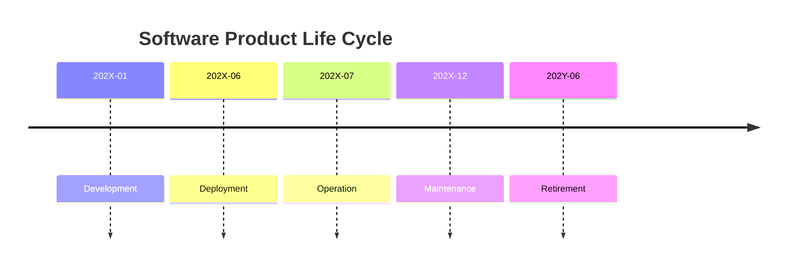

*Figure: Main phases of a software product's life cycle over time (`t`).*

### Development

The Development phase involves sequential activities and inspections: Requirements definition, inspection, and documentation; Design, inspection, and documentation; Implementation (coding), inspection, and testing. Project and Configuration Management oversee all stages.

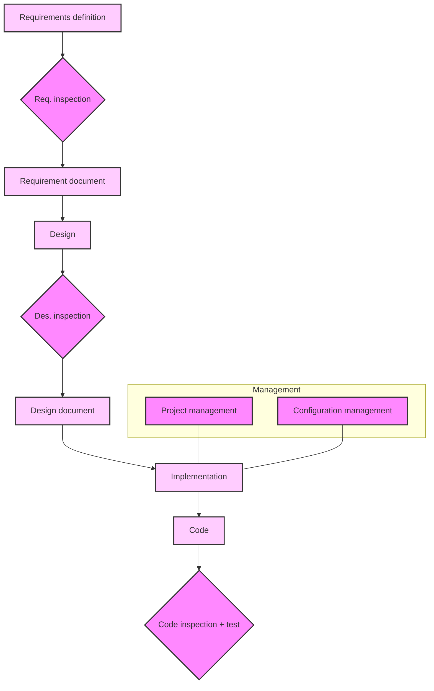

*Figure: Overview of the Development process, including key activities, documents, and inspection points.*

### Maintenance

The Maintenance phase, driven by user feedback or issues, involves ongoing development cycles (e.g., Dev_1, Dev_2, Dev_3). These cycles include revised requirements, design, and implementation/testing, leading to new releases and continuous product evolution during operation.

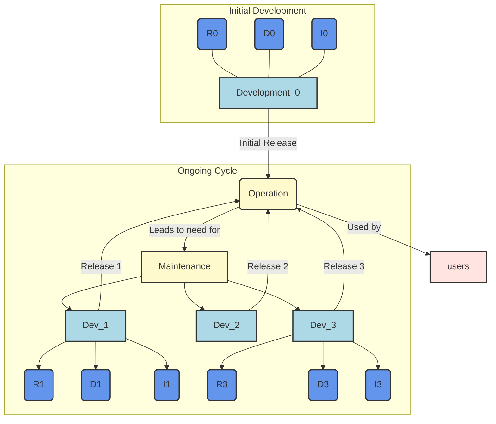

*Figure: The Maintenance process over time, showing initial development, continuous operation, and iterative maintenance efforts (Dev_1, Dev_2, Dev_3) that lead to new releases (R, D, I representing Requirements, Design, Implementation/Test for each iteration).*

### ISO/IEC 12207

ISO/IEC 12207 is an international standard from ISO providing a framework for software lifecycle processes. It identifies processes, responsible entities, and their products.

ISO/IEC 12207 categorizes software lifecycle processes into three types:

```mermaid
graph TD
    A[Primary processes] --> B[Acquisition];
    A --> C[Supply];
    A --> D[Development];
    A --> E[Operation];
    A --> F[Maintenance];

    G[Supporting processes] --> H[Documentation];
    G --> I[Configuration management];
    G --> J[Quality management];

    K[Organisational processes] --> L[Management];
    K --> M[Improvement];
    K --> N[Infrastructure];
    K --> O[Training];

    subgraph ISO/IEC 12207 Categories
        A
        G
        K
    end

    style A fill:#B6A7BA,stroke:#333,stroke-width:2px;
    style B fill:#EDE7F6,stroke:#333,stroke-width:2px;
    style C fill:#EDE7F6,stroke:#333,stroke-width:2px;
    style D fill:#EDE7F6,stroke:#333,stroke-width:2px;
    style E fill:#EDE7F6,stroke:#333,stroke-width:2px;
    style F fill:#EDE7F6,stroke:#333,stroke-width:2px;

    style G fill:#B6A7BA,stroke:#333,stroke-width:2px;
    style H fill:#EDE7F6,stroke:#333,stroke-width:2px;
    style I fill:#EDE7F6,stroke:#333,stroke-width:2px;
    style J fill:#EDE7F6,stroke:#333,stroke-width:2px;

    style K fill:#B6A7BA,stroke:#333,stroke-width:2px;
    style L fill:#EDE7F6,stroke:#333,stroke-width:2px;
    style M fill:#EDE7F6,stroke:#333,stroke-width:2px;
    style N fill:#EDE7F6,stroke:#333,stroke-width:2px;
    style O fill:#EDE7F6,stroke:#333,stroke-width:2px;
```

*Figure: Categorization of processes according to ISO/IEC 12207.*

**Primary Processes** directly involve software creation and operation: Acquisition (managing suppliers), Supply (customer delivery), Development (core creation), Operation (deployment), and Maintenance (ongoing support).

**Supporting Processes** ensure successful execution and quality: Documentation, Configuration Management (change control), and Quality Assurance (Verification and Validation (V&V), customer reviews, internal audits, problem analysis/resolution).

**Organizational Processes** provide framework and infrastructure: Project Management, Infrastructure Management (tools, networks), Process Monitoring and Improvement, and Training.

### Software Development Tasks (ISO/IEC 12207)

Within ISO/IEC 12207, Software Development (Activity 5.3) encompasses various key tasks, such as: Process Instantiation (5.3.1), System Requirements Analysis (5.3.2), System Architecture Definition (5.3.3), Software Requirements Analysis (5.3.4), Software Architecture Definition (5.3.5), Software Detailed Design (5.3.6), Coding and Unit Testing (5.3.7), Integration of Software Units (5.3.8), Software Validation (5.3.9), System Integration (5.3.10), and System Validation (5.3.11). These V&V activities are critical throughout, with specific subtasks defined for:

*   **Coding and Verification of Components (5.3.7.):** Defining test data/procedures, executing/documenting tests, updating documents/planning integration tests, and evaluating tests.
*   **Integration of Components (5.3.8.):** Defining the integration test plan, executing/documenting tests, updating documents/planning validation tests, and evaluating tests.

### ISO 12207 (Characteristics)

ISO 12207 lists activities without prescribing order or approach. It is independent of specific process models, technologies, application domains, or documentation formats, ensuring broad applicability.

---

## Process Models

Software process models structure development activities by defining tasks, documents, roles, responsibilities, temporal constraints, and adherence to external regulations.

A **software process** is a structured set of activities, products (e.g., documents, code), roles (e.g., manager, analyst), and guidelines defining how software is developed. A **process model** is a conceptual framework dictating activity execution, temporal constraints, and responsibilities.

### Process Models (Sources)

Process models can be derived from various sources, including formal standards, industry documents, and established literature.

*   **From Standards / Documents:**
    *   **ISO 15288:** System engineering activities.
    *   **ISO 12207:** Software engineering activities.
    *   **ISO 9001, ISO 9000-3:** Quality management standards.
    *   **CMM-I (Capability Maturity Model Integration):** Process improvement framework.
*   **From Literature:**
    *   **Waterfall:** Traditional linear sequential model.
    *   **RUP (Rational Unified Process):** Iterative and incremental framework.
    *   **Agile:** Iterative and incremental methodologies.

### Mature Company Approach

Typically, mature companies define a general **Company Process Model** derived from industry standards and literature. They then instantiate a specific **Project Process Model**, which is adapted for individual projects. This adaptation considers project criticality, cost, size, technology, and application domain, and is ultimately reviewed by a Quality team.


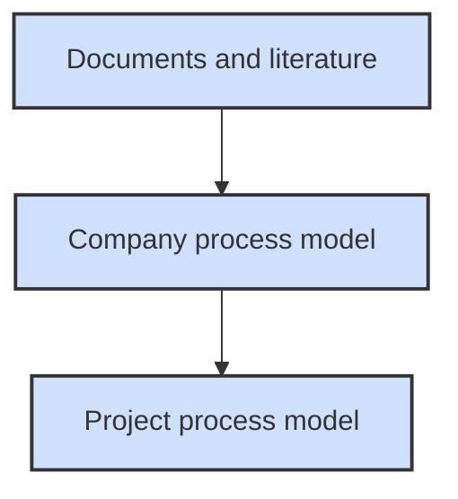

*Figure: Flow showing how a company's process model is derived from standards and literature, and how project-specific models are then instantiated.*

### Process Instantiation

Process instantiation tailors general software development to project needs, prioritizing criticality (safety/mission-critical, non-critical) and size. For example, a Mars mission requires a vastly different process than a mobile game.

### Key Question

The fundamental challenge in software process management is selecting the most suitable model for a given project.

### Process Conformance

**Process conformance** assesses the consistency between the actual process followed during project execution and the formally defined process model for that project. It is crucial for predictability, quality, and control.

### Build and Fix

The **"Build and Fix"** model is an informal, unstructured approach to software development, lacking formal requirements, design, or validation.

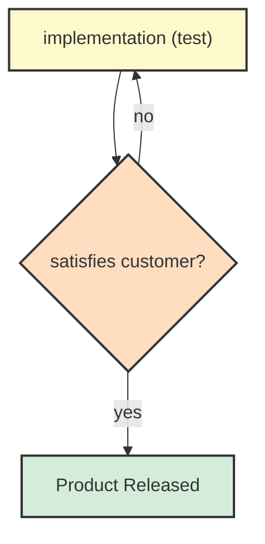

*Figure: The "Build and Fix" process, illustrating an iterative loop of implementation and testing until customer satisfaction is met.*

It may be acceptable for solo or very small, simple projects with clear, stable requirements (or where the developer is the end-user). However, it does not scale for larger projects due to its high risk and complexity management difficulties.

### Models (Main Constraints)

When defining a software process model, key constraints include:

*   **New Development vs. Maintenance:** Models differ significantly.
*   **Compliance to Standards, Laws:** Correlates with software criticality (safety-critical, mission-critical, non-critical).
*   **Size of End Product:** Influences effort, duration, staff size, and team distribution.

### Model Dimensions

Differences among software process models are understood along these dimensions:

*   **New Development vs. Maintenance:** Primary suitability.
*   **Sequential vs. Parallel Activities:** Strict order vs. concurrent tasks.
*   **Iterations (A long one vs. many short ones):** Single large phase vs. small, repeated cycles.
*   **Emphasis on Documents (Yes vs. No):** Formal documentation priority vs. working code.

### Models (New Development vs. Maintenance)

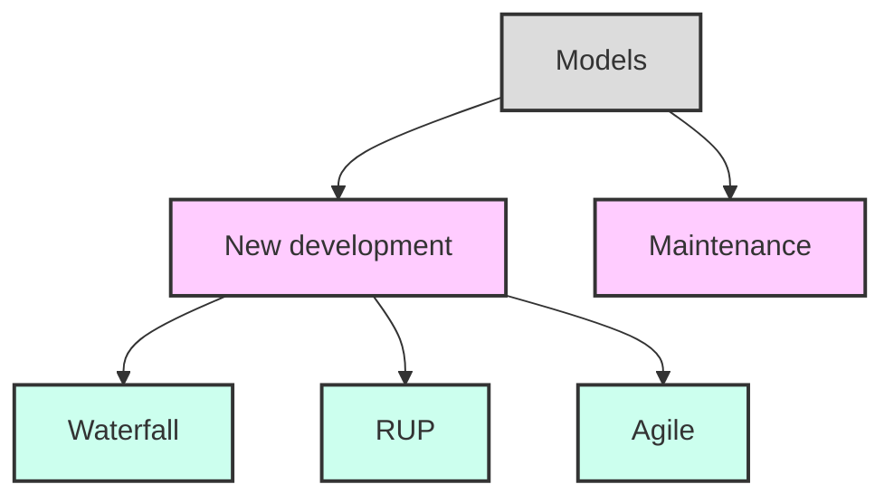

*Figure: A hierarchical view of software process models, broadly categorizing them into New Development and Maintenance, with specific examples under New Development.*

### Models for New Development

For **new software development**, common models and their variants include:

*   **Waterfall and Variants:** Waterfall (linear), Waterfall + Prototype (early prototyping), Incremental (smaller increments).
*   **RUP (Rational Unified Process):** Iterative and incremental, architecture-centric.
*   **Agile:** Flexible, collaborative, rapid delivery (e.g., Scrum, Kanban).
*   **Reuse:** A cross-cutting concept that leverages existing components to accelerate development and improve quality.

### Waterfall Model

The **Waterfall model** is a traditional, linear-sequential software development process. It is characterized by sequential activities, one long iteration, and a strong emphasis on documents.

| Feature                    | Waterfall |
| :------------------------- | :-------- |
| **Sequential/Parallel Activities** | Sequential  |
| **Iterations**             | One, long |
| **Emphasis on Documents**  | Yes       |

Introduced by [Royce 1970], it requires each activity (e.g., requirements, design, implementation) to produce a formal, "frozen" document before the next activity can begin. Progress is measured by document completion.

Despite its structured approach, Waterfall is highly inflexible due to rigid sequentiality and a single long iteration. Changes, especially in early phases (requirements, design), cause a ripple effect requiring subsequent activities to be redone, making them long and expensive. This discourages necessary changes and can lead to bureaucratic processes.

Waterfall is primarily suited for **new developments** where requirements are stable and well-understood upfront, or when **strict compliance** with formal standards and extensive documentation is required (e.g., regulatory compliance). It is best for **large projects** with distributed teams or contractors, requiring clear documentation for coordination.

Examples include the **Automotive and Aerospace Industries**, dealing with thousands of components and hundreds of subcontractors over long development cycles (cars: 2-3 years; airplanes: 3-7 years), necessitating rigorous, structured processes like Waterfall.

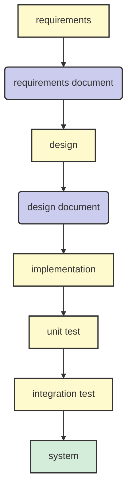

*Figure: A simplified Waterfall model, showing sequential phases: Requirements, Design, Implementation, Unit Test, Integration Test, leading to the final System.*

### Variants of Waterfall

Several variants address Waterfall's limitations while retaining its structured approach:

*   **V-Model:** Emphasizes Verification and Validation (V&V) by pairing each development phase with a corresponding testing phase (e.g., ISO 26262, IEC 61508).
*   **Waterfall + Prototype:** Incorporates an initial prototyping phase to clarify requirements before the main Waterfall sequence.
*   **Incremental:** Breaks the process into smaller, successive increments, each delivering a working subset of the system.

### V-Model

The **V-Model** is a sequential software development process similar to Waterfall, but it strongly emphasizes **Verification and Validation (V&V)**. Each development phase on the 'left side' of the V (e.g., requirements, design, implementation) has a corresponding testing or validation phase on the 'right side.' Acceptance tests are written after/concurrently with requirements; Unit/Integration tests after/during design.

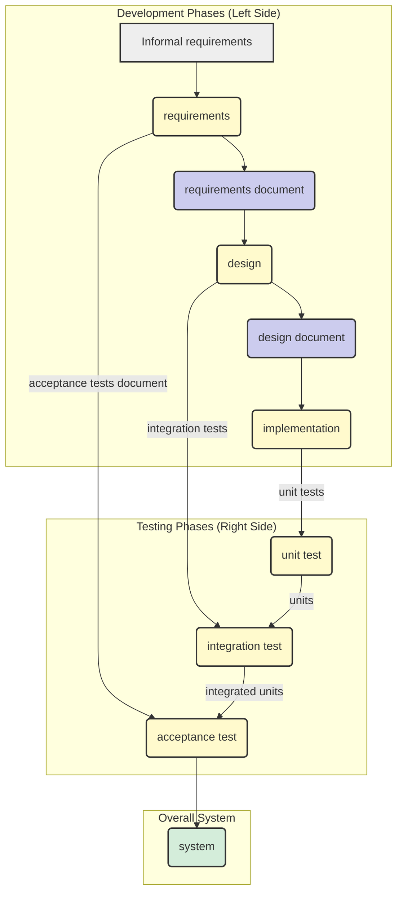

*Figure: The V-Model, illustrating the corresponding test phases for each development phase. Informal requirements lead to formal requirements, which are validated by acceptance tests. Design is validated by integration tests, and implementation by unit tests, all progressing towards the final system.*

### ISO 26262, IEC 61508

ISO 26262 and IEC 61508 are system process models for functional safety in critical domains. **IEC 61508** introduces **Safety Integrity Level (SIL)** (1-4). **ISO 26262** adapts SIL to **Automotive Safety Integrity Level (ASIL)** (A-D, D being highest risk/rigor) for road vehicle E/E systems, derived from IEC 61508.

ISO 26262 is structured into multiple parts covering vocabulary, functional safety management, concept phase, product development (system, hardware, software levels), production/operation, supporting processes, and ASIL determination.

The **Safety Lifecycle** (ISO 26262) integrates functional safety from hazard analysis, functional/technical safety concept definition, through parallel system, hardware, and software development streams, with integrated verification, production, operation, service, and decommissioning phases. ASIL rating dictates rigor.

The **Software Lifecycle** within these standards often uses a V-Model variant. The left side involves development and decomposition: System Design, Software Safety Requirements, Software Architectural Design, Software Unit Design and Implementation. The right side involves integration and verification: Software Unit Testing, Software Integration and Testing, Verification of Software Safety Requirements, Item Integration and Testing, and Item Testing. This meticulous pairing ensures thorough V&V.

### Prototyping + Waterfall

The **Prototyping + Waterfall** model is a hybrid approach that integrates an early prototyping phase to mitigate Waterfall's rigidity. A rapid, simplified prototype is built to clarify and validate requirements with users. Once requirements are clear, the project proceeds with the traditional Waterfall sequence.

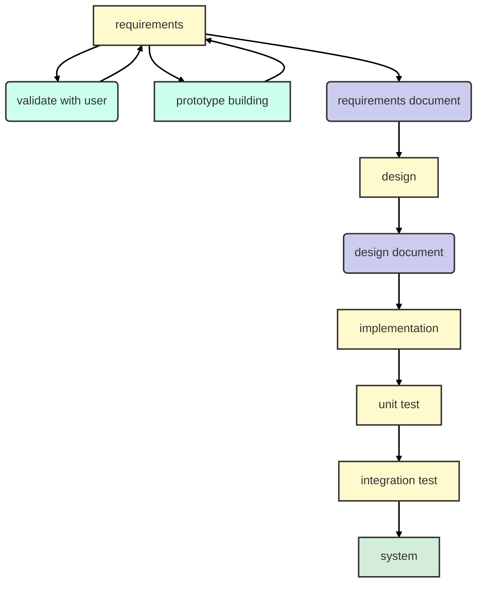

*Figure: Prototyping + Waterfall Model. An iterative loop for requirements validation and prototype building precedes the standard Waterfall phases.*

**Advantages**: Clarifies requirements early, reducing ambiguities.
**Problems**: Requires specific skills; often leads to business pressure to evolve the prototype directly into the final product, incurring technical debt.

Prototypes can vary in scope (less functions) and platform (e.g., Java on PC for C embedded system, or Matlab for simulation). Prototyping can extend to GUI, design (testing architectural concepts), and performance.

### Incremental Model

The **Incremental model** breaks a project into multiple, sequential iterations, each delivering a working subset of the system. Unlike Waterfall's single, end-of-project integration, Incremental splits integration, producing parts of the system in several 'builds' over time.

**Advantages**: Earlier, continuous user/customer feedback; delayed dependencies (e.g., external components) do not block other progress.

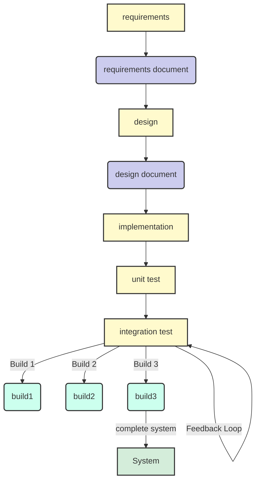

*Figure: Incremental Model, showing how the integration test phase repeatedly produces builds (increments) that contribute to the complete system.*

**Example Scenario**: A project with R1, R2, R3 and C1, C2, C3, C4 over three iterations. Iteration 1 delivers R1 (C1, C2). Iteration 2 delivers R2 (C1, C2, C3). Iteration 3 delivers R3 (C1, C2, C3, C4), completing the system incrementally.

### Comparison (Waterfall vs. Incremental)

| R | D | C | UT | IT | ST |
|---|---|---|----|----|----|
|   |   |   |    |    | Release |

*Represents a single, long sequence of phases leading to one release.*

**Incremental Model:**

| R | D | C | UT | IT (build1) | ST | C | UT | IT (build2) | ST |
|---|---|---|----|-------------|----|---|----|-------------|----|
|   |   |   |    | Release     |    |   |    | Release     |    |   |    | Release     |    |

*Illustrates multiple smaller cycles, each resulting in a release (build), and contributing to the complete system.*

### Rational Unified Process (RUP)

The **Rational Unified Process (RUP)** is an iterative and incremental software development framework, proposed in 1999 by Grady Booch, Ivar Jacobson, and James Rumbaugh (UML creators). It emphasizes an architecture-centric approach and iterative, incremental development.

| Feature                    | RUP                       |
| :------------------------- | :------------------------ |
| **Sequential/Parallel Activities** | Parallel                  |
| **Iterations**             | One, long with sub-iterations |
| **Emphasis on Documents**  | Partial                   |

RUP structures the project lifecycle into four sequential **Phases**, each with distinct goals and multiple iterations, where various **Workflows/Disciplines** (e.g., Business Modeling, Requirements, Analysis & Design, Implementation, Test, Deployment, Configuration & Change Management, Project Management, Environment) occur with varying intensity:

1.  **Inception:** Establishes project scope, feasibility, and business case (e.g., initial risk analysis, core requirements).
2.  **Elaboration:** Develops core architecture, refines critical requirements, and mitigates high risks (e.g., detailed requirement/risk analysis, architecture definition).
3.  **Construction:** Builds the bulk of the system incrementally (e.g., detailed analysis, design, coding, testing).
4.  **Transition:** Delivers the system to end-users for production readiness (e.g., beta testing, performance tuning, user training).

The "hump chart" (not recreated) visualizes workflows' intensity changing across these phases (e.g., Inception peaks in Business Modeling/Requirements; Construction in Implementation/Test). Project Management and Environment are ongoing.

#### Time Sheet - Sequential

| Week        | Requirement Engineering | Design | Coding | Unit Testing | Integration Testing | Acceptance Testing |
| :---------- | :---------------------- | :----- | :----- | :----------- | :------------------ | :----------------- |
| Apr 13 - 19 | 8                       |        |        |              |                     |                    |
| Apr 20 - 27 |                         | 4      |        |              |                     |                    |
| Apr 28 - 3  |                         |        | 6      |              |                     |                    |
| May 4 - 10  |                         |        |        | 25           |                     |                    |
| May 11 - 17 |                         |        |        |              | 25                  |                    |

*Units are likely "person-days" or similar effort metrics.*

#### Time Sheet - Parallel

| Week        | Requirement Engineering | Design | Coding | Unit Testing | Integration Testing | Acceptance Testing | Management | Git/Maven |
| :---------- | :---------------------- | :----- | :----- | :----------- | :------------------ | :----------------- | :--------- | :-------- |
| Apr 13 - 19 | 40                      | 25     |        |              |                     |                    | 15         | 5         |
| Apr 20 - 27 |                         | 20     |        |              |                     |                    | 5          |           |
| Apr 28 - 3  |                         |        | 8      | 6            |                     |                    | 6          |           |
| May 4 - 10  |                         |        | 7      | 8            |                     |                    | 4          |           |
| May 11 - 17 | 1                       | 3      | 2      | 5            |                     |                    | 11         |           |
| May 18 - 24 |                         |        |        |              |                     |                    |            |           |

*Units are likely "person-days" or similar effort metrics.*

### Comparison (Waterfall, Incremental, RUP)

**Waterfall Model:**

| R | D | C | UT | IT | ST |
|---|---|---|----|----|----|
|   |   |   |    |    | Release |

**Incremental Model:**

| R | D | C | UT | IT (build1) | ST | C | UT | IT (build2) | ST |
|---|---|---|----|-------------|----|---|----|-------------|----|
|   |   |   |    | Release     |    |   |    | Release     |    |

**RUP (Rational Unified Process):**

| R |
|---|
| D |
|---|
| C |
|---|
| T |
| Release |

| R |
|---|
| D |
|---|
| C |
|---|
| T |
| Release |

*Note: The vertical stacking in RUP represents activities that can overlap and iterate within a phase, leading to intermediate releases.*

RUP is primarily suited for **new developments**, especially large and complex ones, and supports **partial compliance**. It is highly suitable for **large projects**, including those with distributed teams where structured iterations aid coordination.

### Agile

**Agile** refers to a group of iterative and incremental software development methodologies (e.g., Scrum, Extreme Programming) that prioritize flexibility, collaboration, and rapid delivery of working software over traditional, document-heavy approaches.

**Key Characteristics**: Very lean requirements and design; requirements can change per iteration. Emphasizes clean code and automated tests. Features continuous integration from day one. Structured in short, time-boxed iterations (typically 4 weeks).

### Comparison (Waterfall, Incremental, RUP, Agile)

| R | D | C | UT | IT | ST |
|---|---|---|----|----|----|
|   |   |   |    |    | Release |

**Incremental Model:**

| R | D | C | UT | IT (build1) | ST | C | UT | IT (build2) | ST |
|---|---|---|----|-------------|----|---|----|-------------|----|
|   |   |   |    | Release     |    |   |    | Release     |    |

**RUP (Rational Unified Process):**

| R |
|---|
| D |
|---|
| C |
|---|
| T |
| Release |

| R |
|---|
| D |
|---|
| C |
|---|
| T |
| Release |

**Agile:**

| R |
|---|
| D |
|---|
| C |
|---|
| T |
| Release |

| R |
|---|
| D |
|---|
| C |
|---|
| T |
| Release |

| R |
|---|
| D |
|---|
| C |
|---|
| T |
| Release |

| R |
|---|
| D |
|---|
| C |
|---|
| T |
| Release |

The Agile approach to software development emphasizes flexibility and rapid delivery.

| Feature                    | Agile       |
| :------------------------- | :---------- |
| **Sequential/Parallel Activities** | Parallel    |
| **Iterations**             | Many, short |
| **Emphasis on Documents**  | No          |

Agile is applicable to **both new development and maintenance**. It is generally **not suitable** for projects requiring strict, heavy compliance due to low documentation emphasis. Best suited for **small projects** and **co-located teams** that benefit from frequent face-to-face communication.

### Suitability (Comparative Overview)

This table provides a comprehensive overview of how different process models align with key process attributes and suitability criteria:

| Process Attribute                 | Waterfall                                        | RUP                                        | Agile                                |
| :-------------------------------- | :----------------------------------------------- | :----------------------------------------- | :----------------------------------- |
| **Sequential/Parallel Activities** | Sequential                                       | Parallel                                   | Parallel                             |
| **Iterations**                    | One, long                                        | One, long with sub-iterations              | Many, short                          |
| **Emphasis on Documents**         | Heavy                                            | Mild                                       | No                                   |
| **New Development / Maintenance** | Mostly new developments                          | Mostly new developments                    | Both                                 |
| **Compliance**                    | Yes                                              | Partial                                    | No                                   |
| **Size**                          | Large projects, distributed teams and contractors | Also large projects, distributed teams     | Small projects, co-located teams     |
| **Colocation Staff**              | Less critical                                    | -                                          | Yes                                  |

---

## Reuse

**Reuse** involves leveraging existing components, code, or assets. Most projects reuse open/closed source, free/licensed components.

**Advantages**: Immediate availability, often higher quality, and lower cost.
**Disadvantages**: May lack full source ownership, requires trade-offs in requirements/design, and means loss of control over component evolution.

**Process Implications**: Early consideration of component availability and adaptability of requirements are crucial. Design must integrate components, and implementation involves writing 'glue' code. For example, an accounting package might sacrifice PNG/JPG support to use a cheaper, faster PDF component.

### Reuse - Example Trade-off in Requirements

| Option       | No Reuse                                    | Component 1                                   | Component 2                                   |
| :----------- | :------------------------------------------ | :-------------------------------------------- | :-------------------------------------------- |
| **R1 Support** | PDF, PNG, JPG (all formats supported)       | Yes PDF, JPG, No PNG (PNG not supported)      | Yes PDF, PNG, No JPG (JPG not supported)      |
| **Cost**     | 50 (e.g., in thousands of currency units)   | 10 (e.g., in thousands of currency units)     | 12 (e.g., in thousands of currency units)     |
| **Time**     | 3 months                                    | 1 month                                       | 1 month                                       |

---

## New Development Process Models and Project Management

The chosen software process model significantly impacts project management and the customer-vendor relationship. Waterfall aligns with **fixed-price models** (detailed upfront requirements, fixed price/duration, changes discouraged/costly). Agile suits **time-and-material models** (customer pays for effort/resources, flexible requirements).

### Fixed Price vs. Time and Material (Contract Models)

| Feature            | Fixed Price                                                                            | Time and Material                                                                |
| :----------------- | :------------------------------------------------------------------------------------- | :------------------------------------------------------------------------------- |
| **Agreement Basis** | Customer & developer agree on price and duration based on a **detailed requirements document**. | Customer pays for the **amount of time (effort)** and **material** used by the developer. |
| **Requirements**   | Defined **in detail, upfront**.                                                        | Defined **loosely**.                                                             |
| **Requirement Change** | **Discouraged**. Requires changes to the contract (price and duration renegotiation). | **Possible**.                                                                    |
| **Price**          | Defined and agreed **before project start**.                                           | Computed **at project end**.                                                     |
| **Duration**       | Defined and agreed **before project start**.                                           | Defined **at project end**.                                                      |

### Estimation (Waterfall vs. Agile)

| Model         | Estimation Approach                                                                                                  |
| :------------ | :------------------------------------------------------------------------------------------------------------------- |
| **Waterfall** | **Requirements → Effort:** Effort is estimated based on detailed requirements.                                       |
|               | **Effort → Cost:** Cost is then derived from the estimated effort.                                                   |
| **Agile**     | **Requirements (very high level) → Number of Iterations:** Initial planning estimates the number of iterations based on high-level requirements. |
|               | **Iteration → Effort → Cost:** The cost of an iteration is estimated (effort), and total cost is derived from the number of iterations. |

### Contract (Waterfall vs. Agile)

| Contract Aspect    | Waterfall – Fixed Price (and Duration)                                                                                                                  | Agile – Time and Material                                                                                           |
| :----------------- | :------------------------------------------------------------------------------------------------------------------------------------------------------ | :------------------------------------------------------------------------------------------------------------------ |
| **Contract Content** | Includes a **legal part of the contract** plus a **technical annex**. The technical annex contains a rigid, detailed description of the project's result (which equates to the requirements). | Requirements, by definition of Agile, **can change** during the project. The contract must accommodate this flexibility. |
| **Parties' Goal**  | The goal of both parties (customer and vendor) is to **stick rigidly to the contract**. Variations in requirements typically necessitate **renegotiation of the contract** (impacting price and duration). | The contract can only describe the **agreed cost of personnel** (e.g., cost per person for one iteration). It focuses on resource provision rather than a fixed scope. |

---

## Maintenance Process

The **maintenance process** is centered on **change**. Changes can be: a defect (corrective), a modification to existing features (perfective), or a new feature (evolutive/enhancement).

Changes originate from end users or developers and are processed by maintainers. Software products evolve through continuous changes, typically with regular major releases (e.g., every few months) and minor/critical releases for urgent fixes. This evolution is managed via baselines: **Stable Baseline (Master)** for current releases, and **Working Baseline (Develop)** for ongoing changes.

A common Gitflow branching strategy involves `master` (release history), `develop` (next release), `feature` (new features), `release` (release preparation/hotfixes), and `hotfix` (critical bug fixes for released versions) branches.

### Process (for Change Requests)

The change request (CR) process in maintenance typically involves these structured steps:

1.  **Receive CR:** Initial submission (bug report, modification request).
2.  **Filter CRs:** Merge similar/duplicate requests, discard unfeasible/incorrect ones.
3.  **Assess CRs:** Evaluate impact (effort, cost, feasibility, architectural/functional impact) and rank by importance (severity for corrective, value for evolutive).
4.  **Assign CR:** Assign to maintainer/team from prioritized list.
5.  **Implement CR:** Maintainer designs, codes, unit tests, and integrates the change.
6.  **System Test:** Quality group conducts broader system test.
7.  **Insert in Next Release:** Prepare implemented change for inclusion in next release.

### Issues (in Maintenance)

Challenges in maintenance include:

*   **Product Evolution and Architecture Erosion:** Continuous changes can degrade original structure over time, necessitating architectural control.
*   **Suitability for Market/Users:** Continuous control is needed to align changes with evolving user needs and market.
*   **Partial Implementation of CRs:** Resource constraints or prioritization often result in unaddressed issues.

### Roles: Service Desk (Help Desk)

The **Service Desk (Help Desk)** is the primary entry point for Change Requests (CRs), receiving them from direct user input (tools like Git Issues), call centers, or automated systems (e.g., crash reports).

After filtering, CRs are ranked for priority by a board (product architect, market analyst, quality responsible) or a project manager. A project manager then assigns CRs to maintainers, or maintainers pick from the ranked list.

### Tools to Support Change Process

Common software tools supporting change management:

*   Jira
*   Trac
*   Redmine
*   Pivotal Tracker
*   Zenhub
*   Gitlab - Issues
*   Bugzilla

### Gitlab - Issues (Overview)

GitLab Issues provides a web-based interface for tracking work and collaborating on changes. Users can create, track status, categorize, label (e.g., Open, To do, Doing, Done; Defect, Enhancement, Evolution), discuss, and link issues, with powerful search/filtering.

### Example Trac

**Trac** is an open-source, web-based project management and bug tracking system. Change requests are managed as 'tickets'.

A 'Create New Ticket' form requires fields like summary, type, description, priority, component, milestone, version, and assignee.

The 'Active Tickets' view displays active tickets in a tabular format with ID, summary, component, version, milestone, type, owner, creation/update dates.

An 'Open Ticket' view shows full details: ID, summary, properties (reporter, owner, priority), description, attachments, and change history.

A Trac demo is available at `http://www.hosted-projects.com/trac/TracDemo/Demo` (user: `demo`, pass: `demo`).

### Lifecycle for Change

The **Lifecycle for Change** describes states a change request (or bug) transitions through from report to resolution.

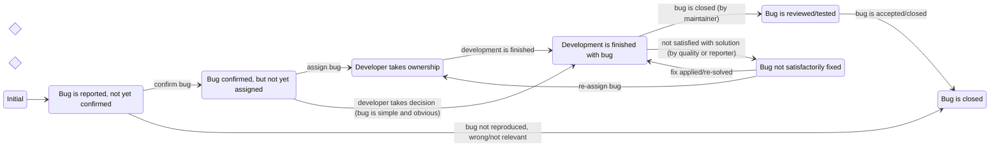

*Figure: State Diagram illustrating a typical Lifecycle for Change (e.g., a bug or issue).*

**States and Transitions:**

*   **Initial:** Problem reported.
*   **Unconfirmed:** Awaiting confirmation. Transitions to **New** (confirmed) or **Closed** (not reproduced/irrelevant).
*   **New:** Confirmed, unassigned. Transitions to **Assigned** (developer takes ownership) or **Resolved** (quick fix).
*   **Assigned:** Developer working. Transitions to **Resolved** (work completed).
*   **Resolved:** Developer believes fixed. Transitions to **Verified** (fix reviewed/tested) or **Reopen** (fix unsatisfactory).
*   **Verified:** Fix reviewed/tested. Transitions to **Closed** (officially closed).
*   **Reopen:** Fix inadequate. Transitions to **Assigned** (reassigned) or **Resolved** (new fix).
*   **Closed:** Permanently closed.

---

## DevOps

**DevOps** is a cultural and professional movement aiming to improve collaboration between software development (Dev) and IT operations (Ops) teams by removing communication and knowledge barriers, fostering an integrated, efficient software delivery pipeline.

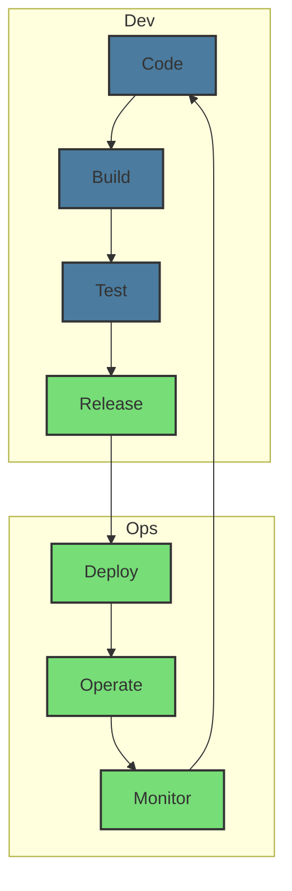

*Figure: Conceptual representation of the DevOps Infinity Loop. Dev activities (Code, Build, Test) flow into Ops activities (Release, Deploy, Operate, Monitor), with monitoring providing feedback back to coding, creating a continuous cycle of improvement and delivery.*

**Before DevOps**, Dev and Ops were separate organizational units, leading to manual integration and deployment, knowledge transfer gaps, and long delays in product evolution (e.g., e-commerce deployments once per week with downtime).

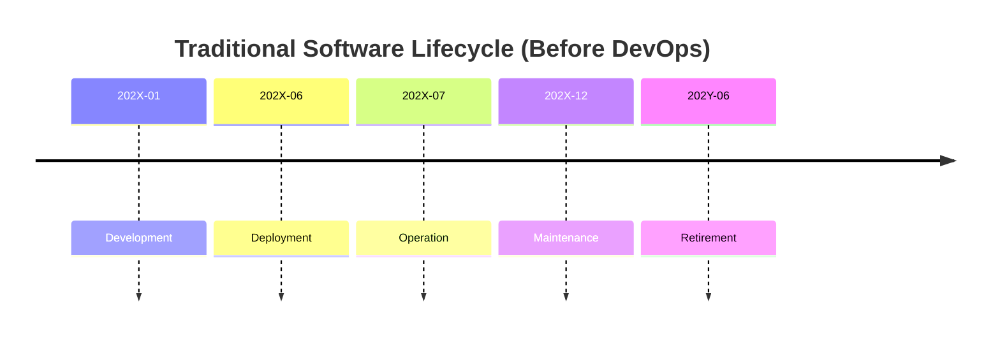

*Figure: Traditional software lifecycle before DevOps, where phases are distinct and often managed by separate teams.*

**DevOps (Culture & Practices)** fosters shared responsibility and collaboration. Practices include: automated build, deployment, and testing; CI/CD (Continuous Integration, Continuous Deployment); microservices architecture; and Infrastructure as Code (IaC). For example, an e-commerce platform post-DevOps achieves many deployments per day with no downtime using automation tools (e.g., Octopus, Jenkins).

---

## Real Cases

### Ferrari (Racing Division)

**Ferrari's Racing Division** develops highly specialized software for car operation (e.g., ECU embedded software for Power Unit, Gearbox, Brakes) and support tools (e.g., simulation, telemetry, configuration, pit stop control).

Roles include **Mechanical Engineers** and **Software Engineers** (Application/Control Theory, Embedded, PC).

The **process** uses Simulink/Stateflow models, translated to C, compiled to Freescale assembly, extensively configured, and uploaded as firmware to ECUs.

It operates on an extremely **tight schedule**: 2 weeks between races (Requirements: 2 days, Coding: 2 days, Test: 4 days, FIA freezing: 3 days, Race: 3 days).

A single Formula 1 season (March-November) involves continuous, high-pressure maintenance, producing ~300 embedded code versions, ~100 tool versions, and processing ~1000 change requests. Defect characteristics: few trivial bugs, tens of conceptual defects (requirement misunderstanding).

**Key Challenges**: Extremely tight schedule; crucial interdisciplinary communication and understanding between Mechanical and Software Engineers for complex mechanical/control issues.

### Apache (and Linux, Mozilla, ..)

Open-source projects like **Apache** (Linux, Mozilla) follow an evolution/maintenance-driven process, spanning many years (>10) and relying on continuous community contributions via tools like GitHub (since 2019), mailing lists, and Bugzilla for bug tracking. Products include source code, test cases, and community discussions.

As per [Mockus 2000], roles include a small **Core Team** (2-8) for architecture, requirements, integration/build, and releases; **Patch Developers** (10-100) contributing fixes/features; and **Bug Providers** (100-1000+) reporting issues. Users download and utilize the software.

**Key Success Factors**: Strict configuration management (despite limited formal documentation), effective bug/change tracking tools, clear hierarchy of roles, and highly motivated core developers. They typically lack formal project, quality, or comprehensive requirement documents.

### Lucent

**Lucent Technologies** (later Alcatel-Lucent, then Nokia Networks) was a major telecom network producer managing long-term software evolution. The **5ESS telephone switching system** is an example: a 100 MLoc C/C++ codebase with 50 subsystems, maintained for 20 years, with team size fluctuating from 200 to 50 developers.

Changes in 5ESS were organized hierarchically: Features (composed of many IMRs) -> IMRs (Initial Modification Requests) (logical change units, many MRs) -> MRs (Modification Requests) (functionally independent units, one developer).

Tools used were IMRTS for Features/IMRs, ECMS for MRs (tracking parent IMR, date, affected files, rationale), and SCCS for configuration management of code changes (deltas).

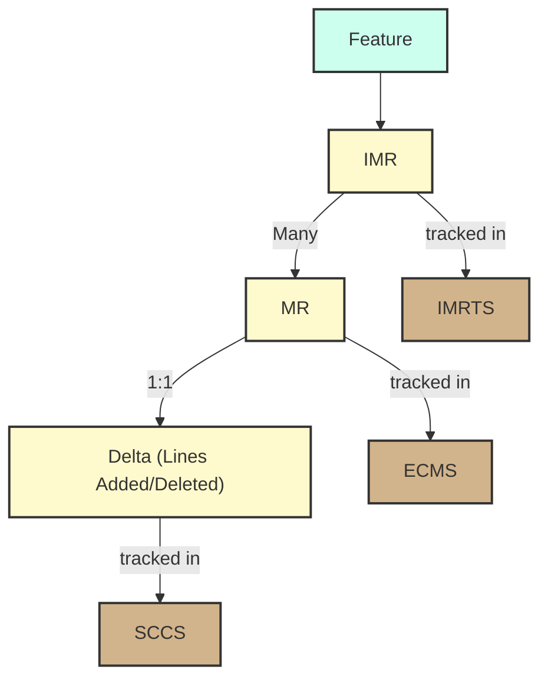

*Figure: Hierarchy of changes in a large system like Lucent's 5ESS, from high-level features down to individual code modifications, and the tools used to track them.*

### Motorola GSG

**Motorola's Global Software Group (GSG)** (<2011) provided horizontal software development support across 16 global sites (e.g., Mobile Phones, Networks, Set Top Boxes). GSG aimed for CMMI Level 5 across all centers, driven by core 'inviolate' principles. These included: Project Planning & Tracking, Process Framework, Previews and Post Mortems, Records and Metrics, Quality Control (Review & Test), and Configuration Management.

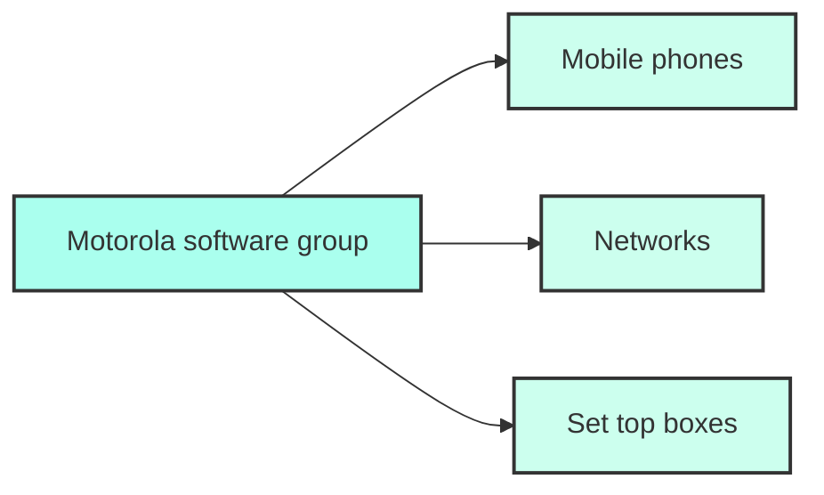

*Figure: Conceptual structure of Motorola's Global Software Group (GSG), providing horizontal software development support to various product lines like Mobile Phones, Networks, and Set Top Boxes.*

The **Process Framework** mandated a structured flow for each activity: Gather Inputs -> Development -> Capture Results (Artifacts) -> Quality Gate -> Store Outputs -> SCM Repository. Previews occurred before, Post mortems after activities.

```mermaid
graph TD
    Gather[Gather Inputs] --> Development[Development Activity];
    Development --> Capture["Capture Results (Artifacts)"];
    Capture --> QualityGate[Quality Gate];
    QualityGate --> Store[Store Outputs];
    Store --> SCM[SCM Repository];
    SCM --> Gather;

    Preview[Preview] -- before --> Gather;
    Postmortem[Postmortem] -- after --> Store;

    subgraph Per Activity Flow
        Gather
        Development
        Capture
        QualityGate
        Store
    end

    ForAct[For each activity] --> Gather;

    style Gather fill:#9b59b6,stroke:#333,stroke-width:2px;
    style Development fill:#e67e22,stroke:#333,stroke-width:2px;
    style Capture fill:#e67e22,stroke:#333,stroke-width:2px;
    style QualityGate fill:#3498db,stroke:#333,stroke-width:2px;
    style Store fill:#9b59b6,stroke:#333,stroke-width:2px;
    style SCM fill:#2c3e50,stroke:#333,stroke-width:2px;
    style Preview fill:#ADD8E6,stroke:#333,stroke-width:2px;
    style Postmortem fill:#ADD8E6,stroke:#333,stroke-width:2px;
    style ForAct fill:#F0F8FF,stroke:#333,stroke-width:2px;
```

*Figure: Motorola GSG's Inviolate Process Framework. Each activity follows a structured flow from input gathering to output storage, with mandatory quality gates and integration with an SCM Repository.*

**Quality Control** was integrated, with the Quality Gate including mandatory Peer Review and Testing.

```mermaid
graph TD
    Gather[Gather Inputs] --> Development[Development Activity];
    Development --> Capture["Capture Results (Artifacts)"];
    Capture --> QualityGate[Quality Gate];
    QualityGate --> Store[Store Outputs];
    Store --> SCM[SCM Repository];
    SCM --> Gather;

    QualityGate -- includes --> PR[Peer Review];
    QualityGate -- includes --> T[Testing];

    subgraph Per Activity Flow
        Gather
        Development
        Capture
        QualityGate
        Store
    end

    ForAct[For each activity] --> Gather;

    style Gather fill:#9b59b6,stroke:#333,stroke-width:2px;
    style Development fill:#e67e22,stroke:#333,stroke-width:2px;
    style Capture fill:#e67e22,stroke:#333,stroke-width:2px;
    style QualityGate fill:#3498db,stroke:#333,stroke-width:2px;
    style Store fill:#9b59b6,stroke:#333,stroke-width:2px;
    style SCM fill:#2c3e50,stroke:#333,stroke-width:2px;
    style PR fill:#ADD8E6,stroke:#333,stroke-width:2px;
    style T fill:#ADD8E6,stroke:#333,stroke-width:2px;
    style ForAct fill:#F0F8FF,stroke:#333,stroke-width:2px;
```

*Figure: Motorola GSG's Inviolate Quality Control. The Quality Gate includes mandatory Peer Review and Testing for all captured results.*

**Records and Metrics** were systematically collected at the Quality Gate for continuous process measurement and improvement.

```mermaid
graph TD
    Gather[Gather Inputs] --> Development[Development Activity];
    Development --> Capture["Capture Results (Artifacts)"];
    Capture --> QualityGate[Quality Gate];
    QualityGate --> Store[Store Outputs];
    Store --> SCM[SCM Repository];
    SCM --> Gather;

    QualityGate -- Triggers --> Measurement(Measurement);

    subgraph Per Activity Flow
        Gather
        Development
        Capture
        QualityGate
        Store
    end

    ForAct[For each activity] --> Gather;

    style Gather fill:#9b59b6,stroke:#333,stroke-width:2px;
    style Development fill:#e67e22,stroke:#333,stroke-width:2px;
    style Capture fill:#e67e22,stroke:#333,stroke-width:2px;
    style QualityGate fill:#3498db,stroke:#333,stroke-width:2px;
    style Store fill:#9b59b6,stroke:#333,stroke-width:2px;
    style SCM fill:#2c3e50,stroke:#333,stroke-width:2px;
    style Measurement fill:#ADD8E6,stroke:#333,stroke-width:2px;
    style ForAct fill:#F0F8FF,stroke:#333,stroke-width:2px;
```

*Figure: Motorola GSG's Inviolate Records and Metrics. The Quality Gate triggers measurement activities, emphasizing data-driven process management.*

### Synch and Stabilize

The **Synch and Stabilize** model, used by Microsoft (1993-1995) for complex products like Windows 95, addresses the need for rapid time-to-market when requirements and design cannot be fixed early. It involves continually synchronizing parallel teams and periodically stabilizing the product in increments.

**Approach**: Development is iterative, allowing design/requirements changes. Small, focused feature teams (e.g., 1 PM, 3-8 devs, 3-8 testers) work in parallel, maintaining a 'hacker culture' valuing rapid prototyping and direct coding. They synchronize code frequently and test changes immediately (1 tester:1 developer).

**Three Phases**:

1.  **Planning:** Product Managers define a Vision Statement (goals, prioritized user activities) and create a high-level specification, schedule, and feature team structure.
2.  **Development:** Plan 3-4 subprojects (2-4 months each) with buffer time. Multiple feature teams concurrently design, code, and debug, starting with critical/shared features. Feature sets can change by 30%+. Teams perform full dev cycles (design, code, debug, integrate, test, fix). Testers are paired with developers. Daily/weekly builds ensure continuous integration and error fixing. Subprojects conclude with a product stabilization round of testing.
3.  **Stabilization:** Internal testing of the complete product, followed by external testing (beta sites, ISVs, OEMs, end-users), and final release preparation (documentation, localization).

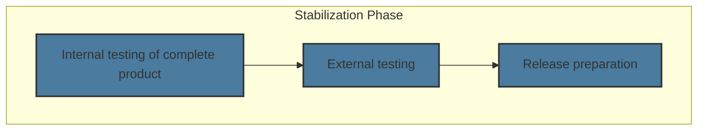

*Figure: Phases of the Stabilization Phase, moving from internal testing to external validation and final release preparation.*

**Core Principles**: Divide projects into cycles with 20-50% buffer time. Use a vision statement and outline features, prioritizing based on user activities/data. Evolve a modular, horizontal design. Control projects via individual commitments to small tasks and fixed resources. Work in parallel teams, syncing and debugging daily. Maintain a continuously shippable product (versions for all platforms/markets). Use a common language on a single development site. Continuously test as you build. Use metric data for milestone completion/release.

**Coordination Rules**: Specific code check-in times for daily builds. Broken builds must be fixed immediately. Daily builds are generated for each platform/market.

**Communication**: Co-location of all developers, common languages (C/C++), standardized tools, and quantitative metrics (e.g., daily bug tracking: new, resolved, active) are crucial.

**'Structured Hacker' Approach**: Retains hacker culture's agility while adding structure for reliable, powerful, and maintainable products. Supports competitive strategy of rapid market entry and continuous incremental improvement based on feedback.

**Advantages**: Allows shipping preliminary versions, adding features incrementally, and easier integration of components. Effectively breaks down large projects, allows systematic progress despite unstable design, and enables large teams to work like small agile ones.

**Weaknesses**: May need more architectural focus, and more rigorous design/code reviews. Not suitable for all products (e.g., real-time systems needing precise mathematical models). Primarily relies on rapid defect detection/correction, not prevention.

#### Synch-&-Stabilize vs. Sequential (Comparison 1)

| Feature                    | Synch-&-Stabilize                          | Sequential Development & Testing                 |
| :------------------------- | :----------------------------------------- | :----------------------------------------------- |
| **Development & Testing**  | Parallel development & testing             | Sequential development & testing                 |
| **Specifications**         | Vision statement and evolving specification | Frozen specification                             |
| **Feature Prioritization** | Features prioritized in subprojects        | All features built simultaneously                |
| **Builds & Stabilization** | Daily builds (synch), intermediate stabilizations | One late, large integration and test phase at the end |

#### Synch-&-Stabilize vs. Sequential (Comparison 2)

| Feature                    | Synch-&-Stabilize                                             | Sequential Development & Testing                                   |
| :------------------------- | :------------------------------------------------------------ | :------------------------------------------------------------------ |
| **Release & Ship Dates**   | Fixed, multiple release & ship dates                          | Aiming for perfection in each cycle (often leading to delays)       |
| **Customer Feedback**      | Continuous customer feedback in development process         | Feedback primarily gathered after development as input for next project |
| **Team Structure**         | Large teams work like small teams (through feature teams)     | Individuals in separate functional departments work as a large group |

---

## Cyber Physical Ecosystems

**Cyber-Physical Ecosystems** (e.g., Wikipedia, OpenStreetMap, Google) are highly interconnected systems blending computational and physical elements, characterized by continuous evolution.

The **'City' Model [Kazman 2014]** describes these systems as lacking clear, static boundaries, featuring numerous APIs/mash-ups, peer content/code production where requirements emerge from contributions, and continuous evolution without discrete releases or detailed long-term planning.

These systems are in **continuous operation** (always on, always changing), blurring development/maintenance distinctions. They involve open teams with unstable resources, aim for 'sufficient correctness' (always 'beta'), and exhibit emergent behaviors. They often have a dual structure:

*   **Core/Kernel**: Foundational, horizontal functions; always on, high reliability, closed, slow to change.
*   **Periphery**: End-user functions and content; fast changing, open to contributions, with unclear/unstable requirements/design, less control (crowdsourcing), and variable reliability.

This **Bifurcation** means the core has well-defined requirements/architecture, controlled by a core team for high reliability, while the periphery has fluid requirements/design, decentralized development, and variable reliability.

---

## Process Selection

**Process selection** is a crucial strategic decision deeply interconnected with product attributes.

```mermaid
graph LR
    subgraph Product Attributes
        Crit[Criticality]
        Size[Size]
        Lifetime[Lifetime]
        Bespoke[Bespoke / Market driven]
    end

    subgraph Process Attributes
        Parallel[Parallel activities]
        Iterations[Iterations]
        TimeFramed[Time framed]
        Colocation[Colocation of staff]
        Documents[Documents based]
    end

    Crit <--> Parallel;
    Crit <--> Iterations;
    Crit <--> TimeFramed;
    Crit <--> Colocation;
    Crit <--> Documents;

    Size <--> Parallel;
    Size <--> Iterations;
    Size <--> TimeFramed;
    Size <--> Colocation;
    Size <--> Documents;

    Lifetime <--> Parallel;
    Lifetime <--> Iterations;
    Lifetime <--> TimeFramed;
    Lifetime <--> Colocation;
    Lifetime <--> Documents;

    Bespoke <--> Parallel;
    Bespoke <--> Iterations;
    Bespoke <--> TimeFramed;
    Bespoke <--> Colocation;
    Bespoke <--> Documents;

    style Crit fill:#FFFACD,stroke:#333,stroke-width:2px;
    style Size fill:#FFFACD,stroke:#333,stroke-width:2px;
    style Lifetime fill:#FFFACD,stroke:#333,stroke-width:2px;
    style Bespoke fill:#FFFACD,stroke:#333,stroke-width:2px;

    style Parallel fill:#EDE7F6,stroke:#333,stroke-width:2px;
    style Iterations fill:#EDE7F6,stroke:#333,stroke-width:2px;
    style TimeFramed fill:#EDE7F6,stroke:#333,stroke-width:2px;
    style Colocation fill:#EDE7F6,stroke:#333,stroke-width:2px;
    style Documents fill:#EDE7F6,stroke:#333,stroke-width:2px;
```

*Figure: The interplay between Product Attributes and Process Attributes in process selection. Each product attribute influences, and is influenced by, multiple process characteristics.*

**Process Attributes** considered for selection include: Sequential vs. Parallel Activities (can documents be modified in parallel), Iterations vs. No Iterations (and duration), Time-Framed vs. Not Time-Framed, Colocation of Staff, and Emphasis on Documents (linked to certification/compliance).

**Product Attributes** are crucial determinants for process selection:

*   **Criticality:** (Safety-critical, Mission-critical, Non-critical) impacts required rigor (reliability, safety, security), compliance to norms (IEC 61508, ISO 26262), and legal responsibility. Higher criticality demands Waterfall-like processes with sequential activities and extensive documentation.
*   **Size:** (LOCs, duration, team size, subcontractors) significantly affects coordination and communication complexity. Larger projects (requiring more documents, longer iterations) favor Waterfall or modified Waterfall variants (Synch and Stabilize, RUP).
*   **Domain:** (e.g., Aerospace, Medical, Automotive, Banking) dictates specific norms/laws (Basel III, DO-178B), directly impacting process rigor and developer responsibility. Domains with safety criticality (Automotive, Medical) often mandate Waterfall-like standards.
*   **Lifespan:** (Years vs. Months) determines leading cost centers (maintenance for long-lived, development for short-lived). Long lifespans prioritize maintainability and comprehensive documents (Waterfall-like), as cost of non-quality accumulates.
*   **Lifecycle Phase:** (New development vs. Maintenance) influences model choice (Waterfall, RUP, Agile for new; cyclic change management for maintenance, considering legacy effects).
*   **Bespoke / Market Driven:** (One vs. Many customers) impacts requirement definition complexity, architecture variability, time to market, and cost structure. Bespoke often has simpler requirements/architecture. Market-driven requires broader architecture, harder requirements, and higher competition.
*   **Ownership:** (Full Property, Copyright, Copyleft) dictates code modification freedom and licensing obligations.
*   **Relationship User - Developer:** (Internal department vs. External vendor) affects requirement formality. Internal development allows looser requirements, no legal contract, but similar internal negotiation.

### Process Selection (Methodology)

To select the most suitable software development process, a systematic methodology is often employed:

1.  **Understand Product Attributes:** Thoroughly understand inherent product characteristics (criticality, size, domain, lifespan).
2.  **Rank –ilities:** Prioritize quality attributes (e.g., reliability, maintainability, usability, scalability).
3.  **Apply Rules of Thumb:** Use guidelines linking product attributes/qualities to specific process characteristics.

### Rules of Thumb

*   **Reliability, Safety**: Prefer Waterfall-like (document-based, few iterations, no parallel activities).
*   **Market Driven (Time to Market)**: Prefer Agile-like (frequent iterations).
*   **Co-located Staff**: Prefer Agile-like (not document-based, parallel activities).
*   **Size**: Bigger projects require more documents/activities, favoring Waterfall-like.
*   **Long Lifetime**: Requires comprehensive documents, favoring Waterfall-like.

---

## Summary

**Process Models**: Software development offers many options for organizing activities (requirements, design, coding, testing) and defining roles. Process models are characterized by new development/maintenance focus, iterations, parallel activities, documentation emphasis, and staff location. Common models include: Waterfall (linear, document-heavy, for new development), V-Model (Waterfall with V&V emphasis), RUP (iterative, incremental, architecture-centric, for new development), and Agile (flexible, iterative, code-focused, for new/maintenance). Maintenance processes are primarily change-driven. Real-world processes often combine elements of these models (e.g., Motorola, Ferrari, Lucent, Apache).

**Process Selection**: Projects are characterized by domain/criticality, size, lifetime, and bespoke/mass market nature. The software development process should be strategically selected or created based on these unique project characteristics; there is no one-size-fits-all solution.

---

## Relationship Developer / User

### Typical Scenario 1: Bespoke, External, New Development

Customer (e.g., Politecnico di Torino - Polito) contracts an external SW company for a new, custom software application (e.g., "Polito App"), gaining full ownership. This involves an inception phase (requirement analysis, contract negotiation), contract signature, development, and delivery.

### Typical Scenario 2: Bespoke, External, Property, Maintenance

An external SW company provides maintenance for an existing, custom software product (e.g., "Polito App"), where the customer retains ownership. The contract is typically annual for a fixed amount of effort (e.g., 400 person-days), not fixed functionality.

### Typical Scenarios 1-a, 2-a: Internal Development

These scenarios mirror external models but are handled by an internal IT department (e.g., in Banks, Insurance companies). There is no legal contract, but similar internal negotiations occur regarding requested functionality or effort.

### Typical Scenario 3: COTS, External, Copyright

An external company (e.g., Microsoft) develops and sells a copyrighted commercial off-the-shelf (COTS) mass-market product (e.g., Windows). This involves distinct maintenance streams: fixes/patches for the current release and new development for the next major release.