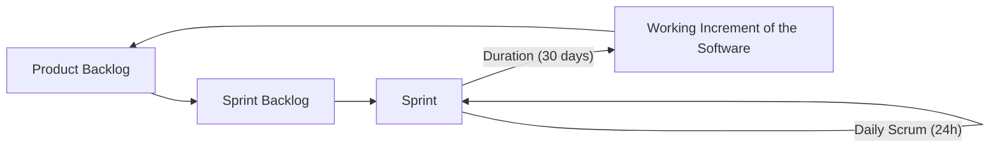

# Agile Methodologies: Scrum, XP

---

## Outline

*   Agile methodologies (general overview)
*   Scrum
*   Extreme Programming (XP)
*   Test Driven Development

---

## Some History About Process

Software development processes have evolved significantly. Initially, unstructured **"Code and Go"** (1940-1960) methods were prevalent. This progressed to the linear **Waterfall Model** (1970). By the 1990s, process formalization increased with models like CMM and ISO 9000, aiming for enhanced software quality. However, the **Agile Manifesto** (published in 2000) marked a pivotal shift, prioritizing flexibility, collaboration, and rapid delivery over strict processes.

---

## Agile Methodologies

### The Agile Manifesto

The Agile Manifesto (agilemanifesto.org) fundamentally prioritizes:

*   **Individuals and interactions** over processes and tools.
*   **Working software** over comprehensive documentation.
*   **Customer collaboration** over contract negotiation.
*   **Responding to change** over strictly following a plan.

### The Agile Principles

The Agile Manifesto is further supported by its twelve guiding principles:

1.  **Customer Satisfaction:** Achieve this through early and continuous delivery of valuable software.
2.  **Embrace Change:** Welcome changing requirements, even when they emerge late in development, as they can be leveraged for competitive advantage.
3.  **Frequent Delivery:** Deliver working software frequently, within a timeframe of weeks to a few months, with a strong preference for shorter iterations.
4.  **Business-Developer Collaboration:** Ensure business people and developers work together daily throughout the project.
5.  **Motivated Individuals:** Build projects around motivated individuals; provide them with the environment and support they need, and trust them to get the job done.
6.  **Face-to-Face Conversation:** The most efficient and effective method of conveying information to and within a development team.
7.  **Working Software as Progress Measure:** The primary indicator of progress.
8.  **Sustainable Development:** Agile processes promote sustainable development, allowing sponsors, developers, and users to maintain a constant pace indefinitely.
9.  **Technical Excellence:** Continuous attention to technical excellence and good design enhances agility.
10. **Simplicity:** The art of maximizing the amount of work not done—is essential.
11. **Self-Organizing Teams:** The best architectures, requirements, and designs emerge from self-organizing teams.
12. **Regular Reflection and Adjustment:** At regular intervals, the team reflects on how to become more effective, then tunes and adjusts its behavior accordingly.

### Agile Methods

This presentation specifically focuses on two prominent Agile methodologies:

*   XP (eXtreme Programming)
*   Scrum

---

## Scrum

### Scrum Process

Scrum is an iterative and incremental process designed for regular software delivery.

**Explanation of the Scrum Process:**

1.  **Product Backlog:** A prioritized, ordered list encompassing all desired product features, requirements, enhancements, and fixes.
2.  **Sprint Backlog:** A subset of items selected from the Product Backlog, specifically chosen for completion within an upcoming Sprint.
3.  **Sprint:** A time-boxed iteration (e.g., 30 days) during which the Development Team works to complete the items in the Sprint Backlog.
    *   **Daily Scrum (24h):** A short (e.g., 15-minute) daily meeting held for team synchronization and progress assessment.
4.  **Working Increment of the Software:** At the conclusion of each Sprint, a "Done" (potentially releasable) increment of working software is produced.

### Scrum Roles

Scrum defines three primary and distinct roles:

*   **Scrum Master:** Acts as a servant-leader. This role involves facilitating the Scrum process, removing impediments for the team, and helping the team understand and adhere to Scrum principles.
*   **Product Owner:** Responsible for maximizing the value of the product. The Product Owner represents stakeholders and is the primary manager of the Product Backlog.
*   **Development Team:** Comprises self-organizing, cross-functional professionals. Their core responsibility is to deliver a potentially releasable Increment of working software.

### Scrum 'Documents' (Artifacts)

Scrum utilizes specific artifacts to manage work and progress:

*   **Product Backlog:** The ordered list that contains all known product requirements.
*   **Sprint Backlog:** The subset of Product Backlog items selected for the current Sprint.
*   **Increment:** The sum of all completed Product Backlog items from the current and all previous Sprints. This must be usable and potentially shippable.

### Scrum Meetings (Events)

Scrum incorporates time-boxed events to ensure regularity and rhythm in the development process:

*   **Daily Scrum:** A 15-minute stand-up meeting held daily for the Development Team's synchronization.
*   **Sprint Planning Meeting:** A one-day meeting where the entire Scrum Team plans the upcoming Sprint.
*   **Sprint Review Meeting:** A maximum 4-hour meeting where the team presents the completed Increment to the customer and other stakeholders.
*   **Sprint Retrospective (Post-Mortem):** An internal team meeting focused on process improvement for future Sprints.

### Scrum Using GitLab Issues

Tools such as GitLab facilitate Scrum task management via Kanban-style boards. These boards feature columns (e.g., **Open**, **To Do**, **Doing**, **Done**) with cards representing issues. Each card displays key information like titles, numbers, labels (e.g., type, priority), and estimates. Issues in the "Open" column are part of the Product Backlog, typically defined as user stories. Issues in the "Todo" and "Doing" columns belong to the Current Sprint. Finally, issues moved to the "Done" column meet the "Definition of Done" and are considered delivered.

### Agile vs. Waterfall: Results

Even when starting with the same initial functionalities, Agile's inherent flexibility allows for adaptation throughout the development process. This often leads to a more valuable end product that better meets evolving needs compared to the rigid Waterfall approach.

### Starting Point: Agile vs. Waterfall Comparison

| Category       | Waterfall (Detailed Definition F1-F6)                 | Agile (High-Level Definition F1-F6)                                                                                                           |
| :------------- | :---------------------------------------------------- | :-------------------------------------------------------------------------------------------------------------------------------------------- |
| **Overall Goal** | Deliver all F1-F6 at the end.                        | Iteratively deliver prioritized features, adapting to change.                                                                                  |
| **Iteration 1** | *(No iterative delivery, focus on all F1-F6)*       | **Rank:** F3, F5, F1, F2, F6, F4   **Delivered:** F3, F5                                                                                    |
| **Iteration 2** | *(No iterative delivery, focus on all F1-F6)*       | **Rank:** F1, F6 (old F6 replaced), F6' (new feature), F2, F4, F7 (new feature)   **Delivered:** F3, F5, F1, F6'                             |
| **Iteration 3** | *(No iterative delivery, focus on all F1-F6)*       | **Rank:** F2, F7, F4   **Delivered:** F3, F5, F1, F6', F2, F7                                                                                 |
| **Final Delivery** | **Delivered:** F1, F2, F3, F4, F5, F6 (all planned) | **Delivered:** F3, F5, F1, F6', F2, F7 (Features may change, new ones added, and prioritization adapted throughout iterations.)               |

### Agile vs. Waterfall - Contracts

Agile projects typically utilize **time and material** contracts, which provide flexibility in scope. Conversely, Waterfall projects commonly employ **fixed price** contracts, necessitating detailed upfront scope definitions.

---

## eXtreme Programming

### Extreme Programming (XP)

Extreme Programming (XP), primarily associated with Kent Beck's seminal work *"Extreme Programming Explained: Embrace Change"*, is a prominent Agile methodology.

### Fundamentals of XP

XP is built upon several core principles:

*   **Decision-Making Responsibility:** Business stakeholders ultimately decide *what* product features to build; developers, conversely, decide *how* to build them.
*   **Simplicity in Design:** The guiding philosophy is "Design for today not for tomorrow," actively avoiding over-engineering.
*   **Test-Driven Development (TDD):** Automated tests are rigorously written *before* any production code is developed; all tests must continuously pass.
*   **Pair Programming:** All production code is written by two programmers collaborating at a single machine.
*   **Short Iterations:** Development cycles are structured into rapid delivery iterations.

### Why Is XP Controversial?

XP challenges many traditional software development norms, leading to controversy due to practices such as:

*   **No Specialists:** Every programmer is expected to participate in all aspects of development, rather than specializing.
*   **No Up-front Detailed Analysis and Design:** Design is expected to emerge incrementally throughout the project, not be fully defined at the outset.
*   **No Up-front Infrastructure Development:** Infrastructure components are built incrementally as needed, rather than all at once.
*   **Minimal Documentation:** Tests and code are considered the primary forms of documentation.

### Some Basic Facts (XP Assumptions)

XP operates on several fundamental assumptions:

*   **Code is Essential:** Working code is a prerequisite for delivering a functional system.
*   **Avoid Wasted Effort:** Any analysis or design that is not ultimately utilized is considered wasted effort.
*   **Business Drives Development:** Business requirements serve as the primary drivers for development efforts.
*   **Requirements Change:** This is accepted as a fundamental and unavoidable reality in software development.

### Back to the Basics (XP Activities)

XP emphasizes continuous engagement in four core activities:

*   **Coding**
*   **Testing**
*   **Listening**
*   **Designing**

### Four Values (of XP)

XP's core values guide its practices:

*   **Communication:** Fosters open and frequent dialogue to effectively solve project problems.
*   **Simplicity:** Adheres to the principle of "What is the simplest thing that could possibly work?" thereby actively avoiding unnecessary complexity.
*   **Feedback:** Emphasizes rapid and continuous feedback loops, achieved through immediate production and constant testing.
*   **Courage:** Encourages developers to "Do the right thing," encompassing design decisions and changes, without fear of failure.

### The Key Practices (of XP)

XP consists of 12 key practices, categorized for clarity:

*   **Customer Satisfaction:** Achieved through the involvement of an on-site customer and delivery via small releases.
*   **Software Quality:** Ensured through the use of a Metaphor (for system understanding), continuous automated Testing, Simple design, Refactoring (continuous code restructuring without changing external behavior), and Pair programming.
*   **Project Management:** Managed via a Planning game, Sustainable development, Collective code ownership, Continuous integration, and adherence to Coding standards.
*   **Environment:** Supported by an Open space setup and co-located staff with common areas (e.g., coffee machine, blackboard).

### On-site Customer

The presence of an on-site customer is crucial for XP's success, primarily because many projects fail to meet actual business needs. A real customer is integrated as an essential part of the team, responsible for defining needs, providing answers to questions, and prioritizing features.

### Small Releases

Small releases offer several benefits: they enable putting the system into production as soon as possible for rapid feedback; they prioritize the delivery of the most valuable features first; and they facilitate shorter cycle times (e.g., 1-2 months of planning is significantly easier than 6-12 months).

### Metaphor/Architecture

This practice refers to developing an overarching idea or understanding of the entire system, sometimes explored through an initial "architectural spike."

### Simple Design

Simple design aims for the "right" design—one that successfully runs all tests, avoids code duplication, uses the fewest possible classes and methods, and fulfills all *current* business requirements. The guiding philosophy is "Design for today, not the future," thereby avoiding speculative design.

### Refactoring

Refactoring involves restructuring existing code without altering its external functionality. This continuous process aims to keep the design simple, while simultaneously removing bad design patterns and dead code.

### Pair Programming

Pair programming involves two developers collaborating at a single machine: one acts as the *driver* (writing code), while the other acts as the *navigator* (strategizing, testing, and reviewing). Pairs rotate frequently, which facilitates knowledge sharing, provides on-the-job training, and leads to continuous code inspection, ultimately resulting in fewer defects.

#### Research Effects

Williams et al. (2000) found that pairs consistently produced higher quality code (achieving 86.4%-94.4% test case pass rates compared to 73.4%-78.1% for individuals). Additionally, pairs completed assignments 40-50% faster, although with approximately 15% higher cost. Notably, 85% of students surveyed expressed a preference for pair programming. Dyba et al. (in a meta-analysis of 15 studies) concluded:

*   **Quality:** Showed a medium increase (Pair Programming generally favors quality), with all studies indicating an increase.
*   **Duration:** Showed a medium increase (Pair Programming typically reduces duration), though some studies reported a decrease.
*   **Effort:** Showed a medium increase (Pair Programming generally increases effort), with one study indicating a decrease.

#### Guidelines for Pair Programming Use (Dyba et al.)

*   **Junior Programmer:** Use for Easy/Complex tasks if increased quality is the main goal.
*   **Intermediate Programmer:** Do not use for Easy tasks; use for Complex tasks if increased quality is the main goal.
*   **Senior Programmer:** Do not use for Easy tasks; do not use for Complex tasks unless the task is too complex for an individual senior programmer.

### Test Driven Development (TDD)

TDD relies heavily on automated test tools and mandates writing tests *before* any production code.

*   **Unit Tests:** Developers are responsible for writing these tests for small code units.
*   **Feature/Acceptance Tests:** Customers (or product owners) write these tests to verify that specific features meet their requirements.

TDD emphasizes continuous regression testing, with all unit tests and completed feature tests running consistently. The ultimate goal is 100% unit test pass rates, while acceptance tests demonstrate progress on user stories.

### The Planning Game (XP)

The Planning Game is a collaborative meeting designed for joint decision-making:

*   **Business Decisions (Customer/Product Owner):** This group determines the scope (which stories to include), story priority, release composition, and release dates.
*   **Technical Decisions (Development Team):** The development team is responsible for time estimates for features, assessing the consequences of business decisions, organizing the team, and creating detailed schedules.

### Ranking and Composition of Releases (Agile Example)

| Iteration   | Rank (Prioritized Features)                       | Delivered Features                                   |
| :---------- | :------------------------------------------------ | :--------------------------------------------------- |
| **Iteration 1** | F3, F5, F1, F2, F6, F4                           | F3, F5                                               |
| **Iteration 2** | F1, F6 (original), F6' (new), F2, F4, F7 (new) | F3, F5, F1, F6'                                      |
| **Iteration 3** | F2, F7, F4                                       | F3, F5, F1, F6', F2, F7                              |

### Sustainable Development (XP)

Sustainable development in XP refers to maintaining a consistent and manageable work pace. Working overtime for two consecutive weeks, for instance, indicates an unsustainable pace, which can lead to team burnout.

### Collective Ownership (XP)

Collective ownership means that all team members possess the authority and responsibility to change any code within the project. Everyone is obliged to improve any "bad code" they encounter. This practice actively avoids knowledge silos and effectively distributes understanding across the team.

### Continuous Integration (XP)

Continuous integration in XP mandates that code integration occurs very frequently, typically after just a few hours of development. New code is immediately released to the current baseline on an integration machine. All automated tests are then run. If errors are detected, the system immediately reverts to the previous stable version, the problem is fixed, and the code is re-integrated.

### Coding Standards (XP)

Teams adopting XP adhere to common coding standards. This practice ensures easier code understanding across the team and helps avoid superficial, style-driven changes during reviews.

### Environment (XP)

The physical environment in XP is deliberately designed to support effective communication, featuring open spaces and common areas (such as coffee machines and blackboards). Research consistently demonstrates that the work environment significantly influences productivity and quality, with negative factors including frequent interruptions, excessive noise, poor lighting, and uncomfortable furniture.

### How Everything Fits Together (XP Practices Interconnectedness)

XP practices are profoundly interconnected and synergistic. Adopting all 12 practices (including On-site Customer, Planning Game, 40 Hour Week, Metaphor, Refactoring, Simple Design, Testing, Short Releases, Pair Programming, Coding Standards, Continuous Integration, Collective Ownership, and Open Space) is believed to provide the highest benefit, as they mutually reinforce each other.

---

## Issues in XP Adoption

### All Techniques? (XP Adoption)

XP proponents advocate for adopting all techniques due to their synergistic benefits. However, a stepwise adoption is often suggested: first, identify the most pressing problem, and then apply the corresponding XP technique to address it.

### Business Contracts (XP Suitability)

XP is highly compatible with **time and material** contracts, which allow for flexible scope. Conversely, **fixed price** contracts are generally unsuitable for XP projects, as they fundamentally contradict XP's emphasis on flexibility and emergent design.

### Colocation and Project Size (XP Considerations)

**Co-location** of team members is a prerequisite for optimal XP implementation. XP is best suited for **small teams** (typically 2-10 developers) working on **small projects**; scaling XP to very large teams or complex projects presents significant challenges.