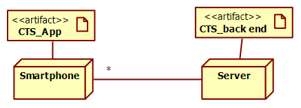

# Software Engineering: COVID Contact Tracing System Analysis

## COVID Contact Tracing

The purpose of a Contact Tracing System (CTS) during an epidemic is to limit the spread of a virus by identifying and informing individuals who have been in close contact with a person who has tested positive (the "index case"). If person P is identified as infected, the system should help find and potentially treat all individuals who had contact with P during the recent past (e.g., the previous 14 days). Mobile phones are considered a practical tool for this due to their widespread use.

**System Structure:**

A Contact Tracing System (CTS) is generally composed of two main parts:

*   **CTS\_app:** A mobile application installed on users' mobile phones.
*   **CTS\_backend:** A server-side component.

## How Contact is Recognized and Recorded (by the CTS\_app)

1.  The CTS\_app should be able to **recognize contact** with another person who also has the same CTS\_app installed (i.e., recognize another device running the app).
2.  This recognition is achieved using the **Bluetooth chip** present in mobile phones.
3.  Using a defined **protocol**, CTS\_app on device A sends a signal at regular intervals.
4.  Simultaneously, CTS\_app on device B listens for the same signal.
5.  When a **match of signals** occurs, each CTS\_app involved estimates two things:
    *   The **distance** to the other device (using an algorithm typically based on Bluetooth signal power attenuation).
    *   The **duration** of the contact.
6.  A contact is considered "traced" and recorded \*only if\* both the estimated duration and the estimated distance meet certain predefined thresholds (e.g., distance less than 2 meters AND duration greater than 15 minutes).

## What Data is Recorded per Traced Contact

For each contact that meets the tracing thresholds, the CTS\_app must record:

*   The **duration** of the contact.
*   The **average distance** during the contact.
*   The **ID of the other device**.

## Privacy Considerations and Device ID Generation

*   For privacy reasons, the ID of a device used in contact tracing **must not be** a permanent identifier like the device's IMEI or the SIM card number.
*   Instead, a unique **pseudo-random ID** is computed for each device **every day**.
*   This pseudo-random ID is generated using a **seed-based pseudo-random number generator (PRNG)**. The key property is that \*given the same seed\*, the generator will produce the same sequence of random numbers (and thus the same sequence of daily IDs) across different devices.
*   The **seed** used by the PRNG is initially produced by the **CTS\_backend** when a CTS\_app is installed on a device, and this seed is then sent to that specific CTS\_app.

## Flow When a User Becomes Infected

1.  When the owner of a phone (let's call her A) becomes infected with COVID, she may **signal this using her CTS\_app**.
2.  The CTS\_app sends this infection notification to the **CTS\_backend**.
3.  The backend records this information (linking it to the infected user's \*current\* pseudo-random ID).
4.  In turn, the backend **broadcasts the seed** that was originally associated with infected user A's device to **all devices / CTS\_apps** registered on the server.

## Daily Contact Checking Flow (on Each CTS\_app)

1.  **Receive Seeds:** Each CTS\_app every day receives the seeds that have been broadcasted by the backend (corresponding to newly reported infected individuals).
2.  **Regenerate Past IDs:** Using the \*same\* seed-based pseudo-random number generator algorithm that the app uses to generate its own daily IDs, each app regenerates the sequence of pseudo-random IDs for each of the newly received seeds. This allows the app to know what the pseudo-random ID of a specific infected device \*would have been\* on previous days.
3.  **Check Against Recorded Contacts:** Each app then checks its own local log of recorded contacts. It compares the "ID of the other device" stored in its contact log entries against the regenerated infected IDs for past days.
4.  **Notify User:** If a match is found (meaning the app had a traced contact with a device whose ID on a past day matches a regenerated ID from a known infected person's seed), the app **notifies its owner** (the user of the phone).
5.  The user who is notified is then free to contact their doctor or public health authorities for further analysis and guidance.

## Statistical Analysis (on the CTS\_backend)

*   On the backend, various **statistical epidemiological analyses** are computed (e.g., number of new infected cases per day, distribution of infected cases per geographical area).
*   These statistical reports are then made **available to the health authority**.

In summary, the CTS system uses Bluetooth for proximity detection, pseudo-random IDs for privacy (regenerated daily based on a broadcasted seed upon infection), and a distributed checking mechanism where each app uses broadcasted seeds to identify potential exposure from its own contact logs.

---

## 1-a. Context Diagram (including relevant interfaces)

The CTS\_app and CTS\_backend are the core components of the system itself. They should be considered \*inside\* the system boundary in the context diagram. The entities interacting with the system from outside are the actors. "Another user's device" is an essential actor because the CTS\_app primarily interacts with other devices running the app for contact recognition. Bluetooth is the physical interface used for this interaction, not an actor itself.

**System Interfaces Summary:**

| Actor                                         | Physical Interface(s)           | Logical Interface(s)                        |
| :-------------------------------------------- | :------------------------------ | :------------------------------------------ |
| User                                          | Touchscreen                     | GUI                                         |
| Another user's device (with CTS\_app installed) | Bluetooth                       | Exposure notification system protocol       |
| Health Authority                              | PC                              | GUI                                         |
| Admin                                         | Screen keyboard / Mouse         | GUI                                         |

\*This diagram shows the CTS System as the central element, with external Actors interacting with it via specified Interfaces.\*

---

## 1-b. Glossary (Key Concepts and Relationships - UML Class Diagram)

This section defines the main concepts within the CTS system and their relationships.

**Privacy Remark:** As noted in the description, sensitive user information (like name, surname, email, physical location, smartphone IMEI or SIM number) must NOT be stored anywhere in the system for privacy reasons. The system identifies devices and potentially users solely through the pseudo-random IDs generated from seeds and the data associated with these IDs.

\*This class diagram models the key concepts and their relationships based on the system description and the provided diagram.\*

---

## 1-c. Use Case Diagram

This diagram illustrates the main uses of the CTS system from the perspective of different actors. Each use case is given a self-explanatory name.

**Use Cases:**

*   **Notify Infected:** The User reports their positive infection status via the app.
*   **Manage Contacts:** The User interacts with the app's contact checking features. This includes receiving seed broadcasts, daily ID generation, checking logs, and potentially viewing results.
*   **Receive Infected:** The CTS\_app receives broadcasted seeds corresponding to newly identified infected persons from the backend.
*   **Recognize Contact:** The CTS\_app detects the proximity and interaction with another device running the app.
*   **Compute Statistics:** The Health Authority uses the backend interface to generate and view statistical reports on infection spread.
*   **Generate Seed for New CTS\_app Installation:** An Admin or the system itself generates a unique seed when a new CTS\_app is installed on a device.
*   **Broadcast Infected:** The CTS\_backend sends the seed associated with a reported infected person to all registered CTS\_apps.
*   **Receive and Store Contacts of an Infected:** The CTS\_backend receives and records the initial infection report data from a user's app.

\*This diagram shows the actors and their interactions with the system's use cases. The `include` relationships indicate that one use case incorporates the functionality of another.\*

---

## 1-d. Deployment Diagram

The CTS\_app and CTS\_backend are software components (artifacts). They are deployed onto hardware nodes (Smartphone, Server, PC).

### Simplest Version of the Diagram

\*This shows the main artifacts deployed on the primary nodes and the connection between them.\*

### More Complete Version, Showing Interaction Between Devices via Bluetooth

\*This diagram shows the deployment of artifacts onto different nodes and the network connections (Bluetooth and Internet) between these nodes.\*

---

## Software Engineering Questions

---

**2. What is the meaning of ‘exhaustive testing', and when is it feasible?**

*   **Meaning:** Exhaustive testing is a theoretical testing approach where the goal is to test a software component or system with **every single possible valid input value or combination of input values**. For each input, the test verifies that the **corresponding output is correct** according to the specifications. It represents the ultimate level of thoroughness in testing.
*   **Outcome:** If exhaustive testing could be completed successfully for a program, it would provide the absolute **highest level of confidence** possible, guaranteeing that the software is correct for all inputs within its specified domain.
*   **Feasibility:** In practice, exhaustive testing is **rarely feasible**. It is only realistically possible when the **set of all potential valid inputs is extremely small and discrete**, making the total number of test cases finite and manageable within practical constraints of time and resources. For example, a function that takes a single boolean input (`true` or `false`) could be exhaustively tested with only two test cases. However, for functions taking integers, floating-point numbers, strings, or complex data structures, the input space is typically vast or infinite, making exhaustive testing impossible. Therefore, while a valuable concept for understanding testing goals, it's seldom a practical strategy for complete software systems.

---

**3. When a project reuses external components, how are the activities of requirements and design impacted?**

Reusing external components significantly influences both the requirements definition and system design phases:

*   **Impact on Requirements Activity:**
    *   The requirements process must include an initial phase of **identifying and evaluating** potential existing external components (whether open source, commercial libraries, or internal assets) that could fulfill some of the project's needs.
    *   A crucial step becomes performing a **gap analysis**. This involves comparing the desired functionality and non-functional requirements (like performance, security, compatibility) against the capabilities and limitations offered by the candidate external components. Requirements may need to be adjusted if a component provides *close* but not exact matches, or if using the component introduces new constraints. Conversely, discovering unexpected features in a component might lead to new requirements.
*   **Impact on Design Activity:**
    *   The core design focus shifts from building components from scratch to **integrating** the selected external components into the system architecture. The design must define how these components interact with existing or newly built parts of the system.
    *   Integration often necessitates designing and implementing **adaption layers**. These could be **wrappers** (to provide a cleaner or simplified interface to the external component) or **adapters** (to translate data formats or method calls between the component's interface and the system's internal interfaces). The design needs to handle potential compatibility issues, error handling around the component's interactions, and managing its lifecycle within the application.

---

**4. In a maintenance process, what are the possible types of a change?**

In the context of software maintenance, changes to the software after its initial deployment are typically categorized into the following primary types:

*   **Corrective Maintenance:** This is the process of **diagnosing and fixing defects (bugs)** that are discovered after the software has been released. The goal is to restore the software's intended functionality or fix erroneous behavior. Examples include fixing a crash, correcting a calculation error, or resolving a security vulnerability.
*   **Adaptive (or Evolutive) Maintenance:** These changes are made to make the software **usable in a changed or changing environment**. This includes adapting the software to work with new versions of operating systems, databases, middleware, hardware platforms, or external services it interacts with. It ensures the software remains compatible and functional in its evolving operational context.
*   **Perfective (or Enhancement) Maintenance:** This type involves **improving the software's functionality, performance, or maintainability** based on user feedback or internal needs. This is where new features are added, existing features are enhanced, code is refactored for clarity or efficiency, or documentation is improved. These changes go beyond fixing bugs or adapting to the environment and aim to make the software "better" from the user's or developer's perspective.