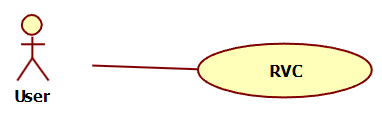
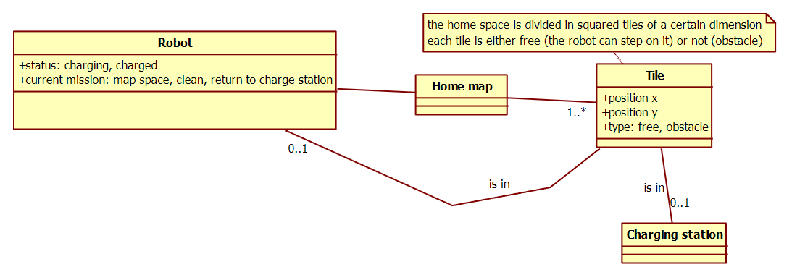
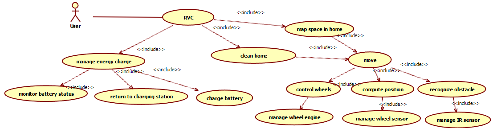
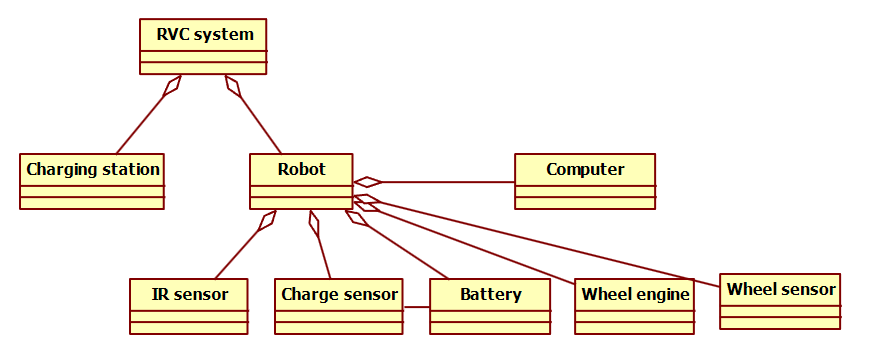

# Robotic Vacuum Cleaner (RVC) System Description

This document analyzes a Robotic Vacuum Cleaner (RVC) system. RVCs are autonomous robots capable of cleaning floors.

## System Components

An RVC system is composed of two main physical units:

*   The **Robot** itself.
*   A **Charging Station**.

### The Charging Station

*   The Charging Station is connected to an electric socket in the house.
*   Its primary function is to allow the robot to charge its internal battery.

### The Robot

The robot is a complex device comprising several parts and functionalities:

*   **Mechanical and Electric Parts:** These include the physical structure, motors, etc.
*   **A Computer:** This is the "brain" that processes information and controls the robot's actions.

#### Sensors

The robot is equipped with various sensors to perceive its environment and internal state:

*   An infrared sensor on the front to recognize **obstacles**.
*   Another infrared sensor on the front, specifically to recognize **gaps** (like the edge of a staircase).
*   A sensor on the battery to read the **charge level** of the battery.
*   A sensor on one of the wheels to compute the **direction** and **distance traveled**.

#### Wheels

Four wheels are used for movement, controlled by the robot's computer.

#### Robot User Interface (Switches)

On top of the robot, there are three user-operable switches:

*   **On/Off:** Turns the robot's main power on or off.
*   **Start:** Initiates a cleaning procedure.
*   **Learn:** Starts a mapping procedure.

#### The 'Learn' Procedure (Mapping)

1.  Pressing the "Learn" button starts a procedure where the robot maps the space in the house.
2.  Using a specific algorithm, the robot moves in various directions.
3.  It detects obstacles or gaps using its sensors.
4.  Based on this detection and its movement tracking, it builds an **internal map** of the space.
5.  By design, the robot cannot move beyond detected obstacles (like walls or closed doors) or gaps taller than 1cm.
6.  The starting point for the learn procedure **must be the charging station**.
7.  Once the map is successfully built, the robot returns to the charging station and stops.

#### The 'Start' Procedure (Cleaning)

1.  Pressing the "Start" button initiates a cleaning procedure.
2.  The robot starts from the charging station.
3.  Using the map it built during the 'learn' procedure, it navigates to cover and clean all the mapped space in the house.

#### Battery Management during Missions (Learn or Clean)

*   In **all cases** (during both 'learn' and 'start' missions), if the charge of the battery drops below a certain predefined threshold, the robot automatically returns to the charging station.
*   When the robot is fully recharged (or charged above the threshold), if it was interrupted during a mission, it resumes and completes the rest of that mission.
*   After completing a mission (either a full 'learn' mapping or a full 'start' cleaning), the robot returns to the charging station and stops.

In the following sections, this RVC system will be analyzed and modeled using software engineering diagrams and concepts.

---

## Diagrams and Models

### 1-a. Context Diagram (including relevant interfaces)

The RVC system consists of the Robot and the Charging Station working together. The primary actor interacting with this system is the User. The physical interfaces are the switches and potentially status indicators. The logical interfaces correspond to the commands triggered by the switches.

#### System Interfaces Summary

| Actor   | Physical Interface(s)         | Logical Interface(s)            |
| :------ | :---------------------------- | :------------------------------ |
| User    | On/Off, Start, Learn switches | On/Off, Start, Learn commands |

*This diagram shows the RVC System as the central element, with the User actor interacting with it primarily through the physical switches, which correspond to logical commands.*

---

### 1-b. Glossary (Key Concepts and Relationships - UML Class Diagram)

This section defines the key concepts within the RVC system and outlines their relationships using a UML class diagram.

#### Key Concepts

*   **Robot:** The main operational unit, performing mapping and cleaning. Has a status (e.g., charging, charged) and a current mission (e.g., map space, clean, return to charge station).
*   **Charging Station:** Provides charging for the Robot.
*   **Home Map:** The internal representation of the house's space, built by the Robot during the 'learn' procedure.
*   **Tile:** A conceptual division of the home space. Each tile has a position (x, y) and a type (free or obstacle). Tiles compose the Home Map.

*This class diagram models the relationships between the Robot, Charging Station, the internal Home Map, and its constituent Tiles.*

---

### 1-c. Use Case Diagram

This diagram illustrates the main uses of the RVC system from the perspective of the User actor. Each use case is given a self-explanatory name or short description.

#### Use Cases

*   **Start System:** The user turns the robot on.
*   **Stop System:** The user turns the robot off.
*   **Start Learning:** The user initiates the mapping procedure.
*   **Start Cleaning:** The user initiates the cleaning procedure.
*   **Monitor Battery Status:** The user might see an indicator related to battery charge (implicit).
*   **Charge Battery:** The system handles the charging process at the station (implicit).
*   **Map Space in Home:** The robot builds the internal map (included in Start Learning).
*   **Clean Home:** The robot performs the cleaning task (included in Start Cleaning).
*   **Manage Energy Charge:** The system monitors battery and returns to station (included in Start Learning & Start Cleaning).
*   **Return to Charging Station:** The robot navigates back to the station (included in Manage Energy Charge).

*This diagram shows the User initiating core system functions, which include or extend more detailed internal processes like mapping, cleaning, and battery management.*

---

### 1-d. System Diagram

This diagram illustrates the main components of the RVC system and their interconnections, representing the physical and logical subsystems.

*This diagram shows the main physical and logical components of the RVC system and their connections, including sensors, the computer, battery, movement components, and the charging station.*

---

## Black Box Testing: `canGoTo` Function

This section defines black box tests for the `canGoTo` function based on the provided equivalence classes and boundary conditions.

### Function Signature

`boolean canGoTo(int charge, int movingMode, int distance)`

### Function Description

The `canGoTo` function determines if the robot has enough battery charge to travel a given `distance` based on its current `charge` level and `movingMode`.

*   `charge`: The current battery charge level (ranges from 0 to 100).
*   `movingMode`: The robot's movement speed mode (0 for slow, 1 for fast).
*   `distance`: The distance to be traveled (ranges from 0 to a maximum integer value).
*   The function returns `true` if the robot has sufficient charge, `false` otherwise.

### Formula for Required Charge

The required charge to travel a certain distance depends on the `movingMode`:

*   In **slow mode (movingMode = 0)**: 1 unit of charge is consumed per unit of distance. Required Charge = `distance`.
*   In **fast mode (movingMode = 1)**: 2 units of charge are consumed per unit of distance. Required Charge = `2 * distance`.

The function returns `true` if `charge >= Required Charge`, otherwise `false`.

### Equivalence Classes and Boundary Conditions

Based on the inputs and the formula, we can define equivalence classes and boundary conditions for testing:

*   **Charge:** Invalid (e.g., < 0 or > 100), Valid (0 to 100). Boundaries: 0, 1, 99, 100.
*   **Moving Mode:** Invalid (not 0 or 1), Valid (0 or 1). Boundaries: 0, 1, values > 1 or < 0.
*   **Distance:** Invalid (e.g., < 0), Valid (0 to maxint). Boundaries: 0, 1, maxint-1, maxint.

The table below summarizes test cases covering combinations of these equivalence classes and boundaries, along with their expected validity (`Valid` / `Invalid`). `minint` represents the smallest possible integer value.

| Charge        | Moving Mode   | Distance      | Valid / Invalid   |
| :------------ | :------------ | :------------ | :---------------- |
| [minint, 0\[  | [minint, 0\[  | [minint, 0\[  | Invalid           |
| [minint, 0\[  | [minint, 0\[  | [0, maxint]   | Invalid           |
| [minint, 0\[  | 0             | [minint, 0\[  | Invalid           |
| [minint, 0\[  | 0             | [0, maxint]   | Invalid           |
| [minint, 0\[  | 1             | [minint, 0\[  | Invalid           |
| [minint, 0\[  | 1             | [0, maxint]   | Invalid           |
| [minint, 0\[  | [2, maxint]   | [minint, 0\[  | Invalid           |
| [minint, 0\[  | [2, maxint]   | [0, maxint]   | Invalid           |
| [0, 100]      | [minint, 0\[  | [minint, 0\[  | Invalid           |
| [0, 100]      | [minint, 0\[  | [0, maxint]   | Invalid           |
| [0, 100]      | 0             | [minint, 0\[  | Invalid           |
| **[0, 100]**  | **0**         | **[0, maxint]** | **Valid**         |
| [0, 100]      | 1             | [minint, 0\[  | Invalid           |
| **[0, 100]**  | **1**         | **[0, maxint]** | **Valid**         |
| [0, 100]      | [2, maxint]   | [minint, 0\[  | Invalid           |
| [0, 100]      | [2, maxint]   | [0, maxint]   | Invalid           |
| ]100, maxint] | [minint, 0\[  | [minint, 0\[  | Invalid           |
| ]100, maxint] | [minint, 0\[  | [0, maxint]   | Invalid           |
| ]100, maxint] | 0             | [minint, 0\[  | Invalid           |
| ]100, maxint] | 0             | [0, maxint]   | Invalid           |
| ]100, maxint] | 1             | [minint, 0\[  | Invalid           |
| ]100, maxint] | 1             | [0, maxint]   | Invalid           |
| ]100, maxint] | [2, maxint]   | [minint, 0\[  | Invalid           |
| ]100, maxint] | [2, maxint]   | [0, maxint]   | Invalid           |

#### Explanation of Valid Cases

The rows marked 'Valid' correspond to combinations where the `charge` is within the valid range \[0, 100], `movingMode` is valid (0 or 1), and `distance` is valid (>= 0). For these combinations, the actual function logic (`charge >= distance` if mode 0, or `charge >= 2 * distance` if mode 1) determines the *specific* test outcome (true or false). The table only identifies the broad categories of inputs that are logically valid inputs to the core formula, distinguishing them from inputs that are inherently invalid due to the specified ranges or discrete values.