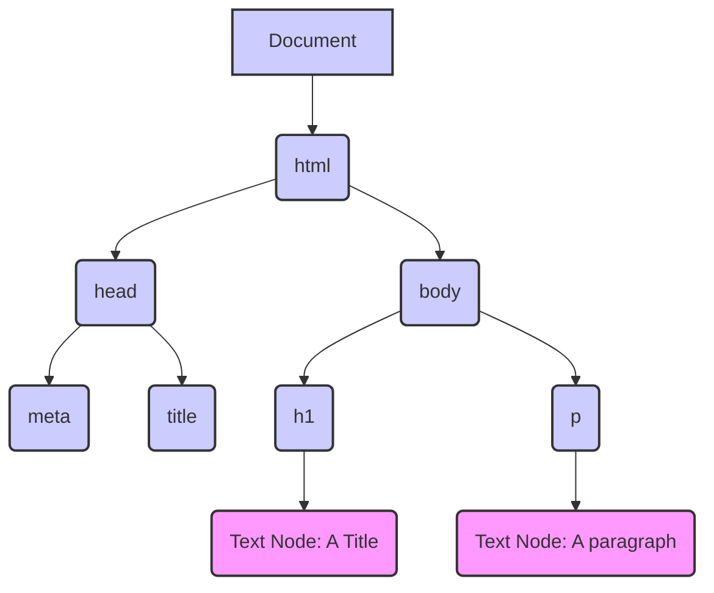
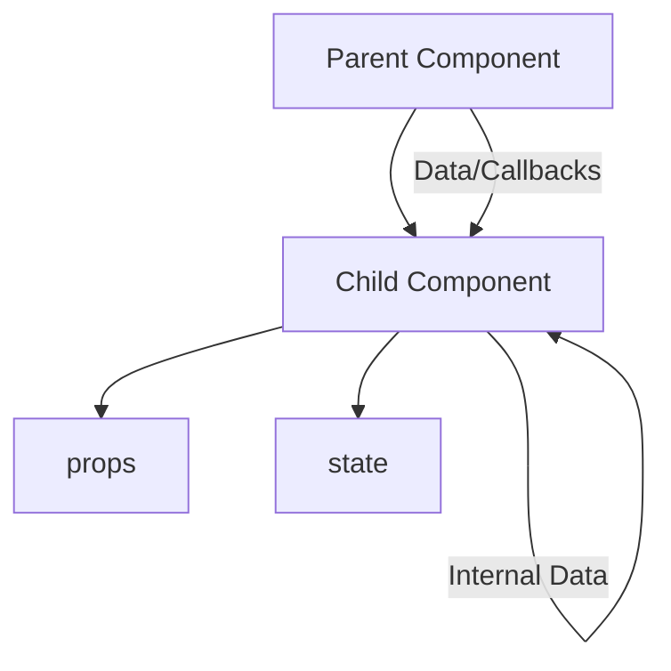

# Introduction to React

**React** is an open-source JavaScript library developed by Meta. Its primary purpose is to build user interfaces (**UIs**) for web applications efficiently, focusing specifically on the **front-end**.

---

## Why Use a Front-End Library Like React?

Building complex user interfaces directly by manipulating the native browser DOM with plain JavaScript can quickly become cumbersome, error-prone, and difficult to manage. Front-end libraries like React provide higher-level abstractions, structure, and optimized mechanisms to simplify UI development significantly.

### 1. Simplifying Interaction with the Browser Environment

React offers key advantages in managing UI updates in the browser:

*   **Uniform UI Updates:** Provides a consistent, declarative way to describe how the UI should look based on data, abstracting away the complex manual steps of direct DOM manipulation.
*   **Clear Structure:** Promotes organizing UI into a hierarchical tree of self-contained components, making the structure easier to understand and manage.
*   **Reusable Components:** Enables building the UI from independent, encapsulated blocks of code (components) that can be reused across different parts of the application or even in different projects.
*   **Automatic and Efficient Updates:** When the underlying data (**state**) of a component changes, React automatically determines what needs to be updated in the actual browser DOM and performs those updates efficiently, minimizing direct manipulation for better performance. This is largely achieved through the **Virtual DOM**.

### 2. Simplifying Development Methods and Patterns

Beyond browser interaction, React influences development practices:

*   **Structured Patterns:** Provides architectural guidelines, promoting a component-based approach and a unidirectional data flow, which leads to more predictable application behavior.
*   **Rich Ecosystem:** Supported by a massive community, resulting in a vast ecosystem of libraries and tools for common tasks like routing, state management, and testing.
*   **Predictable State Management:** Enforces explicit management of component data (**state**), leading to more predictable UI behavior as changes are tracked and controlled.

---

## Main Resources for Learning React

The official React documentation is structured into two primary sections to support learning:

*   **React Reference:** <https://react.dev/reference/react>. This section serves as a detailed API documentation, covering all React APIs, built-in components, and Hooks (like `useState`, `useEffect`).
*   **React Learn:** <https://react.dev/learn>. This section provides tutorials, guides, and conceptual explanations designed to teach React from the ground up, covering core concepts and patterns.

---

## Browser Development Tools

When working with React applications, the browser's built-in developer tools are essential for inspection and debugging. Dedicated browser extensions (available for Firefox and Chrome) augment these tools by adding a specific "**Components**" or "**React**" panel to the developer console. This panel allows you to inspect the React component tree, view the `props` and `state` of individual components, and trace how data flows.

*   **Firefox React Developer Tools:** <https://addons.mozilla.org/en-US/firefox/addon/react-devtools/>
*   **Chrome React Developer Tools:** <https://chrome.google.com/webstore/detail/react-developer-tools/fmkadmapgofadopljbjfkapdkoienihi?hl=en>

---

## Browser’s Object Models

Web browsers expose the structure of the loaded page and aspects of the browser window itself to JavaScript through object models:

### The `window` Object (Browser Object Model - BOM)

The `window` object is the top-level object in the browser environment, representing the browser window or a tab. It serves as the global scope for JavaScript code running in that window. It's the primary entry point to the **Browser Object Model (BOM)**, which provides an interface for interacting with the browser environment itself, rather than just the page content. The `window` object includes properties and methods for interacting with the browser window (like size, position), managing timers (`setTimeout`/`setInterval`), interacting with storage (`localStorage`, `sessionStorage`), navigating history (`history`), accessing the URL (`location`), and providing built-in dialogs (`alert`/`prompt`). Crucially, it also contains a reference to the `document` object.

### The `document` Object (Document Object Model - DOM)

The `document` object represents the entire HTML document that is loaded in the `window`. It is the root node of the **Document Object Model (DOM)** tree, which is an in-memory, structured representation of the HTML page's content. The `document` object is the entry point for the DOM API, allowing JavaScript to read, inspect, and dynamically change the structure, content, attributes, styles, and handle events related to the page's content. You access it via `window.document` or simply `document`.

---

## Browser Object Model (BOM) - Summary

The **Browser Object Model (BOM)** refers to the objects provided by the browser environment, allowing interaction with the browser window and features outside the direct HTML content. While not a formal standard like the DOM, it includes key objects such as the global `window` object, `navigator` (providing browser information), `screen` (details about the user's screen), `history` (browser history), `location` (current URL), `localStorage` and `sessionStorage` (web storage), the `console` object, and importantly, a reference to the `document` object (the root of the DOM).

---

## Document Object Model (DOM) - Detailed

The **Document Object Model (DOM)** is a standard API that provides an in-memory, tree-like representation of an HTML document's structure. Each part of the document, including elements, attributes, and text content, is represented as a **node** in this tree. The DOM API allows JavaScript to traverse, read, inspect, and dynamically change this tree structure, thereby updating what the user sees in the browser page without necessarily reloading the entire page.

Different types of nodes exist within the DOM tree:
*   **Document Node:** The root node, represented by the `document` object.
*   **Element Node:** Represents HTML tags (e.g., `<div>`, `<p>`, ``).
*   **Attr Node:** Represents attributes of HTML elements (e.g., `id="myId"`, `class="active"`).
*   **Text Node:** Represents the actual text content within elements (`"Hello World"`).
*   **Comment Node:** Represents HTML comments (`<!-- comment -->`).
*   **DocumentType Node:** Represents the `<!DOCTYPE html>` declaration.
*   **DocumentFragment Node:** A lightweight, in-memory container for grouping a set of nodes before appending them to the actual DOM.

<p align="center">



</p>

Historically, JavaScript frameworks often directly manipulated this DOM tree. React uses the **Virtual DOM** as an abstraction layer over this direct manipulation.

---

## Event Listeners

Browser JavaScript development is inherently **event-driven**. Events are occurrences that happen in the browser environment, such as a user clicking a button, pressing a key, a page finishing loading, or a video starting to play. **Event listeners** (also called event handlers) are JavaScript functions that you attach to specific DOM elements or the document/window. These functions are registered to run automatically whenever a particular type of event occurs on the element they are attached to. The specific behavior handled depends on the element, the event type, and the logic within the listener function.

---

## Event Categories

Browser events fall into various broad categories:
*   User Interface Events (e.g., `load`, `unload`, `error`, `resize`, `scroll`)
*   Focus/Blur Events (e.g., `focus`, `blur`, `focusin`, `focusout`)
*   Mouse Events (e.g., `click`, `dblclick`, `mousedown`, `mouseup`, `mousemove`, `mouseover`, `mouseout`, `contextmenu`)
*   Keyboard Events (e.g., `keydown`, `keypress`, `keyup`)
*   Form Events (e.g., `submit`, `change`, `input`, `invalid`, `reset`)
*   Mutation Events (e.g., `DOMContentLoaded` - fires when initial HTML is loaded and parsed)
*   HTML5 Media Events (e.g., `play`, `pause`, `ended`)
*   CSS Events (e.g., `transitionend`, `animationend`)

---

## Preventing Default Behavior

Many browser events have a default action associated with them. For instance, clicking a link typically navigates the browser to a new URL, and submitting a form typically causes a page reload. You can prevent this default browser action by calling the `event.preventDefault()` method inside your event listener function. The event object, containing details about the event, is automatically passed as the first argument to any event listener callback. This allows you to handle the event solely with custom JavaScript logic.

```javascript
const link = document.getElementById('my-link');
link.addEventListener('click', (event) => {
  event.preventDefault(); // Stop the browser from navigating to the link's href
  console.log("Link click prevented! Handled by JS.");
  // Add your custom logic here, e.g., load content via AJAX
});
```

---

## React Design Principles

React's core design is built around several key principles:

*   **Declarative Approach:** Instead of writing step-by-step instructions on *how* to modify the DOM (e.g., "find this element, remove that class, add this text"), you describe *what* the final state of the UI should look like for a given state of data. React then takes care of figuring out the most efficient way to update the actual DOM to match your description. This focus on the desired outcome rather than the process simplifies development and makes UIs more predictable.
*   **Component-Based and Functional Design:** UI is broken down into small, independent, reusable units called **components**. Modern React emphasizes using JavaScript functions for components. These functions take inputs (`state`, `props`) and return a description of the UI (using JSX). Components re-render (re-execute their function) automatically when their input data (`state` or `props`) changes. This approach, combined with the **Virtual DOM**, enables efficient and modular UI construction.

---

## React Components as Functions

In modern React, the most common way to define a component is as a JavaScript function. This function receives an object containing its inputs and returns a description of the UI that React should render. We can express this relationship as `UI Fragment = f(state, props)`.

*   `props`: This is an object containing data and configurations passed *down* to the component from its parent component. Props are considered **immutable** within the receiving component; a component should never directly modify its own props. They are the primary mechanism for unidirectional data flow from parent to child. A child component can signal events or requests for changes upwards by calling functions passed down as props by the parent.
*   `state`: This represents data that is managed **internally** by the component itself. It is relevant only within that component (unless passed down to children as props). Changes to a component's state trigger a re-render of that component and its descendants. State should be updated using specific React-provided functions (like the setter returned by the `useState` Hook) and generally updated immutably (creating new objects or arrays instead of modifying existing ones). State updates are often **asynchronous** and **batched** by React for performance.

Components that do not use state management Hooks (like `useState`) are often referred to as "**stateless functional components**." If they also produce the same output for the same input and have no side effects, they are considered "**pure**" components.

---

## Immutability Principles in React

Immutability is a core principle in React development, promoting predictable updates and optimizing performance:

*   `props`: Props received by a component should be treated as read-only. The component should not attempt to modify the props object or its contents directly.
*   `state`: While state *changes*, the *way* you update state should generally involve immutability. Instead of modifying an existing object or array in state directly (e.g., `state.array.push(item)`), you should create a *new* object or array with the desired changes and pass this new instance to the state setter function (e.g., `setArray([...state.array, item])`). This pattern helps React efficiently detect changes and optimize re-renders.
*   **Pure Functions:** Ideally, components and state update logic should behave like pure functions: given the same inputs (`props`, old `state`), they should always produce the same output (JSX, new `state`) without causing side effects outside their scope.

---

## Re-Rendering Process

A **re-render** is the process by which React updates the UI in response to changes. It is triggered whenever a component's `state` changes or its `props` change (meaning the parent component re-rendered and passed different props).

When a re-render is triggered:
1.  React re-runs the component's function.
2.  This function returns a new description of the UI, typically in the form of JSX.

---

## Re-Rendering Performance with the Virtual DOM

Directly manipulating the browser's actual DOM can be slow and inefficient, especially for complex updates. React addresses this performance bottleneck by using a **Virtual DOM**. The Virtual DOM is an in-memory JavaScript object representation of the actual browser DOM.

The re-rendering process utilizes the Virtual DOM through a technique called **Reconciliation (or Diffing)**:
1.  When a component's state or props change, React re-renders the component function.
2.  The re-rendered component returns a description of the UI, which React uses to build a **new Virtual DOM** tree or subtree representing the updated state.
3.  React then performs a process called **Diffing**, efficiently comparing this **new VDOM** tree with the **old VDOM** tree (from the previous render).
4.  Based on this comparison, React computes the **minimal set of changes** (insertions, deletions, updates to attributes or text content) that are necessary to make the *actual* browser DOM match the *new* Virtual DOM.
5.  These computed changes are batched together.
6.  Finally, React applies this batch of minimal changes to the **actual browser DOM**.

This process significantly minimizes the number of direct manipulations needed on the actual DOM, leading to better performance. The Virtual DOM is also involved in React's handling of **Synthetic Events**.

---

## Update Cycle Steps (Reconciliation)

The flow of a UI update triggered by a state or props change can be summarized as follows:

State/Props Change -> Component Function Re-runs -> New Virtual DOM Tree/Subtree is Created -> Diffing (Comparison of Old VDOM vs. New VDOM) -> Compute Minimal Changes to the Actual DOM -> Queue DOM Updates -> Batch Update the Actual Browser DOM -> The Visible UI Updates in the Browser.

---

## Synthetic Events

React implements its own event system, known as **Synthetic Events**. This system wraps the browser's native events to provide **cross-browser consistency** and a unified API. React handles events using event delegation: instead of attaching listeners directly to every DOM element, React attaches a single event handler at the root of the React tree. When a native event occurs, React's root handler receives it, identifies which React component element triggered the event, and then dispatches a "synthetic" event to the appropriate component's event handler function. The handler receives a `SyntheticEvent` object, which is a cross-browser wrapper around the native browser event, providing a consistent set of properties and methods.

---

## Integrating React Code in the DOM

To make a React application visible in a web page, you need to mount the React component tree into an existing HTML element in the actual browser DOM. This HTML element serves as the "DOM container" for your React application.

With modern React (version 18 and later), the process is:
1.  Get a reference to the DOM container element using a standard DOM API, e.g., `document.getElementById('root')`.
2.  Create a React root using `createRoot(domContainer)`, associating it with the DOM container.
3.  Render your top-level React Element (usually the main application component) into this root using `root.render(<App />)`.

*   A **React Element** is a plain JavaScript object that describes what you want to appear on the screen. It's the conceptual "building block" of React UI, created either by writing JSX or using `React.createElement()`.
*   The **DOM Container Node** is the existing HTML element in your `index.html` file where you want your React app to be rendered.
*   **Rendering** is the process initiated by `root.render()`. React uses the description from the React Element to build the initial Virtual DOM and then applies the minimal changes needed to display that UI within the specified DOM container in the actual browser DOM.

---

## JSX Syntax

**JSX** is a syntax extension for JavaScript that looks similar to HTML or XML. It is the standard way to describe the structure of UI elements within React components. Writing UI structures with JSX (`<h1>Hello!</h1>`) is generally considered more readable and intuitive than using the equivalent pure JavaScript API (`React.createElement('h1', null, 'Hello!')`). Since JSX is not standard JavaScript, it must be processed and **transpiled** into regular JavaScript code (specifically, `React.createElement()` calls) by a build tool like Babel or Vite before it can be run in a browser.

```javascript
// Example using JSX
const elementWithJSX = <div><h1>Title</h1><p>Text</p></div>;

// Equivalent example without JSX (using React.createElement)
import React from 'react';
const elementWithoutJSX = React.createElement('div', null,
  React.createElement('h1', null, 'Title'),
  React.createElement('p', null, 'Text')
);

// Both result in a JavaScript object representing the UI structure, which React then uses.
```

---

## Components as Building Blocks

The core idea in React is to break down complex UIs into smaller, independent, and reusable pieces called **components**. Even standard HTML tags like `<div>` or `<span>` are treated as component types in React's model. Components can be **nested** within each other to build hierarchical UI structures. The function `ReactDOM.createRoot().render()` is used to render the very first, top-level component, which then typically renders other nested components to form the complete UI tree.

---

## Defining Custom Components

The most common and modern way to define your own reusable UI components in React is by writing **JavaScript functions**.

Key characteristics of a function component:
*   Its name **must start with a capital letter** (e.g., `Welcome`, `Greeting`). This convention helps React distinguish custom components from standard HTML elements (lowercase names).
*   It accepts a single argument, which is an object containing its `props` (the data and configuration passed down from its parent).
*   It returns a React element (usually written using JSX) that describes what the component should render in the UI.

```javascript
// Example: Simple function component without receiving any props
function Welcome() {
  return <h1>Hello, Welcome!</h1>; // Returns a React element (JSX)
}

// Example: Function component accepting props
function Greeting(props) { // 'props' is an object { name: "Alice" }
  return <p>Hello, {props.name}!</p>; // Uses the 'name' property from the props object
}

// Usage of these components in JSX:
// <Welcome />
// <Greeting name="Alice" />
```

---

## Types of Components

While the distinction is less rigid with Hooks, components can conceptually be categorized:

*   **Presentational Components (Dumb Components):** These components focus primarily on **how things look**. They receive data and configuration solely via `props` from their parent. They typically have little to no internal `state` (maybe only for UI-specific concerns like whether a modal is open). They don't manage application logic or fetch data. When interaction occurs (e.g., a button click), they call callback functions that were passed down to them as `props`.
*   **Container Components (Smart Components):** These components focus on **how things work**. They manage application state, fetch data from APIs, interact with state management stores, and handle complex logic. They typically do not render much HTML themselves. Instead, they render **Presentational Components**, passing the data and necessary callback functions down to them via `props`.

*(Note: The introduction of React Hooks allows functional components to manage state and side effects, blurring the strict lines between these two categories, as stateful logic can now reside directly within functional components.)*

---

## Props and State: Managing Component Data

Components rely on two primary types of data sources to render correctly:

*   `props`: Props represent data that is passed **downwards** from a parent component to its child component. They serve as the configuration and input data for the child. As noted, `props` are **immutable** within the receiving child component; a component should treat its own props as read-only. They are the mechanism for implementing **unidirectional data flow** (data moving only from parent to child). If a child needs to communicate something back up to its parent, it does so by calling callback functions that were passed down as props.
*   `state`: State represents data that is managed **internally** by a component itself. This data is specific and relevant only to the component that owns it (though it can be passed down to children as props). Changes to a component's state are the primary trigger for a re-render of that component. State is updated using specific React-provided methods or Hooks (like the setter function returned by the `useState` Hook). State updates should generally be performed by providing a *new* value or a *new* object/array instance to the setter, rather than mutating the existing state object/array directly (immutability). State updates requested via React's methods are often processed **asynchronously** and **batched** together for performance.



---

## Unidirectional Data Flow (One-Way Data Binding)

React strictly enforces a **unidirectional data flow**. This means data moves in only one direction: downwards, from parent components to their children, exclusively via `props`. Components receive props and render accordingly. If a child needs to trigger a change in data that affects its parent or siblings, it cannot modify their state directly. Instead, the child must signal this intent upwards, typically by calling a callback function that the parent passed down as a prop. The parent component (or a common ancestor) then updates its own `state`. This state update triggers a re-render of the parent, which in turn passes down updated `props` to its children, propagating the changes downwards. This single-direction flow makes it much easier to understand how data changes and how the UI updates, simplifying debugging and prediction.

---

## Corollary (Consequences of Unidirectional Flow)

The strict unidirectional data flow has several important consequences and patterns:

*   **State Ownership:** Data state should ideally reside in the component that needs it or manages the logic related to it. If multiple components need access to the same state or need to communicate based on shared state, the state should be "**lifted up**" to the closest common ancestor component that contains all the components needing that state.
*   **Impact Scope:** A state change within a component only directly affects that component itself and any descendant components that receive that state (or data derived from it) as `props`.
*   A component cannot directly change the state or props of its parent or its sibling components.
*   **Lifting State Up:** This is a common pattern in React used to share state between components that do not have a direct parent-child relationship. The shared state is moved from the original components to their nearest common ancestor component. This ancestor then passes the state back down as props to the components that need it, and passes callback functions down as props to allow descendants to request updates to the state.

---

## Setting Up Your First React Application

Setting up a React application from scratch manually can be complex, requiring configuration for ES Module support, JSX transpilation, bundling code, setting up a development server, etc. Using a build tool automates this process and provides a ready-to-use development environment. A recommended modern and fast tool for this is **Vite**.

### Infrastructure Setup Steps with Vite

To create a new React application project using Vite:

1.  Open your terminal and run the command: `npm create vite@latest my-react-app` (replace `my-react-app` with your desired project name).
2.  Follow the prompts: select `react` as the framework, then choose the `JavaScript` variant (or TypeScript, SWC, etc., as preferred).
3.  Navigate into the created project directory: `cd my-react-app`.
4.  Install the project dependencies: `npm install`.
5.  Start the development server: `npm run dev`.
6.  Open your browser and access the address displayed in the terminal (typically `http://localhost:5173/`).

---

## Project Folder Structure (Created by Vite)

When you create a React app with Vite, it sets up a standard project folder structure:

*   `node_modules/`: Contains installed npm packages.
*   `package.json`: Project manifest, lists dependencies and scripts.
*   `package-lock.json`: Records exact dependency versions.
*   `.gitignore`: Specifies files/folders Git should ignore.
*   `vite.config.js`: Vite build configuration file.
*   `index.html`: The main HTML template file. It typically contains a `div` element with an `id` like `#root`, which serves as the DOM container where your React application will be mounted.
*   `src/`: This directory contains your application's source code. Key files include:
    *   `App.jsx`: A common place for the main application component.
    *   `main.jsx`: The entry point file, where React is initialized and the top-level component is rendered into the DOM.
    *   Other files for components, CSS, assets, etc.
*   `public/`: An optional directory for static assets (like images, fonts) that should be served directly without being processed by the build pipeline.

---

## Importing/Exporting Modules

Modern front-end JavaScript development, including React applications built with tools like Vite, relies heavily on **ES Modules** (`import` and `export`) for organizing code into separate files. You will typically define components, functions, and variables in one file and `export` them to be `import`ed and used in other files. The `require()` syntax from CommonJS modules, commonly used in Node.js back-end development, is generally not used directly in front-end React source code that goes through a build process.

---

## Example: Hello World Component Structure

A basic React application demonstrates the concept of components as building blocks. Consider an app with a main `App` component and a simple `Button` component. Both are defined as functions returning JSX. The `App` component includes and renders the `Button`. The `Button` component can accept a `lang` prop to customize its text. Components are typically placed in separate files (conventionally with `.jsx` extension) and `export`ed. The main application entry point (`main.jsx` in a Vite project) imports the top-level component (`App`) and uses `ReactDOM.createRoot().render()` to render it into the designated DOM container element (`#root`).

```javascript
// In src/Button.jsx
import React from 'react'; // Required for JSX (even if not directly used)

function Button(props) {
  // Component receives props object { lang: 'it' }
  return <button>{props.lang === 'it' ? 'Ciao!' : 'Hello!'}</button>;
}
export default Button; // Export the component


// In src/App.jsx
import React from 'react';
import Button from './Button'; // Import the Button component

function App() {
  return (
    <p>
      Press here: <Button lang='en'/> {/* App renders Button, passes 'en' prop */}
      Or here: <Button lang='it'/> {/* App renders another Button, passes 'it' prop */}
    </p>
  );
}
export default App; // Export the App component


// In src/main.jsx
import React from 'react';
import ReactDOM from 'react-dom/client'; // Import React DOM client API
import App from './App'; // Import the main App component
import './index.css'; // Import global styles (optional)

// Find the root DOM element in index.html
const domContainer = document.getElementById('root');
// Create a React root
const reactRoot = ReactDOM.createRoot(domContainer);
// Render the App component tree into the root
reactRoot.render(
  <React.StrictMode> {/* Optional: Helps detect potential problems */}
    <App /> {/* Render the top-level component */}
  </React.StrictMode>
);
```

---

## Example: Dynamic State with `useState` Hook

For function components to manage internal data that changes over time and affects rendering (i.e., add state), you use the **`useState` Hook**, imported from the `react` library.

The `useState` Hook is called inside a function component: `const [stateVariable, setStateSetterFunction] = useState(initialValue);`.
*   It returns an array containing two elements: the current `stateVariable` and a `setStateSetterFunction` to update that state.
*   You provide the `initialValue` for the state as the argument to `useState`.
*   To update the state, you call the `setStateSetterFunction` with the new value (or a function that computes the new value based on the previous state). Calling the setter function requests React to update the state and triggers a re-render of the component with the new state value.

```javascript
import { useState } from 'react'; // Import the useState Hook

function ToggleButton(props) {
  // Declare a state variable 'isOn' and its setter 'setIsOn'.
  // The initial state is false.
  const [isOn, setIsOn] = useState(false);

  // Define an event handler function
  const handleClick = () => {
    // Request a state update: set 'isOn' to the opposite of its current value
    // This uses the setter function returned by useState
    setIsOn(!isOn); // Update state using the setter function
  };

  return (
    // Render a button. Attach the handleClick function as the click event listener.
    // The button text depends on the current value of the 'isOn' state variable.
    <button onClick={handleClick}>
      {isOn ? 'ON' : 'OFF'} {/* Text displays 'ON' if isOn is true, 'OFF' otherwise */}
    </button>
  );
}

// Workflow when button is clicked:
// 1. User clicks the button.
// 2. The browser's native click event occurs.
// 3. React's synthetic event system processes it and calls the handleClick function.
// 4. handleClick calls setIsOn(!isOn).
// 5. React receives the state update request. It schedules the update.
// 6. React updates the 'isOn' state variable's value.
// 7. React triggers a re-render of the ToggleButton component.
// 8. The ToggleButton function re-executes. useState returns the *new* value for 'isOn'.
// 9. The JSX is evaluated with the new 'isOn' value (e.g., true).
// 10. React's reconciliation compares the new JSX output (e.g., '<button>ON</button>') with the previous ('<button>OFF</button>').
// 11. React updates the minimal parts of the actual DOM (the button's text content).
// 12. The UI visibly changes to show 'ON'.
```

---

## Adding Bootstrap to Your React App

You can integrate Bootstrap's popular CSS framework and components into your React application for styling and pre-built UI elements. Two common ways exist:

### 1. Manually Loading Bootstrap CSS

The simplest approach is to include the Bootstrap CSS file directly in your main HTML template.

*   Open your `public/index.html` file (or the main HTML file for your app).
*   Add a `<link>` tag in the `<head>` section that points to the Bootstrap CSS file (either from a CDN or from a local copy you've added to your `public` folder).
    ```html
    <link href="https://cdn.jsdelivr.net/npm/bootstrap@5.3.2/dist/css/bootstrap.min.css" rel="stylesheet" integrity="..." crossorigin="anonymous">
    ```
Once the CSS is loaded, you can use Bootstrap's class names directly within your JSX elements (e.g., `<button className="btn btn-primary">Click me</button>`). You might need to manually include Bootstrap's JavaScript file (which has dependencies like Popper.js) for certain components (like dropdowns or modals) if you don't use a React-specific library.

### 2. Using `react-bootstrap` Library

A more "React-friendly" approach is to use the `react-bootstrap` library. This library provides Bootstrap components rewritten as React components, leveraging React's state and props system. It handles the underlying Bootstrap JavaScript functionality within the React component logic.

*   Install the necessary packages: `npm install react-bootstrap bootstrap`.
*   Import the Bootstrap CSS file into your application's entry point (`src/main.jsx` or `src/App.jsx`): `import 'bootstrap/dist/css/bootstrap.min.css';`.
*   Import individual Bootstrap components you need from `react-bootstrap` and use them as standard React components in your JSX.

```javascript
// In your main entry file (e.g., src/main.jsx)
import 'bootstrap/dist/css/bootstrap.min.css'; // Import the global Bootstrap CSS

// In a component file (e.g., src/MyComponent.jsx)
import React from 'react';
import { Container, Row, Col, Button } from 'react-bootstrap'; // Import specific components

function MyLayout() {
  return (
    <Container> {/* Use react-bootstrap's Container component */}
      <Row> {/* Use react-bootstrap's Row component */}
        <Col md={6}> {/* Use react-bootstrap's Col component */}
          <p>Content goes here.</p>
          <Button variant="primary">Bootstrap Button</Button> {/* Use react-bootstrap's Button */}
        </Col>
      </Row>
    </Container>
  );
}
export default MyLayout;
```
Using `react-bootstrap` components is generally preferred when working with React as they integrate better with React's component model and state management.

---

## What’s Next?

Building upon this introduction, future topics would delve deeper into: the specifics of Components, Props, and their usage; more advanced aspects of JSX syntax; detailed exploration of State and React Hooks (`useState`, `useEffect`, etc.); handling Events in React's synthetic event system; working with Forms and controlled inputs; understanding the Component Lifecycle and how Hooks relate to it; and implementing client-side routing for Single Page Applications (SPAs) using libraries like React Router.