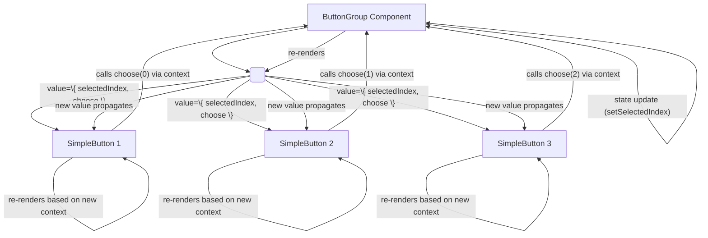

# React Context and the `useContext` Hook

---

## The Problem: Prop Drilling

The default data flow in React is **unidirectional**, meaning data is passed downwards from parent components to their children exclusively through **props**. This is generally straightforward, but a problem known as **prop drilling** can occur when data is needed by a component located many levels deep in the component tree. To get the data to this deeply nested component, you must pass it down as a prop through *every intermediate component* along the path, even if those intermediate components themselves do not need or use the data.

Prop drilling introduces several issues:

*   It **reduces component reusability** because intermediate components become coupled to passing down specific data they don't actually care about.
*   It **increases maintenance overhead**. Changing the structure or type of data being drilled, or needing to pass a new piece of data, requires modifying all intermediate components that are merely acting as conduits.
*   It **clutters component code**, making it harder to read and understand a component's purpose when its prop list includes data it doesn't directly use.

---

## The Solution: The Context API

React's **Context API** provides a solution to the problem of prop drilling. It offers an alternative mechanism for making data available to components throughout the component tree without the need to pass props manually at every single level. The **Context API** allows an ancestor component (acting as a **Provider**) to make certain data available to *any* descendant component (acting as a **Consumer**) that is located anywhere below it in the tree, implicitly. Think of Context as creating a dedicated "channel" through which a specific type of data can be broadcast to interested components downstream.

Context is particularly useful for sharing data that is considered "**global**" within a specific part of your application, such as:

*   Theming (light mode/dark mode)
*   User Authentication Status or User Information
*   Preferred Language settings
*   General Application Settings

While Context can manage state, it's **generally not intended as a primary replacement for dedicated, complex state management libraries** (like Redux or Zustand) when dealing with large amounts of global state that change frequently or require sophisticated management patterns.

### The Three Core Concepts of the Context API

The Context API revolves around three main concepts:

<p align="center">

| Concept               | Description                                                                                                                                                                                                                                                        |
| :-------------------- | :----------------------------------------------------------------------------------------------------------------------------------------------------------------------------------------------------------------------------------------------------------------- |
| **Context Definition**| Creating the Context object using `React.createContext(defaultValue)`. This object represents the type of data being shared and contains the Provider and Consumer. The `defaultValue` is a fallback for consumers without a matching Provider.                      |
| **Context Provider**  | A special component (`<MyContext.Provider value={data}>`) used to wrap a subtree of components. It **supplies** the actual `data` (passed via the `value` prop) that consuming components within its subtree will receive.                                     |
| **Context Consumer**  | Any component that needs to access the shared data. Can access the nearest Provider's value using the `useContext(MyContext)` Hook (in function components) or the `<MyContext.Consumer>` component (older method, works in classes and functions).           |

</p>

### 1. Defining the Context (`React.createContext`)

To start using the **Context API**, first import `React` and call the `React.createContext()` method: `const MyContext = React.createContext(defaultValue);`. The argument `defaultValue` is optional but can be useful as a fallback. The result is the **Context** object itself, which contains the `Provider` and `Consumer` components (and is passed to the `useContext` Hook). You should typically define your contexts in separate files (e.g., within a `src/contexts` directory) and export the created **Context** object so it can be imported by both Providers and Consumers.

```javascript
// In src/contexts/ThemeContext.js
import React from 'react';
const ThemeContext = React.createContext('light'); // Default value is 'light'
export default ThemeContext;
```

### 2. Providing the Context Value (`<MyContext.Provider>`)

Once a **Context** object is defined, you wrap the part of your component tree that needs access to the shared data with the corresponding `<MyContext.Provider>`. You pass the data you want to share via the mandatory `value` prop: `<MyContext.Provider value={dataToShare}>`. This **Provider** component is typically placed high up in the component tree (e.g., near the root of your application or a major section). All components rendered within the Provider's subtree can then consume the context `value`.

As mentioned, changes to the `value` prop of the Provider will cause all consuming descendant components to **re-render**. To optimize performance and prevent unnecessary **re-renders** of consumers when the `value` prop is an object or array, ensure the `value` object/array reference only changes when its *contents* actually change. You can use the `useMemo` Hook to memoize the `value` object and the `useCallback` Hook to memoize any functions included within the `value`.

```javascript
// In src/contexts/ThemeContext.js
import React from 'react';
const ThemeContext = React.createContext('light'); // Default value is 'light'
export default ThemeContext;

// In src/App.js (a parent component)
import React, { useState, useMemo, useCallback } from 'react';
import ThemeContext from './contexts/ThemeContext'; // Import the Context object
import Layout from './Layout'; // Assuming Layout contains components that need theme context

function App() {
  const [theme, setTheme] = useState('light'); // Manage theme state locally

  // Memoize the toggle function so its reference only changes if 'setTheme' changes (it won't)
  const toggleTheme = useCallback(() => {
    setTheme(t => t === 'light' ? 'dark' : 'light');
  }, [setTheme]);

  // Create the context value object. Memoize it so its reference only changes when 'theme' or 'toggleTheme' changes.
  // Since toggleTheme is memoized, the contextValue reference only changes when 'theme' changes.
  const contextValue = useMemo(() => ({ currentTheme: theme, toggleTheme }), [theme, toggleTheme]);

  return (
    // Wrap the part of the tree that needs theme access with the Provider
    <ThemeContext.Provider value={contextValue}> {/* Pass the state and setter via the 'value' prop */}
      <Layout /> {/* Components inside Layout can now consume ThemeContext */}
    </ThemeContext.Provider>
  );
}

export default App;
```

### 3. Consuming the Context Value

Components that need access to the shared context `value` must explicitly opt-in to receive it from a Provider located above them in the tree.

**a) Using the `<Context.Consumer>` Component (Older / Less Common)**

This method involves rendering the special `<MyContext.Consumer>` component provided by the Context object. You provide a "**render prop**" function as the *child* of the `<Consumer>`. React calls this function with the current context value as its argument, and the function must return JSX to be rendered.

```javascript
// In src/components/Toolbar.js
import React from 'react';
import ThemeContext from '../contexts/ThemeContext'; // Import the Context object
import Button from './Button'; // Assuming a generic Button component

function Toolbar() {
  return (
    // Use the Consumer component
    <ThemeContext.Consumer>
      {/* Provide a function as the child. 'value' is the context value { currentTheme, toggleTheme }. */}
      {({ currentTheme, toggleTheme }) => (
        // Render JSX using the value received from the Provider
        <Button onClick={toggleTheme}>Toggle Theme ({currentTheme})</Button>
      )}
    </ThemeContext.Consumer>
  );
}
// Usage: <Toolbar /> (placed within the <ThemeContext.Provider> subtree)
```
This pattern works in both class and function components but is less concise than the `useContext` Hook.

**b) Using the `useContext(MyContext)` Hook (Modern Standard for Functional Components)**

For function components, the `useContext` Hook is the standard and recommended way to consume context. You import the hook `import { useContext } from 'react';` and call it inside your function component body, passing the Context object itself as the argument: `const value = useContext(MyContext);`. The Hook returns the current context `value` provided by the nearest ancestor Provider. When the Provider's `value` changes, React automatically re-renders the component using `useContext`. This method is much cleaner and more readable than the `<Consumer>` component.

```javascript
// In src/components/Toolbar.js
import React, { useContext } from 'react'; // Import useContext Hook
import ThemeContext from '../contexts/ThemeContext'; // Import the Context object
import Button from './Button'; // Assuming a generic Button component

function Toolbar() {
  // Use the useContext Hook to get the current context value directly
  // This hook call subscribes the component to ThemeContext changes
  const { currentTheme, toggleTheme } = useContext(ThemeContext); // Destructure the value object

  return (
    // Use the values obtained from the context
    <Button onClick={toggleTheme}>Toggle Theme ({currentTheme})</Button>
  );
}
// Usage: <Toolbar /> (placed within the <ThemeContext.Provider> subtree)
```
If a component needs to access values from multiple different contexts, you simply call `useContext` separately for each context within the same component function body.

### Changing Context Values from Consumers

Context itself is primarily a mechanism for **distributing** data downwards through the tree; it does not "own" the state that is being shared. The state and the logic to update it (e.g., using `useState` or `useReducer`) reside in the **ancestor component** that is rendering the `<MyContext.Provider>`. To allow consuming components to trigger changes to this state, the ancestor component must pass the state's **setter function(s)** (or a dispatch function from `useReducer`) down as part of the `Provider`'s `value`. Consuming components then call these functions provided via context to request state updates in the ancestor component, which in turn causes the ancestor (and all other consumers) to **re-render** with the new context value.

```javascript
// Parent component (ButtonGroup) manages state and provides context
function ButtonGroup() {
  const [selectedIndex, setSelectedIndex] = React.useState(null); // State to track selected index

  // Define a callback function that the child buttons will call
  // This function updates the parent's state
  const handleButtonClick = (index) => {
    setSelectedIndex(index); // Parent updates its own state based on child's request
  };

  // Create context value including the state and the setter
  const contextValue = React.useMemo(() => ({
      selectedIndex: selectedIndex, // Pass state slice down
      choose: handleButtonClick // Pass the state setter function down as 'choose'
  }), [selectedIndex, handleButtonClick]); // Memoize value

  return (
    // Provide the context to children
    <ButtonContext.Provider value={contextValue}>
      <div>
        <SimpleButton index={0} text="Easy"/> {/* Children consume context instead of getting props */}
        <SimpleButton index={1} text="Medium"/>
        <SimpleButton index={2} text="Hard"/>
      </div>
    </ButtonContext.Provider>
  );
}

// Child component (SimpleButton) consumes context
const ButtonContext = React.createContext(null); // Define the context

function SimpleButton(props) { // Receives only its own text prop
  // Use context to get shared state (selectedIndex) and setter (choose)
  const { selectedIndex, choose } = React.useContext(ButtonContext);
  const { index, text } = props;

  const isSelected = selectedIndex === index;

  return (
    // Attach the context's choose function to the button's onClick event
    <button
      onClick={() => choose(index)} // Child calls parent's callback via context
      style={{ backgroundColor: isSelected ? 'lightblue' : '' }} // Style based on context value
    >
      {text}
    </button>
  );
}

// Render the Parent component to start the tree
ReactDOM.createRoot(document.getElementById('root')).render(<ButtonGroup />);
```



---

### Important Considerations and Caveats

While Context is powerful, it's important to use it appropriately:

*   **Not a Replacement for Props (Always):** Use Context for data that is truly "**global**" or needed by many components at different, often deeply nested, levels of the tree to avoid significant **prop drilling**. Continue to use props for passing data to immediate children or components only a few levels down. Using props makes a component's dependencies clear and improves reusability.
*   **Impact on Reusability:** Components that consume context become less reusable in isolation. To use a context-consuming component, it must be rendered within the subtree of a matching **Context Provider**.
*   **Performance:** Be mindful that changing the `value` prop of a **Context Provider** will cause **all** descendant components that consume that context to **re-render**, regardless of how deep they are. Using `useMemo` for the `value` object and `useCallback` for any functions within that `value` is crucial to optimize performance by ensuring the `value` reference only changes when the shared data itself genuinely changes.
*   **Complexity vs. State Management Libraries:** For managing complex, global state that is frequently updated, involves intricate logic, or requires advanced debugging tools, dedicated state management libraries like Zustand, Redux Toolkit, or MobX often provide more structure, tooling, and performance optimizations than building a system with `useState`/`useReducer` combined with Context alone.
*   **Consider Alternatives:** Before jumping to Context, consider simpler alternatives like **Component composition** (passing JSX elements as props) or ensuring state is located at the lowest possible common ancestor using **State Colocation** and **Lifting State Up**.

In summary, use Context selectively to bypass significant prop drilling for data that is relevant to wide parts of the application; for localized or shallow data needs, props and component state (`useState`/`useReducer`) are generally more appropriate.