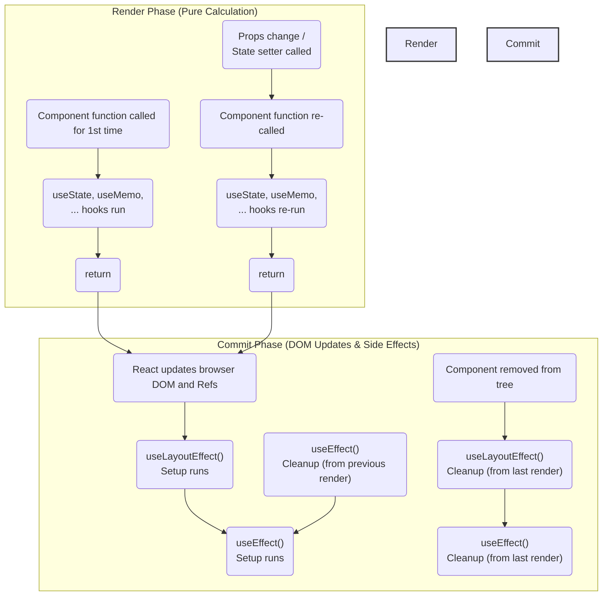
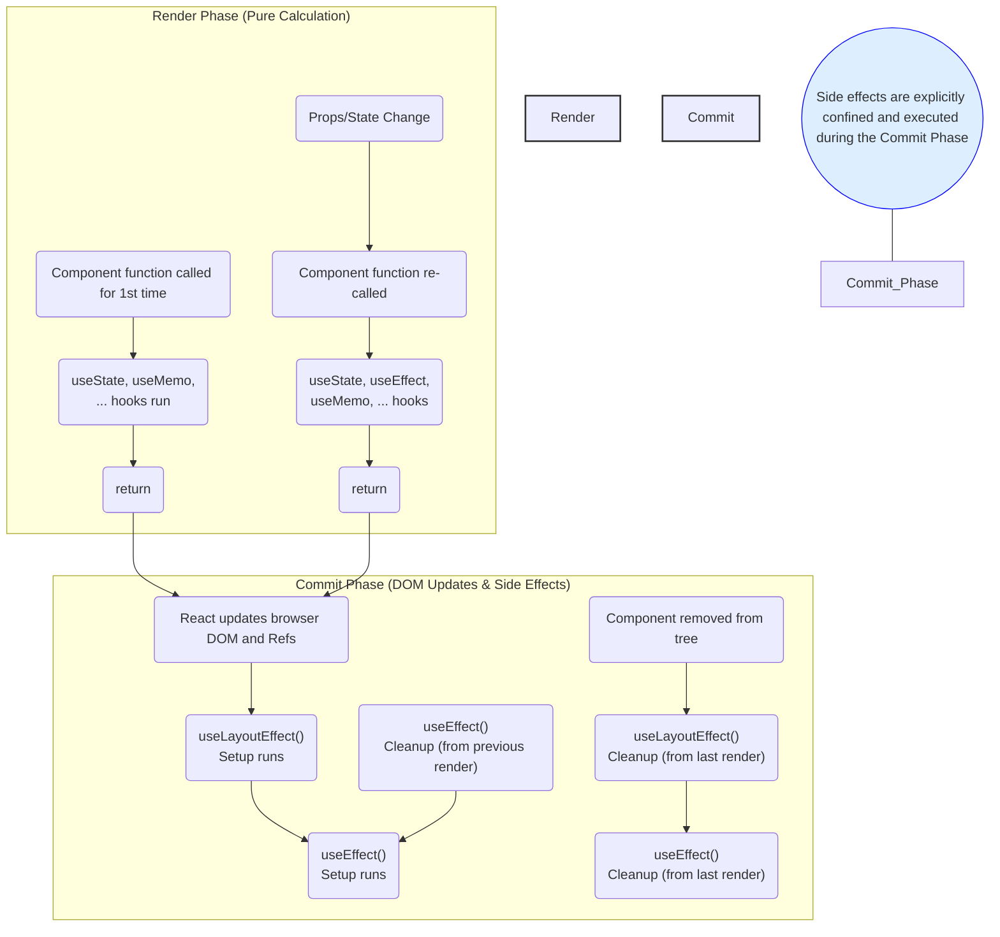

# React Life Cycle

---

## Components' Lifecycle

In **React**, components inherently have a **lifecycle**, progressing through distinct phases:

*   **Mounting:** This is the phase where a component is created for the first time, performs its initial render, and is inserted into the browser's **DOM**. This happens only once per component instance.
*   **Updating:** This phase occurs when a component's **props** or **state** change. React determines that the component needs to update its displayed output, leading to a **re-render** of the component. This phase can happen multiple times throughout a component's existence.
*   **Unmounting:** In this final phase, a component is removed from the browser's **DOM** and is effectively destroyed. This happens only once when the component is no longer needed.

Understanding these lifecycle phases is crucial for correctly managing **side effects** (such as fetching data, setting up timers, or subscribing to external events) that need to happen at specific points in a component's life.

---

## Lifecycle Events

At the core of the React lifecycle is the **render** process. For functional components, this involves the component function executing and returning a description of the UI (**JSX**). While rendering should be a pure calculation of UI based on state and props, **side effects**—operations that interact with the outside world—must occur *outside* this pure render calculation, typically in the **Commit Phase** after the **DOM** is updated. The lifecycle phases (Mounting, Updating, Unmounting) provide specific moments during the Commit Phase when these side effects can be managed.

---

## React Hooks Lifecycle

Modern React uses functional components enhanced with **Hooks** to handle lifecycle events and manage **side effects**.



The component lifecycle with Hooks conceptually involves two main phases per render:

*   **Render Phase:** This is when the component function executes. It must be a pure calculation based on current **props** and **state**, determining what **JSX** to return. Hooks like `useState` (getting state value), `useMemo`, and `useCallback` also run during this phase. **Side effects are strictly prohibited here.**
*   **Commit Phase:** This occurs immediately after the Render Phase. React updates the actual browser **DOM** to match the calculated **JSX**. After the **DOM** is updated, React runs the **side effects** defined using `useEffect` and `useLayoutEffect`. Effects' `setup` functions are executed, allowing interaction with the **DOM**, external APIs, timers, etc. If an effect ran on a previous render, its optional `cleanup` function (if returned by the `setup`) is executed *before* the `setup` for the current render runs, or specifically during the Unmounting phase.

---

## Side Effects in Functional Components

**Side effects** are operations that interact with anything outside the local scope of the component function's execution and its return value. This includes actions like making API calls, setting up timers, managing subscriptions to external data sources, manually changing the **DOM**, or logging to the console. Side effects **must not** be performed directly within the component function body during the Render Phase because this phase should be pure and free of such interactions to ensure predictable rendering.

---

## React Hooks Lifecycle: Where Side Effects Belong



In functional components, **side effects** are managed using the **`useEffect`** Hook and are executed during the **Commit Phase**, specifically *after* React has updated the **DOM**.

---

## Side-effects and Life Cycle in Functional Components: `useEffect` HOOK

The **`useEffect`** Hook is the primary tool for managing **side effects** in functional components, synchronizing them with the component's lifecycle.

Its signature is `useEffect(setup, [dependencies])`:

*   `setup`: This is a required callback function where you put the code for your **side effect**. React runs this function after the component has rendered and the **DOM** has been updated (during the Commit Phase).
*   `[dependencies]` (Optional): This is an optional array of values. If provided, React will re-run the `setup` function only when any of the values in this array have changed between renders.

---

## How To use `useEffect`

The `setup` function within `useEffect(setup, [dependencies])` runs after the component renders and commits changes to the **DOM**. If your effect needs to perform cleanup (e.g., clearing a timer, unsubscribing from a data source), the `setup` function can optionally return another function. This returned **cleanup function** will be executed by React *before* the effect re-runs due to dependency changes (except on the first mount) and also when the component unmounts.

The behavior of the effect (when it runs after the initial mount) is controlled by the `[dependencies]` array:

1.  **No Dependency Array Provided:** The `setup` function runs after *every single* render of the component. Use this rarely and carefully, as it can easily lead to performance issues or infinite loops.
2.  **Empty Array `[]` Provided:** The `setup` function runs only **once** after the initial mount of the component. It will not re-run on subsequent renders, even if **props** or **state** change. This is useful for one-time setup like initial data fetching (similar to `componentDidMount` in class components).
3.  **Array with Values `[dep1, dep2]` Provided:** The `setup` function runs after the initial mount AND whenever any of the values listed in the dependency array (`dep1`, `dep2`, etc.) change between renders. This is used when your effect needs to react to specific changes in **props** or **state**.

---

## `useEffect`'s Dependency Array

The dependency array `[dependencies]` is crucial for optimizing effects and preventing infinite loops. It tells React which values from the component's scope the effect relies on.

1.  **No array:** Effect runs after **every** render.
2.  **Empty array `[]`:** Effect runs **only once** after initial mount.
3.  **Array with values `[props.value, stateValue, someFunction]`:** Effect runs after mount and when any listed value changes. React compares the values in the array between renders using strict equality (`===`).

---

## Side Effects At Mount Time / Update Time Example

This example demonstrates how dependency arrays control when `useEffect` runs.

```javascript
import { useEffect, useState } from 'react';

function Count({ num }) { // This component receives a 'num' prop from its parent
  console.log(`Component rendered with num: ${num}`);

  // Effect 1: Runs only ONCE after the initial mount.
  // The empty dependency array [] signals this behavior.
  useEffect(()=>{
    console.log(`Effect 1 (Mount Only) ran. Initial num was: ${num}`);
    // This effect closure captures the value of 'num' from the *first* render.
  }, []); // Empty array means run once on mount

  // Effect 2: Runs on mount AND every time the 'num' prop changes.
  // The dependency array [num] tells React to re-run this effect when 'num' changes.
  useEffect(()=>{
    console.log(`Effect 2 (num change) ran. Current num is: ${num}`);
    // This effect closure captures the current value of 'num' on mount and subsequent changes.
  }, [num]); // Array with 'num' means run when 'num' changes

  return <div>Current Num Display: {num}</div>;
}

// Example usage in a parent component:
// function Parent() {
//   const [count, setCount] = useState(0);
//   return (
//     <div>
//       <button onClick={() => setCount(count + 1)}>Increment Parent Counter</button>
//       {/* The 'num' prop passed to Count changes when parent's state changes */}
//       <Count num={count} />
//     </div>
//   );
// }
// Initial render of Parent (count is 0):
// - Component rendered with num: 0
// - Effect 1 (Mount Only) ran. Initial num was: 0
// - Effect 2 (num change) ran. Current num is: 0
// Clicking Increment button (count becomes 1):
// - Component rendered with num: 1 (due to parent state change triggering re-render)
// - Effect 1 does NOT run again (due to [] dependency)
// - Effect 2 runs again because 'num' dependency changed from 0 to 1. Current num is: 1
// Clicking Increment again (count becomes 2):
// - Component rendered with num: 2
// - Effect 1 does NOT run again.
// - Effect 2 runs again because 'num' dependency changed from 1 to 2. Current num is: 2
```

---

## Side Effects At Mount Time / Update Time: Detailed Timeline

This detailed view clarifies the sequence of `setup` and optional `cleanup` function calls for effects:

*   **Mounting:**
    1.  Component renders.
    2.  **DOM** updated.
    3.  `useEffect` **setup** runs for *all* effects.
*   **Updating (Dependency Change):**
    1.  **Props** or **state** change.
    2.  Component re-renders.
    3.  **DOM** updated.
    4.  For effects whose dependencies **have changed**:
        *   The **cleanup function** (returned from the *previous* execution of this effect's setup) runs.
        *   The **setup function** for the current render runs.
    5.  For effects whose dependencies **have NOT changed**:
        *   Neither cleanup nor setup runs.
*   **Unmounting:**
    1.  Component is removed from the tree.
    2.  For all effects that ran at least once, their **cleanup function** (returned from the *last* execution of their setup) runs.

Effects with `[]` dependencies run their setup only on mount. Effects with dependencies run setup on mount and when dependencies change; cleanup runs *before* the re-run caused by dependency change and on unmount.

---

## `useState` Meets `useEffect`

`useState` and `useEffect` are frequently used together. A state variable declared with `useState` can be included in the dependency array of `useEffect`, causing the effect to re-run when that state changes. Conversely, the state's setter function returned by `useState` can be called *inside* the `setup` or `cleanup` function of `useEffect` to update state asynchronously, potentially triggering another **re-render** cycle.

---

## `useState` Meets `useEffect` Example (`QuickGate`)

This example uses state (`open`) and an effect to manage a timer that automatically closes a "gate". The effect depends on the `open` state.

```javascript
import { useEffect, useState } from 'react';

function QuickGate() {
  // State to track if the gate is open or closed
  const [open, setOpen] = useState(false);

  // Effect to manage the timeout for closing the gate
  useEffect(()=>{
    let timerId; // Variable to hold the timeout ID

    if (open) {
      // Side effect: If gate is open, set a timer to close it after 500ms
      console.log("Gate open, setting timeout to close in 500ms...");
      timerId = setTimeout(() => {
        console.log("Timeout fired, setting gate to close.");
        setOpen(false); // Update state to close the gate (triggers re-render)
      }, 500);

      // Cleanup function: This runs before the effect re-runs OR when the component unmounts.
      // It clears the timeout to prevent it from firing if 'open' becomes false another way.
      return () => {
        console.log("Cleaning up timeout.");
        clearTimeout(timerId); // Clear the scheduled timeout
      };
    } else {
      // If gate is closed, log message and don't set a timeout.
      console.log("Gate closed, no timeout needed.");
    }

    // If the 'open' state is false, the effect doesn't need cleanup related to a timer.
    return undefined; // Or just return nothing
  }, [open]); // Dependency array: Effect runs when the 'open' state variable changes

  // Handler to open the gate (by updating state)
  const openMe = () => {
    console.log("Click detected, setting gate to open.");
    setOpen(true); // Update state to open the gate (triggers re-render)
  };

  return (
    // Display gate status and make the div clickable to open it
    <div onClick={openMe} style={{ cursor: 'pointer', padding: '10px', border: '1px solid black' }}>
      Gate: {open ? 'GO' : 'STOP'}
    </div>
  );
}

// Workflow:
// 1. Initial Mount: open=false. Render. Effect runs ([open] is false). Logs "Gate closed...", returns nothing.
// 2. User Clicks: openMe() calls setOpen(true).
// 3. React: Schedules state update. Triggers re-render.
// 4. Re-render 1 (after click): open=true. Render. Effect runs ([open] changed from false to true).
//    - Setup runs: Logs "Gate open...", sets timer, returns cleanup function.
// 5. React: Timeout fires after 500ms. setOpen(false) is called.
// 6. React: Schedules state update. Triggers re-render.
// 7. Re-render 2 (after timeout): open=false. Render. Effect runs ([open] changed from true to false).
//    - Cleanup runs (from Re-render 1's setup): Logs "Clearing timeout.", clears the now-fired timer (harmless).
//    - Setup runs: Logs "Gate closed...", returns nothing.
// 8. Gate is STOP, no timer running. Ready for next click.
```

---

## `useEffect` Dependency Array Caveats

Correctly specifying the `[dependencies]` array is crucial for both the correctness and performance of your effects. Misunderstandings here are a common source of bugs.

1.  **Include All Referenced Values:** The dependency array **must** include every value (**props**, **state**, functions, variables calculated inside the component but outside the effect) from the component's scope that is used *inside* the `setup` function and *can change over time*.
2.  **Stale Values (Closures):** If you use a value inside an effect but omit it from the dependency array, the effect's `setup` function (and its cleanup) will form a "**stale closure**," retaining the value from the render when the effect last ran. This means the effect will use an outdated value when it runs again (e.g., a counter value from an old render).
3.  **Infinite Loops:** An effect that incorrectly updates a value included in its dependency array will trigger itself repeatedly, leading to an **infinite render loop**.

---

## Infinite Loops with `useEffect`

**Infinite loops** with `useEffect` are a common pitfall, usually stemming from incorrect dependency arrays. The cycle is: effect runs -> effect updates **state** or causes a **prop** change -> this triggers a **re-render** -> the dependency check in the effect determines it should run again -> the effect runs, updates state/props -> repeats.

Common cases leading to infinite loops:

1.  **Missing dependency array:** The effect re-runs after *every* render. If the effect updates state or props, it triggers a re-render, causing the effect to run again, indefinitely.
2.  **Object or Array dependency:** If you include an object or array directly in the dependency array (`[myObject]`, `[myArray]`), the effect will re-run every time the *reference* to that object or array changes. If your effect (or a related **state setter**/**handler**) creates a *new* object or array instance on every render or every update, this new reference will trigger the effect again, causing a loop.

---

## 1. Set Up Dependencies Correctly (Fixing Missing Dependencies)

The fix for the infinite loop above is to provide a dependency array that includes the value(s) that the effect truly depends on to trigger its logic. In the case of counting input changes, the effect should only increment the count when the `value` of the input *actually changes*.

```javascript
import { useEffect, useState } from 'react';

function CountInputChanges() {
  const [value, setValue] = useState('');
  const [count, setCount] = useState(-1); // Initialize count

  // GOOD: Dependency array [value]. This effect runs on mount and whenever 'value' changes.
  useEffect(() => {
      console.log(`Effect ran! Value changed to: "${value}"`);
      // This updates count state. State update triggers re-render.
      // However, in this new render, 'value' has NOT changed again, so the effect's dependency condition is not met.
      // The loop is broken.
      setCount((c) => (c + 1));
  }, [value]); // <--- Correct dependency array

  const handleChange = (ev) => setValue(ev.target.value); // Updates value state -> triggers re-render -> effect runs *because* [value] changed

  return (
    <div>
      <input type="text" value={value} onChange={handleChange} />
      <p>Changes: {count}</p>
    </div>
  );
}

// Execution Flow:
// Initial Render -> Effect runs (value is '') -> setCount(-1 -> 0) -> React schedules state update -> React triggers re-render.
// Re-render (value is '', count is 0) -> Effect dependencies [value] ('' === '') have NOT changed. Effect does NOT run. Loop is broken.
// User types 'a' (value becomes 'a') -> handleChange calls setValue('a') -> React schedules state update -> React triggers re-render.
// Re-render (value is 'a', count is 0) -> Effect dependencies [value] ('a' !== '') HAVE changed. Effect runs.
// Effect runs -> setCount(0 -> 1) -> React schedules state update -> React triggers re-render.
// Re-render (value is 'a', count is 1) -> Effect dependencies [value] ('a' === 'a') have NOT changed. Effect does NOT run. Loop is broken.
// And so on. The effect correctly runs only when 'value' changes.
```

---

## Example: Objects As Dependencies Leading to Infinite Loop

When an effect depends on an object or array state variable, the effect re-runs whenever the *reference* to that object/array changes. If the effect itself, or a function called by the user that updates the state, creates a *new* object or array instance with every update (which is necessary for immutable state updates), this new reference can trigger an infinite loop if not handled correctly.

```javascript
import { useEffect, useState } from 'react';

function CountSecretsBAD() {
  // State is an object containing both the input value and the count
  const [secret, setSecret] = useState({ value: "", countSecrets: 0 });

  // Effect depends on the entire 'secret' object reference
  useEffect(() => {
    console.log("Effect ran! Checking value:", secret.value);
    if (secret.value === 'secret') {
      // This updates state by creating a NEW object reference
      setSecret(s => ({...s, countSecrets: s.countSecrets + 1}));
      // This state update triggers a re-render.
    }
  }, [secret]); // BAD: Dependency is the object reference [secret]

  // This handler updates 'value' state, also by creating a NEW object reference
  const onChange = (ev) => {
    setSecret(s => ({ ...s, value: ev.target.value }));
  }

  return (
     <div>
      <input type="text" value={secret.value} onChange={onChange} />
      <p>Secrets Found: {secret.countSecrets}</p>
    </div>
  );
}
// Execution Loop (when value becomes 'secret'):
// ... user types 'secret' -> onChange runs -> setSecret creates NEW object { value: 'secret', countSecrets: 0 } -> Re-render -> Effect runs ([secret] reference changed) -> setSecret creates NEW object { value: 'secret', countSecrets: 1 } -> Re-render -> Effect runs ([secret] reference changed) -> setSecret creates NEW object { value: 'secret', countSecrets: 2 } -> ... infinite loop ...
```

---

## 2a. Avoid Objects As Dependencies (Fixing Object Dependencies)

To fix the infinite loop when dealing with object or array state: avoid including the entire object or array reference in the dependency array if that object/array is frequently updated by creating a new reference. Instead, depend only on the **specific primitive values *from* the object or array** that the effect actually uses.

```javascript
import { useEffect, useState } from 'react';

function CountSecrets() {
  const [secret, setSecret] = useState({ value: "", countSecrets: 0 });

  // Effect depends ONLY on the primitive value 'secret.value'
  useEffect(() => {
    console.log("Effect ran! Checking value:", secret.value);
    if (secret.value === 'secret') {
      // This updates state by creating a NEW object reference { value: 'secret', countSecrets: X+1 }
      // This update triggers a re-render.
      // However, in this re-render, 'secret.value' (the primitive string 'secret') has NOT changed again.
      // Therefore, the effect's dependency condition ([secret.value]) is not met, and it does NOT re-run because of *this* update. The loop is broken.
      setSecret(s => ({...s, countSecrets: s.countSecrets + 1}));
    }
  }, [secret.value]); // GOOD: Dependency is the primitive value secret.value

  const handleChange = (ev) => {
     // This also creates a NEW object reference { value: ev.target.value, countSecrets: X }
     // This state update triggers a re-render.
     // If ev.target.value is different from the previous secret.value, the effect will run because [secret.value] changed.
    setSecret(s => ({ ...s, value: ev.target.value }));
  }

  return (
     <div>
      <input type="text" value={secret.value} onChange={handleChange} />
      <p>Secrets Found: {secret.countSecrets}</p>
    </div>
  );
}
// Execution Flow (when value becomes 'secret'):
// ... user types 'secret' -> handleChange runs -> setSecret creates NEW object { value: 'secret', countSecrets: 0 } -> Re-render.
// Re-render (value is 'secret', countSecrets is 0) -> Effect dependencies [secret.value] ('secret' !== '') HAVE changed. Effect runs.
// Effect runs -> setSecret creates NEW object { value: 'secret', countSecrets: 1 } -> Re-render.
// Re-render (value is 'secret', countSecrets is 1) -> Effect dependencies [secret.value] ('secret' === 'secret') have NOT changed. Effect does NOT run. Loop is broken.
// Success: The effect runs once when value becomes 'secret', updates countSecrets, and stops.
```

---

## 2b. Avoid Arrays As Dependencies

Arrays as dependencies cause the same infinite loop issues as objects if their reference changes on update. Avoid putting entire arrays directly in the dependency array if they are frequently modified by creating new instances.

Alternatives:

1.  If the effect should only run once, use an **empty dependency array `[]`**.
2.  If the effect should react to specific changes *within* the array, depend on **primitive values derived from the array** (e.g., `[array.length]`, `[array[0].id]`, or even a string representation if needed `[array.map(item => item.id).join(',')]`).
3.  If the effect needs to be triggered by an action that results in an array update, consider using an **additional primitive state variable** (like a flag or a counter) as a dependency to explicitly signal when the effect should run.

```javascript
import { useEffect, useState } from 'react';

function ShoppingList() {
  const [list, setList] = useState([]);
  const [isLoading, setIsLoading] = useState(true); // State for loading feedback

  // Effect to fetch the initial list of items on mount.
  useEffect(()=> {
    const getItems = async () => {
      setIsLoading(true); // Set loading state
      try {
        const response = await fetch('/api/items'); // fetch returns Promise
        if (!response.ok) throw new Error('Failed to fetch items');
        const items = await response.json(); // json returns Promise, might throw
        setList(items); // Updates state (creates NEW array ref). If [list] was dependency, loop.
      } catch (error) {
        console.error("Error fetching list:", error);
        // Handle error (e.g., display message)
      } finally {
        setIsLoading(false); // End loading state
      }
    };
    getItems(); // Call the async fetch function immediately within the effect setup

  }, []); // GOOD: Empty dependency array. This effect runs ONLY once after the initial mount.

  return (
    <div>
      <h1>Shopping List</h1>
      {isLoading && <p>Loading list...</p>}
      {!isLoading && list.length === 0 && <p>No items in list.</p>}
      {!isLoading && list.length > 0 && (
        <ul>
          {list.map(item => <li key={item.id}>{item.text}</li>)}
        </ul>
      )}
    </div>
  );
}
// The list items are rendered based on the 'list' state.
// The effect correctly fetches the list once on mount without infinite loops.
```

---

## Dehydrating During Updates (Saving Changes)

When a user action modifies data in the UI (e.g., editing a list item, submitting a form), you often need to send these changes to the backend API to persist them in the database. This process of sending data from the client to the server is sometimes referred to as **dehydrating** application state (sending it out of the client).

There are different patterns for performing this dehydration:

**Optimistic Update:** This pattern prioritizes UI responsiveness. You update the local component **state** (or global state) *immediately* to reflect the user's intended change (e.g., add the new item to the list right away, maybe marking it as "pending"). Then, in parallel, you initiate the asynchronous API request to the backend. The UI feels fast and responsive because it updates instantly. The risk is that if the API request fails, you must implement logic to **Rollback** the local state to its previous value, showing an error message to the user.

```javascript
// Assume list is state useState([]) and newItemText is state useState('')
const addItem = async () => {
  // 1. Create a temporary ID and item representation for the optimistic update
  const tempId = `temp-${Date.now()}`;
  const newItem = { id: tempId, text: newItemText, status: 'pending' }; // Add a status for visual feedback

  // Clear input field immediately for good UX
  setNewItemText('');

  // 2. Perform the optimistic update: Add the new item to the local list state right away
  setList(items => [...items, newItem]);

  // 3. Dehydrate: Send the change to the API asynchronously
  try {
      const response = await fetch('/api/items', {
          method: 'POST',
          headers: { 'Content-Type': 'application/json' },
          body: JSON.stringify({ text: newItemText }),
      });

      if (!response.ok) {
          // If API responds with an error status, throw an error
          throw new Error('API failed to add item.');
      }

      // 4. API Success: (Optional) Update the local item with the server's confirmed data (e.g., real ID)
      // const serverItem = await response.json();
      // setList(items => items.map(item => item.id === tempId ? {...item, ...serverItem, status: 'completed'} : item));

      // Alternative 4 (Recommended for complexity): Rehydrate/Refresh the whole list after success
      // await getItems(); // Assuming getItems is the function to fetch the full list

  } catch (error) {
      // 4. API or Network Failure: Rollback the optimistic local state change
      console.error("Failed to add item:", error);
      setList(items => items.filter(item => item.id !== tempId)); // Remove the temporary item from the list
      alert("Failed to add item. Please try again."); // Inform the user
  }
};
```

---

## Dehydrating During Updates – Alternative (Sequential Update)

The alternative to optimistic update is the **Sequential Update** (sometimes called Pessimistic Update). In this pattern, when a user action modifies data, you first initiate the API request to the backend. The UI typically shows a loading indicator or disables the input/button during this time. You **wait** for the API request to complete and confirm success (e.g., receive a 2xx status). **Only after** receiving a successful response do you update the local component **state** (or global state) to reflect the change. This approach guarantees consistency between the UI and the backend because the local state is only updated based on confirmed server state. The main drawback is potential UI lag, as the interface doesn't update until the round trip to the server is complete.

```javascript
// Assume list is state useState([]) and newItemText is state useState('')
const addItem = async () => {
  // 1. Show loading feedback (optional)
  setIsAdding(true); // Assume setIsAdding is a state setter for isLoading boolean

  // 2. Dehydrate: Send the change to the API and WAIT for response
  try {
    const response = await fetch('/api/items', {
      method: 'POST',
      headers: { 'Content-Type': 'application/json' },
      body: JSON.stringify({ text: newItemText }),
    });

    if (!response.ok) {
      // If API responds with an error status, throw
      throw new Error('API failed to add item.');
    }

    // 3. API Success: Get the confirmed data (e.g., server-assigned ID) and update local state
    const serverItem = await response.json();
    setList(items => [...items, serverItem]); // Update local state ONLY after server confirms success
    setNewItemText(''); // Clear input field

  } catch (error) {
    // 4. API or Network Failure: Handle the error
    console.error("Failed to add item:", error);
    alert("Failed to add item. Please try again."); // Inform the user

  } finally {
    // 5. Hide loading feedback
    setIsAdding(false);
  }
};
```

---

## During Updates: Dehydrate And Rehydrate (Combined Approach)

A common and often recommended pattern combines aspects of optimistic and sequential updates for a good balance of responsiveness and consistency. You perform an **Optimistic Update** on the local **state** immediately to give fast UI feedback (e.g., add the item and mark it pending). Then, you send the **Dehydration** API request asynchronously. Upon **API Success**, instead of just updating the single item, you often trigger a full **Rehydration/Refresh** of the relevant data by re-fetching the entire list or related data from the server. This ensures the local state is eventually fully synchronized with the backend, picking up any server-side changes or side effects. If the API request fails, you perform a **Rollback** of the original optimistic change and show an error.

```javascript
// Assume list is state useState([]) and newItemText is state useState('')
// Assume getItems is the function to fetch the list from the API and set the list state.
const getItems = async () => { /* Implementation: fetch('/api/items')...setList(...) */ };

const addItem = async () => {
  // 1. Optimistic Update: Add item locally with a temp ID and pending status
  const tempId = `temp-${Date.now()}`;
  const newItem = { id: tempId, text: newItemText, status: 'pending' };
  setNewItemText('');
  setList(items => [...items, newItem]);

  // 2. Dehydrate: Send the change to the API asynchronously
  try {
    const response = await fetch('/api/items', {
      method: 'POST',
      headers: { 'Content-Type': 'application/json' },
      body: JSON.stringify({ text: newItemText }),
    });

    if (response.ok) { // 3a. API Success: Trigger Rehydration/Refresh
      console.log("Item added successfully on server. Rehydrating list.");
      getItems(); // Re-fetch the entire list to synchronize state

    } else { // 3b. API Error: Log error, Rollback, Alert
      console.error('API failed to add item:', response.status);
      setList(items => items.filter(item => item.id !== tempId)); // Remove the temporary item
      alert("Failed to add item on server. Please try again.");
    }
  } catch (error) { // 4. Network Error: Log error, Rollback, Alert
    console.error("Network error adding item:", error);
    setList(items => items.filter(item => item.id !== tempId)); // Remove the temporary item
    alert("Network error. Failed to add item. Please try again.");
  }
};
```

---

## Peeking Under the Hood: THE RULES OF HOOKS

To ensure React's Hooks (like `useState`, `useEffect`) work correctly and predictably, there are two fundamental rules you **must** follow:

1.  **Only Call Hooks at the Top Level:** Hooks must be called directly inside the body of a React function component or directly inside a **custom Hook** function. They **must not** be called inside loops, conditional statements (`if`/`else`), or nested standard JavaScript functions. React relies on the order in which Hooks are called being the same across every render of a component. Calling Hooks conditionally or within variable loops breaks this consistent order.
2.  **Only Call Hooks from React Function Components or Custom Hooks:** Hooks are specifically designed to interact with React's component model. You **must not** call Hooks from regular, non-React JavaScript functions or from **class components**.

These rules are important for React to correctly associate **state** and effects with the correct component instance across renders. Tools like the ESLint plugin `eslint-plugin-react-hooks` can automatically enforce these rules and help you catch violations during development.

---

## `useEffect` Run Twice? (Strict Mode Behavior)

During development (but not in production), React's **Strict Mode** can mount, unmount, and re-mount components in a rapid sequence. Specifically, for effects that include a cleanup function, Strict Mode will run the effect's `setup`, immediately run the effect's `cleanup`, and then run the `setup` again (`setup` -> `cleanup` -> `setup`) right after the component mounts (in addition to the standard mount execution). This behavior is intended to stress test your effect's cleanup logic, helping you verify that resource allocation (in setup) and deallocation (in cleanup) are correctly paired and that your cleanup logic effectively reverses the setup logic. If your effect setup or cleanup code has issues (e.g., incorrect cleanup logic, or relies on state that might be reset by a double render), this "run twice" behavior in Strict Mode will help you identify them during development. If your effect works correctly when Strict Mode runs it twice, it is generally robust.

---

## You Might Not Need an Effect

It's important to recognize that not every piece of logic needs to be placed inside a `useEffect` Hook. Avoid using `useEffect` for:

1.  **Transforming data for rendering:** If you need to calculate a value or derive new data based on existing **props** or **state** *solely* for the purpose of displaying it in the **JSX**, perform this calculation directly in the component body before the `return` statement. This is pure and happens naturally during the Render Phase.
2.  **Handling user events:** Logic that should run directly in response to a user interaction (like a button click or form submission) belongs in an event handler function attached to the relevant DOM element (e.g., in an `onClick` or `onSubmit` handler).

Use `useEffect` primarily for **synchronizing with external systems** or performing operations that have observable **side effects** outside of React's rendering, such as: fetching data from an API, setting up subscriptions to external data sources (like WebSockets), managing timers (`setTimeout`, `setInterval`), manually interacting with the browser **DOM** (e.g., measuring elements), interacting with browser storage (`localStorage`), or sending analytics events.

---

## Summary: Four Ways To Call `useEffect`

The behavior of `useEffect` after the initial mount is determined by its dependency array:

1.  **Mount Only:** Call `useEffect(setup, [])`. The `setup` function runs one time after the initial render. The empty array `[]` indicates that the effect depends on nothing that will change during the component's lifetime, effectively running only on mount (similar to `componentDidMount`).
2.  **Every Render:** Call `useEffect(setup)`. Provide **no second argument** (no dependency array at all). The `setup` function runs after *every* render. Use this rarely.
3.  **Mount and Dependency Change:** Call `useEffect(setup, [dep1, dep2, ...])`. Provide an array containing specific values. The `setup` function runs after the initial render AND whenever any of the values in the `[dependencies]` array change between renders (compared using strict equality `===`). This is the most common pattern.
4.  **Cleanup (on unmount/before re-run):** Within the `setup` function of any of the above variations, return a function: `useEffect(() => { /* setup logic */; return () => { /* cleanup logic */ }; }, [dependencies])`. This returned function will be executed by React before the effect re-runs (if dependencies change) and when the component unmounts.

---

## How To Handle Other Lifecycle Situations

Beyond `useEffect` for general **side effects**, other Hooks address specific lifecycle-related needs:

*   `useLayoutEffect`: This Hook has the same signature as `useEffect` but runs synchronously *immediately* after React has performed all **DOM** mutations during the Commit Phase, but *before* the browser has painted those changes to the screen. Use `useLayoutEffect` for scenarios where you need to read the **DOM** layout (e.g., get the size or position of an element) or perform **DOM** manipulations that must be visible before the user sees the updated UI, as these calculations might influence subsequent layout. It can block visual updates, so use it sparingly.
*   `useMemo`: This Hook helps optimize performance by **memoizing** (caching) the result of an expensive calculation. `useMemo(() => computeExpensiveValue(a, b), [a, b])` takes a function that returns the value and a dependency array. The function is re-executed only if the dependencies change. Useful for avoiding re-calculating data on every render when it hasn't changed.
*   `useCallback`: Similar to `useMemo` but specifically for **memoizing function instances**. `useCallback(() => myFunction(a), [a])` returns a memoized version of your function. The function itself is re-created only if its dependencies change. Useful for preventing unnecessary **re-renders** of child components that receive callback functions as **props** (where reference equality matters).

Use these optimization Hooks (`useMemo`, `useCallback`, `useLayoutEffect`) selectively, typically after profiling your application and identifying performance bottlenecks, rather than applying them everywhere by default.

---

## React as an API Client: HANDLING API CALLS IN REACT

Integrating a React frontend with backend APIs is a very common task. The frontend acts as a client, making HTTP requests to interact with data and logic hosted on the server.

Different Kinds Of State: When dealing with APIs, it's helpful to distinguish state types:

*   **Application State (Server State):** Data that is persisted on the backend (e.g., in a database) and accessed/modified via APIs. This state is often shared among multiple users and might require more complex management or synchronization strategies on the client side.
*   **Presentation State (UI State):** Data that is purely related to the local user interface's temporary state (e.g., whether a modal is open, input field value before submit, active tab index). This state is typically local to a component and does not need to be persisted or synchronized with the backend. `useState` is ideal for this.

Frequent Use Cases involving APIs in React: Loading initial data when a component mounts, fetching data based on changing parameters (e.g., URL params), providing loading and error feedback to the user during fetch, updating remote data (**CRUD** operations), keeping the UI consistent with backend state, handling multiple simultaneous or sequential requests.

API Client Classes / Modules: **RECOMMENDED Practice:** Separate the logic for interacting with your backend API into dedicated JavaScript modules (e.g., `src/api/api.js`, `src/services/userService.js`). These modules contain functions that use `fetch` or Axios to make specific API calls. Keep this API interaction logic separate from your React components. Benefits include: **Separation of Concerns** (UI logic separate from data fetching), **Decoupling** (components don't need to know *how* data is fetched), **Testability** (API functions can be tested independently), and **Reusability** (API functions can be called from different components or even outside of React).

Conceptual Architecture for API Interaction in React: User Action in UI -> Component calls a function in your API Client Module (`API.js`) -> API Client Module uses `fetch` (or Axios) -> `fetch` initiates HTTP Request -> Network -> Backend Server -> Backend logic (e.g., using **DAO** for DB interaction) -> **DB** -> Backend logic receives data -> Backend Server sends HTTP Response -> Network -> `fetch` receives Response -> API Client Module processes response (checks status, parses body) -> Returns data or throws error -> Component receives data/error -> Component updates its **state** -> React triggers Render -> **DOM** updates to show new UI.

Rehydrating And Dehydrating Application State:

*   **Rehydrating:** The process of fetching Application State *from* the backend API and loading it into the client-side state (component state or global state). Initial rehydration often happens when a component mounts using `useEffect([], async () => { ...fetch...setter... })`. Refresh rehydration can happen when specific dependencies change (`useEffect([dep], async () => { ...fetch...setter... })`) or in response to user actions (calling fetch function in an event handler). Use loading and error **state** (`useState`) in components to give feedback during fetch.
*   **Dehydrating:** The process of sending changes made in the client-side state *to* the backend API to update the persisted Application State on the server (e.g., an INSERT, UPDATE, DELETE API call). This is typically triggered by user events like form submission or button clicks, where the event handler calls your API client function.

Rehydrating At Mount Time: The most common use of `useEffect` with an empty dependency array (`[]`) is to fetch initial data when a component first mounts. The effect's `setup` function typically calls an async API function and uses **state setters** (`useState` hooks) to store the fetched data, manage loading state, and track errors.

```javascript
import { useEffect, useState } from 'react';
import { getItems } from '../api/api'; // Assuming getItems is defined in your API module

function ItemList() {
  const [items, setItems] = useState([]);
  const [isLoading, setIsLoading] = useState(true);
  const [error, setError] = useState(null);

  useEffect(() => {
    const fetchItems = async () => {
      setIsLoading(true); // Start loading
      setError(null); // Clear previous error
      try {
        const data = await getItems(); // Call API function (async)
        setItems(data); // Set data state on success
      } catch (err) {
        console.error("Fetch error:", err);
        setError("Failed to load items."); // Set error state on failure
      } finally {
        setIsLoading(false); // End loading
      }
    };
    fetchItems(); // Call the async function defined within the effect

  }, []); // Empty dependency array means this runs only once on mount

  if (isLoading) return <p>Loading items...</p>;
  if (error) return <p style={{ color: 'red' }}>Error: {error}</p>;
  if (items.length === 0) return <p>No items available.</p>;

  return (
    <ul>
      {items.map(item => <li key={item.id}>{item.name}</li>)}
    </ul>
  );
}
```

Rehydrating To Refresh The State: If the data displayed by a component needs to refresh based on changes to a **prop**, **state** variable, or URL parameter (from **React Router**), you include that value in the `useEffect` dependency array (`useEffect([dep], async () => { ...fetch... })`). This ensures the fetch re-runs whenever the dependency changes. Challenges here include correctly identifying all dependencies and avoiding the infinite loops discussed earlier. You also face the "**N-Clients Problem**".

The "**N-Clients Problem**": This describes the challenge when multiple users (clients) are interacting with the same shared Application State on the backend database. How does one client's UI update when another client makes a change on the server? Relying solely on a client's actions to trigger updates is insufficient.
Basic Solutions:

*   **Polling:** The client periodically sends requests to the server (e.g., every few seconds using `setInterval` within a `useEffect`) to check for updates. Simple to implement but inefficient (wastes resources, adds lag) and not truly real-time.
*   **Server-Push / Real-time:** The more robust solution involves the server actively sending updates to interested clients when changes occur. Technologies for this include WebSockets, Server-Sent Events (SSE), or Pub/Sub systems. These are typically beyond the scope of introductory React.

Infinite Loops with `useEffect`: As previously discussed, this occurs when an effect causes a **state** or **prop** change that, due to incorrect dependencies (missing dependencies, or depending on object/array references that change unnecessarily), triggers the effect to run again, repeating the cycle. This is a critical pitfall to avoid when managing state updates and fetches within effects.