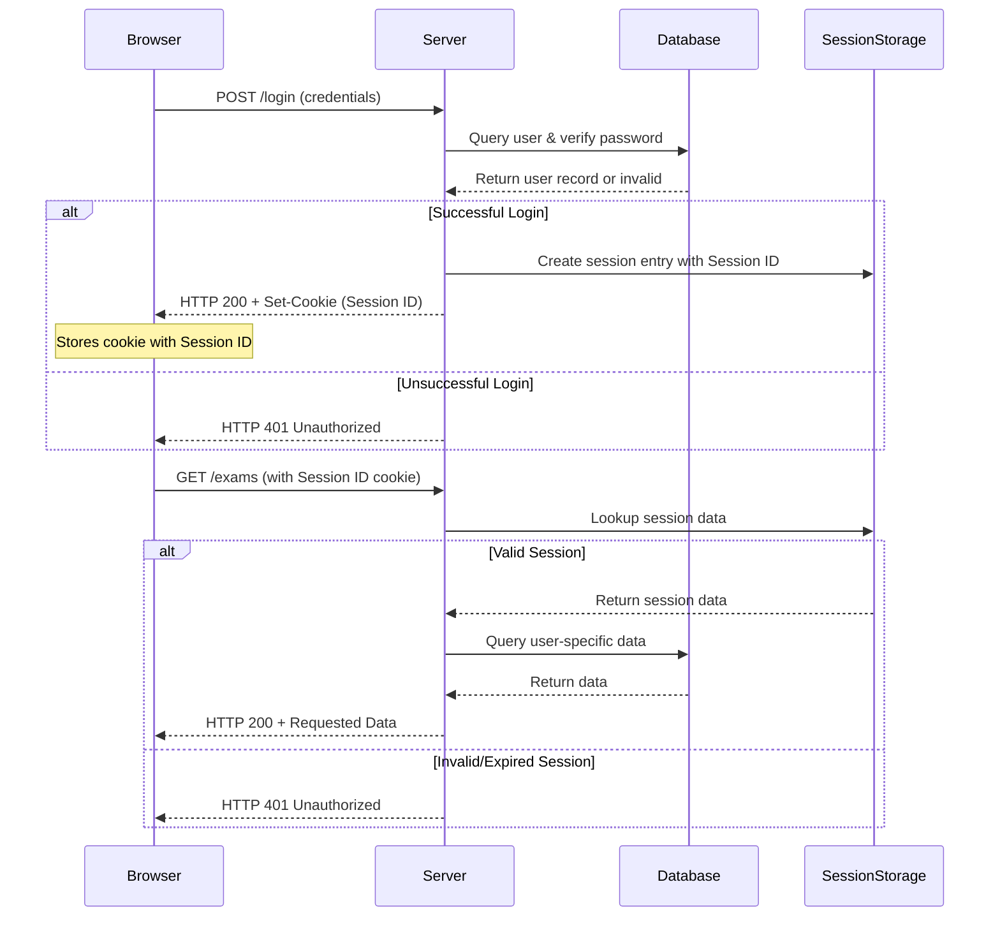

# Authentication in Web Applications

This document provides a clear explanation of authentication and authorization within the context of web applications, with a practical focus on implementing a session-based approach using Node.js with the Express framework and the Passport.js authentication middleware.

**Topics Covered:**

*   The fundamental need for authentication.
*   Understanding HTTP sessions and their role.
*   Practical implementation considerations using React (client) and Express/Passport.js (server).

---

## Authentication vs. Authorization

These two concepts are often used together but are distinct:

*   **Authentication:** The process of verifying the identity of a user or system. It answers the question: "**Who are you?**" This is typically done by checking credentials like a username and password, an API key, or a digital certificate. Successful authentication allows the application to personalize the user experience and know who is making requests.
*   **Authorization:** The process of determining what an authenticated user or system is permitted to do. It answers the question: "**What are you allowed to do?**" This is based on the identity established during authentication and involves checking permissions against resources or actions.

Together, they form the basis of access control in web applications.

---

## Challenges in Authentication/Authorization Development

Implementing secure and robust authentication and authorization systems is **complex, time-consuming, and highly error-prone**. Mistakes can lead to serious security vulnerabilities (data breaches, unauthorized access). Key challenges include:

*   Securely handling user credentials (storage, hashing).
*   Managing user sessions securely.
*   Protecting against common web vulnerabilities (CSRF, XSS, brute-force attacks).
*   Integrating external authentication providers (Google, Facebook, etc.).
*   Coordinating secure interactions between the client (browser/frontend) and the server (backend).

**Recommendation:** Due to the critical security implications, it is strongly recommended to **avoid building custom authentication systems from scratch**. Instead, leverage established best practices, standardized protocols, seek security expertise, and utilize well-vetted, actively maintained libraries and frameworks like Passport.js.

---

## Layers of Authorization

A user request requiring authentication/authorization involves coordinated actions across multiple layers of the application stack:

| Layer         | Responsibility                    | Mechanism                                                            | When Action Occurs                              |
| :------------ | :-------------------------------- | :------------------------------------------------------------------- | :---------------------------------------------- |
| **User**      | Initiate action (login/request).  | Interacting with the application UI (clicks, form submission).       | As needed (e.g., clicking a 'My Profile' link). |
| **React App** | Manage UI state, initiate requests.| Local component state, React Context, global state managers.         | Update UI on login/logout; check state for conditional rendering/routing. |
| **Browser**   | Remember Session ID.              | Stores Session ID in a **Session Cookie**.                           | Receives cookie in login response; attaches cookie to subsequent requests to the correct domain. |
| **Server**    | Remember session data.            | Server-side session storage (memory, file, database, cache like Redis) linking Session ID to user details. | Creates session entry on successful login; retrieves on subsequent requests; destroys on logout. |
| **Route (API)** | Enforce access policy.            | Checks for valid session/authenticated user (`req.isAuthenticated()`), uses `req.user` for user-specific actions. | Before processing a non-public API request.     |
| **Route (Login)**| Verify credentials.             | Compares submitted credentials against stored user data (passwords must be securely hashed). | On receiving a login attempt request.         |
| **Route (Logout)**| Terminate session.              | Destroys the server-side session entry.                              | On receiving a logout request.                |
| **Database (Login)**| Store/validate user data.       | Stores user records (email, hashed password, salt); queries during login to find user and verify password. | During login process.                           |
| **Database (API)**| Store application data.         | Stores user-specific data (e.g., exams, profile info); queries based on the authenticated user's ID. | During processing of authenticated API requests. |

---

## Cookies and Sessions: Giving Memory to HTTP

HTTP is fundamentally **stateless**. Each request from a client to a server is independent; the server does not inherently remember anything about previous requests from the same client. To build interactive web applications where users can log in, add items to a cart, or maintain state across page views, we need mechanisms to give HTTP "memory". This is where **Cookies and Sessions** come in.

### Sessions Defined

A **session** represents a temporary, interactive exchange between a client and a server over a period of time. In typical web applications, the **server maintains state** associated with the session for its duration. A session usually begins when a user first interacts with the application (or logs in) and ends when they log out, close their browser, or after a period of inactivity (session timeout).

### Session ID: The Basic Mechanism

The core technical mechanism used to link stateless HTTP requests to a stateful session is the **Session ID**:

1.  Upon successful authentication (or sometimes on the first visit), the **server generates a unique, random Session ID**.
2.  This Session ID is sent back to the client (browser) in an HTTP response.
3.  The client (browser) stores the Session ID (most commonly in a **cookie**).
4.  On all subsequent requests to the same server/domain within the session, the browser automatically includes the stored Session ID (via the cookie).
5.  The server receives the Session ID from the client and uses it as a key to look up the associated session data stored server-side (e.g., user ID, preferences, cart contents).

**Important:** The Session ID itself should be a random, difficult-to-guess string and **must not contain any sensitive user information**. It is merely a key to server-side data.

### Cookies Explained

A **cookie** is a small piece of data that a server sends to the user's browser. The browser may store it and automatically send it back with future requests to the same domain (and path, depending on cookie configuration).

Cookies are the most common client-side storage mechanism for Session IDs. **Just like the Session ID, cookies themselves should not store sensitive user data directly.** Their primary use in authentication is to hold the Session ID.

### Cookie Attributes

When a server sets a cookie using the `Set-Cookie` HTTP response header, it can include several attributes to control the cookie's behavior:

*   `name`: The mandatory name of the cookie (e.g., `sessionid`).
*   `value`: The mandatory content of the cookie (e.g., the generated Session ID).
*   `Expires` or `Max-Age`: Sets a future date/time or duration for the cookie to expire. If omitted, it's a **session cookie** that expires when the browser is closed.
*   `Domain`: Specifies which domains can receive the cookie.
*   `Path`: Specifies which paths within the domain receive the cookie.
*   `**Secure**`: **Crucial for production.** The cookie is sent only over encrypted HTTPS connections.
*   `**HttpOnly**`: **Crucial for security.** The cookie is inaccessible to browser-side JavaScript (`document.cookie`). This significantly mitigates risks from Cross-Site Scripting (XSS) attacks, where malicious JavaScript could steal cookies.
*   `SameSite`: Helps mitigate Cross-Site Request Forgery (CSRF) attacks by controlling when cookies are sent with cross-origin requests.

---

## Session-based Authentication Flow

Here's a step-by-step flow for session-based authentication, illustrating the interaction between browser, server, and session storage:



---

## A Note About Security... (Revisited)

*   **Always** use **HTTPS** in production to encrypt communication. This prevents Session IDs (and other data) from being intercepted.
*   **Always** use **`Secure`** and **`HttpOnly`** attributes on your session cookies.
*   **Never** store passwords or sensitive user data directly in cookies or Session IDs.
*   **Hash passwords securely** with a unique salt for each user before storing them. Use strong, modern algorithms (like `scrypt` or `bcrypt`).
*   Implement **CSRF protection**. Frameworks often provide middleware for this.
*   Be mindful of **XSS**. HttpOnly cookies are a key defense, but proper input sanitization/output encoding is also vital.
*   **Rely on established, audited libraries and frameworks** (Passport.js, `express-session`, secure password hashing libraries). Do not invent your own security primitives.

---

## Auth in Practice: Authentication/Authorization with Passport.js and React

Let's look at how this session-based flow is implemented in practice using Node.js with Express (server) and React (client).

### Base Login Flow (Practical)

1.  Client (React form) captures username/password input.
2.  Client sends HTTP **POST** request to `/api/login` containing the credentials in the request body.
3.  Server (Express route configured with Passport.js) receives the request.
4.  Passport's configured strategy (e.g., `LocalStrategy`) extracts credentials and calls a user-provided `verify` function.
5.  The `verify` function checks credentials against the database.
6.  If credentials invalid, Passport sends a failure response (e.g., `401 Unauthorized`) back to the client.
7.  If credentials valid, the `verify` function signals success to Passport, passing the authenticated user object.
8.  Passport calls its `serializeUser` function to determine what minimal user information to store in the session.
9.  The Express session middleware uses this information to create/update a server-side session entry and sends the Session ID cookie (`Set-Cookie` header) in the response.
10. Browser receives the response, including the `Set-Cookie` header, and stores the cookie.
11. Client-side React code handles the successful response (e.g., redirects to a protected page).

### Login Form (React - Client Side)

This is a standard React form component using state hooks to manage input values and an `onSubmit` handler to trigger the login process.

```javascript
import { useState } from 'react';

function LoginForm(props) {
  const [username, setUsername] = useState('');
  const [password, setPassword] = useState('');

  const doLogin = (event) => {
    event.preventDefault(); // Prevent default form submission
    // Perform client-side validation if needed
    if (username && password) { // Basic check
      // Call a prop function passed from the parent to handle the actual fetch/API call
      props.userLoginCallback(username, password);
    } else {
      // Show validation errors to the user
      console.log("Username and password are required.");
    }
  };

  return (
    <form onSubmit={doLogin}>
      <div>
        <label htmlFor="username">Username:</label>
        <input
          id="username"
          type="text"
          value={username}
          onChange={ev => setUsername(ev.target.value)}
        />
      </div>
      <div>
        <label htmlFor="password">Password:</label>
        <input
          id="password"
          type="password"
          value={password}
          onChange={ev => setPassword(ev.target.value)}
        />
      </div>
      <button type="submit">Login</button>
    </form>
  );
}
```

The `userLoginCallback` function in the parent component would typically use `fetch` or `axios` to send the `POST /api/login` request.

### Authentication with Passport.js (Server Side)

Passport.js is a popular and flexible authentication middleware for Node.js. It's modular and uses "Strategies" to handle different authentication methods.

1.  Install Passport and a specific strategy: `npm install passport passport-local express-session` (assuming username/password and Express).
2.  Passport integrates into the Express middleware chain.

### Passport: Configuration Steps

Setting up Passport for session-based authentication typically involves three main parts:

1.  Configure the authentication **Strategy** (e.g., `LocalStrategy` for username/password).
2.  Configure **Session Management Middleware** (`express-session`).
3.  Define **Session Serialization/Deserialization** callbacks for Passport.

### 1. LocalStrategy (Username/Password) Setup

The `LocalStrategy` is configured by providing a `verify` function. This function is where you implement your logic to look up the user by username and check the password.

```javascript
import passport from 'passport';
import LocalStrategy from 'passport-local';
import dao from './dao'; // Assume dao handles database interaction

// Set up the LocalStrategy
passport.use(new LocalStrategy(
  {
    usernameField: 'username', // Field name for username in request body (default)
    passwordField: 'password'  // Field name for password in request body (default)
  },
  // The `verify` function: Passport calls this with username and password from the request
  function verify(username, password, callback) {
    // Call your DAO function to find the user and check the password
    dao.getUser(username, password) // Assume this function securely verifies and returns user object or false
      .then((user) => {
        if (!user) {
          // Authentication failed (username not found or password incorrect)
          // callback(error, user_object_if_success, info_object)
          return callback(null, false, { message: 'Incorrect username or password.' });
        }
        // Authentication successful!
        // Pass null for error, and the user object
        return callback(null, user);
      })
      .catch(err => {
        // An error occurred during the process (e.g., database error)
        return callback(err);
      });
  }
));
```

The `verify` function is crucial. Passport provides the submitted credentials, and *your* code (often interacting with a data access object/layer - DAO) performs the actual check. The `callback` is used to signal the result back to Passport.

### Storing Passwords (Security)

**NEVER** store passwords in plain text or using weak, fast hashing algorithms (like MD5 or SHA-1).

*   **Always hash passwords** using a slow, computationally intensive, modern algorithm like `scrypt`, `bcrypt`, or `argon2`.
*   **Always use a unique, random salt** for each password hash. Store the salt alongside the hash in the database.
*   When a user attempts to log in, retrieve the stored hash and salt for the given username. Hash the *submitted* password using the *stored* salt, and then compare the resulting hash with the stored hash.
*   Use a timing-attack resistant comparison function (like Node.js's `crypto.timingSafeEqual`) for comparing hashes.

### Password Hash Check Example (DAO Function)

Example of a `getUser` function that securely checks a password using Node.js's built-in `crypto` module (`scrypt` for hashing, `timingSafeEqual` for comparison).

```javascript
import crypto from 'node:crypto'; // Node.js built-in module
// import db from './database'; // Assuming 'db' is your database connection object

// Assume you have a user table with columns: id, email, password (hashed), salt
// Note: In a real app, password hashing/salting happens when the user is created/updated.
// This function only handles the verification part for login.

export const getUser = (email, password) => {
  return new Promise((resolve, reject) => {
    // 1. Find the user by email and retrieve their stored hash and salt
    db.get('SELECT id, email, password, salt FROM user WHERE email = ?', [email], (err, row) => {
      if (err) return reject(err);
      if (row === undefined) return resolve(false); // User not found

      const storedHash = Buffer.from(row.password, 'hex'); // Assuming hash is stored as hex string
      const storedSalt = Buffer.from(row.salt, 'hex');   // Assuming salt is stored as hex string

      // 2. Hash the submitted password using the *stored* salt
      // 32 is the key length (hash size) in bytes for scrypt.
      crypto.scrypt(password, storedSalt, 32, (err, hashedPassword) => {
        if (err) return reject(err);

        // 3. Securely compare the newly generated hash with the stored hash
        // timingSafeEqual prevents timing attacks
        if (!crypto.timingSafeEqual(storedHash, hashedPassword)) {
          return resolve(false); // Passwords do not match
        }

        // If hashes match, authentication is successful
        // Resolve with the user object (excluding sensitive info like hash/salt)
        const user = { id: row.id, username: row.email }; // Or whatever minimal user info you need
        resolve(user);
      });
    });
  });
};

// You'll also need a function like getUserById(id) for deserialization later.
// export const getUserById = (id) => { ... }
```

### 2. Additional Middleware: Session Management (`express-session`)

Passport requires session middleware to manage the server-side session data and set/read the Session ID cookie. `express-session` is a common choice.

```javascript
import session from 'express-session';
import passport from 'passport';
import express from 'express';

const app = express(); // Your Express application instance

// Configure express-session middleware
app.use(session({
  secret: "your super strong and random secret string", // REQUIRED: Used for signing the session ID cookie. Must be kept secret!
  resave: false, // Avoids saving session back to the store on every request if not modified
  saveUninitialized: false, // Avoids creating sessions for unauthenticated users/new visitors
  cookie: {
    secure: process.env.NODE_ENV === 'production', // Set to true in production (requires HTTPS)
    httpOnly: true, // Prevents client-side JS access to the cookie
    maxAge: 1000 * 60 * 60 * 24 // Example: Session lasts 24 hours
  },
  // store: ... // In-memory store is default and NOT for production.
               // You MUST configure a persistent store (e.g., Redis, database store) here.
}));

// Initialize Passport's session support.
// This middleware must come AFTER express-session middleware.
app.use(passport.authenticate('session'));
```

### 3. Session Personalization (Serialization/Deserialization)

These are two critical callbacks that Passport uses to bridge the gap between the full user object (obtained after successful authentication) and the minimal information stored in the session:

*   `passport.serializeUser(user, callback)`: Called by Passport after a user has been successfully authenticated by a strategy. Its purpose is to decide **what small piece of information** from the `user` object should be stored in the session (specifically, in `req.session.passport.user`). This minimal information (e.g., the user's database ID) should be sufficient to look up the full user object later.
*   `passport.deserializeUser(id, callback)`: Called by Passport on **subsequent requests** *if* a session cookie with a Session ID is present and the session data contains the serialized user information. Passport retrieves the serialized info (the `id` parameter here) from the session. Your function uses this info (e.g., fetches the user from the database by ID) to restore the full user object. This restored user object is then attached to the request as `req.user`.

```javascript
import passport from 'passport';
import dao from './dao'; // Assume dao has getUserById(id)

// Serialize: What user information to store in the session
// This function is called once upon successful authentication.
// The 'user' object is what your strategy's verify function provided.
passport.serializeUser((user, cb) => {
  // Store minimal user information in the session, e.g., user ID and username/email.
  // This will be stored in req.session.passport.user
  cb(null, { id: user.id, email: user.username });
});

// Deserialize: How to retrieve the full user object from the session information
// This function is called on each subsequent request where a session exists.
// The 'info' parameter is the object you passed in serializeUser.
passport.deserializeUser((info, cb) => {
  // Use the stored information (e.g., ID) to fetch the full user object from the database.
  dao.getUserById(info.id)
    .then(user => {
      if (!user) {
        // If the user ID from the session is no longer valid (e.g., user deleted)
        return cb(null, false); // Indicate no user found
      }
      // User successfully retrieved. Attach the user object to the request (req.user).
      cb(null, user);
    })
    .catch(err => {
      // An error occurred during database lookup
      cb(err); // Pass the error to Passport
    });
});
```

### Login with Passport (Express Route)

With Passport and its strategy/serialization configured, the login route becomes straightforward. You use `passport.authenticate(<strategy>)` as middleware in the route handler.

```javascript
import passport from 'passport';
import express from 'express';

const app = express(); // Your Express app

// Make sure you have bodyParser or express.json() middleware to parse the request body
// app.use(express.json());

// Define the POST /api/login route
app.post('/api/login',
  // passport.authenticate middleware handles the core login logic:
  // 1. Extracts username/password (LocalStrategy default fields).
  // 2. Calls the configured verify function.
  // 3. If verify succeeds, it calls serializeUser and establishes the session.
  // 4. If verify fails, it sends a 401 Unauthorized response by default.
  passport.authenticate('local'),
  // The route handler below only executes if authentication was successful
  (req, res) => {
    // `req.user` is available here, populated by deserializeUser
    console.log(`User ${req.user.username} logged in.`);
    // Send the authenticated user object back to the client (minus sensitive info)
    res.json(req.user);
  }
);
```

### Storing User Information in React (Client Side)

After the client-side `fetch` call to `/api/login` receives a successful response (e.g., `200 OK` with the user object), the React application needs to store this authenticated user information in its client-side state.

*   **Purpose:** To update the UI (e.g., show "Welcome, [username]"), conditionally render components (e.g., show 'Logout' button instead of 'Login'), and potentially use the user info for display purposes.
*   **Mechanism:** This state should be accessible across the application. **React Context** or a dedicated global state management library (like Redux, Zustand, MobX) are good choices.
*   **Efficiency:** Avoid refetching the user's basic information on *every* page load if you can store it centrally after login or retrieve it efficiently when the app initializes if a valid session cookie is present.
*   **Routing:** Often, authentication state is integrated with client-side routing (e.g., using React Router's features) to protect routes client-side or redirect unauthorized users.

### Protecting Server Routes

Once a user is authenticated and has a valid session cookie, the browser automatically sends this cookie with subsequent requests to the server. The server-side session middleware and Passport's `deserializeUser` process the cookie, look up the session, and populate `req.user` with the authenticated user object (or sets `req.user` to `undefined` if the session is invalid).

To protect routes that should only be accessible to authenticated users, you check the state of `req.user`.

*   **CORS Note:** If your React client and Node.js server are running on different domains/ports (common in development, sometimes in production), the browser enforces CORS. For the browser to send cookies with cross-origin `fetch` requests, you must:
    *   Enable CORS middleware on the server with `credentials: true` or `credentials: include`.
    *   Set `credentials: 'include'` in the `fetch` options on the client side for *both* the login request (so the browser processes the `Set-Cookie` header) *and* subsequent authenticated requests (so the browser sends the stored cookie).

### With CORS Enabled (Server-Side)

Use the `cors` middleware configured to allow credentials.

```javascript
import cors from 'cors';
import express from 'express';
const app = express();

const corsOptions = {
  origin: 'http://localhost:3000', // Replace with your exact client URL in development
  credentials: true, // IMPORTANT: This allows the browser to send/receive cookies
  // Methods and headers can also be specified
};

// Apply CORS middleware *before* your authentication and route handlers
app.use(cors(corsOptions));
```

### With CORS Enabled (Client-Side)

Set the `credentials: 'include'` option in your `fetch` calls.

```javascript
const SERVER_URL = 'http://localhost:3001'; // Your server URL

// Example of fetching protected data after login
const response = await fetch(SERVER_URL + '/api/exams', {
  method: 'GET',
  headers: {
    'Content-Type': 'application/json',
    // No need to manually add Cookie header; browser handles it
  },
  credentials: 'include', // CRUCIAL: Tells the browser to send cookies for this cross-origin request
});

if (response.ok) {
  const data = await response.json();
  console.log('Protected data:', data);
} else if (response.status === 401) {
  console.log('Not authenticated.');
  // Redirect to login page, show error, etc.
} else {
  console.error('Error:', response.status);
}
```

### Protecting Routes (Basic)

At the start of an Express route handler, check the `req.isAuthenticated()` method provided by Passport. This method is true if `deserializeUser` successfully populated `req.user` for the current request.

```javascript
import express from 'express';
const app = express();

app.get('/api/profile', (req, res) => {
  if (req.isAuthenticated()) { // Check if the user is authenticated (session is valid)
    console.log(`Authenticated user accessing profile: ${req.user.username}`);
    // Access user info from req.user (populated by deserializeUser)
    res.json({ message: `Welcome to your profile, ${req.user.username}!` });
  } else {
    // If not authenticated, send a 401 Unauthorized response
    res.status(401).json({ message: 'Unauthorized access. Please log in.' });
  }
});
```

### Protecting Routes (Advanced/Middleware)

The basic check is repetitive. A better approach is to create a reusable middleware function that performs the authentication check and apply it to routes that require authentication.

```javascript
import express from 'express';
const app = express();

// Custom middleware function to check if user is logged in
const isLoggedIn = (req, res, next) => {
  if (req.isAuthenticated()) {
    // If authenticated, call next() to pass control to the next middleware/route handler
    return next();
  }
  // If not authenticated, send a 401 Unauthorized response and stop the request chain
  res.status(401).json({ message: 'You are not authenticated.' });
};

// Apply the isLoggedIn middleware to protected routes BEFORE their main handler
app.get('/api/exams', isLoggedIn, (req, res) => {
  // This handler ONLY runs if isLoggedIn middleware successfully called next()
  console.log(`Authenticated user ${req.user.username} is accessing exams.`);
  // You can now safely use req.user here to fetch user-specific data
  res.json([{ id: 1, name: 'Protected Exam Data for ' + req.user.username }]);
});

// You can apply it to multiple routes
// app.post('/api/submit-assignment', isLoggedIn, (req, res) => { ... });
```

### Logout Process

Logout involves ending the server-side session. Passport provides a `req.logout()` method for this.

```javascript
import passport from 'passport'; // req.logout is added by passport
import express from 'express';
const app = express();

// POST /api/logout route
app.post('/api/logout', (req, res) => {
  // req.logout() is an asynchronous function.
  // It clears the login state from the session (removes req.session.passport.user).
  // By default, it *does not* destroy the entire session or delete the cookie.
  // The session might persist but will no longer be linked to a user.
  // If you need to destroy the entire session, you can also call req.session.destroy().

  req.logout((err) => {
    if (err) {
      console.error('Logout error:', err);
      return res.status(500).json({ message: 'Logout failed.' });
    }
    // Optionally, you might want to explicitly destroy the session data server-side
    req.session.destroy((err) => { // Requires express-session store with destroy method
       if (err) {
          console.error('Session destroy error:', err);
          // Decide how to handle this - might still report logout success if logout() worked
          return res.status(500).json({ message: 'Logout succeeded, but session cleanup failed.' });
       }
       // Successfully logged out and session potentially destroyed
       res.status(200).json({ message: 'Logged out successfully.' });
    });

    // Or if not destroying the session, just send success after req.logout() completes
    // res.status(200).json({ message: 'Logged out successfully.' });

  });
});
```

On the client side, after receiving a successful response from the logout endpoint, the React app should clear its client-side user state and update the UI (e.g., show the Login form again, redirect to home). The browser will automatically handle the cookie based on its expiry/deletion settings, but clearing client state is sufficient to reflect the logged-out status.