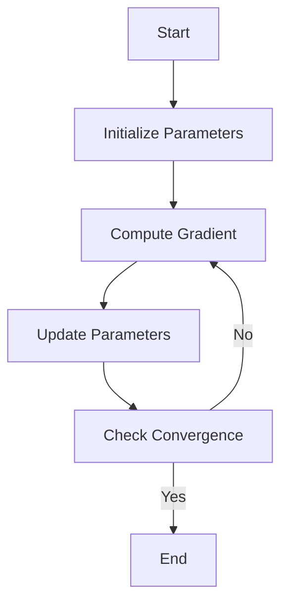

> [!summary] **Document Summary**
> This note provides a comprehensive overview of Gradient Descent (GD), a fundamental optimization algorithm in machine learning. It covers the core principles of GD, its mechanics, the role of the learning rate, and advanced techniques such as momentum and stochastic gradient descent (SGD). The note also discusses the importance of differentiability, stationary points, and the challenges of non-convex optimization in deep learning.

## Gradient Descents: Fundamentals, Mechanics, and Optimization Techniques in Machine Learning

---

### Gradient Descent (GD) Fundamentals

Gradient Descent is a **first-order** iterative algorithm used to find the minimum of a function, such as a loss function in machine learning. It operates on the core principle of continuously moving in the direction of the greatest decrease of the function's value.

**Image Description:** A three-dimensional visualization of a loss landscape, which is typically non-convex. The plot shows hills representing high loss and valleys representing low loss. A path, represented by a black line, traces the trajectory of the algorithm as it follows the steepest downward slope toward a local minimum.

**Procedure:**
1. Start by selecting an initial parameter vector $\Theta^{(0)}$ at an arbitrary point in the parameter space.
2. Iteratively calculate the new parameter vector: $\Theta^{(t+1)} = \Theta^{(t)} - \alpha \nabla l_{\Theta}(\Theta)$, where $\nabla l_{\Theta}(\Theta)$ is the gradient and $\alpha$ is the learning rate.
3. The process terminates when a minimum is reached, characterized by a near-zero gradient.

---

### The Step-by-Step Mechanics of Gradient Descent

The iterative update is defined by the formula: $$x^{(t+1)} = x^{(t)} - \alpha \nabla f(x^{(t)})$$

**Image Description:** A series of visualizations showing the optimization process:
1. A 3D surface plot defining the function $f(x, y)$.
2. A 2D contour map (isocurves) of the same surface.
3. A 2D map overlaid with a red vector field showing the direction of the negative gradient $(-\nabla f)$, which indicates the direction of steepest descent. The initial plots show the full landscape, while subsequent plots focus on the red path tracing the iterative steps. The steps are initially large and then visibly diminish as the path approaches the minimum, reflecting the decreasing magnitude of the gradient near convergence.

---

### The Gradient's Fundamental Role and Orthogonality

A core property of the gradient is its relationship to the function's contours: the gradient vector $\nabla f$ is fundamentally **orthogonal** (perpendicular) to the level curves or level surfaces (isocurves) at any given point. This means the direction of steepest ascent is always normal to the line of constant function value. Consequently, the directional derivative along an isocurve is **zero**, mathematically expressed as $(\nabla f, \mathbf{v}) = 0$ for a tangent vector $\mathbf{v}$.

**Image Description:** A zoomed-in 2D contour plot illustrating this property. The vector representing the gradient is drawn perpendicular to the contour line at a point $\mathbf{x}$, while the negative gradient vector points inward towards the minimum.

---

### The Requirement for Differentiability

The Gradient Descent algorithm is predicated on the calculation of the gradient, thus requiring the loss function $f$ to be **differentiable** at all points. A necessary condition for this is that the function must possess a **continuous gradient**. Functions can have partial derivatives everywhere yet still be non-differentiable if the gradient itself is discontinuous. For instance, the example function $f(x, y) = \frac{x^{2} y}{x^{2}+y^{2}}$ has defined partial derivatives everywhere but is non-differentiable at the origin due to discontinuity.

**Image Description:** A 3D wireframe plot illustrating the function $f(x, y)$, which shows a sharp, non-smooth crease at the origin, visually confirming its point of non-differentiability.

---

### The Nature of Stationary Points

Gradient Descent terminates, or "gets stuck," at **stationary points**, which are locations in the parameter space where the gradient is zero ($\nabla f = 0$). It is crucial to note that a stationary point is not necessarily a true local minimum; it can be a local maximum or, more commonly in high-dimensional spaces, a **saddle** point. Furthermore, the specific stationary point reached by the optimization process is highly dependent on the starting position, or **initialization**, of the parameters.

**Image Description:** A contour plot overlaid with a gradient field, which clearly distinguishes between a "**saddle**" point (where gradients pull in and push out along different axes) and a true "**local min**" basin.

---

### The Critical Role of the Learning Rate ($\alpha$)

The parameter $\alpha > 0$ is the **learning rate**, dictating the effective size of each step taken by the algorithm. The actual length of a step is proportional to the product of $\alpha$ and the magnitude of the gradient: $\alpha\|\nabla f\|$.
* A value that is too **small** leads to sluggish convergence.
* A value that is too **large** results in **overshooting**, causing the optimization to oscillate or even diverge.
* The **optimal $\alpha$** minimizes the function along the current search direction: $\arg \min_{\alpha} f(\mathbf{x}^{(t)} - \alpha \nabla f(\mathbf{x}^{(t)}))$. This optimal step can be approximated using **line search** algorithms.

**Image Description:** Three contour plots comparing the resulting trajectories for "small $\alpha$" (slow, cautious movement), "large $\alpha$" (erratic, oscillating movement), and "**optimal $\alpha$**" (efficient, fast convergence).

---

### Acceleration Techniques: Decay and Momentum

To improve convergence, the learning rate can be controlled using a **decay schedule**. More advanced techniques incorporate a concept known as **Momentum**. Momentum accelerates the descent by incorporating a fraction ($\lambda$) of the previous velocity $\mathbf{v}^{(t)}$, dampening oscillations and helping the optimizer traverse flat regions or escape shallow local minima more effectively:
$$\mathbf{v}^{(t+1)} = \lambda \mathbf{v}^{(t)} - \alpha \nabla f(\mathbf{x}^{(t)})$$
$$\mathbf{x}^{(t+1)} = \mathbf{x}^{(t)} + \mathbf{v}^{(t+1)}$$
These principles, when generalized, form the basis for powerful adaptive optimization algorithms such as ADAM, AdaGrad, etc.

**Image Description:** A contour plot illustrating the efficient, smooth trajectory of Momentum in a narrow valley compared to the slow, zig-zagging path of basic SGD.

---

### Gradient Descent in Deep Learning (DL)

In the context of Deep Learning, the loss functions are typically **non-convex** with millions of parameters. A crucial consideration is that we often prioritize solutions that provide strong **generalization** over finding the literal global optimum. Gradient-based optimization is employed to find suitable parameter values ($\theta_{i} \leftarrow \theta_{i} - \alpha \frac{\partial l}{\partial \theta_{i}}$) because it offers better **efficiency** and **numerical stability** compared to other methods, even when confronting the challenges of non-convexity and potential non-differentiability.

---

### Stochastic Gradient Descent (SGD)

Full Gradient Descent requires computing the gradient over all $n$ training examples, which is computationally prohibitive for large datasets. **Stochastic Gradient Descent (SGD)** addresses this by approximating the true gradient $\nabla l_{\Theta}(T)$ using a much smaller, randomly sampled subset of the data called a **mini-batch** $\mathcal{B}$ ($m \ll n$).

**Update**: $\Theta \leftarrow \Theta - \alpha \nabla l_{\Theta}(\mathcal{B})$.

**Key Aspects**:
* SGD provides a huge **speed-up** because the cost per step is constant (only $O(d)$ for parameters) regardless of the dataset size $n$.
* Asymptotic bounds show SGD's convergence rate is independent of $n$, contributing to better **generalization**.
* **Behavior**: The random sampling introduces noise, causing the optimization path to **oscillate** and preventing perfect convergence to the exact minimum. However, it quickly finds a very **low loss value** which is usually sufficient.

**Image Description:** Plots illustrating the chaotic, noisy path of SGD near the minimum (oscillation) and the divergence between SGD's quick initial progress and the high computational cost of full GD.

