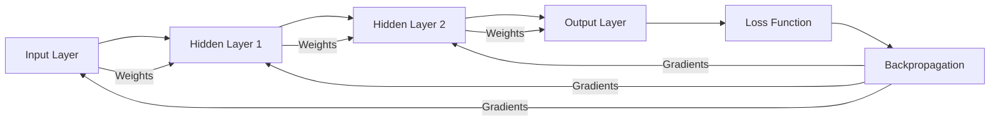
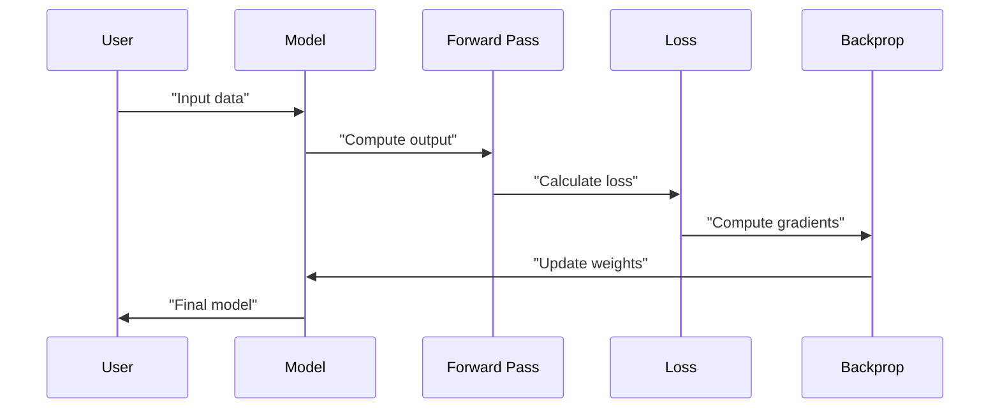
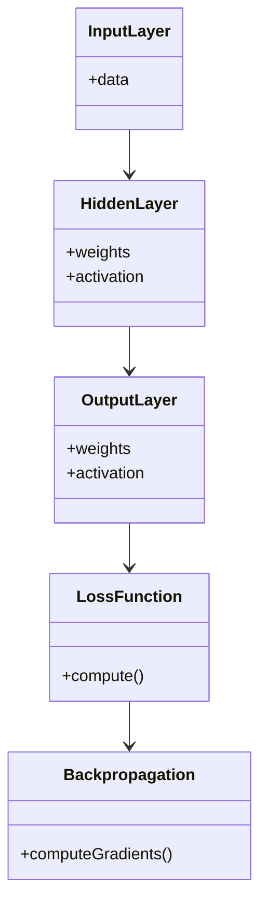

> [!summary] **Document Summary**
> This note explores the foundational concepts of deep learning, including the Perceptron, Logistic Regression, Multi-Layer Perceptron (MLP), computational graphs, automatic differentiation, and backpropagation. It discusses the limitations of the Perceptron, the improvements introduced by Logistic Regression, the architecture and universality of MLPs, and the computational challenges in training deep networks. The note also explains the role of computational graphs and automatic differentiation in enabling efficient gradient computation, with a focus on reverse mode AD (backpropagation) for deep learning.

## Deep Learning Models and Backpropagation: Perceptron, Logistic Regression, MLP, Computational Graphs, Automatic Differentiation, and Backpropagation

### The Perceptron and its Fundamental Limitations

The Perceptron, an early model of an artificial neuron, functions as a **linear classifier** by applying a step function to the weighted sum $\mathbf{w} \cdot \mathbf{x}$. Its update rule is $\mathbf{w} \leftarrow \mathbf{w} + y^{*} \cdot \mathbf{x}$ for misclassified points.

**Core Results**: It is guaranteed to converge in a finite number of steps ($\leq 1/\gamma^2$ mistakes) only if the data is **linearly separable**.

**Limitations**: It fails completely on non-linearly separable problems (famously the **XOR problem**) and yields poor **generalization** by finding low-margin "barely" separating solutions. It is also prone to **overfitting** during extended training.

**Image Description:** The classic XOR plot and a graph illustrating the harmful drop in test accuracy due to overfitting.

### Improving with Logistic Regression (LR)

The Perceptron is fundamentally improved by replacing the non-differentiable step function with the smooth, probabilistic **Sigmoid** activation $\phi(z) = \frac{1}{1 + e^{-z}}$. This forms **Logistic Regression (LR)**, which maps the linear score $z$ to a probability in $(0, 1)$. For multiple classes, the **Softmax** function is used. Optimal weights are found by training the model to maximize the data's likelihood (**Maximum Likelihood Estimation**).

**Image Description:** Graphs comparing the abrupt Step function with the continuous Sigmoid function, and a visualization of Softmax-defined multiclass regions.

### Multi-Layer Perceptron (MLP) Architecture

The **Multi-Layer Perceptron (MLP)**, a **deep feed-forward network**, is constructed by composing linear transformations ($f$) with non-linear **activation functions** ($\sigma$):
$$g_{\Theta}(\mathbf{x}) = (\sigma \circ f_{\Theta_{n}}) \circ \cdots \circ (\sigma \circ f_{\Theta_{1}})(\mathbf{x})$$
The use of non-linear $\sigma$ (e.g., **ReLU** $\max\{0, x\}$) is what allows the network to learn non-linear relationships. MLPs are theoretically **universal** approximators, but their massive number of parameters creates significant practical challenges for generalization and efficient optimization.

### Multi-Layer Perceptron (MLP) Architecture

The **Multi-Layer Perceptron (MLP)**, a **deep feed-forward network**, is constructed by composing linear transformations ($f$) with non-linear **activation functions** ($\sigma$):
$$g_{\Theta}(\mathbf{x}) = (\sigma \circ f_{\Theta_{n}}) \circ \cdots \circ (\sigma \circ f_{\Theta_{1}})(\mathbf{x})$$
The use of non-linear $\sigma$ (e.g., **ReLU** $\max\{0, x\}$) is what allows the network to learn non-linear relationships. MLPs are theoretically **universal** approximators, but their massive number of parameters creates significant practical challenges for generalization and efficient optimization.

### MLP Layer Structure and Interpretation

Each layer transforms the input into an intermediate **hidden representation**: $\mathbf{x}_{\ell+1} = \sigma_{\ell}(\mathbf{W}_{\ell} \mathbf{x}_{\ell} + \mathbf{b}_{\ell})$.
*   The parameters consist of weight matrices $\mathbf{W}_{\ell}$ and bias vectors $\mathbf{b}_{\ell}$.
*   Each row of $\mathbf{W}$ can be interpreted as a distinct **neuron** or **hidden unit** acting in parallel.
*   While hidden layers are non-linear, the final layer is often **linear** (or uses softmax/sigmoid) to produce the final output mapping from $\mathbb{R}^p$ to $\mathbb{R}^q$.

### Universality and ReLU Networks

For MLPs using the **ReLU** activation, the output function is **piecewise-linear**, composed of multiple linear regions. The formal power of MLPs is enshrined in the **Universal Approximation Theorem (UAT)**: an MLP (even with one hidden layer) can approximate any continuous function to arbitrary accuracy, provided the number of neurons ($q$) is sufficiently large. However, this proof is **not constructive**, meaning it doesn't provide the algorithm to find these weights.

**Image Description:** A 3D plot of the faceted surface of a piecewise-linear ReLU network and a 2D plot showing the partitioning of the input space.

### The Gradient Computation Bottleneck in Training

Training involves minimizing a loss function $\ell_{\Theta}$ (like MSE) w.r.t. the network weights $\Theta$. $\ell_{\Theta}$ is generally **non-convex**.
The **Bottleneck** for deep networks is the efficient computation of the gradient $\nabla \ell_{\Theta}$. Manual calculation is impossible, and numerical methods like finite differences are too slow, underscoring the need for an automated, fast method.

### Computational Graphs (CG)

The computation of any complex function $f(\mathbf{x})$ can be represented as a **Computational Graph** (a DAG) linking input, intermediate variables, and operations. This structure is key to efficient differentiation. Function evaluation corresponds to a **forward traversal** of the graph.

**Image Description:** A series of diagrams showing the systematic breakdown of complex mathematical expressions into interconnected nodes and operations (a computational graph).

### Automatic Differentiation (AD)

Automatic Differentiation calculates numerical derivatives exactly by applying the chain rule to the CG. There are two primary modes:
*   **Forward Mode AD**: Efficient for calculating $\frac{\partial f}{\partial x}$ (one input, many outputs), but inefficient for finding the full gradient $\nabla f$ in DL (many inputs, one output).
*   **Reverse Mode AD**: Computes all partial derivatives w.r.t. the **inner nodes** in an efficient **backward pass** after a forward pass. This is optimal for the DL scenario of $f: \mathbb{R}^p \rightarrow \mathbb{R}^1$.

### Back-Propagation (Backprop)

**Back-propagation** is the specific name for **Reverse Mode AD** when applied to the computational graph of a neural network's loss function.
*   It computes the gradient $\nabla \ell$ by multiplying layer Jacobians backwards (right-to-left): $\nabla \ell = (((\mathbf{J}_{t-1}\mathbf{J}_{t-2})\cdots)\mathbf{J}_{1}$.
*   This method is computationally efficient, having a cost proportional to the cost of just evaluating the loss function $\ell$.
*   Backprop is a sophisticated **computational technique** that efficiently traverses the graph to deliver the required gradient.

### Summary of Training Challenges

Effective deep network training is a persistent challenge due to:
*   The loss function being both **non-convex** and frequently **non-differentiable** (e.g., at the corner of ReLU).
*   Multiple **local minima** where the algorithm can get stuck, with the initial weights determining the final outcome.
*   The risk that the mathematically optimal solution leads to detrimental **overfitting**.
*   The constant presence of **numerical issues** in software implementations.

