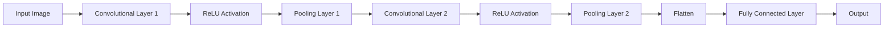

> [!summary] **Document Summary**
> This note explores the role of structural priors in improving the performance of Convolutional Neural Networks (CNNs). It discusses the limitations of standard neural networks, the importance of data structure, and how CNNs exploit hierarchical, local, and translation-invariant properties of data. The note also covers the convolution operation, CNN architecture, and practical considerations like stride, padding, and pooling.

## Advanced Machine Learning: Leveraging Structural Priors with Convolutional Neural Networks

### **The Need for Priors in Neural Networks**

**Neural Network Basics:** A standard neural network is composed of layers of neurons interconnected by weights (parameters). The output of a layer is calculated by applying an activation function (like `ReLU`, `max(0, x)`) to the weighted sum of its inputs.

**Universal Approximation Theorem:** Feed-forward networks are theoretically "universal approximators" (they can approximate any function), but this flexibility comes at a cost:
- They can become **arbitrarily complex**.
- The number of **parameters** can be huge.
- They are **difficult to optimize** and struggle to achieve good **generalization** on new, unseen data.

**Priors:** To address these issues, we need to introduce **priors**, which are assumptions about the nature of the data. Ideally, these priors should not be task-specific but should instead derive from the intrinsic structure of the data itself.

### Structure as a Strong Prior**

**Internal Structure of Data:** Real-world data, such as images, is not random noise but possesses a strong **internal structure**. This structure manifests in terms of repeating patterns, compositionality, and locality.

**Example:** An image of a landscape or a city contains recognizable shapes, lines, and textures. This inherent structure is valuable information that can be exploited, as demonstrated by the ability to solve a jigsaw puzzle: even when the pieces are scrambled, the original structure of the image allows it to be reassembled.

### Types of Structural Priors in Data**

**Self-Similarity:** Data tends to be similar to itself across its domain. In an image, the texture of a fabric or the striped pattern of clothing are examples of repeating visual motifs. This property is used in image editing algorithms like PatchMatch to remove objects and plausibly fill in the background.

**Translation Invariance:** The semantic content of an image does not change if the objects within it are moved. A cat is still a cat, regardless of its position in the frame. Therefore, an ideal model should produce the same output (e.g., classification) even if the object of interest is translated.

**Hierarchy and Compositionality:** Visual structures are hierarchical. At a low level (scale 1), we find simple features like edges and corners. At an intermediate level, these combine to form more complex parts like eyes, noses, or wheels. At a high level (scale n), these parts compose complete objects like faces or cars. We want our model to recognize these features at every scale, regardless of their location.

### **Introduction to Convolutional Neural Networks (CNNs)**

**CNNs:** CNNs are models specifically designed to leverage these priors of hierarchy, locality, and shift-invariance. They achieve this by replacing "fully-connected" layers with convolutional layers, which are based on two principles:
1. **Sparse Interaction:** Output neurons are connected only to a small, local region of the input, rather than to all input neurons.
2. **Weight Sharing:** The same set of weights (a filter) is applied across different locations in the input, allowing the model to detect the same feature wherever it appears.

### **The Convolution Operation and its Properties**

**Convolution Operation:** The core of a CNN is the **convolution** operation. Given two functions, their convolution produces a third function (the **feature map**) that expresses how the shape of one (the **kernel** or filter) modifies the other. Visually, it can be understood as sliding a flipped kernel along the input and calculating the integral of the pointwise product at every position.

**Mathematical Properties of Convolution:**
- **Commutativity:** $f * g = g * f$.
- **Shift-Equivariance:** This is the most crucial property for CNNs. It means that shifting the input and then applying the convolution yields the same result as applying the convolution and then shifting the output. The convolution and translation operators "commute." This ensures that the representation of features moves along with the objects in the image.
- **Linearity:** Convolution is a linear operator.

### **CNNs in Practice: Layers, Filters, and Pooling**

**CNN Architecture:** In the context of discrete data like digital images (2D), convolution is interpreted as a **sliding window (filter)** that moves across the image to compute the values of the output feature map.

**Types of Layers:**
- **Convolutional Layer:** Applies a set of filters to the input to produce feature maps. These filters are the parameters the network learns. **Local filters** and weight sharing lead to a massive reduction in parameters compared to MLPs.
- **Activation Function (e.g., ReLU):** Adds non-linearity after each convolution.
- **Pooling Layer:** Reduces the spatial dimensions of the feature maps (downsampling). **Max Pooling**, for example, takes the maximum value from a small window (e.g., 2x2), making the representation more compact and introducing invariance to small translations. This allows subsequent layers to have larger receptive fields and capture non-local interactions.

**Hierarchical Feature Learning:** This hierarchical approach allows the network to learn **progressively more complex features**: early layers learn to recognize edges and colors, middle layers learn parts of objects, and final layers learn whole objects.

### **Anatomy of a Convolutional Layer**

**Convolutional Layer Operation:** Unlike a fully-connected layer, which flattens a 32x32x3 image into a 3072x1 vector, a convolutional layer **preserves the spatial structure**. The operation proceeds as follows:
1. A **filter** is defined (e.g., 5x5x3). Its depth must always match the depth of the input volume.
2. The filter is slid (**convolved**) across all spatial locations of the input image.
3. At each location, a dot product is computed between the filter's weights and the underlying input values, producing a single number.
4. The collection of these numbers forms a 2D **activation map**.
5. By using multiple filters (e.g., 6 filters of size 5x5x3), multiple activation maps are generated, which are then stacked to form a new output **volume** (e.g., 28x28x6).

### **Managing Spatial Dimensions: Stride and Padding**

**Output Size Formula:** The output size of a convolutional layer depends on:
- $N$: Input size.
- $F$: Filter size.
- $S$ (Stride): The step size with which the filter moves.
- $P$ (Padding): The number of pixels (usually zeros) added to the border of the input.

The formula is: $$\text{Output} = \frac{N - F + 2P}{S} + 1$$
- Without padding, feature maps **shrink** at every layer.
- A **stride > 1** further reduces dimensions (downsampling).
- **Padding** is the common solution to preserve spatial dimensions. A common practice for preserving size with a stride of 1 is to use a padding of $P = \frac{F - 1}{2}$ (e.g., for a 3x3 filter, use 1 pixel of padding).

### **Receptive Fields and 1x1 Convolutions**

**Receptive Field:** The **receptive field** is the region of the original input image that influences a single neuron in a given layer. With each successive convolutional layer, the receptive field grows, allowing deeper neurons to "see" larger portions of the image. For large images, many layers (or downsampling via pooling) are needed for the receptive field to cover the entire image.

**1x1 Convolutions:** A filter of size 1x1x(input_depth) performs a dot product across all channels for every single pixel. They are primarily used to change the depth of a volume without altering its spatial dimensions.

### **Practical Summary and Common Settings**

**Example Calculation:**
- **Input:** 32x32x3; **Layer:** 10 filters of size 5x5, stride 1, pad 2.
- **Output:** $\frac{32 - 5 + 2 \times 2}{1} + 1 = 32$. The output size will be **32x32x10**.
- **Parameters:** $(5 \times 5 \times 3 \text{ weights} + 1 \text{ bias}) \times 10 \text{ filters} = 760$.

**Common Settings for Conv Layers:**
- **K (num filters):** Powers of 2 (e.g., 32, 64, 128).
- **F=3, S=1, P=1** (preserves size).
- **F=5, S=1, P=2** (preserves size).

**Pooling Layer Summary:**
- **Purpose:** To reduce dimensions and make the representation more manageable and invariant.
- **Hyperparameters:** Filter size (F) and Stride (S).
- **Common settings:** F=2, S=2 (halves the dimensions).
- It has no learnable parameters and padding is not typically used.

### **Visualization of a Full CNN**

**CNN Visualization:** A final visualization shows the flow of an image (a car) through a CNN. One can observe how the initial layers (CONV+RELU) extract simple, low-level features. As the data passes through the network (interspersed with POOL layers), the activation maps become spatially smaller but represent increasingly abstract and complex features. Finally, a Fully-Connected (FC) layer interprets these high-level features to produce the final classification (in this case, "car").

