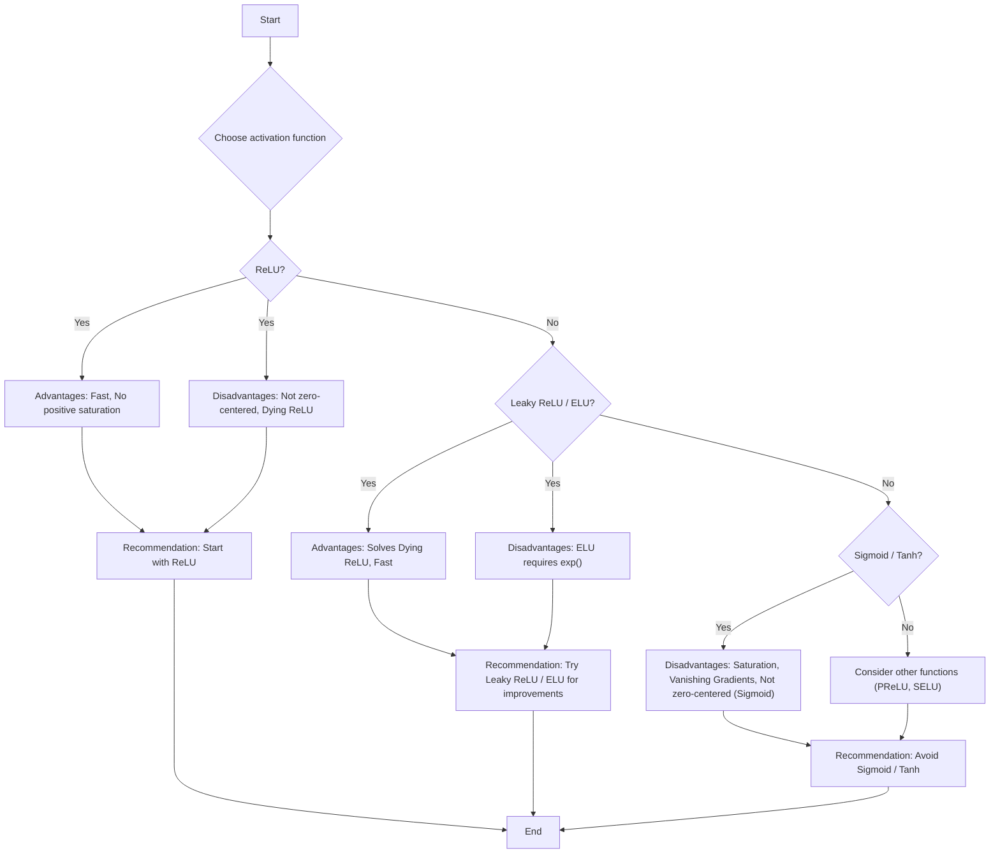

> [!summary] **Document Summary**
> This document provides a comprehensive overview of neural network training, covering initial setup (activation functions, preprocessing, weight initialization, regularization), learning dynamics (learning rate schedules, hyperparameter optimization), and post-training strategies (ensemble, transfer learning) to maximize model efficiency and performance.

## Training Neural Networks: Overview

This document delves into the setup, dynamics, and optimization of training neural networks.

### 1. Initial Setup

The initial setup phase lays the foundation for efficient neural network training. It includes choosing activation functions, data preparation, weight initialization, and applying regularization techniques.

#### Activation Functions

[[Activation Functions|Activation functions]] are crucial for introducing non-linearity into a neural network, allowing the model to learn complex relationships in the data. Without them, a neural network would simply be a series of linear transformations, incapable of modeling non-linear patterns.

-   **Sigmoid**
    -   **Function**: Squashes numbers into the range $[0, 1]$. Its formula is $f(x) = \frac{1}{1 + e^{-x}}$.
    -   **Historical Use**: It was historically popular, especially in early neural networks.
    -   **Problems**:
        1.  **Saturated neurons "kill" gradients**: When the input $x$ is very large (positive or negative), the derivative of the sigmoid function becomes extremely small, close to zero. This phenomenon, known as **vanishing gradient**, prevents weight updates from propagating effectively through the network, slowing down or stopping learning.
            Example: If $x = 10$, $f(10) \approx 0.99995$. If $x = -10$, $f(-10) \approx 0.000045$. In both cases, the slope is almost flat.
        2.  **Output not zero-centered**: The outputs of the sigmoid function are always positive (between 0 and 1). If the inputs to a neuron are always positive, the gradients for the weights $w$ will all be positive or all negative. This forces weight updates to follow a "zig-zag" path in the parameter space, making optimization less efficient. Mini-batches can partially mitigate this problem, as gradients are calculated over a subset of the data.
            Example: Imagine you want to update two weights $w_1$ and $w_2$. If all gradients are positive, you can only move in directions like $(+,+)$ or $(+,-)$, but you cannot move freely in all four gradient directions.
        3.  `exp()` is computationally expensive compared to other simpler operations.

-   **tanh(x)** (Hyperbolic tangent)
    -   **Function**: Squashes numbers into the range $[-1, 1]$. Its formula is $f(x) = \frac{e^x - e^{-x}}{e^x + e^{-x}}$.
    -   **Benefit**: Outputs are zero-centered, which helps solve the "zig-zag" path problem seen with sigmoid.
    -   **Problem**: Similar to sigmoid, it suffers from the vanishing gradient problem when neurons are saturated (for very large or very small values of $x$).

-   **ReLU (Rectified Linear Unit)**
    -   **Function**: Calculates $f(x) = \max(0, x)$. This means the output is $x$ if $x > 0$ and $0$ if $x \le 0$.
    -   **Benefits**:
        -   **No saturation in the positive region**: For $x > 0$, the gradient is constant and equal to 1, avoiding the vanishing gradient problem.
        -   **Computationally efficient**: The $\max(0, x)$ operation is much faster to compute than `exp()`.
        -   **Faster convergence**: Networks using ReLU tend to converge much faster (e.g., 6 times faster) than those using sigmoid or tanh.
        -   **More biologically plausible**: Some research suggests that the "on-off" behavior of ReLU is more similar to neuronal activation in the brain.
    -   **Disadvantages**:
        -   **Output not zero-centered**: Similar to sigmoid, outputs are always non-negative (0 or positive), which can lead to zig-zag optimization paths.
        -   **The "Dying ReLU" Problem**: For $x < 0$, the gradient is zero. If a weight update causes the input of a ReLU neuron to be always negative, that neuron will stop activating and its gradient will always be zero. Consequently, the neuron will no longer learn, becoming "dead."
            Example: If a neuron receives an input of $-5$, its output is $0$. If weights are updated so that the input remains always negative, the neuron will never contribute to gradient backpropagation.
        -   **Mitigation**: A common technique is to initialize biases with slightly positive values (e.g., $0.01$). This ensures neurons have a higher probability of activating initially, avoiding immediate death.

-   **Leaky ReLU**
    -   **Function**: Calculates $f(x) = \max(\alpha x, x)$, where $\alpha$ is a small positive value (e.g., $0.01$). For $x > 0$, the output is $x$; for $x \le 0$, the output is $\alpha x$.
    -   **Benefits**:
        -   **No saturation**: Maintains ReLU benefits in the positive region.
        -   **Computationally efficient**: The operation is still simple and fast.
        -   **Faster convergence**: Like ReLU, it converges faster than sigmoid/tanh.
        -   **No "dying" for $x < 0$**: By introducing a small slope ($\alpha$) for negative inputs, the gradient is never zero, solving the "Dying ReLU" problem.
            Example: If $\alpha = 0.01$ and the input is $-5$, the output is $0.01 \times -5 = -0.05$. The gradient for $x < 0$ is $\alpha$, not $0$.

-   **Parametric Rectifier (PReLU)**
    -   **Variant of Leaky ReLU**: In PReLU, the parameter $\alpha$ is not a fixed value but a parameter learned by the network during training. This allows the network to adapt the slope for negative inputs based on the data.

-   **Exponential Linear Units (ELU)**
    -   **Function**: Calculates $f(x) = x$ for $x > 0$ and $f(x) = \alpha (e^x - 1)$ for $x \le 0$. Often $\alpha=1$.
    -   **Benefits**:
        -   **All benefits of ReLU**: Does not saturate in the positive region and is efficient.
        -   **Outputs closer to zero mean**: The negative region allows outputs to have a mean closer to zero than ReLU or Leaky ReLU.
        -   **Robustness to noise**: The saturation in the negative region (for $x \ll 0$, $e^x - 1 \approx -1$, so $f(x) \approx -\alpha$) makes the function more robust to noise than Leaky ReLU.
    -   **Problem**: Requires the calculation of `exp()`, making it slightly more expensive than ReLU/Leaky ReLU.

-   **General rule for activation functions**:
    -   **Use `ReLU`**: It is the standard starting point and offers excellent performance.
    -   **Try `Leaky ReLU` / `ELU` (or `SELU`)**: These can offer marginal performance improvements, especially in deeper networks or when the "Dying ReLU" problem is present.
    -   **Avoid `sigmoid` or `tanh`**: Unless there are specific reasons (e.g., binary output for sigmoid), they are generally discouraged due to saturation and vanishing gradient problems.



#### Data Preprocessing

Data preprocessing is the crucial first step in preparing data for training, ensuring it is in an optimal format for the neural network.

-   **General Principles**:
    -   **Assumption**: It is assumed that $X$ is a data matrix of size $[N \times D]$, where $N$ is the number of examples and $D$ is the dimensionality of each example (each row represents an example).
    -   **Zero-mean data**: It is essential to center the data around zero. Non-zero-centered inputs lead to "zig-zag" optimization paths for the weights, making training less efficient.
        Example: If all pixel values of an image are positive, the gradient for all weights in a layer will be either all positive or all negative, limiting the update directions.

-   **Advanced Techniques (less common for images)**:
    -   `PCA (Principal Component Analysis)`: Transforms the data so that its covariance matrix is diagonal, removing linear correlations between features.
    -   `Whitening`: Not only diagonalizes the covariance matrix but also scales it so that it becomes an identity matrix, making features uncorrelated and with unit variance.

-   **General rule for images (e.g., CIFAR-10 images $[32, 32, 3]$)**:
    -   **Centering only**: For images, variance normalization, PCA, or whitening are rarely used. Common practice focuses on data centering.
    -   **Common methods**:
        -   **Mean image subtraction (e.g., `AlexNet`)**: The mean image (an array $[32, 32, 3]$ of mean pixels over the entire dataset) is calculated and subtracted from each image.
            Example: If the pixel $(x,y)$ in the red channel has a mean of $120$ across all images, every red pixel $(x,y)$ of every image will be reduced by $120$.
        -   **Per-channel mean subtraction (e.g., `VGGNet`)**: Three numbers are calculated: the mean pixel for the red channel, for the green channel, and for the blue channel. These three mean values are then subtracted, respectively, from all pixels of that channel in every image.
            Example: If the mean of the red channel is $120$, the mean of the green channel is $110$, and the mean of the blue channel is $100$, then all red pixels are reduced by $120$, all green pixels by $110$, and all blue pixels by $100$.
        -   **Per-channel mean subtraction and division by per-channel standard deviation (e.g., `ResNet`)**: In addition to subtracting the three channel means, pixels are also divided by the three channel standard deviations. This normalizes the data so that each channel has zero mean and unit standard deviation.
            Example:
            Let $X_{ijk}$ be the pixel value at row $i$, column $j$ in channel $k$.
            Let $\mu_k$ be the mean of pixels in channel $k$ over the entire dataset.
            Let $\sigma_k$ be the standard deviation of pixels in channel $k$ over the entire dataset.
            The normalized value $\hat{X}_{ijk}$ will be:
            $$\hat{X}_{ijk} = \frac{X_{ijk} - \mu_k}{\sigma_k}$$
            This is an example of standardization.

```
import numpy as np

# Example of preprocessing for images (RGB 32x32 images)
# Assume 'images' is a NumPy array of shape (N, 32, 32, 3)
# where N is the number of images.

# 1. Per-channel mean subtraction (VGGNet-style)
def subtract_per_channel_mean(images):
    # Calculate the mean for each channel across all images
    # images.shape = (N, H, W, C) -> mean_pixel.shape = (C,)
    mean_pixel = np.mean(images, axis=(0, 1, 2))
    # Subtract the mean from each channel of every image
    images_centered = images - mean_pixel
    return images_centered, mean_pixel

# 2. Per-channel mean subtraction and division by standard deviation (ResNet-style)
def normalize_per_channel(images):
    # Calculate the mean and standard deviation for each channel
    mean_pixel = np.mean(images, axis=(0, 1, 2))
    std_pixel = np.std(images, axis=(0, 1, 2))
    # Avoid division by zero
    std_pixel[std_pixel == 0] = 1e-7
    
    # Normalize the data
    images_normalized = (images - mean_pixel) / std_pixel
    return images_normalized, mean_pixel, std_pixel

# Example usage:
# images_data = np.random.rand(100, 32, 32, 3) * 255 # Example data
# images_centered, means = subtract_per_channel_mean(images_data)
# images_normalized, means, stds = normalize_per_channel(images_data)

# print(f"Means per channel after centering: {np.mean(images_centered, axis=(0,1,2))}")
# print(f"Means per channel after normalization: {np.mean(images_normalized, axis=(0,1,2))}")
# print(f"Standard deviations per channel after normalization: {np.std(images_normalized, axis=(0,1,2))}")
```
#### Weight Initialization

Weight initialization is a critical aspect of training deep neural networks, as poor initialization can prevent learning or significantly slow it down.

-   **Problem with $W=0$ initialization (and $b=0$)**: If all weights $W$ and biases $b$ in a layer are initialized to zero, all neurons in that layer will calculate the same output for the same input. Consequently, they will receive the same gradients during backpropagation and update identically. This prevents neurons from learning different features and reduces the expressive capacity of the network.
    Example: In a layer with 100 neurons, if all start at zero, all 100 neurons will become clones of each other.

-   **Small random numbers**:
    -   **Idea**: Initialize weights by sampling them from a Gaussian distribution with zero mean and a small standard deviation (e.g., $1e-2$). This breaks symmetry.
    -   **Problem**: While it works for small, shallow networks, in deeper networks it can cause problems. Activations can all become zero (vanishing) or explode (diverging) as they propagate through the layers, making training unstable.
        Example: If weights are too small, the output of each layer will become progressively smaller, eventually tending toward zero. If weights are too large, the output will explode.

-   **Appropriate Initialization**: This is an active research area with significant contributions from:
    -   `Glorot and Bengio (2010)`: Introduced Xavier/Glorot initialization.
    -   `Saxe et al (2013)`: Proposed initializations that preserve gradient norms.
    -   `He et al (2015)`: Developed He (or Kaiming) initialization, specific for ReLU.
    -   `Mishkin and Matas (2015)`: Proposed MSRA initialization.

-   **General Rule**:
    -   Use `Xavier` (or Glorot) initialization for networks using the `tanh` activation function. This initialization scales weights based on the number of input and output neurons, aiming to keep the variance of activations and gradients constant across layers.
        Formula for Xavier: Weights are sampled from a uniform distribution $U(-\sqrt{6/(n_{in} + n_{out})}, \sqrt{6/(n_{in} + n_{out})})$ or from a normal distribution with standard deviation $\sqrt{2/(n_{in} + n_{out})}$, where $n_{in}$ is the number of inputs and $n_{out}$ is the number of outputs.
    -   Use `He` (or Kaiming) initialization for networks using the `ReLU` activation function. This is similar to Xavier but accounts for ReLU's nature of blocking half of the activations.
        Formula for He: Weights are sampled from a normal distribution with standard deviation $\sqrt{2/n_{in}}$.

```
import torch
import torch.nn as nn

# Example of weight initialization in PyTorch

# PyTorch's default initialization for Linear layers is usually Kaiming Uniform
# For Conv2d it is Kaiming Uniform or Normal depending on the version and mode.
# It can be overridden.

class MyModel(nn.Module):
    def __init__(self, input_size, hidden_size, output_size):
        super(MyModel, self).__init__()
        self.fc1 = nn.Linear(input_size, hidden_size)
        self.relu = nn.ReLU()
        self.fc2 = nn.Linear(hidden_size, output_size)

        # He (Kaiming) initialization for ReLU
        nn.init.kaiming_normal_(self.fc1.weight, mode='fan_in', nonlinearity='relu')
        nn.init.kaiming_normal_(self.fc2.weight, mode='fan_in', nonlinearity='relu')
        
        # Xavier (Glorot) initialization for tanh
        # self.tanh = nn.Tanh()
        # nn.init.xavier_normal_(self.fc1.weight, gain=nn.init.calculate_gain('tanh'))
        # nn.init.xavier_normal_(self.fc2.weight, gain=nn.init.calculate_gain('tanh'))

    def forward(self, x):
        x = self.fc1(x)
        x = self.relu(x)
        x = self.fc2(x)
        return x

# model = MyModel(input_size=784, hidden_size=256, output_size=10)
# print(model.fc1.weight)
```

#### Regularization

[[Regularization (Machine Learning)|Regularization]] is a set of techniques used to prevent overfitting and improve a model's generalization ability, i.e., its capacity to perform well on new, unseen data.

-   **Common Techniques**:
    -   `L2 Regularization` (Weight decay): Adds a term to the loss function proportional to the sum of the squares of all model weights:
        $$L_{total} = L_{original} + \lambda \sum_i w_i^2$$
        where $\lambda$ is the regularization coefficient. This term penalizes large weights, encouraging the model to use smaller weights and distribute importance across features, reducing model complexity.
        Example: If a weight $w$ becomes very large, the $w^2$ term drastically increases the loss, forcing the model to reduce it.
    -   `L1 Regularization`: Adds a term to the loss function proportional to the sum of the absolute values of all weights:
        $$L_{total} = L_{original} + \lambda \sum_i |w_i|$$
        This term promotes **sparsity**, pushing some weights to become exactly zero. This can be useful for feature selection, as features associated with zero weights are effectively ignored by the model.
    -   `Elastic Net`: Combines the L1 and L2 regularization terms:
        $$L_{total} = L_{original} + \lambda_1 \sum_i |w_i| + \lambda_2 \sum_i w_i^2$$
        It offers the benefits of both: sparsity and reduction of large weights.

-   **Dropout**
    -   **Mechanism**: During training, dropout randomly deactivates some neurons (setting their activations to zero) with a probability $p$ (e.g., $0.5$). This means that for every training iteration and every mini-batch, a different part of the network is used.
    -   **Benefits**:
        -   **Forces redundant representations**: Prevents neurons from "co-adapting" and becoming overly dependent on specific other neurons. Each neuron is forced to learn to contribute robustly, regardless of the presence of other specific neurons.
        -   **Ensemble effect**: Dropout can be interpreted as training a vast ensemble of models with shared parameters. Each "sub-network" (the model with a subset of active neurons) is a different model, and dropout essentially trains many of them simultaneously.
    -   **At test time**:
        -   During training, the output is stochastic (random). To obtain a deterministic and stable output at test time, the effect of dropout must be "averaged."
        -   **Scaling**: At test time, all neurons are active. To make the expected output at test time match the expected output during training, neuron activations must be scaled. If a neuron has a probability $p$ of being deactivated, at test time its activations are multiplied by $(1-p)$ (or divided by $1/p$ depending on the implementation).
        -   **Example**: Consider a neuron with inputs $x_1, x_2$ and weights $w_1, w_2$. If dropout is applied with probability $p$ (probability of *keeping* the neuron active), the deactivation probability is $1-p$.
            -   Training (expected output): $E[y_{train}] = p(w_1 x_1 + w_2 x_2)$ (if $p$ is the probability of *keeping* the neuron).
            -   Test (scaled): $y_{test} = p(w_1 x_1 + w_2 x_2)$. This is achieved by multiplying the neuron's output by $p$ at test time.
        -   **Inverted Dropout**: This is the most common and preferred methodology. Instead of scaling at test time, scaling is applied during training. The activations of the neurons *kept* active are divided by $(1-p)$ (where $p$ is the probability of *deactivation*). This way, no scaling is needed at test time.
            Example: If $p=0.5$ (deactivation probability), active neurons are multiplied by $1/(1-0.5) = 2$.
            ```python
            import torch
            import torch.nn as nn

            # Example of Inverted Dropout in PyTorch
            dropout_prob = 0.5 # Probability of deactivating a neuron

            # During training
            x = torch.randn(10, 100) # Activations of a layer
            # Apply dropout: some elements of x become 0
            # And the remaining ones are scaled by 1/(1-dropout_prob)
            x_dropped = nn.functional.dropout(x, p=dropout_prob, training=True)
            # print(f"Output with dropout (training): {x_dropped}")

            # During test
            # Dropout is not applied and no scaling is needed
            x_test = nn.functional.dropout(x, p=dropout_prob, training=False)
            # print(f"Output without dropout (test): {x_test}")
            ```

-   **Batch Normalization (BN)**
    -   **Mechanism**: Normalizes the activations of intermediate layers. For each dimension of the activations, it calculates the empirical mean and variance over the current mini-batch, then normalizes the activations to a unit Gaussian distribution (mean 0, variance 1).
    -   **Formula**: For the $k$-th dimension (feature) in a mini-batch:
        $$\hat{x}^{(k)} = \frac{x^{(k)} - E[x^{(k)}]}{\sqrt{Var[x^{(k)}] + \epsilon}}$$
        where $E[x^{(k)}]$ is the mini-batch mean for the $k$-th dimension, $Var[x^{(k)}]$ is the mini-batch variance for the $k$-th dimension, and $\epsilon$ is a small value to avoid division by zero.
    -   **Learnable Parameters**: After normalization, the network learns two parameters, $\gamma^{(k)}$ (scale) and $\beta^{(k)}$ (shift), for each dimension $k$. These parameters allow the model to "undo" the normalization if deemed appropriate, potentially recovering the identity mapping.
        $$y^{(k)} = \gamma^{(k)} \hat{x}^{(k)} + \beta^{(k)}$$
    -   **Benefits**:
        -   **Improves gradient flow**: Reduces the "Internal Covariate Shift" problem, making gradients more stable and smoother.
        -   **Allows higher learning rates**: Gradient stabilization allows the use of larger learning rates without divergence issues.
        -   **Reduces dependence on initialization**: Makes the network less sensitive to poor weight initialization.
        -   **Acts as regularization**: The introduction of stochastic noise due to mini-batch statistics has a regularizing effect, reducing the need for dropout.
    -   **Placement**: It is typically placed after fully connected (FC) or convolutional (Conv) layers and before the non-linearity (activation function).
    -   **At test time**: Instead of using mini-batch statistics (which are variable), Batch Normalization uses fixed means and variances, calculated as running averages during training.

    ```mermaid
    flowchart TD
        A["Input Layer"] --> B["Convolutional/FC Layer"];
        B --> C["Batch Normalization"];
        C --> D["Activation Function (e.g., ReLU)"];
        D --> E["Next Layer"];
    ```

-   **Data Augmentation**
    -   **Mechanism**: Artificially increases the size of the training dataset by applying various modifications to existing data. This helps the model be more robust to variations in real-world data.
    -   **Common transformations for images**:
        -   **Horizontal flipping**: Reflects images horizontally.
        -   **Random cropping and scaling**:
            -   **Training**: Randomly sample crops of different sizes and scales.
                Example (ResNet): 1. Randomly choose a size $L$ in the range $[256, 480]$. 2. Resize the shorter side of the image to $L$. 3. Sample a random $224 \times 224$ patch from the resized image.
            -   **Testing**: For more robust evaluation, results are averaged over fixed crops.
                Example (ResNet): 1. Resize the image to 5 different scales: $\{224, 256, 384, 480, 640\}$. 2. For each size, use 10 $224 \times 224$ crops (4 corners + center, plus their horizontally flipped versions).
        -   **Color Jitter (Color variation)**:
            -   **Simple**: Randomly varies the contrast or brightness of the image.
            -   **Complex**: Applies PCA to RGB pixels, samples a "color offset" along the principal components, and adds it to all pixels. This simulates natural lighting variations (e.g., `Krizhevsky et al. 2012`, `ResNet`).
    -   **Creative augmentations**: Translation, rotation, stretching, shearing, lens distortions, etc.

-   **Other Regularization Techniques**:
    -   `DropConnect` (`Wan et al, 2013`): Instead of deactivating entire neurons (like Dropout), DropConnect randomly sets individual connection weights to zero.
    -   `Fractional Max Pooling` (`Graham, 2014`): Uses random, non-overlapping pooling regions, introducing variability.
    -   `Stochastic Depth` (`Huang et al, 2016`): During training, entire layers are randomly "skipped" (deactivated), forcing the remaining layers to learn more robust representations.

-   **Common Regularization Pattern**: Most regularization techniques introduce an element of randomness or stochasticity during training. At test time, this randomness is "averaged out" (e.g., with scaling in dropout, or using running averages in Batch Normalization) to obtain a deterministic and more robust output.

### 2. Training Dynamics

This section focuses on how to monitor and optimize the learning process once the initial setup is complete.

#### Babysitting the Learning Process

"Babysitting" the learning process refers to carefully monitoring and adjusting training parameters, especially the learning rate, to ensure effective convergence.

-   **Learning Rate Schedule**: Defines how the learning rate changes over time during training. The goal is to start with a higher learning rate to quickly explore the parameter space and then gradually reduce it to allow for finer convergence.
    -   **Step decay**: The learning rate is reduced by a fixed factor (e.g., 0.1) at predefined epoch intervals (e.g., every 30 epochs).
    -   **Exponential decay**: The learning rate decreases exponentially with each epoch.
        Example: $\alpha = \alpha_0 e^{-kt}$ where $\alpha_0$ is the initial rate, $k$ is a decay constant, and $t$ is the epoch.
    -   **Cosine annealing**: The learning rate follows a cosine curve, decreasing slowly, then faster, and then slowly again.
        Example:
        ```mermaid
        flowchart TD
            A["Start Training"] --> B{"High Learning Rate"};
            B --> C["Fast Exploration"];
            C --> D{"Gradual Reduction"};
            D --> E["Fine Convergence"];
            E --> F["End Training"];

[[Hyperparameter Optimization|Hyperparameter optimization]] is the process of searching for the best combination of hyperparameters for a given model and dataset.

-   **Hyperparameters to optimize**:
    -   **Network architecture**: Number of layers, number of neurons per layer, filter sizes in convolutional networks.
    -   **Learning rate and decay schedule**: The initial learning rate value, the decay strategy (e.g., step, exponential), and its parameters.
    -   **Optimizer type**: `SGD` ([[Stochastic Gradient Descent|Stochastic Gradient Descent]]), `Adam`, `RMSprop`, etc.
    -   **Regularization strength**: L2 regularization coefficients ($\lambda$), dropout probability ($p$).

-   **Cross-validation**: A common strategy for evaluating model performance with different hyperparameter combinations. The dataset is split into training, validation, and test sets. Hyperparameters are optimized on the validation set.

-   **Hyperparameter sampling**:
    -   **Random sampling**: Generally preferred over grid search. Random sampling explores the hyperparameter space more effectively, especially when only a few hyperparameters are truly influential.
        Example: If one hyperparameter is much more important than another, grid search would waste time exploring many combinations for the less important hyperparameter. Random sampling has a higher probability of finding good values for the influential hyperparameter.
    -   **Logarithmic space sampling**: For hyperparameters that have a multiplicative impact (like the learning rate or L2 regularization strength), it is better to sample values on a logarithmic scale (e.g., $10^{-6}, \dots, 10^{-1}$). This ensures that different orders of magnitude are explored uniformly.
        Example: Instead of trying $0.001, 0.002, 0.003$, try $10^{-3}, 10^{-4}, 10^{-5}$.

    ```mermaid
    flowchart TD
        A["Start Hyperparameter Optimization"] --> B{"Identify Key Hyperparameters"};
        B --> C["Learning Rate"];
        B --> D["Regularization (L2, Dropout)"];
        B --> E["Architecture (Layers, Neurons)"];
        C --> F{"Logarithmic Sampling"};
        D --> F;
        E --> G{"Random Sampling"};
        F --> H["Execute Training with Cross-Validation"];
        G --> H;
        H --> I["Evaluate Performance on Validation Set"];
        I --> J{"Improve Hyperparameters"};
        J --> H;
        J --> K["End Optimization"];
    ```
### 3. Post-Training

This section describes techniques to further improve model performance after training is complete.

#### Model Ensemble

Combining multiple trained models to achieve better overall performance than a single model. The idea is that different models make different mistakes, and their combination can mitigate individual errors.

-   **Mechanism**: Several models (often with different architectures or with different initializations and hyperparameters) are trained on the same dataset. At inference time, their predictions are combined (e.g., by averaging probabilities for classification or outputs for regression, or by voting for the most frequent class).
-   **Benefits**: Reduces variance and improves model robustness.

#### Transfer Learning

Leveraging knowledge acquired by a model trained on one task (or dataset) to improve performance on a related but different task (or dataset).

-   **Mechanism**: A pre-trained model on a very large and general dataset (e.g., ImageNet for image classification) is taken and reused as a starting point for a new task.
    -   **Feature Extractor**: The initial layers of the pre-trained model (which have learned generic features like edges and textures) are used as feature extractors, and only a new classifier ( one or more FC layers) is trained on the new data.
    -   **Fine-tuning**: The final layers (or all layers) of the pre-trained model are also trained on the new data, but with a very low learning rate, to adapt the learned features to the new task.
-   **Benefits**: Significantly reduces training time and resources, especially when the new dataset is small, and improves performance compared to training from scratch.

## Summary

This overview has covered the key aspects of neural network training:

-   **Initial Setup**: Includes choosing activation functions (preferring `ReLU` and its variants), data preprocessing (for images: subtracting the mean per channel or per image), weight initialization (`Xavier` for `tanh`, `He` for `ReLU`), and regularization techniques (`Batch Normalization`, `Dropout`, `Data Augmentation`, `L2`).
-   **Training Dynamics**: Focuses on monitoring the learning process (via `learning rate schedules`) and hyperparameter optimization (using random sampling, often in logarithmic space).
-   **Post-Training**: Describes techniques to further improve the model, such as `model ensembles` and `transfer learning`.